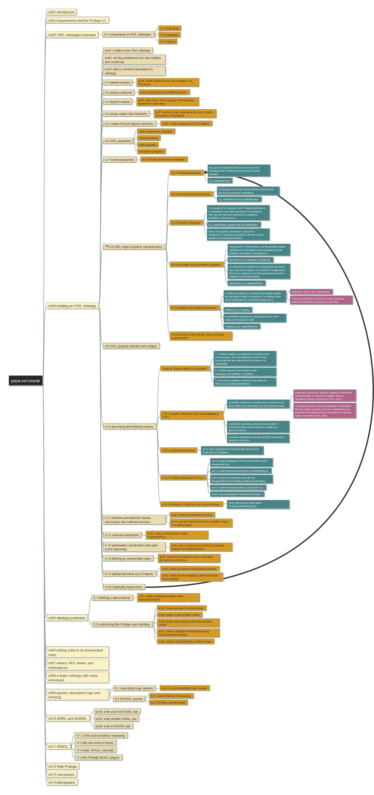

# Ontology: Pizza.owl using Protégé

Practice building pizza.owl ontology using Protege modeling tool, base on [Michael DeBillis](https://www.linkedin.com/in/michael-debellis-85329/)' great guide.

[Here](https://www.michaeldebellis.com/post/protegetutorialyoutubeplaylist) you can find the post by Michael in his site; and the [introduction](https://www.michaeldebellis.com/post/new-protege-pizza-tutorial) of the guide.

## Pizza.OWL Modeling Video List 

Please follow my [Youtube Channel](https://www.youtube.com/channel/UCTshmTJGpJunOz23vCEhzWg).

- [01 - Introduction](https://youtu.be/l0PZhqmTwfM)
- [02 - Practice Guide Document Structure](https://youtu.be/eWx9_zJkiUY)
- [03 - Installing Protege and understand Protege User Interface](https://youtu.be/Q6eq-cWBpfQ)
- [04 - Create new Ontology (exercise 01~03)](https://youtu.be/IMjKcx93ens)
- [05 - Named Classes (section 4.1, exercise 04)](https://youtu.be/QqVrFxaEFrI)
- [06 - Using a Reasoner (section 4.2, exercise 05)](https://youtu.be/TKMW5udKzIM)
  - [HermiT OWL Reasoner](http://www.hermit-reasoner.com/)
  - [Pellet OWL DL reasoner for Java, from Stardog](https://github.com/stardog-union/pellet)
- [07 - Disjoint Classes (section 4.3, exercise 06)](https://youtu.be/g7aoDsS5kSI)
- [08 - Understand RDF Ontology File Structure](https://youtu.be/qjer-vEKMNg)
- [09 - Using Create Class Hierarchy (section 4.4, exercise 07~08)](https://youtu.be/FQdjYQMqfBI)
- [10 - Object Properties](https://youtu.be/4DfR06bI500)
- [11 - Inverse Properties](https://youtu.be/cqQ8uqRjhNQ)
- [12 - OWL Object Property Characteristics](https://youtu.be/bYx0LPxXAk8)
- [13 - OWL Property Domains and Ranges](https://youtu.be/gE_kKvS-R5o)
- [14 - Existential Restriction](https://youtu.be/KG4D5PEhCKE)
- [15 - Exercise 14: Create Subclasses of Pizza: NamedPizza and MargheritaPizza](https://youtu.be/tN5l1JjVVMw)
- [16 - Exercise 15: Create Restrictions that define a MargheritaPizza](https://youtu.be/zpw9knBt8Zw)
- [17 - Exercise 16: Create AmericanaPizza by Cloning MargheritaPizza and Adding Additional Restrictions](https://youtu.be/sBm0Lz0vnP4)
- [18 - Exercise 17: Create AmericanaHotPizza and SohoPizza](https://youtu.be/qISxhDleqf8)
- [19 - Exercise 18: Make Subclasses of NamedPizza Disjoint](https://youtu.be/TZdaSRDWKm8)
- [20 - Exercise 19: Add a Probe Class called ProbeInconsistentTopping](https://youtu.be/Gq3-zWinu1c)
- [21 - Primitive Classes - Exercise 20: Create the CheesyPizza class]()

## Structure of pizza.owl

Refer to the [mindmap file](pizza.owl%20tutorial.mm) here (note: get FreePlane to open the mindmap):

## Ontologies inside Semantics Concept

Source from post of [Malcolm Chirholm Ph.D.](https://www.linkedin.com/in/malcolmchisholm?miniProfileUrn=urn%3Ali%3Afs_miniProfile%3AACoAAALGOX0Byp8PZaGgklIEBK0daX9A9WtjIQM&lipi=urn%3Ali%3Apage%3Ad_flagship3_feed%3BYN15qj%2FISRyjIwyAgQtkjQ%3D%3D)

| Terms          | Description                                                                                                         |
| -------------- | ------------------------------------------------------------------------------------------------------------------- |
| Ontologies     | Each is a "view" of the business world (and business information) that is required to meet a specific business need |
| Business Rules | Atomic units of logic that govern behavior of concepts and relationships                                            |
| Relationships  | Other business relationships outside taxonomies and hierarchies                                                     |
| Hierarchies    | How individual things (instances) are associated at multiple levels for specific businees needs                     |
| Taxonimies     | The relationships of general with specific concepts                                                                 |
| Definitions    | Descriptions of the concepts identified by the terms                                                                |
| Terms          | The specialized terms used in the business, with homonyms, synonyms, and universes of discourse identified          |

## Learn Ontologies from pizza.owl

Thanks for Michael DeBellis's great tutorial on pizza.owl, which is helping to understand the key concepts of ontology and also a way of building practices.

This repository is tracking my hands-on modeling the pizza.owl in step-by-step manner, and you can find the snapshot ontology model files in every step so that you can start your practice from any point.

## Why Protégé?

Check [Protege Website](https://protege.stanford.edu/), you can find below statements:

*Protégé’s plug-in architecture can be adapted to build both simple and complex ontology-based applications. Developers can integrate the output of Protégé with rule systems or other problem solvers to construct a wide range of intelligent systems. Most important, the Stanford team and the vast Protégé community are here to help.*

I'm using Protégé to learn pizza.owl and also practice the modeling skill here.

Some reference quick link about Protégé:

- [WebProtégé](http://webprotege.stanford.edu/)
- [Download Windows Version 5.6.1](https://protege.stanford.edu/software.php), also have Java package for platform independent installating.
- [Protégé wiki](https://protegewiki.stanford.edu/wiki/Main_Page)
- [Protégé in Github](https://github.com/protegeproject), from here you can get latest version

## Visualized our Ontology Model

View [here](https://service.tib.eu/webvowl/#iri=https://yasenstar.github.io/protege_pizza/MyPizzaTutorial.rdf) which powered by [WebVOWL](http://vowl.visualdataweb.org/webvowl.html).

---

If you find the information here is interesting or useful, please consider [**donate $1 dollar**](https://paypal.me/zhaoxiaoqi/1) (secure Paypal link) for a coffee, thanks and enjoy!

Hope you can get nice experience thorugh following this journey together with me, any questions are welcome to [reach_me_in_email](mailto:xiaoqizhao@outlook.com?subject=Protege-pizza.owl) or check my [LinkedIn](https://www.linkedin.com/in/xiaoqi-zhao-03715614/), thank you!  (2023)