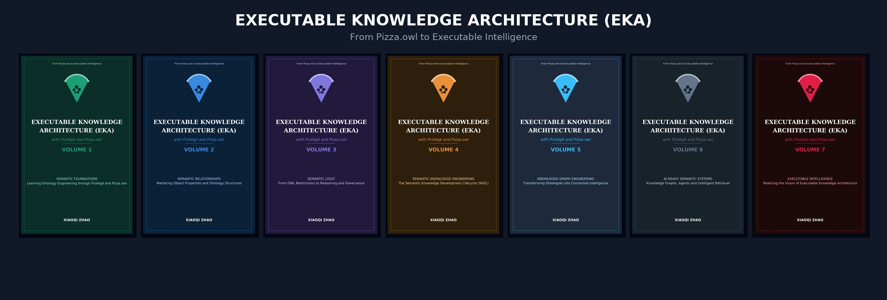
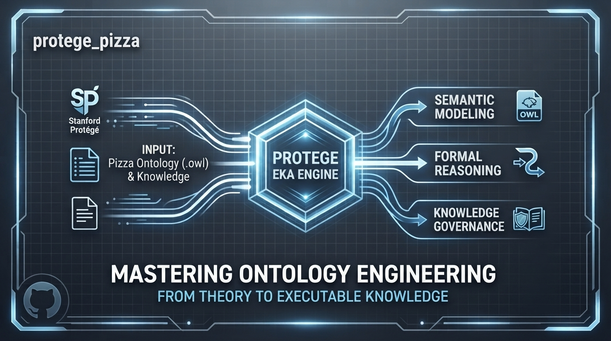

# 🍕 Mastering Ontology Engineering with Protégé and Pizza.owl

 

> 💡 **Looking for the complete, professional guide?** While this repository provides open-source snapshot code (the individual "pieces"), our structured multi-volume eBook series on **Leanpub** and **Amazon Kindle** provides the complete architectural framework, deep-dive explanations, and advanced engineering practices (such as Stage 4 Semantic Governance). 
>
> 
>  
> 👉 **[Get the Full eBook on Leanpub](#-companion-ebook---now-available-in-three-volumes)** or **[Get it on Amazon Kindle](#-companion-ebook---now-available-in-three-volumes)** to support this project!

---

## Project Vision

This repository is the official engineering environment for the "Mastering Ontology Engineering" project, providing a professional roadmap from semantic foundations to **Executable Knowledge Architecture (EKA)**. This project transforms the legendary Pizza OWL tutorial into a deep-dive professional experience, connecting ontology theory, Protégé operations, and real-world knowledge graph implementation.

## 🌟 Why Learn Ontology & Protégé?

In the era of AI and Large Language Models (LLMs), **Ontologies** provide the structured "world knowledge" that machines need to reason. By mastering this tutorial, you will learn how to:

- Define complex hierarchies and relationships.
- Use **Reasoners** to automatically classify data.
- Write **SWRL** rules to add intelligent logic.
- Build the backbone of **Knowledge Graphs**.

Explore the complete series and centralized resources at the [Official xiaoqi.com Ebook Hub](https://xiaoqi.com).

---

## 📚 Companion eBook — Now Available in Three Volumes!

> ⚠️ **The Code vs. The Architecture:** The open-source files in this repository show you *how* it looks in code. The companion eBook explains *why* it matters, providing full pedagogical text, formal enterprise context, and step-by-step methodology.

The complete companion eBook is available across multiple volumes on both **[Leanpub](https://leanpub.com/store?category=&search=Xiaoqi+Mastering+Ontology+Engineering+with+Prot%C3%A9g%C3%A9+and+Pizza.owl&sort=bestsellers_last_week&language=&lng=en)** and **[Amazon Kindle (KDP)](https://www.amazon.com/s?k=Mastering+Ontology+Engineering+with+Prot%C3%A9g%C3%A9+and+Pizza.owl+Xiaoqi&i=digital-text&crid=2OCZWC2LH7LLI&sprefix=mastering+ontology+engineering+with+prot%C3%A9g%C3%A9+and+pizza.owl+xiaoqi%2Cdigital-text%2C400&ref=nb_sb_noss_1)**. Volume 4 (the SKDL chapters, including Semantic Governance) is actively updating

### Volume 1: Chapter 00-08 -- Ontology Foundation in Protégé

Start here. Install Protégé, build your first classes, run a reasoner, and meet the Executable Knowledge Architecture (EKA) framework that ties the whole series together.

- **LeanPub**: [mastering-ontology-engineering-volume1](https://leanpub.com/mastering-ontology-engineering-with-protege-and-pizza-owl-volume1)
- **Amazon Kindle**: [Volume 1: Chapter 00-08: From Semantic Foundations to Executable Knowledge Architecture (EKA)](https://www.amazon.com/gp/product/B0H9D94LBP)

### Volume 2: Chapters 09-13 -- Object Properties, Characteristics, Domain and Range

Turn a static class hierarchy into a real semantic graph: object properties, inverse properties, property characteristics, and domain/range.

- **Leanpub**: [mastering-ontology-engineering-volume2](https://leanpub.com/mastering-ontology-engineering-with-protege-and-pizza-owl-volume2)
- **Amazon Kindle**: [Volume 2: Chapters 09-13 -- Object Properties, Characteristics, Domain and Range](https://www.amazon.com/dp/B0H98GY7VZ)

### Volume 3: Chapters 14-16 -- Semantic Requirements and EKA Governance

The chapter that grew into its own book — existential and universal restrictions, the correct `VegetarianPizza` pattern, and how restrictions become EKA governance.

- **Leanpub**: [mastering-ontology-engineering-volume3](https://leanpub.com/mastering-ontology-engineering-with-protege-and-pizza-owl-volume3)
- **Amazon Kindle**: [VOLUME 3: Chapters 14-16 -- Semantic Requirements and EKA Governance](https://www.amazon.com/dp/B0H959WVZV)

### Volume 4: Chapters 17-24 -- Semantic Knowledge Development Lifecycle (SKDL) (In writing...)

You know how to build classes in Protégé. But do you know when to attach meaning — and when to wait?
Volume 4 of "Mastering Ontology Engineering" introduces SKDL: the Semantic Knowledge Development Lifecycle. Seven stages. One discipline. Zero guesswork.
From Aristotle to Description Logic. From taxonomy to executable knowledge.
This is where pizza becomes philosophy — and philosophy become engineering.

- **Leanpub** | [mastering-ontology-engineering-volume4](https://leanpub.com/mastering-ontology-engineering-with-protege-and-pizza-owl-volume-4)
- **Amazon Kindle**: [VOLUME 4 -- Chapters 17-24 -- Semantic Knowledge Development Lifecycle](https://www.amazon.com/dp/B0HFP2Q9G6)

### Volume 5: EKA Part 1 — Executable Knowledge Implementation (In Plan)

### Volume 6: EKA Part 2a — Advanced Reasoning & Interdisciplinary Depth (In Plan)

### Volume 7: EKA Part 2b — Synthesis & Methodology (In Plan)

👉 **[Read the Source Code & Markdown Files Directly](./ebook/markdown)** — All raw chapters remain open-source under CC BY-SA 4.0.

---

## 🎓 The Learning Path

This repository is a companion to my **comprehensive video course**. I recommend following the videos while using the snapshot models in this repo to check your work.

### 📺 Watch the Full Course:

- [**Protégé 5.x Pizza Tutorial Video Series (YouTube)** ](https://www.youtube.com/playlist?list=PL6DEHvciXKeUx4P32B3hKMK1t6mC8RhsW)
- [**合集 Ontology Practice - Build pizza.owl in Protégé (BiliBili B站)** ](https://space.bilibili.com/158390142/lists/2469670)
- [**使用Protege建立Ontology (DouYin 抖音)** ](https://www.douyin.com/collection/7298169423012038708/1)

---

## 🛠 Repository Structure -- Quick Navigation Guide

| If you want to... | Go to |
|---|---|
| **Start the hands-on tutorial** | `/snapshot_models/` → open any `.rdf` in Protégé |
| **Read the eBook for free** | `/ebook/markdown/` (volume1 through volume7) |
| **Check your work against a reference** | `/ontology_ref/MyPizzaTutorial.rdf` or `/ontology_ref/PizzaTutorialWithDataV2.owl` |
| **View the ontology visually** | [WebVOWL live demo on MyPizzaTutorial.rdf](https://service.tib.eu/webvowl/#iri=https://yasenstar.github.io/protege_pizza/ontology_ref/MyPizzaTutorial.rdf) |
| **See the big-picture mind map** | Open `pizza.owl tutorial.mm` in [FreePlane](https://www.freeplane.org/) |
| **Build the book covers** | `/ebook/code/volume_cover_image_creating.py` |
| **Understand SHACL validation** | `/ontology_ref/SHACL/` |
| **Find legacy README versions** | `/archive/` |

---

## Acknowledgements & Intellectual Heritage

The evolution of knowledge representation is a collaborative journey. This work is a direct descendant of the **Protégé 4 Tutorial (version 1.3) by Matthew Horridge**, and we honor the foundational contributions of **Holger Knublauch, Alan Rector, Robert Stevens, Chris Wroe, Simon Jupp, Georgina Moulton, Nick Drummond, and Sebastian Brandt**.

We have incorporated revisions by **Michael DeBellis** (bridging Protégé 5.5 transitions and advanced SHACL/SPARQL practices) and acknowledge the critical insights from **Lorenz Buehmann, André Wolski, Dick Ooms, Colin Pilkington, Livia Pinera, Jans Aasman, Yan Xu, and the team at Franz Inc.**. We are honored to feature a foreword and ongoing review by **Timothy W. Cook (Founder of SDC)**.

---

## Licensing & Compliance

To balance educational openness with software governance, this repository utilizes dual licensing:

- **Documentation & eBook Content**: Licensed under **Creative Commons Attribution-ShareAlike 4.0 International (CC BY-SA 4.0)**. This ensures the "share-alike" requirement of the original Pizza Tutorial is strictly honored.
- **Software, Code & Scripts**: Licensed under **GNU General Public License v3.0 (GPL-3.0)**.

For full legal declarations and the detailed attribution chain, please refer to the `LICENSE.md` file in the root of this repository.

---

## 🚀 Getting Started

1. Download [Protégé](https://protege.stanford.edu/).
2.  Install a reasoner like **HermiT** or **Pellet** (included in most Protégé versions).

---

## 🔗 Resources & Credits

- **Official Ebook Hub**: [xiaoqi.com Ebook Section](https://xiaoqi.com)
- **Original Guide:** Based on Michael DeBellis' excellent Protégé OWL tutorial.
- **Mind Map:** Use the [pizza.owl tutorial.mm](./pizza.owl%20tutorial.mm) (Open with FreePlane) for a visual overview.
- **Visualization:** View the model via [WebVOWL](https://service.tib.eu/webvowl/#iri=https://yasenstar.github.io/protege_pizza/ontology_ref/MyPizzaTutorial.rdf).
- **Official eBook**: Available in the `/ebook` folder.
- **YouTube Playlist**: [Protégé OWL Pizza Tutorial Hands-on Series](https://www.youtube.com/playlist?list=PL6DEHvciXKeUx4P32B3hKMK1t6mC8RhsW).
- **EKA Framework**: Official insights at [https://xiaoqi.com](https://xiaoqi.com/).

---

## 🤝 Support & Get the Book

If you find this repository valuable for your learning or enterprise architecture work, please consider supporting the project:

- ⭐ **Star this repository** to help other developers find it.
- 📺 **Subscribe** to the YouTube channel for ongoing tutorials.
- 📘 **Buy the Complete eBook:** Purchase structured editions on **[Leanpub](https://leanpub.com/store?category=&search=Xiaoqi+Mastering+Ontology+Engineering+with+Prot%C3%A9g%C3%A9+and+Pizza.owl&sort=bestsellers_last_week&language=&lng=en)** or **[Amazon Kindle](https://www.amazon.com/s?k=Mastering+Ontology+Engineering+with+Prot%C3%A9g%C3%A9+and+Pizza.owl+Xiaoqi&i=digital-text&crid=2OCZWC2LH7LLI&sprefix=mastering+ontology+engineering+with+prot%C3%A9g%C3%A9+and+pizza.owl+xiaoqi%2Cdigital-text%2C400&ref=nb_sb_noss_1)** to gain complete analytical chapters and offline formatting.
- 💬 **Open an Issue** if you have technical questions about modeling logic.

---

## 👥 Contributors

A heartfelt thank you to all contributors who have helped improve this project

<!--
  IMPORTANT: To keep this list up-to-date, please add your GitHub username below
  if you have opened an Issue or participated in a Discussion.
-->

### Issues & Discussion Participants

| GitHub User | Contribution Type |
|-------------|-------------------|
| [@nikokaoja](https://github.com/nikokaoja) | Kudos! in Issue |
| [@mlungsta89](https://github.com/mlungsta89) | Issue Report |
| Timothy W. Cook | Foreword for eBook, technical review |
| Michael DeBellis | Issues / Foreword for eBook |
| [@LaraAcuna](https://github.com/LaraAcuna) | Question in Discussion |
| [@sarcanon](https://github.com/sarcanon) | Issue Reports |
| *Add your name here* | *Open an Issue or Discussion* |

### How to Contribute

We welcome contributions of all kinds! Here’s how you can help:

1.  **Report Bugs or Ask Questions:** Open a new [Issue](https://github.com/yasenstar/protege_pizza/issues) to report a problem or ask for clarification.
2.  **Start a Discussion:** Join the conversation in [Discussions](https://github.com/yasenstar/protege_pizza/discussions) to share your experiences, suggest improvements, or ask for help.
3.  **Suggest Changes:** If you have a specific improvement in mind, feel free to open a Pull Request.

Happy Pizza Modeling! 🍕

> "The journey begins with pizza. But the real subject is meaning."
> *-- Michael DeBellis*

---

Last updated at 2026-08-30