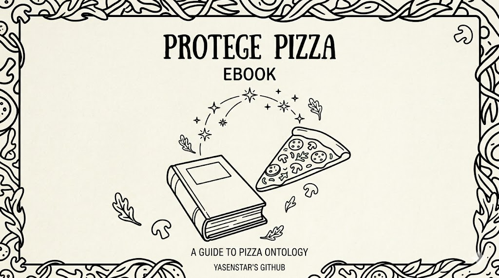
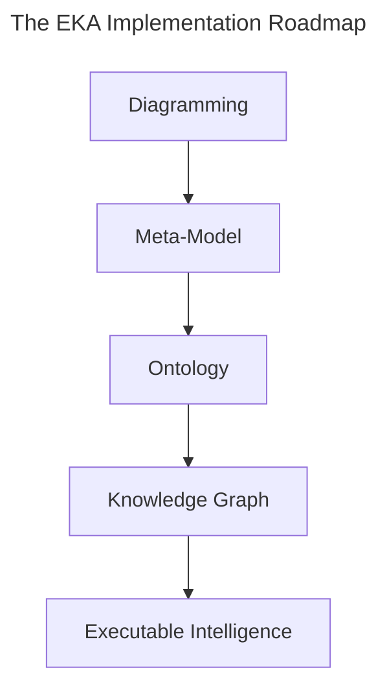

# eBook for Pizza.owl Ontology Practice using Protégé

- [From Ontology Learning to Executable Knowledge Architecture](#from-ontology-learning-to-executable-knowledge-architecture)
- [Why the Pizza.owl Tutorial Matters](#why-the-pizzaowl-tutorial-matters)
- [About This Book](#about-this-book)
- [Why Ontology Matters Today](#why-ontology-matters-today)
- [Ontology Within the EKA Framework](#ontology-within-the-eka-framework)
- [This Book Is NOT Only About Pizza](#this-book-is-not-only-about-pizza)
- [Who This Book Is For](#who-this-book-is-for)
- [What Makes This Book Different](#what-makes-this-book-different)
- [How to Use This Book](#how-to-use-this-book)
- [Acknowledgements](#acknowledgements)
- [Related Resources](#related-resources)
- [Final Thoughts](#final-thoughts)
- [Quick Links](#quick-links)

## From Ontology Learning to Executable Knowledge Architecture

The Semantic Web has existed for more than two decades, yet for many architects, engineers, analysts, and AI practitioners, ontology engineering still feels abstract, academic, or difficult to approach systematically.

One of the reasons is simple:

> Most ontology learning materials focus either too heavily on theory or too narrowly on tool operations.

As a result, many learners can:

- memories OWL terminology,
- click through Protégé demostrations,
- or understand isolated semantic concepts,

but still struggle to answer the most important question:

> Why does ontology engineering actually matter in modern enterprise and AI systems?

This book was created to answer that question.



## Why the Pizza.owl Tutorial Matters

Among all ontology learning materials ever created, Michael DeBellis' Pizza OWL tutorial remains one of the most influential and practical introductions to OWL ontology engineering.

Using a familiar pizza domain, the tutorial teaches learners how to:

- think semantically,
- construct ontology hierarchies,
- model relationships,
- apply OWL logic (rules),
- and understand reasoning behavior inside Protégé

What makes the Pizza tutorial special is that it gradually introduces semantic complexity in a highly structured manner.

Rather than overwhelming learners immediately with advanced ontology theory, it guides readers step by step through the evolution of a real semantic model.

That educational philosophy strongly influenced the structure of this book.

This eBook is based primarily on:

- Michael DeBellis' Protégé Pizza OWL Tutorial
- the Protégé ontology engineering workflow
- and a complete hands-on video series published through my YouTube channel beginning in 2023

## About This Book

This eBook was written as a companion knowledge guide to the YouTube playlist:

    **Protégé OWL Pizza Tutorial Hands-on Series**
    (https://www.youtube.com/playlist?list=PL6DEHvciXKeUx4P32B3hKMK1t6mC8RhsW)

_Since publishing the Protégé OWL Pizza Tutorial series in 2023, I’ve realized how valuable practical ontology learning remains for architects and AI practitioners. What started as a hands-on walkthrough of Michael DeBellis’ tutorial gradually became an important foundation for my EKA (Executable Knowledge Architecture) thinking — connecting ontology, knowledge graphs, and executable intelligence. The playlist may use pizza as the example domain, but its real purpose is helping learners develop semantic thinking and understand how machine-readable knowledge is engineered._

While, the goal is not merely to transcribe the videos.

Instead, this book expands the tutorial into a much deeper professional learning experience by combining:

- ontology engineering theory,
- hands-on Protégé practice,
- semantic modeling methodology,
- enterprise architectural thinking,
- and modern knowledge graph perspectives.

Every chapter corresponds closely to the learning progression of the original video series so readers can learn both visually and conceptually in parallel.

This synchronization is intentional.

Ontology engineering is best learned progressively.

## Why Ontology Matters Today

We are entering a new era of intelligent systems.

Modern enterprises increasingly rely on:

- AI systems,
- semantic search,
- enterprise knowledge graphs,
- digital twins,
- intelligent automation,
- contextual reasoning,
- and machine-readable knowledge.

Traditional architectures built purely on:

- servers and databases,
- documents,
- diagrams
- and APIs

are no longer sufficient for advanced semantic intelligence.

The missing layer here is:

```
Meaning
```

Ontology engineering provides that layer.

OWL ontologies allow organizations to formally define:

- concepts,
- relationships,
- constraints,
- semantics,
- and inference logic

in a machine-readable and machine-processable form.

This transforms static information into executable knowledge.

## Ontology Within the EKA Framework

This book also introduces ontology engineering through the lens of the EKA (Executable Knowledge Architecture) framework.

EKA represents an architectural approach for transforming enterprise knowledge into executable intelligence systems.

Within EKA, the implementation roadmap is:



Ontology occupies the critical semantic transformation layer.

This is where:

- visual architecture,
- conceptual models,
- and enterprise abstractions

become:

- machine-readable semantics,
- reasoning structures,
- and graph-ready knowledge.

Protégé therefore becomes more than just an ontology editor.

It becomes an engineering environment for executable semantics.

This perspective fundamentally changes how ontology engineering should be understood.

## This Book Is NOT Only About Pizza

Although the tutorial domain uses pizza examples, the real purpose of the tutorial is much larger.

The Pizza ontology teaches foundational semantic engineering patterns that scale into real-world domains such as:

- enterprise architecture,
- healthcare,
- finance,
- manufactuoring,
- government,
- cybersecurity,
- digital twins,
- and AI knowledge systems.

The same semantics principles used to model:

```
(Pizza)-[:hasTopping]->(CheeseTopping)
```

can later scale into:

```
(Application)-[:supportsCapability]->(businessFunction)
```

or:

```
(Device)-[:connectedTo]->(Sensor)
```

Ontology engineering is domain-independent!

The Pizza example simply provides an approachable learning environment.

## Who This Book Is For

This book is intended for:

- Enterprise Architects
- Solution Architects
- Data Architects
- Knowledge Engineers
- AI Engineers
- Semantic Web Learners
- Knowledge Graph Practitioners
- Protégé Beginners
- Meta-Modeling Practitioners
- EKA Learners
- Digital Transformation Professionals

No prior ontology experience is required.

However, reader with backgrounds in:

- UML,
- ER Modeling,
- Enterprise Architecture,
- Databases,
- Graph Technologies,
- or Software Engineering

will often recognize important conceptual parallels throughout the book.

## What Makes This Book Different

Most ontology books fall into one of two extremes:

| Style | Problem |
| --- | --- |
| Highly academic | Difficult for practitioners |
| Pure tool tutorials | Lack conceptual depth |

This book intentionally bridges both worlds.

The objectives is to create `A Practical Ontology Engineering Handbook` that remains:

- technically rigorous,
- professionally structured,
- architecturally meaningful,
- and implementation-oriented.

The book therefore combines:

- OWL theory,
- Protégé operations,
- semantic engineering methodology,
- EKA architecture thinking,
- and knowledge graph perspectives

into a single progressive learning journey.

## How to Use This Book

The recommended learning approach is:

1. Watch the corresponding video chapter
2. Read the matching eBook chapter carefully
3. Repeat the Protégé exercises manually
4. Reflect on the semantic modeling principles
5. Connect the concepts back to enterprise knowledge systems

Ontology engineering is not mastered through passive reading alone.

It requires semantic thinking practice.

The goal is not merely learning Protégé.

The goal is learning how to engineer machine-understandable meaning.

## Acknowledgements

Special thanks to:

- Michael DeBellis for creating one of the most influential practical OWL learning resources available to the ontology community. (Visit Michael's homepage here: https://www.michaeldebellis.com/)
- Standford University and the Protégé community for advancing open ontology engineering tools and Semantic Web technologies.

## Related Resources

Official Resources:
- Protégé Official Website: https://protege.stanford.edu/
- Protégé Pizza Repository: https://github.com/yasenstar/protege_pizza/tree/main
- EKA Official Website: https://xiaoqi.com/

Learning Resources:
- YouTube Channel - Xiaoqi(Yasen) Zhao: http://www.youtube.com/@yasenzhao
- Udemy Courese - Xiaoqi Zhao: https://www.udemy.com/user/xiaoqi-zhao

## Final Thoughts

Ontology engineering is NO LONGER a niche academic discipline.

It is rapidly becoming part of the foundational infrastructure for:

- AI systems,
- enterprise knowledge platforms,
- semantic interoperability,
- and executable intelligence architectures.

Understanding ontology today is increasingly similar to understand databases or APIs twenty years ago.

It is becoming a core architectural capability.

The journey begins with a simple Pizza ontology.

But the destination is much larger:

```
Executable knowledge
```

WELCOME TO THE WORLD OF ONTOLOGY ENGINEERING.

## Quick Links

Here are the quick links to every chapter:

- [Chapter 01 - Entering the World of Ontology Engineering with Protégé and `Pizza.owl`](./ch01.md)
- [Chapter 02 - Building Your First Ontology in Protégé](./ch02.md)
- [Chapter 03 - Installing Protégé and Understanding the Ontology Engineering Workspace](./ch03.md)
- [Chapter 04 — Creating Classes and Building the Pizza Ontology Skeleton in Protégé](./ch04.md)
- [Chapter 05 — Defining Named Classes in the Pizza Ontology](./ch05.md)
- [Chapter 06 - Applying a Reasoner to the Pizza Ontology](./ch06.md) - WIP

---

> "You" are the learner of this book, so while you're reading, I'll say to "you" directly instead of "learner" / "reader" from now on.

Last updated at: 2026/05/17