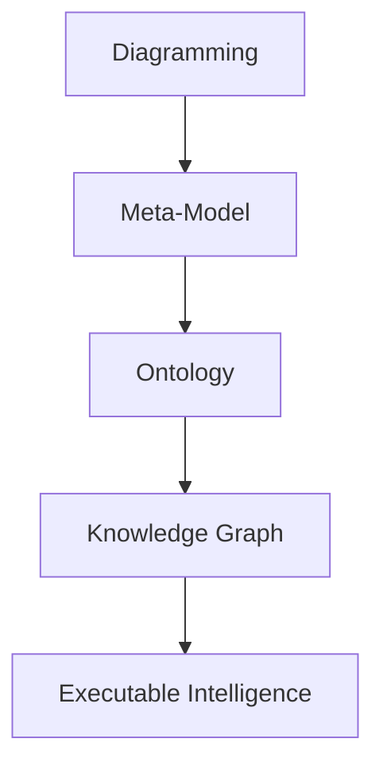
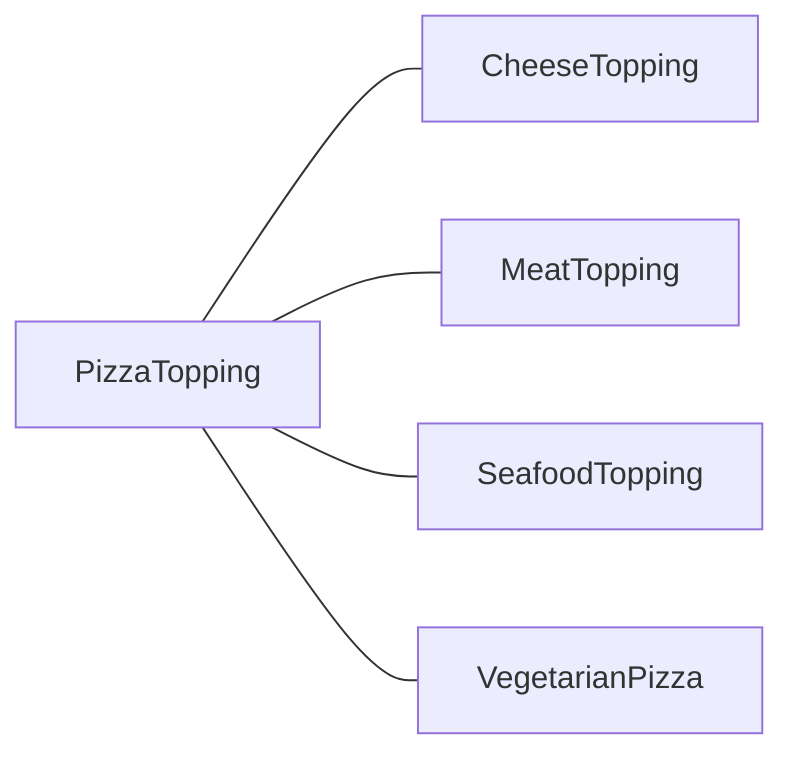

# Chapter 01 - Entering the World of Ontology Engineering with Protégé and `Pizza.owl`

The journey into ontology engineering often begins with a deceptively simple example:  `pizza`. Behind this famous `pizza.owl` tutorial lies one of the most influential learning paths in the Semantic Web and Knowledge Graph ecosystem. In this first chapter, we establish the conceptual foundations of ontology modeling, introduce the Protégé ontology editor, and position ontology engineering within the broader vision of Executable Knowledge Architecture (EKA).

This chapter is based primarily on Michael DeBellis’ excellent tutorial _[A Practical Guide to Building OWL Ontologies Using Protégé 5.5 and Plugins]((https://yasenstar.github.io/ontology-pizza-cn/docs/Protege%205%20New%20OWL%20Pizza%20Tutorial%20V3.2.pdf))_, which modernized and extended the original Manchester Pizza Tutorial into a comprehensive hands-on learning experience. 

At the same time, this book extends beyond the tutorial itself. The goal here is not only to learn Protégé as a standalone modeling tool, but to understand ontology as a critical layer in the transformation from diagrams to executable intelligence.

- [Chapter 01 - Entering the World of Ontology Engineering with Protégé and `Pizza.owl`](#chapter-01---entering-the-world-of-ontology-engineering-with-protégé-and-pizzaowl)
  - [1.1 Why the Pizza Tutorial Became an Industry Classis](#11-why-the-pizza-tutorial-became-an-industry-classis)
  - [1.2 Protégé: More Than an Ontology Editor](#12-protégé-more-than-an-ontology-editor)
  - [1.3 The EKA Perspective: From Diagrams to Executable Intelligence](#13-the-eka-perspective-from-diagrams-to-executable-intelligence)
  - [1.4 Understanding OWL: The Semantic Core](#14-understanding-owl-the-semantic-core)
    - [1.4.1 Classes: Modeling Conceptual Categories](#141-classes-modeling-conceptual-categories)
    - [1.4.2 Individuals: Representing Concreate Instances](#142-individuals-representing-concreate-instances)
    - [1.4.3 Properties: Defining Relationships](#143-properties-defining-relationships)
  - [1.5 Ontology vs Traditional Data Modeling](#15-ontology-vs-traditional-data-modeling)
  - [1.6 Open World Assumption: A New Way of Thinking](#16-open-world-assumption-a-new-way-of-thinking)
  - [1.7 Reasoners: The Engine Behind Semantic Intelligence](#17-reasoners-the-engine-behind-semantic-intelligence)
  - [1.8 Why Ontology Matters in the AI Era](#18-why-ontology-matters-in-the-ai-era)
  - [1.9 What You Will Build Throughout This Book](#19-what-you-will-build-throughout-this-book)
  - [1.10 The Bigger Picture](#110-the-bigger-picture)
  - [Reference](#reference)
  - [Demo Video for this Chapter](#demo-video-for-this-chapter)

## 1.1 Why the Pizza Tutorial Became an Industry Classis

The `pizza.owl` tutorial has become the “Hello World” of ontology engineering for several reasons.

First, pizza is universally understandable. Nearly everyone intuitively understands toppings, ingredients, vegetarian classifications, spicy foods, and regional styles. This makes it easier to focus on semantic modeling concepts rather than domain complexity.

Second, the tutorial gradually introduces increasingly sophisticated OWL concepts in a controlled environment. Instead of overwhelming learners with abstract logic theory, it teaches ontology construction incrementally:

- Classes
- Subclasses
- Individuals
- Object Properties
- Restrictions
- Reasoners
- Logical Inference
- SWRL Rules
- SPARQL Queries
- SHACL Validation

This progression mirrors how real enterprise ontology projects evolve.

Third, the tutorial demonstrates something fundamentally important:

> Ontologies are not just diagrams.<br>
> They are executable semantic systems.

This is the core idea that later becomes central in EKA.

## 1.2 Protégé: More Than an Ontology Editor

[Protégé](https://protege.stanford.edu/) is often introduced simply as an ontology editor, but this description dramatically understates its importance.

Protégé is better understood as a **semantic modeling platform**.

It allows users to:

- Define domain concepts
- Encode formal semantics
- Build machine-readable knowledge structures
- Execute logical reasoning
- Validate constraints
- Query semantic relationships
- Prepare foundations for knowledge graphs

In traditional enterprise architecture tools, architects often create static diagrams that describe systems visually but lack executable semantics.

For example:

- UML diagrams describe structure
- BPMN diagrams describe processes
- ER diagrams describe data
- Capability maps describe organizations

However, these artifacts usually remain disconnected documentation.

Protégé introduces a fundamentally different paradigm.

Instead of merely drawing concepts, we formally define them using **logic-based semantics**. The ontology becomes interpretable by machines, enabling automated reasoning and inference.

This transition is foundational for modern AI-native architectures.

## 1.3 The EKA Perspective: From Diagrams to Executable Intelligence

Within the EKA (Executable Knowledge Architecture) framework introduced on [xiaoqi.com](https://xiaoqi.com), ontology engineering occupies a critical transformation layer.

The implementation roadmap of EKA can be summarized as:



The Pizza OWL tutorial specifically addresses the "Ontology" stage.

To understanding why this matters, we must examine the limitations of traditional enterprise modeling.

Mose enterprise architecture repositories contain thousands of diagrams:

- Application landscapes
- Process flows
- Integration maps
- Data models
- Organizational charts

But these assets - very valuable - are typically:

- Static
- Human-readable only
- Semantically ambiguous
- Non-executable
- Difficult to integrate

Ontology changes this situation fundamentally.

When enterprise concepts become ontological entities:

- Relationships gain formal meaning
- Constraints become machine-processable
- Inference becomes possible
- Knowledge graphs can be generated
- AI systems can consume structured semantics

In EKA terminology, ontology acts as the semantic bridge between abstract architecture and executable intelligence.

This is why leanring Protégé is not merely learning another modeling tool.

IT IS learning how to formalize knowledge itself.

## 1.4 Understanding OWL: The Semantic Core

The tutorial centers around OWL, the Web Ontology Language.

[Web Ontology Language](https://www.w3.org/OWL/) is a W3C standard designed to represent knowledge in a machine-readable and logically rigorous form.

Unlike relational databases, OWL is not primarily designed for transaction processing.

Instead, OWL focuses on:

- Mearning
- Classification
- Inference
- Semantic relationships
- Knowledge interoperability

Michael DeBellis emphasizes that OWL ontologies are composed primarily of three core elements:

1. Classes
2. Properties
3. Individuals

These concepts form the semantic building blocks of all ontology systems.

### 1.4.1 Classes: Modeling Conceptual Categories

A class represents a category or type of thing.

Examples in the Pizza ontology include:

- Pizza
- PizzaTopping
- CheeseTopping
- VegetableTopping
- VegetarianPizza

Classes can be organized hierarchichally.

For example:



You may also document above graph in this way:

```
PizzaTopping
 |-- CheeseTopping
 |-- MeatTopping
 |-- SeafoodTopping
 |-- VegetableTopping
```

This resembles inheritance structure in object-oriented modeling, but OWL classes are fundamentally semantic rather than implementation-oriented.

A class in OWL describes a set of possible individuals.

This distinction becomes important later when reasoning engines classify instances automatically.

### 1.4.2 Individuals: Representing Concreate Instances

Individuals are actual members of classes.

For example, members of class `Pizza` or `PizzaTopping` can be:

- MargheritaPizza
- MozzarellaTopping
- SpicyBeefPizza

An individual belongs to one or more classes.

However, unlike traditional systems where classification is often manually assigned, OWL reasoners can infer class membership automatically base on logical definitions.

This capability is one of the major breakthroughs of ontology systems.

### 1.4.3 Properties: Defining Relationships

Properties define how entities relate to one another.

In OWL, there are two major property types:

1. Object Properties: These connect individuals to other individuals.

Example:

```
hasTopping
```

2. Data Properties: These connect individuals to literal value.

Example:

```
hasCalories
hasPrice
hasSpicinessLevel
```

Properties become extraordinarily powerful when combined restrictions and logical constraints.

## 1.5 Ontology vs Traditional Data Modeling

New learners often ask:

> "How is ontology different from a database schema?"

This is one of the most important conceptual distinctions in semantic engineering.

Traditional databases focus on storing data efficiently.

Ontologies focus on representing meaning formally.

A relational schema might define:

```
Pizza(id, name)
ToppingI(id, name)
PizzaTopping(pizza_id, topping_id)
```

But the schema itself does not formally express semantic truths such as:

- Vegetarian pizzas cannot contain meat toppings
- Spicy pizzas contain spicy ingredients
- Certain toppings are subclasses of vegetable toppings
- Seafood toppings are disjoint from meat toppings

OWL allows these semantics to be explicitly modeled.

This is why ontologies become foundational for AI and knowledge graph systems.

## 1.6 Open World Assumption: A New Way of Thinking

One of the most difficult concepts for beginners is the Open World Assumption (OWA).

Traditional databases generally operate under a Closed World Assumption (CWA):

> If something is not stored, it is considered false.

OWL works differently!

Under OWA:

> Absense of knowledge does not imply falsehood.<br>
> It just means the knowledge that is unknown yet.

For example:

If an ontology does not specify whether a pizza contains meat, we cannot conclude that is is vegetarian.

This principle aligns much more closely with real-world knowledge representation, where information is often incomplete.

Understanding OWA is essential because it fundamentally changes how semantic systems behave compared to traditional enterprise systems.

Michael DeBellis highlights this repeatedly throughout the tutorial because many modeling errors originate from misunderstanding **open-world reasoning**.

## 1.7 Reasoners: The Engine Behind Semantic Intelligence

The real magic of ontology engineering appears when we introduce reasoners.

A reasoner is a logic engine that analyzes ontology axioms and derives new knowledge automatically.

For example, if we define:

- VegetarianPizza ≡ Pizza AND NOT (hasTopping some MeatTopping)

and later create a pizza that only contains cheese and vegetables, the reasoner can automatically classify it as a VegetarianPizza.

No manual tagging is required!

Thsi is a profound shift.

The ontology stops being passive documentation and becomes an executable semantic system.

This is precisely the transition EKA describes as moving toward executable intelligence.

## 1.8 Why Ontology Matters in the AI Era

Modern AI systems increasingly require structured semantic context.

Large Language Models (LLMs) are powerful, but without explicit knowledge structures they often struggle with:

- Consistency
- Explainability
- Governance
- Enterprise semantics
- Controlled reasoning

Poor structures for LLMs normally lead to the "beautiful garbage" to be generated by AI.

Ontology provides the semantic backbone that complements probabilistic AI systems.

This is why ontology engineering is re-emerging as a critical discipline in:

- Knowledge Graphs
- Semantic Search
- AI Agents
- Digital Twins
- Enterprise Knowledge Management
- Data Fabric architectures

The Pizza tutorial may appear simple, but the underlying modeling principles scale into enterprise-grade semantic systems.

## 1.9 What You Will Build Throughout This Book

As this eBook progresses, we will gradually build increasingly sophisticated ontology capabilities using Protégé.

The journey includes:

- Constructing class hierarchies
- Modeling object properties
- Defining logical restrictions
- Using automated reasoners
- Performing semantic queries
- Applying SWRL rules
- Validating ontologies with SHACL
- Connecting ontology concepts to knowledge graph thinking
- Positioning ontology inside the EKA execution pipeline

By the end, readers should understand not only how to use Protégé, but why ontology engineering matters strategically for modern AI-native enterprises.

## 1.10 The Bigger Picture

The Pizza ontology is nto really about pizza.

It is about learning how to formalize knowledge.

Once you understand:

- classes,
- relationships,
- restrictions,
- inference,
- and semantic reasoning

you can model almost anything:

- enterprise architectures
- business capabilities
- manufacturing systems
- healthcare vocabularies
- supply chains
- digital twins
- AI agent memory systems
- and knowledge graphs

See https://github.com/yasenstar/ArchiMate_Ontology as one practical sample that I'm applying to use Protégé to build ontology for ArchiMate (EA Modeling language).

This is where ontology engineering evolves from academic theory into enterprise intelligence infrastructure.

The future of architecture is not static diagrams.

The future is executable semantics.

And Protégé is one of the gateways into that world.

## Reference

- Michael DeBellis, A Practical Guide to Building OWL Ontologies Using Protégé 5.5 and Plugins
- Protégé official resources and tutorials
- Protégé Pizza Ontology learning repository

## Demo Video for this Chapter

Visit https://youtu.be/l0PZhqmTwfM for watching this video in YouTube.

---

Last updated at: 2026/05/11