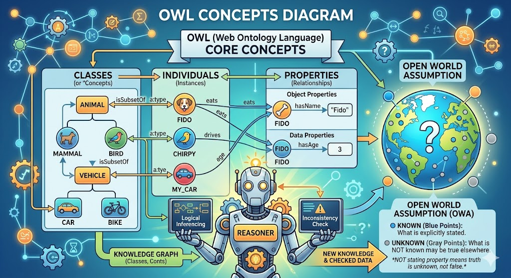
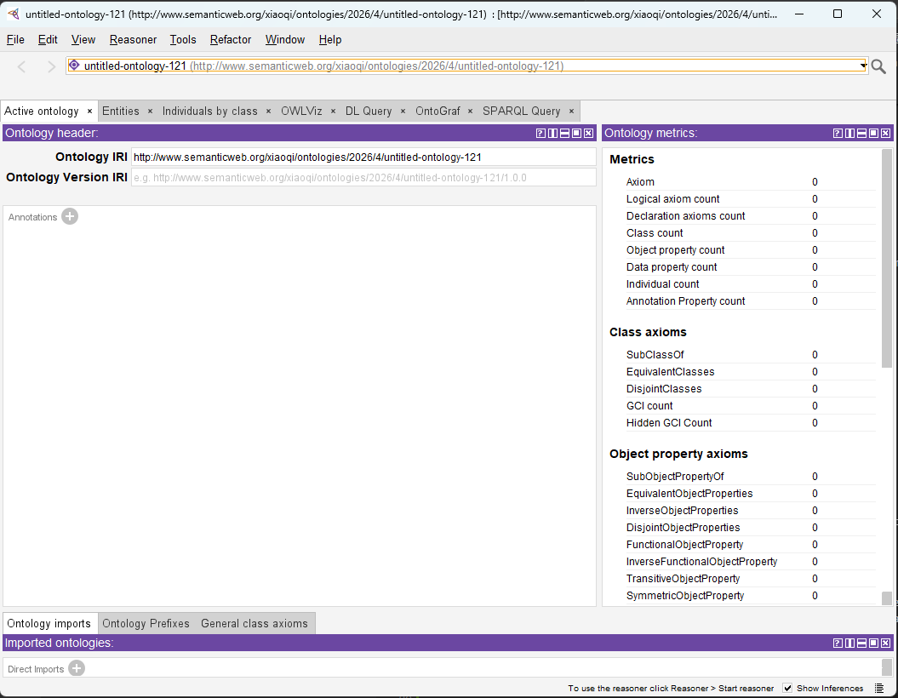
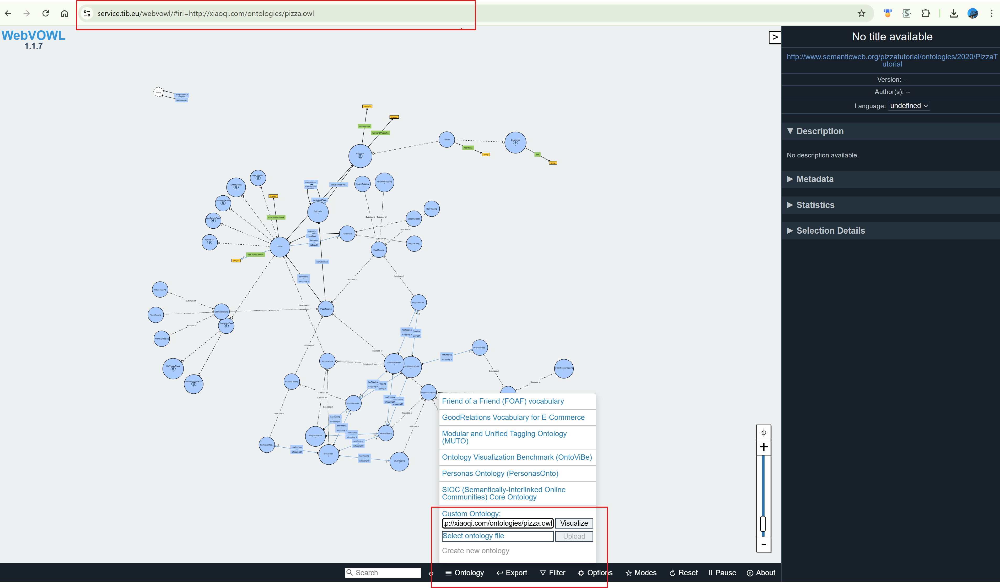
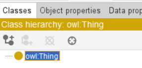
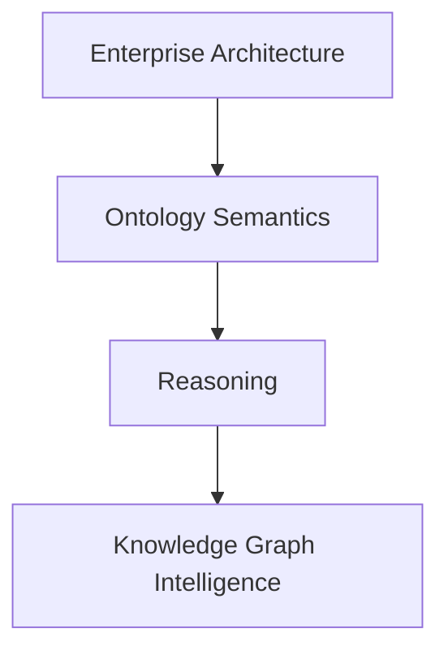

# Chapter 02 - Building Your First Ontology in Protégé

After establishing the conceptual foundations of ontology engineering in Chapter 01, we now move into the practical world of ontology construction inside Protégé. This chapter marks the transition from semantic theory into hands-on ontology modeling.

The goal of this chapter is not merely to "click through a tool," but to understand how semantic structures are engineered systematically. In traditional software engineering, developers write executable code. In ontology engineering, architects build executable meaning.

This distinction is fundamental.

The Pizza ontology may appear simple on the surface, but it introduces modeling patterns used throughout enterprise semantic systems, knowledge graphs, and AI-driven architectures.

This chapter is primarily based on the ontology construction sections from Michael DeBellis' revised [Pizza Tutorial for Protégé 5.5](https://www.researchgate.net/publication/351037551_A_Practical_Guide_to_Building_OWL_Ontologies_Using_Protege_55_and_Plugins).

- [Chapter 02 - Building Your First Ontology in Protégé](#chapter-02---building-your-first-ontology-in-protégé)
  - [2.1 From Theory to Construction](#21-from-theory-to-construction)
  - [2.2 Understanding the Protégé Workspace](#22-understanding-the-protégé-workspace)
  - [2.3 Creating a New OWL Ontology](#23-creating-a-new-owl-ontology)
  - [2.4 The Importance of Ontology Naming Conventions](#24-the-importance-of-ontology-naming-conventions)
  - [2.5 Understanding `Thing`: The Root of All Classes](#25-understanding-thing-the-root-of-all-classes)
  - [2.6 Creating the Core `Pizza` Taxonomy](#26-creating-the-core-pizza-taxonomy)
  - [2.7 Building Class Hierachies Systmatically](#27-building-class-hierachies-systmatically)
  - [2.8 Disjoint Classes: Preventing Semantic Contradictions](#28-disjoint-classes-preventing-semantic-contradictions)
  - [2.9 Primitive vs Defined Classes](#29-primitive-vs-defined-classes)
    - [2.9.1 Primitive Class](#291-primitive-class)
    - [2.9.2 Defined Class](#292-defined-class)
  - [2.10 Why Automated Classification Matters](#210-why-automated-classification-matters)
  - [2.11 Ontology Engineering vs Diagramming](#211-ontology-engineering-vs-diagramming)
  - [2.12 Early Modeling Discipline](#212-early-modeling-discipline)
  - [2.13 The Emerging Semantic Architecture Mindset](#213-the-emerging-semantic-architecture-mindset)
  - [Chapter 02 Summary](#chapter-02-summary)
  - [Kew OWL Concepts](#kew-owl-concepts)
  - [Protégé Operations (Skill) Learned](#protégé-operations-skill-learned)
  - [EKA Connection](#eka-connection)
  - [Knowledge Graph Perspective](#knowledge-graph-perspective)
  - [Next Chapter (03) Preview](#next-chapter-03-preview)
  - [Reference](#reference)
  - [Demo Video for this Chapter](#demo-video-for-this-chapter)

## 2.1 From Theory to Construction

In Chapter 01, we introduced the core OWL concepts:

- Classes
- Individuals
- Properties
- Reasoners
- Open World Assumption

An quick AI-generated picture below brings them together systematically:



Now we begin building actual semantic structures.

This is where ontology engineering stars to feel very different from traditional modeling disciplines.

In a traditional diagramming tool, creating a class hierarchy is often just a visual activity. In Protégé, however, every modeling action contributes to a machine-processable semantic structure.

This means that:

- class hierarchies have logical implications
- property definitions affect reasoning behavior
- restrictions become executable constraints, and
- inference engines cna derive new knowledge automatically

As Michael DeBellis emphasizes throughout the tutorial, ontology engineering should be approached as semantic knowledge modeling rather than merely graphical editing.

## 2.2 Understanding the Protégé Workspace

When Protégé is launched for the first time, many new users feel overwhelmed by the interface.

This is normal.

Protégé is not designed as a lighweight diagramming application. On the contrary, it is a **semantic engineering environment**.

The workspace contains multiple perspectives for editing different ontology components:

- Classes
- Object Properties
- Data Properties
- Individuals
- Annotations
- Reasoner views
- Query views
- Rule views

One of the most important concepts for beginners to understand is that Protégé does not separate "diagramming" from "logic".

Everything visible in the interface ultimately contributes to OWL axioms underneath.

This is why ontology engineering feels closer to knowledge programming than traditional modeling.

## 2.3 Creating a New OWL Ontology

The first practical step is creating a new ontology project.

During this chapter's writing, I'm using Protégé v5.6.9.

Inside Protégé: `File > New...`:


If you're having existing ontology file opened in Protégé, you will get below pop-up with question:


If you choose `Yes` (default), your current ontology file will be closed and your new ontology project will occupy current window, ensure you save any previous changes beofre losing them.

Or, you may choose `No` so a new window will be opened for your new ontology project, your existing opened ontology will not be impacted.

You then can see the new ontology project screen:



When you want to save the project, Protégé then asks for:
- Ontolog IRI
- Document storage location
- RDF/XML or OWL serialization format

At this stage, beginners often underestimate the importance of ontology [IRIs - Internationalized Resource Identifier](https://www.w3.org/TR/owl2-syntax/#Ontology_IRI_and_Version_IRI).

As defined by W3C, "_Each ontology may have an ontology IRI, which is used to identify an ontology._" An ontology IRI acts as the global semantic identifier for the ontology.

Unlike filenames or database table names, ontology IRIs are intended to be globally unique identifiers in semantic ecosystems.

For example:

```
# IRI for pizza.owl
http://xiaoqi.com/ontologies/pizza.owl

# My new ontology project IRI (local)
http://www.semanticweb.org/xiaoqi/ontologies/2026/4/untitled-ontology-121
```

Using [WebVOWL - the OWL Visualization Tool](https://service.tib.eu/webvowl/), you can paste above `pizza.owl` IRI then visualize it for now:



This is conceptually similar to namespaces in programming languages, but with web-scale semantic inter-operability.

In enterprise environments, ontology naming strategies become critically important because ontologies may later integrate across:

- business domains
- data catalogs
- APIs
- knowledge graphs
- AI agents
- and semantic search platforms

This is one of the first points where ontology engineering begins to intersect with enterprise architecture governance.

## 2.4 The Importance of Ontology Naming Conventions

One of the subtle but important lessons from the Pizza tutorial is disciplined naming.

Ontology projects quickly become unmanageable if naming conventions are inconsistent.

Michael DeBellis repeatly exphasizes semantic clarity and hierarchy organization throughout the tutorial.

Good ontology naming should satisfy several critiria, as below:

- Human-readable
- Machine-processable
- Semantically meaningful
- Consistent across domains
- Stable over time

For example in our `pizza.owl`:

```
Pizza
PizzaTopping
VegetarianPizza
SpicyPizza
```

These names are concise and semantically clear.

In enterprise ontology projects, naming conventions become even more important because ontologies may evolve into shared organizational semantic standards.

Within EKA, naming discipline is essential because ontology entities later become:

- graph nodes
- semantic APIs
- AI context objects
- digital twin entities
- and executable business semantics

Poor naming eventually creates **semantic debt** and chaos across the organization.

This is analogous to **technical debt** in software engineering.

## 2.5 Understanding `Thing`: The Root of All Classes

Every OWL ontology begins with a universal root class: `owl:Thing`



All classes ultimately inherit from `Thing`.

This concept initially appears trivial, but it represents an important philosophical principle in ontology engineering.

> OWL assumes that all modeled entities exist within a universal semantic space.

For example:

```
Thing
 |-- Pizza
 |-- PizzaTopping
 |-- PizzaBase
 |-- Spiciness
```

Unlike relational databases where tables are independent structures, OWL organizes concepts into a globally connected semantic universe.

This is one reason ontology systems integrate natually with knowledge graphs.

## 2.6 Creating the Core `Pizza` Taxonomy

The next step involves building the foundational class hierarchy.

From Wikipedia, [**Taxonomy**](https://en.wikipedia.org/wiki/Taxonomy) is a practice and science connerned with classification or categorization.

The Pizza ontology begins with several top-level conceptual categories:

```
Pizza
PizzaTopping
PizzaBase
Spiciness
```

These represent the primary semantic domains within the ontology.

At this stage, ontology engineering resembels taxonomy construction.

However, ontologies extend far beyond simple taxonomies.

An ontology additionally defines:

- semantics
- constraints
- properties
- logical restrictions
- inference behavior
- and reasoning rules

This distinction is critical.

Many enterprise "ontologies" are actually only taxonomies because they lack formal semantics.

## 2.7 Building Class Hierachies Systmatically

One of the most powerful productivity features demostrated in the Pizza tutorial is the "Create Class Hierarchy" wizard.

In Protégé, from menu [Tools] > [Create class hierarchy...]


Instead of manually creating classes one by one, Protégé allow ontology engineers to rapidly construct semantic hierarchies using indentation-based structure.

For example:

```
PizzaTopping
  CheeseTopping
  MeatTopping
  SeafoodTopping
  VegetableTopping
```

> Tip: you may create those structure in one TXT file upfront, then paste into the wizard.

This approach provides several advantages:

- Faster ontology construction
- Better structural consistency
- Easier semantic organization
- Able to see `disjoint` in one go (see [2.8](#28-dis) below)
- Reduced modeling errors

In enterprise-scale ontology projects containing thousands of concepts, hierarchical discipline becomes essential.

Without strong hierarchy goverannce:

- semantic duplication emerges
- inheritance becomes inconsistent
- and reasoning performance degrades

Ontology engineering therefore requires architectural thinking, not merely modeling skills.

## 2.8 Disjoint Classes: Preventing Semantic Contradictions

An extremely important concept introduced during hierarchy creation is **class disjointness**.

For example:

```
MeatTopping
VegetableTopping
Seafoodtopping
```

These categories should logically be mutually exclusive.

A topping cannot simultaneously be both:

- MeatTopping
- and VegetableTopping

Protégé allows classes to be declared as disjoint.

This enables reasoners to detect controdictions automatically.

For example, if an individual were incorrectly classified as both:

```
HamTopping
AND
VegetableTopping
```

Since `HamTopping` is one type of `MeatTopping`, the reasoner would identify an inconsistency.

This capability becomes enormously important in enterprise environments.

The Disjointness supports:

- data quality enforcement
- semantic governance
- AI validation
- and knowledge consistency checking

Within EKA, this is one of the first places where architecture becomes executable.

The ontology no longer merely describes the domain, it actively validates semantic correctness.

## 2.9 Primitive vs Defined Classes

One of the most intellectually important concepts in OWL modeling is the distinction between:

- Primitive Classes
- Defined Classes

### 2.9.1 Primitive Class

A primitive class only specifies necessary conditions.

For example:

```
Pizza
```

may simply be declared as a subclass of:

```
Food
```

without fully defining what constitutes a pizza.

### 2.9.2 Defined Class

A defined class, however, specifies both:

- necessary conditions
- and sufficient conditions

> You may find similar terms in Sets Theory, correct, they're inherited from that theory indeed.

For example:

```
VegetarianPizza
  ≡ Pizza
  AND NOT (hasTopping some MeatTopping)
```

This means the reasoner can automatically infer membership.

If a pizza satisfies the logical conditions, it becomes classified automatically.

This is one of the defining characteristics of semantic systems.

Traditional systems rely heavily on manual categorization, while, ontology systems support computational classification.

## 2.10 Why Automated Classification Matters

This concept may initially seem academic, but it becomes transformative at enterprise scale.

Consider a large organization containing:

- thousands of applications,
- millions of data entities,
- thousands of APIs,
- and hundrds (or possible thousands as well) of business capabilities

Manually classifying all semantic relationships become impossible.

Ontology reasoning introduces automation into semantic governance.

Within EKA, automated classification enables:



This is one of the major strategic advantages of semantic architecture over static repositories.

## 2.11 Ontology Engineering vs Diagramming

A common beginner's mistake is treating Protégé like Visio or UML modeling software.

This is fundamentally incorrect.

In diagramming tools:

- relationships are often visual only
- semantics remain informal
- and diagrams rarely execute

While in ontology engineering:

- semantics are formalized
- relationships are machine-readable
- and logic becomes executable

This difference is profound.

Ontology engineering sits much closer to software engineering and knowledge programming than to traditional architecture diagramming.

Protégé therefore represents a semantic compiler environment rather than merely a drawing tool. (In fact, you don't have actual "drawing" activities in Protégé.)

This distinction becomes central within EKA because the ultimate goal is not documentation.

The goal is executable knowledge.

## 2.12 Early Modeling Discipline

One of the most valuable lessons from the Pizza tutorial is modeling discipline.

Good ontology engineering requires:

- semantic clarity,
- naming consistency,
- hierarchy governance,
- logical rigor,
- and iterative refinement

New ontolgoy engineers often attempt to model everything immediately.

Experienced ontology architects instead:

1. establish clean top-level structures,
2. define semantic boundaries,
3. create reusable patterns,
4. and evolve the ontology incrementally.

This mirrors good enterprise architecture practices.

Ontology engineering is therefore both:

- a technical discipline,
- and an architectural discipline.

## 2.13 The Emerging Semantic Architecture Mindset

At this stage in the learning journey, you should begin recongnizing a major conceptual transition.

Traditional enterprise systems are largely:

```
Data-centric
```

Ontology systems are

```
Meaning-centric
```

This shift has enormous implications for AI systems.

Modern intelligent systems increasingly require:

- semantic interoperability,
- contextual understanding,
- knowledge reasoning,
- and machine-readable meaning

Ontology engineering provides the formal semantic layer necessary for this evolution.

This is why ontology, knowledge graphs, and semantic AI are rapidly converging across modern enterprise architecture.

## Chapter 02 Summary

In this chapter, we began constructing the foundational structure of the Pizza ontology inside Protégé.

We have explored together:

- the Protégé workspace,
- ontology project initialization,
- ontology IRIs,
- semantic naming convertions,
- class hierarchy creation,
- disjoint classes,
- primitive vs. defined classes,
- and automated classification concepts.

More importantly, we examined how ontology engineering fundamentablly differs from traditional diagramming approaches.

Protégé was introduced not simply as a modeling tool, but as a semantic engineering environment capable of creating executable knowledge structures.

The chapter also reinforced the EKA perspective that ontology serves as the semantic transformation layer between enterprise architecture and executable intelligence systems.

## Kew OWL Concepts

| Concept | Description |
| --- | --- |
| owl:Thing | The universal superclass from which all OWL classes inherit. |
| Taxonomy | A hierarchical classification structure organizing concepts into parent-child relationships. |
| Ontology | A semantic model that includes taxonomy, properties, restrictions, semantics, and reasoning logic. |
| Disjoint Classes | Classes declared mutually exclusive to prevent semantic contradictions. |
| Primitive Classes | Classes containing necessary conditions only. |
| Defined Classes | Classes containing both necessary and sufficient conditions, enabling automated classification. |

## Protégé Operations (Skill) Learned

During this chapter, you learned how to:

- Create a new ontology
- Configure ontology IRIs
- Navigate the Protégé interface
- Create top-level classes
- Build class hierarchies
- Use the Create Class Hierarchy wizard
- Define semantic taxonomies
- Apply disjointness
- Organize ontology structures systematically

## EKA Connection

Wihtin EKA, this chapter represents the transition from static architecture modeling toward executable semantic structure.

Traditional enterprise repositories often contain disconnected diagrams.

Ontology introduces:

- formal semantics,
- machine readability,
- automated reasoning,
- and semantic consistency validation.

The class hierarchies created in this chapter are not merely documentation artifacts.

They are the foundational semantic structures that later evolve into:

- enterprise knowledge graphs,
- AI semantic layers,
- digital twins,
- and executable architectural intelligence

## Knowledge Graph Perspective

Knowledge graphs require semantically meaningful entities and relationships.

The ontology structures created in this chapter provide the semantic backbone necessary for graph intelligence.

For example:

```
Pizza
  ↓ hasTopping
CheeseTopping
```

can later become graph nodes (entities) and graph endgs (relationships) enriched within formal semantics.

Ontology therefore as the semantic schema layer for knowledge graphs.

Without ontology:

- graph semantics become ambiguous,
- relationships lose formal meaning,
- and reasoning capability becomes limited.

## Next Chapter (03) Preview

In the next chapter, we will install Protégé and become familiar with the ontology engineering workspace used throughout the Pizza OWL tutorial series.

Readers will learn how to:

- install Protégé properly,
- navigate the Protégé interface,
- understand the major workspace areas,
- explore ontology editing perspectives,
- and begin developing the mindset of semantic engineering.

This step establishes the operational foundation for all future ontology modeling activities in the book.

Protégé is not simply a modeling application.

It is the primary semantic engineering environment where ontology structures are transformed into machine-readable knowledge models. Within the EKA framework, this represents the beginning of hands-on ontology engineering practice and the transition from conceptual understanding into executable semantic modeling.

## Reference

- Protégé Pizza Repository: https://github.com/yasenstar/protege_pizza
- WebVOWL project in GitHub: https://github.com/VisualDataWeb/WebVOWL
- EKA Official Website: https://xiaoqi.com

## Demo Video for this Chapter

YouTube Demo Video - Chapter 02: https://youtu.be/eWx9_zJkiUY

---

Last updated: 2026/05/15