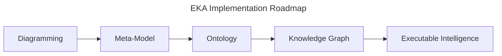
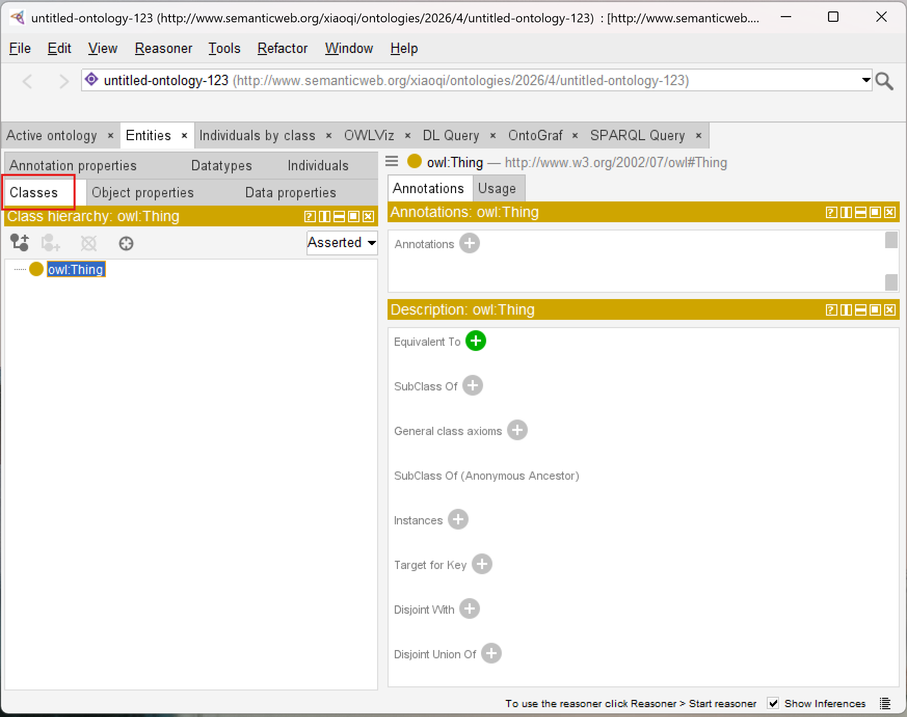
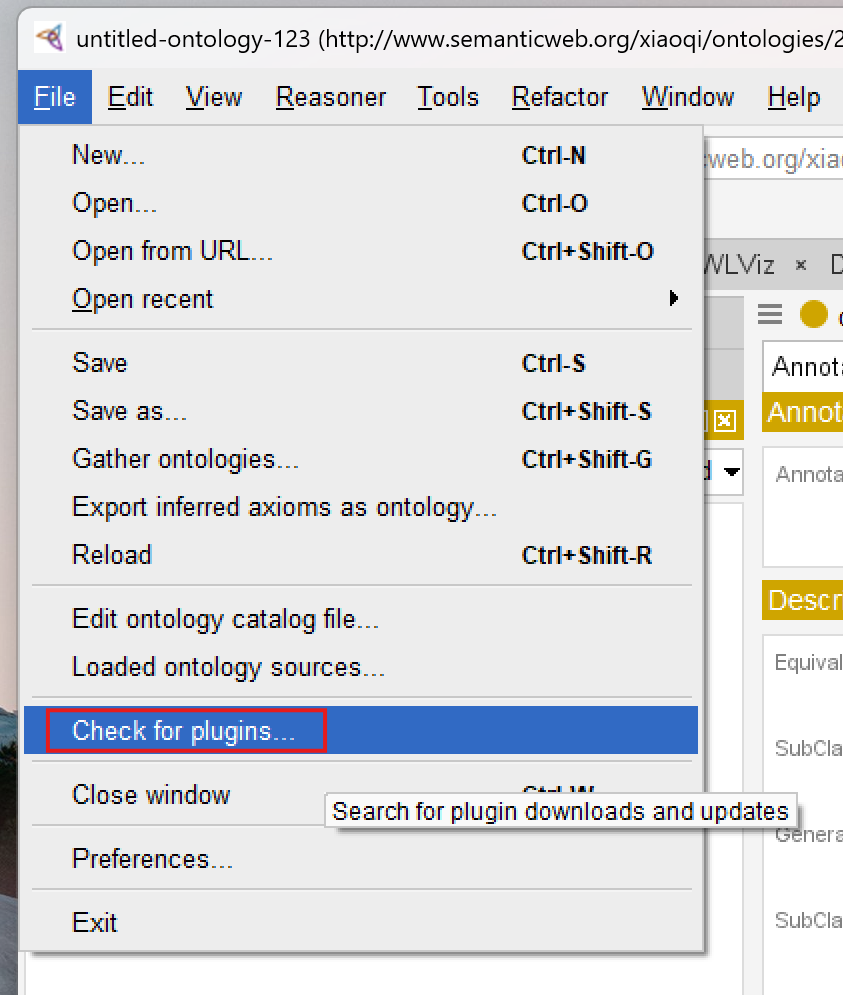
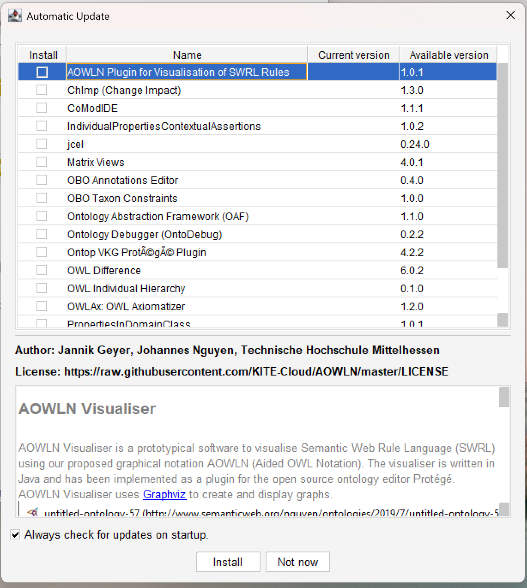
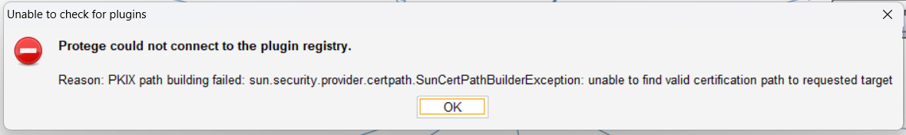

# Chapter 03 - Installing Protégé and Understanding the Ontology Engineering Workspace

In the previous chapters, we explored the conceptual foundations of ontology engineering and introduced the semantic thinking behind OWL and the Pizza ontology. We also discussed how ontology fits within the broader EKA (Executable Knowledge Architecture) frameworks as the critical semantic layer between meta-modeling and knowledge graph intelligence.

This chapter now moves into the practical environment where ontology engineering actually happens:

> Protégé

Before building ontologies, you must first understand the ontology engineering workspace itself. Just as software developers require familiarity with their IDEs, ontology engineers must understand the tools, perspectives, editors, and semantic workflow provides by Protégé

This chapter focuses on two major objectives:

1. Installing Protégé properly
2. Understanding the Protégé user interface and semantic engineering environment

Although installation may initially appear straightforward, the deeper goal of this chapter is much more important:

> Understanding Protégé not simply as software, but as a semantic engineering platform.

This chapter is aligned with the hands-on installation and UI walkthrough demostrated in the video tutorial and builds upon the foundational theory introduced in Michael DeBellis' Pizza OWL tutorial.

- [3.1 Why Protégé Matters in Ontology Engineering](#31-why-protégé-matters-in-ontology-engineering)
- [3.2 Installing Protégé](#32-installing-protégé)
- [3.3 Protégé as an Ontology IDE](#33-protégé-as-an-ontology-ide)
- [3.4 Understanding the Protégé Workspace](#34-understanding-the-protégé-workspace)
- [3.5 The Class Tab](#35-the-class-tab)
- [3.6 Understanding the Entity Tree](#36-understanding-the-entity-tree)
- [3.7 Ontology Editing vs. Diagram Drawing](#37-ontology-editing-vs-diagram-drawing)
- [3.8 OWL Serialization and Ontology Files](#38-owl-serialization-and-ontology-files)
- [3.9 Plugins and Extensibility](#39-plugins-and-extensibility)
- [3.10 The Importance of Semantic Workspace Familiarity](#310-the-importance-of-semantic-workspace-familiarity)
- [3.11 Protégé Within the EKA Vision](#311-protégé-within-the-eka-vision)
- [3.12 Developing the Ontology Engineering Mindset](#312-developing-the-ontology-engineering-mindset)
- [Chapter (03) Summary](#chapter-03-summary)
- [Key OWL Concepts](#key-owl-concepts)
- [Protégé Operations Learned](#protégé-operations-learned)
- [EKA Connection](#eka-connection)
- [Knowledge Graph Perspective](#knowledge-graph-perspective)
- [Next Chapter Preview](#next-chapter-preview)
- [Extended Reading - _Bonus_](#extended-reading---bonus)
  - [Fix the `Unable to chekc for plugins` Problem](#fix-the-unable-to-chekc-for-plugins-problem)
- [Referencde](#referencde)
- [Demo Video for this Chapter](#demo-video-for-this-chapter)

## 3.1 Why Protégé Matters in Ontology Engineering

Protégé is one of the most widely used ontology engineering platforms - far more than an editor - in the Semantic Web and Knowledge Graph ecosystem.

Originally developed at Stanford University, Protégé has become a foundational tool for:

- OWL ontology modeling
- Semantic Web development
- Knowledge graph engineering
- AI semantic modeling
- Enterprise ontology architecture
- Biomedical ontology research
- Linked data systems

Unlike traditional modeling tools, Protégé is designed specifically for semantic engineering.

This distinction is extremely important.

Most architecture or diagramming tools focus primarily on visualization:

- UML tools visualize structure
- BPMN tools visualize process
- ERD tools visualize data relationships

Protégé, however, focuses on:

```
Formal semantic meaning
```

Everything created inside Protégé ultimately contributes to executable semantic structures.

This is why Protégé plays such an important role with EKA.

In the EKA implementations roadmap:



Protégé becomes the primary engineering environment for the "Ontology' stage.

It is where semantic structurs are formally defined before later evolving into knowledge graphs and executable intelligence systems.

## 3.2 Installing Protégé

Protégé is distributed as a desktop application and supports multiple operating systems including:

- Windows
- macOS
- Linux

The official Protégé website provides downloadable installation packages:

https://protege.stanford.edu

You may choose `Use WebProtégé` at https://protege.stanford.edu/software#web-protege to experience its features before installing desktop.


The tutorial series uses Protégé 5.x, which supports modern OWL 2 ontology modeling capabilities.

Installation is generally straightforward:

1. Download the appropriate installer
2. Install Java if required
3. Launch Protégé
4. Configure workspace preferences if necessary

Although the installation process itself is relatively simple, you should understand an important archiectural point:

>[!Note] Protégé is not a lightweight note-taking or diagramming tool.<br><br>It is a semantic reasoning environment.

As ontology projects grow larger, Protégé becomes capable of managing:

- thousands of classes,
- semantic restrictions,
- logical inference,
- reasoning engines,
- ontology plugins,
- and graph-scale semantic models.

This is why understanding the workspace properly is essential from the beginning.

## 3.3 Protégé as an Ontology IDE

One of the most useful way to understand Protégé is to think of it as an IDE (Integrated Development Environment) for ontology engineering.

Software developers use environments such as:

- Visual Studio Code
- IntelliJ IDEA
- Eclipse IDE

to develop executable software.

Ontology engineers use Protégé to develop executable semantics.

This comparison helps explian why Protégé contains:

- editors,
- views,
- semantic structures,
- validation tools,
- plugins,
- reasoning engines,
- and ontology management capabilities.

Protégé is therefore not merely an editor.

It is a semantic engineering workspace.

Within EKA, Protégé can be viewed as:

```
An IDE for Executable Knowledge
```

This framing is extremely important because it changes how learners perceive ontology engineering itself.

Ontology engineering is not documentation work.

It is semantic system engineering.

## 3.4 Understanding the Protégé Workspace

When Protégé launches for the first time, the interface may appear complex to new users.

This is normal because Protégé exposes multiple semantic engineering perspectives simultaneously.

The workspace is designed around ontology components rather than visual diagrams.

Major areas of the interface include:

- Class hierarchy panel
- Entity editors
- Annotation views
- Object property tabs
- Data property tabs
- Individual management views
- Reasoner controls
- Ontology metadata panels

Unlike ordinary modeling tools, Protégé is organized around semantic structures.

This reflects a fundamental prinicple of ontology engineering:

```
Meaning comes before visualization
```

If you're familiar ArchiMate and used to Archi (the ArchiMate modeling tool), the difference of their philosophy in modeling is significant:

- Archi (ArchiMate): Diagramming First, then Relationships Second
- Protégé (Ontology): Relationships First, then Visualization Second

Protégé prioritizes semantic precision over graphical appearance. (see more in [3.7](#37-ontology-editing-vs-diagram-drawing))

This may initially feel unfamiliar to users coming from traditional enterprise architecture tools.

However, this semantic-first design is one reason ontology systems scale effectively into AI and knowledge graph ecosystems.

## 3.5 The Class Tab

One of the first and most important areas you will encounter is the `Classses` tab.



This is where ontology taxonomies are constructed and managed.

Inside the Classes tab, users can:

- Create classes,
- organize hierarchies,
- define subclasses,
- add annotations,
- and later define logicl restrictions.

At the top of the hierarchy sits `owl:Thing` which represents the universal root class in OWL.

All ontology classes ultimately inherit from `Thing`.

This is one of the first places where you begin experiencing semantic hierarchy construction directly.

Even simple class creation contributes to formal OWL semantics underneath.

## 3.6 Understanding the Entity Tree

The entity tree displayed inside Protégé is more than a visual navigation structure.

It represents semantic inheritance relationships.

For example:

```
PizzaTopping
  |-- CheeseTopping
  |-- MeatTopping
  |-- VegetableTopping
```

is not simply a visual grouping.

It formally means: `CheeseTopping ⊆ PizzaTopping`.

This distinction is essential.

Protégé is continuously generating semantic axioms behind the interface.

This is one reason ontology engineering differs fundamentally from ordinary taxonomy management.

## 3.7 Ontology Editing vs. Diagram Drawing

Many new users initially expect Protégé to behave like a graphical modeling application such as:

- Microsoft Visio
- Sparx Systems Enterprise Architect
- Lucidchart
- Archi Tool
- draw.io, etc

However, Protégé operates differently.

Traditional modeling tools often prioritize:

- layout,
- shapes,
- visual connectors,
- and presentations.

Protégé prioritizes:

- semantic logic,
- ontology structures,
- formal menaing,
- and reasoning consistency.

This distinction becomes one of the most important mindset transitions in ontology engineering.

The ontology itself is the executable artifact.

Visualization is secondary.

Within EKA, this reflects the shift from:

```
Static Architecture Documentation
```

to:

```
Executable Semantic Architecture
```

## 3.8 OWL Serialization and Ontology Files

Another important concept introduced during installation and project creation is **ontology serialization**.

Protégé stores ontologies using standardized semantic formats such as:

- RDF/XML
- Turtle
- OWL/XML

These formats allow ontologies to become portable semantic assets.

Unlike proprietary diagram files, OWL ontologies can later integrate into:

- semantic APIs,
- graph databases,
- Linked Data systems,
- AI semantic layers,
- and enterprise knowledge graphs.

This portability is one reason ontology engineering has become increasingly important in modern AI ecosystems.

Semantic knowledge becomes reusable infrastructure.

## 3.9 Plugins and Extensibility

Protégé also supports a plugin ecosystem.

From menu `File > Check for plugin...`, you can open the plugins window:



The plugin list will be shown and you can check the version and detail information:



This is important because ontology engineering often evolves beyond simple class modeling.

Plugins may provide capabilities such as:

- reasoning engines,
- graph visualization,
- query execution,
- ontology validation,
- semantic analysis,
- and knowledge graph integration.

As you progress further into ontology engineering, Protégé gradually transforms from a simple editor into a semantic engineering platform.

This extensibility aligns closely with EKA thinking, where ontology eventually becomes part of larger executable intelligence pipelines.

> If you see the error `Unable to chekc for plugins`, check the [tip](#fix-the-unable-to-chekc-for-plugins-problem) in the end of this chapter - Extended Reading.

## 3.10 The Importance of Semantic Workspace Familiarity

One of the most underestimated aspects of ontology engineering is **workspace fluency**.

Beginners often focus entirely on OWL theory while neglecting tool mastery.

However, productive ontology engineering requires both:

- semantic understanding,
- and engineering workflow familiarity.

Experienced ontology engineers develop fluency in:

- navigating ontology structures,
- managing semantic hierarchies,
- organizing entities,
- interpreting inferred structures,
- and maintaining semantic consistency.

This is very similar to software development.

Knowing programming theory alone is insufficient without development environment proficiency.

Protégé therefore becomes part of the ontology engineer's cognitive workflow.

## 3.11 Protégé Within the EKA Vision

Within EKA, Protégé occupies a strategically important role.

Traditional enterprise architecture often produces:

- static diagrams,
- disconnected repositories,
- and non-executable documentations.

Protégé enables the transition into:

```
Machine-readable semantics
```

This is a foundational shift.

The ontology models built inside Protégé later become candidates for:

- semantics APIs,
- knowledge graphs,
- AI context layers,
- digital twins,
- and executable enterprise intelligence.

This is why ontology engineering matters far beyond academic Semantic Web research.

Protégé is not just a modeling application.

It is part of the infrastructure stack for intelligent architecture systems.

## 3.12 Developing the Ontology Engineering Mindset

At this stage, you should begin shifting from:

```
Diagram Thinking
```

toward:

```
Semantic Thinking
```

This transition is one of the MOST IMPORTANT conceptual evolutions in the entire Pizza tutorial journey.

Ontology engineering asks fundamentallly different questions:

Instead of:

```
"What should this diagram look like?"
```

ontology engineering asks:

```
"What does this concept mean semantically?"
```

This semantic-first mindset later becomes essential for:

- knowledge graphs,
- semantic AI,
- enterprise reasoning,
- and executable intelligence systems.

## Chapter (03) Summary

In this chapter, we installed Protégé and explored the ontology engineering workspace for the first time.

We examined:

- Protégé installation,
- the semantic engineering environment,
- ontology editing perspectives,
- class hierarchy navigation,
- OWL serialization formats,
- plugin extensibility,
- and the conceptual difference between ontology engineering and traditional diagramming.

Most importantly, we introduced Protégé as an ontology IDE and semantic engineering platform rather than merely a modeling application.

This chapter also reinforced Protégé's role within the EKA framework as the primary environment for transforming conceptual architecture into executable semantic structures.

## Key OWL Concepts

| Concept | Description |
| --- | --- |
| Ontology Editor | A software environment used to create and manage semantic ontologies. |
| OWL Serialization | The standarized storage format used to represent OWL ontologies. |
| Semantic Hierarchy | A class structure representing format inheritance relationships. |
| Ontology Workspace | The engineering environment used for semantic modeling and ontology management. |
| Semantic Engineering | The discipline of formally modeling machine-readable meaning. |

## Protégé Operations Learned

During this chapter, you learned how to:

- Install Protégé
- Launch the Protégé environment
- Understand the workspace layout
- Navigate ontology panels
- Explore class hierarchies
- Understand ontology file structures
- Recognize Protégé perspectives and editors

## EKA Connection

Within EKA, Protégé represents the primary semantic engineering environment for ontology construction.

It enables the transition from:

```
Meta-Model Thinking
```

to:

```
Executable Semantic Modeling
```

The workspace familiarity developed in this chapter forms the operational foundation for all future ontology engineering activities inside the EKA execution pipeline.

## Knowledge Graph Perspective

Protégé itself is not a graph database.

However, the semantic structures created within Protégé form the foundational layer that later enables knowledge graph generation.

The ontology classes, hierarchies, and semantic definitions managed inside Protégé eventually become graph-ready semantic assets.

Ontology engineering therefore acts as a precursor to enterprise knowledge graph engineering.

## Next Chapter Preview

In the next chapter, we will begin building the Pizza ontology from the ground up inside Protégé.

You will learn how to create classes, establish subclass hierarchies, and annotate your ontology with meaningful descriptions.

This chapter marks the first step in transforming your understanding of semantic structures into hands-on ontology modeling.

By the end, you will gain practical experience in organizing conceptual categories, preparing the foundation for more advanced semantic modeling in subsequent chapters.

## Extended Reading - _Bonus_

### Fix the `Unable to chekc for plugins` Problem

If you want to check plugins, but get below popup error:



No worry!

This error message, specifically the `SunCertPathBuilderException`, usually indicates that the Java environment Protégé is running on doesn't trust the SSL certificate of the plugin registry.

This is very common when you're working behind a corporate firewall or proxy that uses SSL inspection (man-in-the-middle decryption).

I've struggled with this problem in my company assigned machine, and below steps are for your reference and hope they can solve issues on your side as well:

> Since my system uses a custom root CA certificate, it is needed to manually import that certificate into the Java TrustStore used by Protégé.

1. Identify the Java Runtime

Protégé often comes with its own bundled Java Runtime Environment (JRD). You need to find where it's located:

- Look in the Protégé installation folder for a directory named `jre`.
- If it's not there, Protégé is likely using your system's default Jave (check your `JAVA_HOME` environment variable).

2. Export the Corporate Root Certificate

    1) Open your web browser (Chrome or Edge).
    2) Go to the URL the registry is trying to hit (usually `https://protege.stanford.edu`).
    3) Click the **Padlock icon** in the address bar -> **Connection is secure** -> **Certificate is valid**.
    4) Go to the **Details** or **Certification Path** tab.
    5) Select the **Root Certificate** (the one at the very top of the hierarchy).
    6) Click **Export** or **Copy to File** and save it as a `.cer` or `.crt` file (e.g. `company_root.cer`).

3. Import the Certificate inot the KeyStore

Open a Command Prompt or Terminal as **Administrator** and run the `keytool` command. You will need to point it to the `cacerts` file inside the Protégé JRE.

Below command assumes you're running in Windows machine.

```Bash
keytool -import -trustcacerts -alias corporate-root -file "C:\path\to\company_root.cer" -keystore "C:\path\to\Protege\jre\lib\security\cacerts"
```

  - **Default Password**: The default password for the Java keystore is `changeit`.
  - **Trust**: When asked "Truest this certificate?", type `yes`.

4. Alternative: Manual Plugin Installation

If you can't bypass the proxy/SSL issues, you may download plugins manually:

    1) Visit the "Protégé Plugin Library" (https://protege.stanford.edu/ontologies.php) in your browser.
    2) Download the `.jar` file for the plugin you need.
    3) Drop the file into the `plugins` folder inside your Protégé installation directory.
    4) Restart Protégé.

## Referencde

- Protégé Official Website: https://protege.stanford.edu
- Protégé Wiki: https://protegewiki.stanford.edu
- Michael DeBellis, _A Practical Guide to Building OWL Ontologies Using Protégé 5.5 and Plugins_: https://www.researchgate.net/publication/351037551_A_Practical_Guide_to_Building_OWL_Ontologies_Using_Protege_55_and_Plugins
- Protégé Pizza Repository: https://github.com/yasenstar/protege_pizza
- EKA Official Website: https://xiaoqi.com/

## Demo Video for this Chapter

YouTube Demo Video - Chapter 03: https://youtu.be/Q6eq-cWBpfQ

---

Last updated at: 5/16/2026, 4:41:43 PM 