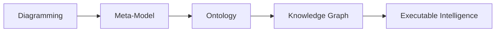

# Chapter 03 - Installing Protégé and Understanding the Ontology Engineering Workspace

In the previous chapters, we explored the conceptual foundations of ontology engineering and introduced the semantic thinking behind OWL and the Pizza ontology. We also discussed how ontology fits within the broader EKA (Executable Knowledge Architecture) frameworks as the critical semantic layer between meta-modeling and knowledge graph intelligence.

This chapter now moves into the practical environment where ontology engineering actually happens:

> Protégé

Before building ontologies, you must first understand the ontology engineering workspace itself. Just as software developers require familiarity with their IDEs, ontology engineers must understand the tools, perspectives, editors, and semantic workflow provides by Protégé

This chapter focuses on two major objectives:

1. Installing Protégé properly
2. Understanding the Protégé user interface and semantic engineering environment

Although installation may initially appear straightforward, the deeper goal of this chapter is much more important:

> Understanding Protégé not simply as software, but as a semantic engineering platform.

This chapter is aligned with the hands-on installation and UI walkthrough demostrated in the video tutorial and builds upon the foundational theory introduced in Michael DeBellis' Pizza OWL tutorial.

- [3.1 Why Protégé Matters in Ontology Engineering](#31-why-protégé-matters-in-ontology-engineering)
- [3.2 Installing Protégé](#32-installing-protégé)

## 3.1 Why Protégé Matters in Ontology Engineering

Protégé is one of the most widely used ontology engineering platforms - far more than an editor - in the Semantic Web and Knowledge Graph ecosystem.

Originally developed at Stanford University, Protégé has become a foundational tool for:

- OWL ontology modeling
- Semantic Web development
- Knowledge graph engineering
- AI semantic modeling
- Enterprise ontology architecture
- Biomedical ontology research
- Linked data systems

Unlike traditional modeling tools, Protégé is designed specifically for semantic engineering.

This distinction is extremely important.

Most architecture or diagramming tools focus primarily on visualization:

- UML tools visualize structure
- BPMN tools visualize process
- ERD tools visualize data relationships

Protégé, however, focuses on:

```
Formal semantic meaning
```

Everything created inside Protégé ultimately contributes to executable semantic structures.

This is why Protégé plays such an important role with EKA.

In the EKA implementations roadmap:



Protégé becomes the primary engineering environment for the "Ontology' stage.

It is where semantic structurs are formally defined before later evolving into knowledge graphs and executable intelligence systems.

## 3.2 Installing Protégé

Protégé is distributed as a desktop application and supports multiple operating systems including:

- Windows
- macOS
- Linux

The official Protégé website provides downloadable installation packages:

https://protege.stanford.edu

You may choose `Use WebProtégé` at https://protege.stanford.edu/software#web-protege to experience its features before installing desktop.


The tutorial series uses Protégé 5.x, which supports modern OWL 2 ontology modeling capabilities.

Installation is generally straightforward:

1. Download the appropriate installer
2. Install Java if required
3. Launch Protégé
4. Configure workspace preferences if necessary

Although the installation process itself is relatively simple, you should understand an important archiectural point:

>[!Note] Protégé is not a lightweight note-taking or diagramming tool.<br><br>It is a semantic reasoning environment.

As ontology projects grow larger, Protégé becomes capable of managing:

- thousands of classes