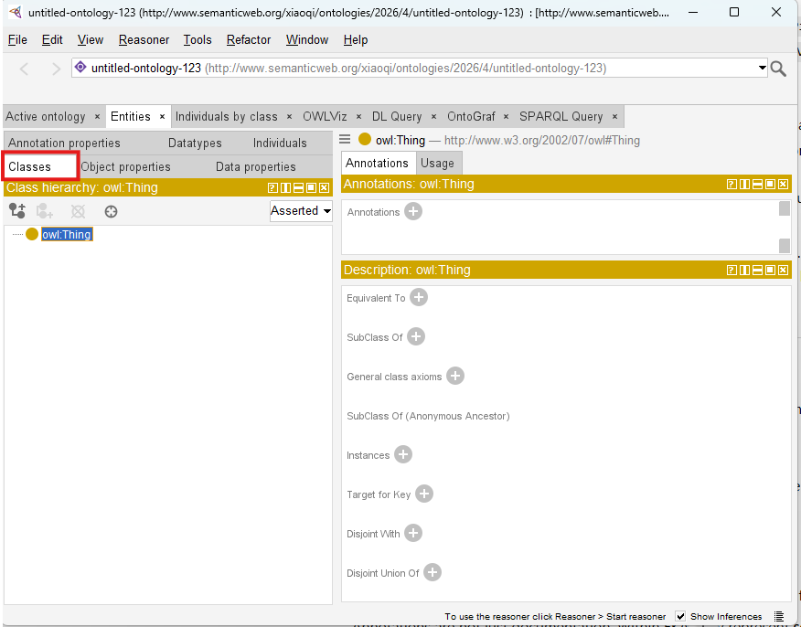
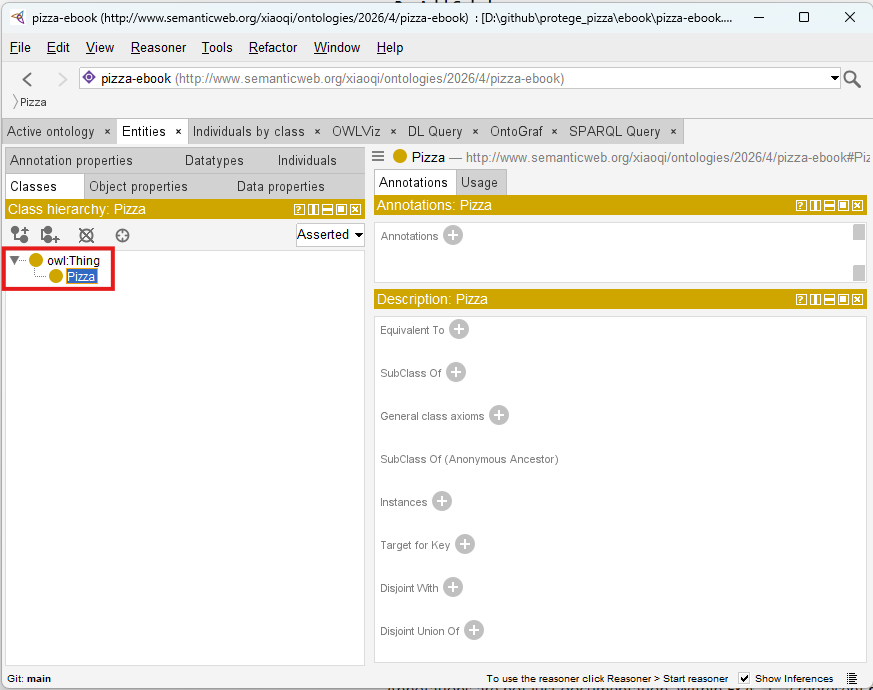
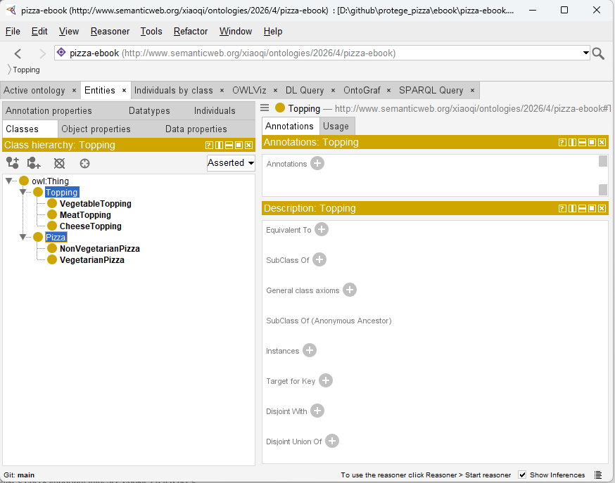
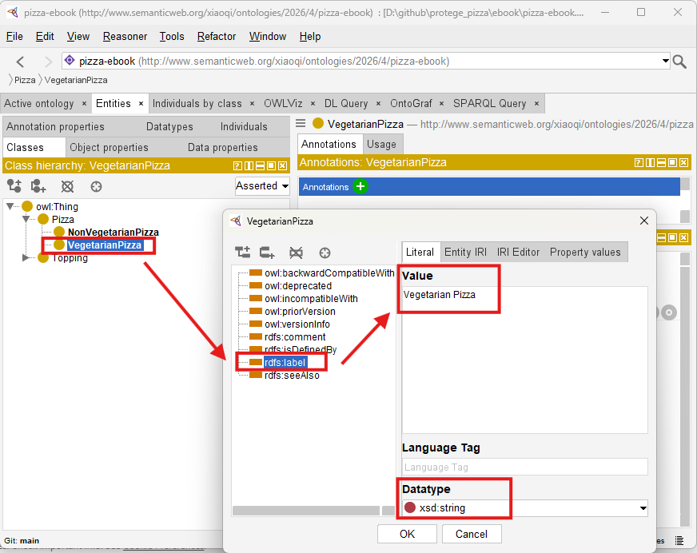
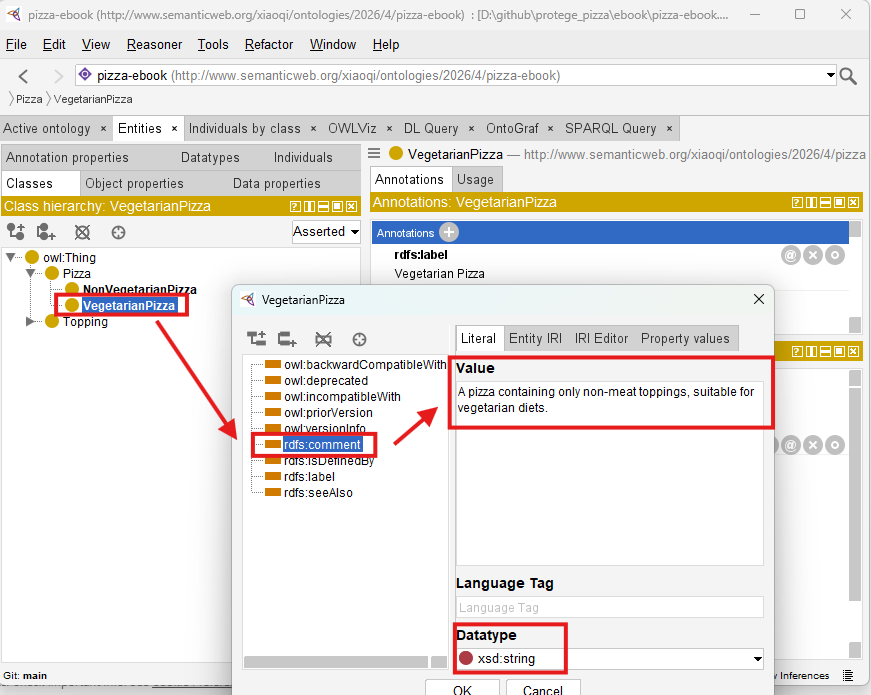
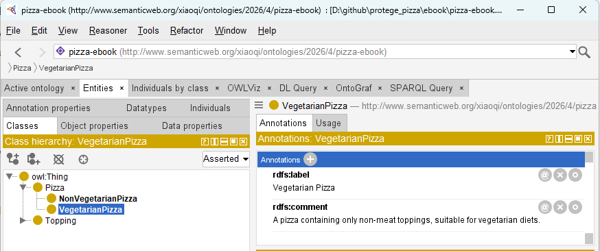

# Chapter 04 -- Creating Classes and Building the Pizza Ontology Skeleton in Protégé

In the previous chapter, we explored the Protégé workspace, navigating the ontology editing environment and understanding its key panels and perspectives. We also began to develop the mindset of a semantic engineer -- thinking in terms of conceptual categories, machine-readable meaning, and structured knowledge.

Now, we move from understanding the tool to **actively modeling domain concepts**. This chapter focuses on the first practical step in ontology engineering: creating classes and defining a structured hierarchy. Classes are the core of OWL ontologies -- they represent abstract concepts in a domain, define the structure for semantic relationships, and form the foundation for reasoning and knowledge graph construction.

From the perspective of the **Executable Knowledge Architecture (EKA)**, creating classes represents the first concrete step in translating enterprise knowledge from **meta-models and diagrams** into **formal, machine-understandable semantics**. Classes are the backbone nodes of your knowledge model, linking conceptual design to the eventual executable intelligence layer.

By the end of this chapter, you will be able to:

- Understand the role of classes in ontology modeling
- Create root and subclass hierarchies in Protégé
- Apply meaningful annotations to each class
- Organize the `Pizza` ontology skeleton for scalability and reasoning
- Connect your class structures to the broader EKA framework

Table of Content
- [4.1 Understanding Classes in Ontology](#41-understanding-classes-in-ontology)
- [4.2 Creating Classes in Protégé](#42-creating-classes-in-protégé)
- [4.3 Adding Annotations](#43-adding-annotations)
- [4.4 Organizing Subclass Hierarchies](#44-organizing-subclass-hierarchies)
- [4.5 Practical Exercise: Building the Skeleton Ontology](#45-practical-exercise-building-the-skeleton-ontology)
- [4.6 EKA Perspective](#46-eka-perspective)
- [Chapter Summary](#chapter-summary)
- [Key Concepts](#key-concepts)
- [Protégé Skills Learned](#protégé-skills-learned)
- [Next Chapter (05) Preview](#next-chapter-05-preview)
- [Demo Video for this Chapter (04)](#demo-video-for-this-chapter-04)

## 4.1 Understanding Classes in Ontology

In OWL, **classes** represent **conceptual categories** -- abstract groupings of things that share common characteristics. They answer the typical question: _"What types of entities exist in this domain?"

In the Pizza ontology:

- `Pizza` represents the overarching domain concepts for all pizzas.
- `Topping` represents ingredients or components added to pizzas.
- `VegetarianPizza` and `NonVegetarianPizza` represent specialized subclasses of `Pizza`, reflecting the dietary classification.
- `CheeseTopping`, `MeatTopping`, and `VegetableTopping` are subclasses of `Topping`, further organizing the ingredient concepts.

Classes are the **semantic anchors** for your ontology. They enable logical inheritance, reasoning, and relationships to be defined later.

In EKA terms, classes transform conceptual diagrams into **formal semantic nodes**, bridging the gap between enterprise knowledge design and executable intelligence.

Without a solid class hierarchy, downstream ontology operations like object property assignment, instance creation, and reasoning can become inconsistent or unreliable.

## 4.2 Creating Classes in Protégé

The process (step) of creating classes in Protégé introduces you to **hands-on ontology engineering**:

1. Open the Classes Tab:
   
   Protégé organizes ontology classes hierarchically in this tab. This interface allows for creation, subclassing, and annotation management.

   

2. Create the Root Class:
   
   While `owl:Thing` exists by default as the universal root, creating a domain-specific root, `Pizza`, gives semantic clarity and establishes a class starting point for the ontology.

   

3. Add Subclasses:
   
   - Under `Pizza`, create `VegetarianPizza` and `NonVegetarianPizza`.
   - Under `Topping`, create `CheeseTopping`, `MeatTopping`, and `VegetableTopping`

   

4. Manage the Hierarchy:
   
   - Ensure logical "is-a" relationships.
   - `VegetarianPizza ⊆ Pizza` means every vegetarian pizza is also a `Pizza`.
   - Subclassing defines semantic inheritance, which is foundational for future reasoning.

5. Validate and Save:
   
   Regularly saving and checking hierarchy consistency prevents structural errors. Protégé's visual hierarchy aids in spotting potential misclassifications.

This process demonstrates how **conceptual knowledge is formalized**. It also highlights the EKA principle that **well-structured ontology classes serve as the nodes of a future knowledge graph**, capable of supporting reasoning and executable intelligence workflows.

## 4.3 Adding Annotations

Annotations provide human-readable metadata for classes, making the ontology understandable to humans while remaining machine-readable.

- **Label** (`rdfs:label`): A description name of the class.
- **Comment** (`rdfs:comment`): An explanation of the class' purpose or semantic meaning.

For example:

- Class: `VegetarianPizza`
- Label: "Vegetarian Pizza"
- Comment: "A pizza containing only non-meat toppings, suitable for vegetarian diets."

> [!Note] You have to click `OK` after Label setting then add Comment annotation, every time only one annotation can be set

After adding, two annotations are as below:

## 4.4 Organizing Subclass Hierarchies

Hierarchy is more than a visual tree -- it defines **semantic inheritance**, which is the foundation of reasoning:

- `VegetarianPizza` inherits all properties and constraints from `Pizza`.
- `CheeseTopping` inherit from `Topping`.

Best practices:

1. Maintain a clear root-to-leaf path to avoid confusion.
2. Avoid duplicate classes; semantic ambiguity undermines reasoning.
3. Use comments and labels to clarify distinctions.
4. Ensure consistency with your meta-model diagrams.

This step mirrors the **Diagramming $\rightarrow$ Meta-Model $\rightarrow$ Ontology** pathway in EKA. Your diagrams represent conceptual ideas, meta-models define the structural rules, and ontology classes encode these as executable semantic constructs.

## 4.5 Practical Exercise: Building the Skeleton Ontology

By the end of this chapter, you should have a **working skeleton ontology**:

- **Root Classes**: `Pizza`, `Topping`
- **Subclasses**: `VegetarianPizza`, `NonVegetarianPizza`, `CheeseTopping`, `MeatTopping`, `VegetableTopping`
- **Annotations**: Labels and comments for all classes
- **Clean Hierarchy**: Logical parent-child relationships aligned with semantic inheritance principles

This skeleton forms the base upon which object properties, individuals, and reasoning rules will later be applied. The exercise reinforces the **progressive semantic difficulty principle**, gradually preparing you for more complex modeling.

## 4.6 EKA Perspective

Creating classes is a **critical step in the EKA roadmap**:

1. **Diagramming**: Conceptual pizza categories visualized in diagrams.
2. **Meta-Model**: Defining rules and semantic categories for structured knowledge.
3. **Ontology**: Translating classes into machine-readable semantic nodes.
4. **Knowledge Graph**: Classes will serve as nodes connected by properties, forming the backbone of semantic reasoning.
5. **Executable Intelligence**: Accurate class structures ensure that reasoning engines can infer, validate, and execute knowledge.

By properly designing classes, you are establishing **semantic scaffolding** that allows enterprise knowledge to become executable and AI-ready, bridging traditional modeling with cutting-edge knowledge engineering.

## Chapter Summary

In this chapter (04), you have:

- Explored the central role of classes in ontology modeling
- Created root and subclass hierarchies in Protégé
- Added annotations to improve human and machine interoperability
- Built the first skeleton of the Pizza ontology
- Connected practical exercises to EKA, understanding how classes become semantic nodes and eventually executable knowledge.

This exercise forms the essential foundation for future ontology enhancements, including object properties, individuals, and reasoning logic.

## Key Concepts

| Concept | Description |
| --- | --- |
| Class | A conceptual category representing domain entities. |
| Subclass| A specialization inheriting semantic properties. |
| Annotation | Human-readable metadata supporting clarity and documentation. |
| Hierarchy | Structured parent-child relationships defining semantic inheritance. |
| EKA Connection | Classes link diagrams and meta-models to knowledge graphs and executable intelligence. |

## Protégé Skills Learned

- Navigating the Classes tab
- Creating root and subclass hierarchies
- Adding labels and comments (annotations)
- Organizing semantic hierarchies for reasoning readiness

## Next Chapter (05) Preview

In the next chapter, we will explore **Named Classes**, the building blocks of formal ontology definition in OWL.

You will learn how to:

- Define clear and semantically meaningful class names
- Organize class hierarchies for scalability and clarity
- Apply naming conversions to support reasoning and knowledge integration
- Begin understanding how naming decisions impact ontology maintenance and interoperability

This step continues the progressive construction of the Pizza ontology, transforming your skeleton into a **structured, well-defined semantic model**, ready for further enrichment and reasoning.

## Demo Video for this Chapter (04)

YouTube Demo Video - Chapter 04: https://youtu.be/IMjKcx93ens

---

Last updated at: 2026-06-25