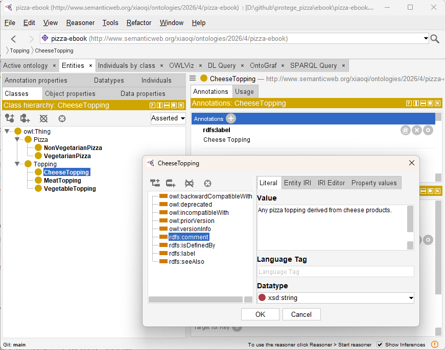
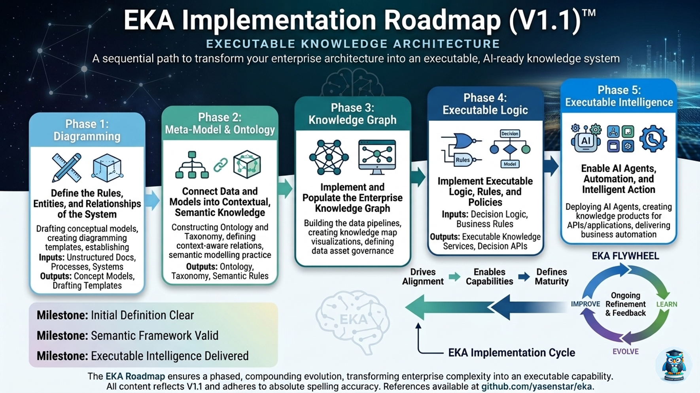

# Chapter 05 -- Defining Named Classes in the Pizza Ontology

In the previous chapter, we constructed the **skeleton of the Pizza ontology**, creating root classes and a preliminary hierarchy in Protégé. We established the foundational structure upon which the semantic richness of the ontology can be built. However, these initial classes, while necessary, are only placeholders without explicit definitions.

This chapter introduces **Named Classes**, which formalize each concept with a unique identifier, annotations, and clear semantic meaning. Named classes are critical because they allow the ontology to move from a conceptual structure into a **machine-readable semantic model**, laying the groundwork for relationshipos, reasoning, and knowledge gaph construction.

Named classes serve as the **primary semantic nodes** in any OWL ontology. Each named class encapsulates a domain concept in a way that can be referenced consistently throughout the ontology. Unlike temporary or anonymous classes, named classes are explicitly identifiable, enabling them to participate in object properties, class restrictions, and individual instances. In the Pizza ontology, examples include `Pizza`, `VegetarianPizza`, `NonVegetarianPizza`, and various topping classes such as `CheeseTopping` and `MeatTopping`. Each of these named classes represents a real-world concept, formalized in a way that machines and humans can both understand and utilize.

From the perspective of **Executable Knowledge Architecture (EKA)**, named classes occupy a central position. In the EKA roadmap, knowledge moves from **diagrams and conceptual models** to **meta-models**, then to **formal ontologies**, and finally into **knowledge graphs and executable intelligence**. Named classes mark the transition from abstract conceptualization to structured ontology nodes. These nodes are the semantic backbone of knowledge graphs, forming the vertices that will later be linked via object properties and populated with instances to support reasoning and AI-driven inference. The quality and clarity of named classes directly affect the effectiveness of the ontology in generating **reliable, executable intelligence**.

- [5.1 The Concept of Named Classes](#51-the-concept-of-named-classes)
- [5.2 Creating Named Classes in Protégé](#52-creating-named-classes-in-protégé)
- [5.3 Best Practices for Named Class Design](#53-best-practices-for-named-class-design)
- [5.4 Linking Named Classes to the EKA Framework](#54-linking-named-classes-to-the-eka-framework)
- [5.5 Practical Exercise: Completing the Named Class Structure](#55-practical-exercise-completing-the-named-class-structure)
- [5.6 Advanced Considerations](#56-advanced-considerations)
- [Chapter (05) Summary](#chapter-05-summary)
- [Key Concepts](#key-concepts)
- [Protégé Skills Learned](#protégé-skills-learned)
- [Next Chapter (06) Preview](#next-chapter-06-preview)
- [Demo Video for this Chapter (05)](#demo-video-for-this-chapter-05)

## 5.1 The Concept of Named Classes

A **Named Class** in OWL is more than a label. It is a formally defined entity within a **unique URI**, a descriptive label, and semantic annotations. These classes serve as reference points in the ontology, providing the structure necessary for logical consistency and automated reasoning. For instance, a class like `VegetarianPizza` is not only a subclass of `Pizza` but also a node that can be referenced when defining constraints, object properties, or when populating the ontology with individual pizza.

Defining Named Classes requires a careful balance between **semantic clarity** and **practical usability**. Each class name must accurately reflect the concept it represents and be easily understood by both humans and automated systems. Poorly named classes can introduce confusion, compromise reasoning accuracy, and hinder the ontology's utility in enterprise-scale knowledge systems.

Named classes, therefore, are the first step toward transforming abstract domain knowledge into an ontology that is both **maintainable** and **executable**, perfectly aligning with EKA principles.

## 5.2 Creating Named Classes in Protégé

Creating named classes in Protégé is an intuitive but deliberate process.

After opening the `Classes tab`, you begin by adding each concept as a name class. Unlike earlier placeholder classes, each Named Class is given a **unique, meaningful identifier**, which establishes it as a semantic entity in the ontology. In practice, this involves entering a class name, positioning it appropriately in the hierarchy, and adding labels and comments that clarify its purpose.

For example, the class `VegetarianPizza` is placed under `Pizza` in the hierarchy. Its label is "Vegetarian Pizza", and a comment might read: "A pizza containing only non-meat toppings, suitable for vegetarian diets."

Such annotations serve multiple purposes, they
- clarify intent for humans,
- guide ontology maintenance,
- and provide context for reasoning engines.

Similarly, `CheeseTopping` under `Topping` is labeled "Cheese Topping" with a comment like "Any pizza topping derived from cheese products."

Each annotation ensures that the semantic intent is explicit, facilitating both **knowledge reuse** and **interoperability**.

When adding named classes, it is crucial to maintain **hierarchical integrity**. Subclasses must logically inherit from their parents. For instance, `VegetarianPizza` is a subclass of `Pizza`, meaning all properties or restrictions applied to `Pizza` will propagate to `VegetarianPizza`. Maintaining this hierarchy ensures that the ontology can support **reasoning engines**, which depend on inheritance relationships to infer new knowledge.

## 5.3 Best Practices for Named Class Design

Creating effective named classes involves more than simply typing names into Protégé. One of the most important practices is **naming consistency**. All classes should follow a clear naming convention that reflects the domain logic and is easy for both humans and automated systems (machines) to interpret.

For example, all pizza types might use the suffix "Pizza", while toppings can consistently use the suffix "Topping".

Such conventions reduce ambiguity and improve the maintainability of the ontology.

Another critical practice is **annotation discipline**. Every named class should include descriptive labels and comments. This documentation provides semantic context, which becomes increasingly important as the ontology grows and as multiple engineers collaborate on its development. Well-annotated classes are also easier to integrate into **knowledge graphs**, where clear semantic definitions are essential for AI-driven inference.

Finally, class hierarchies must reflect **real-world domain logic**. Avoid unnecessary duplication and ensure that every subclass meaningfully specializes its parent.

For instance, `VegetarianPizza` should include all vegetarian verieties without overlapping with `NonVegetarianPizza`. This discipline preserves both semantic clarity and reasoning accuracy, essential for enterprise-grade ontologies.

## 5.4 Linking Named Classes to the EKA Framework

Within the **EKA framework**, named classes provide a direct link between conceptual design and executable intelligence.

The process can be seen as a multi-layer transformation:

1. **Diagramming Layer**: Conceptual pizza types and ingredient categories are visualized
2. **Meta-Model Layer**: Rules governing the relationships between pizzas, toppings, and dietary classifications are defined
3. **Ontology Layer**: Named classes formalize these concepts into OWL classes with clear hierarchy, labels, and annotations.
4. **Knowledge Graph Layer**: Each named class becomes a node that can participate in relationships and reasoning operations.
5. **Executable Intelligence Layer**: Reasoning engines and AI systems can now inder new knowledge, validate consistency, and support enterprise decision-making.

See below the Version 1.1 (as of when book is written) of EKA Framework:

> You may visit https://xiaoqi.com for more detail about EKA

By defining named classes meticulously, you ensure that the ontology is not only correct but also **ready for AI-driven inference**, a key goal of EKA. In practice, this means that any subsequent steps -- such as defining object properties, adding restrictions, or creating individuals -- operate on a **semantically sound foundation**.

## 5.5 Practical Exercise: Completing the Named Class Structure

To solidify your understanding, this chapter's exercises guide learners through:

- Reviewing the Chapter 04 class skeleton
- Defining named classes for all key pizza types and toppings
- Applying consistent labels and comments for semantic clarify
- Organizing the hierarchy to ensure logical inheritance and scalability
- Documenting naming conventions and design retionale for maintainability

Upon completion, the Pizza ontology will have a **full articulated class layer**, forming a robust semantic foundation. This layer is now ready for the addition of relationships, property restrictions, and reasoning in subsequent chapters.

## 5.6 Advanced Considerations

As your ontology grows, consider:

- **Scalability**: Ensure that naming and hierarchy choices support the future addition of new pizza varieties, toppings, or dietary categories.
- **Interoperability**: Named classes should align wiht external standards when integrating with orther ontologies or knowledge graphs.
- **Reasoning Readiness**: Clear class definitions prevent logical inconsistencies, enabling the reasoner to infer meaningful conclusions.
- **Enterprise Knowledge Alignment**: Named classes formalize organizational knowledge, making it reusable and actionable across business systems.

## Chapter (05) Summary

In this chapter, you have:

- Defined and structured **Named Classes** in Protégé
- Applied annotations and labels for semantic clarity
- Organized subclass hierarchies to preserve inheritance
- Connected named classes to the **EKA framework**, ensuring they serve as nodes in the knowledge graph and form the basis for executable intelligence
- Prepared the ontology for reasoning and advanced semantic modeling

The Pizza ontology is now a **semantically robust structure**, ready to incorporate relationships, reasoning, and instance data.

## Key Concepts

| Concept | Description |
| --- | --- |
| Named Class | A formally defined, uniquely identifiable concept in OWL |
| Hierarchy | Parent-child relationships that define semantic inheritance |
| Annotation | Labels and comments clarifying meaning for humans and machines |
| EKA Integration | Named classes bridge diagrams and meta-models to knowledge graphs and executable intelligence |

## Protégé Skills Learned

- Creating and naming classes explicitly
- Organizing hierarchical structures for semantic inheritance
- Applying labels and comments consistently
- Preparing the ontology for reasoning and knowledge graph development

## Next Chapter (06) Preview

In the next chapter, we will introduce **using a reasoner** in Protégé. This chapter will demostrate how to:

- Apply a reasoning engine to your ontology
- Detect logical inconsistencies in class hierarchies
- Infer implicit relationships between classes and individuals
- Validate the ontology against OWL semantic rules

With the reasoning engine, your structured named classes will no longer be static; they will form the basis of a **dynamic, executable ontology** capable of supporting intelligent knowledge inference decision-making, and integration into enterprise knowledge systems under the EKA framwork.

## Demo Video for this Chapter (05)

Demo video reference: YouTube - Chapter 05 (https://youtu.be/QqVrFxaEFrI)

---

Last updated at 5/18/2026