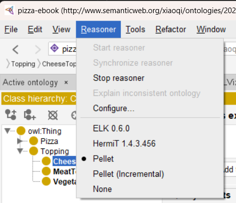
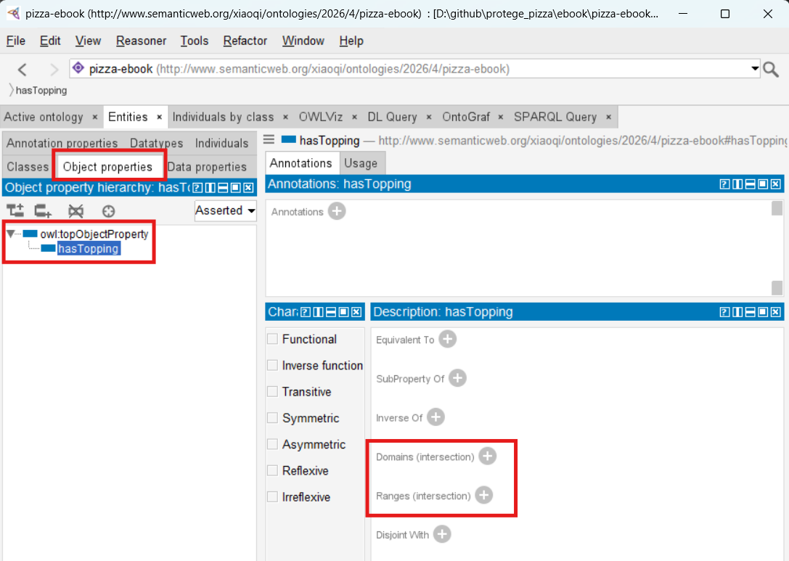
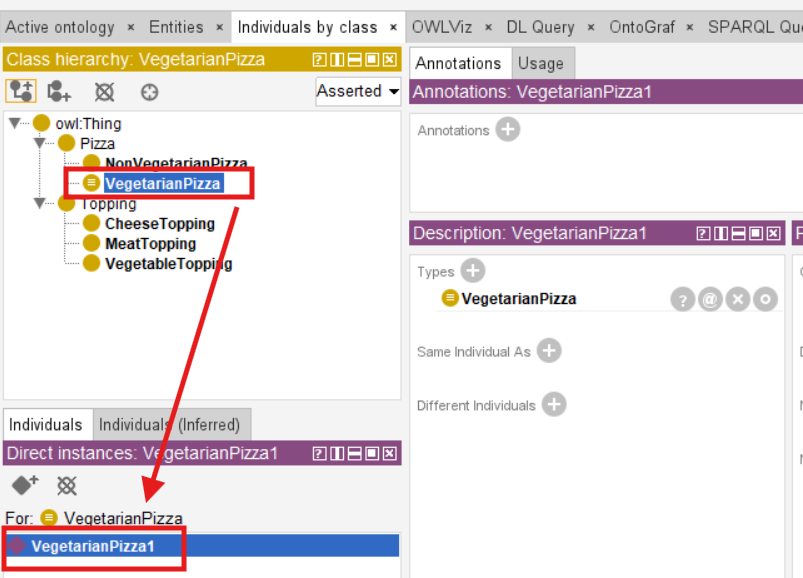
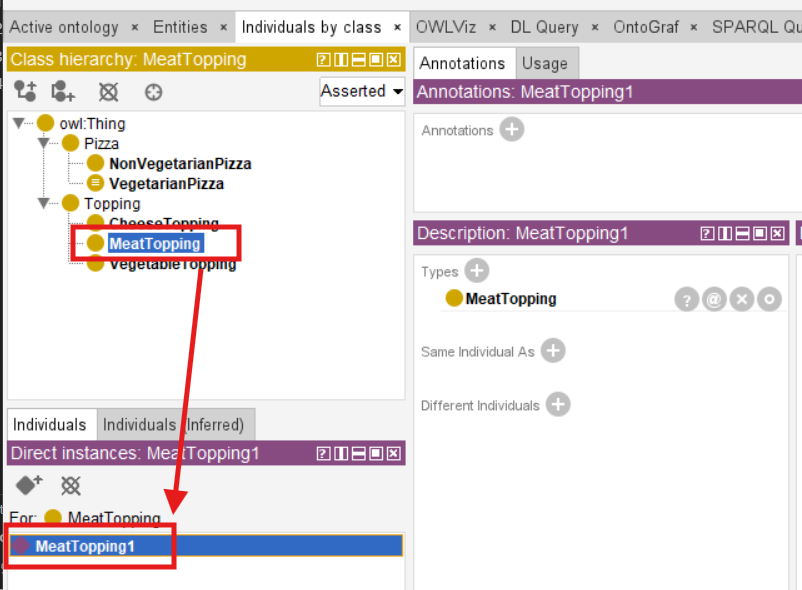
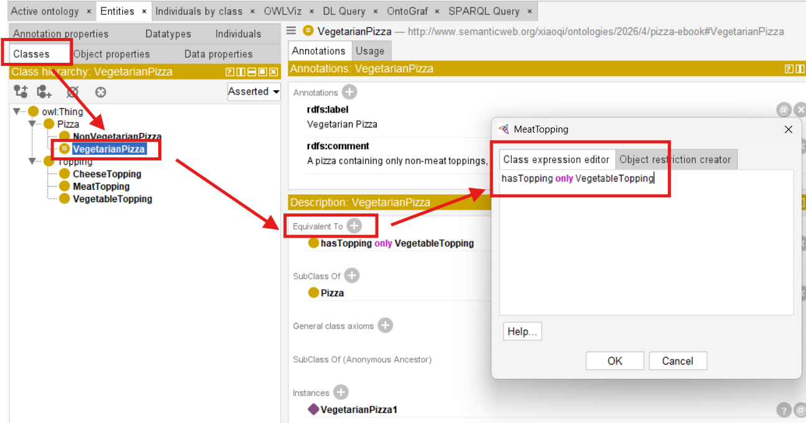
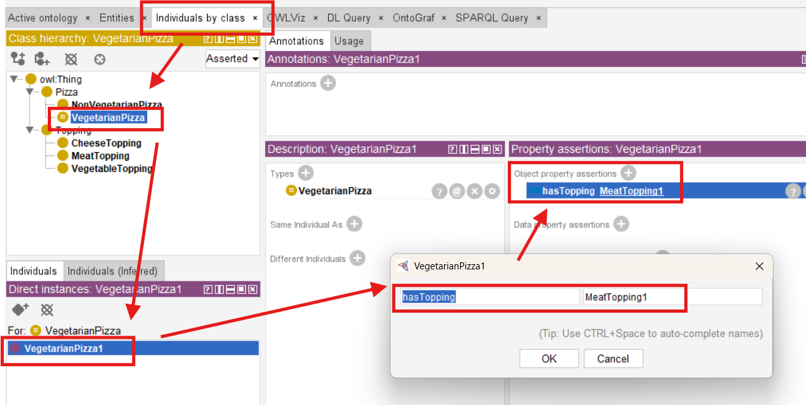
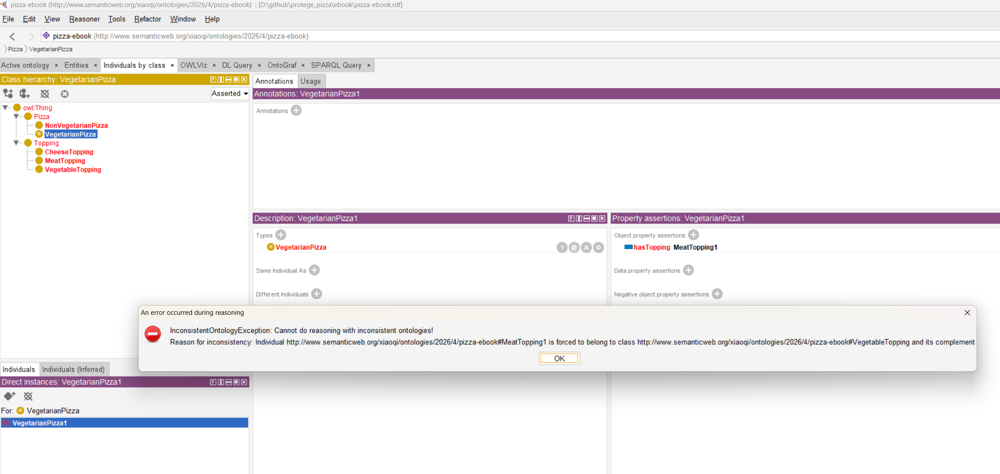
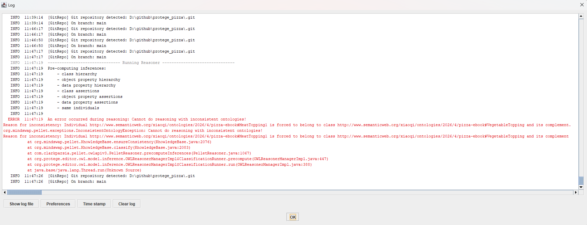
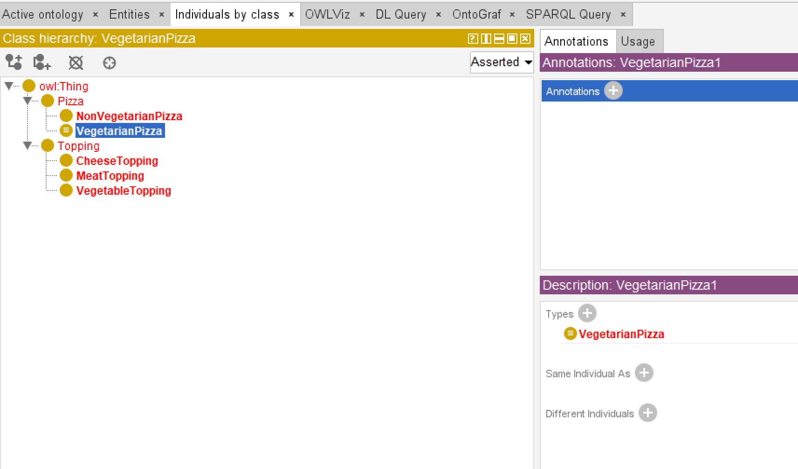

# Chapter 06 -- Applying a Reasoner to the Pizza Ontology

Having established a robust semantic foundation in Chapter 05 with **Named Classes**, we are now prepared to advance to a pivotal step in ontology engineering: **reasoning**.

Reasoners are software engines that can automatically **infer knowledge**, detect inconsistencies, and validate the logical structure of an ontology. They transform your ontology from a static hierarchy of classes into a **dynamic, intelligent knowledge model**, capable of supporting AI-driven insights and enterprise decision-making.

Within the **EKA framework**, reasoners operate at the intersection of the **Ontology layer** and the **Knowledge Graph layer**. Named classes, which were previously defined and annotated, serve as the nodes, while the reasoner evaluates their relationships, constraints, and hierarchy to produce new knowledge or detect logical errors.

In essence, reasoning allows an ontology to become **executable intelligence**, aligning directly with EKA's goal of turning formal knowledge structures into actionable insights.

- [6.1 Understanding Reasoners: What They Are and Why They Matter](#61-understanding-reasoners-what-they-are-and-why-they-matter)
- [6.2 Preparing the Ontology for Reasoning](#62-preparing-the-ontology-for-reasoning)
- [6.3 Running a Reasoner in Protégé](#63-running-a-reasoner-in-protégé)
- [6.4 Interpreting Reasoner Outputs](#64-interpreting-reasoner-outputs)
- [6.5 Practical Exercise: Applying Reasoners to the Pizza Ontology](#65-practical-exercise-applying-reasoners-to-the-pizza-ontology)
- [6.6 One More Hands-on Sample](#66-one-more-hands-on-sample)
- [6.7 EKA Perspective: Reasoners as Enablers of Executable Knowledge](#67-eka-perspective-reasoners-as-enablers-of-executable-knowledge)
- [6.8 Common Challenges and Best Practices](#68-common-challenges-and-best-practices)
- [Chapter (06) Summary](#chapter-06-summary)
- [Key Concepts](#key-concepts)
- [Protégé Skills Learned](#protégé-skills-learned)
- [Next Chapter (07) Preview](#next-chapter-07-preview)
- [Demo Video for this Chapter (06)](#demo-video-for-this-chapter-06)

## 6.1 Understanding Reasoners: What They Are and Why They Matter

A **reasoner** is a software engine that evaluates an ontology's logical consistency and derives implicit knowledge. Think of it as a semantic "auditor" that ensures every class, subclass, and property aligns with the rules defined in the ontology. Unlike humans, reasoners can process thousands of axioms instantaneously, making them indispensable in large-scale or enterprise ontologies.

Reasoners perform the following three major functions:

1. **Consistency Checking**: Detecting logical contradictions, such as a pizza being both `VegetarianPizza` and containing `MeatTopping`.
2. **Classification**: Automatically computing subclass relationships that were not explicitly defined.
3. **Inference**: Deductively identifying implicit knowledge, e.g., a pizza containing only `VegetableTopping` can be inferred to be a `VegetarianPizza`.

In EKA, reasoners bridge the **ontology layer** and the **knowledge graph layer**, allowing named classes to become **dynamic nodes**. They ensure that enterprise semantic models are **cohesive, reliable, and ready for automated inference**, which is the essense of executable intelligence.

## 6.2 Preparing the Ontology for Reasoning

Before running a reasoner, the ontology must be **reasoner-ready**.

This includes ensuring:

- **Complete Named Class Hierarchy**: Chapter 05 provided this foundation. Every named class, such as `VegetarianPizza`, `NonVegetarianPizza`, and `Topping` subclasses, should be well-defined and logically positioned.
- **Annotation Completeness**: Labels (`rdfs:label`) and comments (`rdfs:comment`) help the reasoner interpret the ontology and improve maintainability for human collaborators.
- **Preliminary Logical Validation**: Manual checks for obvious contradictions in subclass relationships, e.g., `no pizza should simultaneously inherit conflicting classes without explicit design`.

These preparations ensure that the reasoner can **maximize its inference capabilities**, generating meaningful insights without false positives or errors.

## 6.3 Running a Reasoner in Protégé

Protégé supports several high-quality reasoners, including **HermiT**, **Pellet**, and **Fact++**.

Here is my view from `Reasoner` menu:



It is fine that you may have different Reasoners installed, I'm normally use `Pellet` reasoner. The `Start reasoner` is in gray means the reasoner has been started.

Using a reasoner is straightforward but requires careful observation of its outputs.

The steps are:

1. **Select a Reasoner**: From the Protégé toolbar, select `Pellet` (or your preferred reasoner, like HermiT).
2. **Start the Reasoner**: Activating it will initiate logical evaluation across all classes and properties
3. **Observe Inferred Hierarchies**: The reasoner updates subclass relationships to reflect implicit connections. For example, pizza defined only by their toppings may be automatically categorized into `VegetarianPizza` or `NonVegetarianPizza`.
4. **Examine Warnings and Errors**: Unsatisfiable classes or inconsistencies will be flagged. This provides immediate feedback on areas requiring correction.

Unlike manual validation, reasoners can handle complex ontologies with **thousands of classes**, uncovering subtle contradictions that might be missed by even experienced engineers.

## 6.4 Interpreting Reasoner Outputs

Once the reasoner completes, Protégé provides a variety of outputs:

- **Inferred Class Hierarchy**: Subclasses that were previously undefined but are logically implied are now visible.
- **Unsatisfiable Classes**: Classes that cannot logically exist given current axioms, such as a pizza defined as both `VegetarianPizza` and containing `MeatTopping`.
- **cConsistency Warnings**: Highlight potential logical conflicts that may compromise reasoning.
- **Suggested Inferences**: Implicit relationships that can now be exploited in knowledge graphs.

Understanding these outputs is critical for refining the ontology. Each flagged issue is an opportunity to **improve semantic clarity**, enforce domain logic, and ensure that the ontology can serve as a **reliable knowledge graph backbone** in enterprise applications.

> **Important Note on Inference Materialization**
>
> In Protégé's default desktop workflow, the inferences you see in the interface are **displayed as inferred axioms** -- they are not automatically written back (materialized) as asserted triples into the saved ontology file. This is a common design choice for ontology editing environments, where the goal is to allow modelers to review and validate reasoning results before deciding whether to accept them.
>
> However, this behavior should not be mistaken for a universal limitation of OWL reasoners or semantic systems -- while that happens on myself when I only learnt Protégé first. In production-grade environments -- such as triplestores, rule-enabled graph databases, and enterprise knowledge graph platforms -- inferred triples may be:
> - **Materialized and persisted** (written back to storage for performance),
> 

## 6.5 Practical Exercise: Applying Reasoners to the Pizza Ontology

To gain hands-on experience, you should:

1. Open the Pizza ontology with all named classes and hierarchy defined in Chapter 05.
2. Select the Pellet reasoner and start reasoning.
3. Observe the inferred class hierarchy and note any changes in subclass relationships.
4. Investigate unsatisfiable classes, and if necessary, adjust annotations or hierarchy to resolve inconsistencies.
5. Document inferred knowledge, noting how implicit relationships enrich the ontology.

Through this exercise, you gain insight into how **logical consistency and inference** transform static class hierarchies into **dynamic, actionable semantic models**, directly supporting EKA's executable intelligence layer.

## 6.6 One More Hands-on Sample

It is possible that from above 6.5's steps, you don't see any warning or errors, that's fine since your ontology is still clean enough and no error.

To give you some tangible feeling, follow me - using the ontology file from Chapter 05 - and let's create the inconsistency.

Objective: we will have one pizza instance under `VegetarianPizza` subclass and let it contain a `MeatTopping`, and that should trigger inconsistency warning with the rule `VegetarianPizza should only contain VegetableToppings`.

Just practice, some knowledge will be mentioned in later chapters, so if you don't understanding for now, no worry at all.

Firstly, let's create one new Object Property called `hasTopping`, to keep simple, we leave the `Domain` and `Range` no defined.



Secondly, let's create two instances:

- `VegetarianPizza1` within class `VegetarianPizza`
  
- `MeatTopping1` within class `MeatTopping`
  

Thirdly, we tell ontology our expected rule, to do this:

1. Switch to Tab `Entities` then `Classes`
2. Expand class `Pizza` and click `VegetarianPizza` (Note: select the class, not instance!)
3. In `Description` area, click `+` sign in the right of `Equivalent To`
4. In tab `Class expression editor`, write down the rule `hasTopping only VegetableTopping`
5. Click `OK`



Now the fourth, let's create the inconsistency in reality, with following steps to **force** set the `MeatTopping1` to `VegetarianPizza1`:

1. Switch to tab `Individuals by class`
2. Click class `VegetarianPizza`
3. In the `Direct instances` area below class hierarchy, click `VegetarianPizza1` (Note: you may only have this one for now)
4. In the right `Property assertions` area, click "+" sign to add `Object property assertions`
5. Ensure you're in English language input, the left key in the object property `hasTopping`, the right key in target instance `MeatTopping1`, click `OK`
6. You should see `hasTopping MeatTopping1` under `Object property assertions`



After above four steps, ensure your reasoner is running already, now do `Synchronize reasoner`, the **Magic** warning should be shown as below



Error message:

```
InconsistentOntologyException: Cannot do reasoning with inconsistent ontologies!
Reason for inconsistency: Individual http://www.semanticweb.org/xiaoqi/ontologies/2026/4/pizza-ebook#MeatTopping1 is forced to belong to class http://www.semanticweb.org/xiaoqi/ontologies/2026/4/pizza-ebook#VegetableTopping and it's complement...
```

This is what we expected, so no need be afraid of. Simply close that, and you may click the `!` triangle in the bottom right corner to open the detail log window and read more detail information:



Once the reasoner detects such kind of issues, your ontology may have many items are shown in RED color for warning purpose:



To fix this inconsistency is fairly easy, you now get noticed that the `MeatTopping1` is wrongly added to one `VegetarianPizza1`, just delete that `Object property assertions` (in reality, you may also choose the proper non-MeatToppings), then Synchronize Reasoner again, you can see the warning is disappeared.

Exciting to see the power from reasoner? Congratulation for you've done this and let's continue.

## 6.7 EKA Perspective: Reasoners as Enablers of Executable Knowledge

In EKA, reasoning is not merely a technical task -- it is a **strategic enabler** of executable intelligence. Reasoners convert the ontology into a **living semantic network**, ensuring that knowledge is **consistent, inferable, and actionable**.

- **Ontology Layer**: Named classes serve as nodes; reasoners validate their integrity.
- **Knowledge Graph Layer**: Inferred subclass relationships and logical connections establish edges between nodes.
- **Executable Intelligence**: Reasoners empower AI-driven applications to make decisions based on robust, verified knowledge structures.

By incorporating reasoners, enterprises gain the ability to **automatically validate knowledge**, detect contradictions, and ensure that semantic models scale without human error -- a key requirement for knowledge-driven organizations.

## 6.8 Common Challenges and Best Practices

While reasoners are powerful, ontology engineers must be mindful of:

1. **Complexity**: Large ontologies may slow reasoning. Use modularization if necessary.
2. **Unsatisfiable Classes**: Always investigate why a class is flagged to avoid misinterpretation.
3. **Annotation Discipline**: Clear labels and comments improve both human and machine understanding.
4. **Hierarchy Integrity**: Ensure subclass relationships remain logical, particularly as new classes or properties are added.

Following these best practices ensures the reasoning remains **efficient, reliable, and aligned with enterprise-scale semantic modeling goals**.

## Chapter (06) Summary

In this chapter 06, you have:

- Introduced reasoning as a core methodology for validating and enriching ontologies.
- Learned to run a reasoner in Protégé and interpret outputs such as inferred hierarchies and unsatisfiable classes
- Observed how reasoning transforms named classes into a **dynamic semantic model**.
- Connected reasoning processes to the **EKA framework**, linking ontology validation with knowledge graph construction and executable intelligence.
- Prepared the ontology for more advanced modeling concepts, including `Disjoint Classes` in Chapter 07

With reasoning applied, the Pizza ontology evolves from a `static hierarchy of named classes` into a `living semantic structure` capable of supporting intelligent inference and enterprise knowledge operations.

## Key Concepts

| Concept | Description |
| --- | --- |
| Reasoner | Software that checks consistency, infers subclass relationships, and detects logic contradictions. |
| Consistency Checking | Validates that all ontology elements follow defined rules. |
| Inference | Deduction of implicit knowledge from explicit axioms. |
| EKA Integration | Reasoners convert ontologies into actionable, intelligent knowledge graphs. |

## Protégé Skills Learned

- Selecting and running reasoner
- Interpreting inferred class hierarchies and warnings
- Identifying and resolving unsatisfiable classes
- Documenting inferred relationships for knowledge graph integration

## Next Chapter (07) Preview

The next chapter introduces **Disjoint Classes**, a mechanism for explicitly declaring that certain classes cannot overlap. For example, `VegetarianPizza` and `NonVegetarianPizza` will be formally disjoint to prevent logical conflict. Understanding disjoint classes is essential for maintaining **semantic integrity** and ensuring that the reasoner can operate accurately on your ontology.

## Demo Video for this Chapter (06)

Demo video reference: YouTube - Chapter 06 (https://youtu.be/TKMW5udKzIM)

---

Last updated at 2026-06-29