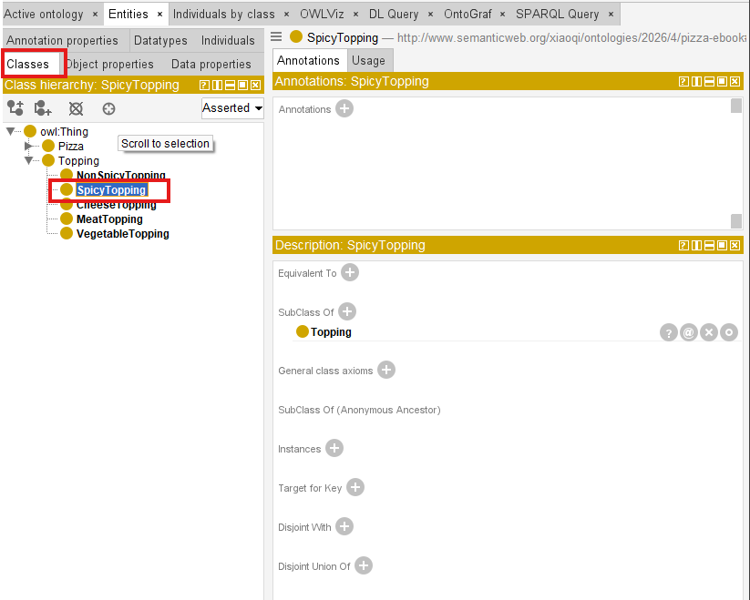
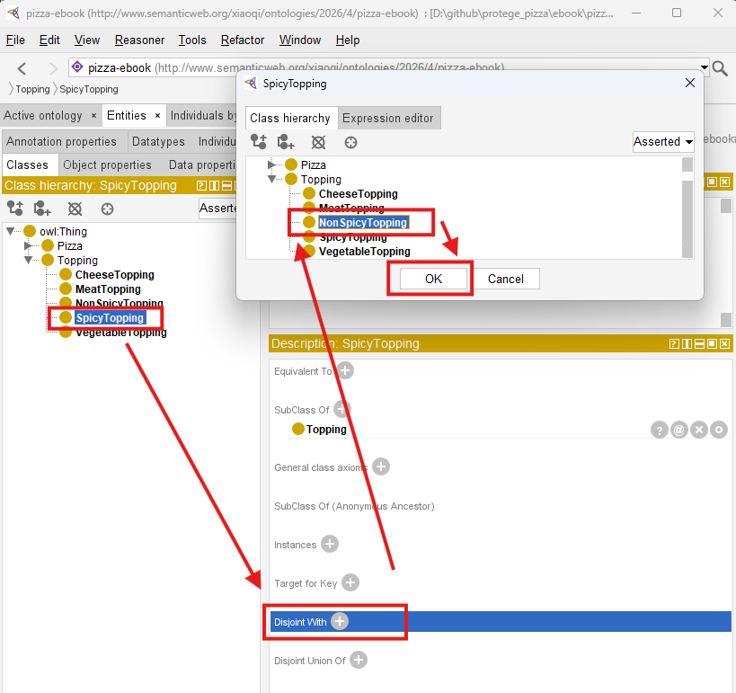
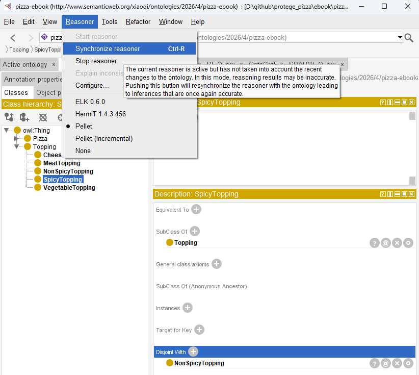
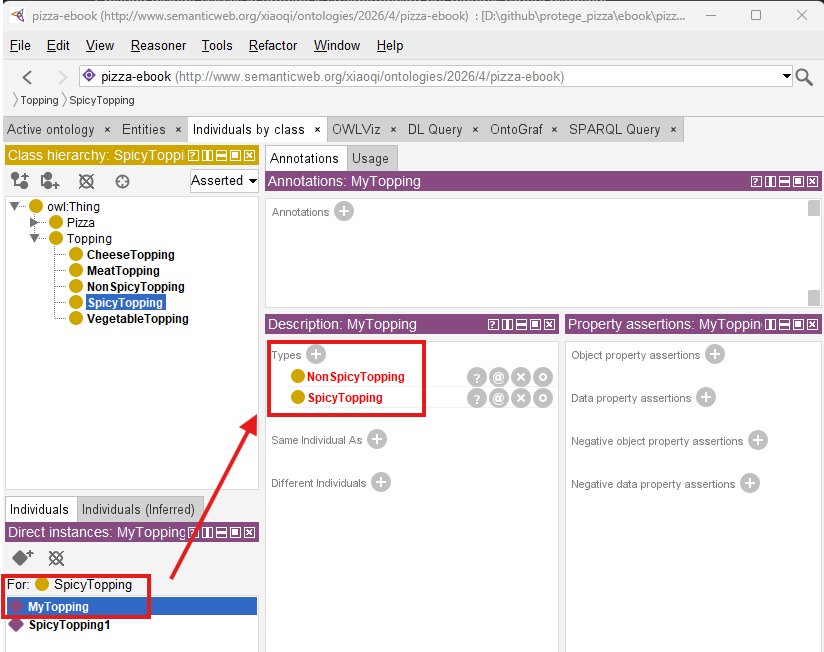
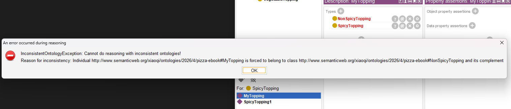

# Chapter 07 - Ensuring Semantic Integrity with Disjoint Classes

After learning to structure your Pizza ontology and applying a reasoner in Chapter 06, your ontology now possesses a **dynamic semantic hierarchy** and the ability to detect inconsistencies. Howerver, even with reasoning in place, logical errors can persist if classes that should not overlap are not explicitly constrained. This is where **Disjoint Classes** come into play. By defining disjoint classes, you as ontology engineers can enforce **semantic exclusivity**, preventing logically incompatible classifications and ensuring the integrity of inferred knowledge.

Disjoint classes are critical in enterprise ontologies because they formalize domain rules that may otherwise rely solely on reasoning inference. In our Pizza ontology, for example, `VegetarianPizza` and `NonVegetarianPizza` are mutually exclusive. Without declaring them disjoint, a reasoner might not flag subtle modeling errors, potentially allowing a pizza to be categorized as both. Disjointness introduces **explicit semantic constraints**, which enhance automated reasoning and maintain **knowledge graph accuracy** in the EKA framework.

- [7.1 Understadning Disjoint Classes](#71-understadning-disjoint-classes)
- [7.2 Defining Disjoint Classes in Protégé](#72-defining-disjoint-classes-in-protégé)
- [7.3 Linking Disjoint Classes to the EKA Framework](#73-linking-disjoint-classes-to-the-eka-framework)
- [7.4 Practical Implications and Examples](#74-practical-implications-and-examples)
- [7.5 Running the Reasoner with Disjoint Classes](#75-running-the-reasoner-with-disjoint-classes)
- [7.6 Practical Exercise: Implementing Disjoint Classes](#76-practical-exercise-implementing-disjoint-classes)
- [7.7 Best Practices for Disjoint Classes](#77-best-practices-for-disjoint-classes)
- [Chapter (07) Summary](#chapter-07-summary)

## 7.1 Understadning Disjoint Classes

A **disjoint class** is an OWL concept indicating that two or more classes cannot share instances. If an individual is asserted to belong to one class, it **CANNOT belong to any of the disjoint classes**.

Disjoint declarations help:

- Prevent **logical contradictions** in the ontology
- Aid reasoners in **consistency checking**
- Ensure that **inferred relationships** are semantically sound

In the Pizza ontology, some of the key disjoint relationships include:

- `VegetarianPizza` and `NonVegetarianPizza`
- `CheeseTopping` and `MeatTopping`
- `SpicyTopping` and `NonSpicyTopping`

> Note: for Class names, we use standard Camel convention.

By defining these disjoint relationships, we provide the reasoner with **rules that cannot be violated**, which helps maintain the ontology's **semantic correctness** as it grows in complexity.

## 7.2 Defining Disjoint Classes in Protégé

Creating disjoint classes in Protégé is straightforward but requires careful planning:

1. Navigate to the **Classes tab** and select the class you wish to make disjoint with others.
   
2. Open the **Disjoint With** section and select the classes that should be matually exclusive.
   
3. Save changes and run the reasoner to check for confliect
   

From above screens sample, when declaring `NonSpicyTopping` disjoint with `SpicyTopping`, the reasoner immediately flags any pizza mistakenly classified under both classes. This ensures that **all individuals are consistently assigned**, reducing errors in semantic inference and knowledge graph construction.

As below, simply create one topping instance called `MyTopping` and add it Types to both `SpicyTopping` and `NonSpicyTopping`, you may see the two types are highlighted in red after synchronizing the reasoner.



The error popup is as below:



Error message is:

```
InconsistentOntologyException: Cannot do reasoning with inconsistent ontologies!
Reason for inconsistency: Individual http://www.semanticweb.org/xiaoqi/ontologies/2026/4/pizza-ebbok#Mytopping is forced to belong to class http://www.semanticweb.org/xiaoqi/ontologies/2026/4/pizza-ebook#NonSpiceTopping and its complement
```

To make the ontology working, you can simply remove `MyTopping` from either `SpiceTopping` or `NonSpicyToppying`, re-synchronize reasoner, the type left will be turned from red to black. -- conflict is fixed and your ontology is back to consistency.

In practice, disjoint classes often reflect **real-world domain constraints**. In enterprise ontology modeling, failing ot define such relationships can result in **incorrect inferences** that propagate throughout downstream knowledge graphs, potentially affecting AI-drien decision-making.

## 7.3 Linking Disjoint Classes to the EKA Framework

Within EKA, disjoint classes enforce **semantic rigor** between the ontology and the resulting knowledge graph.

The impact is multi-layered:

- **Ontology Layer**: Disjoint declarations define hard rules between semantic nodes (classes).
- **Knowledge Graph Layer**: Edges representing relationships between individuals cannot violate these constraints.
- **Executable Intelligence Layer**: AI and reasoning engines operate on a consistent, validated knowledge structure, ensuring trustworthy insights.

In other words, disjoint classes prevent ambiguity, preserve data integrity, and allow **enterprise knowledge models to scale** without introducing conflicts -- essential in professional, large-scale EKA deployments.

## 7.4 Practical Implications and Examples

Consider the following scenarios in the Pizza ontology:

- If `VegetarianPizza` and `NonVegetarianPizza` were not declared disjoint, a pizza containing both vegetables and meat might erroneously be inferred to belong to both classes.
- By making them disjoint, the reasoner flags this as inconsistent, prompting corrective action.
- Similarly, disjointing `CheeseTopping` and `MeatTopping` ensures that inferred dietary classifications remain accurate, which is critical for applications like menu recommendation engines or AI dietary planning tools.

Explicitly modeling disjointness **reduces semantic ambiguity** and strengthens reasoning outputs. In enterprise contexts, this discipline ensures that the **knowledge graph reflects true business rules** rather than merely inferred relationships.

## 7.5 Running the Reasoner with Disjoint Classes

Once disjoint classes are defined, the next step is to **re-run the reasoner** in Protégé:

1. Activate your prefered reasoner (e.g., Pallet or HermiT).
2. Observe any newly detected inconsistencies flagged due to disjoint constraints.
3. Examine the **inferred class hierarchy** to see if any individuals or subclasses conflict with the disjoint rules.
4. Correct any errors to ensure consistency across the ontology.

By combining named classes, reasoning, and disjoint declarations, the ontology achieves a **robust semantic framework** capable of supporting complex knowledge representation, ready for eventual integration into knowledge graphs and AI applications.

## 7.6 Practical Exercise: Implementing Disjoint Classes

1. Open the Pizza ontology with reasoned hierarchy from Chapter 06.
2. Identify pairs of classes that should never share instances (e.g., `VegetarianPizza` vs. `NonVegetarianPizza`).
3. Use the **Disjoint With** feature in Protégé to enforce mutual exclusively.
4. Run the reasoner and confirms that conflicts are flagged appropriately.
5. Document how these constraints improve consistency and reliability.

This exercise reinforces the importance of **explicit semantic constraints** in ontology design, bridging the gap between structured knowledge and executable intelligence in EKA.

## 7.7 Best Practices for Disjoint Classes

- **Plan Before Declaring**: Ensure that disjoint classes reflect true domain logic to avoid unnecessary conflicts.
- **Use Sparingly but Strategically**: Excessive disjoint declarations may complicate reasoning, so focus on critical semantic exclusively.
  - > This especially valid when you create classes hierarchy bulk from `Tool` menu, simply check the `disjoint` will create lots of disjoint by default!
- **Maintain Hierarchical Integrity**: Disjoint declarations should not contradict subclass relationships.
- **Integrate with EKA Principles: Always consider how disjoint classes affect the downstream knowledge graph and reasoning outcomes.

By following these principles, ontologies remain **clean, scalable, and ready for advanced AI integration**.

## Chapter (07) Summary

In Chapter 07, you have:

