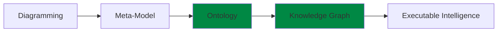
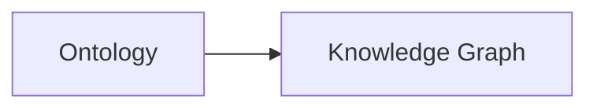
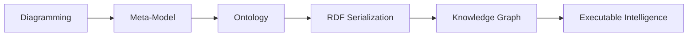

#  Chapter 08 - Understanding the RDF File Structure: Looking Beneath Protégé into the Language of Semantic Knowledge

- [Chapter Introduction](#chapter-introduction)
- [8.1 Protégé Is the Editor, RDF Is the Ontology](#81-protégé-is-the-editor-rdf-is-the-ontology)
- [8.2 Understanding RDF from a Language Specification Perspective](#82-understanding-rdf-from-a-language-specification-perspective)
- [8.3 Understanding RDF Core Concepts Through `Pizza.owl`](#83-understanding-rdf-core-concepts-through-pizzaowl)
- [8.4 Reading RDF/XML Inside `Pizza.owl`](#84-reading-rdfxml-inside-pizzaowl)
- [8.5 Why RDF Is Already Graph-Shaped](#85-why-rdf-is-already-graph-shaped)
- [8.6 From Ontology to Knowledge Graph: Why RDF Natually Evolves into Graph Databases](#86-from-ontology-to-knowledge-graph-why-rdf-natually-evolves-into-graph-databases)
- [8.7 Understanding the Relationship Between Ontology and Graph Database](#87-understanding-the-relationship-between-ontology-and-graph-database)
- [8.8 The Practical EKA Pipeline: From `Pizza.owl` to Knowledge Graph](#88-the-practical-eka-pipeline-from-pizzaowl-to-knowledge-graph)
- [8.9 Practical Neo4j Integration: Bringing RDF into a Knowledge Graph](#89-practical-neo4j-integration-bringing-rdf-into-a-knowledge-graph)
- [8.10 EKA Perspective -- RDF as the Missing Bridge](#810-eka-perspective----rdf-as-the-missing-bridge)
- [Chapter (08) Summary](#chapter-08-summary)
- [Next Chapter (09) Preview](#next-chapter-09-preview)
- [Reference Demo Video](#reference-demo-video)

## Chapter Introduction

Before we begin this chapter, it is important to clarify something to you.

This chapter intentionally goes **beyond the original scope of Michael DeBellis' Pizza.owl tutorial**.

The Pizza tutorial primarily focuses on helping you understand ontology engineering through practical, hands-on exercises inside Protégé. Its emphasis is natually centered on learning OWL concepts, building classes, using reasoners, and understanding semantic modeling fundamentals.

However, through years of practical work in enterprise architecture, ontology engineering, meta-modeling, graph databases, and knowledge-driven systems, I have repeatly observed a common challenge amonge learners:

> Many people learn how to **use the tool**, but far fewer truly understand **what the tool is generating underneath**.

This distinction matters!

Previously, while teaching enterprise architecture and meta-modeling, I introduced a similar perspective thorugh analysis of **ArchiMate modele structure and exchange formats**. Many enterprise architects become proficient at drawing ArchiMate diagrams but never examine the underlying model exchange specification that makes architecture portable, interoperable, and executable across repositories and tools.

Eventually, I realize ontology learning suffers from a similar challenge.

Protégé is simply the editor. (--> mapping to Archi, the ArchiMate Modeling Tool)

The ontology is the language. (--> mapping to ArchiMate, the language)

For this reason, Chapter 08 intentionally introduces a more theoretical perspective. Instead of treating ontology merely as a modeling exercise, we will examine ontology from the viewpoint of **RDF language specification**, semantic representation, and practical implementation into **Knowledge Graphs**.

This perspective becomes especially important if your long-term ambition extends beyond Pizza.owl toward:

- Enterprise semantic modeling
- Knowledge graph engineering
- AI-ready knowledge systems
- Executable Knowledge Architecture (EKA)

Because eventually ontology engineers must answer a deeper question:

> What exactly is an ontology made of?

The answer begins with:

**RDF -- Resource Description Framework**.

This chapter therefore marks an important transition in the EKA roadmap:



Up until now, we have focused primarily on the **Ontology phase**.

Beginning here, we start preparing for the next transformation:



And RDF is the bridge that makes this transition possible.

---

## 8.1 Protégé Is the Editor, RDF Is the Ontology

One of the most important conceptual transition in ontology engineering is recognizing a subtle but fundamental truth:

> When you see in Protégé is not the ontology itself.

Rather, what you see is a **visual abstration of the ontology**.

This idea may initially feel surprising because you spend most of your time interacting with:

- The Classes tab
- The Object Properties tab
- The Individuals tab
- The Reasoner interface

Everything feels highly visual and tool-oriented.

However, underneath Protégé exists something far more important.

A standards-based semantic representation language.

Whenever Protégé saves an ontology, it serializes knowledge into formal semantic structures using standards based on RDF and OWL.

In other words:

> Protégé is simply an **ontology authoring environment**.

The real ontology exists independently of the tool.

This mirrors an important lesson from enterprise architecture.

When architects create ArchiMate diagrams, the diagram itself is not the architecture model. The real model becomes portable through a formal exchange structure.

Likewise:

Protégé diagrams are not the ontology.

The RDF/OWL representation is.

This serialization fundamentally changes how ontology engineers think.

You stop thinking:

> "I built something in Protégé."

And being thinking:

> "I authored a semantic knowledge specification."

That is a major maturity leap.

## 8.2 Understanding RDF from a Language Specification Perspective

Many beginners explanations describe RDF as:

> "A graph data format."

While technically correct, this explanation is incomplete.

To understand RDF professionally, we should instead view it as:

> **A formal language specification for representing semantica assertions.**

RDF was standardized to solve an important problem:

> How can machines understand meaning and relationships?

Traditional systems primarily store data.

RDF stores **meaning**.

This distinction is profound.

Relational databases organize information through:

- Tables
- Columns
- Primary keys
- Foreign key relationships

But RDF organizes knowledge differently.

Instead of tables, RDF models everything as **statements**.

Every semantic statement follows the same structure - triple:

> Subject --> Predicat --> Object

For example:

> VegetarianPizza --> subClassOf --> Pizza

In semantic terms:

- Subject = VegetarianPizza
- Predicate = subClassOf
- Object = Pizza

Similarly:

> CheesePizza --> hasTopping --> CheeseTopping
> VegetarianPizza --> hasTopping --> VegetableTopping

These are not simply data records.

They are **formal semantic assertions**.

This distinction becomes extremely important for reasoning.

Reasoners do not interpret diagrams.

Reasoners interpret semantic statements.

And RDF is the language they understand.

## 8.3 Understanding RDF Core Concepts Through `Pizza.owl`

To understand RDF deeply, you should begin thinking like language designers.

**Resource**

Everything meaningful in RDF is modeled as a **resource**.

Examples from `Pizza.owl` include:

- Pizza
- VegetarianPizza
- CheeseTopping
- TomatoTopping

Each concept receives a globally identifiable reference.

This solves ambiguity and enables semantic interoperability.

For enterprise systems, this becomes extremely important because concepts can be reused across repositories, APIs, metadata platforms, and knowledge graphs.

**Property**

Relationships themselves are also explicitly defined.

Examples include:

- subClassOf
- disjointWith
- hasTopping

Unlike traditional systems where relationships may feel secondary, RDF treats relationships as **first-class semantic meaning**.

With my sayings in certain EA tooling practices:

- Traditional EA Tool: digramming first, relationships follows
- RDF: relationships first, visualization (diagrams) follows

**Triple**

The triple becomes RDF's atomic unit of knowledge.

Everything eventually becomes:

> Subject --> Predicate --> Object

Like sentences in human language.

This elegant simplicity explains why RDF scales effectively for knowledge systems.

Complex ontologies are ultimately collections of semantic statements.

## 8.4 Reading RDF/XML Inside `Pizza.owl`

At first glance, RDF/XML syntax may appear intimidating.

You may encounter elements such as:

- rdf:RDF
- owl:Class
- rdf:about
- rdfs:subClassOf

Initially, many learners assume they must understand XML deeply.

In reality, ontology engineers should instead learn to read RDF/XML as **semantic meaning**.

For example:

```XML
<owl:Class rdf:about="#VegetarianPizza">
    <rdfs:subClassOf rdf:resource="#Pizza"/>
</owl.Class>
```

Rather than viewing this as technical systax, translate it semantically:

> VegetarianPizza is a subclass of Pizza.

Similarly:

```XML
<owl:disjointWith rdf:resource="#NonVegetarianPizza"/>
```

means:

> VegetarianPizza cannot be NonVegetarianPizza.

This perspective is transformative.

You stop reading RDF/XML as code.

You begin reading RDF/XML as **machine-readable meaning**.

That is precisely how semantic technologies should be understood.

## 8.5 Why RDF Is Already Graph-Shaped

One of the most important realization in ontology engineering is this:

**RDF is already a graph.**

Every RDF triple naturally forms:

**Node --> Relationship --> Node**

Example:

VegetarianPizz ↓ subClassOf Pizza

From ontology perspective:

> VegetarianPizza is a subclass of Pizza.

From graph perspective:

> VegetarianPizza node connected to Pizza node through SUBCLASS_OF relationship.

The transformation is almost direct.

This insight becomes strategically important.

When ontology engineers understand RDF deeply, they begin realizing:

> We are already modeling graph structures.

Protégé may appear to be an ontology editor.

But underneath, you are constructing graph-ready semantic structures.

This realization often represents a major maturity leap for practitioners, especially enterprise architects transitioning toward **knowledge engineering**.

## 8.6 From Ontology to Knowledge Graph: Why RDF Natually Evolves into Graph Databases

At this point, you may naturally ask:

> If ontology already represents semantic knowledge, why do we still need a graph database?

Gool catch! This question deserves a deeper answer.

Ontology and graph databases are related, but they solve different problems.

| | Ontology | Graph Databases |
| --- | --- | --- |
| Focus on | **Semantic meaning and formal logic** | **Operational querying, scalable relationship traversal, and executable intelligence** |
| Answer questions such as | <li>What does a concept mean?</li><li>What rules govern relationships?</li><li>What constraints must remain true?</li> | <li>How are concepts connected?</li><li>What paths exist between entities?</li><li>What hidden patterns emerge?</li><li>What knowledge can be operationalized? |
| Provides | **Semantic truth** | **Operational execution** |

This distinction is fundamental in EKA.

Many organizations successfully document enterprise knowledge.

Far fewer operationalize it.

The problem is often not lack of modeling.

The problem is lack of execution.

This is exactly why the EKA roadmap exists.

Each layer increases knowledge maturity.

## 8.7 Understanding the Relationship Between Ontology and Graph Database

One of the biggest misconceptions in knowledge engineering is assuming ontology and graph databases compete with one another.

In fact, they do not!

They complement one another.

A useful way to understand this relationship is:

<h3>Ontolgoy  = Semantic Brain</h3>

<h3>Graph Database = Execution Engine</h3>

Ontology defines meaning.

For example:

- What qualfies as `VegetarianPizza`?
- What topologies are allowed?
- What concepts are disjoint?

Ontology answers:

> What should be true?

Meanwhile, graph databases operrationalize these semantics.

For example:

- Which pizzas contain mozzarella?
- Which pizzas violate vegetarian rules?
- What toppings commonly co-occur?

Graph databases answer:

> What is happening?

This mirrors enterprise architecture practice.

Meta-models define meaning.

Repositories operationalize knowledge.

This is precisely why ontology and graph databases work naturally together.

## 8.8 The Practical EKA Pipeline: From `Pizza.owl` to Knowledge Graph

Inside EKA, ontology is not the final destination.

It is an intermediate maturity stage.

The real goal is:

> **Executable Intelligence**

A practical implementation path may look like this.

<h3>Step 1 -- Conceptual Modeling</h3>

Architects begin with diagrams and conceptual structures.

Knowledge remains visual.

<h3>Step 2 -- Meta-Modeling</h3>

Relationships become formalized.

Meaning becomes structured.

<h3>Step 3 -- Ontology Engineering in Protégé</h3>

Concepts become formal semantic definitions.

Now we define:

- Classes
- Restrictions
- Reasoning logic
- Disjointness
- Semantic inheritance

<h3>Step 4 -- RDF Serialization</h3>

Protégé exports semantic knowledge as:

- RDF/XML
- OWL
- Turtle (.ttl)

At this stage, the ontology becomes portable.

This is where many organizations stop.

However, semantic knowledge still remains underutilized.

<h3>Step 5 -- Knowledge Graph Implementation</h3>

RDF now becomes operational.

Semantic structures can be imported into graph databases such as Neo4j.

Classes become nodes.

Properties become relationships.

Semantic triples become traversable graph structures.

The ontology becomes queryable.

<h3>Step 6 -- Executable Intelligence</h3>

Once implemented as a graph, organizations can begin asking intelligent questions.

For example:

- What business capabilities depend on a deprecated application?
- What systems are impacted by a regulation change?
- What architecture elements violate governance rules?
- What semantic dependencies exist across enterprise domains?

Suddenly:

Knowledge becomes executable.

This is the vision of EKA.

## 8.9 Practical Neo4j Integration: Bringing RDF into a Knowledge Graph

A natural next question becomes:

> Can `Pizza.owl` be imported into Neo4j?

The answer is:

**Yes.**

And this represents the next maturity phase of EKA.

A practical implementation often follows this approach:

<h3>Export from Protégé</h3>

Save ontology as RDF/XML, OWL, or Turtle.

<h3>Transform RDF Into Graph Structure</h3>

Using semantic plugins and import pipelines, RDF tripes are converted into graph structures.

<h3>Build Semantic Graph</h3>

Example include:

- Classes --> Nodes
- Properties --> Relationships
- Restrictions --> Semantic Rules

For example:

```
VegetarianPizza --> SUBCLASS_OF --> Pizza
Pizza --> HAS_TOPPING --> CheeseTopping
```

The ontology becomes operational rather than merely descriptive.

<h3>Query Enterprise Knowledge</h3>

Organizations can now perform:

- Dependency analysis
- Impact analysis
- Recommendation systems
- Semantic governance validation
- AI-assisted architecture intelligence

Ontology becomes actionable.

This is where ontology engineering becomes truly valuable in enterprise environments.

## 8.10 EKA Perspective -- RDF as the Missing Bridge

Many organizations already have:

<h3>Diagrams</h3>

but lack semantics.

Others have:

<h3>Meta-models</h3>

but lack execution.

Some have:

<h3>Ontologies</h3>

but still lack operational intelligence.

The missing bridge is often:

> **Knowledge Graph realization**

And RDF is the enabling layer.

RDF transforms ontology from:

> Semantic specification

into:

> Executable graph knowledge

The complete EKA maturity path becomes visible:



This is perhaps the most important message of Chapter 08.

Because at this stage, you are no longer merely learning `Pizza.owl`.

They are learning how to engineer knowledge itself.

## Chapter (08) Summary

In this chapter, we intentionally moved beyond the standard `Pizza.owl` tutorial to examine ontology from a language specification perspective.

You explored:

- Why Protégé is only the editor while RDF is the true ontology artifact
- How RDF represents semantic meaning through triples
- How RDF/XML stores classes, relationships, and semantic logic
- Why RDF is inherently graph-shaped
- How ontology natually evolves into graph databases
- How Neo4j can operationalize ontology as a Knowledge Graph
- Why RDF serves as the bridge between Ontology and Knowledge Graph in EKA

For the first time in this book, ontology becomes more than modeling.

It becomes:

> **Portable, Executable, and Operational Knowledge.**

## Next Chapter (09) Preview

In the next chapter (09), we continue exploring ontology implementation in Protégé by deepening our understanding of OWL structures and semantic modeling practices. Building upon the RDF foundation introduced here, you will continue progressing toward more advanced ontology engineering capabilities.

## Reference Demo Video

Demo Video Reference in YouTube: Chapter 08 - (https://youtu.be/qjer-vEKMNg)

---

Last updated at 5/23/2026