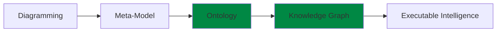
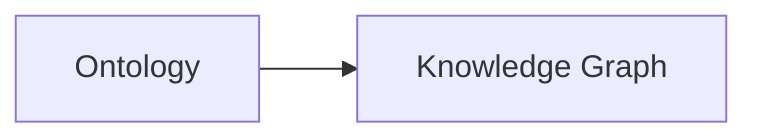

#  Chapter 08 - Understanding the RDF File Structure: Looking Beneath Protégé into the Language of Semantic Knowledge

- [Chapter Introduction](#chapter-introduction)
- [8.1 Protégé Is the Editor, RDF Is the Ontology](#81-protégé-is-the-editor-rdf-is-the-ontology)

## Chapter Introduction

Before we begin this chapter, it is important to clarify something to you.

This chapter intentionally goes **beyond the original scope of Michael DeBellis' Pizza.owl tutorial**.

The Pizza tutorial primarily focuses on helping you understand ontology engineering through practical, hands-on exercises inside Protégé. Its emphasis is natually centered on learning OWL concepts, building classes, using reasoners, and understanding semantic modeling fundamentals.

However, through years of practical work in enterprise architecture, ontology engineering, meta-modeling, graph databases, and knowledge-driven systems, I have repeatly observed a common challenge amonge learners:

> Many people learn how to **use the tool**, but far fewer truly understand **what the tool is generating underneath**.

This distinction matters!

Previously, while teaching enterprise architecture and meta-modeling, I introduced a similar perspective thorugh analysis of **ArchiMate modele structure and exchange formats**. Many enterprise architects become proficient at drawing ArchiMate diagrams but never examine the underlying model exchange specification that makes architecture portable, interoperable, and executable across repositories and tools.

Eventually, I realize ontology learning suffers from a similar challenge.

Protégé is simply the editor. (--> mapping to Archi, the ArchiMate Modeling Tool)

The ontology is the language. (--> mapping to ArchiMate, the language)

For this reason, Chapter 08 intentionally introduces a more theoretical perspective. Instead of treating ontology merely as a modeling exercise, we will examine ontology from the viewpoint of **RDF language specification**, semantic representation, and practical implementation into **Knowledge Graphs**.

This perspective becomes especially important if your long-term ambition extends beyond Pizza.owl toward:

- Enterprise semantic modeling
- Knowledge graph engineering
- AI-ready knowledge systems
- Executable Knowledge Architecture (EKA)

Because eventually ontology engineers must answer a deeper question:

> What exactly is an ontology made of?

The answer begins with:

**RDF -- Resource Description Framework**.

This chapter therefore marks an important transition in the EKA roadmap:

Up until now, we have focused primarily on the **Ontology phase**.

Beginning here, we start preparing for the next transformation:

And RDF is the bridge that makes this transition possible.

---

## 8.1 Protégé Is the Editor, RDF Is the Ontology

One of the most important conceptual transition in ontology engineering is recognizing a subtle but fundamental truth:

> When you see in Protégé is not the ontology itself.

Rather, what you see is a **visual abstration of the ontology**.

This idea may initially feel surprising because you spend most of your time interacting with:

- The Classes tab
- The Object Properties tab
- The Individuals tab
- The Reasoner interface

Everything feels highly visual and tool-oriented.

However, underneath Protégé exists something far more important.

A standards-based semantic representation language.

Whenever Protégé saves an ontology, it serializes knowledge into formal semantic structures using standards based on RDF and OWL.

In other words:

> Protégé is simply an **ontology authoring environment**.

The real ontology exists independently of the tool.

This mirrors an important lesson from enterprise architecture.

When architects create ArchiMate diagrams, the diagram itself is not the architecture model. The real model becomes portable through a formal exchange structure.

Likewise:

Protégé diagrams are not the ontology.

The RDF/OWL representation is.

This serialization fundamentally changes how ontology engineers think.

You stop thinking:

> "I built something in Protégé."

And being thinking:

> "I authored a semantic knowledge specification."

That is a major maturity leap.

---

Last updated at 5/22/2026