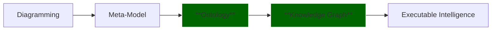
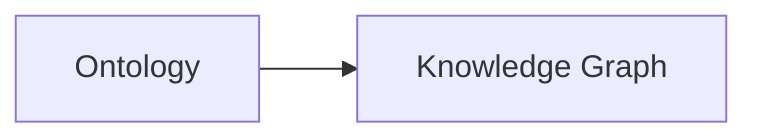

#  Chapter 08 - Understanding the RDF File Structure: Looking Beneath Protégé into the Language of Semantic Knowledge

- [Chapter Introduction](#chapter-introduction)
- [8.1](#81)

## Chapter Introduction

Before we begin this chapter, it is important to clarify something to you.

This chapter intentionally goes **beyond the original scope of Michael DeBellis' Pizza.owl tutorial**.

The Pizza tutorial primarily focuses on helping you understand ontology engineering through practical, hands-on exercises inside Protégé. Its emphasis is natually centered on learning OWL concepts, building classes, using reasoners, and understanding semantic modeling fundamentals.

However, through years of practical work in enterprise architecture, ontology engineering, meta-modeling, graph databases, and knowledge-driven systems, I have repeatly observed a common challenge amonge learners:

> Many people learn how to **use the tool**, but far fewer truly understand **what the tool is generating underneath**.

This distinction matters!

Previously, while teaching enterprise architecture and meta-modeling, I introduced a similar perspective thorugh analysis of **ArchiMate modele structure and exchange formats**. Many enterprise architects become proficient at drawing ArchiMate diagrams but never examine the underlying model exchange specification that makes architecture portable, interoperable, and executable across repositories and tools.

Eventually, I realize ontology learning suffers from a similar challenge.

Protégé is simply the editor. (--> mapping to Archi, the ArchiMate Modeling Tool)

The ontology is the language. (--> mapping to ArchiMate, the language)

For this reason, Chapter 08 intentionally introduces a more theoretical perspective. Instead of treating ontology merely as a modeling exercise, we will examine ontology from the viewpoint of **RDF language specification**, semantic representation, and practical implementation into **Knowledge Graphs**.

This perspective becomes especially important if your long-term ambition extends beyond Pizza.owl toward:

- Enterprise semantic modeling
- Knowledge graph engineering
- AI-ready knowledge systems
- Executable Knowledge Architecture (EKA)

Because eventually ontology engineers must answer a deeper question:

> What exactly is an ontology made of?

The answer begins with:

**RDF -- Resource Description Framework**.

This chapter therefore marks an important transition in the EKA roadmap:

Up until now, we have focused primarily on the **Ontology phase**.

Beginning here, we start preparing for the next transformation:

And RDF is the bridge that makes this transition possible.

---

## 8.1