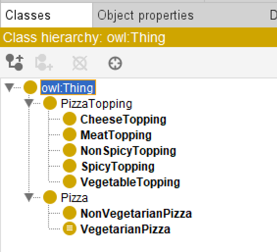
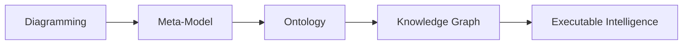
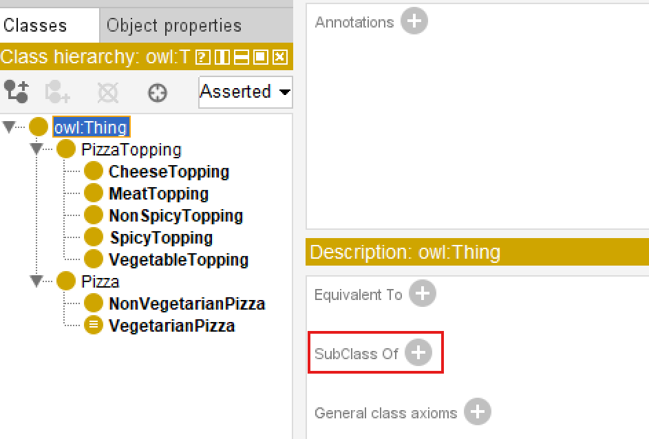
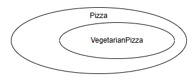
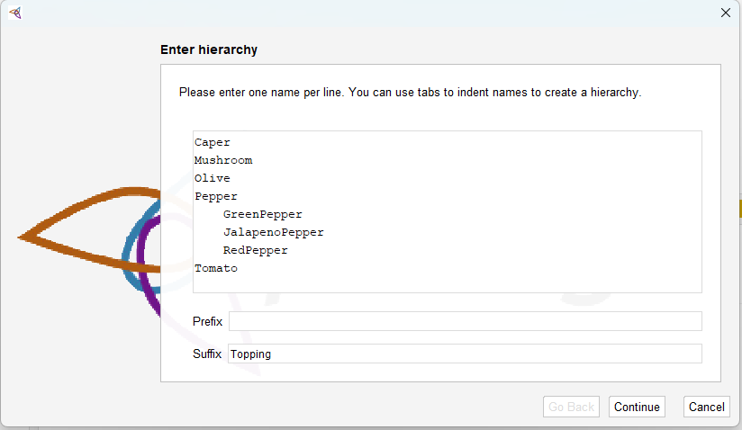
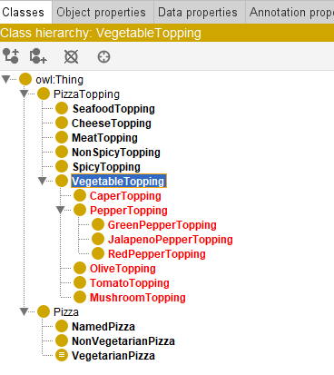

# Chapter 09 - Building Semantic Foundations Through Class Hierarchy

- [Chapter Introduction](#chapter-introduction)
- [9.1 Why Class Hierarchy Matters in Ontology Engineering](#91-why-class-hierarchy-matters-in-ontology-engineering)
- [9.2 Understanding Parent Classes and SubClasses](#92-understanding-parent-classes-and-subclasses)
- [9.3 Creating Class Hierarchy in Protégé](#93-creating-class-hierarchy-in-protégé)
- [9.4 Best Practices for Designing Semantic Hierarchy](#94-best-practices-for-designing-semantic-hierarchy)
- [9.5 Hierarchy and Reasoning: Why Structure Matters](#95-hierarchy-and-reasoning-why-structure-matters)
- [9.6 EKA Perspective -- Class Hierarchy as the Semantic Foundation of Knowledge Architecture](#96-eka-perspective----class-hierarchy-as-the-semantic-foundation-of-knowledge-architecture)
- [9.7 Practical Exercise -- Building `Pizza.owl` hierarchy](#97-practical-exercise----building-pizzaowl-hierarchy)
- [9.8 Common Mistakes in Class Hierarchy Design](#98-common-mistakes-in-class-hierarchy-design)
- [Chapter (09) Summary](#chapter-09-summary)
- [Key Concepts](#key-concepts)
- [Protégé Skills Learned](#protégé-skills-learned)
- [Next Chapter (10) Preview](#next-chapter-10-preview)
- [Reference Demo Video](#reference-demo-video)

## Chapter Introduction

After stepping beneath Protégé's interface in [Chapter 08](ch08.md) to understand RDF as the underlying language of semantic representation, we now return to practical ontology engineering with renewed perspective. In earlier chapters, you gradually developed familiarity with Protégé, named classes, reasoning, and semantic integrity. However, one of the most important activities in ontology engineering still deserves deeper attention:

**building a meaningful class hierarchy.**

At first glance, creating class hierarchies may appear deceptively simple. In Protégé, it often feels like little more than creating folders or parent-child structure. Yet this is interpretation dramatically under-estimates their importance.

In ontology engineering, a class hierarchy is not merely an organizational convenience. It represents the **conceptual backbone of semantic meaning**.

Hierarchy determines:

- How concepts inherit meaning
- How reasoners infer (new) knowledge
- How semantic consistency is maintained
- How knowledge graphs later organize relationships
- How enterprise concepts become machine-understandable

Within the Pizza ontology, hierarchy enables us to distinguish broad concepts such as `Pizza` and `PizzaTopping`, while progressively refining specialization into categorizes such as `CheeseTopping`, `VegetableTopping`, and `MeatTopping`.

The actual hierarchy in our ebook Pizza ontology so far shows like below:

This chapter aligns closely with the demonstration video and focuses on **creating and refining class hierarchy in Protégé**. Compared with Chapter 08's theoretical detour into RDF specification, Chapter 09 intentionally returns to a practical modeling focus while integrating a broader EKA perspective.

From the viewpoint of **Executable Knowledge Architecture (EKA)**, hierarchy design plays a foundational role in transforming conceptual models into executable knowledge.

Recall the EKA roadmap:

Hierarchy is where ontology begins transforming structure into semantic meaning.

Without meaningful hierarchy: **knowledge becomes flat**.

Without hierarchy: **reasoning becomes weak**.

Without hierarchy: **knowledge graph lose semantic depth**.

This chapter therefore focuses not merely on creating classes, but on understanding **why hierarchy matters**.

## 9.1 Why Class Hierarchy Matters in Ontology Engineering

One of the first questions ontology learners often ask is:

> Why can't we simply create all classes independently?

Technically, we could.

But doing so would eliminate one of ontology's greatest strengths:

**semantic inheritance**.

Class hierarchy allows concepts to inherit characteristics from broader parent classes.

For example:

A `CheeseTopping` is also a `PizzaTopping`.

A `MozzarellaTopping` is also a `CheeseTopping`.

This means:

`MozzarellaTopping` inherits semantics meaning from both:

- `CheeseTopping`
- `PizzaTopping`

This layered structure enables machines to understand categories naturally.

Without explicitly stating every rule repeatedly, hierarchy allows knowledge to scale efficiently.

Imagine an enterprise environment.

If every application, business, capability, value stream, process, regulation, and data object existed independently without hierarchy, enterprise knowledge would become chaotic.

Instead, semantic organization enables:

- Consistency
- Reuse
- Governance
- Reasoning
- Impact analysis

This explains why **hierarchy** becomes one of the most important modeling disciplines in ontology engineering.

Hierarchy is not decoration.

Hierarchy is semantic architecture.

## 9.2 Understanding Parent Classes and SubClasses

Ontology hierarchy operates through the relationship known as

> subClassOf

A subclass inherits characteristics from its parent class.

For example:

`VegetarianPizza` is a subclass of `Pizza`.

This means:

- Every `VegentarianPizza` is also a `Pizza`.
- But not every `Pizza` is necessarily `VegetarianPizza`.

Visualizing with diagram often used in Set Theory, as below:

This directional logic is extremely important.

Hierarchy in ontology is not arbitrary grouping.

It represents **formal logical specification**.

Inside Protégé, this hierarchy becomes visible through nested structures in the Classes tab.

For example:

`Pizza` may contain:

- `NamedPizza`
- `VegetarianPizza`
- `NonVegetarianPizza`

Meanwhile:

`PizzaTopping` may contain:

- `CheeseTopping`
- `MeatTopping`
- `VegetableTopping`
- `SeafoodTopping`

Each level introduces progressively more specific meaning.

The reasoner later dependes heavily on these hierarchical structures.

Poor hirarchy design often leads to weak semantic quality.

Strong hierarchy design strengthens inference capability.

## 9.3 Creating Class Hierarchy in Protégé

In the demonstration video, you focus on building hierarchy practically within Protégé.

The process appears simple:

1. Select a parent class
2. Create subclass
3. Organize concepts under meaningful categories

However, ontology engineers should avoid rushing through hierarchy construction.

Good hierarchy design requires conceptual thinking.

Before creating subclasses, ask:

> Is this truly a specialization?

Or:

> Is this simply related information?

This kind of questions are more important when you are "reaching" the level of subclasses that would need to decide that should be individual instead.

For example:

`MozzarellaTopping` belongs under: `Cheesetopping` because mozzarella is a kind of cheese.

This represents as `is-a relationship`.

Be contrast:

Pizza ingredients themselves are not subclasses of pizza.

They are separate concepts connected later through properties.

This distinction becomes critically important.

Ontology engineers frequently make mistakes by confusing:

- hierarchy relationships
- association relationships

Hierarchy means:

> is-a

Association means:

> connected-to

Understanding this diffeence dramatically improves ontology quality.

## 9.4 Best Practices for Designing Semantic Hierarchy

Professional ontology engineering requires hierarchy discipline.

Several practical guidelines can improve semantic quality.

<h3>Keep Hierarchy Meaningful</h3>

Every subclass should represent genuine specialization.

Ask:

> Is the child concept geneinely a type of the parent?

If not, the hierarchy may be incorrect.

<h3>Avoid Flat Structures</h3>

Too many sibling classes under one parent create semantic chaos.

Instead of `PizzaTopping` containing dozens of direct subclasses, create intermediate categories.

For example:

- CheeseTopping
- MeatTopping
- VegetableTopping
- SeafoodTopping

This improves maintainability.

<h3>Think About Future Reasoning</h3>

Hierarchy impacts inferernce.

If reasoning will later classify pizzas according to toppings, hierarchy becomes strategically important.

Good hierarchy simplifies semantic intelligence.

Poor hierarchy limits automation.

<h3>Design for Reuse</h3>

Ontology is rarely static.

Future concepts should fit naturally into the hierarchy.

For example:

Adding `ParmesanTopping` later should be straightforward.

It naturally belongs under: `CheessTopping`.

This scalability mindset becomes essential in enterprise ontology engineering.

## 9.5 Hierarchy and Reasoning: Why Structure Matters

Chapter 06 introduced reasoners.

At that stage, you observed how reasoners infer semantic relationships.

What now becomes clearer is this:

Reasoners are only as powerful as the hierarchy they operate upon.

Consider the following hierarchy:

`MozzarellaTopping`

↓

`CheeseTopping`

↓

`PizzaTopping`

A reasoner immediately understands:

`MozzarellaTopping` is also `PizzaTopping`.

This inherited understanding enables semantic inference.

Without hierarchy, every concept would require manual specification.

Reasoners would lose much of their intelligence.

This explains why hierarchy design should never be treated casually.

Hierarchy becomes the semantic infrastructure supporting inference.

## 9.6 EKA Perspective -- Class Hierarchy as the Semantic Foundation of Knowledge Architecture

Within the EKA framework, hierarchy design represents a major transition point.

During:

<h3>Diagramming</h3>

Concepts remain visual.

Relationships are often informal.

During:

<h3>Meta-Modeling</h3>

Structural rules emerge.

Concept categories become clearer.

But once we enter:

<h3>Ontology</h3>

Hierarchy introduces semantic precision.

Now concepts gain:

- inheritance
- classification
- formal logic
- machine interpretability

This becomes foundational for:

<h3>Knowledge Graph</h3>

Why?

Because graph structure alone is insufficient.

Graphs without semantics become merely connected data.

While ontology hierarchy provides:

> semantic depth

Knowledge graph implementation later depends heavily on these inherited semantic relationships.

For example:

In Neo4j, a hierarchy may later support:

- dependency tracing
- recommendation logic
- clasification automation
- semantic search
- intelligent navigation

Without meaningful hierarchy: enterprise knowledge remains shallow.

With hierarchy: knowledge becomes executable.

This is exactly why hierarchy matters in EKA.

Ontology is not merely organizing concepts.

It is engineering semantic intelligence.

## 9.7 Practical Exercise -- Building `Pizza.owl` hierarchy

To reinforce understanding, you should recreate the hierarchy demonstrated in the video.

Practical steps include:

1. Open `Pizza.owl` in Protégé
2. Review existing top-level classes
3. Create subclasses under `Pizza` and `PizzaTopping`
4. Organize topping categories logicaaly
5. Review whether each subclass represents a true "`is-a`" relationship
6. Run the reasoner to observe inherited semantic meaning

Using `Tools > Create Class Hierarchy...`, below screen creates subclasses of `VegetableTopping`, note you can use either `Prefix` or `Suffix` to save your time:

After above sample batch creation, below is the class hierarchy then:

During this exercise, avoid treating hierarchy as a simple tree.

Instead, think critically:

> What semantic meaning is being inherited?

This mindset sihft is essential for becoming a professional ontology engineer.

## 9.8 Common Mistakes in Class Hierarchy Design

Beginners frequently make several hierarchy mistakes.

<h3>Mistake 1 -- Confusing Relationship Types</h3>

Treating ingredients as subclasses of pizza.

This violates semantic logic.

Ingredients are associated with pizzas.

They are not types of pizza.

<h3>Mistake 2 -- Overly Flat Structures

Creating dozens of direct subclasses under one concept.

This reduces maintainability.

> Think about how many direct reports recommended in real company organization hierarchy.

<h3>Mistake 3 -- Incorrect Specialization</h3>

Creating subclasses that are not genuine specializations.

Always ask:

> Is this truly a kind of the parent?

<h3>Mistake 4 -- Ignoring Future Scalability

Hierarchy should anticipate future extension.

Exterprise ontologies constantly evolve.

Planning for extensibility improves long-term sustainability.

## Chapter (09) Summary

In this chapter (09), you focused on one of ontology engineering's most important foundations:

**Class hierarchy design.**

You explored:

- Why hierarchy matters in semantic systems
- How subclass relationships create inheritance
- How to create hierarchy in Protégé
- The distinction between hierarchy and association
- Best practices for semantic hierarchy design
- How hierarchy strengthens reasoning
- Why hierarchy matters in the EKA roadmap toward Knowledge Graphs

More importantly, you began seeing hierarchy not as visual organization but as:

> **semantic architecture**.

This perspective becomes increasingly important as ontology complexity grows.

Strong hierarchy leads to strong reasoning.

Strong reasoning enables stronger knowledge graphs.

And stronger knowledge graphs ultimately support:

> **Executable Intelligence**.

## Key Concepts

| Concepts | Description |
| --- | --- |
| Class Hierarchy | A **class hierarchy** is the structured organization of ontology concepts into parent-child relationships, where broader classes are specialized into more specific subclasses to support semantic organization and reasoning. |
| subClassOf Relationship | A **subClassOf Relationship** defines an "`is-a`" relationship between classes, where a subclass inherits meaning from a parent class. For example, `VegetarianPizza` is a subclass of `Pizza`. |
| Semantic Inheritance | **Semantic Inheritance** is the ability of subclasses to inherit characteristics and meaning from parent classes, reducing redundancy and enabling consistent knowledge representation. |
| Parent Class vs Subclass | A **Parent Class** represents a broader concept, while a **SubClass** is a more specific specialization that inherits semantic meaning from it's parent. |
| Ontology Structure | **Ontology Structure** refers to the overall organization of classes, relationships, rules, and hierarchy that together define semantic meaning in an ontology. |
| Hierarchical Reasoning | **Hierarchical Reasoning** is the process where reasoners infer knowledge through class hierarchies, automatically understanding inherited relationships between concepts. |
| EKA Ontology Foundation | The **EKA Ontology Foundation** represents ontology's role in the EKA roadmap, transforming structured concepts into machine-understandable semantic knowledge for Knowledge Graphs and Executable Intelligence. |

## Protégé Skills Learned

- Creating parent and child classes
- Designing semantic hierarchy
- Organizing ontology structures
- Applying hierarchy best practices
- Preparing ontology for object properties and reasoning

## Next Chapter (10) Preview

In the next chapter (10), we introduce one of the most important ontology concepts:

**Object Properties**.

If hierarchy helps us classify concepts, object properties help us connect them.

You will begin defining meaningful semantic relationships such as:

> Pizza hasTopping CheeseTopping

This marks an important transition in ontology engineering.

Until now, ontology has focused primarily on classification.

Beginning in Chapter 10, ontology becomes relational.

Concepts no longer exist in isolation.

They begin interacting through semantic relationships, laying an important foundation for reasoning, RDF triples, and future Knowledge Graph implementation in EKA.

## Reference Demo Video

Demo video reference: Chapter 09 - https://youtu.be/FQdjYQMqfBI

---

Last updated at: 5/24/2026