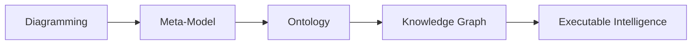

# Chapter 09 -- Building Semantic Foundations Through Class Hierarchy

- [Chapter Introduction](#chapter-introduction)

## Chapter Introduction

After stepping beneath Protégé's interface in [Chapter 08](ch08.md) to understand RDF as the underlying language of semantic representation, we now return to practical ontology engineering with renewed perspective. In earlier chapters, you gradually developed familiarity with Protégé, named classes, reasoning, and semantic integrity. However, one of the most important activities in ontology engineering still deserves deeper attention:

**building a meaningful class hierarchy.**

At first glance, creating class hierarchies may appear deceptively simple. In Protégé, it often feels like little more than creating folders or parent-child structure. Yet this is interpretation dramatically under-estimates their importance.

In ontology engineering, a class hierarchy is not merely an organizational convenience. It represents the **conceptual backbone of semantic meaning**.

Hierarchy determines:

- How concepts inherit meaning
- How reasoners infer (new) knowledge
- How semantic consistency is maintained
- How knowledge graphs later organize relationships
- How enterprise concepts become machine-understandable

Within the Pizza ontology, hierarchy enables us to distinguish broad concepts such as `Pizza` and `PizzaTopping`, while progressively refining specialization into categorizes such as `CheeseTopping`, `VegetableTopping`, and `MeatTopping`.

The actual hierarchy in our ebook Pizza ontology so far shows like below:

This chapter aligns closely with the demonstration video and focuses on **creating and refining class hierarchy in Protégé**. Compared with Chapter 08's theoretical detour into RDF specification, Chapter 09 intentionally returns to a practical modeling focus while integrating a broader EKA perspective.

From the viewpoint of **Executable Knowledge Architecture (EKA)**, hierarchy design plays a foundational role in transforming conceptual models into executable knowledge.

Recall the EKA roadmap:

Hierarchy is where ontology begins transforming structure into semantic meaning.

Without meaningful hierarchy: **knowledge becomes flat**.

Without hierarchy: **reasoning becomes weak**.

Without hierarchy: **knowledge graph lose semantic depth**.

This chapter therefore focuses not merely on creating classes, but on understanding **why hierarchy matters**.

---

Last updated at: 5/23/2026