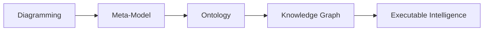
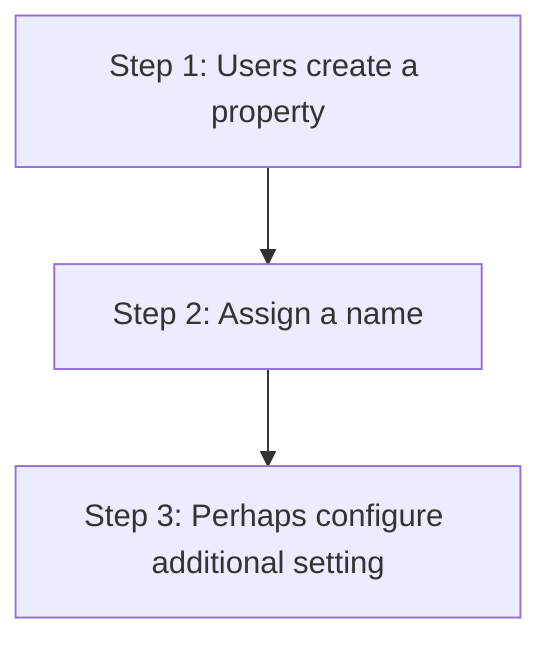

# Chapter 10 -- Connecting Concepts Through Object Properties

- [Chapter Introduction](#chapter-introduction)
- [10.1 Why Class Hierarchy Alone Is Not Enough](#101-why-class-hierarchy-alone-is-not-enough)
- [10.2 What Are Object Properties?](#102-what-are-object-properties)
- [10.3 Creating Object Properties in Protégé](#103-creating-object-properties-in-protégé)
- [10.4 Domain and Range -- Defining Semantic Boundaries](#104-domain-and-range----defining-semantic-boundaries)
- [10.5 Building `Pizza` Relationships Throgh `hasTopping`](#105-building-pizza-relationships-throgh-hastopping)

## Chapter Introduction

In the previous chapter, we explored one of ontology engineering's most foundational activities:

**building class hierarchy**.

Through hierarchy, you began understanding how semantic concepts become organized into meaningful categories. We learned that classes inherit meaning through `subClassOf` relationships, enabling ontology reasoners to understand specification, inheritance, and conceptual structure.

At this stage, ontology already felt more intelligent than traditional modeling.

A `MozzarellaTopping` was no longer simple text.

It belongs to `CheeseTopping`.

`CheeseTopping` belongs to `PizzaTopping`.

Semantic inheritance allowed machines to understand conceptual meaning without requiring repeated manual definitions.

Yet despite this progress, something important was still missing.

Ontology remained structurally organized, but largely disconnected.

The classes existed.

The hierarchy existed.

The categories existed.

But an important question remained un-answered:

> How do these concepts actually interact?

More specifically:

> How does a `pizza` know which `toppings` belong to it?

How can we formally express:

> A `pizza` has `toppings`.

Or:

> A `vegetarian pizza` contains `vegetable toppings`.

Or:

> A `seafood pizza` includes `seafood ingredients`.

Hierarchy alone cannot answer these questions.

Hierarchy tells us:

> what something is.

But ontology also needs to describe:

> how things relate.

This distinction marks one of the more important maturity transition in ontology engineering.

Ontology moves beyond:

> classification

and begins modeling:

> **relationships**.

This is where **Object Properties** enter the picture.

Object properties represent one of the most important concepts in OWL because they transform isolated semantic concepts into an interconnected network of meaning.

Without object properties, ontology resembles a well-organized dictionary - only.

With object properties, ontology becomes:

> a semantic system.

From the perspective of **Executable Knowledge Architecture (EKA)**, this chapter represents a major milestone.

Recall the EKA implementation roadmap:

In earlier stages:
- Diagramming focused primarily on visual representation
- Meta-modeling formalized conceptual structure
- Hierarchy introduced semantic categorization

Now ontology begines introducing something equally important:

> **semantic connectivity**.

And semantic connectivity eventually becomes the foundation of:

> **Knowledge Graph implementation**.

Because knowledge graphs are not merely collections of concepts.

They are:

> connected knowledge.

This chapter therefore focuses not simply on how to create object properties in Protégé, but on understanding why relationships fundamentally change the nature of semantic systems.

Ontology is no longer simply describing categories.

Ontology begins describing:

> **meaningful interaction between concepts**.

## 10.1 Why Class Hierarchy Alone Is Not Enough

By now, you may reasonably ask:

> If hierarchy already organizes concepts, why do we need another mechanism?

The answer lies in understanding the limitation of hierarchy.

Hierarchy is extremely powerful.

But hierarchy answers only one type of semantic question:

> What kind of thing is this?

For example:

`MozzarellaTopping` is a `CheesTopping` which is a `PizzaTopping`.

This structure tells us what mozzarella is.

However, hierarchy cannot answer questions such as:

> Which pizza uses mozzarella?

Or:

> What toppings belong to vegetarian pizza?

Or:

> Which pizzas contain seafood ingredients?

These questions are fundamentally relational.

And this is where ontology begins becoming more sophisticated.

Ontology engineers must now shift their mindset.

Instead of thinking only about:

> classifiction

we begin thinking about:

> connection.

This conceptual transition is extremely important.

Many beginners initially attempts to force reltionships into hierarchy.

For example, someone may incorrectly think:

> `CheeseTopping` should exist underneath `Pizza`.

But this would be semantically incorrect!

Why?

Because `toppings` are not kinds of `pizza`.

Rather:

> `pizzas` and `toppings` are separate concepts that interact through relationships.

This distinction mirrors enterprise modeling.

Consider an enterprise architecture repository.

A business capability is not a subclass of application.

An application is not a subclass of process.

However:

They are connected.

For example:

> Capability enabledBy (or `is realized by` in ArchiMate terminology) Application.

or:

> Application supports (or `serves` in ArchiMate terminology) Process

The same semantic thinking applies inside `Pizza.owl`.

`Pizza` and `toppings` are separte semantic domains.

Ontology must express how they relate.

And that relationship is modeled through:

> **Object Properties**.

This realization often becomes a turning point for learners.

Because for the FIRST time:

Ontology begins feeling alive.

Concepts are no longer isolated definitions.

They begin interacting.

## 10.2 What Are Object Properties?

At its simpliest level, an **Object Property** is a semantic relationship that connects one concept to another.

However, from a professional ontology perspective, object properties are much more than simple connections.

They represent:

> **machine-readable meaning between concepts**.

This distinction matters.

In ordinary diagrams, relationships are often visual.

A line may connect two boxes.

People interpret meaning through human understanding.

But machines cannot reliably interpret diagrams.

Machines require formal semantics.

Object properties provide those semantics.

For example:

When we define (in Protégé):

> Pizza hasTopping CheeseTopping

we are not simply drawing a line.

We are creating a formal semantic statement.

The ontology now understands:

> Pizza can connect to toppines.

This relationship becomes machine-readable.

Reasoner can analyze it.

RDF can serialize it.

Knowledge graphs can query it.

AI systems can eventually consume it.

This is one of the reasones ontology engineering differs fundamentally from traditional modeling approaches.

In UML diagrams, relationships may remain descriptive.

In ontology:

relationships become:

> executable semantic logic.

This shift is profound.

Inside `Pizza.owl`, one of the first important object properties introduced is:

`hasTopping`

Although simple at first glance, this relationship becomes foundational.

Nearly everything in `Pizza.owl` later depends upon it.

Restrictions depend upon it.

Reasoning depends upon it.

Classification depends upon it.

And future semantic inference depends upon it.

Without object properties: ontology remains disconnected.

With object properties: ontology becomes:

> interconnected semantic knowledge!

## 10.3 Creating Object Properties in Protégé

Inside Protégé, object properties are managed through the **Object Properties tab**.

At first glance, this area may appear relatively simple.

However, ontology engineers should resist viewing object properties as technical configuration.

**Object Properties are semantic design decisions.**

Every proiperty expresses meaning.

And meaning must be intentional.

For this reason, naming becomes critically important.

Good ontology naming improves **readability**, **maintainability**, and **semantic clarity**.

For example:

`hasTopping` immediately communicates meaning.

Anyone reading the ontology understands:

> Pizza possesses toppings.

This becomes especially important in enterprise contexts.

Imagine an ontology supporting enterprise architecture.

Relationships may include:

- supports
- dependsOn
- enables
- governedBy
- ownedBy

In my another practice of examining ArchiMate language from ontology perspective (https://github.com/yasenstar/ArchiMate_Ontology), you may find all of those 11 key ArchiMate relationships can be modeled as object properties.

Poor naming creates ambiguity.

Strong semantic naming improves understanding across teams.

When creating object properties, ontology engineers should continuously ask:

> What relationship am I truly trying to represent?

Because object properties are not merely technical elements.

They become the language of semantic interaction.

## 10.4 Domain and Range -- Defining Semantic Boundaries

As ontology grows, another challenge natually emerges.

If relationships can connect concepts FREELY, how do we prevent semantic CHAOS?

For example:

Could someone accidentally define:

> Pizza hasTopping Car

**Technically**, without constraints, mistakes become possible.

This is where ontology introduces two important mechanisms:

| <h3>Domain</h3> | and | <h3>Range</h3> |
| --- | --- | --- |

These concepts establish semantic boundaries.

The **domain** specifies:

> where a relationship starts.

For example: `hasTopping` may begin from `Pizza`.

This means:

Only pizza-related concepts should meaningfully use this relationship.

Meanwhile, the **range** defines:

> where the relationship ends.

For example: `hasTopping` may point to `PizzaTopping`.

Meaning:

Only toppings represent valid targets.

Together, domain and range create semantic discipline.

They help protect ontology integrity.

From an EKA perspective, domain and range resemble governance rules.

Inside enterprise architecture, relationships also require constraints.

For example:

An application may:

> support a business process

But a regulation may not:

> directly host a database.

Semantic governance matters.

Without governance: knowledge deteriorates.

Ontology therefore introduces boundaries that preserve semantic quality over time.

## 10.5 Building `Pizza` Relationships Throgh `hasTopping`

Inside `Pizza.owl`, the `hasTopping` property becomes one of the ontology's most important relationships.

At first glance, it may appear straightforward.

A `pizza` contains `toppings`.

Simple!

However, underneath this simplicity lies something powerful.

Object properties transform ontology from static definitions into relational knowledge.

Consider: `MargheritaPizza` may connect to:

- `MozzarellaTopping`
- `TomatoTopping`

Semantically, we now express:

> MargheritaPizza has mozzarella topping.

This relationship becomes more than description.

It becomes semantic intelligence.

Why?

Because the ontology already understands.

> MozzarellaTopping is a CheeseTopping

This means the reasoner may later infer:

> MargheritaPizza contains cheese.

Notice what happened.

We never explicitly declared:

> MargheritaPizza contains cheese.

The ontology inferred it.

This is where semantic engineering begins demonstrating its real value.

Ontology stars producing knowledge.

Not merely storing it.

This capability later becomes foundational for Knowledge Graphs, semantic querying, recommendation systems, and intelligent reasoning.

---

Last updated at 5/25/2026