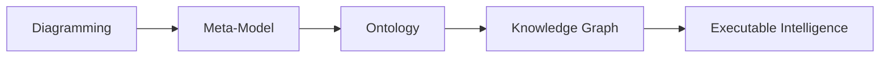

# Chapter 10 -- Connecting Concepts Through Object Properties

- [Chapter Introduction](#chapter-introduction)
- [10.1 Why Class Hierarchy Alone Is Not Enough](#101-why-class-hierarchy-alone-is-not-enough)

## Chapter Introduction

In the previous chapter, we explored one of ontology engineering's most foundational activities:

**building class hierarchy**.

Through hierarchy, you began understanding how semantic concepts become organized into meaningful categories. We learned that classes inherit meaning through `subClassOf` relationships, enabling ontology reasoners to understand specification, inheritance, and conceptual structure.

At this stage, ontology already felt more intelligent than traditional modeling.

A `MozzarellaTopping` was no longer simple text.

It belongs to `CheeseTopping`.

`CheeseTopping` belongs to `PizzaTopping`.

Semantic inheritance allowed machines to understand conceptual meaning without requiring repeated manual definitions.

Yet despite this progress, something important was still missing.

Ontology remained structurally organized, but largely disconnected.

The classes existed.

The hierarchy existed.

The categories existed.

But an important question remained un-answered:

> How do these concepts actually interact?

More specifically:

> How does a `pizza` know which `toppings` belong to it?

How can we formally express:

> A `pizza` has `toppings`.

Or:

> A `vegetarian pizza` contains `vegetable toppings`.

Or:

> A `seafood pizza` includes `seafood ingredients`.

Hierarchy alone cannot answer these questions.

Hierarchy tells us:

> what something is.

But ontology also needs to describe:

> how things relate.

This distinction marks one of the more important maturity transition in ontology engineering.

Ontology moves beyond:

> classification

and begins modeling:

> **relationships**.

This is where **Object Properties** enter the picture.

Object properties represent one of the most important concepts in OWL because they transform isolated semantic concepts into an interconnected network of meaning.

Without object properties, ontology resembles a well-organized dictionary - only.

With object properties, ontology becomes:

> a semantic system.

From the perspective of **Executable Knowledge Architecture (EKA)**, this chapter represents a major milestone.

Recall the EKA implementation roadmap:

In earlier stages:
- Diagramming focused primarily on visual representation
- Meta-modeling formalized conceptual structure
- Hierarchy introduced semantic categorization

Now ontology begines introducing something equally important:

> **semantic connectivity**.

And semantic connectivity eventually becomes the foundation of:

> **Knowledge Graph implementation**.

Because knowledge graphs are not merely collections of concepts.

They are:

> connected knowledge.

This chapter therefore focuses not simply on how to create object properties in Protégé, but on understanding why relationships fundamentally change the nature of semantic systems.

Ontology is no longer simply describing categories.

Ontology begins describing:

> **meaningful interaction between concepts**.

## 10.1 Why Class Hierarchy Alone Is Not Enough

By now, you may reasonably ask:

> If hierarchy already organizes concepts, why do we need another mechanism?

The answer lies in understanding the limitation of hierarchy.

Hierarchy is extremely powerful.

But hierarchy answers only one type of semantic question:

> What kind of thing is this?

For example:

`MozzarellaTopping` is a `CheesTopping` which is a `PizzaTopping`.

This structure tells us what mozzarella is.

However, hierarchy cannot answer questions such as:

> Which pizza uses mozzarella?

Or:

> What toppings belong to vegetarian pizza?

Or:

> Which pizzas contain seafood ingredients?

These questions are fundamentally relational.

And this is where ontology begins becoming more sophisticated.

Ontology engineers must now shift their mindset.

Instead of thinking only about:

> classifiction

we begin thinking about:

> connection.

This conceptual transition is extremely important.

Many beginners initially attempts to force reltionships into hierarchy.

For example, someone may incorrectly think:

> `CheeseTopping` should exist underneath `Pizza`.

But this would be semantically incorrect!

Why?

Because `toppings` are not kinds of `pizza`.

Rather:

> `pizzas` and `toppings` are separate concepts that interact through relationships.

This distinction mirrors enterprise modeling.

Consider an enterprise architecture repository.

A business capability is not a subclass of application.

An application is not a subclass of process.

However:

They are connected.

For example:

> Capability enabledBy (or `is realized by` in ArchiMate terminology) Application.

or:

> Application supports (or `serves` in ArchiMate terminology) Process

The same semantic thinking applies inside `Pizza.owl`.

`Pizza` and `toppings` are separte semantic domains.

Ontology must express how they relate.

And that relationship is modeled through:

> **Object Properties**.

This realization often becomes a turning point for learners.

Because for the FIRST time:

Ontology begins feeling alive.

Concepts are no longer isolated definitions.

They begin interacting.

---

Last updated at 5/25/2026