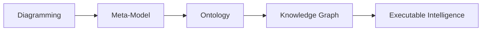
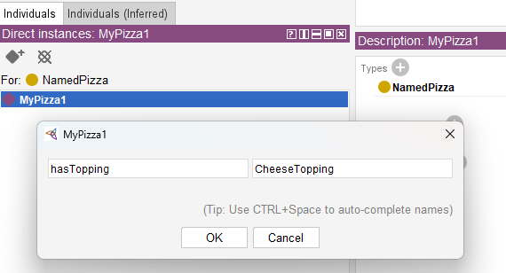
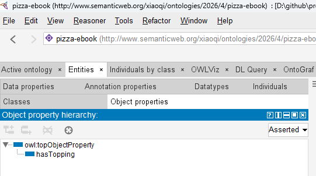
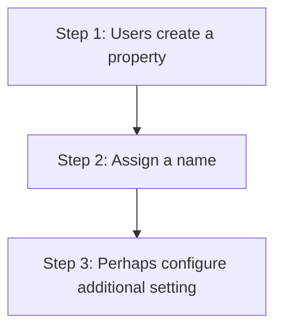

# Chapter 10 -- Connecting Concepts Through Object Properties

- [Chapter Introduction](#chapter-introduction)
- [10.1 Why Class Hierarchy Alone Is Not Enough](#101-why-class-hierarchy-alone-is-not-enough)
- [10.2 What Are Object Properties?](#102-what-are-object-properties)
- [10.3 Creating Object Properties in Protégé](#103-creating-object-properties-in-protégé)
- [10.4 Domain and Range -- Defining Semantic Boundaries](#104-domain-and-range----defining-semantic-boundaries)
- [10.5 Building `Pizza` Relationships Through `hasTopping`](#105-building-pizza-relationships-through-hastopping)
- [10.6 RDF Triple Thinking -- The Semantic Grammar of Relationships](#106-rdf-triple-thinking----the-semantic-grammar-of-relationships)
- [10.7 EKA Perspective -- Object Properties as the Beginning of Connected Intelligence](#107-eka-perspective----object-properties-as-the-beginning-of-connected-intelligence)
- [10.8 Practice Exercise -- Creating Object Properties in `Pizza.owl`](#108-practice-exercise----creating-object-properties-in-pizzaowl)
- [10.9 Common Modeling Mistakes with Object Properties](#109-common-modeling-mistakes-with-object-properties)
  - [10.9.1 Mistake 1 -- Confusing Hierarchy with Relationships](#1091-mistake-1----confusing-hierarchy-with-relationships)
  - [10.9.2 Mistake 2 -- Weak Relationship Naming](#1092-mistake-2----weak-relationship-naming)
  - [10.9.3 Mistake 3 -- Ignoring Domain and Range](#1093-mistake-3----ignoring-domain-and-range)
  - [10.9.4 Mistake 4 -- Overengineering Too Early](#1094-mistake-4----overengineering-too-early)
- [Chapter (10) Summary](#chapter-10-summary)
- [Key Concepts](#key-concepts)
- [Protégé Skills Learned](#protégé-skills-learned)
- [Next Chapter (11) Preview](#next-chapter-11-preview)
- [Demo Video for this Chapter](#demo-video-for-this-chapter)

## Chapter Introduction

In the previous chapter, we explored one of ontology engineering's most foundational activities:

> **building class hierarchy**.

Through hierarchy, you began understanding how semantic concepts become organized into meaningful categories. We learned that classes inherit meaning through `subClassOf` relationships, enabling ontology reasoners to understand specification, inheritance, and conceptual structure.

At this stage, ontology already felt more intelligent than traditional modeling.

A `MozzarellaTopping` was no longer simple text.

It belongs to `CheeseTopping`.

`CheeseTopping` belongs to `PizzaTopping`.

Semantic inheritance allowed machines to understand conceptual meaning without requiring repeated manual definitions.

Yet despite this progress, something important was still missing.

Ontology remained structurally organized, but largely disconnected.

The classes existed.

The hierarchy existed.

The categories existed.

But an important question remained un-answered:

> How do these concepts actually interact?

More specifically:

> How does a `pizza` know which `toppings` belong to it?

How can we formally express:

> A `pizza` has `toppings`.

Or:

> A `vegetarian pizza` contains `vegetable toppings`.

Or:

> A `seafood pizza` includes `seafood ingredients`.

Hierarchy alone cannot answer these questions.

Hierarchy tells us:

> what something is.

But ontology also needs to describe:

> how things relate.

This distinction marks one of the more important maturity transitions in ontology engineering.

Ontology moves beyond:

> classification

and begins modeling:

> **relationships**.

This is where **Object Properties** enter the picture.

Object properties represent one of the most important concepts in OWL because they transform isolated semantic concepts into an interconnected network of meaning.

Without object properties, ontology resembles a well-organized dictionary - only.

With object properties, ontology becomes:

> a semantic system.

From the perspective of **Executable Knowledge Architecture (EKA)**, this chapter represents a major milestone.

Recall the EKA implementation roadmap:



In earlier stages:
- Diagramming focused primarily on visual representation
- Meta-modeling formalized conceptual structure
- Hierarchy introduced semantic categorization

Now ontology begins introducing something equally important:

> **semantic connectivity**.

And semantic connectivity eventually becomes the foundation of:

> **Knowledge Graph implementation**.

Because knowledge graphs are not merely collections of concepts.

They are:

> connected knowledge.

This chapter therefore focuses not simply on how to create object properties in Protégé, but on understanding why relationships fundamentally change the nature of semantic systems.

Ontology is no longer simply describing categories.

Ontology begins describing:

> **meaningful interaction between concepts**.

## 10.1 Why Class Hierarchy Alone Is Not Enough

By now, you may reasonably ask:

> If hierarchy already organizes concepts, why do we need another mechanism?

The answer lies in understanding the limitation of hierarchy.

Hierarchy is extremely powerful.

But hierarchy answers only one type of semantic question:

> What kind of thing is this?

For example:

`MozzarellaTopping` is a `CheeseTopping` which is a `PizzaTopping`.

This structure tells us what mozzarella is.

However, hierarchy cannot answer questions such as:

> Which pizza uses mozzarella?

Or:

> What toppings belong to vegetarian pizza?

Or:

> Which pizzas contain seafood ingredients?

These questions are fundamentally relational.

And this is where ontology begins becoming more sophisticated.

Ontology engineers must now shift their mindset.

Instead of thinking only about:

> classification

we begin thinking about:

> connection.

This conceptual transition is extremely important.

Many beginners initially attempt to force relationships into hierarchy.

For example, someone may incorrectly think:

> `CheeseTopping` should exist underneath `Pizza`.

But this would be semantically incorrect!

Why?

Because `toppings` are not kinds of `pizza`.

Rather:

> `pizzas` and `toppings` are separate concepts that interact through relationships.

This distinction mirrors enterprise modeling.

Consider an enterprise architecture repository.

A business capability is not a subclass of application.

An application is not a subclass of process.

However:

They are connected.

For example:

> Capability enabledBy (or `is realized by` in ArchiMate terminology) Application.

or:

> Application supports (or `serves` in ArchiMate terminology) Process

The same semantic thinking applies inside `Pizza.owl`.

`Pizza` and `toppings` are separate semantic domains.

Ontology must express how they relate.

And that relationship is modeled through:

> **Object Properties**.

This realization often becomes a turning point for learners.

Because for the FIRST time:

Ontology begins feeling alive.

Concepts are no longer isolated definitions.

They begin interacting.

## 10.2 What Are Object Properties?

At its simplest level, an **Object Property** is a semantic relationship that connects one concept to another.

However, from a professional ontology perspective, object properties are much more than simple connections.

They represent:

> **machine-readable meaning between concepts**.

This distinction matters.

In ordinary diagrams, relationships are often visual.

A line may connect two boxes.

People interpret meaning through human understanding.

But machines cannot reliably interpret diagrams.

Machines require formal semantics.

Object properties provide those semantics.

For example:

When we define (in Protégé):

> `Pizza hasTopping CheeseTopping`



we are not simply drawing a line.

We are creating a formal semantic statement.

The ontology now understands:

> `Pizza` can connect to toppings.

This relationship becomes machine-readable.

Reasoner can analyze it.

RDF can serialize it.

Knowledge graphs can query it.

AI systems can eventually consume it.

This is one of the reasons ontology engineering differs fundamentally from traditional modeling approaches.

In UML diagrams, relationships may remain descriptive.

In ontology:

relationships become:

> executable semantic logic.

This shift is profound.

Inside `Pizza.owl`, one of the first important object properties introduced is:

`hasTopping`

Although simple at first glance, this relationship becomes foundational.

Nearly everything in `Pizza.owl` later depends upon it.

Restrictions depend upon it.

Reasoning depends upon it.

Classification depends upon it.

And future semantic inference depends upon it.

Without object properties: ontology remains disconnected.

With object properties: ontology becomes:

> interconnected semantic knowledge!

## 10.3 Creating Object Properties in Protégé

Inside Protégé, object properties are managed through the **Object Properties tab**.



At first glance, this area may appear relatively simple.



However, ontology engineers should resist viewing object properties as technical configuration.

**Object Properties are semantic design decisions.**

Every property expresses meaning.

And meaning must be intentional.

For this reason, naming becomes critically important.

Good ontology naming improves **readability**, **maintainability**, and **semantic clarity**.

For example:

`hasTopping` immediately communicates meaning.

Anyone reading the ontology understands:

> Pizza possesses toppings.

This becomes especially important in enterprise contexts.

Imagine an ontology supporting enterprise architecture.

Relationships may include:

- supports
- dependsOn
- enables
- governedBy
- ownedBy

In another practice of examining ArchiMate language from ontology perspective (https://github.com/yasenstar/ArchiMate_Ontology), you may find all of those 11 key ArchiMate relationships can be modeled as object properties.

Poor naming creates ambiguity.

Strong semantic naming improves understanding across teams.

When creating object properties, ontology engineers should continuously ask:

> What relationship am I truly trying to represent?

Because object properties are not merely technical elements.

They become the language of semantic interaction.

## 10.4 Domain and Range -- Defining Semantic Boundaries

As ontology grows, another challenge naturally emerges.

If relationships can connect concepts FREELY, how do we prevent semantic CHAOS?

For example:

Could someone accidentally define:

> `Pizza hasTopping Car`

**Technically**, without constraints, mistakes become possible.

This is where ontology introduces two important mechanisms:

| <h3>Domain</h3> | and | <h3>Range</h3> |
| --- | --- | --- |

These concepts establish semantic boundaries.

The **domain** specifies:

> where a relationship starts.

For example: `hasTopping` may begin from `Pizza`.

This means:

Only pizza-related concepts should meaningfully use this relationship.

Meanwhile, the **range** defines:

> where the relationship ends.

For example: `hasTopping` may point to `PizzaTopping`.

Meaning:

Only toppings represent valid targets.

Together, domain and range create semantic discipline.

They help protect ontology integrity.

From an EKA perspective, domain and range resemble governance rules.

Inside enterprise architecture, relationships also require constraints.

For example:

An application may:

> support a business process

But a regulation may not:

> directly host a database.

Semantic governance matters.

Without governance: knowledge deteriorates.

Ontology therefore introduces boundaries that preserve semantic quality over time.

## 10.5 Building `Pizza` Relationships Through `hasTopping`

Inside `Pizza.owl`, the `hasTopping` property becomes one of the ontology's most important relationships.

At first glance, it may appear straightforward.

A `pizza` contains `toppings`.

Simple!

However, underneath this simplicity lies something powerful.

Object properties transform ontology from static definitions into relational knowledge.

Consider: `MargheritaPizza` may connect to:

- `MozzarellaTopping`
- `TomatoTopping`

Semantically, we now express:

> MargheritaPizza has mozzarella topping.

This relationship becomes more than description.

It becomes semantic intelligence.

Why?

Because the ontology already understands.

> MozzarellaTopping is a CheeseTopping

This means the reasoner may later infer:

> MargheritaPizza contains cheese.

Notice what happened.

We never explicitly declared:

> MargheritaPizza contains cheese.

The ontology inferred it.

This is where semantic engineering begins demonstrating its real value.

Ontology starts producing knowledge.

Not merely storing it.

This capability later becomes foundational for Knowledge Graphs, semantic querying, recommendation systems, and intelligent reasoning.

## 10.6 RDF Triple Thinking -- The Semantic Grammar of Relationships

Chapter 08 introduced RDF as the underlying language of ontology.

Now object properties bring RDF into practical modeling.

Every object property ultimately becomes an RDF statement.

For example:

`Pizza` $\rightarrow$ `hasTopping` $\rightarrow$ `CheeseTopping`

In RDF terms:

- Subject = `Pizza` = Noun
- Predicate = `hasTopping` = Verb
- Object = `CheeseTopping` = Noun (or Literal)

This perspective is extremely important!

Ontology engineers should gradually stop thinking only visually.

Instead: begin thinking semantically.

Every relationship becomes:

> machine-readable grammar.

This is precisely why ontology naturally evolves into graph databases.

Because graph databases think similarly.

Neo4j, for example, models:

> Node $\rightarrow$ Relationship $\rightarrow$ Node

Which closely resembles RDF:

> Subject $\rightarrow$ Predicate $\rightarrow$ Object

This is not accidental.

The ontology world and graph world are deeply connected.

Object properties become the bridge.

In many ways, when ontology engineers define object properties, they are already preparing for:

> Knowledge Graph thinking.

## 10.7 EKA Perspective -- Object Properties as the Beginning of Connected Intelligence

Within EKA, Chapter (10) represents a significant maturity leap.

Until now: knowledge was organized.

Beginning here: knowledge becomes connected.

At the:

<h3>Diagramming Stage</h3>

relationships remain visual.

At the:

<h3>Meta-Model Stage</h3>

relationships become formalized.

At the:

<h3>Ontology Stage</h3>

relationships become:

> semantic meaning!

This distinction matters enormously.

Because future **Knowledge Graph** implementation depends heavily on connected semantics.

Graph databases such as Neo4j naturally operationalize these relationships.

Continue above example:

`Pizza` $\rightarrow$ `hasTopping` $\rightarrow$ `Cheesetopping`

Using Cypher syntax to translate above sample, is like below

```
(:Pizza)-[:HAS_TOPPING]->(:CheeseTopping)
```

Now knowledge becomes **traversable**.

Organizations can ask meaningful questions.

For example:

> Which pizza contain cheese?

Or at enterprise scale:

> Which business capabilities depend on a deprecated system?

> What applications are affected if regulation changes?

> What dependencies create operational risk?

This is precisely where ontology begins transitioning towards:

> executable intelligence.

Without semantic relationships: knowledge remains fragmented.

With semantic relationships: knowledge becomes operational.

This explains why object properties matter so deeply in EKA.

Ontology is no longer simply classification.

Ontology becomes:

> **connected meaning**.

And connected meaning ultimately becomes:

> **connected intelligence**.

## 10.8 Practice Exercise -- Creating Object Properties in `Pizza.owl`

At this stage of the learning journey, you should begin reinforcing theory through hands-on modeling. Ontology engineering is ultimately a practical discipline. Understanding semantic relationships conceptually is important, but true mastery comes from creating and observing those relationships inside Protégé.

Using the `Pizza.owl` ontology, revisit the Object Properties tab and recreate the relationships demonstrated in the video.

A recommended practice sequence includes:

1. Open the `Pizza.owl` ontology in Protégé
2. Navigate to the **Object Properties** tab
3. Review existing semantic relationships
4. Create and inspect the `hasTopping` property
5. Explore how domain and range define semantic boundaries
6. Observe how pizzas connect to toppings
7. Reflect on how relationships create machine-readable meaning

While practicing, avoid viewing object properties as simple links.

Instead, continually ask yourself:

> What semantic meaning is this relationship expressing?

For example:

If a pizza **has topping**, what kind of toppings should be allowed?

How would this influence reasoning later?

These kind of questions gradually shift you from simply using Protégé to thinking like an ontology engineer.

And that mindset transformation is one of the most valuable outcomes of the `Pizza.owl` journey.

## 10.9 Common Modeling Mistakes with Object Properties

Because object properties introduce relationships for the first time, beginners frequently encounter modeling mistakes. Understanding these common pitfalls helps you build stronger semantic foundations.

### 10.9.1 Mistake 1 -- Confusing Hierarchy with Relationships

One of the most frequent mistakes is attempting to model relationships using hierarchy.

For example, some beginners incorrectly place toppings underneath pizzas as subclasses.

This is semantically incorrect.

A topping is not a type of pizza.

Instead:

> Pizza hasTopping Topping

This distinction between `is-a` and `related-to` is fundamental to ontology engineering.

### 10.9.2 Mistake 2 -- Weak Relationship Naming

Poorly named properties reduce readability and semantic clarity.

For example:

Generic names such as `connectTo` or `relation1` provide little semantic meaning.

Instead, relationships should clearly express intent.

Examples include:

- `hasTopping`
- `dependsOn`
- `governedBy`
- `supportedBy`
- `enabledBy`

Meaningful naming improves maintainability and collaboration.

### 10.9.3 Mistake 3 -- Ignoring Domain and Range

Without semantic boundaries, ontologies quickly become inconsistent. (Thanks Reasoner, however, reasoner can help you identifying the inconsistent, prevent / fix the inconsistent is still the "art" part for ontology engineers during design phase.)

Incorrect relationships may appear valid.

Over time, this weakens ontology quality.

Domain and range should therefore be treated as semantic governance mechanisms. Again, it's also depend on your setting Domains and Ranges properly.

### 10.9.4 Mistake 4 -- Overengineering Too Early

Another common mistakes is creating excessive complexity prematurely.

Ontology grows iteratively.

Start with clear and meaningful relationships.

Complexity can evolve naturally later.

Professional ontology engineering values:

> clarity before complexity.

## Chapter (10) Summary

In this chapter (10), you explored one of ontology engineering's most important transitions:

> **moving from classification to semantic relationships**.

In previous chapters, ontology focused heavily on hierarchy.

Hierarchy helped organize concepts and establish inheritance.

However, knowledge remained largely disconnected.

Chapter 10 introduced the missing semantic ingredient:

> **Object Properties**.

You learned:

- Why hierarchy alone is insufficient
- What object properties are and why they matter
- How semantic relationships differ from classification
- How to create object properties in Protégé
- Why domain and range preserve semantic integrity
- How `hasTopping` connects pizzas and toppings
- How RDF triples relate to semantic relationships
- Why object properties become foundational for Knowledge Graph thinking within EKA

Most importantly, this chapter (10) introduced a new ontology mindset.

Ontology is no longer simply organizing concepts.

Ontology begins connecting them.

And connected knowledge eventually becomes:

> **connected intelligence**.

Within the EKA roadmap, this chapter (10) makes the moment where ontology begins transitioning naturally toward:

> **Knowledge Graph implementation**.

Because knowledge graphs are not built from isolated categories.

They are built from:

> meaningful semantic relationships.

## Key Concepts

| Concept | Description |
| --- | --- |
| Object Property | A semantic relationship that connects one concept to another in an ontology. |
| Semantic Relationship | A formal connection between concepts that expresses machine-readable meaning. |
| Domain | The starting class of an object property relationship. |
| Range | The target class of an object property relationship. |
| RDF Triple | A semantic statement structured as **Subject $\rightarrow$ Predicate $\rightarrow$ Object**. |
| `hasTopping` Relationship | An object property in `Pizza.owl` used to connect pizzas with toppings. |
| Ontology Connectivity | The semantic linked of concepts through meaningful relationships. |
| EKA Semantic Relationship Layer | The ontology stage in EKA where semantic relationships prepare knowledge for Knowledge Graph implementations. |

## Protégé Skills Learned

- Creating object properties
- Understanding semantic relationships
- Defining domain and range
- Working with `hasTopping`
- Modeling semantic connectivity
- Thinking in RDF relationships
- Preparing ontology for Knowledge Graph implementation

## Next Chapter (11) Preview

In the next chapter (11), you will extended semantic relationships further by exploring an important OWL capability:

> **Inverse Properties**.

If object properties help ontology express relationships in one direction, then inverse properties allow machines to understand relationships from the opposite perspective.

For example:

If:

> `Pizza hasTopping CheeseTopping`

Then ontology may also understand:

> `CheeseTopping isToppingOf Pizza`

The `hasTopping` and `isToppingOf` here are the inverse properties each other.

This may initially appear like a minor enhancement.

However, inverse properties significantly strengthen ontology reasoning, semantic navigation, and relationship querying.

From an EKA perspective, inverse relationships also improve graph traversal and dependency analysis, helping semantic knowledge become increasingly intelligent and interconnected.

Chapter 11 therefore continues the important journey from:

> connected concepts

into:

> bidirectional semantic intelligence.

## Demo Video for this Chapter

Chapter 10 - Object Properties on YouTube: https://youtu.be/4DfR06bI500

---

Last updated at 2026-06-25