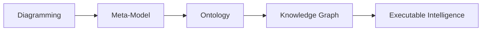

# Chapter 11 - Strengthening Semantic Intelligence Through Inverse Properties

- [Chapter Introduction](#chapter-introduction)
- [11.1 Why One-Way Relationships Are Not Enough Any More](#111-why-one-way-relationships-are-not-enough-any-more)

## Chapter Introduction

In the previous chapter (10), you have been introduced to one of ontology engineering's most important capabilities:

> **Object Properties**.

For the first time in the `Pizza.owl` journey, ontology evolved beyond isolated classification and began expressing meaningful semantic relationships.

Until Chapter 09, ontology was primarily concerned with:

> what things are.

A pizza was classified as a pizza.

A topping belonged to a topping hierarchy.

A mozzarella topping inherited meaning from cheese topping.

Hierarchy enabled semantic organization.

However, beginning in Chapter 10, ontology shifted focus toward another important question:

> How do concepts interact?

Instead of merely organizing concepts into categories, you began formally expressing relationships such as:

> Pizza hasTopping CheeseTopping

This marked a significant transition.

Ontology no longer resembled a semantic dictionary.

It began behaving more like:

> a semantic network.

Concepts starts becoming connected.

Relationships started becoming machine-readable.

And ontology started becoming increasingly intelligent.

Yet despit this important progress, an important limitation still exists.

Relationships currently operate in only ONE DIRECTION.

For example:

If ontology understands:

> Pizza hasTopping CheeseTopping

Can ontology also automatically understand:

> CheeseTopping isToppingOf Pizza?

For humans, this feels obvious. People naturally understand relationships from both directions.

However, machines require explicit semantic guidance.

Without additional semantic definition, ontology may understand only:

> Pizza $\rightarrow$ hasTopping $\rightarrow$ CheeseTopping

But not necessarily:

> CheeseTopping $\rightarrow$ isToppingOf $\rightarrow$ Pizza

This limitation introduces one of the next important maturity steps in OWL:

> **Inverse Properties**.

Inverse properties enable ontology to understand relationships from opposite perspectives.

- They strengthen semantic navigation.
- They improve inference capability.
- They reduce modeling redundancy, and
- Perhaps most importantly: they help transform ontology from **connected knowledge** into **navigable semantic intelligence**.

From the perspective of **Executable Knowledge Architecture (EKA)**, this chapter represents another important progression point.

Recall the EKA roadmap:

At the ontology stage, semantic relationships are becoming increasingly sophisticated.

**Earlier**: Hierarchy provided semantic organization.

**Then**: Object properties introduced connectivity.

**Now**: Inverse properties introduce:

> **bidirectional semantic meaning**.

This matters enormously for future Knowledge Graph implementation.

Because graph intelligence often depends not merely on connections, but on:

> traversable relationships.

In enterprise architecture, organizations rarely ask only:

> What systems support this process?

They may also ask:

> Which processes depend upon this system?

Likewise:

They rarely ask only:

> Which application owns data?

They may also ask:

> Which data domains are owned by this application?

This ability to move in multiple semantic directions dramatically improves intelligence, dependency analysis, and reasonsing.

Chapter 11 therefore focuses not merely on how to configure inverse properties inside Protégé.

Instead, this chapter explores something deeper:

> **how bidirectional semantic thinking strengthens ontology intelligence**.

## 11.1 Why One-Way Relationships Are Not Enough Any More

At first glance, object properties introduced in Chapter 10 may appear sufficient.

After all:

We already defined meaningful relationships.

For example:

> Pizza hasTopping CheeseTopping

This seems complete.

A pizza contains toppines.

The relationship is clear.

So why introduce inverse properties?

The answer lies in understanding how machines reason.

Human thinking naturally interprets relationships from multiple perspective.

If someone says:

> Alice works for Company X

People immediately understand:

> Company X employs Alice

Even if the second statement was never explicitly spoken.

Humans infer meaning naturally, in human brain (minds).

Machines DO NOT!

Semantic systems require formal logic.

Without inverse relationships, ontology may understand only one semantic direction.

For example:

Ontology may know:

> MargheritaPizza hasTopping MozzarellaTopping

But if a query asks:

> Which pizzas use Mozzarella?

The system may struggle unless additional semantic information exists.

Inverse properties solve this problem elegantly.

They allow ontology to understand.

> if A relates to B

then:

> B relates back to A

This dramatically improveds semantic flexibility.

Relationships become:

> **navigable**.

And navigability is one of the defining characteristics of intelligent knowledge systems.

Consider enterprise architecture.

Imagine an application dependency model.

We may define:

> Application supports BusinessProcess

But organizations frequently need the reverse question:

> Which business process depend on this application?

Without inverse semantics, reverse analysis becomes difficult.

With inverse semantics: **knowledge becomes easier to explore**.

This is precisely why inverse properties matter.

They improve:

> Ontology Usability.

