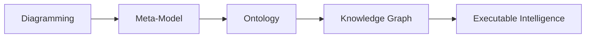
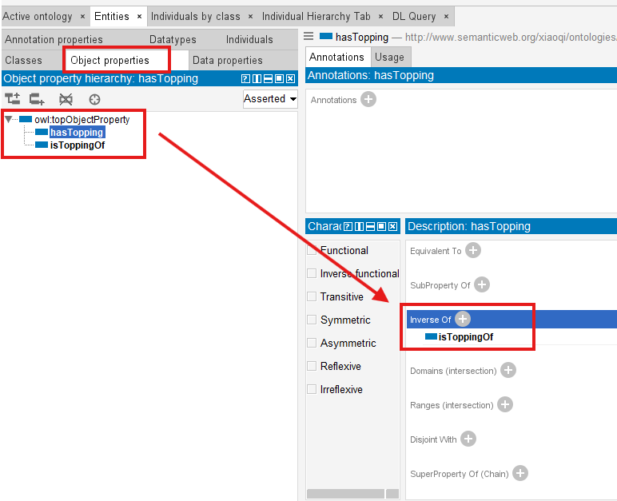
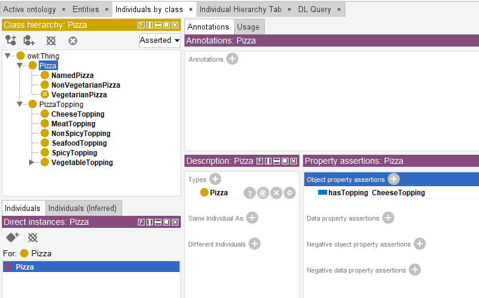
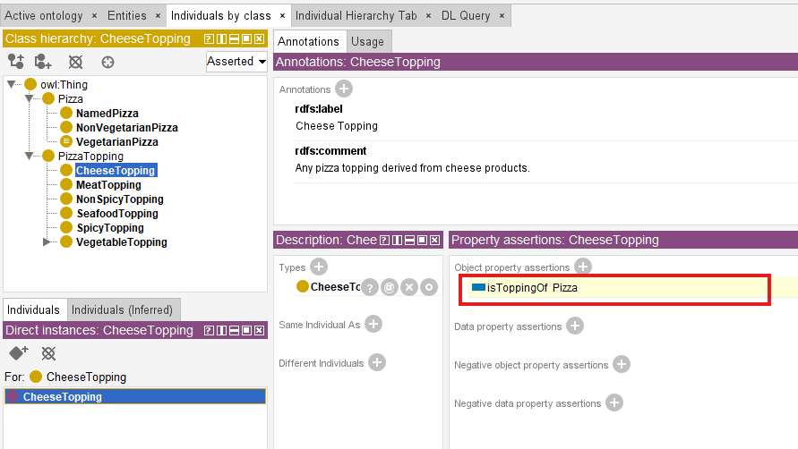

# Chapter 11 - Strengthening Semantic Intelligence Through Inverse Properties

- [Chapter Introduction](#chapter-introduction)
- [11.1 Why One-Way Relationships Are Not Enough Any More](#111-why-one-way-relationships-are-not-enough-any-more)
- [11.2 What Are Inverse Properties?](#112-what-are-inverse-properties)
- [11.3 Understnading Bi-directional Semantics](#113-understnading-bi-directional-semantics)
- [11.4 Configuring Inverse Properties in Protégé](#114-configuring-inverse-properties-in-protégé)
- [11.5 Exercise 10 -- Extending `Pizza.owl` Through Inverse Relationships](#115-exercise-10----extending-pizzaowl-through-inverse-relationships)
- [11.6 How Reasoners Benefit from Inverse Properties](#116-how-reasoners-benefit-from-inverse-properties)
- [11.7 RDF Perspective -- One Semantic Truth, Multiple Directions](#117-rdf-perspective----one-semantic-truth-multiple-directions)
- [11.8 Enterprise Architecture Analogy -- Dependency Intelligence in EKA](#118-enterprise-architecture-analogy----dependency-intelligence-in-eka)
- [11.9 Common Modeling Mistakes with Inverse Properties](#119-common-modeling-mistakes-with-inverse-properties)

## Chapter Introduction

In the previous chapter (10), you have been introduced to one of ontology engineering's most important capabilities:

> **Object Properties**.

For the first time in the `Pizza.owl` journey, ontology evolved beyond isolated classification and began expressing meaningful semantic relationships.

Until Chapter 09, ontology was primarily concerned with:

> what things are.

A pizza was classified as a pizza.

A topping belonged to a topping hierarchy.

A mozzarella topping inherited meaning from cheese topping.

Hierarchy enabled semantic organization.

However, beginning in Chapter 10, ontology shifted focus toward another important question:

> How do concepts interact?

Instead of merely organizing concepts into categories, you began formally expressing relationships such as:

> Pizza hasTopping CheeseTopping

This marked a significant transition.

Ontology no longer resembled a semantic dictionary.

It began behaving more like:

> a semantic network.

Concepts starts becoming connected.

Relationships started becoming machine-readable.

And ontology started becoming increasingly intelligent.

Yet despit this important progress, an important limitation still exists.

Relationships currently operate in only ONE DIRECTION.

For example:

If ontology understands:

> Pizza hasTopping CheeseTopping

Can ontology also automatically understand:

> CheeseTopping isToppingOf Pizza?

For humans, this feels obvious. People naturally understand relationships from both directions.

However, machines require explicit semantic guidance.

Without additional semantic definition, ontology may understand only:

> Pizza $\rightarrow$ hasTopping $\rightarrow$ CheeseTopping

But not necessarily:

> CheeseTopping $\rightarrow$ isToppingOf $\rightarrow$ Pizza

This limitation introduces one of the next important maturity steps in OWL:

> **Inverse Properties**.

Inverse properties enable ontology to understand relationships from opposite perspectives.

- They strengthen semantic navigation.
- They improve inference capability.
- They reduce modeling redundancy, and
- Perhaps most importantly: they help transform ontology from **connected knowledge** into **navigable semantic intelligence**.

From the perspective of **Executable Knowledge Architecture (EKA)**, this chapter represents another important progression point.

Recall the EKA roadmap:

At the ontology stage, semantic relationships are becoming increasingly sophisticated.

**Earlier**: Hierarchy provided semantic organization.

**Then**: Object properties introduced connectivity.

**Now**: Inverse properties introduce:

> **bidirectional semantic meaning**.

This matters enormously for future Knowledge Graph implementation.

Because graph intelligence often depends not merely on connections, but on:

> traversable relationships.

In enterprise architecture, organizations rarely ask only:

> What systems support this process?

They may also ask:

> Which processes depend upon this system?

Likewise:

They rarely ask only:

> Which application owns data?

They may also ask:

> Which data domains are owned by this application?

This ability to move in multiple semantic directions dramatically improves intelligence, dependency analysis, and reasonsing.

Chapter 11 therefore focuses not merely on how to configure inverse properties inside Protégé.

Instead, this chapter explores something deeper:

> **how bidirectional semantic thinking strengthens ontology intelligence**.

## 11.1 Why One-Way Relationships Are Not Enough Any More

At first glance, object properties introduced in Chapter 10 may appear sufficient.

After all:

We already defined meaningful relationships.

For example:

> Pizza hasTopping CheeseTopping

This seems complete.

A pizza contains toppines.

The relationship is clear.

So why introduce inverse properties?

The answer lies in understanding how machines reason.

Human thinking naturally interprets relationships from multiple perspective.

If someone says:

> Alice works for Company X

People immediately understand:

> Company X employs Alice

Even if the second statement was never explicitly spoken.

Humans infer meaning naturally, in human brain (minds).

Machines DO NOT!

Semantic systems require formal logic.

Without inverse relationships, ontology may understand only one semantic direction.

For example:

Ontology may know:

> MargheritaPizza hasTopping MozzarellaTopping

But if a query asks:

> Which pizzas use Mozzarella?

The system may struggle unless additional semantic information exists.

Inverse properties solve this problem elegantly.

They allow ontology to understand.

> if A relates to B

then:

> B relates back to A

This dramatically improveds semantic flexibility.

Relationships become:

> **navigable**.

And navigability is one of the defining characteristics of intelligent knowledge systems.

Consider enterprise architecture.

Imagine an application dependency model.

We may define:

> Application supports BusinessProcess

But organizations frequently need the reverse question:

> Which business process depend on this application?

Without inverse semantics, reverse analysis becomes difficult.

With inverse semantics: **knowledge becomes easier to explore**.

This is precisely why inverse properties matter.

They improve:

> Ontology Usability.

## 11.2 What Are Inverse Properties?

An **Inverse Properties** is a semantic relationship that represents the opposite direction of another object property.

In simple terms:

If one property says:

> A relates to B

An inverse property says:

> B relates back to A

For example:

Inside `Pizza.owl`:

We may define:

> Pizza hasTopping PizzaTopping

Its inverse may become:

> PizzaTopping isToppingOf Pizza

Notice something important.

These are not separate meanings.

They represent:

> the same semantic relationship

viewed from different perspectives.

This distinction matters!

Inverse properties are not duplication.

They are:

> semantic mirrors.

A mirror does not create new reality.

It reflects an existing relationship from another angle.

Ontology engineers should think similarly.

The inverse property does not introduce a new business rule.

It enhances semantic accessibility.

This subtle idea is often misunderstood by beginners.

Some learners mistakenly believe inverse properties create new meaning.

In reality:

Inverse properties improve:

- navigation
- inference
- query capability
- semantic expressiveness

while preserving consistency.

From a reasoning perspective, this becomes extremely powerful.

For example:

If ontology understands:

> SeafoodPizza hasTopping TunaTopping

And:

> hasTopping is inverse of isToppingOf

The ontology may automatically infer:

> TunaTopping isToppingOf SeafoodPizza

without explicitly defining the second relationship.

This demonstrates one of OWL's greatest strengths:

> knowledge can be inferred.

Ontology does not merely store information.

Ontology products additional meaning.

## 11.3 Understnading Bi-directional Semantics

To fully appreciate inverse properties, ontology engineers must shift their thinking.

Traditional systems often model relationships linearly.

A database foreign key points in one direction.

A UML arrow may imply a relationship.

But ontology thinking is fundamentally different.

Ontology models:

> semantic meaning.

Meaning natually exists in multiple directions (like human thinking in brain).

For example:

Suppose we define:

> Exployee worksFor Organization

Immediately:

Another meaningful perspective appears:

> Organizaion employs Employee

Neither statement is incorrect.

Both, represent:

> one semantic reality.

This bidirectional perspective becomes critically important in large knowledge systems.

Because intelligent systems rarely ask questions from only one viewpoint.

In enterprise environments: Stakeholders continuously ask reverse questions.

Examples include:

> Which systems support this capability?

And also:

> Which capabilities depend upon this systems?

When you build one management dashboard, information from both directions should be provided, as below sample we delivered in Power BI:

Or:

> Which regulations govern this process?

And also:

> Which processes are impacted by this regulation?

These reverse navigations become essential for:

- impact analysis
- dependency tracing
- governance
- architecture intelligence
- operational visibility

This same logic exists inside `Pizza.owl`.

At first glance:

Pizza examples may appear simplistic.

However, `Pizza.owl` is teaching something much deeper.

It teaches:

> semantic thinking.

Pizza simply acts as the learning vehicle.

The real lesson concers how machines understand relationships.

And inverse properties represent one of the first major steps toward semantic maturity.

With those knowledge to machine, it is feasible to see one machine (robot) understand how to make one professional pizza for you, which already in real life nowadays.

## 11.4 Configuring Inverse Properties in Protégé

Inside Protégé, inverse properties are relatively straightforward to configure.

However, you should avoid treating this merely as software configuration.

Inverse properties are:

> semantic modeling decisions.

Inside the **Object Properties tab**, ontology engineers can define:

- a property
- its inverse property
- semantic directionality

For example in above screenshot:

You may create:

> hasTopping

And configure:

> isToppingOf

as its inverse.

Once defined, Protégé and ontology reasoners begin understanding that both properties represent opposite perspectives of the same semantic relationship.

This dramatically reduces manual effort.

Without inverse properties, ontology engineers might repeatedly model both directions manually.

This creates:

- redundancy
- inconsistency risks
- maintenance complexity

Inverse semantics simplify the model.

And simplification improves maintainability.

This principle becomes increasingly important as ontology grows.

In enterprise-scale semantic systems containing thousands of relationships, maintainability matters enormously.

A poorly designed ontology quickly becomes difficult to govern.

Inverse properties therefore support:

> scalable semantic architecture.

From an EKA perspective, this aligns strongly with enterprise knowledge governance.

Knowledge must remain:

> - understandable
> - maintainable
> - reusable

Inverse properties contribute to all three.

## 11.5 Exercise 10 -- Extending `Pizza.owl` Through Inverse Relationships

In Michael DeBellis' `Pizza.owl` tutorial, **Exercise 10** introduces you to inverse properties through practical modeling.

This represents an important learning milestone.

Until now, you have already explored:

- class hierarchy
- reasoning
- named classes
- object properties

Exercise 10 now extends semantic richness.

Rather than simply connecting pizzas and toppings, ontology begins understanding relationships bidirectionally.

Within the Pizza ontology, you revisit familiar semantic relationships and enhance them using inverse semantics.

For examples:

Instead of only:

> Pizza hasTopping Topping

Ontology now understanding:

> Topping isToppingOf Pizza

This seemingly small enhancement introduces meaningful consequences.

Semantic queries improve.

Reasoning improves.

Navigation improves.

Ontology intelligence improves.

One of the greatest strengths of the `Pizza.owl` tutorial lies in its incremental learning design.

Michael intentionally introduces concepts progressively.

You first understand hierarchy.

Then relationships.

Only afterward: bidirectional relationships.

This learning sequence matters.

Because ontology engineering is cumulative.

Semantic complexity builds layer by layer.

From the EKA perspective, Exercise 10 also represents an important transition.

Ontology begins behaving more like:

> a graph.

And graphs derive much of their power from:

> traversal.

Traversal means:

> moving through connected knowledge (node in a graph).

Inverse properties strengthen traversal capability.

This becomes especially important later for:

> Knowledge Graph implementation.

Because graph systems frequently support:

> forward exploration.

and:

> reverse exploration.

For example:

A Noe4j knowledge graph may ask:

> Which applications support this capability?

And also:

> Which capabilities are affected if this application changes?

Inverse semantic thinking prepares ontology engineers for this future mindset.

## 11.6 How Reasoners Benefit from Inverse Properties

One of the most powerful aspects of OWL ontology is its ability to reason.

Reasoners do not simply validate consistency.

They infer knowledge!

Inverse properties significantly strengthen this capability.

When inverse relationships exist, reasoners gain additional semantic context.

For example:

If ontology explicitly knows:

> Pizza hasTopping CheeseTopping

and:

> hasTopping inverseOf isToppingOf

The reasoner may automatically infer:

> CheeseTopping isToppingOf Pizza

Notice something important.

We never manually declared the second statement (triple).

The ontology inferred it.

This distinction illustrates one of the most powerful characteristics of semantic systems:

> ontology generates knowledge.

Rather than acting only as storage, reasoners therefore become increasingly intelligent as semantic richness grows.

Inverse properties contribute significantly to this richness.

In practical enterprise contexts, this capability becomes transformative.

Imagine enterprise architecture reasoning.

If ontology knows:

> Application supports Capability

And inverse semantics exist.

The sytem may automatically understand:

> Capability supportedBy Application

This dramatically improves:

- dependency analysis
- architecture intelligence
- impact assessment
- semantic querying

Within EKA, this represents another important movement toward:

> **Executable Intelligence**.

Because intelligent execution depends upon:

> connected and inferable knowledge.

## 11.7 RDF Perspective -- One Semantic Truth, Multiple Directions

In Chapter 08, you explored RDF as the underlying language behind OWL ontologies. At that stage, the focus was primarily theoretical:

> understanding how semantic information is represented.

Now, inverse properties allow us to revisit RDF from a more practical perspective.

Every semantic relationship in ontology ultimately becomes:

> an RDF triple.

Recall the fundamental RDF structure:

> **Subject $\rightarrow$ Predicate $\rightarrow$ Object**

For example:

> Pizza $\rightarrow$ hasTopping $\rightarrow$ CheeseTopping

At first glance, RDF appears directional.

And technically, it is.

The relationship (predicate) flows from subject to object.

However, semantic meaning often exists in multiple perspectives.

This is precisely where inverse properties become powerful.

Rather than manually redefining both deirections, ontology allows semantic equivalence between relationships.

For example:

If:

> Pizza $\rightarrow$ hasTopping $\rightarrow$ CheeseTopping

and:

> hasTopping inverseOf isToppingOf

Ontology may semantically understand:

> CheeseTopping $\rightarrow$ isToppingOf $\rightarrow$ Pizza

without manually asserting the second triple.

This distinction matters greatly.

Because semantic systems are not merely connected with storing statements.

They aim to support:

> flexible knowledge navigation.

Ontology engineers should therefore begin thinking beyond simple RDF triples.

Instead, start thinking in terms of:

> semantic movement.

Knowledge should be traverable.

Users should be able to move naturally through relationships.

This mindset becomes increasingly important when ontology evolve into:

> **Knowledge Graph imlementation**.

Because graph systems fundamentally depend upon traversal.

And traversal becomes dramatically stronger when semantic relationships can be explored from multiple directions. (means you can go from one node and back to it via inverse routing, romantic? Yes!)

This explains why inverse properties are not optional enhancements.

They are:

> semantic accelerators.

## 11.8 Enterprise Architecture Analogy -- Dependency Intelligence in EKA

Although `Pizza.owl` provides an approachable learning environment, the real value of ontology emerges when you transfer semantic thinking into enterprise-scale domains.

Inside EKA, inverse properties become extraordinarily valuable.

**Why?**

Because enterprise architecture depends heavily upon:

> dependency intelligence.

Organizations constantly ask inter-connected questions:

For example:

- A business capability may depend upon an application.
- An application may depend upon a technology platform.
- A platform may host critical data/information.
- Regulations may govern business processes.
- Processes may support customer journeys.
- Customer journeys may drive value streams.
- Value streams leads to initiative (programme/projects)

**Everything connects**.

And importantly: relationships rarely matter in only one direction.

Consider a simple enterprise example.

Suppose ontology defines:

> Application supports Capability

This immediately enables useful analysis.

Organizaitons can start asking:

> Which applications support customer onboarding?

However, equally important reverse questions emerge:

> Which capabilities are affected if this application fails?

Without inverse semantics, reverse analysis becomes cumbersome.

Ontology engineers may need redundant queries or duplicated modeling.

Inverse properties elegantly solve this challenge.

By defining:

> supports inverseOf supportedBy

semantic navigation improves dramatically.

Now organizations gain:

> bidirectional dependency intelligence.

This becomes especially important for:

- strategic planning
- impact analysis
- risk management
- architecture governance
- modernization roadmapping
- technical debt analysis
- business continuity assessment

For example:

Inside an EKA knowledge graph:

A deprecated application may automatically reveal:

> - impacted capabilities
> - impacted processes
> - impacted business services
> - impacted integrations
> - impacted stakeholders

This ability to traverse semantic knowledge bi-directionally transforms enterprise architecture from:

> static documentation

into:

> executable intelligence.

And this is one of the deeper reasons Chapter 11 (this one) matters.

At first glance:

Inverse properties may seem like a technical OWL feature.

In reality:

They introduce an important architecture principle:

> **knowledge becomes more intelligent when relationships become navigable!**

## 11.9 Common Modeling Mistakes with Inverse Properties

Because inverse properties initially appear simple, learners often underestimate their modeling importance.

Several common mistakes frequently emerge.

<h3>Mistake 1 -- Treating Inverse Propserties as Duplicate Relationships</h3>

Beginners sometimes mistakenly believe inverse properties create entirely separate business meaning.

For example:

They may define:

> hasTopping

and

> isToppingOf

as unrelated properties.

This weakens semantic consistency.

Remember:

Inverse properties represent:

> **one semantic truth**

just seen from different perspectives.

They should remain conceptually aligned.

Ontology engineers should ask:

> Are these relationships truly opposites of the same meaning?

If the answer is NO: they may not be inverse properties.

<h3>Mistake 2 -- Overengineering Reverse Relationships</h3>

Not every property requires an inverse.

This is **important**.

Ontology engineers should avoid introducing unnecessary complexity.

Inverse properties provide value when:

> reverse semantic navigation matters.

Inside our `Pizza.owl`: `hasTopping` naturally benefits from `isToppingOf`.

But not every semantic property requires such treatment.

Professional ontology engineering values:

> purposeful modeling. (or say "good-enough modeling")

Not maximal modeling.

<h3>Mistake 3 -- Weak Semantic Naming</h3>

Inverse relationships should communicate meaning clearly.

For example:

Good semantic naming:

> hasTopping $\leftrightarrow$ isToppingOf

Poor naming:

> relationA $\leftrightarrow$ relationB

Meaningful names improve:

- readability
- governance
- maintainability
- collaboration

This becomes especially important in enterprise ontologies when hundreds, thousands or even millions of relationships may exist.

<h3>Mistake 4 -- Forgetting Reasoner Validation</h3>

After defining inverse properties, you should always validate behavior through reasoning.

Ontology engineering is not merely configuration.

It requires:

> semantic verification.

So keep asking:

> Did this reasoner infer the reverse relationship correctly?

If not: review the inverse configuration.

Reasoners become essential partners in ontology quality assurance.

