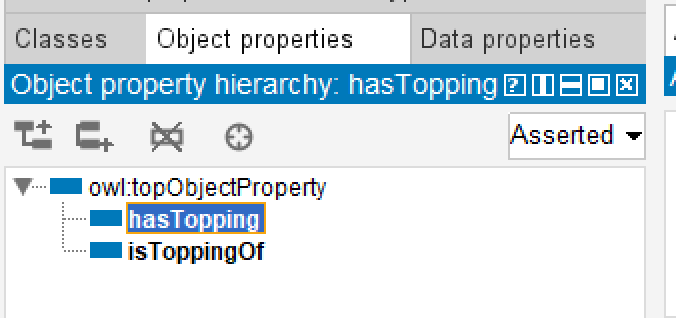
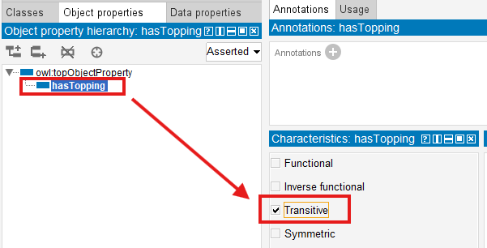
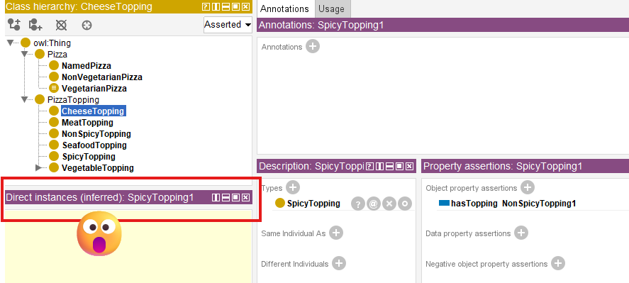
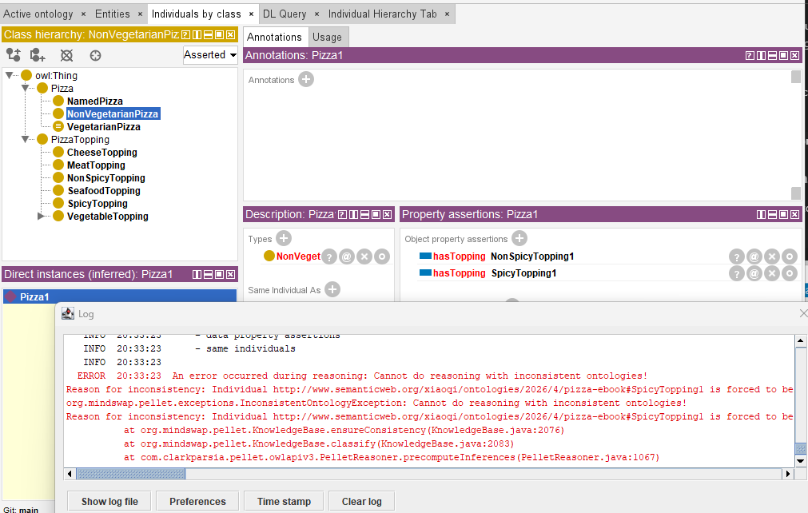
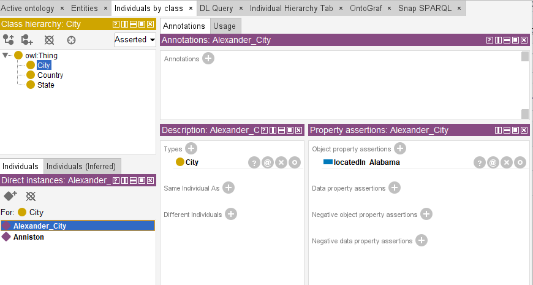
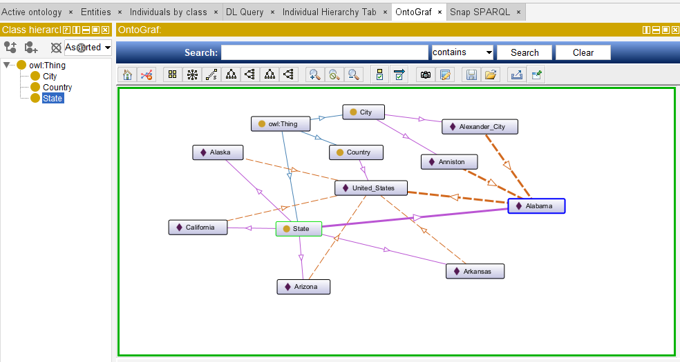
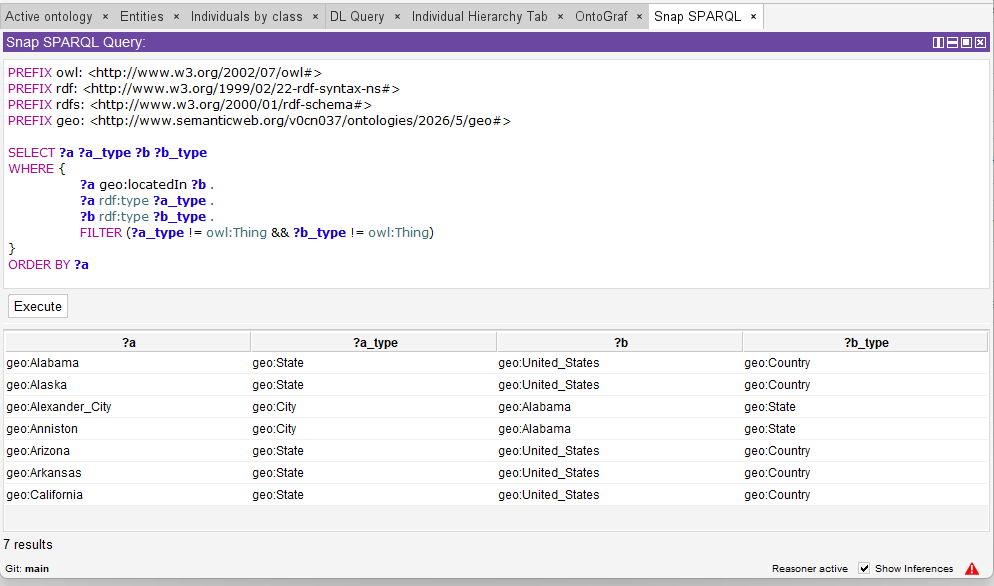
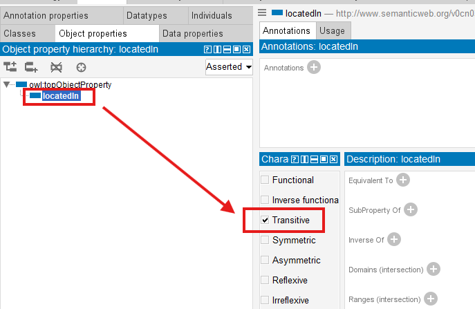
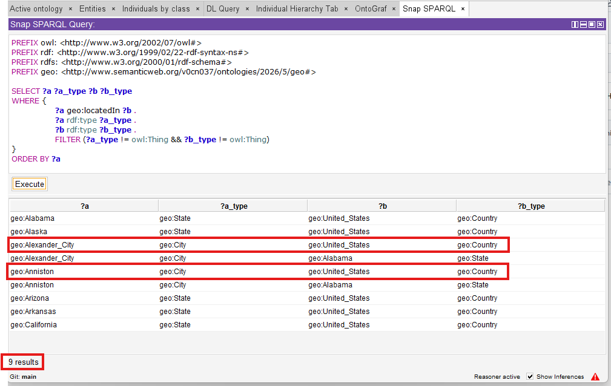

# Chapter 12 -- Governing Semantic Relationship Behavior Through Object Property Characteristics

- [Chapter Introduction](#chapter-introduction)
- [12.1 Why Relationship Behavior Matters](#121-why-relationship-behavior-matters)
- [12.2 Understanding Object Property Characteristics](#122-understanding-object-property-characteristics)
- [12.3 Functional Properties - Enforcing Semantic Uniqueness](#123-functional-properties---enforcing-semantic-uniqueness)
- [12.4 Inverse Functional Properties - Semantic Identity Through Relationshiops](#124-inverse-functional-properties---semantic-identity-through-relationshiops)
- [12.5 Symmetric Properties - Modeling Mutual Semantic Relationships](#125-symmetric-properties---modeling-mutual-semantic-relationships)
- [12.6 Asymmetric Properties -- Modeling Directional Dependency](#126-asymmetric-properties----modeling-directional-dependency)
- [12.7 Transitive Properties - Multi-Hop Semantic Intelligence](#127-transitive-properties---multi-hop-semantic-intelligence)
- [12.8 Reflexive and Irreflexive Properties -- Governing Semantic Validity](#128-reflexive-and-irreflexive-properties----governing-semantic-validity)
- [12.9 Summary on Object Property Characteristics](#129-summary-on-object-property-characteristics)
- [12.10 Practical Exercise - Exploring Property Characteristics in Protégé *(Added by the Author)*](#1210-practical-exercise---exploring-property-characteristics-in-protégé-added-by-the-author)
- [12.11 EKA Tuple Mapping - Object Property Characteristics in EKA](#1211-eka-tuple-mapping---object-property-characteristics-in-eka)
  - [$K$ - Knowledge Graph](#k---knowledge-graph)
  - [$R$ - Reasoning \& Rules](#r---reasoning--rules)
  - [$\\Theta$ - Triggers *(Future EKA Perspective)*](#theta---triggers-future-eka-perspective)
- [$\\Phi$ - Execution Action *(Future EKA Perspective)*](#phi---execution-action-future-eka-perspective)
  - [$\\Gamma$ - Governance](#gamma---governance)
- [12.12 Knowledge Graph Implications](#1212-knowledge-graph-implications)
  - [Example of Implementing Knowledge Graph via `Transitive`](#example-of-implementing-knowledge-graph-via-transitive)
- [12.13 Governance and Semantic Integrity](#1213-governance-and-semantic-integrity)
- [12.14 Common Modeling Mistakes](#1214-common-modeling-mistakes)
- [Chapter (12) Summary](#chapter-12-summary)
- [Key Concepts](#key-concepts)
- [Protégé Skills Learned](#protégé-skills-learned)
- [Next Chapter (13) Preview](#next-chapter-13-preview)
- [Demo Video for this Chapter](#demo-video-for-this-chapter)

## Chapter Introduction

In the previous two chapters (10 & 11), you gradually transitioned from building semantic relationships to strengthening their intelligence.

Chapter 10 introduced **Object Properties**, establishing meaningful semantic connections between concepts.

Chapter 11 extended this understanding through **Inverse Properties**, enabling bidirectional semantic navigation and improving ontology reasoning capabilities.

At this stage, you may naturally feel that ontology engineering is already sufficiently powerful. Concepts can be classified. Relationships can be defined. Bidirectional semantics can be inferred. However, a deeper question soon emerges:

> **Are all relationships supposed to behave in the same way?**

The answer, of course, is NO.

In real-world knowledge systems, relationships possess behavioral meaning. Some relationships are unique. Some are symmetric. Some are directional. Others propagate across multiple levels of dependency. These behaviors are not merely implementation details -- they fundamentally shape how semantic intelligence works.

Consider a few intuitive examples from everyday reasoning.

If:

> Alice isSiblingOf Bob

then we naturally expect:

> Bob isSiblingOf Alice.

However, if:

> Application-A `dependsOn` Database-B

we would not logically infer:

> Database-B `dependsOn` Application-A.

Similarly, if:

> Beijing `locatedIn` China

and:

> China `locatedIn` Asia,

we may reasonably infer:

> Beijing `locatedIn` Asia.

These examples demonstrate an important **semantic truth**:

> relationships are not simply connections -- they possess behavioral logic.

This is precisely where **Object Property Characteristics** become essential.

In OWL ontology engineering, property characteristics define:

> **how semantic relationships behave**.

They introduce semantic constraints, inference logic, and governance rules into ontology models, enabling reasoners to derive new knowledge more intelligently and consistently.

Within Michael DeBellis' `Pizza.owl` tutorial, although there's no specific exercise, you may still begin experimenting with the behavior of object properties inside Protégé and observing how ontology reasoners interpret those behaviors.

However, from the perspective of **Executable Knowledge Architecture (EKA)**, this chapter (12) also represents a significant conceptual milestone.

As introduced in Chapter 00, EKA formalizes executable knowledge through the tuple:

$\boxed{\large{EKA = ( K, R, \Theta, \Phi, \Gamma)}}$

Where:

- **$K$ - Knowledge Graph** represents semantic entities and relationships.
- **$R$ - Reasoning & Rules** governs inference logic.
- **$\Theta$ - Triggers** initiative execution events.
- **$\Phi$ - Execution Actions** perform operational responses.
- **$\Gamma$ - Governance** ensures semantic integrity and compliance

Object Property Characteristics primarily strengthen:

> $R$ (Reasoning & Rules)

and

> $\Gamma$ (Governance)

within EKA.

Without behavioral semantics, knowledge graphs remain **structurally connected** but **semantically shallow**. Reasoners lack the rules needed to infer meaningful outcomes, and governance mechanisms cannot validate whether knowledge behaves consistently.

Object Property Characteristics therefore represent an important transition:

from:

> **connected ontology**

to:

> **governed semantic behavior.**

This distinction matters enormously.

Because intelligence does not emerge merely from connected information.

True semantic intelligence emerges when relationships behave according to:

> **formalized logical rules**.

This chapter explores these behaviors in depth and demonstrates how seemingly simple `Pizza.owl` examples reveal the foundations of enterprise-scale semantic intelligence.

## 12.1 Why Relationship Behavior Matters

Ontology beginners often focus heavily on:

> concepts.

- What classes exist?
- How are they categorized?
- How are they related?

Indeed, these are all important questions.

However, as ontology maturity increases, engineers begin recognizing another equally important concern:

> **How should relationships behave?**

Because semantic meaning does not arise solely from the existence of connections.

It emerges from:

> **the rules governing those connections.**

Imagine an ontology without relationship behavior.

Every relationship would simply behave as:

> a neutral edge.

Reasoners would know:

> something is connected.

But not:

> what that connection means logically.

This creates severe limitations.

Consider an enterprise architecture example.

Suppose ontology knows:

> PaymentSystem dependsOn AuthenticationService

and:

> AuthenticationService dependsOn CloudInfrastructure

Without additional semantic behavior, ontology cannot infer:

> PaymentSystem dependsOn CloudInfrastructure.

The knowledge exists - looks naturally by human.

But semantic propagation does not - from machine perspective.

Now imagine another example.

Suppose ontology contains:

> Customer managedBy AccountManager

Should ontology infer:

> AccountManager managedBy Customer?

Obviously NOT.

Yet without proper behavioral constraints, relationship meaning remains ambiguous.

This problem becomes even more serious at enterprise scale.

Model organizations can easily contain:

- thousands of applications
- hundreds of business capabilities
- complex dependency chains
- governance relationships
- operational interactions

Merely connecting information is not enough.

Organizations increasingly require:

> **semantic governance.**

Relationships must behave correctly.

Dependencies must remain directional.

Ownership must remain unique.

Inference must remain explainable.

This requirement aligns directly with the EKA vision.

Recall the formal EKA component tuple:

$EKA = (K, R, \Theta, \Phi, \Gamma)$

Object properties introduced in earlier chapters primarily contributed toward:

> **$K$ = Knowledge Graph**

because they created semantic relationships between concepts.

However, Chapter 12 begins introducing something much deeper:

> **$R$ - Reasoning & Rules**

through semantic behavior.

Because relationships alone do not create intelligence.

Reasoning rules create intelligence.

At the same time, property characteristics contribute to:

> **$\Gamma$ - Governance**

because they enforce semantic correctness.

As examples:

A functional relationship may enforce uniqueness.

An asymmetric relationship may prevent illogical bidirectional inference.

A transitive relationship may formalize dependency propagation.

Ontology therefore begins evolving beyond:

> connected knowledge

toward:

> **governed semantic intelligence.**

This is one of the most important conceptual transitions in the entire `Pizza.owl` journey.

Because from this point onward, you begin seeing ontology less as:

> a modeling tool

and increasingly as:

> **an executable semantic system.**

## 12.2 Understanding Object Property Characteristics

An **Object Property Characteristic** defines:

> **how a relationship behaves semantically.**

This distinction is subtle but profoundly important.

An object property itself defines:

> **what connects**.

For example:

> `hasTopping`

connects

> `Pizza` $\rightarrow$ `PizzaTopping`

However, the property characteristic defines:

> **how that relationship behaves**.

- Should it be directional?
- Should it remain unique?
- Should it support inference?
- Should it propagate?
- Should it allow self-reference?

OWL provides a rich set of property characteristics for these purposes.

The most commonly used include:

- Functional
- Inverse Functional
- Transitive
- Symmetric
- Asymmetric
- Reflexive
- Irreflexive

Protégé provides you all of those characteristics modeling possibility, as below screen:


At first glance, these may appear like technical configuration options.

In reality, they represent:

> **formalized semantic logic**.

Ontology engineers are effectively encoding:

> rules of reality.

Consider the following analogy.

If ontology classes - either as subject or object - represent:

> nouns,

and object properties represent:

> verbs,

then property characteristics represent:

> **grammar and logic**.

Without grammar: language becomes ambiguous.

Without property characteristic (behavior): semantic systems become unreliable.

This is why ontology engineering differs fundamentally from traditional data modeling.

A database relationship often answers:

> what references what?

Ontology asks a much deeper question:

> **how should meaning behave?**

This shift is crucial!

Because EKA aims to transform knowledge into:

> **executable intelligence.**

Executable intelligence requires:

- inference
- constraints
- explainability
- semantic correctness

And all of these depend heavily upon:

> **behavior-aware relationships.**

Inside `Pizza.owl` tutorial's Chapter 4.8 (no specific exercise), you begin experiencing with these characteristics in a controlled environment.

Although pizza example appear simple, the semantic principles are foundational.

Because later, the same behaviors may govern:

- enterprise capabilities
- application systems
- business processes
- risks
- regulations
- digital twins
- AI knowledge systems

`Pizza.owl` is therefore best understood as:

> **a semantic laboratory.**

The deeper lesson is not really about pizza.

It is about learning:

> **how semantic knowledge behaves.**

## 12.3 Functional Properties - Enforcing Semantic Uniqueness

One of the most important object property characteristics is the:

> **Functional Property.**

A functional property means:

> an entity may possess only one value for a given relationship.

This sounds simple.

Yet, its implications are profound.

Consider a real-world example.

A person generally has:

> one biological mother.

If ontology defines:

> hasBiologicalMother

as functional, then the ontology reasoner understands:

> only one object should exist for this relationship.

If conflicting values appear, semantic inconsistency emerges.

Inside enterprise systems, functional properties become extremely valuable.

For example:

A business capability may have:

> **one** primary owner.

A system may have:

> **one** production classification.

A business service may have:

> **one** accountable organization.

Functional semantics therefore help ontology preserve:

> **uniqueness and integrity.**

From an EKA perspective, functional properties primarily strengthen:

> **$\Gamma$ - Governance**

because they formalize semantic constraints.

Governance inside EKA is not merely policy documentation.

It includes:

> semantic integrity enforcement.

Without governance, knowledge systems deteriorate.

- Duplicate ownership appears.
- Conflicting relationships emerge.
- Reasoning becomes unreliable.

Functional properties help prevent such problems.

They encode:

> **acceptable semantic truth.**

At the same time, functional semantics also support:

> **$R$ - Reasoning & Rules**

because reasoners may identify inconsistencies automatically.

Ontology therefore becomes more than a storage mechanism.

It evolves into:

> **a validation system.**

This represents a major philosophical shift.

Traditional systems often validate data manually.

Ontology allows machines to validate:

> semantic meaning.

That distinction becomes foundational for executable intelligence.

## 12.4 Inverse Functional Properties - Semantic Identity Through Relationshiops

When functional properties constrain:

> one subject $\rightarrow$ one object,

**Inverse Functional Properties** reverse this logic.

They imply:

> one object uniquely identifies one subject.

Initially, this concept may feel abstract.

However, it becomes highly practical in real systems.

Consider below object property:

> hasPassportNumber

A passport number generally identifies:

> one unique person.

If two individuals share the same passport number: something is probably WRONG!

Ontology reasoners may therefore infer:

> these entities may actually be identical.

This becomes extraordinarily valuable for the cases of:

> identity resolution.

In enterprise environments, organizations constantly struggle with:

- duplicate systems
- duplicated customer records
- inconsistent capability definitions
- fragmented metadata

Multiple repositories may describe:

> the same thing differently.

Ontology helps reconcile these inconsistencies.

From the EKA perspective, inverse functional properties strengthen:

> **$R$ - Reasoning & Rules**

because they enable identity inference.

At the same time, they reinforce:

> **$\Gamma$ - Governance**

because semantic duplication threatens the quality of knowledge.

In future EKA implementations, such reasoning outcomes may also influence:

> **$\Theta$ - Triggers**

where semantic inconsistencies trigger validation workflows.

However, at this stage of the `Pizza.owl` journey, you should primarily understand:

> ontology is beginning to reason about **identity**.

Not merely relationships.

This distinction is powerful.

Because intelligent systems increasingly depend upon:

> **semantic consistency across distributed knowledge.**

And inverse functional properties help make that possible!

Before moving on to Symmetric and Asymmetric properties in the next sections, let's summarize the two uniqueness-oriented characteristics we've covered so far:

| Dimension | Functional Property | Inverse Functional Property |
| --- | --- | --- |
| **Logical meaning** | For a given subject, the property can have **at most one** unique object | For a given object, the property can have **at most one** unique subject |
| **Direction of constraint** | Subject $\rightarrow$ Object (one object value per subject) | Subject $\leftarrow$ Object (one subject per object value) |
| **Typical example** | `hasBiologicalMonth` (a person has only one biological mother) | `hasPassportNumber` (a passport number identifies only one person) |
| **What gets enforces** | Uniqueness of the **object** per subject | Uniqueness of the **subject** per object |
| **Primary risk** | Conflicting values for the same relationship | Duplicate entities claiming the same identifier |
| **EKA contribution** | Primarily strengthen $\Gamma$ (Governance) by enforcing semantic uniqueness | Strengthens $R$ (Reasoning & Rules) and $\Gamma$ (Governance); enables identity inference and $\Theta$ (Triggers) for validation workflows |

In short:

- **Functional** $\rightarrow$ *One subject, one object* (e.g., one person, one biological mother)
- **Inverse Functional** $\rightarrow$ *One object, one subject* (e.g., one passport number, one person)

As the table shows, both characteristics enforce uniqueness — but from opposite directions. Functional governs the subject's outgoing edge count, while Inverse Functional governs the object's incoming edge count. Together, they form a complete semantic constraint system for identity and cardinality.

Later, when we explore the $\Theta$ layer, you'll see how these identity reasoning results can be used to automatically trigger data quality tickets.

## 12.5 Symmetric Properties - Modeling Mutual Semantic Relationships

Not all relationships in ontology are directional.

Some relationships naturally behave in a:

> **mutual or reciprocal manner.**

This is where **Symmetric Properties** become important.

A symmetric property means:

> if A is related to B,<br>
> then B is automatically related to A

The relationship works:

> in **both** directions, natively.

Consider a simple real-world example:

If:

> Alice isSiblingOf Bob

then it is naturally true that:

> Bob isSiblingOf Alice

The semantic meaning itself implies reciprocity.

Similarly, if:

> CountryA borders CountryB

then it must be true that:

> CountryB borders CountryA.

Ontology engineers should not need to define both directions manually anymore.

Instead, OWL allows us to declare the relationship as:

> **symmetric.**

Once defined, ontology reasoners automatically infer the reverse relationship.

This greatly reduces modeling redundancy while improving semantic consistency.

Inside Protégé, you can configure a property as **symmetric** by selecting the relevant **Object Property** and enabling the **Symmetric** characteristic.


Although `Pizza.owl` itself uses relatively simple examples, the underlying semantic principle scales significantly into enterprise environments.

Consider an enterprise architecture scenario.

Suppose ontology defines:

> Application_A interoperatesWith Application_B

In many cases, interoperability is naturally bidirectional.

If:

> CRM System interoperatesWith Billing Platform.

then:

> Billing Platform interoperatesWith CRM System

is equally valid.

This type of modeling becomes increasingly useful when organizations attempt to visualize:

- system integration landscape
- collaboration networks
- partner ecosystems
- capability interactions

Within the EKA formalization:

$\large{EKA = (K, R, \Theta, \Phi, \Gamma)}$

symmetric properties primarily strengthen:

> **$K$ - Knowledge Graph**

because they enrich graph connection.

Semantic edges becomes:

> automatically navigate in both directions.

This improves graph traversal, dependency exploration, and explainability.

At the same time, symmetric properties also support:

> **$R$ - Reasoning & Rules**

because ontology reasoners infer reciprocal relationships automatically.

Without explicit reasoning support, organizations often maintain duplicate relationships manually.

Ontology eliminates this burden.

Semantic reciprocity becomes:

> machine inferable.

However, ontology engineers must apply symmetry **carefully**.

Not every relationship should be symmetric.

A common beginner mistake is assuming:

> connected means mutual.

In static diagramming world (e.g. Visio, draw.io, etc.), this is read from the picture; but in semantic world, this is dangerous.

For example:

If:

> Employee reportsTo Manager

it would be logically incorrect to infer:

> Manager reportsTo Employee.

Similarly:

> Customer purchases Product

does not imply:

> Product purchases Customer.

Furthermore, in financial industry this is more serious, like:

> Customer depositMoneyTo Bank_A

will be really "dangerous" to imply:

> Bank_A depositMoneyTo Customer.

Semantic meaning must always drive ontology design!

The rule is simple:

> Only use symmetric when reciprocity exists in REALITY.

Ontology should reflect:

> how the world actually behaves.

Not merely how data appears.

This principle becomes increasingly important as EKA evolves toward:

> **executable semantic intelligence.**

Because intelligence depends upon:

> trustworth semantic assumptions.

## 12.6 Asymmetric Properties -- Modeling Directional Dependency

At first glance, Asymmetric might appear to be the logical opposite of Symmetric… However, this assumption is dangerously misleading.

Where symmetric properties model:

> reciprocity,

**Asymmetric Properties** model:

> **directionality**

An asymmetric property means:

> if A relates to B,

then:

> B **cannot** relate back to A

through the same relationship.

This characteristic becomes extraordinarily important in enterprise scale modeling because many organizational relationships are inherently directional.

> [!Note] In OWL 2, Asymmetric means the property cannot hold both ways. This is different from ‘antisymmetric’ in some mathematical contexts — we stick to OWL terminology here

In simply understanding, those "dangerous" samples we mentioned in above symmetric properties just now are the ones in asymmetric properties perspective.

Consider another straightforward example.

If:

> Alice isParentOf Bob

then:

> Bob isParentOf Alice

cannot be true simultaneously.

The relationship contains:

> semantic direction.

One more intuitive example:

If:

> Regulation governs BusinessProcess

then:

> BusinessProcess governs Regulation

would make no logical sense.

This asymmetry preserves:

> meaning integrity.

Inside enterprise architecture, asymmetric relationships are everywhere.

For example:

> Application dependsOn Platform

A platform may host many applications.

But the platform itself does not:

> dependsOn Application

in the same semantic sense.

Similarly:

> Capability realizedBy Application

does not imply:

> Application realizedBy Capability.

These directional dependencies are foundational for:

- impact analysis
- risk assessment
- modernization planning
- operational resilience
- architecture governance

Within EKA, asymmetric properties contribute strongly toward:

> **$R$ - Reasoning & Rules**

because reasoners must preserve directional logic during inference.

They also strengthen:

> **$\Gamma$ - Governance**

because governance requires semantic correctness.

Directional violations often indicate:

> modeling problems.

For example:

Imagine a semantic dependency network where applications begin depending on themselves indirectly through **incorrect** bidirectional inference.

Very quickly:

> dependency intelligence becomes unreliable.

Asymmetric acts as a governance rule that explicitly blocks such invalid inferences, protecting the integrity of your knowledge graph.

Ontology engineers therefore use asymmetry to protect:

> semantic trustworthiness.

This matters enormously for EKA.

Because executable intelligence requires:

> reliable causal understanding.

To automate enterprise knowledge meaningfully, systems must understand:

> what depends upon what.

> what governs what.

> what enables what.

Asymmetric properties formalize these rules.

They tell semantic systems:

> direction matters.

And in enterprise architecture:

> direction almost always matters!

**Common Mistake**: Forgetting to declare `dependsOn` as Asymmetric.

**Consequence**: A reasoner may infer circular dependencies, leading to incorrect impact analysis or infinite loops in downstream systems.

Before moving forward, let's compare `Symmetric` and `Asymmetric` property characteristics in below table:

| Dimension | Symmetric Property | Asymmetric Property |
| --- | --- | --- |
| **Logical meaning** | If $P(x,y)$ holds,then $P(y,x) **must also hold** | If $P(x,y)$ holds, then $P(y,x)$ **must NOT hold** |
| **Inference effect** | ✅ Reasoner automatically adds the inverse relationship | ❌ Reasoner explicitly blocks the inverse inference |
| **Default behavior** | Without declaration, no inference is made | Without declaration, the inverse may be **neither inferred nor prohibited** (danger zone!) |
| **Typical example** | `isFriend` (friendship is mutual) | `dependsOn` (dependency is directional) |
| **EKA contribution** | Strengthens $R$ (Reasoning & Rules) by enabling bidirectional inference | Strengthens $\Gamma$ (Governance) by enforcing directional constraints |

## 12.7 Transitive Properties - Multi-Hop Semantic Intelligence

Among all object property characteristics, perhaps none demonstrates the power of OWL reasoning more dramatically than:

> **Transitive Properties.**

Transitivity allows ontology reasoners to infer:

> indirect semantic relationships.

A transitive relationship means (when declaring `relates` is transitive):

If:

> A relates to B

and:

> B relates to C

then ontology may infer:

> A relates to C.

This may appear mathematically simple.

But semantically:

> it is transformative!

Consider geography:

If:

> Beijing locatedIn China

and:

> China locatedIn Asia

then ontology may infer:

> Beijing locatedIn Asia.

Another example:

If:

> Employee reportsTo Manager

and:

> Manager reportsTo Director

then ontology may infer:

> Employee (indirectly) reportsTo Director.

Humans naturally reason this way.

Ontology reasoners can learn to do the same.

Now consider enterprise architecture.

Support ontology knows:

> Payment_Capability realizedBy Payment_Application

and:

> Payment_Application hostedOn Cloud_Platform

Through semantic dependency chains, ontology may infer:

> Payment_Capability indirectly dependsOn Cloud_Platform

Suddenly, ontology becomes capable of:

> multi-hop reasoning.

This changes everything!

Because enterprise complexity rarely exists in isolated relationships.

Organizations operate through:

> chains of dependency.

- Business capabilities rely on applications.
- Applications rely on infrastructure.
- Infrastructure relies on partners.
- Partners rely on contractual obligations.

Without transitive reasoning: knowledge remains fragmented.

With transitive reasoning: knowledge becomes **connected intelligence**.

In OWL, properties are NOT transitive by default. You must explicitly declare `Transitive`.

Within EKA:

$\large{EKA = (K, R, \Theta, \Phi, \Gamma)}$

transitive properties primarily strengthen:

> $R$ - Reasoning & Rules

because inference propagation becomes possible.

Reasoners derive:

> previously unstated knowledge.

This is a defining characteristic of:

> executable semantic systems.

At the same time, transitivity strengthens:

> $K$ - Knowledge Graph

because semantic paths becomes traversable across multiple levels.

Knowledge Graphs become significantly more useful when organizations ask:

> What indirectly depends on this system?

> Which capabilities are impacted by this partner?

> What downstream services are affected?

Ontology reasoners help answers these questions automatically.

This capability becomes foundational for:

- architecture intelligence
- risk propagation
- impact assessment
- dependency management
- transformation planning

And eventually:

> **executable enterprise knowledge intelligence.**

However, transitivity should be applied carefully.

Not all relationships behave transitively.

For example:

If:

> Person likes Food

and:

> Food contains Ingredient

we should NOT infer:

> Person likes Ingredient.

Ontology engineers must therefore ensure:

> transitivity reflects **real** semantic behavior.

Again:

> ontology models **reality**.

Not convenience.

However, transitivity is powerful — but power without control leads to over-inference, ontology engineers should prevent following two common traps:

- Pitfall 1: Forgetting to declare a Transitive will prevent the reasoner inferencing from automatically completing the chain.

- Pitfall 2: Overusing Transitives (such as declaring them on `dependsOn`) can lead to explosive inference results and incorrect architectural conclusions.

In brief, comparing transitive vs. non-transitive:

| Dimension | Transitive Property | Non-Transitive Property |
| --- | --- | --- |
| **Inference Effect** | Automatically completes multi-hop chains | Exists only in directly declared relationships |
| **Typical Example** | `locatedIn`, `subPartOf` | `dependsOn`, `reportsTo` |
| **Engineering Risk** | Over-inference | Under-inference |
| **EKA contribution** | Strengthens $R$, but need coordination with $R$ | Requires explicit modeling of multi-hop relationships |

In later chapters on the $\Theta$ (Triggers) layer, you’ll see how transitive inference can automatically propagate impact analysis across multi-level system dependencies — for example, if a database fails, all upstream services that transitively depend on it can be notified.

## 12.8 Reflexive and Irreflexive Properties -- Governing Semantic Validity

Another important category of property characteristics concerns:

> **self-reference.**

Can something meaningfully relate:

> to itself?

Sometimes: yes.

Sometimes: absolutely not.

OWL provides two mechanisms for handling this:

> Reflexive Properties

and

> Irreflexive Properties

A **Reflexive Property** means:

> every entity may relate to itself.

Consider:

> sameDepartmentAs

A department logically belongs to:

> the same department as itself.

While seemingly obvious, reflexivity becomes useful in certain semantic scenarios.

It formalizes:

> semantic equivalence.

However, many enterprise relationships should not permit self-reference.

This is where:

> **Irreflexive Properties**

become essential.

Consider:

> Application dependsOn Application

This usually represents:

> a semantic problem.

Likewise:

> Capability ownedBy Capability

makes no practical sense and usage.

Or:

> Business_Process triggers itself

may indicate faulty semantic modeling.

Irreflexive properties therefore help ontology reasoners detect:

> invalid semantic states.

Within EKA, reflexive and irreflexive semantics strengthen:

> **$\Gamma$ - Governance**

because they enforce:

> semantic integrity rules.

Governance inside EKA is not merely policy.

It includes:

> maintaining knowledge correctness.

This becomes especially important in large-scale enterprise ontologies.

Because semantic errors scale quickly.

A small modeling mistake may create:

> cascading inference problems.

Governance rules help prevent this.

Further executable EKA implementation may also leverage:

> **$\Theta$ - Triggers**

to detect semantic violations automatically.

For example:

A reasoner identifying an irreflexive violation may trigger:

> validation workflows

or:

> architecture quality checks.

However, at this stage of the `Pizza.owl` tutorial, you should primarily understand:

> ontology is learning how to validate meaning.

Not merely represent it.

And this transition marks another important milestone toward:

> **semantic execution.**

Now, let's have a look of reflexive vs. irreflexive properties:

| Dimension | Reflexive Property | Irreflexive Property |
| --- | --- | --- |
| **Self-reference** | ✅ Must hold for every individual | ❌ Must NOT hold for individual |
| **Logical meaning** | $P(x,x)$ is **always true** | $P(x,x)$ is **always false** |
| **Typical example** | `sameAs` (a thing is identical to itself) | `parentOf` (no one is their own parent) |
| **Primary risk** | Inference explosion if overused | Over-constraint on valid models |
| **EKA contribution** | Strengthens $R$ (Reasoning & Rules) - but use with extreme caution | Strengthens $\Gamma$ (Governance) by forbidding self-reference |

## 12.9 Summary on Object Property Characteristics

At this stage of the ontology journey, you have now encountered one of the OWL's most important semantic capabilities:

> **Object Property Characteristics**

Although introduced through relatively simple `Pizza.owl` examples, these characteristics represent far more than technical ontology configurations.

They fundamentally define:

> **how semantic relationships behave.**

Earlier chapters focused primarily on:

> conceptual structure.

- Classes enabled semantic categorization.
- SubClass hierarchies introduced inheritance.
- Object properties created semantic connections.
- Inverse properties strengthened bidirectional navigation.

However, Chapter (12) introduces an entirely new layer:

> **behavioral semantics.**

Ontology is no longer only concerned with:

> What concepts exist?

or:

> How are concepts connected?

Instead, ontology now begins asking:

> **How should semantic relationships behave logically?**

The "logically" behaviors are felt naturally by human beings, but now they're started understood by machine.

This shift is profound!

Because in real-world enterprise systems, relationships are rarely neutral.

- Dependencies are directional.
- Ownership requires uniqueness.
- Collaboration may be reciprocal.
- Semantic propagation follows logical rules.

Certain relationships support inference across multiple layers of abstraction, while others deliberately prohibit it.

Object Property Characteristics allow ontology engineers to formalize these realities.

Throughout this chapter, you explored several major semantic behaviors:

- **Functional Properties**, which enforce semantic uniqueness
- **Inverse Functional Properties**, which support identity inference
- **Symmetric Properties**, which formalize reciprocal meaning
- **Asymmetric Properties**, which preserve directional semantics
- **Transitive Properties**, which enable multiple-hop reasoning
- **Reflexive and Irreflexive Properties**, which govern self-reference validity

Taken together, these characteristics transform ontology from:

> **connected semantic information**

into:

> **governed semantic behavior.**

From the perspective of the EKA formalization:

$\large{EKA = (K, R, \Theta, \Phi, \Gamma)}$

this chapter significantly strengthens:

> **$R$ - Reasoning & Rules**

and

> **$\Gamma$ - Governance**

because semantic relationships now operate according to formalized logic.

Ontology therefore evolves beyond static modeling.

It gradually becomes:

> **a reasoning-driven knowledge system.**

This is one of the most important conceptual transitions in the `Pizza.owl` learning journey!

Because semantic intelligence does not emerge merely from connected knowledge.

It emerges from:

> well-governed relationships, supported by formal reasoning.

Before moving forward, let's look back these 7 object property characteristics in OWL together:

| Property Characteristic | Core Logical Rule | Typical Example | Primary Risk | EKA Contribution |
| --- | --- | --- | --- | --- |
| **Functional** | One subject $\rightarrow$ at most one object | `hasBiologicalMother` (one biological mother per person) | Conflicting values for the same relationship | $\Gamma$ (Governance) - enforces uniqueness |
| **Inverse Functional** | One object $\rightarrow$ at most one subject | `hasPassportNumber` (one person per passport number) | Duplicate entities claiming the same identifier | $R$, $\Gamma$, $\Theta$ - enables identity inference and triggers |
| **Symmetric** | If $P(x,y)$ holds, then $P(y,x)$ also holds | `hasPartner` (partnership is mutual) | Unintended bidirectional inferences | $R$ (Reasoning) - automates reverse inference |
| **Asymmetric** | If $P(x,y)$ holds, then $P(y,x) must NOT hold | `dependsOn` (dependency is directional) | Missing declaration allows illegal reverse inference | $\Gamma$ (Governance) - blocks invalid reverse direction |
| **Transitive** | If $P(x,y)$ and $P(y,z)$ hold, then $P(x,z)$ holds | `locatedIn` (geographical containment) | Over-inference (e.g., treating all chains as valid) | $R$ (Reasoning) - propagates relationships across chains |
| **Reflexive** | $P(x,x)$ must hold for every individual | `sameAs` (everything is identical to itself) | Inference explosion if overused | $R$ (Reasoning) - but use with extreme caution |
| **irreflexive** | $P(x,x)$ must NOT hold for any individual | `parentOf` (no one is their own parent) | Over-constraint on valid models | $\Gamma$ (Governance) - forbids self-reference |

## 12.10 Practical Exercise - Exploring Property Characteristics in Protégé *(Added by the Author)*

The original `Pizza.owl` tutorial introduces Object Project Characteristics primarily through guided semantic configuration inside Protégé. To strengthen practical understanding, this book adds the following hands-on exercise for you.

The purpose of this practical exercise is not simply to configure ontology settings mechanically, but rather to develop an intuition for:

> **how semantic behavior changes ontology intelligence.**

<h3>Step 1 -- Open `Pizza.owl` and Review Existing Object Properties</h3>

Open the `Pizza.owl` ontology in Protégé and navigate to:

> **Object Properties**

</img>

Review previous introduced properties such as:

- hasTopping
- isToppingOf
- (possible you already create hasBase, that's fine)

Before making any changes, reflect on a simple question:

> How should these relationships behave?

Should they be unique?

Bidirectional?

Directional?

Inferable across multiple levels?

Thinking semantically before configuring technically is an important ontology engineering habit.

Before proceeding to the next step, write down one or two sentences about how you expect `hasTopping` to behave in a real pizza kitchen.

For example:

> *A pizza can have many toppings, but each topping is unique per pizza (not Functional). The relationship is directional (Asymmetric) because a topping does not ‘have’ a pizza.*

This written expectation will later serve as your validation checklist when you run the reasoner.

<h3>Step 2 -- Experiment with Symmetric Relationships</h3>

Select an object property and temporarily configure it as:

> **Symmetric**

Run the ontology reasoner and observe:

> what new semantic relationships are inferred.

Ask yourself:

> Does reciprocal meaning logically make sense here?

This exercise teaches an important principle:

> ontology reasoning should model reality.

Not merely generate additional inferences.

Overusing symmetry often creates semantic confusion.

<h3>Step 3 -- Experiment with Transitive Relationships</h3>

Next, test:

> **Transitive Properties**

Observe how semantic relationships propagate.

Now that you have observed how a **correct** transitive property (e.g. `locatedIn`) propagates relationships, let us intentionally misuse transitivity to see what can go wrong.

===Test Starts===

<h4>(1) Intentionally Misconfigure a Non-Transitive Property</h4>

Select a property that should **not** be transitive in your `pizza` domain. A good candidate is:

`hasTopping`

Why? Because:

> If Pizza_A `hasTopping` Topping_X, and Topping_X is itself a subclass of `CheeseTopping` (or related to another topping through a chain), transitivity could incorrectly infer that Pizza_A has a topping is does **not** actually contain.

Temporarily configure `hasTopping` as:

> **Transitive**



<h4>(2) Run the Reasoner and Observe the Over-Inference</h4>

Run the reasoner again.

Look as the inferred relationships. You may see:

- A `pizza` suddenly inferred to have topping that were never explicitly declared
- Strange or circular inferences that violate common sense (e.g., a vegetarian pizza inferred to have a meat topping because of a transitive chain through unrelated classes; or as below screen, a CheeseTopping has inferred instance as SpicyTopping)



This is **over-inference** - the reasoner applies transitivity where the real world does not allow it.

<h4>(3) Understand the Risk</h4>

In a simple `Pizza.owl` ontology, this mistake is harmless.

But imagine an enterprise EKA system:

- Application dependsOn Middleware
- Middleware dependsOn Database

If `dependsOn` is wrongly made transitive, the reasoner may infer that **every application directly depends on every database** - losing all the nuance of layered architecture.

Over-inference leads to:

- Explosive, meaningless relationships
- Broken impact analysis
- Untrustworthy governance rules

<h4>(4) Fix the Model</h4>

**Immediately remove** the transitive declaration from `hasTopping`.

Re-run the reasoner. The wrong inferences disappear.

Remember:

> *Transitivity is powerful - but only use it when the relationship **TRULY** propagates across multiple hops in reality.*

===Test Ends===

The key learning objective here is understanding:

> **multi-hop reasoning.**

Imagine future enterprise scenarios inside EKA:

- capability dependencies
- risk propagation
- process impact analysis
- application dependencies

Transitive reasoning becomes one of ontology's most powerful capabilities.

However, you should also notice:

> not every relationship should be transitive.

Semantic correctness matters more than inference quantity.

Use this small table below to help yourself contrast correct vs. incorrect transitivity use:

| Relationship | Should be Transitive? | Why? |
| --- | --- | --- |
| `locatedIn` | ✅ Yes | Geography naturally propagates (Beijing $\rightarrow$ China $\rightarrow$ Asia) |
| `hasTopping` | ❌ No | A pizza does not inherit toppings from another pizza's topping chain |
| `dependsOn` (enterprise) | ⚠️ Very rare | Usually requires explicit modeling, not automatic multi-hop propagation |

<h3>Step 4 -- Observe Governance Through Constraints</h3>

Try configuring a relationship as:

> Functional

Then intentionally create conflicting semantic assertions.

Observe how the reasoner reacts.

To generate below sample screen, I intentionally configure `hasTopping` object property to `Functional`, and then appoint two toppings to `Pizza1`, read the error message in the log window:



This simple experiment reveals a profound lesson:

> ontology can validate meaning.

To fix your ontology back working, simply uncheck the testing `Functional` property characteristic.

Unlike traditional systems (e.g. relational database) that merely store information, ontology systems can detect:

> semantic inconsistency.

This introduces you to the governance dimension of ontology engineering.

<h3>Step 5 -- Reflect Through the EKA Lens</h3>

After experimenting with multiple property characteristics, reflect on the following:

Without characteristics, ontology provides:

> semantic connectivity.

With characteristics, ontology introduces:

> semantic behavior.

In EKA terminology:

$\large{EKA = (K, R, \Theta, \Phi, \Gamma)}$

earlier chapters primarily contributed toward:

> **$K$ - Knowledge Graph**

through relationship creation.

Chapter (12) now significantly strengthens:

> **$R$ - Reasoning & Rules**

through inference logic

and:

> **$\Gamma$ - Governance**

through semantic integrity constraints.

This practical exercise therefore marks another maturity step:

from:

> **connected ontology**

toward:

> **governed executable semantics.**

## 12.11 EKA Tuple Mapping - Object Property Characteristics in EKA

When viewed through the official EKA formalization, Object Property Characteristics become significantly more meaningful.

$\large{EKA = (K, R, \Theta, \Phi, \Gamma)}$

Rather than existing as isolated ontology configurations, property characteristics influence multiple EKA components simultaneously.

### $K$ - Knowledge Graph

Object Property Characteristics enrich:

> **semantic graph behavior.**

Relationships become more intelligent because graph traversal may now include:

- reciprocal navigation
- dependency propagation
- inferred semantic edges

Especially, symmetric properties enrich $K$ because semantic edges become automatically traversable in both directions.

Knowledge graphs therefore become:

> semantically richer.

### $R$ - Reasoning & Rules

This chapter most strongly contributes toward:

> **$R$ - Reasoning & Rules**

Property characteristics provide formal semantic logic.

Reasoners can now:

- infer new relationships
- detect inconsistency
- validate semantic correctness

Ontology begins transforming into:

> **machine-reasoned knowledge.**

### $\Theta$ - Triggers *(Future EKA Perspective)*

Although not directly implemented in `Pizza.owl`, future EKA systems may leverage semantic reasoning outcomes to initiate:

> semantic triggers.

For example:

- inconsistency detection
- dependency changes
- governance violations

may initiate semantic workflows.

Especially, Inverse Functional property characteristics can automatically trigger data quality tickets ($\Theta$) when duplicate identifiers are detected. This will be explored in detail when we reach the $\Theta$ layer in later chapters.

## $\Phi$ - Execution Action *(Future EKA Perspective)*

Similarly, reasoning outcomes may later support:

> execution actions.

For examples:

- notifications
- workflow automation
- API calls
- enterprise remediation

Chapter (12) therefore quietly establishes foundations for:

> executable semantic automation.

### $\Gamma$ - Governance

Governance becomes especially important in this chapter.

Property characteristics help enforce:

- uniqueness
- directionality
- validity
- semantic consistency

Especially, asymmetric properties strengthen $\Gamma$ because they explicitly block invalid reverse inferences.

Without governance:

> semantic intelligence becomes unreliable.

This is why:

> reasoning and governance must evolve together.

Without Chapter 12, EKA has $K$ but weak $R$$ and $\Gamma$.

With Chapter 12, EKA becomes a governed, reasoning‑aware architecture – ready for the execution layers ($\Theta$ and $\Phi$).

With Chapter 12 completed, you have now reached the middle of L2 in terms of reasoning ($R$) and governance ($\Gamma$) capabilities.

L0 (Modeling) $\rightarrow$ L1 (Knowledge Graph) $\rightarrow$ L2 (Reactive) $\rightarrow$ L3 (Executable)
====================================>

## 12.12 Knowledge Graph Implications

In Chapter 10 and 11, you built the basic structure of a knowledge graph: classes became nodes, object properties became edges, and inverse properties made navigation bidirectional.

However, a graph with only "dumb" edges is like a city map with roads but no traffic signs/rules. You can see connections, but you cannot know which roads are one-way, which allow U-turns, or which propagate speed limits across multiple segments.

> **Object Property Characteristics add the "traffic rules" to your knowledge graph.**

This section examines how each characteristics transforms the knowledge graph layer ($K$) of EKA - from a static collection of statements into a **behavior-aware, traversable, and governable semantic network**.

Object Property Characteristics become even more valuable when ontology evolves into:

> **Knowledge Graph implementation.**

As introduced in Chapter 08, RDF and OWL models may later be imported into graph platforms such as Neo4j.

However, importing RDF triples alone only creates:

> connected data.

Semantic behavior transforms connected data into:

> **knowledge.**

Symmetric properties improve graph navigation.

Transitive properties support dependency tracing.

Functional constraints improve graph quality.

Governance constraints reduce semantic pollution.

This becomes increasingly important at enterprise scale.

Because large knowledge graphs may contain:

> millions of relationships.

Without semantic governance:

> graph quality degrades rapidly.

Putting in one small table as below for your reference:

| Property Characteristic | Graph Behavior *Without* It | Graph Behavior *With* It |
| --- | --- | --- |
| **Symmetric** | You must manually store or query both directions | Reasoner automatically infers the reverse edge; graph is natively bidirectional |
| **Transitive** | Only explicitly asserted edges exist; multi-hop queries require recursion | Reasoner infers indirect edges (e.g., A $\rightarrow$ C from A $\rightarrow$ B $\rightarrow$ C); graph becomes "smart" about paths |
| **Function / Asymmetric / Irreflexive** | Graph may contain conflicting, circular, or self-referential edges without warning | Graph actively rejects invalid states; serves as a **validated knowledge base**, not just a data store |

### Example of Implementing Knowledge Graph via `Transitive`

Let's use `Transitive` to show one more tangible example in Protégé to compare the querying result.

Using the object property `locatedIn`, first, we can create one simple hierarchical structure for some of states and cities in United States. (Just for demo purpose, so we keep the instance scale very small.)

> [!Note]
> The US state‑city hierarchy is familiar to many readers and has clean, non‑controversial geographical containment – ideal for demonstrating transitivity without domain‑specific debate.<br>
> If you want to add more instances, check here https://en.wikipedia.org/wiki/Category:Cities_in_the_United_States_by_state

You may find the rdf source file in repository, below is the direct link:

https://github.com/yasenstar/protege_pizza/blob/main/ebook/rdf/geo.rdf

The contents of classes and instances are as below:

| Class | Instance|
| --- | --- |
| Country | United_States |
| State | Alabama, Alaska, Arizona, Arkansas, California |
| City | Alexander_City, Anniston |

After building the `locatedIn` object properties base on the actual geographical hierarchy, as below:

- City can `locatedIn` State
- State can `locatedIn` Country



then, we have below structure which can be seen via OntoGraf tab:



To see all of the `locatedIn` relationship, using below SPARQL query:

```SQL
PREFIX owl: <http://www.w3.org/2002/07/owl#>
PREFIX rdf: <http://www.w3.org/1999/02/22-rdf-syntax-ns#>
PREFIX rdfs: <http://www.w3.org/2000/01/rdf-schema#>
PREFIX geo: <http://www.semanticweb.org/v0cn037/ontologies/2026/5/geo#>

SELECT ?a ?a_type ?b ?b_type
WHERE {
    ?a geo:locatedIn ?b .
    ?a rdf:type ?a_type .
    ?b rdf:type ?b_type .
    FILTER (
        ?a_type != owl:Thing && ?b_type != owl:Thing
    )
}
ORDER BY ?a
```

No worry if you don't understand the detail syntax of SPARQL, we'll touch base this query language in later chapter. For now, you only need to copy and paste those query into the "Snap SPARQL" tab and try to execute.

The query result should list 7 `locatedIn` relationships as below:



OK, ontology preparation is fine, you may see the query shows only the single hierarchy e.g. "City `locatedIn` State", and "State `locatedIn` Country".

Let's check the `Transitive` for `locatedIn` object property:



After that, press `Ctrl + R` to synchronize reasoner, and go to "Snap SPARQL" tab to execute the same query one more time, what different result you can see?

As below, now you should get 9 (2 more) `locatedIn` relations, which including the inferred "City `locatedIn` Country" now:



Without Transitive, finding all locations that contain a specific city requires multiple joins or recursive queries. With Transitive, a simple query like `?city geo:locatedIn ?region` retrieves all ancestors directly.

This is powerful, right? You have flexibility to query result not in single layer. However, overuse `transitive` will easily lead to larger querying result, so keep in mind that only use such kind of characteristics base on the carefully justification.

To return to the safe working ontology, uncheck "Transitive" in your `geo.rdf`.

## 12.13 Governance and Semantic Integrity

Professional ontology engineering requires:

> governance.

Because incorrect semantic assumptions produce:

> incorrect intelligence.

Chapter (12) teaches a foundational lesson:

> semantic freedom requires semantic discipline.

Ontology engineers must think carefully about:

- relationship meaning, in reality
- logical correctness
- semantic consequences

Using `Asymmetric` object property characteristic as example mentioned previously --

- Without governance: A reasoner infers that `Database_C` depends on `Application_A` because someone forgot to declare `dependsOn` as Asymmetric. The architecture team makes a costly remediation decision based on a false inference.
- With governance (Asymmetric): The reasoner blocks the illegal reverse inference. The knowledge graph remains trustworthy.

Governance protects:

> trustworthiness.

And trustworthy semantics become essential for:

> executable knowledge systems.

## 12.14 Common Modeling Mistakes

Even after understanding each property characteristic, ontology engineers frequently make the following mistakes. Recognizing these pitfalls will save you hours of debugging.

| Mistake | Consequence | How to Fix | Related Section |
| --- | --- | --- | --- |
| Forgetting to declare `dependsOn` as Asymmetric | Reasoner may infer illegal reverse dependencies (e.g., Database → Application), leading to incorrect impact analysis | Always declare direction‑critical relationships as Asymmetric | 12.6 |
| Making `hasTopping` Transitive | Reasoner infers toppings that a pizza does not actually contain (over‑inference) | Only declare Transitive for relationships that truly propagate (e.g., `locatedIn`) | 12.7 |
| Making a relationship Symmetric without real reciprocity | Reasoner infers reverse relationships that violate real‑world semantics (e.g., `reportsTo` becomes mutual) | Only use Symmetric when the relationship is truly mutual (e.g., `interoperatesWith`) | 12.5 |
| Declaring a property as Functional when it can have multiple values | Reasoner incorrectly flags valid multiple values as inconsistencies, breaking your ontology | Ensure the relationship truly enforces “at most one” before using Functional | 12.3 |
| Using Reflexive without careful justification | Inference explosion; every individual becomes related to itself, flooding the knowledge graph | Use Reflexive only when self‑reference is meaningful (e.g., `sameAs`) | 12.8 |
| Forgetting to remove temporary characteristics after testing | Inconsistent behavior and unexpected inference results remain in your ontology | Always clean up experimental characteristics (e.g., remove Transitive from `hasTopping`) | 12.10 |

## Chapter (12) Summary

This chapter introduced **Object Property Characteristics** – the semantic “traffic rules” that govern *how* relationships behave, moving beyond simply *what* they connect.

You learned:

- **Functional** and **Inverse Functional** properties enforce uniqueness from opposite directions, forming a complete identity and cardinality constraint system.
- **Symmetric** and **Asymmetric** properties control directionality – enabling reciprocal navigation or blocking illegal reverse inferences.
- **Transitive** properties enable multi‑hop reasoning, turning a static graph into a smart, inferential network.
- **Reflexive** and **Irreflexive** properties govern self‑reference, preventing or allowing an entity to relate to itself.

Through two hands‑on experiments (Pizza.owl and geo.rdf), you observed both **correct usage** and **dangerous misconfigurations** – and learned how to fix them.

Most importantly, you mapped each characteristic to the **EKA framework**:
- Strengthening $R$ (Reasoning) – reasoners now infer new relationships automatically.
- Strengthening $\Gamma$ (Governance) – ontologies now enforce uniqueness, directionality, and validity.
- Preparing for $\Theta$ (Triggers) and $\Phi$ (Execution) – identity inference can later trigger data quality tickets.

With Chapter 12, ontology engineering moves decisively from **connected knowledge** to **governed, reasoning‑aware, executable semantics**. You have now reached the middle of EKA Maturity Level 2 (Reactive Knowledge) in terms of $R$ and $\Gamma$.

## Key Concepts

| Concept | Description |
| --- | --- |
| Object Property Characteristic | A semantic rule in OWL that defines how an object property behaves, such as uniqueness, reciprocity, directionality, or inference capability. |
| Functional Property | A property that allows an entity to have only one value for a specific relationship, enforcing semantic uniqueness. |
| Inverse Functional Property | A property where a related object uniquely identifies its subject, supporting semantic identity reasoning. |
| Symmetric Property | A relationship that automatically works in both directions; if A relates to B, then B relates to A. |
| Asymmetric Property | A directional relationship where reciprocal meaning is not allowed; if A relates to B, B cannot relate back to A in the same way. |
| Transitive Property | A property that supports multi-hop inference; if A relates to B and B relates to C, then A may relate to C. |
| Reflexive / Irreflexive Property | A reflexive property allows an entity to relate to itself, while an irreflexive property explicitly prevents self-reference. |
| Semantic Governance | The practice of ensuring ontology relationships remain logically consistent, valid, and semantically trustworthy. |
| Behavioral Semantics | The logical behavior of relationships in an ontology, defining how semantic meaning propagates and operates. |
| Executable Knowledge | Knowledge enriched with semantic reasoning and governance so it can support intelligent inference, automation, and action within the EKA framework. |

## Protégé Skills Learned

After completing this chapter, you should ba able to:

- Configuring object property characteristics (Functional, Symmetric, Transitive, Asymmetric, Reflexive, Irreflexive) in Protégé
- Running the reasoner (Pellet / HermiT) to observe inferred relationships
- Intentionally misconfiguring properties to see the effects of over‑inference
- Using SPARQL queries (via Snap SPARQL) to compare asserted vs. inferred relationships
- Loading and testing an external ontology (`geo.rdf`)
- Detecting and fixing inconsistencies caused by missing or incorrect characteristics
- Documenting your expected behavior *before* configuring (the “written expectation” method)

## Next Chapter (13) Preview

Now that you have mastered *how* relationships behave, the next chapter focuses on *where* they can be used.

Chapter 13 introduces **Property Domain and Range** – the semantic boundaries that define which classes can be the subject or object of a given property. You will learn how to constrain properties to specific contexts, prevent nonsensical relationships (e.g., a Pizza `hasTopping` a Country), and further strengthen the `Γ` (Governance) layer of EKA.

Where Chapter 12 gave relationships **behavior**, Chapter 13 gives them **boundaries**.

## Demo Video for this Chapter

Chapter 12 -  Object Properties Characteristics - Demo Video:

- YouTube: https://youtu.be/bYx0LPxXAk8
- BiliBili (B站): https://www.bilibili.com/video/BV1W84y1Q7io
- Douyin (抖音): https://www.douyin.com/video/7298171462131666202

---

Last updated at: 2026-06-26