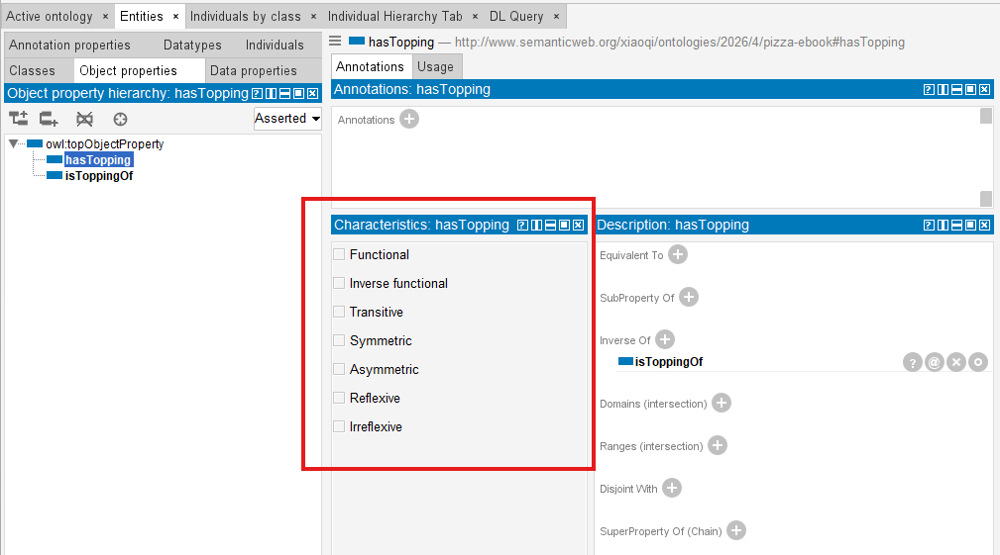
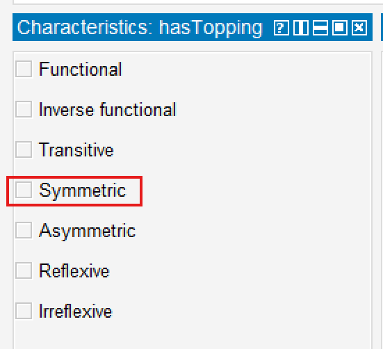

# Chapter 12 -- Governing Semantic Relationship Behavior Through Object Property Characteristics

- [Chapter Introduction](#chapter-introduction)
- [12.1 Why Relationship Behavior Matters](#121-why-relationship-behavior-matters)
- [12.2 Understanding Object Property Characteristics](#122-understanding-object-property-characteristics)
- [12.3 Functional Properties - Enforcing Semantic Uniqueness](#123-functional-properties---enforcing-semantic-uniqueness)
- [12.4 Inverse Functional Properties - Semantic Identity Through Relationshiops](#124-inverse-functional-properties---semantic-identity-through-relationshiops)
- [12.5 Symmetric Properties - Modeling Mutual Semantic Relationships](#125-symmetric-properties---modeling-mutual-semantic-relationships)
- [12.6 Asymmetric Properties -- Modeling Directional Dependency](#126-asymmetric-properties----modeling-directional-dependency)
- [12.7 Transitive Properties - Multi-Hop Semantic Intelligence](#127-transitive-properties---multi-hop-semantic-intelligence)
- [12.8 Reflexive / Irreflexive Properties](#128-reflexive--irreflexive-properties)
- [12.9 Summary on Object Property Characteristics](#129-summary-on-object-property-characteristics)
- [Demo Video for this Chapter](#demo-video-for-this-chapter)

## Chapter Introduction

In the previours two chapters (10 & 11), you gradually transitioned from building semantic relationships to strengthening their intelligence.

Chapter 10 introduced **Object Properties**, establishing meaningful semantic connections between concepts.

Chapter 11 extended this understanding through **Inverse Properties**, enabling bidirectional semantic navigation and improving ontology reasoning capabilities.

At this stage, you may naturally feel that ontology engineering is already sufficiently powerful. Concepts can be classified. Relationships can be defined. Bidirectional semantics can be inferred. However, a deeper question soon emerges:

> **Are all relationships supposed to behave in the same way?**

The answer, of course, is NO.

In real-world knowledge systems, relationships possess behavioral meaning. Some relationships are unique. Some are symmetric. Some are directional. Others propagate across multiple levels of dependency. These behaviors are not merely implementation details -- they fundamentally shape how semantic intelligence works.

Consider a few intuitive examples from everyday reasoning.

If:

> Alice isSiblingOf Bob

then we naturally expect:

> Bob isSiblingOf Alice.

However, if:

> Application-A dependesOn Database-B

we would not logically infer:

> Database-B dependsOn Application-A.

Similarly, if:

> Beijing locatedIn China

and:

> China locatedIn Asia,

we may reasonably infer:

> Beijing locatedIn Asia.

These examples demonstrate an important **semantic truth**:

> relationships are not simply connections -- they possess behavioral logic.

This is precisely where **Object Property Characteristics** become essential.

In OWL ontology engineering, property characteristics define:

> **how semantic relationships behave**.

They introduce semantic constraints, inference logic, and governance rules into ontology models, enabling reasoners to derive new knowledge more intelligently and consistently.

Within Michael DeBellis' `Pizza.owl` tutorial, although there's no specific exercise, you may still begin experimenting with the behavior of object properties inside Protégé and observing how ontology reasoners interpret those behaviors.

However, from the perspective of **Executable Knowledge Architecture (EKA)**, this chapter (12) also represents a significant conceptual milestone.

As introduced in Chapter 00, EKA formalizes executable knowledge through the tuple:

$\boxed{\large{EKA = ( K, R, \Theta, \Phi, \Gamma)}}$

Where:

- **$K$ - Knowledge Graph** represents semantic entities and relationships.
- **$R$ - Reasoning & Rules** governs inference logic.
- **$\Theta$ - Triggers** initiative execution events.
- **$\Phi$ - Execution Actions** perform operational responses.
- **$\Gamma$ - Governance** ensures semantic integrity and compliance

Object Property Characteristics primarily strengthen:

> $R$ (Reasoning & Rules)

and

> $\Gamma$ (Governance)

within EKA.

Without behavioral semantics, knowledge graphs remain **structurally connected** but **semantically shallow**. Reasoners lack the rules needed to infer meaningful outcomes, and governance mechanisms cannot validate whether knowledge behaves consistently.

Object Property Characteristics therefore represent an important transition:

from:

> **connected ontolgoy**

to:

> **governed semantic behavior.**

This distinction matters enormously.

Because intelligence does not emerge merely from connected information.

True semantic intelligence emerges when relationships behave according to:

> **formalized logical rules**.

This chapter explores these behaviors in depth and demonstrates how seemingly simple `Pizza.owl` examples reveal the foundations of enteprise-scale semantic intelligence.

## 12.1 Why Relationship Behavior Matters

Ontology beginners often focus heavily on:

> concepts.

- What classes exist?
- How are they categorized?
- How are they related?

Indeed, these are all important questions.

However, as ontology maturity increases, engineers begin recognizing another equally important concern:

> **How should relationships behave?**

Because semantic meaning does not arise solely from the existence of connections.

It emerges from:

> **the rules governing those connections.**

Imagine an ontology without relationship behavior.

Every relationship would simply behave as:

> a neutral edge.

Reasoners would know:

> something is connected.

But not:

> what that connection means logically.

This creates severe limitations.

Consider an enterprise architecture example.

Suppose ontology knows:

> PaymentSystem dependsOn AuthenticationService

and:

> AuthenticationService dependsOn CloudInfrastructure

Without additional semantic behavior, ontology cannot infra:

> PaymentSystem dependsOn CloudInfrastructure.

The knowledge exists - looks naturally by human.

But semantic propagation does not - from machine perspective.

Now imagine another example.

Suppose ontology contains:

> Customer managedBy AccountManager

Should ontology infer:

> AccountManager managedBy Customer?

Obviously NOT.

Yet without proper behavioral constraints, relationship meaning remains ambiguous.

This problem becomes even more serious at enterprise scale.

Model organizations can easily contain:

- thousands of applications
- hundreds of business capabilities
- complex dependency chains
- governance relationships
- operational interactions

Merely connecting information is not enough.

Organizations increasingly require:

> **semantic governance.**

Relationshipos must behave correctly.

Dependencies must remain directional.

Ownership must remain unique.

Inference must remain explainable.

This requirement aligns directly with the EKA vision.

Recall the formal EKA compoonent tuple:

$EKA = (K, R, \Theta, \Phi, \Gamma)$

Object properties introduced in earlier chapters primarily contributed toward:

> **$K$ = Knowledge Graph**

because they created semantic relationships between concepts.

However, Chapter 12 begins introducing something much deeper:

> **$R$ - Reasoning & Rules**

through semantic behavior.

Because relationships alone do not create intelligence.

Reasoning rules create intelligence.

At the same time, property characteristics contribute to:

> **$\Gamma$ - Governance**

because they enforce semantice correctness.

As examples:

A functional relationship may enforce uniqueness.

An asymmetric relationship may prevent illogical bidirectional inference.

A transitive relationship may formalize dependency propagation.

Ontology therefore begins evolving beyond:

> connected knowledge

toward:

> **governed semantic intelligence.**

This is one of the most important conceptual transitions in the entire `Pizza.owl` journey.

Because from this point onward, you begin seeing ontology less as:

> a modeling tool

and increasingly as:

> **an executable semantic system.**

## 12.2 Understanding Object Property Characteristics

An **Object Property Characteristic** defines:

> **how a relationship behaves semantically.**

This distinction is subtle but profoundly important.

An object property itself defines:

> **what connects**.

For example:

> `hasTopping`

connects

> `Pizza` $\rightarrow$ `PizzaTopping`

However, the property characteristic defines:

> **how that relationship behaves**.

- Should it be directional?
- Should it remain unique?
- Should it support inference?
- Should it propagate?
- Should it allow self-reference?

OWL provides a rich set of property characteristics for these purposes.

The most commonly used include:

- Functional
- Inverse Functional
- Transitive
- Sytmmetric
- Asymmetric
- Reflexive
- Inreflexive

Protégé provides you all of those characteristics modeling possibility, as below screen:

At first glance, these may appear like technical configuration options.

In reality, they represent:

> **formalized semantic logic**.

Ontology engineers are effectively encoding:

> rules of reality.

Consider the following analogy.

If ontology classes - either as subject or object - represent:

> nouns,

and object properties represent:

> verbs,

then property characteristics represent:

> **grammar and logic**.

Without grammar: language becomes ambiguous.

Without property characteristic (behavior): semantic systems become unreliable.

This is why ontology engineering differs fundamentally from traditional data modeling.

A database relationship often answers:

> what references what?

Ontology asks a much deeper question:

> **how should meaning behave?**

This shift is crucial!

Because EKA aims to transform knowledge into:

> **executable intelligence.**

Executable intelligence requires:

- inference
- constraints
- explainability
- semantic correctness

And all of these depend heavily upon:

> **behavior-aware relationships.**

Inside `Pizza.owl` tutorial's Chapter 4.8 (no specific exercise), you begin experiencing with these characteristics in a controlled environment.

Although pizza example appear simple, the semantic principles are foundational.

Because later, the same behaviors may govern:

- enterprise capabilities
- application systems
- business processes
- risks
- regulations
- digital twins
- AI knowledge systems

`Pizza.owl` is therefore best understood as:

> **a semantic laboratory.**

The deeper lesson is not really about pizza.

It is about learning:

> **how semantic knowledge behaves.**

## 12.3 Functional Properties - Enforcing Semantic Uniqueness

One of the most important object property characteristics is the:

> **Functional Property.**

A functional property means:

> an entity may possess only one value for a given relationship.

This sounds simple.

Yet, its implications are profound.

Consider a real-world example.

A person generally has:

> one biological mother.

If ontology defines:

> hasBiologicalMother

as functional, then the ontology reasoner understands:

> only one object should exist for this relationship.

If conflicting values appear, semantic inconsistency emerges.

Inside enterprise systems, functional properties become extremely valuable.

For example:

A business capability may have:

> **one** primary owner.

A system may have:

> **one** production classification.

A business service may have:

> **one** accountable organization.

Functional semantics therefore help ontology preserve:

> **uniqueness and integrity.**

From an EKA perspective, functional properties primarily strengthen:

> **$\Gamma$ - Governance**

because they formalize semantic constraints.

Governance inside EKA is not merely policy documentation.

It includes:

> semantic integrity enforcement.

Without governance, knowledge systems deteriorate.

- Duplicate ownership appears.
- Conflicting relationships emerge.
- Reasoning becomes unreliable.

Functional properties help prevent such problems.

They encode:

> **acceptable semantic truth.**

At the same time, functional semantics also support:

> **$R$ - Reasoning & Rules**

because reasoners may identify inconsistencies automatically.

Ontology therefore becomes more than a storage mechanism.

It evolves into:

> **a validation system.**

This represents a major philosophical shift.

Traditional systems often validate data manually.

Ontology allows machiens to validate:

> semantic meaning.

That distinction becomes foundational for executable intelligence.

## 12.4 Inverse Functional Properties - Semantic Identity Through Relationshiops

When functional properties constrain:

> one subject $\rightarrow$ one object,

**Inverse Functional Properties** reverse this logic.

They imply:

> one object uniquely identifies one subject.

Initially, this concept may feel abstract.

However, it becomes highly practical in real systems.

Consider below object property:

> hasPassportNumber

A passport number generally identifies:

> one unique person.

If two individuals share the same passport number: something is probably WRONG!

Ontology reasoners may therefore infer:

> these entities may actually be identical.

This becomes extraordinarily valuable for the cases of:

> identity resolution.

In enterprise environments, organizations constantly struggle with:

- duplicate systems
- duplicated customer records
- inconsistent capability definitions
- fragmented metadata

Multiple repositories may describe:

> the same thing differently.

Ontology helps reconcile these inconsistencies.

From the EKA perspective, inverse functional properties strengthen:

> **$R$ - Reasoning & Rules**

because they enable identity inference.

At the same time, they reinformce:

> **$\Gamma$ - Governance**

because semantic duplication threatens the quality of knowledge.

In future EKA implementations, such reasoning outcomes may also influence:

> **$\Theta$ - Triggers**

where semantic inconsistencies trigger validation workflows.

However, at this stage of the `Pizza.owl` journey, you should primarily understand:

> ontology is beginning to reason about **identity**.

Not merely relationships.

This distinction is powerful.

Because intelligent systems increasingly depend upon:

> **semantic consistency across distributed knowledge.**

And inverse functional properties help make that possible!

Later, when we explore the $\Theta$ layer, you'll see how these identity reasoning results can be used to automatically trigger data quality tickets.

## 12.5 Symmetric Properties - Modeling Mutual Semantic Relationships

Not all relationships in ontology are directional.

Some relationships naturally behave in a:

> **mutual or reciprocal manner.**

This is where **Symmetric Properties** become important.

A symmetric property means:

> if A is related to B, 
> then B is automatically related to A

The relationship works:

> in **both** directions, natively.

Consider a simple real-world example:

If:

> Alice isSiblingOf Bob

then it is natually true that:

> Bob isSiblingOf Alice

The semantic meaning itself implies reciprocity.

Similarly, if:

> CountryA borders CountryB

then it must be true that:

> CountryB borders CountryA.

Ontology engineers should not need to define both directions manually anymore.

Instead, OWL allows us to declare the relationship as:

> **symmetric.**

Once defined, ontology reasoners automatically infer the reverse relationship.

This greatly reduces modeling redundancy while improving semantic consistency.

Inside Protégé, you can configure a property as **symmetric** by selecting the relevant **Object Property** and enabling the **Symmetric** characteristic.

Although `Pizza.owl` itself uses relatively simple examples, the underlying semantic principle scales significantly into enterprise environments.

Consider an enterprise architecture scenario.

Suppose ontology defines:

> Application_A interoperatesWith Application_B

In many cases, interoperability is natually bidirectional.

If:

> CRM System interoperatesWith Billing Platform.

then:

> Billing Platform interoperatesWith CRM System

is equally valid.

This type of modeling becomes increasingly useful when organizations attempt to visualize:

- system integration landscape
- collaboration networks
- partner ecosystems
- capability interactions

Within the EKA formalization:

$\large{EKA = (K, R, \Theta, \Phi, \Gamma)}$

symmetric properties primarily strengthen:

> **$K$ - Knowledge Graph**

because they enrich graph connection.

Semantic edges becomes:

> automatically navigate in both directions.

This improves graph traversal, dependency exploration, and explainability.

At the same time, symmetric properties also support:

> **$R$ - Reasoning & Rules**

because ontology reasoners infer reciprocal relationships automatically.

Without explicit reasonsing support, organizations often maintain duplicte relationships manually.

Ontology eliminates this burden.

Semantic reciprocity becomes:

> machine inferable.

However, ontology engineers must apply symmetry **carefully**.

Not every relationship should be symmetric.

A common beginner mistake is assuming:

> connected means mutual.

In static diagramming world (e.g. Visio, draw.io, etc.), this is read from the picture; but in semantic world, this is dangerous.

For example:

If:

> Employee reportsTo Manager

it would be logically incorrect to infer:

> Manager reportsTo Employee.

Similarly:

> Customer purchases Product

does not imply:

> Product purchases Customer.

Furthermore, in financial industry this is more serious, like:

> Customer depositMoneyTo Bank_A

will be really "dangerous" to imply:

> Bank_A depositMoneyTo Customer.

Semantic meaning must always drive ontology design!

The rule is simple:

> Only use symmetric when reciprocity exists in REALITY.

Ontology should reflect:

> how the world actually behaves.

Not merely how data appears.

This principle becomes increasingly important as EKA evolves toward:

> **executable semantic intelligence.**

Because intelligence dependes upon:

> trustworth semantic assumptions.

## 12.6 Asymmetric Properties -- Modeling Directional Dependency

At first glance, Asymmetric might appear to be the logical opposite of Symmetric… However, this assumption is dangerously misleading.

Where symmetric properties model:

> reciprocity,

**Asymmetric Properties** model:

> **directionality**

An asymmetric property means:

> if A relates to B,

then:

> B **cannot** relate back to A

through the same relationship.

This characteristic becomes extraordinarity important in enterprise scale modeling because many organizational relationships are inherently directional.

> [!Note] In OWL 2, Asymmetric means the property cannot hold both ways. This is different from ‘antisymmetric’ in some mathematical contexts — we stick to OWL terminology here

In simply understanding, those "dangerous" samples we mentioned in above symmetric properties just now are the ones in asymmetric properties perspective.

Consider another straightforward example.

If:

> Alice isParentOf Bob

then:

> Bob isParentOf Alice

cannot be true simultaneously.

The relationship contains:

> semantic direction.

One more intuitive example:

If:

> Regulation governs BusinessProcess

then:

> BusinessProcess governs Regulation

would make no logical sense.

This asymmetry preserves:

> meaning integrity.

Inside enterprise architecture, asymmetric relationships are everywhere.

For example:

> Application dependsOn Platform

A plaform may host many applications.

But the platform itself does not:

> dependsOn Application

in the same semantic sense.

Similary:

> Capability realizedBy Application

does not imply:

> Application realizedBy Capability.

These directional dependencies are foundational for:

- impact analysis
- risk assessment
- modernization planning
- operational resilience
- architecture governance

Within EKA, asymmetric properties contribute strongly toward:

> **$R$ - Reasoning & Rules**

because reasoners must preserve directional logic during inference.

They also strengther:

> **$\Gamma$ - Governance**

because governance requires semantic correctness.

Directional violations often indicate:

> modeling problems.

For example:

Imagine a semantic dependency network where applications begin depending on themselves indirectly through **incorrect** bidirectional inference.

Very quickly:

> dependency intelligence becomes unreliable.

Asymmetric acts as a governance rule that explicitly blocks such invalid inferences, protecting the integrity of your knowledge graph.

Ontology engineers therefore use asymmetry to protect:

> semantic trustworthiness.

This matters enormously for EKA.

Because executable intelligence requires:

> reliable causal understanding.

To automate enterprise knowledge meaningfully, systems must understand:

> what depends upon what.

> what governs what.

> what enables what.

Asymmetric properties formalize these rules.

They tell semantic systems:

> direction matters.

And in enterprise architecture:

> direction almost always matters!

**Common Mistake**: Forgetting to declare `dependsOn` as Asymmetric.

**Consequence**: A reasoner may infer circular dependencies, leading to incorrect impact analysis or infinite loops in downstream systems.

Before moving forward, let's compare `Symmetric` and `Asymmetric` property characteristics in below table:

| Dimension | Symmetric Property | Asymmetric Property |
| --- | --- | --- |
| **Logical meaning** | If $P(x,y)$ holds,then $P(y,x) **must also hold** | If $P(x,y)$ holds, then $P(y,x)$ **must NOT hold** |
| **Inference effct** | ✅ Reasoner automatically adds the inverse relationship | ❌ Reasoner explicitly blocks the inverse inference |
| **Default behavior** | Without declaration, no inference is made | Without declaration, the inverse may be **neither inferred nor prohibited** (danger zone!) |
| **Typical example** | `isFriend` (friendshipe is mutual) | `dependsOn` (dependency is directional) |
| **EKA contribution** | Strengthens $R$ (Reasoning & Rules) by enabling bidirectional inference | Strengthens $\Gamma$ (Governance) by enforcing directional constraints |

## 12.7 Transitive Properties - Multi-Hop Semantic Intelligence

Among all object property characteristics, perhaps none demonstrates the power of OWL reasoning more dramatically than:

> **Transitive Properties.**

Transitivity allows ontology reasoners to infer:

> indirect semantic relationships.

A transitive relationship means (when declaring `relates` is transitive):

If:

> A relates to B

and:

> B relates to C

then ontology may infer:

> A relates to C.

This may appear mathematically simple.

But semantically:

> it is transformative!

Consider geography:

If:

> Beijing locatedIn China

and:

> China locatedIn Asia

then ontology may infer:

> Beijing locatedIn Asia.

Another example:

If:

> Employee reportsTo Manager

and:

> Manager reportsTo Director

then ontology may infer:

> Employee (indirectly) reportsTo Director.

Humans natually reason this way.

Ontology reasoners can learn to do the same.

Now consider enterprise architecture.

Support ontology knows:

> Payment_Capability realizedBy Payment_Appliction

and:

> Payment_Appliction hostedOn Cloud_Platform

Through semantic dependency chains, ontology may infer:

> Payment_Capability indirectly dependsOn Cloud_Platform

Suddenly, ontology becomes capable of:

> multi-hop reasoning.

This changes everything!

Because enterprise complexity rarely exists in isolated relationships.

Organizations operate through:

> chains of dependency.

- Business capabilities rely on applications.
- Applications rely on infrastructure.
- Infrastructure relies on partners.
- Partners rely on contractual obligations.

Without transitive reasoning: knowledge remains fragmented.

With transitive reasoning: knowledge becomes **connected intelligence**.

In OWL, properties are NOT transitive by default. You must explicitly declare `Transitive`.

Within EKA:

$\large{EKA = (K, R, \Theta, \Phi, \Gamma)}$

transitive properties primarily strengthen:

> $R$ - Reasoning & Rules

because inference propagation becomes possible.

Reasoners derive:

> previously unstated knowledge.

This is a defining characteristic of:

> executable semantic systems.

At the same time, transitivity strengthens:

> $K$ - Knowledge Graph

because semantic paths becomes traversable across multiple levels.

Knowledge Graphs become significantly more useful when organizations ask:

> What indirectly depends on this system?

> Which capabilities are impacted by this partner?

> What downstream services are affected?

Ontology reasoners help answers these questions automatically.

This capability becomes foundational for:

- architecture intelligence
- risk propagation
- impact assessment
- dependency management
- transformation planning

And eventually:

> **executable enteprise knowledge intelligence.**

However, transitivity should be appled carefully.

Not all relationships behave transiviely.

For example:

If:

> Person likes Food

and:

> Food contains Ingredient

we should NOT infer:

> Person likes Ingredient.

Ontology engineers must therefore ensure:

> transitivity reflects **real** semantic behavior.

Again:

> ontology models **reality**.

Not convenience.

However, transitivity is powerful — but power without control leads to over-inference, ontology engineers should prevent following two common traps:

- Pitfall 1: Forgetting to declare a Transitive will prevent the reasoner inferencing from automatically completing the chain.

- Pitfall 2: Overusing Transitives (such as declaring them on `dependsOn`) can lead to explosive inference results and incorrect architectural conclusions.

In brief, comparing trasitive vs. non-transitive:

| Deminsion | Transitive Property | Non-Transtive Property |
| --- | --- | --- |
| **Inference Effect** | Automatically completes multi-hop chains | Exists only in directly declared relationships |
| **Typical Example** | `locatedIn`, `subPartOf` | `dependsOn`, `reportsTo` |
| **Engineering Risk** | Over-inference | Under-inference |
| **EKA contribution** | Strengthens $R$, but need coordination with $R$ | Requires explicit modeling of multi-hop relationships |

In later chapters on the $\Theta$ (Triggers) layer, you’ll see how transitive inference can automatically propagate impact analysis across multi-level system dependencies — for example, if a database fails, all upstream services that transitively depend on it can be notified.

## 12.8 Reflexive / Irreflexive Properties

## 12.9 Summary on Object Property Characteristics

## Demo Video for this Chapter

Chapter 12 -  Object Properties Characteristics - Demo Video:

- YouTube: https://youtu.be/bYx0LPxXAk8
- BiliBili (B站): https://www.bilibili.com/video/BV1W84y1Q7io
- Douyin (抖音): https://www.douyin.com/video/7298171462131666202

---

Last updated at: 2026/06/02