# Chapter 13 - Governing Semantic Boundaries with Property Domain and Range

- [Chapter Introduction](#chapter-introduction)
- [13.1 Why Relationship Boundaries Matter](#131-why-relationship-boundaries-matter)
- [13.2 Understanding Property Domain and Range](#132-understanding-property-domain-and-range)
- [13.3 Domain - Defining Valid Relationship Sources](#133-domain---defining-valid-relationship-sources)
- [13.4 Range - Defining Valide Relationships Targets](#134-range---defining-valide-relationships-targets)
- [13.5 Configuring Domain and Range in Protégé](#135-configuring-domain-and-range-in-protégé)
  - [13.5.1 Basic (Single) Domain and Range](#1351-basic-single-domain-and-range)
  - [13.5.2 Multi-Domain and Multi-Range Configurations](#1352-multi-domain-and-multi-range-configurations)
  - [13.5.3 Looking Domain/Range Configuration from EKA](#1353-looking-domainrange-configuration-from-eka)
- [13.6 Semantic Inference Through Domain and Range](#136-semantic-inference-through-domain-and-range)
- [13.7 Practical Modeling in `Pizza.owl` - Applying Domain and Range to Inverse Properties](#137-practical-modeling-in-pizzaowl---applying-domain-and-range-to-inverse-properties)
  - [13.7.1 Revisiting Inverse Properties](#1371-revisiting-inverse-properties)
  - [13.7.2 Applying Domain and Range to `hasTopping`](#1372-applying-domain-and-range-to-hastopping)
  - [13.7.3 Understanding Semantic Reversal Through `isToppingOf`](#1373-understanding-semantic-reversal-through-istoppingof)
  - [13.7.4 Connecting Domain, Range, and Property Characteristics](#1374-connecting-domain-range-and-property-characteristics)
  - [13.7.5 Observing Reasoning Behavior in Protégé](#1375-observing-reasoning-behavior-in-protégé)
  - [13.7.6 Why This Matters Beyong `Pizza.owl`](#1376-why-this-matters-beyong-pizzaowl)
- [13.8 EKA Tuple Mapping -- Domain and Range in Executable Knowledge Architecture](#138-eka-tuple-mapping----domain-and-range-in-executable-knowledge-architecture)
  - [13.8.1 $K$ - Knowledge Graph](#1381-k---knowledge-graph)
  - [13.8.2 $R$ - Reasoning \& Rules](#1382-r---reasoning--rules)
  - [13.8.3 $\\Theta$ - Triggers *(Future EKA Perspective)*](#1383-theta---triggers-future-eka-perspective)
  - [12.8.4 $\\Phi$ - Actions *(Future EKA Perspective)*](#1284-phi---actions-future-eka-perspective)
  - [13.8.5 $\\Gamma$ - Governance](#1385-gamma---governance)
- [13.9 Knowledge Graph Implications -- Why Semantic Boundaries Matter](#139-knowledge-graph-implications----why-semantic-boundaries-matter)
- [13.10 Governance and Semantic Integrity](#1310-governance-and-semantic-integrity)
- [13.11 Common Modeling Mistakes in Domain and Range](#1311-common-modeling-mistakes-in-domain-and-range)
  - [13.11.1 Overly Broad Domain Definitions](#13111-overly-broad-domain-definitions)
  - [13.11.2 Missing Range Definitions](#13112-missing-range-definitions)
  - [13.11.3 Misunderstanding Multi-Domain and Multi-Range Logic](#13113-misunderstanding-multi-domain-and-multi-range-logic)
  - [13.11.4 Ignoring Inverse Property Alignment](#13114-ignoring-inverse-property-alignment)
  - [13.11.5 Treating Domain and Range Like Database Constraints](#13115-treating-domain-and-range-like-database-constraints)
  - [13.11.6 Over-Engineering Semantic Restrictions](#13116-over-engineering-semantic-restrictions)
- [13.12 Chapter Summary](#1312-chapter-summary)
- [13.13 Key Concepts](#1313-key-concepts)
- [13.14 Protégé Skills Learned](#1314-protégé-skills-learned)
- [13.15 Next Chapter Preview](#1315-next-chapter-preview)
- [13.16 Reference](#1316-reference)

## Chapter Introduction

In the previous chapter, you explored **Object Property Characteristics**, discovering that semantic relationships are not merely connections between concepts but possess behavioral meaning. Some relationships are reciprocal, some directional, some unique, and others capable of semantic propagation through inference.

Chapter (12) therefore introduced an important question:

> **How should relationships behave?**

Chapter (13) now introductes another equally important question:

> **Where should relationships be allowed to exist?**

This distinction is subtle, yet profoundly important.

Because in ontology engineering, semantic correctness depend depends not only upon:

> relationship behavior,

but also:

> **relationship boundaries.**

Consider a simple real-world example from `Pizza.owl`.

Suppose we define a relationship:

> `hasTopping`

Intuitively, we understand that:

> pizzas have toppings.

However, should:

> pizza toppings have toppings?

Should:

> restaurants have toppings?

Should:

> customers have toppings?

Clearly, semantic meaning imposes constraints.

Relationships are not universaly applicable.

They belong within:

> **specific semantic contexts.**

This is precisely where:

> **Property Domain and Range**

become essential!

In OWL ontology engineering:

> **Domain** defines where a relationship originates. (*Source*)

and:

> **Range** defines what kind of thing the relationship may point toward. (*Target* or *Destination*)

Together, they establish:

> **semantic boundaries.**

Without these boundaries, ontology relationships become ambiguous.

- Reasoners lose semantic precision.
- Konwledge quality deteriorates.
- Inference becomes unreliable.

At enterprise scale, such ambiguity becomes extremely costly.

Image an enterprise ontology where:

> Applications own Business Capabilities

and

> Capabilities host Infrastructure

due to poorly governed semantic relationships.

Very quickly:

> semantic chaos emerges.

Ontology engineers therefore rely on Domain and Range to preserve:

> logical consistency.

Within our `Pizza.owl` tutorial, this chapter aligns with the video on:

> **Property Domain and Range**

where you begin configuring these semantic restrictions directly in Protégé.

However, from the perspective of **Executable Knowledge Architecture (EKA)**, this chapter introduces something even deeper.

Recall the formal EKA tuple:

$\large{EKA = (K, R, \Theta, \Phi, \Gamma)}$

Property Domain and Range contribute most strongly toward:

> **$\Gamma$ - Governance**

because they define semantic validity rules.

They also strengthen:

> **$R$ - Reasoning & Rules**

because reasoners use Domain and Range information to infer class membership automatically.

Earlier chapters focused heavily on:

> semantic connectivity.

This chapter introduces:

> **semantic boundaries.**

And boundaries matter.

Because intelligent systems require not only rich knowledge, but also:

> **trustworthy knowledge.**

This chapter therefore represents another maturity step in the `Pizza.owl` learning journey:

from:

> **behavior-aware ontology**

toward:

> **boundary-governed ontology.**

As you progress deeper into semantic engineering, these concepts become foundational for building:

- knowledge graphs
- enterprise ontologies
- semantic governance models
- executable architecture systems
- AI-ready knowledge structures

The deeper lesson of Chapter (13) is therefore not simply learn:

> how to configure Domain and Range in Protégé.

It is learning:

> **how ontology constrains meaning through semantic boundaries**

## 13.1 Why Relationship Boundaries Matter

Ontology beginners often focus on:

> relationship creation.

If one concept should connect to another, an object property is created.

This feels intuitive.

After all, knowledge appears to be:

> about connectivity.

However, professional ontology engineering quickly introduces another concern:

> **relationship validity.**

Because merely connecting concepts is not enough.

Relationships must connect:

> **the right kind of concepts.**

Otherwise, semantic meaning becomes corrupted.

Consider a simple analogy.

In natural English language, verbs imply restrictions.

For example:

> a person eats food.

This sentence feels semantically correct.

But:

> a building eats music

feels nonsensical.

Why?

Because semantic expectations exist.

Certain concepts logically participate in relationships.

Others do not.

Ontology formalizes this intuition through:

> **Domain and Range.**

`Domain` answers:

> **Who or what may use this relationship?**

`Range` answers:

> **What kind of thing may this relationship point to?**

These boundaries help ontology preserve:

> meaning integrity.

Without semantic boundaries, ontology relationships become dangerously flexible.

Consider an enterprise example.

Suppose an ontology contains one relationship:

> `owns`

Should:

> Employee owns Application

be allowed?

Perhaps, it we're talking "Application ownership assignment".

But should:

> Database owns Regulation

be valid?

Probably not!

Without semantic restrictions:

> invalide knowledge spreads.

This problem becomes increasingly serious in enterprise-scale semantic systems.

Organizations may model:

- business capabilities
- processes
- regulations
- applications
- infrastructure
- vendors
- risks

Thousands of concepts become interconnected.

Without semantic boundaries:

> modeling inconsistency grows easily and rapidly.

Evantually, ontology loses trustworthiness.

This challenge directly relates to:

> **$\Gamma$ - Governance**

inside EKA.

Because governance is not merely about documentation.

It is about:

> protecting semantic correctness.

Property Domain and Range help ontology engineers answer:

> What relationships are semantically valid?

This dramatically improves the quality of ontology.

At the same time, Domain and Range strengthen:

> **$R$ - Reasoning & Rules**

because ontology reasoners can infer class membership automatically.

For example in `Pizza.owl` tutorial:

If ontology defines:

> `hasTopping`

Domain:

> `Pizza`

Range:

> `PizzaTopping`

As below screen in Portégé:

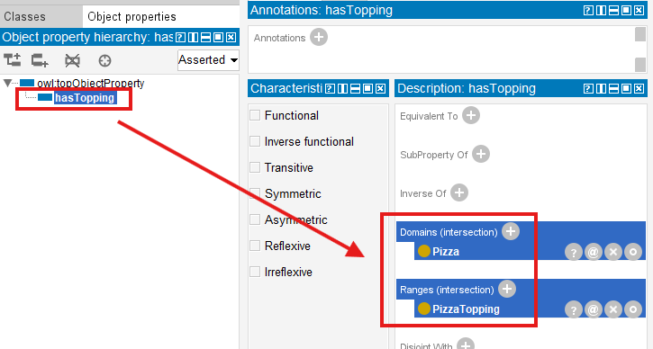

Then if ontology later encounters:

> MySpecialPizza `hasTopping` MushroomTopping

the reasoner may infer:

> MySpecialPizza is a `Pizza`.

And:

> MushroomTopping is a `PizzaTopping`.

Notice what happened.

Knowledge emerged:

> without manual assertion.

This represents another important milestone!

Ontology is no longer merely:

> representing meaning.

It is now beginning to:

> **discover meaning. (new knowledge)**

## 13.2 Understanding Property Domain and Range

To understand Domain and Range deeply, you should think of object properties as:

> semantic bridges.

Every bridge over a river has:

> a starting point (source)

and:

> a destination (target).

In ontology:

> Domain = starting side

and:

> Range = destination side

The Domain specifies:

> which class may logically initiate the relationship.

The Range specifies:

> which class may logically receive the relationship.

Consider again the `Pizza.owl` example:

> `hasTopping`

This relationship connects:

> `Pizza` $\rightarrow$ `PizzaTopping`

Therefore:

| Domain | Range |
| --- | --- |
| `Pizza` | `PizzaTopping` |

Semantically, this means:

> only pizzas should possess toppings.

and:

> toppings should be the valid target of the relationship.

This seems obvious.

But ontology engineering benifits greatly from formalizing:

> obvious meaning.

Because machines DO NOT naturally understand human assumptions.

They require:

> explicit semantic rules.

This is one reason ontology engineering differs fundamentally from traditional databases.

In databases, relationships often exist through:

> foreign keys.

But foreign keys typically say only:

> something references something.

Ontology asks a deeper question:

> **Should this relationship exist semantically?**

And:

> **What meaning does this relationship imply?**

This distinction becomes especially powerful once reasoning enters the picture.

Domain and Range are not merely:

> restrictions.

They also support:

> **inference.**

This surprises many ontology beginners.

Because they initially assume Domain and Range simply act like validation rules.

(Luckily you're not beginner already after previous practices!)

In reality:

> ontology reasoners actively use them.

Suppose ontology contains:

> MyPizza hasTopping CheeseTopping

Even if:

> MyPizza

has never been explicitly classified as:

> `Pizza`,

the reasoner may infer it automatically.

Why?

Because:

> only `Pizza` (class, Domain) should participate in `hasTopping` (object property).

Similarly:

> `CheeseTopping`

may become inferable as:

> `PizzaTopping`.

Thus:

> Domain and Range contribute to ontology intelligence.

Within EKA tuple:

$\large{EKA = (K, R, \Theta, \Phi, \Gamma)}$

this primarily strengthens:

> **$R$ - Reasoning & Rules**

while simultaneously improving:

> **$\Gamma$ - Governance**

through semantic constraint enforcement.

Ontology therefore becomes:

> smarter

and

> safer.

This balance matters enormously.

Because intelligence without governance becomes:

> unreliable intelligence.

And governance without reasoning becomes:

> rigid knowledge.

Domain and Range help maintain both.

## 13.3 Domain - Defining Valid Relationship Sources

The **Domain** of a property defines:

> **where a relationship is allowed to begin.**

In simpler language:

> What type of thing may logically use this property?

Let us revisit the `Pizza.owl` example:

> hasTopping

The Domain is:

> `Pizza`

This means:

> pizzas may have toppings.

Ontology therefore expects:

> the source entity belongs to Piza.

If ontology encounters:

> Restaurant `hasTopping` Mushroom

the reasoner may conclude:

> Restaurant is a `Pizza`.

Clearly:

> something "feels" wrong.

This illustrates an important lesson:

> reasoners trust semantic rules.

They do not understand human intention.

They only interpret:

> logical definitions.

Therefore, poorly designed domains often produce:

> unintended inference.

Professional ontology engineering therefore requires careful semantic thinking.

Always ask:

> Who should legitimately use this relationship?

Inside enterprise architecture, domain modeling becomes highly important.

Consider the relationship:

> `supportedBy`

Should:

> Capability supportedBy Application

be valid?

Likely yes.

But should:

> Regulation supportedBy Server

be acceptable (making sense)?

Probably not!

Domain definitions help ontology maintain:

> semantic discipline.

From an EKA perspective:

Domain modeling strengthens:

> **$\Gamma$ - Governance**

because semantic misuse becomes easier to detect.

It also supports:

> **$R$ - Reasoning & Rules**

because class membership inference improves.

This transforms ontology into something more than:

> connected concepts.

Ontology now becomes:

> **semantically governed knowledge.**

## 13.4 Range - Defining Valide Relationships Targets

If Domain defines:

> **where a relationship begins,**

then:

Range defines:

> **where a relationship is allowed to end.**

In simpler language:

> What type of thing (rdf:type) should logically receive this relationship?

Returning again to our `Pizza.owl` ontology, consider the familiar object property:

> `hasTopping`

Earlier, we learned that the Domain for this property is:

> `Pizza`.

However, relationships require two sides (ends).

Ontology must also understand:

> what kind of thing (rdf:type) counts as a valid topping.

This is where:

> **Range**

becomes essential.

In `Pizza.owl`, the Range of:

> `hasTopping`

is typically defined as:

> `PizzaTopping`.

This means:

> pizzas may point to pizza toppings.

The semantic expectation becomes clear.

A pizza should not suddenly point toward:

> a restaurant

or:

> a country

or:

> an employee.

Instead, ontology explicitly communicates:

> toppings belong to the `PizzaTopping` category.

This may initially feel restrictive.

However, semantic precision is precisely what makes ontology valuable!

Because knowledge without boundaries quickly beocmes:

> ambiguous knowledge.

And ambiguous knowledge often produces:

> unreliable intelligence.

To illustrate this further, imagine an enterprise architecture scenario.

Suppose an ontology contains:

> `hostedOn`

The relationship may describe:

> Application `hostedOn` Infrastructure

In this case:

| Domain | Range |
| --- | --- |
| Application | Infrastructure |

Semantically, this means:

> applications may be hosted on infrastructure.

However, ontology simulteneously prevents semantically questionable assertions such as:

> Partner `hostedOn` Value_Stream

or:

> Business_Capability `hostedOn` Employee (Business_Actor)

These examples appear obviously INCORRECT to humans.

But semantic systems require:

> explicit instruction.

Ontology engineers therefore formalize:

> meaning constraints.

This becomes increasingly important when enterprise ontologies scale.

As semantic ecosystems grow larger, involving:

- objectives
- capabilities
- applications
- risks
- processes
- technologies
- implementations
- vendors
- regulations
- infrastructure

relationship quality becomes harder to maintain.

Without Range definition:

> semantic inconsistency spreads quickly.

Range therefore acts as:

> a semantic quality boundary.

Within EKA, Range contributes strongly toward:

> **$\Gamma$ - Governance**

because it improves ontology trustworthiness.

At the same time, Range also strengthens:

> **$R$ - Reasoning & Rules**

because ontology reasoners use range information to infer semantic types automatically.

Suppose ontology encounters:

> SpecialPizza `hasTopping` Pepperoni

Even if:

> Pepperoni

has not been manually classified as:

> `PizzaTopping`

the ontology reasoner may infer this classification automatically.

Why?

Because:

> the Range of `hasTopping` defines what valid targets should be.

Let's see the quick example how inference learn from Range setting:

I have one `SpecialPizza` under `Pizza > NamedPizza`, and **wronging** create `Pepperoni` directly under `Pizza`.

From `SpecialPizza`, we create the object property `hasTopping` to `Pepperoni`, looks normal:

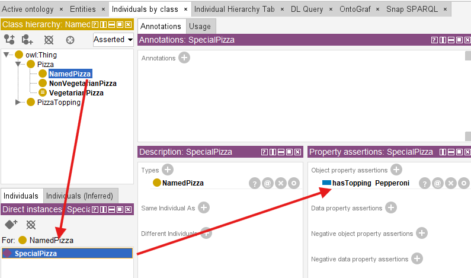

After synchronizing reasoner, there's no error, however, since we have Domain/Range configured for `hasTopping` property, when you switch to `Pepperoni` instance, see below:

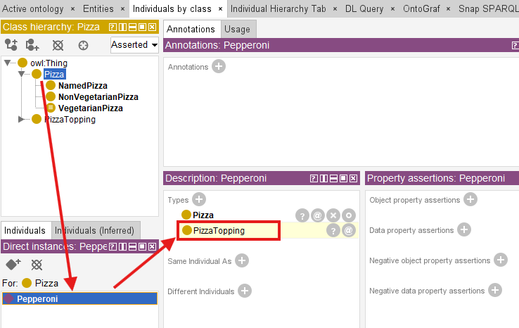

Although I *wrongly* put `Pepperoni` as a type of `Pizza`, now ontology semantically infer the new knowledge that `Pepperoni` is a type of `PizzaTopping`.

> When you see this, it's time to think about your ontology definition and to correct / modify that.

This introduces an important realization:

> Domain and Range are not merely **restrictions**.

They are also:

> **semantic inference mechanisms.**

Ontology therefore becomes increasingly intelligent.

Knowledge begines organizing itself.

Reasoners begin identifying meaning.

And semantic structures become:

> more explainable.

This is one of ontology engineering's greatest strengths.

## 13.5 Configuring Domain and Range in Protégé

### 13.5.1 Basic (Single) Domain and Range

After understanding the theory behind Domain and Range, you are now ready to configure these semantic constraints directly inside **Protégé**.

This chapter aligns closely with the `Pizza.owl` demonstration video, where Domain and Range are introduced through practical ontology editing (Exercise 11).

Inside Protégé, navigate to:

> **Object Properties**

and select an existing property such as:

> `hasTopping`

On the right-side property editing panel, you will observe dedicated sections labeled: **Domain** and **Range**.

These sections allow ontology engineers to define:

> semantic boundaries.

For example:

| Domain | Range |
| --- | --- |
| `Pizza` | `PizzaTopping` |

The screen has been shown earlier already:

.

Once configured, Protégé immediately incorporates these semantic rules into the ontology model.

At this stage, you may initially preceive Domain and Range as merely:

> metadata configuration.

However, they are considerably more pwoerful than that.

Because once the ontology reasoner is activated:

> these semantic rules become operational.

The ontology now begins:

> interpreting meaning.

### 13.5.2 Multi-Domain and Multi-Range Configurations

As you become more confortable with ontology engineering, an important question naturally emerges:

> Can an object property have more than one Domain or Range?

The answer is:

> **Yes.**

OWL allows ontology engineers to define:

> multiple Domains

and

> multiple Ranges

for a single property.

At first glance, this flexibility appears highly useful.

After all, real-world enterprise relationships are rarely simple.

However, you should approach this capability carefully because:

> semantic flexibility often introduces semantic complexity.

Let us first understand how this works.

Suppose an enterprise ontology contains a property:

> `ownedBy`

An organization may wish to express:

> Application `ownedBy` Team

while also supporting:

> Business_Capability `ownedBy` Team

We have common object is pointed by different subject, in such a case, ontology engineers may configure:

| Multi-Domain | Range |
| --- | --- |
| <li>Application</li><li>Business_Capability</li> | Team |

This configuration communicates:

> both Applications and Business Capabilities may participate in the `ownedBy` relationship.

Similary, a property may support:

> multiple Ranges.

Consider:

> `realizedBy`

An enterprise may wish to model:

> Business_Capability `realizedBy` Business_Process

while also allowing (shortcut for earlier phase of building up repository):

> Business_Capability `realizedBy` Application

In such case:

| Domain | Multi-Range |
| --- | --- |
| Business_Capability | <li>Business_Process</li><li>Application</li> |

Semantically, this communicates:

> a capability may be realized by either a process or an application.

From a practical modeling perspective, this can be extremely useful.

Enterprise knowledge is often:

> heterogeneous.

Relationships frequently span multiple semantic contexts.

Instead of creating separate proerties such as:

> `realizedByBusinessProcess`

and:

> `realizedByApplication`

ontology engineers may reuse a single semantic relationship.

This improves:

> ontology maintainability

as well as:

> semantic consistency.

However, there is an important semantic consideration you must understand.

In OWL, multiple Domain or multiple Range definitions may introduce:

> **intersection semantics.**

This surprises many ontology beginners.

Suppose a property declares multiple Domains:

- `Pizza`
- `Restaurant`

Ontology reasoners may interpret this as:

> only entities that are both Pizza **and** Restaurant

may validly participate in the relationship.

Clearly:

> this may produce unexpected inference.

Similarly, multiple Ranges may create stricter semantic behavior than originally intended.

Ontology engineers often expect:

> either/or meaning.

But OWL frequently reasons using:

> logical intersection.

This introduces an important lesson in ontology engineering:

> reasoners follow logic, not intention.

Semantic meaning must therefore be modeled precisely.

Within enterprise ontology, careless use of multi-Domain and multi-Range modeling may introduce:

- unintended class inference
- semantic ambiguity
- governance complexity
- difficult-to-explain reasoning outcomes

This becomes especially important in:

> enterprise-scale semantic systems

where ontology quality directly influences:

> knowledge graph reliability.

### 13.5.3 Looking Domain/Range Configuration from EKA

From the perspective of:

$\large{EKA = (K, R, \Theta, \Phi, \Gamma)}$

overly flexible semantic boundaries may weaken:

> **$Gamma$ - Governance**

because semantic correctness becomes harder to validate.

It may also complicate:

> **$R$ - Reasoning & Rules**

because reasoning outcomes become increasingly difficult to predict and explain.

For this reason, a useful practical recommendation for ontology beginners is:

> **start simple before becoming flexible!**

Begin with single Domain and single Range definitions whenever possible.

Only introduce multi-Domain or multi-Range when clear semantic meaning genuinely requires it.

A good ontology engineering principle is:

> **semantic simplicity before semantic flexibility.**

This keeps ontology:

- easier to undertand,
- easier to govern, and
- easier to resson about.

As ontology maturity grows, multi-domain/multi-range modeling becomes increasingly valuable for representing:

> real-world enterprise complexity.

Returning to the `Pizza.owl` tutorial, you may notice that `Pizza.owl` intentionally uses:

> relatively precise semantic boundaries.

This design choice is deliberate.

The tutorial aims to help you first understand:

> semantic correctness

before introducing:

> semantic flexibility.

Once you master foundational concepts, more advanced modeling strategies become easier to apply responsibly.

For example, support an individual exists:

> MyDinner

and ontology contains the statement:

> MyDinner `hasTopping` MozzarellaTopping

Even if:

> MyDinner

has never been manually asserted as:

> `Pizza`,

the reasoner may infer:

> MyDinner `rdf:type` Pizza.

Similarly:

> MozzarellaTopping

may automatically become inferable as:

> `PizzaTopping`.

This moment is particularly important for you.

Because ontology suddenly demonstrates something databases rarely achieve naturally:

> **semantic type discovery.**

Traditional systems often require explicit classification.

Ontology reasoners can infer classification based upon:

> relationship behavior.

This is a major milestone in semantic engineering.

Because ontology transitions from:

> manually structured knowledge

toward:

> **self-organizing semantic intelligence.**

Within the EKA perspective:

$\large{EKA = (K, R, \Theta, \Phi, \Gamma)}$

Protégé configuration of Domain and Range primarily strengthens:

> **$R$ - Reasoning & Rules**

because semantic logic now influences inference behavior.

However, it also reinforces:

> **$\Gamma$ - Governance**

because semantic misuse becomes more visible.

Poorly defined relationships quickly reveal themselves through:

> unintended inference.

Ontology therefore teaches an important engineering lesson:

> semantic precision matters.

## 13.6 Semantic Inference Through Domain and Range

One of the most powerful yet often overlooked aspects of Domain and Range is their ability to support:

> **automatic semantic inference.**

Many beginners initially assume:

> Domain and Range only validate relationships.

In reality:

> ontology reasoners actively use them to discover meaning.

This fundamentally changes how knowledge behaves.

Consider again our `Pizza.owl` example:

> MyCustomPiza `hasTopping` OliveTopping

Support neither `MyCustomPizza` nor `OliveTopping` has explicit class definitions.

In Protégé, technically, you may put them as instance of a dummy class e.g. `NoClassDefined`, as below:

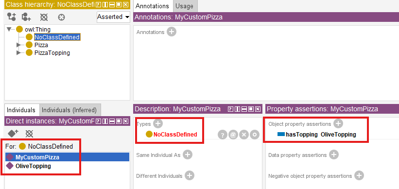

Then if ontology defines:

| Domain | Range |
| --- | --- |
| `Pizza` | `PizzaTopping` |

then a reasoner may infer: 

> `MyCustomPizza` is a `Pizza`

and

> `OliveTopping` is a `PizzaTopping`.

While, notice here we use "**may**", in actual sample, the subject is not inferred, but semantically it's already good enough for now.

- Subject is not Inferred:
  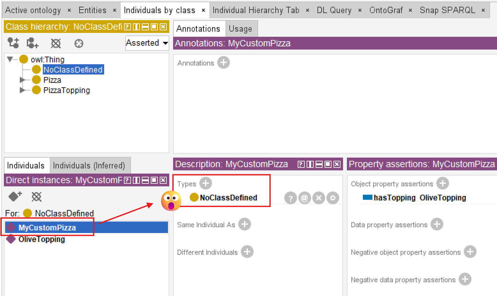
- Object is Inferred:
  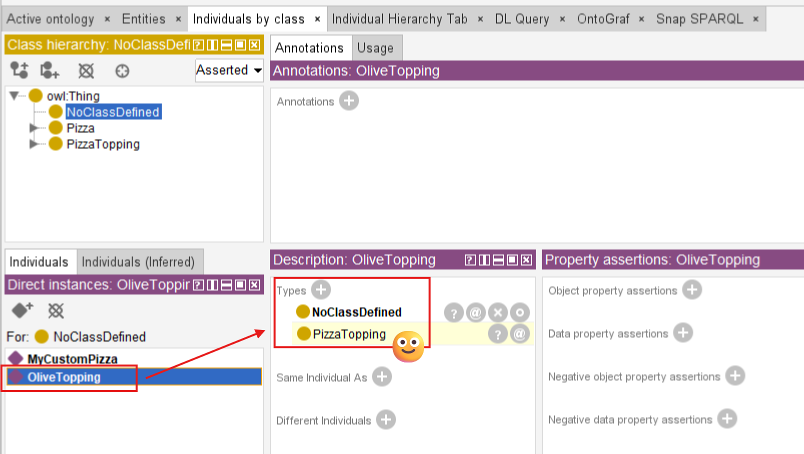

This appears simple.

Yet conceptually:

> it is revolutionary.

Because semantic classification emerges:

> automatically.

Ontology no longer depends solely on manual labeling.

Instead:

> meaning becomes inferable.

This capability becomes enormously important within enterprise environments.

Imagine an enterprise ontology describing:

> CRM_Application `hostedOn` Cloud_Platform

If:

| Domain | Range |
| --- | --- |
| Application | Infrastructure |

then ontology may infer:

> CRM_Application is an (`rdf:type`) Application

and

> Cloud_Platform is (`rdf:type`) Infrastructure.

At enterprise scale, where organizations manage:

> thousands or millions of entities,

automatic inference dramatically reduces:

> modeling effort.

More importantly:

> it improves consistency.

Humans frequently forget classification.

Ontology reasoners DO NOT.

This makes semantic systems significantly more resilient than traditional documentation approaches.

Within EKA tuple:

$\large{EKA = (K, R, \Theta, \Phi, \Gamma)}$

semantic inference through Domain and Range strongly enhances:

> **$R$ - Reasoning & Rules**

because knowledge expands automatically.

It also improves:

> **$K$ - Knowledge Graph**

because inferred classifications enrich graph meaning.

Knowledge graphs become increasingly valuable when semantic meaning is not only stored -- but:

> **inferred dynamically.**

This creates an important bridge between:

> ontology

and

> executable knowledge systems.

Because intelligence emerges not merely from data availability -- but from:

> **machine-understandable semantics.**

This is precisely why ontology remains foundational to the long-term vision of EKA:

> transforming enterprise architecture into executable intelligence.

## 13.7 Practical Modeling in `Pizza.owl` - Applying Domain and Range to Inverse Properties

At this stage of the ontology learning journey, you may naturally begin asking an important question:

> What happens when Domain and Range are applied to inverse properties?

This question becomes particularly important because the `Pizza.owl` tutorial does not introduce Domain and Range in isolation.

Instead, within **Exercise 11**, Michael demonstrates these semantic boundaries using:

> **an inverse property pair.**

This is highly meaningful from an ontology engineering perspective.

Because learners are no longer simply defining:

> semantic relationships.

They are now beginning to understand how:

> multiple semantic mechanisms work together.

This chapter therefore acts as a convergence point among:

- **Chapter 11: Inverse Properties**
- **Chapter 12: Object Property Characteristics**
- **Chapter 13: Domain and Range**

Ontology engineering now starts becoming:

> interconnected semantic modeling.

### 13.7.1 Revisiting Inverse Properties

In Chapter (11), you explored:

> **inverse properties**

through familiar `Pizza.owl` examples such as:

> `hasTopping`

and:

> `isToppingOf`

These two properties represent:

> opposite semantic directions.

If:

> Pizza `hasTopping` MushroomTopping

then ontology can infer:

> MushroomTopping `isToppingOf` Pizza

This helped you understand:

> semantic bidirectionality.

However, in Exercise 11, Michael extends this idea further.

The ontology now introduces **Domain** and **Range** into this inverse relationshipo pair.

This creates a much richer semantic model.

### 13.7.2 Applying Domain and Range to `hasTopping`

Consider the object property:

> `hasTopping`

The tutorial typically defines:

| Domain | Range |
| --- | --- |
| `Pizza` | `PizzaTopping` |

This means:

> pizzas may posses toppings.

Semantically:

> the relationship originates from `Pizza`

and points toward:

> `PizzaTopping`

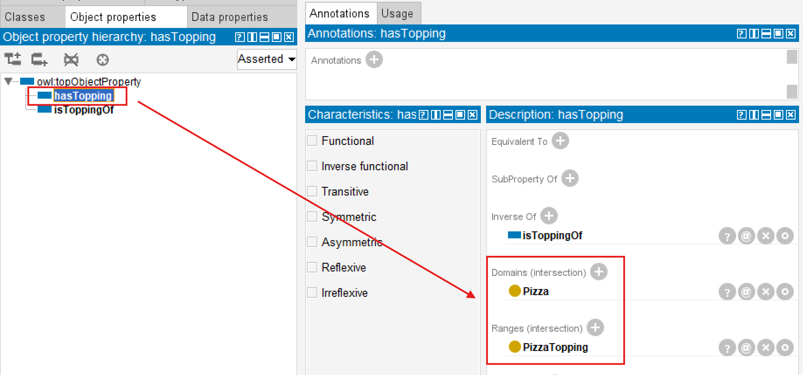

At first glance, this appears straightforward.

However, ontology meaning becomes much more interesitng once inverse properties are considered.

### 13.7.3 Understanding Semantic Reversal Through `isToppingOf`

Because:

> `isToppingOf`

is defined as the inverse of:

> `hasTopping`,

see above screen, the semantic direction reverses.

Ontology therefore naturally expects:

| Domain | Range |
| --- | --- |
| `PizzaTopping` | `Pizza` |

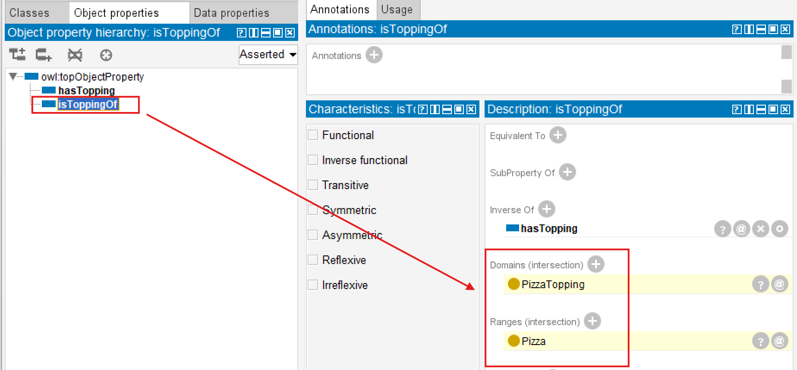

The light yellow colors behind indicates they are inferred by reasoner.

This subtle reversal teaches an important ontology lesson:

> inverse relationships reverse semantic boundaries.

In other words:

If:

> Pizza $\rightarrow$ PizzaTopping`

through:

> `hasTopping`,

then ontology logically expects:

> PizzaTopping $\rightarrow$ Pizza

through:

> `isToppingOf`.

This demonstrates something profoundly important:

> semantic constraints themselves become reversible.

Ontology reasoning therefore behaves consistently across:

> bidirectional meaning.

This is one of the elegant strengths of OWL modeling.

Because semantic logic remains:

> coherent.

Relationships do not merely point in opposite directions.

They preserve:

> semantic validity.

### 13.7.4 Connecting Domain, Range, and Property Characteristics

This exercise also quietly reinforces ideas introduced in:

> **Chapter (12) -- Object Property Characteristics**

You previously discovered that properties may posses:

- inverse relationships
- uniqueness constriants
- transtive behavior
- symmetric meaning

Now, Chapter (13) introduces another insight:

> semantic boundaries also influence property behavior.

Ontology relationshipos therefore consist of multiple semantic layers:

- Relationship Meaning: What does this property represent?
- Realtionship Direction: Can meaning flow both ways?
- Relationship Behavior: How does reasoning behave?
- Relationship Boundary: Where should the relationship logically exist?

This layered perspective represents an important maturity step.

Because ontology engineering is no longer simply:

> connecting concepts.

It becomes:

> governing semantic behavior.

In `Pizza.owl`, you begin seeing how:

> inverse properties

and

> Domain/Range definitions

cooperate to maintain:

> semantic consistency.

Without such coordination, reasoning outcomes would become:

> contradictory.

### 13.7.5 Observing Reasoning Behavior in Protégé

Now, you're encouraged to experiment direction in Protégé.

Select `hasTopping`, and observe:

| Domain | Range |
| --- | --- |
| `Pizza` | `PizzaTopping` |

Then inspect `isToppingOf` and notice the semantic reversal.

Ontology now communicates a complete semantic story:

> pizza has toppings

and:

> toppings belongs to pizzas.

More importantly:

> ontology understands this **automatically**.

Suppose ontology encounters:

> Pepperoni `isToppingOf` MySpecialPizza

Even if neither entity has explicit classification, the reasoner may infer:

> Pepperoni is a PizzaTopping

and:

> MySpecialPizza is a Pizza.

This is particularly powerful!

Because ontology begins:

> discovering meaning through relationships.

Instead of relying entirely upon manual classification, semantic inference emerges through:

> logical structure.

This is one reason ontology engineering differs profoundly from traditional databases.

Databases generally require **explicit typing**.

Ontology cna infer **semantic identity**.

### 13.7.6 Why This Matters Beyong `Pizza.owl`

Although the `Pizza` ontology uses intentionally simple examples, the modeling pattern introduced here becomes highly valuable at:

> enterprise scale.

Consider enterprise relationshiops such as:

> Application realizes Capability

The inverse property may be:

> Capability realizedBy Application

Domain and Range immediately become important.

Semantic correctness requires:

<h3>realizes</h3>

| Domain | Range |
| --- | --- |
| Application | Capability |

<h3>realizedBy</h3>

| Domain | Range |
| --- | --- |
| Capability | Application |

Notice how:

> semantic reversal preserves logical meaning.

This becomes essential for:

- dependency analysis
- impact tracing
- governance validation
- knowledge graph navigation

Ontology therefore evolves beyond:

> static modeling (diagramming).

It becomes:

> **explainable semantic intelligence.**

From the EKA perspective of:

$\large{EKA = (K, R, \Theta, \Phi, \Gamma)}$

Exercise 11 strengthens:

> **$R$ - Reasoning & Rules**

through semantic inference, while simultaneously reinforcing:

> **$\Gamma$ - Governance**

through controlled semantic boundaries, also provide flexibility to:

> **$K$ - Knowledge Graph**

through automatically adding possible inferred relationships directions.

This chapter therefore represents another important maturity transition:

from:

> semantic relationships

toward:

> **semantically governed relationships.**

## 13.8 EKA Tuple Mapping -- Domain and Range in Executable Knowledge Architecture

At first glance, Domain and Range may appear to be relatively small ontology confiugrations.

Within Protégé, they are represented as:

> simple semantic fields.

Ontology engineers merely select:

> a Domain

and/or:

> a Range.

However, beneath this apparent simplicity lies something much deeper.

From the perspective of:

$\large{EKA = (K, R, \Theta, \Phi, \Gamma)}$

Domain and Range represent an important transition point where ontology evolves from:

> connected semantic concepts

toward:

> **governed executable semantics.**

This chapter therefore strengthens multiple EKA components simultaneously.

### 13.8.1 $K$ - Knowledge Graph

The first major contribution of Domain and Range appears within:

> **$K$ - Knowledge Graph.**

Earlier chapters introduced semantic relationships through:

> object properties.

However, simply connecting concepts DOES NOT automatically produce:

> meaningful knowledge.

Relationships without boundaries quickly become:

> semantically noisy.

At enterprise scale, poorly governed semantic relationships often lead to:

> graph pollution (or someone calls "graph poisoning").

Business capabilities reference unrelated entities.

Applications connect to inappropriate infrastructure.

Processes point toward semantically incompatible concepts.

Over time:

> knowledge quality degrades.

Domain and Range help prevent this problem.

They establish:

> semantic relationships boundaries.

In effect, ontology introduces:

> **graph discipline!**

When ontology is later transformed into graph technologies such as **Neo4j**, semantic constraints significantly improve:

- graph consistency
- traversal accuracy
- query quality
- explainability

This becomes increasingly important in enterprise architecture because organizations typically maintain:

> highly interconnected semantic ecosystems.

Without clear boundaries:

> graph meaning becomes difficult to trust.

Domain and Range therefore help ensure that:

> connected data becomes meaningful knowledge.

This represents a critical maturity step toward:

> **knowledge-driven architecture intelligence.**

### 13.8.2 $R$ - Reasoning & Rules

Perhaps the strongest contribution of this chapter appears within:

> **$R$ - Reasoning & Rules.**

As demonstrated in Exercise 11, reasoners actively use Domain and Range for:

> semantic inference.

This is often surprising to ontology beginners.

Many learners initially assume Domain and Range merely function as:

> validation rules.

However, ontology reasoners interpret them as:

> semantic logic!

Support ontology contains:

> Pepperoni `isToppingOf` MySpecialPizza

Thorugh inverse properties and semantic boundaries, the ontology reasoner may infer:

> Pepperoni is a PizzaTopping

and:

> MySpecialPizza is a Pizza.

Notice something important: **ontology inferred meaning.** 

No manual classification was required.

Instead:

> semantic relationships generated semantic understanding.

This becomes profoundly important in enterprise systems.

Imaging a large enterprise ontology containing:

> thousands of applications, processes, platforms, risk, and capabilities.

Manual semantic maintenance quickly becomes: **unsustainable.**

Reasoners therefore become increasingly valuable.

Ontology shifts from:

> manually curated knowledge

toward:

> **self-organizing semantic intelligence.**

Within EKA, this directly strengthens:

> **$R$ - Reasoning & Rules**

because semantic meaning becomes:

> machine-discoverable.

This capability later supports:

- impact analysis
- dependency tracing
- automated classification
- semantic consistency validation

In many ways, this chapter quietly strengthens the foundation of:

> **executable intelligence.**

### 13.8.3 $\Theta$ - Triggers *(Future EKA Perspective)*

Although `Pizza.owl` does not yet implement semantic triggers directly, Domain and Range provide important groundwork for:

> **$\Theta$ - Triggers.**

In future enterprise semantic systems, invalid semantic relationships may automatically initiate:

> governance responses.

For example:

Suppose an enterprise ontology accidentally contains:

> Compliance_Policy `hostedOn` Database

If ontology semantics define `hostedOn` with:

| Domain | Range |
| --- | --- |
| Application | Infrastructure |

then semantic inconsistency may be detected automatically.

Future EKA systems could trigger:

- semantic quality checks
- governance alerts
- architecture review workflows
- validation dashboards

Ontology therefore begins moving beyond:

> passive modeling

toward:

> **active semantic monitoring.**

This is one of the long-term ambitions of EKA:

> transforming knowledge into executable capability.

### 12.8.4 $\Phi$ - Actions *(Future EKA Perspective)*

Once semantic triggers emerges, the next logical step becomes:

> **$\Phi$ - Actions**

Reasoning outcomes may eventually support:

> automated execution.

For example:

When invalid semantic relationships are discovered/detected, enterprise systems might automatically:

- notify enterprise architects
- log inconsistency tracking registry
- generate remediation tasks
- update architecture repositories
- trigger change governance processes

Ontology therefore evolves beyond:

> descriptive modeling

toward:

> **operational semantic intelligence.**

Although Chapter 13 remains foundational, it quietly introduces important prerequisites for future executable architecture systems.

### 13.8.5 $\Gamma$ - Governance

Perhaps most importantly, Domain and Range strongly reinforce:

> **$\Gamma$ - Governance.**

Because governance ultimately depends on:

> semantic trustworthiness.

Without boundaries: semantic quality declines.

- Reasoning becomes unreliable.
- Knowledge graphs become pulluted.
- Business confidence weakens.

Ontology therefore requires:

> **semantic guardrails.**

Domain and Range provide exactly this capability.

They help ontology engineers answer:

> What relationships are semantically valid?

More importantly:

> What relationships should not exist?

This distinction matters enormously!

Because ontology engineering is not merely about:

> what is possible.

It is more about:

> **what is meaningful!**

Domain and Range therefore represent another important maturity step in EKA:

from:

> semantic connectivity

toward:

> **semantic governance.**

## 13.9 Knowledge Graph Implications -- Why Semantic Boundaries Matter

In Chapter (08), you explored RDF as:

> the structural language of ontology.

At that time, we discussed how RDF triples may eventually transition into:

> graph databases

such as:

> Neo4j.

However, Chapter (13) now reveals an important truth:

> triples alone are not enough.

A graph database fundamentally stores:

> relationships.

But relationships themselves without semantic governance quickly become:

> disconnected meaning.

Imaging importing ontology relationships into Neo4j without preserving "Domain" and "Range" logic.

Suddenly: anything may connect to anything!

Over time: semantic ambiguity increases.

- Graph traversal becomes noisy.
- Impact analysis becomes misleading.
- Enterprise architects lose confidence in the graph.

This challenge becomes increasingly serious in large organizations.

Because enterprise ecosystems contain:

- objectives
- policies
- business capabilities
- applications
- processes
- risks
- regulations
- infrastructure components
- partners

Without semantic discipline:

> graph sprawl emerges.

Domain and Range therefore introduce an important idea:

> **semantic filtering.**

Relationships become: intentional.

Queries become: explanable.

Dependencies become: trustworthy.

This matters enormously for:

> AI-ready enterprise architectre.

Because AI systems require more than:

> connected information.

They require:

> **high-quality structured meaning.**

This is precisely where ontology provides value beyond traditional architecture repositories.

Within the EKA roadmap:

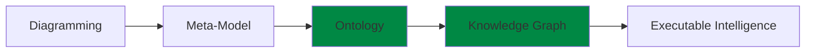

Chapter (13) strengthens the transition between:

> ontology

and:

> trusted knowledge graph.

Because meaningful intelligence requires:

> **meaningful boundaries.**

## 13.10 Governance and Semantic Integrity

As ontology models become larger and increasingly interconnected, an important realization gradually emerges:

> semantic freedom without governance creates semantic chaos.

At first, ontology engineering may feel deceptively simple in below steps:

1. Create classes.
2. Connect them through relationships
3. Add object properties.
4. Enable reasoning

However, as you progress deeper into semantic modeling, you may quickly discover an important truth:

> ontology quality depends heavily on semantic discipline.

This chapter introduces one of the most important governance principles in ontology engineering:

> relationshiops require boundaries.

Not every relationship should be allowed to exist!

And not every technically possible connection should be considered:

> semantically meaningful!

This distinction matters enormously.

Because ontology systems increasingly influence:

- knowgraph graphs
- dependency tracing
- enterprise architecture analysis
- governance automation
- AI reasoning systems

Incorrect semantic assumptions therefore create:

> incorrect intelligence.

Domain and Range exist precisely to reduce this risk.

They help ontology engineers formalize **semantic intent**.

Earlier in this chapter, you saw how:

> `hasTopping`

and:

> `isToppingOf`

maintain semantic correctness through carefully aligned Domains and Ranges.

Without these boundaries, ontology reasoners may infer:

> logically incorrect classifications.

And because ontology reasoners trust:

> semantic definitions,

mistakes may quietly and quickly propagate throughout the whole model.

This introduces an important lesson:

> ontology mistakes often scale faster than traditional modeling mistakes.

Why?

Because inference multiplies impact.

One poorly designed semantic rule may generate hundreds of unintended conclusions.

This becomes especially important within enterprise-scale ontology.

Imagine an architecture ontology where:

> `supports` object property

has overly broad semantic boundaries.

Suddenly:

> Applications `supports` Regulations

or:

> Infrastructure `supports` Business_Strategy

may become semantically inferable.

Even if technically possible within the graph structure:

> the meaning becomes questionable.

Ontology therefore requires:

> **semantic governance!**

From the perspective of:

$\large{EKA = (K, R, \Theta, \Phi, \Gamma)}$

this chapter strongly reinforces:

> **$\Gamma$ - Governance**

because governance fundamentally depends upon:

> semantic correctness, not only technically correctness.

$\Gamma$ - Governance in EKA is not merely:

> documentation standards.

Nor is it limited to:

> architecture approval processes.

Instead, governance increasingly becomes:

> **machine-enforceable semantic discipline.**

Ontology therefore evolves from:

> passive architecture knowledge

toward:

> governed executable knowledge.

This represents an important maturity transition in the EKA roadmap.

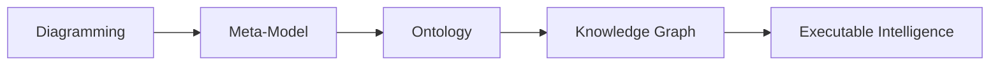

Because enterprise intelligence becomes trustworthy only when:

> semantic quality becomes governable.

A useful mindset for ontology engineers is therefore:

> **Model relationships conservatively** 
> **Expand carefully**

Good ontology engineering values:

> semantic precision

before:

> semantic flexibility.

Because trustworthy intelligence always depends upon:

> **trustworthy semantics.**

## 13.11 Common Modeling Mistakes in Domain and Range

As learners begin applying Domain and Range in their own ontology projects, mistakes natually emerge.

This is completely normal, and sometimes, please welcome mistakes/errors since they give opportunity to learn more aspects of the knowledge.

In fact, ontology engineering often advances through:

> experimentation, reasoning surprises, and semantic correction.

Because OWL reasoners - they are machines - interpret logic very precisely, even seamingly **small** modeling choices may create:

> unexpectedly **large** semantic consequences.

The following are some of the most common mistakes ontology beginners encounter when working with:

> Property Domain and Range.

Understanding them early will significantly improve ontology quality.

### 13.11.1 Overly Broad Domain Definitions

One of the most common beginner mistakes is assigning highly generic classes such as:

> `Thing`

as the Domain of a property.

Technically, this works.

However, semantically:

> it weakens meaning.

Condier the `Pizza.owl` property:

> `hasTopping`

If its Domain is defined as:

> `Thing`

rather than:

> `Pizza`

the ontology would allow **virtually anything** to participate in the relationship.

Potentially:

> Restaurant `hasTopping` MushroomTopping

or even:

> Country `hasTopping` CheeseTopping

While logically allowed by the model:

> semantically this becomes questionable.

Ontology therefore benefits from: semantic precision.

A useful engineering principle is:

> define relationships as narrowly as business meaning reasonably premits.

This improves:

- reasoning quality
- semantic explainability
- governance reliability

### 13.11.2 Missing Range Definitions

Another common mistake occurs when ontology engineers define Domain but forgot to define Range.

This weakens semantic clarity.

Relationships now lack clear definition regarding:

> what kinds of entities may receive meaning.

Ontology reasoners therefore possess less informtaion for **inference.**

Wihtin `Pizza.owl` ontology, if:

> `hasTopping`

had no Range definition, the ontology would no longer clearly communicate:

> what counts as a topping.

Reasoning quality declines.

Semantic trust weakens.

This issue becomes increasingly serious in:

> enterprise knowledge graphs

where semantic ambiguity can easily spread across thousands of interconnected nodes.

A useful modeling habit is therefore:

> define both sides of semantic meaning at the same time whenever possible.

Because every meaningful relationships contains:

> a source

and:

> a destination.

Mapping to the natural language: prevent just speaking half sentence.

### 13.11.3 Misunderstanding Multi-Domain and Multi-Range Logic

As discussed earlier in this chapter, ontology beginners often misunderstand multi-Domain and multi-Range configuration.

Many assume multiple semantic boundaries imply:

> either/or logic (logical `OR`).

However, OWL frequently interprets multiple Domains and Ranges through:

> logical intersection (logical `AND`).

This means ontology may unexpectedly infer that an entity belongs to:

> multiple classes simultaneously.

For example:

If a property defines Domains:

- `Pizza`
- `Restaurant`

ontology may interpret usage as requiring something that is both:

> Pizza **`AND`** Restaurant.

This frequently surprises beginners.

Ontology engineers should therefore always:

> validate assumptions through reasoning.

The reasoner often becomes: the best ontology teacher.

Unexpected inference frequently reveals:

> **hidden** semantic misunderstandings.

### 13.11.4 Ignoring Inverse Property Alignment

Because Chapter (13) directly builds upon:

> **Chapter (11) -- Inverse Properties**

another important modeling mistake occurs when inverse properties become:

> semantically inconsistent.

For example:

Suppose `hasTopping` defines:

| Domain | Range |
| --- | --- |
| `Pizza` | `PizzaTopping` |

But its inverse `isToppingOf` uses incompatible boundaries.

You can refer to one dedicated RDF file `pizza-ebook_13.11.4.rdf`, in which we assert the Domain and Range for these two object properties as below:

| Object Property | Domain | Range |
| --- | --- | --- |
| `hasTopping` | `Pizza` | `PizzaTopping` |
| `isToppingOf` | **`OtherClass`** | `Pizza` |

Once synchronzing reasoner:

- `hasTopping` infers `OtherClass` into Ranges:
  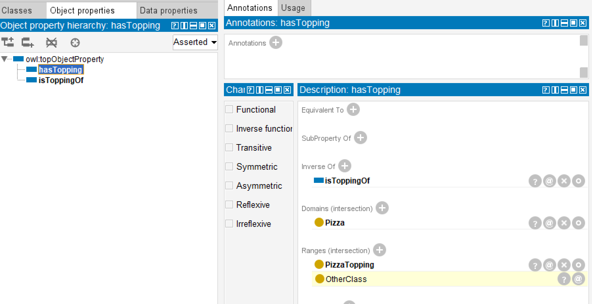
- `isToppingOf` infers `PizzaTopping` into Domains:
  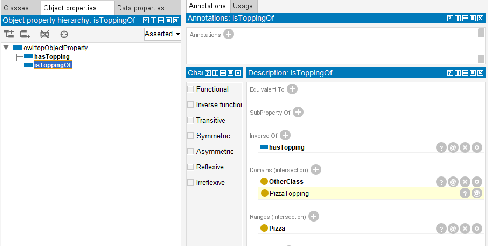

Semantic inconsistency may emerge.

Reasoning behavior may become confusing.

Ontology quality weakens.

Michael's Exercise 11 quietly demonstrates an important best practice:

> inverse properties should maintain logically mirrored semantic boundaries.

This preserves:

> semantic conherence.

Relationships remain:

> explainable

and:

> reasoning stays trustworthy.

### 13.11.5 Treating Domain and Range Like Database Constraints

Another frequent misconception is treating Domain and Range as if they behave exactly like:

> relational database constraints.

Traditional databases often reject invalid data.

While ontology behaves differently.

OWL reasoners primarily use:

> Domain and Range for semantic interpretation.

For example:

Suppose ontology encounters in `Pizza.owl`:

> Pepperoni `isToppingOf` MySpecialPizza

Even without explicit typing, the ontology reasoner may infer:

> Pepperoni is a PizzaTopping

and:

> MySpecialPizza is a Pizza.

The ontology did not reject the statement.

Instead:

> it interpreted **meaning**.

This distinction is extremely important.

Ontology systems are fundamentally:

> meaning-driven systems.

Not merely:

> validation systems.

### 13.11.6 Over-Engineering Semantic Restrictions

Finally, ontology begineers occasionally become overly enthusiatic and begin introducing:

> excessive semantice restrictions.

- Too many Domains.
- Too many Ranges.
- Too many property constraints.

Eventually, ontology becomes:

- difficult to understand,
- difficult to maintain, and
- difficult to explain.

Remember:

> ontology exists to clarify mearning -- not to maximize complexity.

A practical ontology engineering principle is:

> **simple semantics first, advanced semantics later.**

Even `Pizza.owl` intertionally introduces semantic sophistication:

> progressively.

Good ontology design values:

> clarity before cleverness!

## 13.12 Chapter Summary

In this chapter, you explored one of ontology engineering's most important semantic mechanisms:

> **Property Domain and Range.**

Earlier chapters introduced `classes`, `object properties`, `inverse relationships` and `property characteristics`.

Chapter (13) extended this semantic journey by introducing:

> **relationship boundaries.**

You discovered that:

> Domain defines where a relationship originates,

while:

> Range defines what kinds of concepts may receive the relationship.

Through Michael's Exercise 11 within `Pizza.owl` tutorial, you explored how:

> inverse properties

and:

> Domain/Range semantics

work together to preserve:

> semantic consistency.

More importantly, you discovered a crucial ontology insight:

> Domain and Range do not merely restrict meaning --

they also support:

> **semantic inference.**

Ontology reasoners may automatically infer:

- class membership
- semantic classification
- relationship correctness

through carefully designed semantic boundaries.

The chapter also extended these ideas beyond `Pizza.owl` and explored how Domain and Range contribuet toward:

- enterprise ontoloogy,
- knowledge graphs, and
- **Executable Knowledge Architecture (EKA)**.

From the perspective of:

$\large{EKA = (K, R, \Theta, \Phi, \Gamma)}$

this chapter particularly strengthened:

> **$K$ - Knowledge Graph**

through semantic graph quality.

> **$R$ - Reasoning & Rules**

through semantic inference,

and:

> **$\Gamma$ - Governance**

through semantic integrity.

Ultimately, Chapter (13) teaches an important engineering lesson:

> meaningful intelligence depends on meaningful boundaries.

Because ontology becomes powerful not when:

> everything connects to everything --

but when:

> meaning is carefully governed.

## 13.13 Key Concepts

## 13.14 Protégé Skills Learned

## 13.15 Next Chapter Preview

## 13.16 Reference

---

Last updated at: 6/6/2026