# Chapter 14 -- Semantic Requirements – From Existential Restrictions to Universal Rules

Table of Contents:
- [14.1 Chapter Introduction -- From Semantic Boundaries to Semantic Requirements](#141-chapter-introduction----from-semantic-boundaries-to-semantic-requirements)
- [14.2 Why RDF and RDFS Are Not Enough](#142-why-rdf-and-rdfs-are-not-enough)
- [14.3 Property Restrictions -- Introducing Semantic Logic in OWL](#143-property-restrictions----introducing-semantic-logic-in-owl)
- [14.4 Qantifier Restriction -- Understanding Existential and Universal Logic](#144-qantifier-restriction----understanding-existential-and-universal-logic)
  - [14.4.1 Existential Restriction -- "At Least One Exist"](#1441-existential-restriction----at-least-one-exist)
    - [=== Interesting Read: More mathematical notation ===](#-interesting-read-more-mathematical-notation-)
  - [14.4.2 Universal Restriction -- "Only These Are Allowed"](#1442-universal-restriction----only-these-are-allowed)
    - [=== Interesting Read: More mathematical notation ===](#-interesting-read-more-mathematical-notation--1)
  - [14.4.3 Why Chapter 14 Begins with Existential Restriction](#1443-why-chapter-14-begins-with-existential-restriction)
  - [14.4.4 OWL Restriction Systax Pattern -- Understanding the Grammar of Semantic Constraints](#1444-owl-restriction-systax-pattern----understanding-the-grammar-of-semantic-constraints)
- [14.5 Existential Restriction in `Pizza.owl` -- Understanding Tutorial 4.10.1 and 4.10.2](#145-existential-restriction-in-pizzaowl----understanding-tutorial-4101-and-4102)
  - [14.5.1 A Detail Look at Existential Restriction](#1451-a-detail-look-at-existential-restriction)
  - [14.5.2 From Semantic Requirements to Executable Queries: The EKA Knowledge Graph Bridge](#1452-from-semantic-requirements-to-executable-queries-the-eka-knowledge-graph-bridge)
  - [14.5.3 Visualized Examine on Tutorial 4.10.1 and 4.10.2](#1453-visualized-examine-on-tutorial-4101-and-4102)
  - [14.5.4 View from Open World Assumption (OWA)](#1454-view-from-open-world-assumption-owa)
- [14.6 Exercise 13 Walkthrough -- Creating Semantic Requirements in Protégé](#146-exercise-13-walkthrough----creating-semantic-requirements-in-protégé)
- [14.7 Understanding Reasoning Outcomes -- Asserted vs. Inferred Semantics](#147-understanding-reasoning-outcomes----asserted-vs-inferred-semantics)
  - [14.7.1 Asserted Semantics -- Explicitly Modeled Knowledge](#1471-asserted-semantics----explicitly-modeled-knowledge)
  - [14.7.2 Inferred Semantics -- Knowledge Derived Through Logic](#1472-inferred-semantics----knowledge-derived-through-logic)
    - [=== Interesting Read: Necessary vs. Sufficient Conditions ===](#-interesting-read-necessary-vs-sufficient-conditions-)
  - [14.7.3 Why Existential Restriction Enables Inference](#1473-why-existential-restriction-enables-inference)
  - [14.7.4 Reasoners Think Logically -- Not Intuitively](#1474-reasoners-think-logically----not-intuitively)
- [14.8 Univeral Restriction -- Understanding `only`](#148-univeral-restriction----understanding-only)
  - [14.8.1 From Existence to Constraint -- Why `only` is Needed](#1481-from-existence-to-constraint----why-only-is-needed)
  - [14.8.2 The Semantics of `only` -- "All Must Be" vs. "Only Allowed"](#1482-the-semantics-of-only----all-must-be-vs-only-allowed)
  - [14.8.3 The Critical Differece -- `some` vs. `only`](#1483-the-critical-differece----some-vs-only)
    - [==== Interesting Reading: Vacuous Truth in Formal Logic ===](#-interesting-reading-vacuous-truth-in-formal-logic-)
  - [14.8.4 Universal Restriction in Protégé -- `only` as a Semantic Guardian](#1484-universal-restriction-in-protégé----only-as-a-semantic-guardian)
    - [=== Interesting Reading: Semantic Drift in Enterprise Knowledge Models ===](#-interesting-reading-semantic-drift-in-enterprise-knowledge-models-)
- [14.9 Combining `some` and `only` -- The Classis `VegetarianPizza` Pattern](#149-combining-some-and-only----the-classis-vegetarianpizza-pattern)
  - [14.9.1 Why `some` Alone Is Not Enough?](#1491-why-some-alone-is-not-enough)
  - [14.9.2 Why `only` Alone Is Not Enough](#1492-why-only-alone-is-not-enough)
  - [14.9.3 Why Logical Compsition Matters](#1493-why-logical-compsition-matters)
- [14.10 Implementing `some` and `only` in Graph Database - A Neo4j Perspective](#1410-implementing-some-and-only-in-graph-database---a-neo4j-perspective)
  - [14.10.1 Implementing Existential Restriction (`some`) in Neo4j](#14101-implementing-existential-restriction-some-in-neo4j)
  - [14.10.2 Implementing Universal Restriction (`only`) in Neo4j](#14102-implementing-universal-restriction-only-in-neo4j)
  - [14.10.3 Combining `some` and `only` in Neo4j](#14103-combining-some-and-only-in-neo4j)
  - [14.10.4 Cypher Query vs. Pellet Reasoner vs. Open World Assumption](#14104-cypher-query-vs-pellet-reasoner-vs-open-world-assumption)
      - [Part 1: Existential Restriction (`some`) -- "At Least One Must Exist"](#part-1-existential-restriction-some----at-least-one-must-exist)
      - [Part 2: Universal Restriction (`only`) -- "Everything Must Conform"](#part-2-universal-restriction-only----everything-must-conform)
      - [Part 3: Combining `some` and `only` -- The Composite Pattern](#part-3-combining-some-and-only----the-composite-pattern)
      - [Part 4: Integrated Comparison - `some` vs `only` Across Both Worlds](#part-4-integrated-comparison---some-vs-only-across-both-worlds)
      - [Part 5: Why the Difference Matters - From Query to Reasoning](#part-5-why-the-difference-matters---from-query-to-reasoning)
      - [Part 6: Practical Guidance - When to Use Each Approach](#part-6-practical-guidance---when-to-use-each-approach)
      - [Summary: The Logical Bridge Between Sections 14.10.1~14.10.3 and True OWL Reasoning](#summary-the-logical-bridge-between-sections-1410114103-and-true-owl-reasoning)
- [14.11 EKA Perspective -- Restriction as Semantic Governance](#1411-eka-perspective----restriction-as-semantic-governance)
  - [14.11.1 Restriction and the Knowledge Graph Layer ($K$)](#14111-restriction-and-the-knowledge-graph-layer-k)
  - [14.11.2 Restriction and the Reasoning \& Rules Layer ($R$)](#14112-restriction-and-the-reasoning--rules-layer-r)


## 14.1 Chapter Introduction -- From Semantic Boundaries to Semantic Requirements

By the end of Chapter (13), you had already begun understanding an important truth about ontology engineering:

> semantic relationships alone are not sufficient to fully describe meaning!

Through **Property Domain and Range**, ontology engineers learned how to establish:

> semantic boundaries.

For example, `hasTopping` may define:

| Domain | Range |
| --- | --- |
| `Pizza` | `PizzaTopping` |

This tells ontology something important:

> pizzas may have toppings.

Likewise:

> topping belong to pizzas.

However, a subtle but important limitation still remains.

Consider the following question:

> Does every pizza necessarily have toppings?

From the perspective of:

> Domain and Range alone,

the answer is:

> **not necessarily.**

Why?

Because Domain and Range describe:

> where relationships are logically valid,

but they do not express:

> what relationships are semantically required.

This distinction represents one of the most important maturity transitions in ontology engineering.

In earlier chapters, ontology primarily focused on:

> semantic structure.

You created:

- classes
- subclass hierarchies
- object properties
- inverse properties
- property characteristics
- semantic boundaries

Ontology therefore answered questions such as:

- What things exist?
- How are concepts related?
- What semantic relationships are valid?

Chapter 14 now introduces a deeper semantic question:

> **What relationships must exist?**

This shift is profound.

Because ontology is no longer merely describing:

> allowable semantic connections.

Ontology now begins defining:

> **semantic obligations.**

For example:

Saying:

> Pizza `hasBase` PizzaBase

describes:

> a valid relationship.

But saying:

> every Pizza must have at least one PizzaBase

introduces something fundamentally different:

> a semantic requirement.

Ontology therefore begins evolving from:

> connected semantics

toward:

> **logical semantics.**

This chapter begins with one of OWL's most powerful modeling constructs:

> **Existential Restriction**

often expressed through:

> `someValuesFrom`

At first glance, existential restrictions may appear technically simple.

Yet conceptually, they represent a major milestone!

Because this is the point where ontology starts moving toward:

> **machine-understandable logic.**

Rather than merely storing knowledge, ontology begins expressing:

> how knowledge should behave.

Within the broader direction of:

> **Executable Knowledge Architecture (EKA)**

this chapter represents another maturity leap:

from:

> governed semantic relationships

toward:

> **governed semantic requirements.**

## 14.2 Why RDF and RDFS Are Not Enough

To fully appreciate why `existential restrictions` matter, it is helpful to revisit a theme introduced earlier in:

> **Chapter 08 -- RDF as a Language**

As discussed previously, RDF provides a remarkably elegant mechanism for representing knowledge.

Through simple triple "subject $\rightarrow$ predicate $\rightarrow$ object", RDF allows semantic relationships to be represented consistently.

For example:

> MargheritaPizza $\rightarrow$ `hasTopping` $\rightarrow$ MozzarellaTopping

In Portégé, we model `Pizza.owl` as below screen:

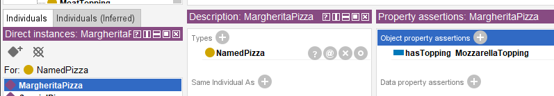

This structure gives ontology an important foundation:

> connected meaning.

Later, RDFS (RDF Schema) extends this capability by introducing:

- class hierarchies
- subclass relationships
- Domain definitions
- Range definitions

These additions improve semantic understanding considerably.

For example:

RDFS can express:

> Pizza is a subclass of Food

or:

> `hasTopping` connects "Pizza $\rightarrow$ PizzaTopping".

At this stage, ontology becomes:

> semantically structured.

However, an important limitation still exists!

RDFS can describe:

> semantic possibility.

But it cannot adequately express:

> semantic **necessity**!

This distinction becomes critically important.

Consider the following statement:

> Pizza `hasBase` PizzaBase

What does this actually mean?

It tells ontology:

> pizza **may** logically has pizza bases.

But does ontology know that:

> every pizza **must** have a base?

NO!

RDFS alone cannot fully express this requirement.

Likewise:

> MargheritaPizza `hasTopping` MozzarellaTopping

does not automatically mean:

> every MargheritaPizza requires mozzarella.

Ontology still lacks a way to formalize:

> semantic **obligation**.

This limitation becomes increasingly problematic in real enterprise modeling.

Imaging an enterprise architecture ontology.

Suppose an organization defines:

> Application `hostedOn` Infrastructure

This relationship may be semantically valid.

However, enterprise architects often need stronger semantic meaning, like:

> every production application must be `hosted on` infrastructure.

Notice the difference.

The first statement describes: **possibility**;

The second introduces: **requirement**.

This is precisely where:

> **OWL (Web Ontology Language)**

extends semantic capability beyond RDF and RDFS.

OWL introduces:

> logical expressiveness.

Ontology now becomes capable of describing:

- Rules,
- Requirements,
- Obligations, and
- **machine-interpretable semantic logic**.

This transition is important enough to view as a fundamental evolution:

- **RDF** - connected data - *"Something is connected to something."*
- **RDFS** - structured semantices - *"These kinds of things may be connected in these ways."*
- **OWL** - logical semantics - *"These kinds of things **must** be connected in these ways."*

## 14.3 Property Restrictions -- Introducing Semantic Logic in OWL

By the end of Chapter (13), ontology had already become significantly more expressive.

You could now model:

- classes and subclass hierarchies
- object properties and inverse properties
- property characteristics
- semantic boundaries through Domain and Range

However, ontology skill lacked an important capability:

> **the ability to formally describe semantic conditions.**

consider the following statement:

> `Pizza` `hasTopping` `PizzaTopping`

This tells ontology something useful already:

> pizza may have toppings.

Yet, ontology still cannot answer a deeper semantic question:

> what makes a pizza become a specific kind of pizza?

For example:

What semantically distinguishes:

> `MargheritaPizza`

from:

> `AmericanPizza`

or:

> `VegetarianPizza`?

Either pizza above may have some topping, but merely defining classes and relationships like this way is insufficient.

Ontology now requires a mechanism capable of expression:

> **semantic constraints**

and:

> **logical requirements.**

This need introduces one of the most important constructs within:

> **OWL (Web Ontology Language)**

knows as:

> **Property Restrictions.**

Property restrictions allow ontology engineers to formally describe:

- how properties should behave?
- what relationships are expected? and
- what semantic conditions must hold?

In other words, property restrictions move ontology from:

> sementic structure

toward:

> **semantic logic.**

This distinction is fundamental.

Because until now, ontology primarily described:

> what thinks exist

and

> how things connect.

With property restrictions, ontology begins expressing:

> **what things mean.**

This is one of the first moments where ontology becomes **logicall interpretable**.

And consequently **reasoner-friendly.**

Within OWL, property restrictions are represented as:

> logical class descriptions.

Meaning: A class can now be defined not merely through **a name**, but through **semantic conditions.**

For example:

Instead of manually declaring:

> `CheesyPizza`

ontology can describe it logically as:

> a `Pizza` that has **at least one** `CheeseTopping`.

This subtle shift changes ontology dramatically.

Meaning is no longer **manually assigned.**

Meaning becomes **logically inferable.**

To better understand property restrictions, it is useful to view them as a family of semantic mechanisms.

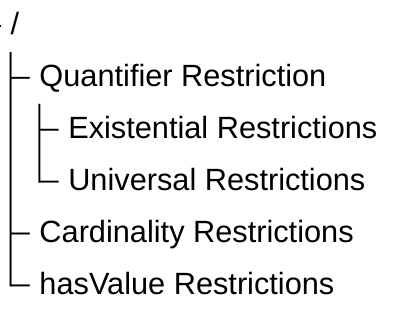

Broadly speaking as above tree-view, OWL property restrictions can be grouped into three major categories:

<h3>1. Quantifier Restrictions</h3>

Quantifier restrictions describes:

> **whether certain relationships exist**

or:

> whether relationships are restricted to certain types.

These restrictions focus on semantic existence and semantic scope.

Quantifier restrictions include:

<h4>Existential Restriction</h4>

(`someValuesFrom`)

Meaning: there exists at least one relationship satisfying a condition.

Example:

> `Pizza` `hasTopping` some `CheeseTopping`

Meaning:

> every pizza must have at least one cheese topping.

<h4>Universal Restriction</h4>

(`allValuesFrom`)

Meaning: all (every) successor individual must belongs to a specified class.

Example:

> `Pizza` `hasTopping` only `PizzaTopping`

Meaning:

> every topping of a pizza must be a `PizzaTopping`.

Notice the important distinction.

- Existential restriction expresses: **minimum semantic existence.**
- Universal restriction expresses: **semantic limitation.**

These two concepts are frequently confused by beginners.

Yet they represent fundamentally different forms of semantic reasoning.

Chapter (14) begins with:

> **Existential Restriction**

because ontology must firest understand:

> required existence

before learning:

> restricted universality.

Do you see any similarity for this ontology (machine) learning approach with how human being learn? True, they are in the common approach.

<h3>2. Cardinality Restrictions</h3>

While quantifier restrictions focus on existence, cardinality restrictions focus on **quantity.**

Ontology may sometimes need to define:

> how many relationships are permitted or required.

OWL therefore supports several forms of:

> cardinality constraints.

Including:

<h4>(1) Minimum Cardinality</h4>

(`minCardinality`)

Meaning: at least N relationships must exist.

Example:

> `Pizza` `hasTopping` minimum 2

Meaning:

> a pizza must have at least two toppings

<h4>(2) Maximum Cardinality</h4>

(`maxCardinality`)

Meaning: no more than N relationships may exist.

Example:

> `Person` `hasBiologicalMother` maximum 1

Meaning:

> a person cannot have more than one biological mother.

<h4>(3) Exact Cardinality</h4>

(`exactCardinality`)

Meaning: exactly N relationships are required.

Example:

> `Standard_Bicycle` `hasWheel` exactly 2

Meaning:

> standard bicycles must have precisely two wheels.

Cardinality restrictions become particularly important in:

- enterprise governance,
- data quality validation, and
- business rule enforcement.

Within enterprise architecture, examples may include:

> an `business_application` must have exactly one `system_owner`

or:

> a `business_process` must involve at least one `responsible_role`.

Ontology therefore becomes increasingly capable of expressing:

> operational logic,

rather than merely:

> descriptive semantics.

<h3>3. Value Restrictions</h3>

The third major category involves **specific required values** represented through `hasValue`.

Unlike existential restriction, which asks for:

> as least one qualifying relationship,

value restriction specifies:

> a particular exact value.

For example:

Suppose an enterprise policy states:

> all `production_applications` must belong to environment "`Production`".

Ontology may express:

> `hasEnvironment` `value` `Production`

This means:

> the relationship must point to a specific predefined individual.

In `Pizza.owl` terms, imagine requiring:

> a `NamedPizza` must always have a particular base.

Rather than merely saying:

> some pizza base exists,

ontology would specify:

> one exact expected value.

Value restrictions therefore introduce:

> semantic precision

as well as:

> semantic determinism.

Together, these three categories establish the foundation of:

> OWL semantic logic.

They transform ontology from:

> semantic modeling

into:

> formal semantic definition.

Summrized view in below comparison table from also the evolution discussed in 14.2 from RDF/RDFS to OWL:

| Layer | Core Capability | Limitation |
| --- | --- | --- |
| RDF | Triples (connected meaning) | No structure |
| RDFS | Class hierarchies, Domain & Range (structured semantics) | Can only describe **possibility**, cannot express **necessity** |
| OWL | Logical expressiveness (rules, requirements, obligations) | -- |

Existential restrictions represent one of the earliest moments where you may begin seeing:

> ontology as **logic**.

Rather than merely:

> ontology as structure.

And this transition fundamentally changes how ontology can support:

- Reasoning ($R$),
- Governance ($\Gamma$), and eventually
- executable intelligence.

Among these restriction categories, **quantifier restrictions** are typically introduced first because they provide the conceptual foundation for semantic participation and logical class definition. We therefore begin with existential and universal restrictions.

## 14.4 Qantifier Restriction -- Understanding Existential and Universal Logic

Among all OWL restrictions, the most foundational are:

> **Quantifier Restrictions.**

These restrictions focus on a deceptively simple question:

> **what kind of relationships should exist?**

Quantifier restrictions allow ontology to reason about:

> semantic participation.

In other words:

ontology begins understanding not merely:

> whether concepts are connected,

but:

> how those connections should behave logically.

OWL provides two primary forms of quantifier restriction:

- **Existential Restriction**: represented by `someValuesFrom`
- **Universal Restriction**: represented by `allValuesFrom`

Although these may appear similar at first glance, their semantic meaning differs significantly.

### 14.4.1 Existential Restriction -- "At Least One Exist"

Existential restriction expresses:

> **there exists at least one qualifying relationship.**

In **Description Logic (DL)**, this is often represented conceptually as:

> $\exists R.C$

Meaning: there exists at least one (some) relationshiop $R$ to something belonging to an individual belonging to class $C$.

#### === Interesting Read: More mathematical notation ===

Expand above notation in DL, the concept of an existential restriction is formally defined using the following mathematical notation:

$\exists R.C =
\{x \in \Delta^\mathcal{I}
\mid
\exists y \in \Delta^\mathcal{I} :
(x,y) \in R^\mathcal{I}
\land
y \in C^\mathcal{I}
\}$

Breakdown of this formula --

- $\Delta^\mathcal{I}$: The domain of interpretation, representing the set of all individuals in the ontology world.
- $x, y$: Individual elements within that interpretation domain.
- $R^\mathcal{I}$: The interpretation of the role (relationship) $R$, represented as a binary relation between individuals.
- $C^\mathcal{I}$: The interpretation of the concept (class) $C$, represented as the set of all individuals belonging to class $C$.
- $(x,y) \in R^\mathcal{I}$: Indicates that a relationship $R$ exists between individual $x$ and individual $y$.
- $y \in C^\mathcal{I}$: Indicates that individual $y$ belongs to class $C$.
- $\land$: Logical conjunction (AND), meaning both conditions must hold simultaneously.

Conceptual visualization --

To understand this mapping, let's imaging a `parentTo` relationship connected to a `Person` class: $\exists parentTo.Person$

Meaning:

> there exists at least one chile connected through `parentTo` to a `Person`.

In short, the expression $\exists R.C$ describes the set of all individuals x that have **at least one successor** y through relationship R, such that y belongs to class C.

=== END ===

Within our `Pizza.owl` ontology, consider:

> `hasTopping` `some` `MozzarellaTopping`

Semantically, this means:

> there exists at least one topping relationship to mozarella topping.

This statement introduces something very important:

> semantic necessity.

Ontology now expects:

> at least one qualifying relationship.

This differs significantly from earlier chapters.

- Previously: relationship were optional.
- Now: relationships become logically meaningful (necessity).

A useful way to understand existential restriction is through the phrase:

> **AT LEAST ONE.**

Not:

> exactly one.

Not:

> all toppings.

Simply: there exists at least one!

This distinction matters enormously.

Because ontology reasoning depends heavily on:

> precise semantics.

Let's see an example in `Pizza.owl`:

Suppose a class defines:

> `MargheritaPizza`

as:

> `hasTopping` `some` `MozzarellaTopping`

Ontology now understand:

> mozzarella topping is semantically necessary by Margherita pizza.

Without satisfying this requirement:

> the pizza cannot fully conform to the class meaning, semantically.

This introduces another important shift.

Ontology modeling now begins answering:

> **What makes something what it is?**

A `MargheritaPizza` is not merely:

> a pizza.

It becomes:

> a pizza satisfying semantic conditions.

This distinction transform ontology engineering from:

> classification

toward:

> **formal semantic definition**.

Ontology therefore becomes increasingly capable of expressing:

> adaptive domain knowledge.

In enterprise context, this becomes extremely valuable.

See another example:

A `Critical_Application` may require:

> at least one `Disaster_Recovery_Mechanism`.

Or:

`Sensitive_Data_Process` may require:

> at least one `Compliance_Concrol`.

Ontology can now formally describe:

> mandatory semantic conditions.

Rather than merely:

> possible relationships.

This marks another important maturity leap toward:

> executable knowledge systems.

### 14.4.2 Universal Restriction -- "Only These Are Allowed"

Universal restriction expresses:

> **all successor individuals must satisfy a condition.**

Conceptually:

> $\forall R.C$

Meaning: every relationship $R$ must point to class $C$.

#### === Interesting Read: More mathematical notation ===

Expand above notation in DL, the concept of a universal restriction is formally defined using the following mathematical notation:

$\forall R.C =
\{x \in \Delta^\mathcal{I}
\mid
\forall y \in \Delta^\mathcal{I} :
(x,y) \in R^\mathcal{I}
\rightarrow
y \in C^\mathcal{I}
\}$

Breakdown of this formula --

- $\Delta^\mathcal{I}$: The domain of interpretation, representing the set of all individuals in the ontology world.
- $x, y$: Individual elements within that interpretation domain.
- $R^\mathcal{I}$: The interpretation of the role (relationship) $R$, represented as a binary relation between individuals.
- $C^\mathcal{I}$: The interpretation of the concept (class) $C$, represented as the set of all individuals belonging to class $C$.
- $(x,y) \in R^\mathcal{I}$: Indicates that a relationship $R$ exists between individual $x$ and individual $y$.
- $y \in C^\mathcal{I}$: Indicates that individual $y$ belongs to class $C$.
- $\rightarrow$: Logical implication (IF…THEN), meaning if relationship $R$ exists, the target individual must satisfy class condition $C$.

Conceptual visualization --

To understand this semantic interpretation, same as previous example, imagine a  `parentTo` relationship connected to `Person`, now as $\forall parentTo.Person$

Meaning:

> all individuals connected through `parentTo` must belong to the class `Person`.

Importantly, this does **not** imply that a person necessarily satisfies `parentTo` relationship.

Instead, ontology expresses:

> if a `parentTo` relationship exists, it must only point to valid `Person` individuals.

In short, the expression $\forall R.C$ describes the set of all individuals $x$ such that:

> every successor individual $y$ connected through relationship $R$ must belong to class $C$.

This is why universal restriction expresses:

> **semantic limitation**

rather than:

> semantic existence.

In short, the expression $\forall R.C$ describes the set of all individuals x whose **every successor** y through relationship R must belong to class C.

=== END ===

For example:

> `Pizza` `hasTopping` only `PizzaTopping`

Meaning:

> all toppings of a pizza must belong to PizzaTopping.

This does **not** guarantee toppings exist.

Instead, it governs:

> semantic limitation.

This distinction is critically important.

Because beginners often mistakenly assume `only` means **required**.

But semantically, it means **constrained**.

A pizza may still have:

> zero toppings.

Ontology here simply says:

> if topping exist,

they must belong to:

> `PizzaTopping`.

Understanding this distinction is one of the earliest maturity moments in ontology engineering.

Because ontology logic depends heavily on:

> semantic precision.

### 14.4.3 Why Chapter 14 Begins with Existential Restriction

Michael intentionally introduces:

> existential restriction

before universal restriction.

This teaching sequence is important.

Because ontology first needs to understand:

> **semantic existence**

before introducing:

> **semantic limitation**

In practical modeling:

it is usually easier to first ask:

> what relationships are required?

before asking:

> what relationships are allowed?

This chapter therefore focuses on:

> **Existential Restriction**

using:

> `someValuesFrom`

before later chapters gradually expand toward:

> more advanced logical constraints.

### 14.4.4 OWL Restriction Systax Pattern -- Understanding the Grammar of Semantic Constraints

After understanding the conceptual difference between:

> existential restriction (`someValuesFrom`)

and:

> universal restriction (`allValuesFrom`),

you should pause briefly to recognize an important fact, from language perspective, that:

> OWL restriction are not random syntax.

Instead, they follow a highly structured semantic grammar.

Thsi is an important transition point in ontology learning.

Because many beginners mistakenly perceive expressions such as:

`hasTopping some MozzarellaTopping`

as:

> Protégé-specific notation

or simply:

> a software configuration format.

However, this interpretation is incomplete.

In reality, OWL restrictions represent:

> **formal semantic expressions**

which are used to describe:

> logical class conditions.

In other words:

OWL restriction statements behave more like:

> **semantic sentences**

than:

> user interface settings.

Understanding this grammar is important because future ontology modeling will increasingly depend upon:

> composing semantic logic

rather than merely:

> creating classes and relationships.

At a further high level, most OWL restriction expressions follow a common structural pattern:

$Object Property + Restriction Type + Target Class$

Conceptually:

$Relationship + Semantic Logic + Semantic Target$

This structure can be understood as a reusable language pattern for constructing:

> **semantic constraints.**

Let us examine a common example from `Pizza.owl`:

`hasTopping some MozzarellaTopping`

This restriction can be decomposed into three semantic components:

| Component | Meaning | Semantic Role |
| --- | --- | --- |
| `hasTopping` | Object Property | Defines the relationship |
| `some` | Restriction Type | Defines existential logic |
| `MozzarellaTopping` | Target Class | Defines the semantic requirement |

When interpreted together, ontology understands the expression as:

> a pizza must have **at least one** topping belonging to the class `MozzarellaTopping`.

Very importantly: the keyword `some` does **NOT** mean "several" or "an unspecified number"!

Within OWL semantics: `some` specifically represents **existential quantification**, meaning:

> **at least one qualifying relationship exists.**

Now consider a second example:

`hasTopping only PizzaTopping`

This expression follows the exact same grammar pattern:

| Component | Meaning | Semantic Role |
| --- | --- | --- |
| `hasTopping` | Object Property | Defines the relationship |
| `only` | Restriction Type | Defines universal logic |
| `PizzaTopping` | Target Class | Defines the semantic requirement |

However, the semantic interpretation changes significantly.

Ontology now understand:

> all toppings associated with a pizza must belong to the class `PizzaTopping`.

Notice what changed.

The **relationship** remains identical.

The **target class** also remains similar.

Only the **restriction logic** changes.

Yet this small syntactic variation completely transforms semantic meaning.

This illustrates an important principle in ontology engineering:

> [!Note] small changes in OWL syntax may produce major differences in logical interpretation.

As ontology modeling becomes more advanced, you will encounter increasingly sophisticated restriction patterns.

For example:

- Existential Quantifier Restrictions: `hasTopping some CheeseTopping`
- Universal Quantifier Restrictions: `hasTopping only PizzaTopping`
- Cardinality Restrictions: `hasTopping min 2`
- Exact Cartinality Restrictions: `hasWheel exactly 4`
- Value Restrictions: `hasEnvironment value Production`

Although these expressions appear different, they all follow a similar semantic grammar:

$Property + Restriction + Target$

Understanding this pattern is an important milestone!

Because ontology engineers gradually stop reading OWL as:

> syntax

and begin reading OWL as:

> **semantic language.**

This mindset shift is crucial.

Especially for enterprise ontology and knowledge graph engineering.

Since ontology increasingly becomes not merely:

> a data model,

but:

> **a language for expressing machine-interpretable meaning.**

With this grammar foundation established, you are now ready to begin applying existential restrictions practically inside `**Pizza.owl**` and Protégé.

## 14.5 Existential Restriction in `Pizza.owl` -- Understanding Tutorial 4.10.1 and 4.10.2

### 14.5.1 A Detail Look at Existential Restriction

After introducing the conceptual foundation of property restrictions, Michael now transitions toward one of this most important practical modeling techniques in OWL:

> **Existential Restriction**

through the construct `someValuesFrom`.

At this stage in the `Pizza.owl` tutorial, ontology modeling begins changing character.

Earlier chapters largely focused on **describing relationships.**

For example:

> Pizza `hasTopping` PizzaTopping

or:

> Pizza `hasBase` PizzaBase

These statements helped ontology understand:

> semantic structure.

However, ontology still lacked the ability to describe:

> **sementic requirements.**

This distinction is subtle but important.

Because knowing:

> a pizza may have toppings

is fundamentally different from saying:

> a pizza must contain at least one topping.

Ontology therefore begins transitioning from:

> semantic possibility

toward:

> **semantic obligation.**

### 14.5.2 From Semantic Requirements to Executable Queries: The EKA Knowledge Graph Bridge

This transition from "possibility" to "obligation" is not merely an academic logical exercise. Within the EKA framework, it has a very concrete and powerful implication for the **$K$ - Knowledge Graph** layer.

Recall the EKA formalization: $\large{EKA = (K, R, \Theta, \Phi, \Gamma)}$.

- **Without Existential Restrictions ($K$ is a "Descriptive Graph"):** The knowledge graph can only answer "what is" queries. For example, you can ask: *“Which pizzas have a `MozzarellaTopping`?”* This is a simple traversal of asserted relationships.

- **With Existential Restrictions ($K$ becomes an "Intelligent Graph"):** Because the ontology now contains *logical rules* about what *must* exist, the knowledge graph can answer "what should be" and "what is missing" queries.

**Example in a Graph Query (e.g., Cypher or SPARQL):**

You have defined that a `CheesePizza` **must** have at least one `hasTopping` relationship to a `CheeseTopping`. Your knowledge graph contains the following individuals:

1.  `PizzaA` (type: `CheesePizza`) - has a relationship `hasTopping` to `CheddarTopping`.
2.  `PizzaB` (type: `CheesePizza`) - has **no** `hasTopping` relationships.

=== Additional Reading, if you have Neo4j on-hand ===

Assume your Neo4j graph contains nodes labeled `Pizza` and `CheeseTopping` (Note: `CheeseTopping` could be member of parent node `PizzaTopping`), connected by a relationship `:HAS_TOPPING`.

Base on above individuals information.

Run this Query 1:

```SQL
MATCH (p:Pizza {type: 'CheesePizza'})
RETURN p.name AS PizzaName
```

You may get result as:

| PizzaName |
| --- |
| PizzaA |
| PizzaB |

*Both pizzas are returned, even though `PizzaB` has no toppings.*

Then rune this Question 2:

```SQL
MATCH (p:Pizza {type: 'CheesePizza'})
WHERE (p)-[:HAS_TOPPING]->(:CheeseTopping)
RETURN p.name AS ValidCheesePizzaName
```

You should see the result now as:

| ValidCheesePizzaName |
| --- |
| PizzaA |

*Only `PizzaA` is returned. `PizzaB` is excluded because it does not satisfy the "must have at least one cheese topping" rule.*

From knowledge graph perspective:

- Quary 1 represents a **descriptive knowledge graph**: it simply tells you what is asserted, but it cannot distinguish between a valid `CheesePizza` (with toppings) and an invalid or incomplete one.
- Query 2 represents the **existential restriction logic** (`hasTopping some CheeseTopping`) enhancing the knowledge graph: it queries only those individuals that *satisfy the semantic requirement*, this turns your ontology's logical rules into powerful, executable data quality filters.

In an EKA-enabled sytems, Query 2 would be the basis for generating trustworthy insights, while Query 1 might be used for auditing or identifying data quality issues (i.e., finding `PizzaB` to flag it for correction).

=== END ===

**Without the existential restriction** (i.e., using only RDFS/SHACL), both `PizzaA` and `PizzaB` are valid members of `CheesePizza`. A query would simply return both.

**With the existential restriction** (using OWL and a reasoner), the semantic layer within EKA ($R$) can first validate the graph. It would identify `PizzaB` as **incomplete** or **inconsistent** based on the logical rule you defined in the ontology.

This allows the **Executable Intelligence ($\Phi$)** layer to trigger actions. A governance workflow could automatically flag `PizzaB` for a data quality issue, or a smart query could be written to exclude it from results.

**Therefore, Chapter (14) is the pivotal moment where your ontology stops being a mere "schema" for your knowledge graph and becomes its "logical guardian."** The existential restriction (`someValuesFrom`) is your first tool to enforce business rules ("a product must have a category", "a critical application must have an owner") directly within your executable knowledge architecture.

### 14.5.3 Visualized Examine on Tutorial 4.10.1 and 4.10.2

Michael instroduces existential restriction through a very deliberate modeling progression.

Rather than immediately creating complicated class logic, you first explore a simple but powerful idea:

> classes may be described through required relationships.

This introduces a major ontology engineering concept:

> **logical class definition.**

See below steps which described in Exercise 13 and result `Pizza hasBase some PizzaBase`:

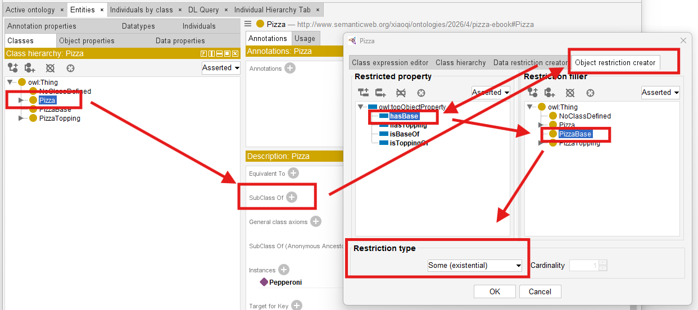

Previously, you manually create classes primarily through naming and hierarchy.

For example:

> `MargheritaPizza`

may simply exist as:

> a subclass of `NamedPizza`.

However, ontology still does not truly understand:

> what semantically makes a `MargheritaPizza` a `MargheritaPizza`.

Existential restriction changes this.

Ontology can now begin expression:

> semantic identity.

For example:

Instead of simply naming:

> `CheesePizza`,

ontology may define:

> a pizza having at least one cheese topping.

See how to implement this in Protégé and resulting `CheesePizza hasTopping some CheeseTopping`:

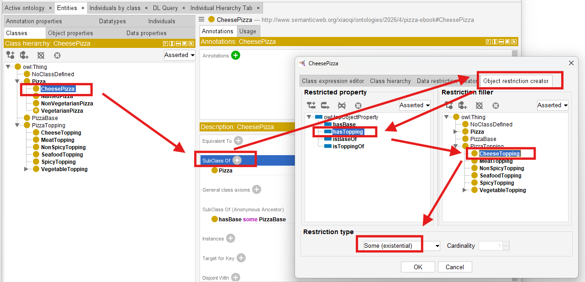

Since `CheesePizza` is SubClass Of `Pizza`, in the result Description screen, you may see the previous Pizza / PizzaBase existential restriction is inherited, as below:

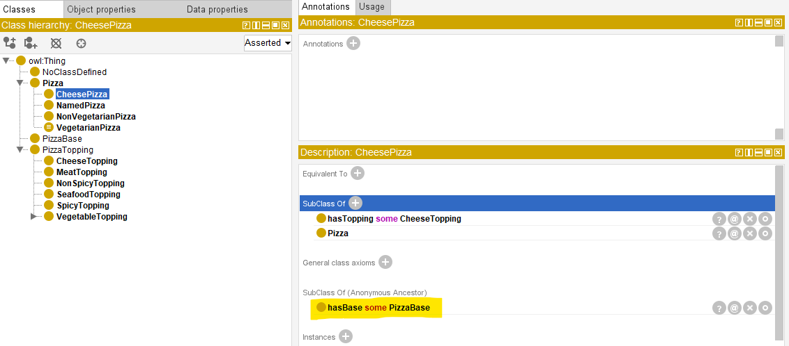

This ensure your ontology grows organically base on the known and true knowledge already have.

With such kind of configuration, your ontolgoy is transformed fundamentally.

Meaning becomes:

> computable.

Reasoners may now determine:

> class membership automatically.

Ontology therefore becomes increasingly **inferential** rather than merely **decriptive!**

This represents one of the earliest moment where ontology begins feeling:

> intelligent.

Because class meaning no longer depends entirely upon:

> human categorization then manually configuration.

Instead:

> **logical semantics drive understanding based on machine-understandable rules.**

Within our `Pizza.owl`, existential restriction is intentionally introduced before more advanced logical restrictions because it establishes the foundational reasoning pattern:

> **required existence.**

Ontology first learns:

> something must exist.

Later chapters will teach ontology:

- what is allowed,
- what is limited, and
- how many relationships are acceptable.

This gradual semantic progression is one reason the `Pizza.owl` tutorial remains such an effective learning path.

Because ontology maturity develops incrementally.

### 14.5.4 View from Open World Assumption (OWA)

Interestingly, OWL reasoners do not immediately assume that a restriction has been violated simply because a required relationship has not yet been observed. In many cases, the absence of information does not necessarily imply semantic inconsistency. This behavior is closely related to one of the most important principles in ontology engineering:

> **Open World Assumption (OWA)**

which assumes that knowledge may still be incomplete.

We will explore this important concept in greater detail later in this chapter, as it fundamentally influences how OWL reasoners interpret existential restrictions and semantic requirements.

## 14.6 Exercise 13 Walkthrough -- Creating Semantic Requirements in Protégé

With the conceptual fondation now established, you are fully ready to perform:

> Exercise 13

inside Protégé.

This exercise represents an important turning point.

For the first time, you begin configuring:

> semantic requirements

rather than merely:

> semantic structure (hierarchies and relationships).

Inside the `Pizza.owl` tutorial, you create existential restrictions using:

> `someValuesFrom`

through the Protégé interface (you already see screen samples in previous section).

At first glance, the interface interaction appears simple.

However, conceptually, something profound is happening.

Ontology is beginning to describe:

> **what a class must satisfy.**

rather than merely:

> what relationships **may** exist.

Inside Protégé, you first select the target class.

Typically, Michael demonstrates this through `pizza` subclasses that require particular toppings.

You then navigates to **`Equivalent Classes`** or `**SubClass Restrictiions**` depending on modeling preference.

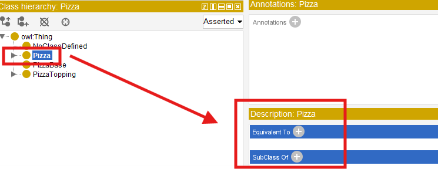

Next, Protégé provides access to:

> Object Restriction Editor.

"Editor" may not the accurate word, see below screen, you may perform more configurations here, including:

- Class expression editor
- Class hierarchy
- Data restriction creator
- Object restriction creator

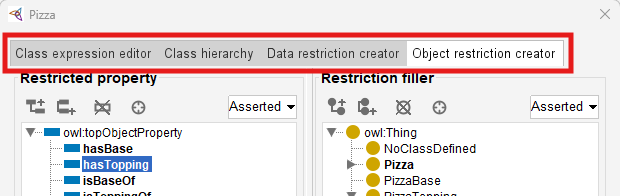

At this stage, switch to actual tab name "Object restriction creator", you may perform folloing steps:

1) Select **Restriction Type**: `Some (existential)` means `someValuesFrom`, it's the default selection when you come to this screen, then
2) Configure **Property** in "Restricted property": `hasTopping`, and finally
3) Configure **Target Class**  in "Restriction filler"

At first encounter, this may look like "Syntax".

However, ontology engineers should resist thinking about this merely as notation.

Because what has actually been created is:

> **semantic logic.**

Ontology now interprets this statement as:

> there must exist at least one topping relationship pointing toward mozzarella topping.

This changes how ontology understands "pizza identity".

A pizza now becomes classified not merely because:

> a human named it,

but because:

> semantic conditions are satisfied.

This subtle shift becomes extremely relies upon:

> inferred meaning.

rather than:

> manually asserted meaning.

=== Mathematical View ===

Let's try to map what you've configured to the previous mathematical formula:

$\exists R.C = \{ x \in \Delta^\mathcal{l} \mid \exists y \in \Delta^\mathcal{l} : (x,y) \in R^\mathcal{l} \land y \in C^\mathcal{l} \}$

The statement:

> `CheesePizza` `hasTopping` some `CheeseTopping`

may have those elements referring to the variables as:

- $\Delta^\mathcal{l}$: the `Pizza` class domain
- $R$: `hasTopping` relationship
- $C$: `CheesePizza` class
- $x,y$: instance of `Pizza` (not `CheesePizza`)

> [!Note] A subtle but important note on x and class definitions:

> In the formula $\exists R.C = \{ x \in \Delta^\mathcal{l} \mid \exists y \in \Delta^\mathcal{l} : (x,y) \in R^\mathcal{l} \land y \in C^\mathcal{l} \}$, the variable x ranges over instances of the class being defined. When you define `CheesePizza` as `Pizza and (hasTopping some CheeseTopping)`, the restriction is evaluated in the context of `Pizza`. This means x is an instance of `Pizza` (not necessarily an instance of `CheesePizza`). The restriction then asks: does this `Pizza` instance have at least one `hasTopping` relationship to a `CheeseTopping`? If yes, the reasoner can infer that the instance is also a `CheesePizza`. This is why x is an instance of `Pizza` in the formula – the restriction acts as a membership test for the subclass, not as a property of the subclass itself.

=== END ===

Exercise 13 therefore marks another maturity transition.

Ontology is beginning to evolve from:

> a semantic graph

toward:

> **semantic intelligence.**

## 14.7 Understanding Reasoning Outcomes -- Asserted vs. Inferred Semantics

After completing Exercise 13 and defining existential restrictions inside Protégé, learners may often encounter an interesting experience:

> the ontology reasoner appears to "know" things that were never manually entered.

At first glance, this may seem surprising.

Especially for readers who are more familiar with **transitional databases** or **graph databases**.

Because in those environments, data generally behaves according to a straightforward principle:

> what is **explicitly** stored is what exists.

Ontology reasoning behaves very differenctly.

Within OWL, semantic meaning is not limited only to:

> manually asserted facts.

Instead, reasoners are capable of producing:

> **inferred knowledge**

through logical interpretation.

This distinction represents one of the most important conceptual shifts in ontology engineering.

Because ontology gradually moves from:

> storing semantic information

toward:

> **deriving semantic meaning.**

To understand this transformation, you must first distinguish between:

**Asserted Semantics** and **Inferred Semantics**.

### 14.7.1 Asserted Semantics -- Explicitly Modeled Knowledge

Asserted semantics represent:

> information explicitly created by ontology engineers.

In other words:

there are semantic statements that humans intentionally model inside Protégé (or other ontology editors).

For example:

Suppose an ontology engineer manually creates (models):

`PizzaA hasTopping MozzarellaTopping`

This relationship becomes:

> asserted knowledge.

Because it was directly entered into the ontology.

Similarly:

if the ontology engineer manually states:

`PizzaA rdf:type NamedPizza`

this classification is likewise **asserted.**

Ontology does not need to infer it.

The semantic meaning already exists because:

> humans explicitly provided it.

From a modeling perspective, asserted semantics resemble:

> manually curated knowledge.

This is conceptually similar to:

> records stored in a database

or:

> relationships stored in a graph database.

However, ontology does not stop there.

### 14.7.2 Inferred Semantics -- Knowledge Derived Through Logic

Unlike asserted knowledge, inferred semantics are **not manually entered.**

Instead, they emerge through **semantic reasoning.**

> [!Note]
> Scared? Does this mean machine starts dominating semantic creation? Terminator? Skynet?... No worry, this is still the governed logic, rooted from human's initial design!

And, this is where existential restriction becomes especially important.

Consider the following ontology definition:

`CheesePizza EquivalentTo: Pizza and (hasTopping some CheeseTopping)`

In Protégé, you may use below steps to add this definition:

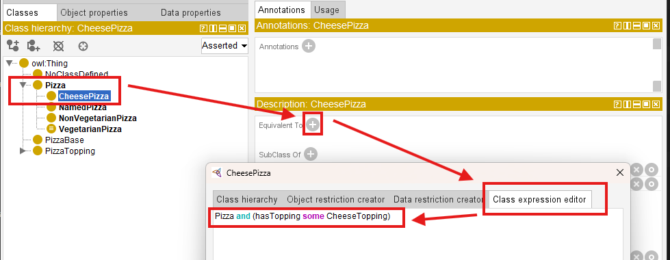

After confirm, you may see this definition uner `Equivalent To`:

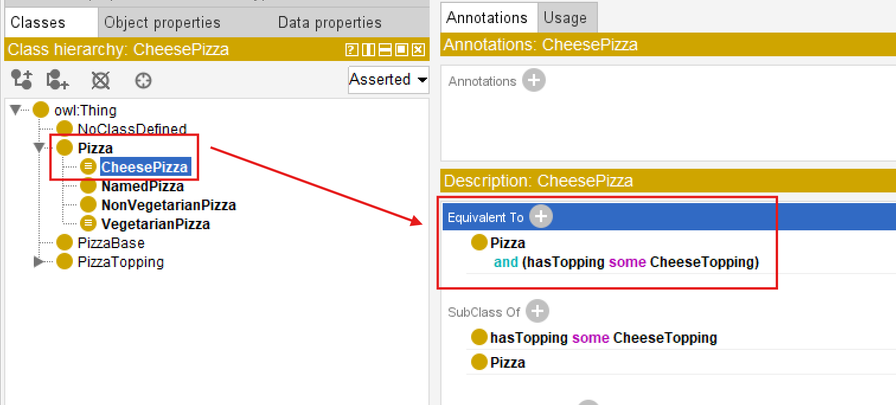

This statement establishes a semantic condition.

Meaning:

> any pizza containing at least one cheese topping qualifies as a `CheesePizza`.

Note here we have the combination of more than one conditions (restrictions).

Now suppose ontology engineers explicitly model:

`PizzaA hasTopping MozzarellaTopping`

And ontology already understand:

`MozzarellaTopping SubClassOf CheeseTopping`.

Interestingly, magic happens:

ontology engineers never explicitly declare:

`PizzaA rdf:type CheesePizza`

Yet after synchronizing the reasoner, Protégé may automatically infer:

`PizzaA rdf:type CheesePizza`

See from below comparison screen:

|||
| --- | --- |
| Before Reasoning | 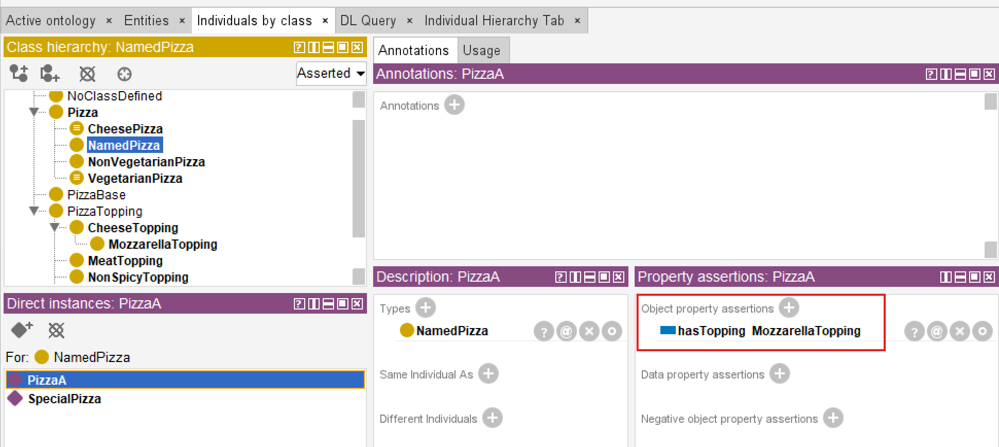 |
| After Reasoning | 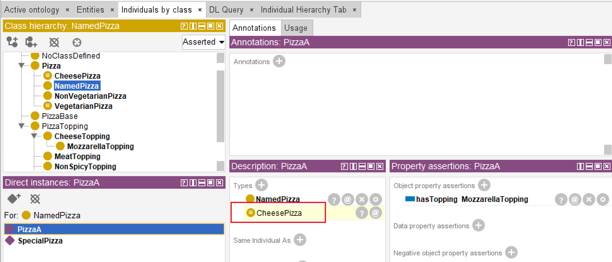 |

This is a significant milestone!

Because ontology has now moved beyond:

> semantic storage

toward:

> **semantic interpretation.**

Meaning becomes **computable**.

The ontology reasoner analyzes:

- subclass hierarchy
- property restrictions
- existential conditions
- logical consistency, and
- **devices new knowledge**

This capability is one of the major distinctions separting ontology from:

> conventional graph data models.

Because ontology is capable of generating:

> **new semantic understanding**

rather than merely retrieving stored relationships.

#### === Interesting Read: Necessary vs. Sufficient Conditions ===

The inference you just witnessed (`PizzaA` automatically classified as `CheesePizza`) depends on a fundamental logical distinction: the difference between **necessary** and **sufficient** conditions.

In Description Logic (the formal language behind OWL):

- **$\texttt{SubClassOf} (\sqsubseteq)$** defines a *necessary* condition.
- **$\texttt{EquivalentTo} (\equiv)$** defines *necessary and sufficient* conditions.

**Mathematical form:**

| Concept | DL Notation | OWL Construct | Logical Direction |
| --- | --- | --- | --- |
| Necessary condition | $C \sqsubseteq D$ | `SubClassOf` | $C(x) \rightarrow D(x)$ |
| Necessary and sufficient condition | $C \equiv D$ | `EquivalentTo` | $C(x) \leftrightarrow D(x)$ |

**Example from this section:**

You defined:
`CheesePizza EquivalentTo Pizza and (hasTopping some CheeseTopping)`

This means:
- **Necessary condition**: If something is a `CheesePizza`, it **must** have a cheese topping.
- **Sufficient condition**: If something has a cheese topping, it **can be inferred** to be a `CheesePizza`.

This is why the reasoner performed *automatic classification*. If you had used `SubClassOf` instead of `EquivalentTo`, the reasoner would **not** perform the reverse inference (from having a cheese topping to classifying as `CheesePizza`).

**Why this matters for your modeling choices:**

| If you want... | Use... |
| --- | --- |
| Only inheritance (one-way) | `SubClassOf` |
| Logical definition with automatic classification (two-way) | `EquivalentTo` |

This distinction is fundamental to ontology engineering. Choosing the wrong construct may lead to unexpected reasoning results (or missed inferences).

=== END ===

### 14.7.3 Why Existential Restriction Enables Inference

At this stage, you may naturally ask an important question:

> Why does existential restriction enable automatic classification?

The answer lies in the semantic meaning of the keyword:

> `some`

which represents:

> **existential quantification.**

Without OWL semantics, the expression `hasTopping some CheeseTopping` does not merely describe:

> a relationship.

Instead, it defines:

> **a logical test condition.**

More specifically, ontology interprets this expression as:

> there must exist **at least one** valid relationship through `hasTopping` pointing to an individual belonging to class `CheeseTopping`.

This subtle distinction is important.

Because ontology is not longer simply storing:

> semantic data,

but rather evaluating:

> **semantic conditions.**

In practice, ontology reasoners perform a process conceptually similar to searching for evidence.

The reasoner examines individuals inside the ontology and asks a logical question:

> "Can I find at least one relationship satisfying this exitential condition?"

Suppose ontology contains:

`PizzaA hasTopping MozzarellaTopping`

and ontology already understands:

`Mozzrellatopping SubClassOf CheeseTopping`

The reasoner may then evaluate: `hasTopping some CheeseTopping` and conclude:

> YES - at least one valid successor individual exists.

This reasoning process may feel surprisingly intelligent, since it makes machine alike human.

However, semantically, the reasoner is performing something conceptually similar to:

> an automated semantic query.

Readers with graph databases experience may recognize an interesting parallel.

Inside Neo4j, a developer might write a Cypher query similar to:

```SQL
MATCH (p:Pizza)-[:HAS_TOPPING]->(t:CheeseTopping)
RETURN p
```

or conceptually:

```SQL
WHERE (p)-[:HAS_TOPPING]->(:CheeseTopping)
```

to locate pizzas having cheese toppings.

Ontology reasoners perform a related form of semantic evaluation.

However, instead of merely returning query results, the reasoner may additionally:

> **derive new semantic classifications.**

Meaning:

if a pizza satisfies the logical condition: `hasTopping some CheeseTopping`, the ontology reasoner may automatically conclude:

> this individual belongs to `CheesePizza` (class).

This introduces an important distinction between **graph traversal** and **semantic reasoning.**

- Graph database primarily discover **existing connections**.
- Ontology reasoners additionally derive **new meaning**!

Another important factor enabling inference is `EquivalentTo`.

Consider the following ontology definition:

`CheesyPizza EquivalentTo Pizza and (hasTopping some CheeseTopping)`

The keyword `EquivalentTo` represents:

> **necessary AND sufficient conditions**

This means the semantic rule works in **both directions.**

Ontology understands:

1. If something is a `CheesePizza`, it must satisfy the topping condition, and also
2. If something satisfies the topping condition, it may be classified as `CheesePizza`.

This bidirectional logic is extremely important.

Because it enables:

> **automatic classification.**

By comparison:

`CheesyPizza subClassOf (hasTopping some CheeseTopping)` would only define:

> a one-way semantic rule.

Meaning:

> every `CheesyPizza` must have cheese toppings,

but ontology would **not automatically infer** that:

> every pizza with cheese toppings becomes `CheesyPizza`.

This subtle modeling distinctions has major consequences for reasoning behavior.

And it highlights an important principles of ontology engineering:

> **small changes in logical constructors may produce significant different inference outcomes.**

Existential restriction therefore becomes one of the foundational mechanisms enabling ontology to evolve from:

> semantic structure

toward:

> **semantic intelligence.**

### 14.7.4 Reasoners Think Logically -- Not Intuitively

One of the most important mindset shifts in ontology engineering is learning that:

> ontology reasoners think logically,

not:

> **intuitively.**

From many learners, this initially feel unfamiliar and sometimes difficult to understand.

Because our humans naturally interpret missing information by making assumptions.

Ontology reasoners, however, do not (or we may also say "never") make assumption.

They follow:

> **formal loggical evidence.**

This distinction becomes especially visible when working with **existential restrictions.**

Consider the following situation.

Suppose an ontology contains an individual `PizzaB` but no topping information has yet been defined.

A human reader may immediately think:

> "If no topping exists, then `PizzaB` is obviously not a `CheesyPizza`, although it has `Pizza` inside the name."

This conclusion feels natural, to humans.

After all, human reasoning frequently relies on:

> incomplete information and educated assumptions.

However, an OWL reasoner behaves differently.

The ontology reasoner does **not infer**:

> `PizzaB rdf:type CheesyPizza`

Yet inportantly: the reasoner also does **not infer**:

> `PizzaB` is *not* a `CheesyPizza`.

Instead, ontology reaches a more comservative conclusion:

> **there is currently insufficient information to determine classification.**

In other words, the ontology simply says:

> **"I do not know yet."**

This behavior often surprises beginners.

Especially those with experience in

> relational databases,

> business rules engines,

or:

> graph databases.

Because many traditional systems implicitly follow a different assumption:

`Missing information = false`

Ontology reasoning, however, follows one of the most important principles in semantic modeling:

> **Open World Assumption (OWA)**

Under OWA: missing information does not imply **falsity.**

Instead, ontology assumes **knowledge may still be incomplete**.

Meaning:

> future information may still arrive, just not available for now yet.

For example:

The ontology may later receive `PizzaB hasTopping MozzarellaTopping` and ontology already understands `MozzarellaTopping SubClassOf Cheesetopping`.

At that moment, the reasoner may suddenly infer:

`PizzaB rdf:type CheesyPizza`

What has been changed?

Not the logical rule.

Only:

> **the available evidence (information).**

Ontology reasoning therefore behaves less like:

> guessing,

and more like:

> **evidence-based semantic evaluation.**

This distinction becomes clearer when comparing **Human Intuition** vs **OWL Reasoning**:

| Human Intuition | OWL Reasoning Logic |
| --- | --- |
| No topping observed $\rightarrow$ probably not cheese pizza | No evidence observed (got) $\rightarrow$ classification postponed |
| Missing information suggest absense | Missing information may simply be incomplete |
| Infer based on assumptions | Infer based on formal evidence |

Notice the key difference?

OWL reasoners do not ask "What is most likely true?"

Instead, they ask "What can be logically justified?"

This distinction becomes especially important when working with:

> existential restrictions.

Earlier in this chapter, we defined:

`CheesyPizza EquivalentTo: Pizza and (hasTopping some CheeseTopping)`

The keyword `EquivalentTo` defines:

> **necessary and sufficient conditions.**

Meaning:

> ontology interprets the definition in **both directions.**

This enables the reasoner to conclude:

> if a pizza satisfies the existential condition, then it may be classified as `CheesyPizza`.

However, imagine the ontology instead used:

`CheesyPizza SubClassOf (hastopping some CheeseTopping)`

This semantic meaning changes significantly.

Now ontology only understands:

> every `CheesyPizza` must satisfy the topping restriction.

But ontology can no longer conclude:

> every pizza satisfying the restriction automatically becomes `CheesyPizza`.

The inference direction becomes **one-way only.**

This subtle distinction between `EquivalentTo` and `SubClassOf` has major consequences for ontology behavior.

It also hightlights an important enginnering lesson:

> ontology reasoners execute logic exactly as modeled

while NOT:

> as human intended.

For ontology engineers, this carries important practical implications.

Semantic models must be designed **precisely** with careful attentions to:

- logical meaning,
- restriction semantics, and
- inference consequences.

At the same time, Open World Assumption provides an important advantage.

Because enterprise knowledge is often:

- incomplete,
- distributed, or
- continuously evolving.

OWL therefore remains hightly suitable for enterprise knoweldge graphs, semantic integration, and executable intelligence systems when meaning must gradually emerge from **accumulating knowledge** rather than requiring perfect information from the beginning.

As you continue through this chapter, Open World Assumption will become increasingly important for understanding:

> why ontology reasoners sometimes appear surprisingly conservative,

yet remain remarkably powerful in semantic interpretation.

## 14.8 Univeral Restriction -- Understanding `only`

In the previous sections, you explored:

> **existential restriction (`some`)**

and discovered one of the most important ideas in ontology engineering:

> ontology can define not only what exists,

but also:

> what **must** exist.

For example, the expression `hasTopping some CheeseTopping` allows ontology to express a meaningful semantic requirement:

> every pizza **must** contain at least one cheese topping.

This is already a major conceptual shift.

Because ontology is no longer behaving merely as a relationship repository or a connected graph structure. Instead, ontology begins acting as:

> a semantic rule system.

Meaning:

relationships are no longer interpreted only as:

> stored facts,

but also as:

> logical conditions.

At this point, you may reasonably feel:

> "I understand how ontology can require something to exist."

However, a second and equally important modeling problem soon appears.

Ontology engineers must also ask:

> **How can we control what kind of things are allowed to exist?**

This distinction may initially appear subtle.

Yet it fundamentally changes how semantic system behave.

In real-world enterprise environments, data quality problems rarely emerge only bacause:

> required information is missing.

More often, problems emerge because:

> incorrect relationships are introducted.

For example:

An employee may accidently be linked to:

> a business application

instead of

> a department.

A customer may mistakenly belong to:

> a linux server infrastructure.

A business capability may incorrectly be realized by:

> a physical office location.

In all these cases:

> relationships exist,

but:

> semantic (meaning) correctness is violated.

Ontology therefore requires more than **participation rules**, it also requires **semantic boundaries.**

Existential restriction helps ontology answer：

> **What kinds of things are semantically allowed?**

To solve this challenge, OWL introduces another important semantic constructor **Universal Restriction** represented in Protégé using `only` and formally implemented through `allValuesFrom`.

First, have a look that it's just under the existential (some) type in Protégé:

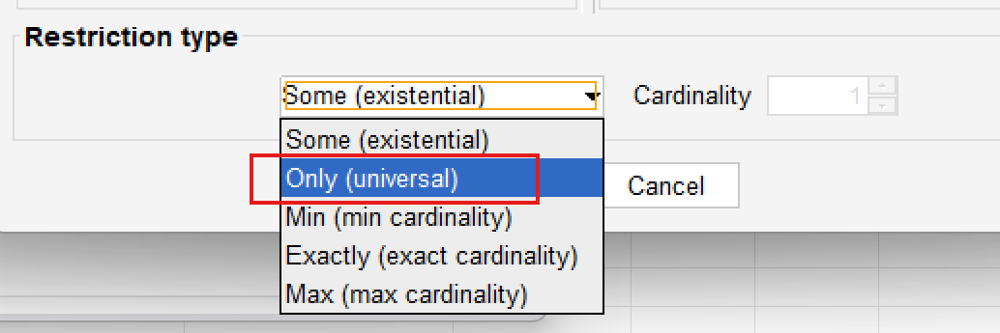

Unlike existential restriction, which focuses on:

> **existence** (by its naming),

universal restriction focuses on:

> **constraint.**

More specifically:

ontology moves from:

> semantic participation

toward:

> **semantic goverance.**

This makes an important evolution in ontology engineering.

Because semantic systems gradually stop asking only:

> "What relationships should exist?"

and being asking:

> "Are existing relationships semantically valid?"

As ontology models scale toward:

- enterprise knowledge graphs,
- semantic integration platforms, and
- executable intelligence systems,

this distinction becomes increasingly important.

Ontology therefore evolves from:

> connected knowledge

into:

> **governed semantic knowledge.**

### 14.8.1 From Existence to Constraint -- Why `only` is Needed

To understand why universal restriction exists, let us firse examine an important limitation of existential restriction.

Suppose we define the following semantic requirement:

`hasTopping some VegetableTopping`

Ontology now understands:

> a pizza must contain **at least one** vegetable topping.

At first glance: this may appear sufficient for describing a:

> vegetarian pizza.

After all: ontology can already validate:

> whether vegetable participation exists.

However, consider the following scenario.

Suppose ontology contains:

```
PizzaA hasTopping MushroomTopping
PizzaA hasTopping ChocolateTopping
```

Since `MushroomTopping` belongs to `VegetableTopping`, the existential condition succeeds.

Ontology correctly observes:

> at least one vegetable topping exists.

Yet something still feels wrong.

Because the same pizza also contains `ChocolateTopping` which clearly violates:

> common semantic expectations of vegetarian pizza.

This example reveals an important limitation.

Existential restriction successfully validates:

> **minimum participation**

But it does **NOT regulate semantice boundaries.**

Ontology can confirm:

> something acceptable exists.

But onotlogy still cannot answer:

> are all relationships semantically appropriate?

This distinction becomes increasingly important in enterprise modeling.

Consider an ontology according to employee.

Suppose the architect define:

`Employee SubClassOf (belongsToDepartment some Department)`

Ontology now ensures:

> every employee belongs to at least one department.

This is useful.

However, ontology still allows situations such as:

`Employee_A belongsToDepartment Product_X`

or:

`Employee_A belongsToDepartment DataCenter_01`

which are semantically incorrect.

The relationship exist, but the meaning becomes **polluted.**

Ontology therefore requires another mechanism.

Not merely to say:

> something valid exists.

But to say:

> **everything involved must remain semantically valid.**

This is where **universal restriction (`only`)** becomes necessary.

A useful way to think about the distinction is:

- `some` $\rightarrow$ minimum semantic participation
- `only` $\rightarrow$ semantic boundary enforcement

Or more simply:

- `some` $\rightarrow$ something valid must exist
- `only` $\rightarrow$ everything must conform

This transition represents an important maturity step in ontology thinking.

Ontology is no longer merely asking:

> "What should be present?" *-- by existentical restriction*

It now also asks:

> **"What should be permitted?** *-- by universal restriction*

In enterprise terms:

- `some` ensures a **business rule**: e.g. "Every application must have an owner."
- `only` ensures **data quality**: e.g. "Every owner must belong to the class `Employee` (not `Department`, not `Supplier`)."

Both are needed.

One without the other leaves the ontology incomplete.

### 14.8.2 The Semantics of `only` -- "All Must Be" vs. "Only Allowed"

Universal restriction introduces a very different form of semantic logic.

Consider the OWL expression: `hasTopping only PizzaTopping`

At first glance, many learners interpret this expression incorrectly.

A common misunderstanding is:

> "This pizza must contain pizza toppings."

However, this interpretation is **semantically** inaccurate.

The keyword `only` does **NOT require existence.**

Instead, it constraints:

> the semantic type of relationship **if they exist.**

More precisely, ontology interprest the expression as:

> **IF** toppings exist, every topping must belong to the class `PizzaTopping`.

Notice the subtle difference?

Ontology is **not saying**:

> toppings MUST EXIST.

Ontology is only saying:

> whenever toppings exist, they must satisfy semantic expectations.

*The hidden meaning is:*

> *if toppings are not existed, I do not care since that's not triggerring inference.*

This distinction is extremely important.

Because ontology engineers often **unconsciously** interpret `only` using:

> natural language intuition.

In ordinary English:

> "only pizza toppings" often sounds like **mandatory presense.**

But OWL semantics behave differently!

Ontology reasoners interpret:

> `hasTopping only PizzaTopping`

as:

> a semantic limitation,

not:

> an existence requirement.

A useful mental model is to image `only` as:

> a semantic type checker.

In programming languages, type systems help ensure:

> data conforms to expected formats.

For example:

> an integer field should NOT suddenly contain **a text string**.

Similarly:

univeral restriction ensures ontology relationships remain:

> semantically consistent.

Ontology therefore uses `only` to establish:

> **relationship type safety.**

This idea connects naturally back to Chapter (13) -- Domain and Range.

At first glance, Domain/Range and universal restriction may appear similar.

Because both attemp to improve:

> semantic correctness. (kind of governance)

However, they operate at different levels.

| | Domain and Range | Universal Restriction |
| --- | --- | --- |
| Definition | Define "structural expectations". | Rather than describing "relationship design", it evaluates "actual semantic behavior". |
| Example | `hasTopping`<br>`Domain: Pizza`<br>`Range: PizzaTopping` | `hasTopping only PizzaTopping` |
| Question Asked | "What relationship types are structurally expected?" | "Do all existing relationships remain semantically valid?" |
| Action | Act like "a schema-level semantic rule` | Evaluate "actual semantic behavior |
| Meaning | Ontology expects "pizzas should connect to pizza toppings" | Ontology expects "whenever pizza toppings exist, the semantic expectations must be satisfied" |

This distinction is especially important for:

> enterprise knowledge governance.

Because semantic quality is rarely protected by **structure alone**.

Instead, ontology must continuously evaluate **relationship meaning.**

Universal restriction therefore behaves like:

> **semantic runtime governance.**

rather than merely structural design.

### 14.8.3 The Critical Differece -- `some` vs. `only`

At this stage, you should clearly recognize that:

> existential restriction (`some`)

and:

> universal restriction (`only`)

are not interchangeable.

Although their syntax may initially appear similar, they represent fundamentally different forms of semantic logic.

Understanding this distinction is one of the most important milestoners in ontology engineering.

Because many ontology beginners mistakenly assume `some $\approx$ only` and simply treat them as:

> different OWL keywords.

In reality, they answer **completely different** semantic questions.

Existential restriction asks:

> **"Does at least one qualifying relationship exist?"**

While universal restriction instead asks:

> **"if relationships exist, do they all satisfy semantic expectations?"**

This distinction may appear subtle.

Yet it fundamentally changes:

- reasoning behavior,
- inference outcomes, and
- semantic interpretation.

The following comparison provides a useful summary:

| Characteristic | `some` (Existential Restriction) | `only` (Universal Restriction) |
| --- | --- | --- |
| Core Question | "Must at least one relationship exist?" | "If relationships exist, must they all belong to a certain class?" |
| Semantic Meaning | Minimum existence requirement | Semantic limitation / boundary |
| Creates | Requirement | Constraint |
| Logical Role | Participation condition | Semantic governance |
| Reasoner Behavior | Searches for valid evidence | Searches for invalid evidence |
| Behavior with No Relationship | Not satisfied | Satisfied (don't care) |
| Example | `hasTopping some VegetableTopping` | `hasTopping only PizzaTopping` |

One of the most powerful way to understand the distinction is through:

> **reasoner behavior.**

When ontology evaluates `hasTopping some CheeseTopping`, the reasoner behaves almost like:

> a semantic search engine.

Its task becomes **finding evidence.**

More specifically, the reasoner here asks:

> "Can at least one topping be found that belongs to `CheeseTopping`?"

If ontology identifies `MozzarellaTopping` or `ParmesanTopping`, then the condition succeeds.

Means ontology has found:

> qualifying semantic evidence.

Universal restriction behaves very differently.

Consider `hasTopping only PizzaTopping`, here the reasoner is not searching for **evidence of success.**

Instead, it searches for **evidence of violation!**

The reasoner effectively asks:

> "Do any topping violate semantic expectations?"

If ontology discovers `ChocolateBar` connected through `hasTopping`, while `ChocolateBar` does not belong to `PizzaTopping`, then semantic inconsistency may emerge.

A memorable mental model is:

- `some` $\rightarrow$ `search for qualifying evidence`
- `only` $\rightarrow$ `search for violating evicence`

This distinction becomes extremely useful when ontology models grow larger, into the enterprise scale.

Because enterprise semantic systems increasingly depend upon:

> automated validation

rather than:

> manual review.

Another important difference appears when:

> no relationship exists.

Suppose ontology contains `Pizza_B` with no toppings currently defined.

Would the following condition succeed?

`hasTopping some CheeseTopping`

The answer is:

> **NO.**

Because ontology cannot find evidence showing:

> at least one cheese topping exists.

Existential restriction therefore fails.

Now consider:

`hasTopping only PizzaTopping`

Surprisingly:

> ontology still considers the restriction satisfied.

Why?

Because ontology now finds:

> no invalid toppings.

Universal restriction asks:

> "If toppings exist, are they semantically valid?"

When no toppings exist:

> no violation can be observed.

In formal logic, this behavior is called **vacuous truth**.

Meaning:

> a universal condition remains ture unless a counterexample exists.

You do not need to memorize this mathematical term immediately. (see Interesting reading for reference)

However, understanding the behavior is extremebly important.

Because it reveals something fundamental:

> OWL reasoners think logically -- not intuitively.

Human may instinctively say:

> "A pizza without toppings should fail pizza rules."

But ontology behaves differently.

Ontology instead says:

> "No invalid topping exists, therefore no contradiction has been observed."

This distinction becomes increasingly important as learners transition from:

> data modeling

toward:

> logical knowledge modeling.

A useful summary is:

- `some` $=$ `at least one valid relationship must exist`
- `only` $=$ `all relationships must remain semantically valid`

Together, these relationships provide ontology with both:

> participation logic

and:

> semantic discipline.

#### ==== Interesting Reading: Vacuous Truth in Formal Logic ===

The behavior of `only` when no relationship exists -- i.e., it is automatically satisfied -- is not an arbitrary design choice. It follows a fundamental principle in formal logic called **vacuous truth**.

<h3>What is Vacuour Truth?</h3>

In classical logic, a statement of the form:

> *"If $P$, then $Q$"* (written as $P \rightarrow Q$)

is considered **true** whenever the condition $P$ is **false** -- regardless of whether $Q$ is ture or false.

This is not a convention.

It is a logical necessity to avoid contradictions and to preserve the integrity of implication.

**Example in everyday reasoning**:

> *"If it rains, then the ground will be wet.*

If it does **not** rain, the statement is still considered **true** (vacuously true). It makes no claim about the ground's wetness when it doesn't rain. It only promises that *whenever* it rains, wetness follows.

<h3>How Vacuous Truth Applies to "only"</h3>

Recall the semantic meaning of `only`:

> *"If a pizza has a topping, then that topping must be `PizzaTopping`.*

This is a logical implication:

> `hasTopping(pizza, topping)` $\rightarrow$ `PizzaTopping(topping)`

| Scenario | Pizza has topping? | Topping is PizzaTopping? | Implication (Vacuous Truth) |
| --- | --- | --- | --- |
| `Pizza` has `MushroomTopping` | ✅ True | ✅ True | **True** (satisfied) |
| `Pizza` has `ChocolateTopping` | ✅ True | ❌ Fales | **Fales** (violated) |
| `Pizza` has **no** toppings | ❌ False | (not evaluated) | **True** (vacuously satisfied) |

The third row is **vacuous truth**. Because the condition "pizza has a topping" is false, the overall `only` rule is automatically satisfied. The ontology does **not** compliain about missing toppings.

<h3>Why Does Logic Include Vacuous Truth?</h3>

Without vacuous truth, logical implication would break down.

Consider the statement:

> *"All humans who can fly are astronauts.*

If there are no humans who can fly, the statement is considered **true** still.

It does not falsely claim that some flying humans exist. It simply states a conditional relationship that happens to be trivially satisfied because the condition never occurs.

This same principle allows `only` to act as a **pure constraint**, not an existence requirement. It governs the *type* of relationships *if they exist*, without forcing them to exist.

<h3>Mathematical Form</h3>

In first-order logic, the universal restriction $\forall x \; (R(x) \rightarrow C(x))$ is **vacuously true** when there is no $x$ that satisfies $R(x)$.

This is written as:

> $\forall x \in \phi, \; C(x)$ is always true.

Or equivalently:

> $\neg \exist x \; (R(x) \land \neg C(x))$

No counterexample exists $\rightarrow$ the statement is true still.

<h3>Why This Matters for Ontology Engineering?</h3>

- `only` **does not require existence** -- it only constrains what can exist.
- `some` **requires existence** -- it actively searches for at least one example.

Understanding vacuous truth prevents the common mistake of expecting `only` to behave like `some`.

> *"Vacuous truth is not a loophole! It is a logical feature that allow `only` to be a pure constraint, not a disguised requirement.*

==== END ====

### 14.8.4 Universal Restriction in Protégé -- `only` as a Semantic Guardian

Have understood the semantic meaning of `only` from both "**logical**" and "**mathematical**" perspective, you are now ready to observe how universal restriction behaves inside Protégé.

As first glance, universal restriction may appear very similar to concepts introduced earlier in Chapter (13) -- Domain and Range.

Because both mechanisms seems to control:

> semantic correctness.

However, both their behavior and purpose are fundamentally different.

- Domain and Range primarily define **structural expectations.**
- Universal restriction instead evaluates **logical consistency.**

This distinction becomes easier to understand through experimentation, in our Protégé.

Suppose we define the following restriction for `Pizza` inside **`SubClass Of`** using:

> `hasTopping only PizzaTopping`

*Note: Since our [common RDF workbook (pizza-ebook.rdf)](./rdf/pizza-ebook.rdf) had been already configured `some` when we practice existential constraint, to support this section without misleading, I'm clean unnecessary setting and create in one separate workbook called [pizza-ebook_14.8.4](./rdf/pizza-ebook_14.8.4.rdf).*

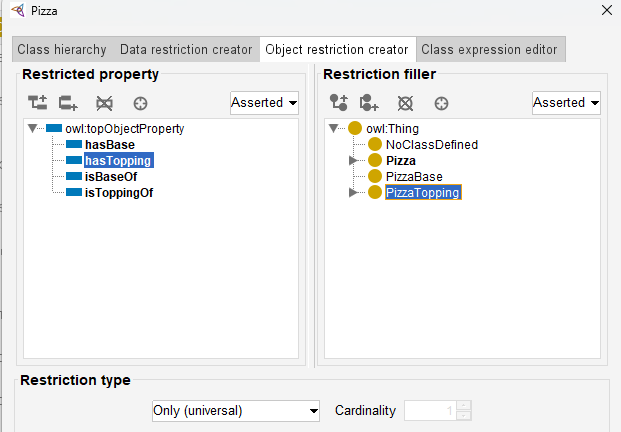

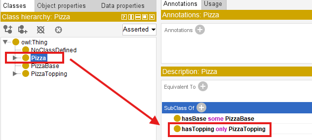

This expression tells ontology:

> whenever a pizza contains toppings, all toppings must belong to `PizzaTopping`.

Notice again: ontology is **NOT requiring toppings to exist!**

Instead, ontology governs:

> the semantic validity of toppings if they exist.

To better understand this behavior, let us intentionally construct:

> semantically problematic data.

Create an individual such as `StrangePizza` under `NamedPizza`:

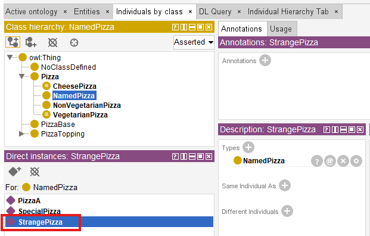

Then create another individual `ChocolateBar` that does **NOT** belong to `PizzaTopping`, let's create under our previous class `NoClassDefined` for simplicity:

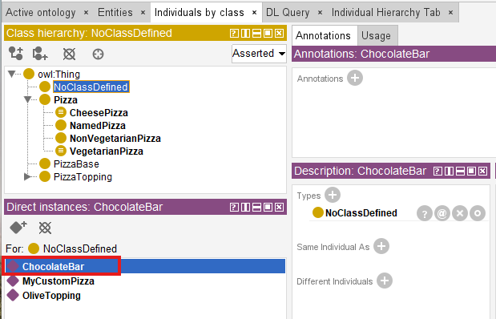

Now connect them through `StrangePizza hasTopping ChocolateBar` relationship:

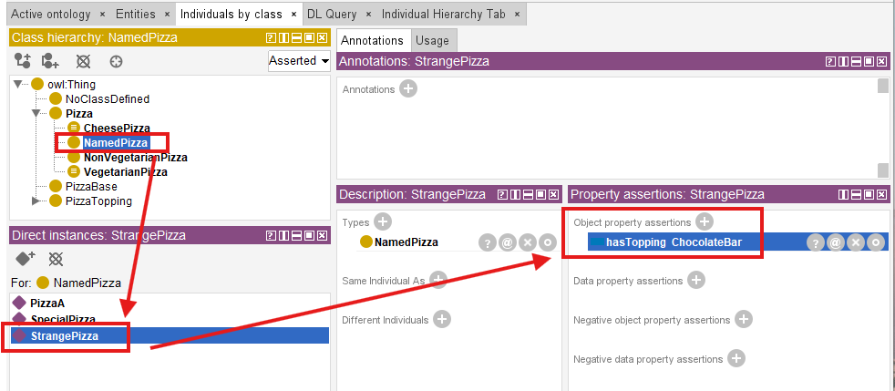

At first, Protégé may not immediately indicate a problem.

This sometimes indeed surprises beginners.

Because ontology editors often separate:

> assertion

from:

> reasoning.

Protégé first records:

> stated knowledge.

Only after synchronization does the **reasoner** begin:

> evaluating semantic consequences.

Once the reasoner executes:

> ontology starts logically evaluating the restriction.

Importantly, the reasoner does **NOT** ask:

> "Does this pizza have toppings?"

Instead, it asks:

> "Do all toppings satisfy the expected semantic type?"

This distinction matters!

Because ontology validation focuses on **meaning**, not merely **existence**.

Depending on how the ontology is modeled, several outcomes may occur.

The reasoner may identify **inconsistency**, **unsatisfied class membership**, or **classification failure**.

The exact behavior depends upon whether **disjointness**, **equivalent classes**, or **additional constraints** exist elsewhere in the ontology.

This experiment reveals an important ontology engineering principle:

> universal restriction behaves like a semantic quality monitor.

Rather than merely storing connected relationships, ontology continuously evaluates:

> whether relationships remain semantically trustworthy.

For enterprise architects, this idea is particularly important.

Because many enterprise systems fail not because:

> their relationships are absent,

but because:

> relationships become semantically **polluted**.

Let us look at one example:

an enterprise graph may technically allow following relationship:

`Employee belongsToDepartment Server01`

The relationship exists.

The database accepts it. (Base on the schema design.)

Yet semantically, the meaning is incorrect.

Universal restriction provides a mechanism for ontology to detect such kind of:

> **semantic drift**

before invalid meaning propagates throughout enterprise knowledge models.

A useful way to summarize the distinction is:

- `Range` $\rightarrow$ relationship expectation
- `only` $\rightarrow$ semantic validation

This is why `only` often behaves like:

> a semantic guardian.

Protecting ontology not from **missing data**, but from **"incorrect meaning**.

#### === Interesting Reading: Semantic Drift in Enterprise Knowledge Models ===

Universal restriction (`only`) provides a mechanism for ontology to detect **semantic drift** before any invalid meaning propagates throughout enterprise knowledge models.

Semantic drift occurs when a relationship gradually deviates from its intended meaning over time, often through incremental, seemingly harmless assertions.

For example, an ontology initially enforces:

`Application hostedOn only Infrastructure`

Over months of maintenance, a modeler adds:

`Application hostedOn VendorContract`

Because no `only` constraint was defined for `hostedOn`, the ontology silently accepts this new relationship. Over time, the semantic boundary erodes ("poisoned"). Queries that rely on `hostedOn` to locate `infrastructure` now return `VendorContract`s, breaking impact analysis, security compliance, and also dependency tracing.

**Formally**, semantic drift can be defined as:

> *A gradual violation of the universal restriction $\forall R.C$ where the set of observed relationships $R(x,y)$ expands to include individual $y$ that are not in the intended target class $C$, without the ontology detecting the violation.*

Universal restriction acts as a **semantice invariant**.

The reasoner continuously evaluates:

$\forall x,y: (x,y) \in R \rightarrow y \in C$

If a counter-example appears, the ontology flags an inconsistency or prevents the invalid relation ship from being trusted. This transforms ontology from a passive schema into an active **semantic guardian**, capable of detecting and preventing meaning erosion at scale.

In an enterprise environment, where thousands or millions of relationships may be added/updated by different teams over years, universal restriction becomes an essential tool for maintaining **semantic integrity** across the entire knowledge graph.

=== END ===

## 14.9 Combining `some` and `only` -- The Classis `VegetarianPizza` Pattern

At this stage, you may naturally being asking an important question:

> If existential restriction (`some`) and universal restriction (`only`) solve different semantic problems, can ontology combine them?

The answer is:

> **Yes -- and this is where ontology becomes significantly more powerful!**

In practical ontology engineering, meaningful concepts are rarely defined through **a single restriction.**

Instead, ontology begins expressing:

> **semantic identity through combinations of logical constraints.**

One of the most well-known examples appears in `VegetarianPizza`.

Consider the following OWL definition:

```sql
VegetarianPizza EquivalentTo
Pizza
and (hasTopping some VegetableTopping)
and (hasTopping only VegetableTopping)
```

Reflect into Protégé, as below setting:

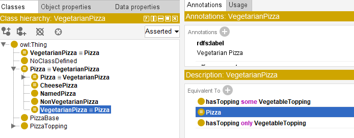

At first glance, this expression may appear repetitive.

After all, both restrictions reference `VegetableTopping`.

However, each restriction performs a completely different semantic role.

- `hasTopping some VegetableTopping` ensures that **at least one** vegetable topping exists.
- `hasTopping only VegetableTopping` ensures that **every** topping must be a vegetable.

Neither alone is sufficient. Only the combination of `some` and `only` creates a complete semantic definition.

To understand why both are necessary, it wold be helpful to first examine:

> why isolated restrictions are incomplete.

### 14.9.1 Why `some` Alone Is Not Enough?

Suppose ontology only defines `hasTopping some VegetableTopping`, this means:

> at least one vegetable topping must exist.

At first glance, this may seem sufficient to describing:

> a vegetarian pizza.

However, consider the following situation:

```
PizzaA hasTopping MushroomTopping
PizzaA hasTopping PepproniTopping
```

Ontology evaluates `hasTopping some VegetableTopping` and immediately **succeeds.**

Why?

Because ontology finds:

> qualifying evidence.

The pizza contains `MushroomTopping`.

Then the existential condition therefore succeeds.

However, the pizza still contains `PepperoniTopping`, which clearly violates **vegetarian meaning.**

This illustrates an important ontology engineering lesson:

> existential restriction validates **participation** -- NOT semantic purity.

Or more simply, `some` ensures:

> something accetable exists.

But it does **NOT** ensure:

> everything remains acceptable.

The reasoner asks:

> "Can qualifying evidence be found?"

It does **NOT** ask:

> "Are there any violations?"

Semantic meaning therefore remains incomplete.

### 14.9.2 Why `only` Alone Is Not Enough

Now consider the opposite situation.

Support ontology defines `hasTopping only VegetableTopping`.

This restriction states:

> if toppings exists, they must all belong to `VegetableTopping`.

At first glance, this appears semantically stronger.

However, a subtle logical problem emerges.

Image `PizzaB` with no toppings at all.

Surprisingly, ontology still consider `hasTopping only VegetableTopping` to be **satisfied.**

Why?

Because ontology searches for:

> violating evidence.

and in this case:

> no violating topping exists.

This follows the mathematical principle introduced earlier:

> **vacuous truth.**

In formal logic, a universal statement remains **true** unless:

> a counterexample exists.

Ontology therefore concludes:

> nothing violates the rule.

However, from a human perspective, an empty pizza may not intuitively feel like:

> a valid vegetarian pizza.

This highlights an important distinction:

> reasoners think **logically** -- **NOT** intuitively.

Universal restriction provides:

> semantic discipline.

But it does **NOT require participation.**

### 14.9.3 Why Logical Compsition Matters

Ontology becomes significantly more expressive when both restrictions are combined.

Consider again:

```sql
VegetarianPizaa EquivalentTo
Pizza
and (hasTopping some VegetableTopping)
and (ahsTopping only VegetableTopping)
```

Together, the restrictions now express two independent requirements:

1. **At least one vegetable topping must exist**, and
2. **All toppings must remain vegetable toppings**.

The first restriction guarantees:

> semantic participation.

The second restriction guarantees:

> semantic consistency.

Only together do they express:

> authentic vegetarian meaning.

This reveals one of ontology engineering's most important principles:

> **meaning rarely emerges from a single rule.**

Instead:

> **meaning emerges from the interaction of multiple logical restrictions.**

A useful mental model can be thought as:

- `some` $\rightarrow$ participation
- `only` $\rightarrow$ discipline

Together, they produce:

> **semantic identity.**

Ontology therefore moves beyond:

> relationship storage

toward:

> governed conceptual meaning.

This is one of the reasons ontology differs fundamentally from traditional databases.

Databases typically store **facts**.

Ontology additionally governs **what facts mean**.

## 14.10 Implementing `some` and `only` in Graph Database - A Neo4j Perspective

At this point, you may reasonably ask:

> If existential and universal restrictions are so powerful, can similar logic be implemented in a graph database such as Noe4j?

The answer is:

> **Yes -- but with important limitations.**

This distinction is particularly important because many enterprise practitioners initially assume:

> **Neo4j = Ontology**

or:

> **Knowledge Graph automatically means semantic intelligence.**

In reality, graph databases and ontologies solve fundamentally different problems.

Neo4j primarily manages **connected data.**

Ontology additionally governs **logical meaning**. (note the "additionally" wording)

A graph database excels at:

- relationship storage,
- graph traversal, and
- connected querying.

However, Neo4j does not natively understand $\exist R.C$ or $\forall R.C$, nor does it automatically infer:

- class membership,
- semantic consistency, or,
- logical identity.

Instead, engineers must explicitly implement semantic behavior through:

> **Cypher queries.**

This becomes easiers to understand using `VegetarianPizza`.

Suppose Neo4j contains below relationship:

```sql
(:Pizza)-[:HAS_TOPPING]->(:Topping)
```

You can use below Cypher to create these 2 nodes and 1 relationship (note: this is just for demo purpose, using below query you'll create two actual instances as well):

```sql
CREATE (:Pizza)-[:HAS_TOPPING]->(:Topping)
```

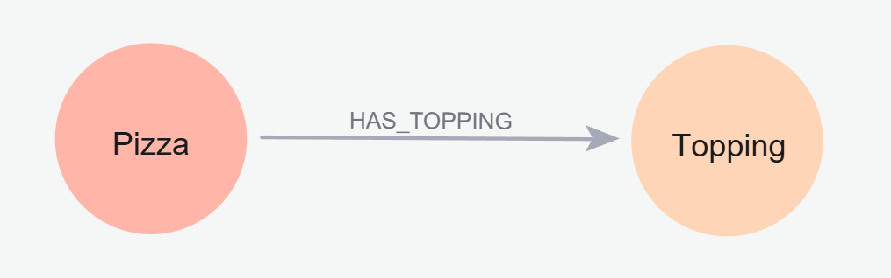

A pizza may connect to `MushroomTopping`, `TomatoTopping`, or `PepperoniTopping`.

Following Cypher queries are used to create these new relationships:

```sql
MERGE (p1:Pizza {name:"MyPizza1"})
MERGE (p2:Pizza {name:"MyPizza2"})
MERGE (p3:Pizza {name:"MyPizza3"})
MERGE (t1:Topping {name:"MushroomTopping"})
MERGE (t2:Topping {name:"TomatoTopping"})
MERGE (t3:Topping {name:"PepperoniTopping"})
MERGE (p1)-[:HAS_TOPPING]->(t1)
MERGE (p2)-[:HAS_TOPPING]->(t2)
MERGE (p3)-[:HAS_TOPPING]->(t3)
```

Then using below query to extract them:

```sql
match p=(()-[]-()) return p
```

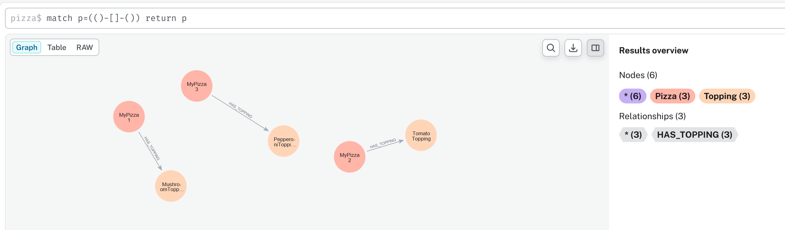

Neo4j itself does not automatically determine:

> whether the pizza qualifies as vegetarian.

Instead, semantic interpretation must be manually implemented.

> [!Tip] You may find the working Neo4j dump database in ebook's `/neo4j` subfolder.

### 14.10.1 Implementing Existential Restriction (`some`) in Neo4j

Recall earlier `hasTopping some VegetableTopping` means:

> at least one vegetable topping **must** exist.

In mathematical notation: $\exist \: hasTopping.VegetableTopping$.

This expression asks:

> "Can qualifying evidence be found?"

Inside Neo4j, this behavior can be approximated using:

```sql
MATCH (p:Pizza)
WHERE EXISTS {
  MATCH (p)-[:HAS_TOPPING]->(:VegetableTopping)
}
RETURN p.name AS Pizza
```

To practice above query, we need to add `VegetableTopping` as another node in Noe4j, then double assign `MushroomTopping` and `Tomatotopping` to this new node:

```sql
MATCH (n:Topping {name:"MushroomTopping"}), (m:Topping {name:"TomatoTopping"})
SET n:VegetableTopping 
SET m:VegetableTopping
RETURN m, n LIMIT 25;
```

After above preparation, using `CALL db.schema.visualization`, you can see below schema:

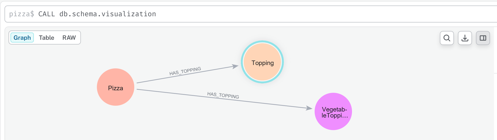

Now, you may execute previous Cypher query, and get result `MyPizza`:

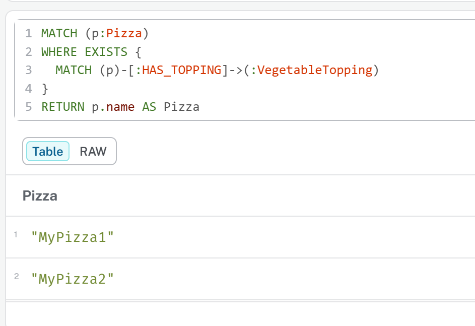

Notice the similarity.

The Cypher keyword `EXISTS` functions conceptually like:

> existential search.

Neo4j asks:

> "Does there exist at least one path to `VegetableTopping`?"

If answer is Yes, the pizza satisfies the condition.

However, an important difference remains.

Neo4j executes **an explicit query.**

While ontology instead performs **automatic reasoning.**

Once semantic restrictions are defined, the reasoner continuously evaluates:

> logical consequences.

Not require engineers repeatly writing validation logic like in Neo4j.

### 14.10.2 Implementing Universal Restriction (`only`) in Neo4j

Now consider: `hasTopping only VegetableTopping`.

In mathematical notation: $\forall \: hasTopping.VegetableTopping$.

Unlike existential restriction, universal restriction asks:

> "Are all relationships semantically valid?"

This creates an interesting challenge.

Neo4j has no direct equivalent for $\forall$, instead, universal semantic are typically approximated through:

> **violation detection.**

Rather than proving **everything is valid.**

Neo4j attempts to prove **nothing invalid exists** (or say "nothing is not invalid")

For example below Cypher query:

```sql
MATCH (p:Pizza)
WHERE NOT EXISTS {
  MATCH (p)-[:HAS_TOPPING]->(t)
  WHERE NOT t:VegetableTopping
}
RETURN p.name AS VegetarianCandidate
```

You may see below result:

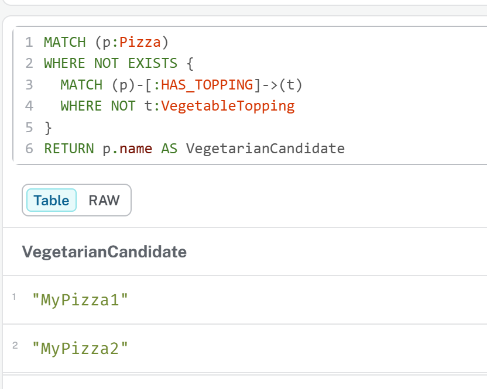

> [!Note] Why here still `MyPizza1` and `MyPizza2`?

This query asks:

> "Can any invalid topping be found?"

If no violating topping exists, the pizza passes validation.

This logic closely resembles $\forall \: hasTopping.VegetableToppinbg$ where semantic correctness is evaludated through:

> absense of contradiction.

Notice how this aligns perfectly with the reasoning distinction discussed earlier:

- `some` $\rightarrow$ for qualifying evidence
- `only` $\rightarrow$ for violating evidence

Ontology and Cypher therefore share:

> similar logical goals.

But they implement them differently.

### 14.10.3 Combining `some` and `only` in Neo4j

To simulate:

```
VegetarianPizza EquivalentTo
Pizza
and (hasTopping some VegetableTopping)
and (hasTopping only VegetableTopping)
```

Neo4j must manually combine **both logical conditions.**

Below is the Cypher query:

```sql
MATCH (p:Pizza)
WHERE EXISTS {
  MATCH (p)-[:HAS_TOPPING]->(:VegetableTopping)
}
AND NOT EXISTS {
  MATCH (p)-[:HAS_TOPPING]->(t)
  WHERE NOT t:VegetableTopping
}
RETURN p.name AS VegetarianPizza
```

Result as below:

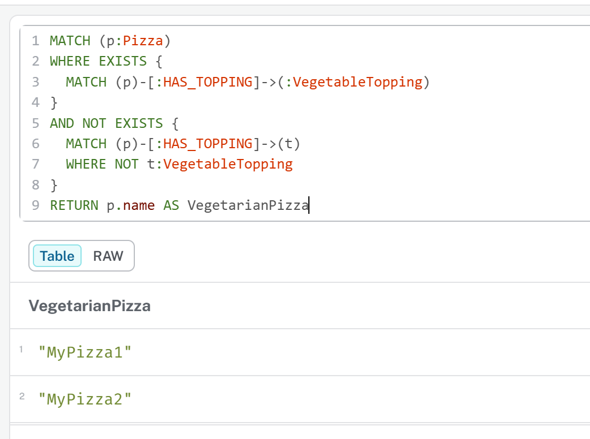

This query approximates ontology semantics by enforcing:

1. At least one vegetable topping exists, and
2. No invalid topping exists

The result may appear similar to OWL reasoning.

However, the implementation philosophy remains fundamentally different.

Neo4j performs **procedural semantic checking.**

Ontology performs **declarative semantic reasoning**.

In Neo4j, engineers must repeatly write logic describing:

> how validation should happen.

In ontology, meaning becomes:

> part of the model itself.

The reasoner automatically performs **inference**, **validation** and **classification**.

This reveals an important architectural distinction:

- Neo4j $\rightarrow$ relationship intelligence
- OWL $\rightarrow$ semantic intelligence

Or more precisely:

- Graph Database $\rightarrow$ connected facts
- Ontology $\rightarrow$ governed meaning

This distinction becomes increasingly important as enterprise knowledge graphs scale.

Without ontology, semantic logic often becomes scattered across:

- Cypher queries,
- applications,
- APIs, and
- business rules.

Over time, semantic governance becomes fragmented.

Ontology instead centralizes:

> meaning itself.

Meaning no longer lives only inside:

> application code.

It becomes:

> an explicit enterprise asset.

### 14.10.4 Cypher Query vs. Pellet Reasoner vs. Open World Assumption

Sections 14.10.1 through 14.10.3 established a practical bridge between OWL restrictions and Cypher queries in Noe4j:

- Section 14.10.1 demonstrated how to implement existential restriction (`some`) using pattern matching with `MATCH` and `WHERE` clauses.
- Section 14.10.2 showed the implementation of universal restriction (`only`) using `NOT EXISTS` to detect invalid relationships.
- Section 14.10.3 then combined both restrictions, illustrating how complex semantic requirements -- such as "a pizza must have at least one cheese topping and no non-pizza toppings" -- can be expressed as graph patterns.

However, this pedagogical bridge -- while valuable for initial understanding and hands-on experimentation -- carries a significant risk:

> it may obscure two foundational semantic differences that distinguish OWL reasoning from graph database querying.

First, as discussed in 14.7.4, OWL reasoners operate under the **Open World Assumption (OWA)**, while Neo4j (like most property graph databases) operates under the **Closed World Assumption (CWA)**.

Second, and more critically, the Cypher implementations in 14.10.1~14.10.3 treat `some` and `only` as *query paggerns* that return results, whereas an OWL reasoner treats them as *logical axioms* that derive new knowledge.

To build truly robust executable knowledge architectures, an ontology engineer must understand how *both* restriction types behave under *both* world assumptions, and how they contrast with the property graph querying paradigm demonstrated in the previous three esctions.

This section provides a two-dimenstion comparative analysis using a unified scenario. We keep extending our `Pizza.owl` knowledge base to evaluate both:

- **Existential Restriction (`some`)**: `hasTopping some CheeseTopping` -- "At least one cheese topping must exist."
- **Universal Restriction (`only`)**: `hasTopping only CheeseTopping` -- "If toppings exist, they must all be PizzaToppings."

**Example Scenario Defition**

**Ontology Definition:**

```text
Existential Rule (some):
  CheesePizza EquivalentTo: Pizza and (hasTopping some CheeseTopping)

Universal Rule (only):
  CleanPizza EquvalentTo: Pizza and (hasTopping only PizzaTopping)
```

**Knowledge Base (Asserted Facts):**

| Individual | Asserted Type | Asserted Relationships | Class Hierarchy |
| --- | --- | --- | --- |
| **PizzaA** | `Pizza` | `hasTopping MozarellaTopping` | `MozzarellaTopping` $\sqsubseteq$ `CheeseTopping` $\sqsubseteq$ `PizzaTopping` |
| **PizzaB** | `Pizza` | *(no `hasTopping` assertions)* | --- |
| **PizzaC** | `Pizza` | `hasTopping ChocolateTopping` | `ChocolateTopping` $\sqsubseteq$ `CandyTopping` (`CandyTopping` $\sqcap$ `PizzaTopping` = `owl:Nothing`) |
| **PizzaD** | `Pizza` | `hasTopping MozzarellaTopping`<br>`hasTopping ChocolateTopping` | (As above) |

**Initialize ontology in Protégé:**

New working ontology file: `/ebook/rdf/pizza-ebook_14.10.4.rdf`.

Base on above asserted facts, you may find following initialized knowledge:

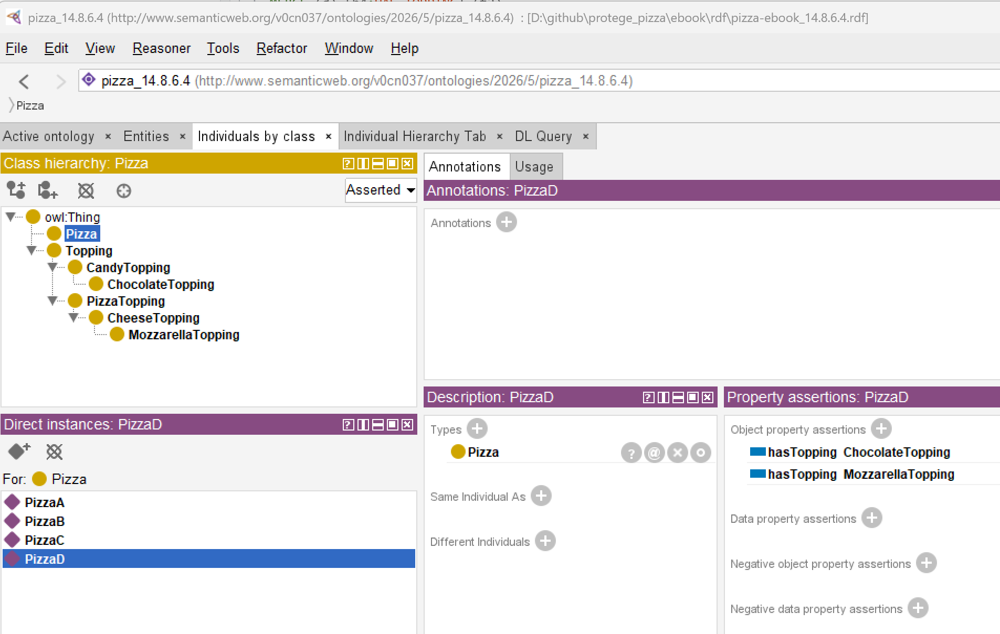

- Set `Disjoint With` between `PizzaTopping` and `CandyTopping`
- Set proper Domain and Range to relationship `hasTopping`
- Create necessary instances for building up the relationships.

**Initialize graph database in Neo4j:**

Using following Cypher query to create all asseted facts:

```sql
MERGE (a:Pizza {name:"PizzaA"})-[h1:HAS_TOPPING]-(t1:Topping {name:"MozzarellaTopping"})
MERGE (b:Pizza {name:"PizzaB"})
MERGE (c:Pizza {name:"PizzaC"})-[h2:HAS_TOPPING]-(t2:Topping {name:"ChocolateTopping"})
MERGE (d:Pizza {name:"PizzaD"})-[h3:HAS_TOPPING]-(t1)
MERGE (d)-[h4:HAS_TOPPING]-(t2)
MERGE (t3:Topping {name:"CheeseTopping"})
MERGE (t4:Topping {name:"PizzaTopping"})
MERGE (t5:Topping {name:"Candytopping"})
MERGE (t1)-[c1:CHILD_OF]->(t3)-[p1:PARENT_OF]->(t1)
MERGE (t3)-[c2:CHILD_OF]->(t4)-[p2:PARENT_OF]->(t3)
MERGE (t2)-[c3:CHILD_OF]->(t5)-[p3:PARENT_OF]->(t2)
RETURN a,b,c,d,t1,t2,h1,h2,h3,h4,t3,t4,t5,c1,c2,c3,p1,p2,p3
```

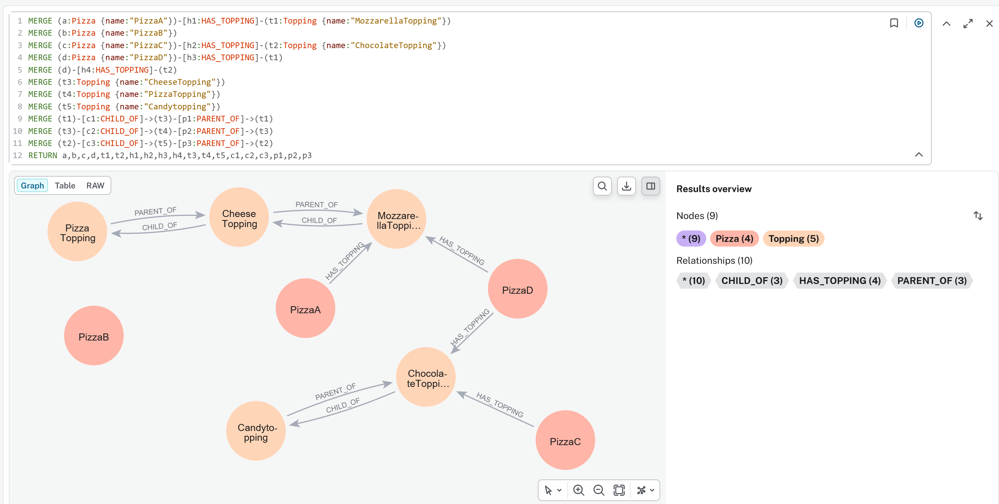

- Use two direction `PARENT_OF` and `CHILD_OF` for inverse class hierarchical structure

Since we have maximum two levels class hierarchy structure, to simulate the Protégé's Parent/Child inferencing behavior into Neo4j, run below Cypher query twice:

```sql
MATCH (p:Pizza)-[r1:HAS_TOPPING]->(t1:Topping)-[r2:CHILD_OF]->(t2:Topping)
MERGE (p)-[r3:HAS_TOPPING]->(t2)
RETURN p,t1,t2,r1,r2,r3
```

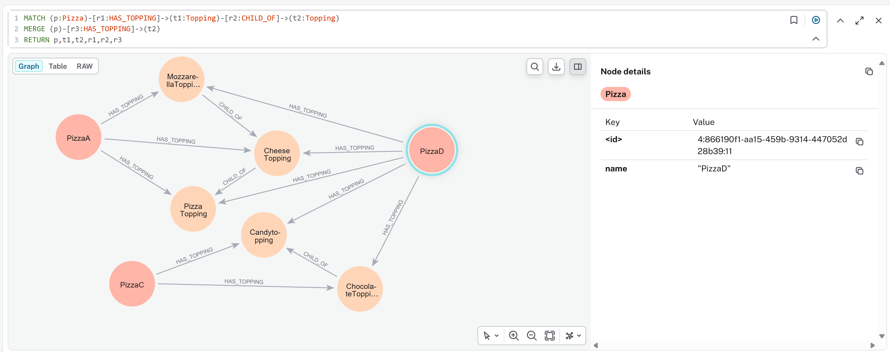

Note: here we don't see `PizzaB` since it has no topping relationship.

##### Part 1: Existential Restriction (`some`) -- "At Least One Must Exist"

**Goal:** Determine whether each individual satisties `hasTopping some CheeseTopping` (i.e., is a `CheesePizza`).

Recall from 14.10.1 that the Cypher implementation of `some` uses a single pattern match:

```sql
MATCH (p:Pizza)-[:HAS_TOPPING]->(t1:Topping)
WHERE toLower(t1.name) CONTAINS "cheese"
RETURN p
```

You get `PizzaA` and `PizzaD`

Note: we don't create `CheeseTopping` as another node in Neo4j, it's one instance of `Topping` node and we use `WHERE` clause to filter that.

Now compare this closed-world query againest OWL open-world reasoning:

| Individual | Cyper (CWA) - per 14.10.1 | Pellet Reasoner (OWA) | OWA Formal Conclusion |
| --- | --- | --- | --- |
| **PizzaA** | ✅ **Returned** - Pattern matches | ✅ **Inferred as `CheesePizza`** - Evidence found | **True** - Sufficient evidence exists |
| **PizzaB** | ❌ **Not returned** - No matching relationship | ❌ **Not inferred** - Also not inferred as $\neg CheesePizza$ | **Unknown** - Missing information; future facts could change this |
| **PizzaC** | ❌ **Not returned** - Target is not `CheeseTopping` | ❌ **Not inferred as `CheesePizza`** - Condition false for known relationship | **False** - Evidence exists and definitively fails the condition |
| **PizzaD** | ✅ **Returned** - At least one relationship satisfies pattern | ✅ **Inferred as `CheesePiza`** - `MozzarellaTopping` satisfies condition | **True** - One valid relationship is sufficient; invalid relationships are irrelevant |

**Key Insight for `some`**:

- Under OWA, the existential restriction is *monotonic*. Once satisfied (`PizzaD`), it returns satisfied regardless of additional assertions. The reasoner searches for *at least one piece of validating evidence.*
- The Cypher query from 14.8.6.1 and customized here correctly identifies `PizzaA` and `PizzaD`, but it cannot distinguish `PizzaB` (unknown) from `PizzaC` (fales) -- both simply "not returned". This conflation is the primary limitation of the closed-world emulation.

##### Part 2: Universal Restriction (`only`) -- "Everything Must Conform"

**Goal:** Determine whether each individual satisfies `hasTopping only PizzaTopping` (i.e., has no topping outside the `PizzaTopping` class).

Recall from 14.10.2 that the Cypher implementation of `only` uses `NOT EXISTS` to detect violations:

```sql
MATCH (p:Pizza)
WHERE NOT EXISTS {
  (p)-[:HAS_TOPPING]->(t:Topping)
  WHERE NOT toLower(t.name) CONTAINS "pizza"
}
RETURN p
```

Result is `PizzaB` in the Neo4j graph; however, our testing graph doesn't returen `PizzaA` due to we don't complicated query to check Parent/Child context here, in reality, `PizzaA` si also fulfill the CWA.

Now compare this against OWL open-world reasoning:

| Individual | Cyper (CWA) - per 14.10.2 | Pellet Reasoner (OWA) | OWA Formal Conclusion |
| --- | --- | --- | --- |
| **PizzaA** | ✅ **Returned** - No invalid topping found | ✅ **Satisfies restriction** - All relationships valid | **True** - All asserted relationships are valid |
| **PizzaB** | ✅ **Returned (vacuously)** - See vacuous truth discussion in 14.8.3 | **True (vacuously)** - No counterexample exists |
| **PizzaC** | ❌ **Not returned** - Invalid topping detected | ❌ **Violates restriction** - Counterexample found | **False** - Definitive counterexample exists |
| **PizzaD** | ❌ **Not returned** - The `ChocolateTopping` is invalid, even though `MozzarellaTopping` is valid | ❌ **Violates restriction** - Universal quantifier requires *all* relationships to be valid | **False** - A single counterexample falsifies universal condition |

**Key Insight for `only`:**

- Under OWA, the universal restriction is *falsified by a single counterexample*. The reasoner searches for *any violating evidence*.
- The Cypher query from 14.10.2 correctly identifies valid pizzas (A and B) -- has explained result of A -- and excludes invalid ones (C and D). However, like the `some` case, it conflates `PizzaB` (vacuously true) with `PizzaA` (genuinely true), and cannot represent the logical distinction between "no toppings yet" and "has only valid toppings."

##### Part 3: Combining `some` and `only` -- The Composite Pattern

Section 14.10.3 demonstrated how to combine both restrictions in a single Cypher query, idenifying pizzas that satisfy *both* conditions: at least one cheese topping AND no non-pizza toppings.

```sql
MATCH (p:Pizza)
WHERE (p)-[:HAS_TOPPING]->(:CheeseTopping)
AND NOT EXISTS {
  (p)-[:HAS_TOPPING]->(t:Topping)
  WHERE NOT toLower(t.name) CONTAINS "pizza"
}
RETURN p
```

Note: it should have `PizzaA` returned.

The following table shows the integrated results across all four individuals, comparing the Cypher composite query against OWL reasoning for the combined definition:

**Combined Definition:**

```
GoodPizza EquivalentTo:
Pizza
and (hasTopping some CheeseTopping)
and (hasTopping only PizzaTopping)
```

| Individual | Cyper (CWA) - per 14.10.3 | Pellet Reasoner (OWA) | OWA Formal Conclusion |
| --- | --- | --- | --- |
| **PizzaA** | ✅ **Returned** - Has cheese topping AND all toppings valid | ✅ **Inferred as GoodPizza** - Both conditions satisfied | **True** - Satisfies both existential and universal requirements |
| **PizzaB** | ❌ **Not returned** - Fails `some` condition (no cheese topping) | ❌ **Not inferred** - `some` unknown; `only` vacuous but insufficient | **Unknown** - Mising information for condition |
| **PizzaC** | ❌ **Not returned** - Fails `some` (no cheese topping) AND fails `only` (invalid topping) | ❌ **Not inferred** - `some` false, `only` false | **False** - Definitive failure on both dimentions |
| **PizzaD** | ❌ **Not returned** - Has cheese topping (pases `some`) BUT fails `only` (invalid topping exists) | ❌ **Not inferred as GoodPizza** - `only` condition violated | **False** - Universal restriction fails despit existential satisfaction |

**Critical Observation - `PizzaD`:**

- This individual reveals the non-complementary nature of `some` and `only`.
- A pizza can simultaneously satisfy an existential restriction (it has at least one cheese topping) *and* violate a universal restriction (it also has a non-pizza topping).
- In the composite query from 14.10.3, `PizzaD` is correctly excluded.
- However, an OWL reasoners provides additional insight: `PizzaD` *is* a `CheesePizza` (from Part 1) but is *NOT* a `GoodPizza` (from Part 3).
- This distinction -- that an individual can belong to one inferred class but not another -- is a form of logical nuance that Cypher's flat pattern matching CANNOT express without explicitly modeling both classifications.

##### Part 4: Integrated Comparison - `some` vs `only` Across Both Worlds

The following table integrates both restriction types, showing the classification outcomes for each individual under each condition, comparing Cypher (from 14.10.1~14.10.3) against OWL reasoning:

| Individual | `some CheeseTopping` (Cypher/CWA) | `some CheeseTopping` (Pellte/OWA) | `only PizzaTopping` (Cypher/CWA) | `only PizzaTopping` (Pellet/OWA) |
| --- | --- | --- | --- | --- |
| **PizzaA** | ✅ True | ✅ True | ✅ True | ✅ True |
| **PizzaB** | ❌ False | ❓ Unknown | ✅ True | ✅ True (vacuous) |
| **PizzaC** | ❌ False | ❌ False | ❌ False | ❌ False |
| **PizzaD** | ✅ True | ✅ True | ❌ False | ❌ False |

**Critical Observation -- the Unknown Column:**

- The most significant difference between the Cypher columns and the OWA columns appears in `PizzaB` for the `some` condition.
- Cypher returns `False` (the individual is excluded from results), while OWL returns `unknown` (the individual cannot be classified yet).
- The difference is not a bug or an implementation detail -- it is the direct consequence of the Open World Assumption.
- In enterprise scenarios where data arrives incrementally (e.g., a pizza order system where toppings are added over time), `Unknown` is often the correct and more useful answer than `False`.

##### Part 5: Why the Difference Matters - From Query to Reasoning

The Cypher implementations in 14.10.1~14.10.3 are *operational filters*. They answer the questions:

> "Given the data currently in the graph, which individuals match my explicit pattern?"

OWL reasoning, by contrast, answers a deeper question:

> "Given the logical axioms defined in the ontology and the data currently available, what class memberships can be *necessarily* inferred -- and which remain *possibly* true?"

| Dimension | Cypher in Neo4j (14.10.1~14.10.3) | OWL Reasoner (e.g. Pellet) |
| --- | --- | --- |
| **Work Assumption** | Closed World: Missing = False | Open World: Missing = Unknown |
| **Restriction Type** | Written as explicit `MATCH` or `NOT EXISTS` patterns | Declared as logical axioms in the ontology |
| **Output** | Query result set (individuals matching pattern) | Inferred class memberships (new `rdf:type` assertions) |
| **Handling of `PizzaB`** | Excluded from `some` query (Fales) | Not classified as `CheesePizza`, but not classified as $\neg$`CheesePizza` either (Unknown) |
| **Composability** | Manual composition via `AND` / `OR` in query | Automatic composition via logical conjunction in class expression |
| **Maintenance** | Query logic lives in application code | Logical axioms live in ontology; all queries benefit automatically |


##### Part 6: Practical Guidance - When to Use Each Approach

| Scanario | Recommended Approach | Rationale |
| --- | --- | --- |
| **Real-time filtering on stable complete data** | Use Cypher patterns (14.10.1~14.10.3) directly on Neo4j | <li>High performance</li><li>Closed world assumption is valid when data is known to be complement</li> |
| **Incremental data integration from multiple sources** | Use OWL reasoner + materialize inferred types to Neo4j | <li>Open world prevents premature false negatives</li><li>Reasoner handles missing data gracefully</li> |
| **Data quality validation (missing required fields)** | <li>Use `some` restriction with OWL reasoner</li><li>Query for individuals *not* satisfying the restriction</li> | Under OWA, missing data flags as "incomplete" (Unknown), not "invalid" (false) -- more actionable for data stewardship |
| **Compliance checking (forbidden relationships)** | <li>Use `only` restriction with OWL reasoner</li><li>Any violation yields definitive `False`</li> | <li>Universal restriction catch type violations directly</li><li>No ambiguity</li> |
| **Detecting "partially correct" data (like `PizzaD`)** | <li>Combine both restrictions</li><li>Query for individuals satisfying `some` but failing `only` | Identifies data that has required components but also contains invalid elements -- often signals need for human review |
| **Production dashboards on stable data** | Run Cypher queries on a materialized inference graph | First use reasoner to compute all inferred types, then export to Neo4j for high-performance operational queries |

##### Summary: The Logical Bridge Between Sections 14.10.1~14.10.3 and True OWL Reasoning

Let's take a breathe before moving to next section.

> The Cypher patterns in 14.10.1~14.10.3 answers:
> "What matches my explicit patter *right now* in this **closed** graph?"

> An OWL reasoner answers:
> "What *must be true* given my logical axioms and available data -- and what *remains possibly true* -- under open-world semantics?"

The implementations in 14.10.1 (`some` as `MATCH`), 14.10.2 (`only` as `NOT EXISTS`), and 14.10.3 (composite patters) are excellent pedagogical (and self-learning) tools.

They allow developers familiar with graph databases to experience the *filtering effect* of OWL restrictions without immediately learning description logic.

However, as this section has demonstrated, these Cypher patterns are *simulations*, not equivalents.

- They cannot represent the open-world distinction between `False` and `Unknown` (`PizzaB` for `some`),
- They cannot automatically derive new classifications without being explicitly written for each query, and
- They cannot capture the logical nuance that an individual like `PizzaD` can be a `CheesePizza` (satisfying `some`) while not being a `GoodPizza` (failing `only`).

Understanding these differences -- mastering the distinct behaviors of `some` and `only` under both closed-world and open-world assumptions -- is a fundamental maturity milestone in ontology engineering.

As you move from writing Cypher queries (sections 14.10.1~14.10.3) to deploying OWL reasoners in executable knowledge architectures (EKA), this distinction will determine whether your semantic system merely filters data or truly understands it.

Congratulations for you to read through this chapter until here, this is a big long journey for myself as well to make existential and universal restriction clearer. If you feel any parts uncertain, read again and hands-on practice with your Protégé and Neo4j.

## 14.11 EKA Perspective -- Restriction as Semantic Governance

Throughout this chapter, you explored one of the most important capabilities in OWL ontology engineering:

> **Property Restriction.**

At first glance, restrictions may appear to be merely:

> OWL syntax,

or:

> Protégé modeling techniques.

Expressions such as:

`hasTopping some CheeseTopping` or `hasTopping only VegetableTopping`

may initially feel like technical notation designed only to support:

> ontology classification.

However, from the perspective of:

> **Executable Knowledge Architecture (EKA)**,

property restrictions represent something far more significant.

They transform ontology from:

> a passive relationship model

into:

> **governed executable semantic logic.**

This distinction matters.

Because knowledge graphs alone rarely produce:

> meaningful and trustworthy intelligence.

A graph can successfully connect:

`Pizza` $\rightarrow$ `hasTopping` $\rightarrow$ `Mushroom`,

yet, this relationship alone cannot explain:

- whether the pizza should be classified as vegetarian,
- whether semantic expectations are satisfied,
- whether governance policies/rules are violated, or
- whether downstream actions should occur.

In other words, realtionships create:

> connected knowledge.

Restrictions create:

> **meaningful semantic behavior.**

Seen through the EKA perspective, property restrictions become an essential bridge between:

> semantic knowledge

and:

> executable intelligence.

Recall the formal EKA tuple introduced in Chapter (00):

$\large{EKA = (K, R, \Theta, \Phi, \Gamma)}$,

where:

- $K$ = Knowledge Graph layer
- $R$ = Reasoning & Rules layer
- $\Theta$ = Trigger layer
- $\Phi$ = Execution layer
- $\Gamma$ = Governance layer

Property restrictions contributes directly across every one of these layers.

### 14.11.1 Restriction and the Knowledge Graph Layer ($K$)

The first contribution appears in:

> **$K$ - Knowledge Graph layer.**

Recall from Chapter (00):

> $K$ represents a set of entities (nodes) and semantic relationships (edges) conforming to an ontology.

Without restrictions, knowledge graphs primarily describe:

> connected facts.

For example:

` PizzaA hasTopping MozzarellaTopping`

simply tell us **a relationship exists.**

This is valuable, but semantically incomplete.

The graph itself cannot determine:

- whether this pizza qualifies as a `CheesePizza`,
- whether toppings violate semantic expectations, or
- whether business meaning should change.

Property restrictions enrich the knowledge graph by adding:

> semantic interpretation.

The graph stops being merely:

> connected information.

Instead, it becomes:

> semantically meaningful knowledge.

For example:

```
CheesePizza EquivalentTo:
Pizza
and (hasTopping some CheeseTopping)
```

adds semantic significance to the graph.

Now, the presence of `MozzarellaTopping` may imply `CheesePizza`.

This marks an important shift.

Knowledge graph becomes **inferable.**

Rather than **manually asserted.**

Within EKA, restrictions therefore improve:

> semantic richness inside the Knowledge Graph layer.

### 14.11.2 Restriction and the Reasoning & Rules Layer ($R$)

---

Last Updated at: 2026/06/13