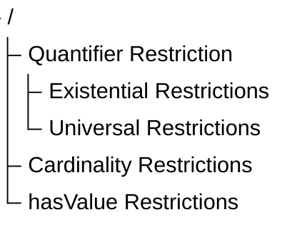

# Chapter 14 -- Existential Restrictions: From Semantic Relationships to Semantic Requirements

Table of Contents:
- [14.1 Chapter Introduction -- From Semantic Boundaries to Semancic Requirements](#141-chapter-introduction----from-semantic-boundaries-to-semancic-requirements)
- [14.2 Why RDF and RDFS Are Not Enough](#142-why-rdf-and-rdfs-are-not-enough)
- [14.3 Property Restrictions -- Introducing Semantic Logic in OWL](#143-property-restrictions----introducing-semantic-logic-in-owl)
- [14.4 Qantifier Restriction -- Understanding Existential and Universal Logic](#144-qantifier-restriction----understanding-existential-and-universal-logic)
  - [14.4.1 Existential Restriction -- "At Least One Exist"](#1441-existential-restriction----at-least-one-exist)
  - [14.4.2 Universal Restriction -- "Only These Are Allowed"](#1442-universal-restriction----only-these-are-allowed)
  - [14.4.3 Why Chapter 14 Begins with Existential Restriction](#1443-why-chapter-14-begins-with-existential-restriction)
  - [14.4.4 OWL Restriction Systax Pattern -- Understanding the Grammar of Semantic Constraints](#1444-owl-restriction-systax-pattern----understanding-the-grammar-of-semantic-constraints)
- [14.5 Existential Restriction in `Pizza.owl` -- Understanding Tutorial 4.10.1 and 4.10.2](#145-existential-restriction-in-pizzaowl----understanding-tutorial-4101-and-4102)
  - [14.5.1 A Detail Look at Existential Restriction](#1451-a-detail-look-at-existential-restriction)
  - [14.5.2 From Semantic Requirements to Executable Queries: The EKA Knowledge Graph Bridge](#1452-from-semantic-requirements-to-executable-queries-the-eka-knowledge-graph-bridge)
  - [14.5.3 Visualized Examine on Tutorial 4.10.1 and 4.10.2](#1453-visualized-examine-on-tutorial-4101-and-4102)
  - [14.5.4 View from Open World Assumption (OWA)](#1454-view-from-open-world-assumption-owa)
- [14.6 Exercise 13 Walkthrough -- Creating Semantic Requirements in Protégé](#146-exercise-13-walkthrough----creating-semantic-requirements-in-protégé)
- [14.7 Understanding Reasoning Outcomes -- Asserted vs. Inferred Semantics](#147-understanding-reasoning-outcomes----asserted-vs-inferred-semantics)
  - [14.7.1 Asserted Semantics -- Explicitly Modeled Knowledge](#1471-asserted-semantics----explicitly-modeled-knowledge)
  - [14.7.2 Inferred Semantics -- Knowledge Derived Through Logic](#1472-inferred-semantics----knowledge-derived-through-logic)
  - [14.7.3 Why Existential Restriction Enables Inference](#1473-why-existential-restriction-enables-inference)
  - [14.7.4 Reasoners Think Logically -- Not Intuitively](#1474-reasoners-think-logically----not-intuitively)


## 14.1 Chapter Introduction -- From Semantic Boundaries to Semancic Requirements

By the end of Chapter (13), you had already begun understanding an important truth about ontology engineering:

> semantic relationships alone are not sufficient to fully describe meaning!

Through **Property Domain and Range**, ontology engineers learned how to establish:

> semantic boundaries.

For example, `hasTopping` may define:

| Domain | Range |
| --- | --- |
| `Pizza` | `PizzaTopping` |

This tells ontology something important:

> pizzas may have toppings.

Likewise:

> topping belong to pizzas.

However, a subtle but important limitation still remains.

Consider the following question:

> Does every pizza necessarily have toppings?

From the perspective of:

> Domain and Range alone,

the answer is:

> **not necessarily.**

Why?

Because Domain and Range describe:

> where relationships are logically valid,

but they do not express:

> what relationships are semantically required.

This distinction represents one of the most important maturity transitions in ontology engineering.

In earlier chapters, ontology primarily focused on:

> semantic structure.

You created:

- classes
- subclass hierarchies
- object properties
- inverse properties
- property characteristics
- semantic boundaries

Ontology therefore answered questions such as:

- What things exist?
- How are concepts related?
- What semantic relationships are valid?

Charter 14 now introduces a deeper semantic question:

> **What relationships must exist?**

This shift is profound.

Because ontology is no longer merely describing:

> allowable semantic connections.

Ontology now begins defining:

> **semantic obligations.**

For example:

Saying:

> Pizza `hasBase` PizzaBase

describes:

> a valid relationship.

But saying:

> every Pizza must have at least one PizzaBase

introduces something fundamentally different:

> a semantic requirement.

Ontology therefore begins evolving from:

> connected semantics

toward:

> **logical semantics.**

This chapter begins with one of OWL's most powerful modeling constructs:

> **Existential Restriction**

often expressed through:

> `someValuesFrom`

At first glance, existential restrictions may appear technically simple.

Yet conceptually, they represent a major milestone!

Because this is the point where ontology starts moving toward:

> **machine-understandable logic.**

Rather than merely storing knowledge, ontology begins expressing:

> how knowledge should behave.

Within the broader direction of:

> **Executable Knowledge Architecture (EKA)**

this chapter represents another maturity leap:

from:

> governed semantic relationships

toward:

> **governed semantic requirements.**

## 14.2 Why RDF and RDFS Are Not Enough

To fully appreciate why `existential restrictions` matter, it is helpful to revisit a theme introduced earlier in:

> **Chapter 08 -- RDF as a Language**

As discussed previouly, RDF provides a remarkably elegant machanism for representing knowledge.

Through simple triple "subject $\rightarrow$ predicate $\rightarrow$ object", RDF allows semantic relationships to be represented consistently.

For example:

> MargheritaPizza $\rightarrow$ `hasTopping` $\rightarrow$ MozzarellaTopping

In Portégé, we model `Pizza.owl` as below screen:


This structure gives ontology an important foundation:

> connected meaning.

Later, RDFS (RDF Schema) extends this capability by introducing:

- class hierarchies
- subclass relationships
- Domain definitions
- Range definitions

These additions improve semantic understanding considerably.

For example:

RDFS can express:

> Pizza is a subclass of Food

or:

> `hasTopping` connects "Pizza $\rightarrow$ PizzaTopping".

At this stage, ontology becomes:

> semantically structured.

However, an important limitation still exists!

RDFS can describe:

> semantic possibility.

But it cannot adequately express:

> semantic **necessity**!

This distinction becomes critically important.

Consider the following statement:

> Pizza `hasBase` PizzaBase

What does this actually mean?

It tells ontology:

> pizza **may** logically has pizza bases.

But does ontology know that:

> every pizza **must** have a base?

NO!

RDFS alone cannot fully express this requirement.

Likewise:

> MargheritaPizza `hasTopping` MozzarellaTopping

does not automatically mean:

> every MargheritaPizza requires mozzarella.

Ontology still lacks a way to formalize:

> semantic **obligation**.

This limitation becomes increasingly problematic in real enterprise modeling.

Imaging an enterprise architecture ontology.

Suppose an organization defines:

> Application `hostedOn` Infrastructure

This relationship may be semantically valid.

However, enterprise architects often need stronger semantic meaning, like:

> every production application must be `hosted on` infrastructure.

Notice the difference.

The first statement describes: **possibility**;

The second introduces: **requirement**.

This is precisely where:

> **OWL (Web Ontology Language)**

extends semantic capability beyond RDF and RDFS.

OWL introduces:

> logical expressiveness.

Ontology now becomes capable of describing:

- Rules,
- Requirements,
- Obligations, and
- **machine-interpretable semantic logic**.

This transition is important enough to view as a fundamental evolution:

- **RDF** - connected data - *"Something is connected to something."*
- **RDFS** - structured semantices - *"These kinds of things may be connected in these ways."*
- **OWL** - logical semantics - *"These kinds of things **must** be connected in these ways."*

## 14.3 Property Restrictions -- Introducing Semantic Logic in OWL

By the end of Chapter (13), ontology had already become significantly more expressive.

You could now model:

- classes and subclass hierarchies
- object properties and inverse properties
- property characteristics
- semantic boundaries through Domain and Range

However, ontology skill lacked an important capability:

> **the ability to formally describe semantic conditions.**

consider the following statement:

> `Pizza` `hasTopping` `PizzaTopping`

This tells ontology something useful already:

> pizza may have toppings.

Yet, ontology still cannot answer a deeper semantic question:

> what makes a pizza become a specific kind of pizza?

For example:

What semantically distinguishes:

> `MargheritaPizza`

from:

> `AmericanPizza`

or:

> `VegetarianPizza`?

Either pizza above may have some topping, but merely defining classes and relationships like this way is insufficient.

Ontology now requires a mechanism capable of expression:

> **semantic constraints**

and:

> **logical requirements.**

This need introduces one of the most important constructs within:

> **OWL (Web Ontology Language)**

knows as:

> **Property Restrictions.**

Property restrictions allow ontology engineers to formally describe:

- how properties should behave?
- what relationships are expected? and
- what semantic conditions must hold?

In other words, property restrictions move ontology from:

> sementic structure

toward:

> **semantic logic.**

This distinction is fundamental.

Because until now, ontology primarily described:

> what thinks exist

and

> how things connect.

With property restrictions, ontology begins expressing:

> **what things mean.**

This is one of the first moments where ontology becomes **logicall interpretable**.

And consequently **reasoner-friendly.**

Within OWL, property restrictions are represented as:

> logical class descriptions.

Meaning: A class can now be defined not merely through **a name**, but through **semantic conditions.**

For example:

Instead of manually declaring:

> `CheesyPizza`

ontology can describe it logically as:

> a `Pizza` that has **at least one** `CheeseTopping`.

This subtle shift changes ontology dramatically.

Meaning is no longer **manually assigned.**

Meaning becomes **logically inferable.**

To better understand property restrictions, it is useful to view them as a family of semantic mechanisms.



Broadly speaking as above tree-view, OWL property restrictions can be grouped into three major categories:

<h3>1. Quantifier Restrictions</h3>

Quantifier restrictions describes:

> **whether certain relationships exist**

or:

> whether relationships are restricted to certain types.

These restrictions focus on semantic existence and semantic scope.

Quantifier restrictions include:

<h4>Existential Restriction</h4>

(`someValuesFrom`)

Meaning: there exists at least one relationship satisfying a condition.

Example:

> `Pizza` `hasTopping` some `CheeseTopping`

Meaning:

> every pizza must have at least one cheese topping.

<h4>Universal Restriction</h4>

(`allValuesFrom`)

Meaning: all (every) successor individual must belongs to a specified class.

Example:

> `Pizza` `hasTopping` only `PizzaTopping`

Meaning:

> every topping of a pizza must be a `PizzaTopping`.

Notice the important distinction.

- Existential restriction expresses: **minimum semantic existence.**
- Universal restriction expresses: **semantic limitation.**

These two concepts are frequently confused by beginners.

Yet they represent fundamentally different forms of semantic reasoning.

Chapter (14) begins with:

> **Existential Restriction**

because ontology must firest understand:

> required existence

before learning:

> restricted universality.

Do you see any similarity for this ontology (machine) learning approach with how human being learn? True, they are in the common approach.

<h3>2. Cartinality Restrictions</h3>

While quantifier restrictions focus on existence, cardinality restrictions focus on **quantity.**

Ontology may sometimes need to define:

> how many relationships are permitted or required.

OWL therefore supports several forms of:

> cardinality constraints.

Including:

<h4>(1) Minimum Cardinality</h4>

(`minCardinality`)

Meaning: at least N relationships must exist.

Example:

> `Pizza` `hasTopping` minimum 2

Meaning:

> a pizza must have at least two toppings

<h4>(2) Maximum Cardinality</h4>

(`maxCardinality`)

Meaning: no more than N relationships may exist.

Example:

> `Person` `hasBiologicalMother` maximum 1

Meaning:

> a person cannot have more than one biological mother.

<h4>(3) Exact Cardinality</h4>

(`exactCardinality`)

Meaning: exactly N relationships are required.

Example:

> `Standard_Bicycle` `hasWheel` exactly 2

Meaning:

> standard bicycles must have precisely two wheels.

Cardinality restrictions become particularly important in:

- enterprise governance,
- data quality validation, and
- business rule enforcement.

Within enterprise architecture, examples may include:

> an `business_application` must have exactly one `system_owner`

or:

> a `business_process` must involve at least one `responsible_role`.

Ontology therefore becomes increasingly capable of expressing:

> operational logic,

rather than merely:

> descriptive semantics.

<h3>3. Value Restrictions</h3>

The third major category involves **specific required values** represented through `hasValue`.

Unlike existential restriction, which asks for:

> as least one qualifying relationship,

value restriction specifies:

> a particular exact value.

For example:

Suppose an enterprise policy states:

> all `production_applications` must belong to environment "`Production`".

Ontology may express:

> `hasEnvironment` `value` `Production`

This means:

> the relationship must point to a specific predefined individual.

In `Pizza.owl` terms, imagine requiring:

> a `NamedPizza` must always have a particular base.

Rather than merely saying:

> some pizza base exists,

ontology would specify:

> one exact expected value.

Value restrictions therefore introduce:

> semantic precision

as well as:

> semantic determinism.

Together, these three categories establish the foundation of:

> OWL semantic logic.

They transform ontology from:

> semantic modeling

into:

> formal semantic definition.

Summrized view in below comparison table from also the evolution discussed in 14.2 from RDF/RDFS to OWL:

| Layer | Core Capability | Limitation |
| --- | --- | --- |
| RDF | Triples (connected meaning) | No structure |
| RDFS | Class hierarchies, Domain & Range (structured semantics) | Can only describe **possibility**, cannot express **necessity** |
| OWL | Logical expressiveness (rules, requirements, obligations) | -- |

Existential restrictions represent one of the earliest moments where you may begin seeing:

> ontology as **logic**.

Rather than merely:

> ontology as structure.

And this transition fundamentally changes how ontology can support:

- Reasoning ($R$),
- Governance ($\Gamma$), and eventually
- executable intelligence.

Among these restriction categories, **quantifier restrictions** are typically introduced first because they provide the conceptual foundation for semantic participation and logical class definition. We therefore begin with existential and universal restrictions.

## 14.4 Qantifier Restriction -- Understanding Existential and Universal Logic

Among all OWL restrictions, the most foundational are:

> **Quantifier Restrictions.**

These restrictions focus on a deceptively simple question:

> **what kind of relationships should exist?**

Quantifier restrictions allow ontology to reason about:

> semantic participation.

In other words:

ontology begins understanding not merely:

> whether concepts are connected,

but:

> how those connections should behave logically.

OWL provides two primary forms of quantifier restriction:

- **Existential Restriction**: represented by `someValuesFrom`
- **Universal Restriction**: represented by `allValuesFrom`

Although these may appear similar at first glance, their semantic meaning differs significantly.

### 14.4.1 Existential Restriction -- "At Least One Exist"

Existential restriction expresses:

> **there exists at least one qualifying relationship.**

In **Description Logic (DL)**, this is often represented conceptually as:

> $\exists R.C$

Meaning: there exists at least one (some) relationshiop $R$ to something belonging to an individual belonging to class $C$.

=== Interesting Read: More mathematical notation ===

Expand above notation in DL, the concept of an existential restriction is formally defined using the following mathematical notation:

$\exists R.C =
\{x \in \Delta^\mathcal{I}
\mid
\exists y \in \Delta^\mathcal{I} :
(x,y) \in R^\mathcal{I}
\land
y \in C^\mathcal{I}
\}$

Breakdown of this formula --

- $\Delta^\mathcal{I}$: The domain of interpretation, representing the set of all individuals in the ontology world.
- $x, y$: Individual elements within that interpretation domain.
- $R^\mathcal{I}$: The interpretation of the role (relationship) $R$, represented as a binary relation between individuals.
- $C^\mathcal{I}$: The interpretation of the concept (class) $C$, represented as the set of all individuals belonging to class $C$.
- $(x,y) \in R^\mathcal{I}$: Indicates that a relationship $R$ exists between individual $x$ and individual $y$.
- $y \in C^\mathcal{I}$: Indicates that individual $y$ belongs to class $C$.
- $\land$: Logical conjunction (AND), meaning both conditions must hold simultaneously.

Conceptual visualization --

To understand this mapping, let's imaging a `parentTo` relationship connected to a `Person` class: $\exists parentTo.Person$

Meaning:

> there exists at least one chile connected through `parentTo` to a `Person`.

In short, the expression $\exists R.C$ describes the set of all individuals x that have **at least one successor** y through relationship R, such that y belongs to class C.

=== END ===

Within our `Pizza.owl` ontology, consider:

> `hasTopping` `some` `MozzarellaTopping`

Semantically, this means:

> there exists at least one topping relationship to mozarella topping.

This statement introduces something very important:

> semantic necessity.

Ontology now expects:

> at least one qualifying relationship.

This differs significantly from earlier chapters.

- Previously: relationship were optional.
- Now: relationships become logically meaningful (necessity).

A useful way to understand existential restriction is through the phrase:

> **AT LEAST ONE.**

Not:

> exactly one.

Not:

> all toppings.

Simply: there exists at least one!

This distinction matters enormously.

Because ontology reasoning depends heavily on:

> precise semantics.

Let's see an example in `Pizza.owl`:

Suppose a class defines:

> `MargheritaPizza`

as:

> `hasTopping` `some` `MozzarellaTopping`

Ontology now understand:

> mozzarella topping is semantically necessary by Margherita pizza.

Without satisfying this requirement:

> the pizza cannot fully conform to the class meaning, semantically.

This introduces another important shift.

Ontology modeling now begins answering:

> **What makes something what it is?**

A `MargheritaPizza` is not merely:

> a pizza.

It becomes:

> a pizza satisfying semantic conditions.

This distinction transform ontology engineering from:

> classification

toward:

> **formal semantic definition**.

Ontology therefore becomes increasingly capable of expressing:

> adaptive domain knowledge.

In enterprise context, this becomes extremely valuable.

See another example:

A `Critical_Application` may require:

> at least one `Disaster_Recovery_Mechanism`.

Or:

`Sensitive_Data_Process` may require:

> at least one `Compliance_Concrol`.

Ontology can now formally describe:

> mandatory semantic conditions.

Rather than merely:

> possible relationships.

This marks another important maturity leap toward:

> executable knowledge systems.

### 14.4.2 Universal Restriction -- "Only These Are Allowed"

Universal restriction expresses:

> **all successor individuals must satisfy a condition.**

Conceptually:

> $\forall R.C$

Meaning: every relationship $R$ must point to class $C$.

=== Interesting Read: More mathematical notation ===

Expand above notation in DL, the concept of a universal restriction is formally defined using the following mathematical notation:

$\forall R.C =
\{x \in \Delta^\mathcal{I}
\mid
\forall y \in \Delta^\mathcal{I} :
(x,y) \in R^\mathcal{I}
\rightarrow
y \in C^\mathcal{I}
\}$

Breakdown of this formula --

- $\Delta^\mathcal{I}$: The domain of interpretation, representing the set of all individuals in the ontology world.
- $x, y$: Individual elements within that interpretation domain.
- $R^\mathcal{I}$: The interpretation of the role (relationship) $R$, represented as a binary relation between individuals.
- $C^\mathcal{I}$: The interpretation of the concept (class) $C$, represented as the set of all individuals belonging to class $C$.
- $(x,y) \in R^\mathcal{I}$: Indicates that a relationship $R$ exists between individual $x$ and individual $y$.
- $y \in C^\mathcal{I}$: Indicates that individual $y$ belongs to class $C$.
- $\rightarrow$: Logical implication (IF…THEN), meaning if relationship $R$ exists, the target individual must satisfy class condition $C$.

Conceptual visualization --

To understand this semantic interpretation, same as previous example, imagine a  `parentTo` relationship connected to `Person`, now as $\forall parentTo.Person$

Meaning:

> all individuals connected through `parentTo` must belong to the class `Person`.

Importantly, this does **not** imply that a person necessarily satisfies `parentTo` relationship.

Instead, ontology expresses:

> if a `parentTo` relationship exists, it must only point to valid `Person` individuals.

In short, the expression $\forall R.C$ describes the set of all individuals $x$ such that:

> every successor individual $y$ connected through relationship $R$ must belong to class $C$.

This is why universal restriction expresses:

> **semantic limitation**

rather than:

> semantic existence.

In short, the expression $\forall R.C$ describes the set of all individuals x whose **every successor** y through relationship R must belong to class C.

=== END ===

For example:

> `Pizza` `hasTopping` only `PizzaTopping`

Meaning:

> all toppings of a pizza must belong to PizzaTopping.

This does **not** guarantee toppings exist.

Instead, it governs:

> semantic limitation.

This distinction is critically important.

Because beginners often mistakenly assume `only` means **required**.

But semantically, it means **constrained**.

A pizza may still have:

> zero toppings.

Ontology here simply says:

> if topping exist,

they must belong to:

> `PizzaTopping`.

Understanding this distinction is one of the earliest maturity moments in ontology engineering.

Because ontology logic depends heavily on:

> semantic precision.

### 14.4.3 Why Chapter 14 Begins with Existential Restriction

Michael intentionally introduces:

> existential restriction

before universal restriction.

This teaching sequence is important.

Because ontology first needs to understand:

> **semantic existence**

before introducing:

> **semantic limitation**

In practical modeling:

it is usually easier to first ask:

> what relationships are required?

before asking:

> what relationships are allowed?

This chapter therefore focuses on:

> **Existential Restriction**

using:

> `someValuesFrom`

before later chapters gradually expand toward:

> more advanced logical constraints.

### 14.4.4 OWL Restriction Systax Pattern -- Understanding the Grammar of Semantic Constraints

After understanding the conceptual difference between:

> existential restriction (`someValuesFrom`)

and:

> universal restriction (`allValuesFrom`),

you should pause briefly to recognize an important fact, from language perspective, that:

> OWL restriction are not random syntax.

Instead, they follow a highly structured semantic grammar.

Thsi is an important transition point in ontology learning.

Because many beginners mistakenly perceive expressions such as:

`hasTopping some MozzarellaTopping`

as:

> Protégé-specific notation

or simply:

> a software configuration format.

However, this interpretation is incomplete.

In reality, OWL restrictions represent:

> **formal semantic expressions**

which are used to describe:

> logical class conditions.

In other words:

OWL restriction statements behave more like:

> **semantic sentences**

than:

> user interface settings.

Understanding this grammar is important because future ontology modeling will increasingly depend upon:

> composing semantic logic

rather than merely:

> creating classes and relationships.

At a further high level, most OWL restriction expressions follow a common structural pattern:

$Object Property + Restriction Type + Target Class$

Conceptually:

$Relationship + Semantic Logic + Semantic Target$

This structure can be understood as a reusable language pattern for constructing:

> **semantic constraints.**

Let us examine a common example from `Pizza.owl`:

`hasTopping some MozzarellaTopping`

This restriction can be decomposed into three semantic components:

| Component | Meaning | Semantic Role |
| --- | --- | --- |
| `hasTopping` | Object Property | Defines the relationship |
| `some` | Restriction Type | Defines existential logic |
| `MozzarellaTopping` | Target Class | Defines the semantic requirement |

When interpreted together, ontology understands the expression as:

> a pizza must have **at least one** topping belonging to the class `MozzarellaTopping`.

Very importantly: the keyword `some` does **NOT** mean "several" or "an unspecified number"!

Within OWL semantics: `some` specifically represents **existential quantification**, meaning:

> **at least one qualifying relationship exists.**

Now consider a second example:

`hasTopping only PizzaTopping`

This expression follows the exact same grammar pattern:

| Component | Meaning | Semantic Role |
| --- | --- | --- |
| `hasTopping` | Object Property | Defines the relationship |
| `only` | Restriction Type | Defines universal logic |
| `PizzaTopping` | Target Class | Defines the semantic requirement |

However, the semantic interpretation changes significantly.

Ontology now understand:

> all toppings associated with a pizza must belong to the class `PizzaTopping`.

Notice what changed.

The **relationship** remains identical.

The **target class** also remains similar.

Only the **restriction logic** changes.

Yet this small syntactic variation completely transforms semantic meaning.

This illustrates an important principle in ontology engineering:

> [!Note] small changes in OWL syntax may produce major differences in logical interpretation.

As ontology modeling becomes more advanced, you will encounter increasingly sophisticated restriction patterns.

For example:

- Existential Quantifier Restrictions: `hasTopping some CheeseTopping`
- Universal Quantifier Restrictions: `hasTopping only PizzaTopping`
- Cardinality Restrictions: `hasTopping min 2`
- Exact Cartinality Restrictions: `hasWheel exactly 4`
- Value Restrictions: `hasEnvironment value Production`

Although these expressions appear different, they all follow a similar semantic grammar:

$Property + Restriction + Target$

Understanding this pattern is an important milestone!

Because ontology engineers gradually stop reading OWL as:

> syntax

and begin reading OWL as:

> **semantic language.**

This mindset shift is crucial.

Especially for enterprise ontology and knowledge graph engineering.

Since ontology increasingly becomes not merely:

> a data model,

but:

> **a language for expressing machine-interpretable meaning.**

With this grammar foundation established, you are now ready to begin applying existential restrictions practically inside `**Pizza.owl**` and Protégé.

## 14.5 Existential Restriction in `Pizza.owl` -- Understanding Tutorial 4.10.1 and 4.10.2

### 14.5.1 A Detail Look at Existential Restriction

After introducing the conceptual foundation of property restrictions, Michael now transitions toward one of this most important practical modeling techniques in OWL:

> **Existential Restriction**

through the construct `someValuesFrom`.

At this stage in the `Pizza.owl` tutorial, ontology modeling begins changing character.

Earlier chapters largely focused on **describing relationships.**

For example:

> Pizza `hasTopping` PizzaTopping

or:

> Pizza `hasBase` PizzaBase

These statements helped ontology understand:

> semantic structure.

However, ontology still lacked the ability to describe:

> **sementic requirements.**

This distinction is subtle but important.

Because knowing:

> a pizza may have toppings

is fundamentally different from saying:

> a pizza must contain at least one topping.

Ontology therefore begins transitioning from:

> semantic possibility

toward:

> **semantic obligation.**

### 14.5.2 From Semantic Requirements to Executable Queries: The EKA Knowledge Graph Bridge

This transition from "possibility" to "obligation" is not merely an academic logical exercise. Within the EKA framework, it has a very concrete and powerful implication for the **$K$ - Knowledge Graph** layer.

Recall the EKA formalization: $\large{EKA = (K, R, \Theta, \Phi, \Gamma)}$.

- **Without Existential Restrictions ($K$ is a "Descriptive Graph"):** The knowledge graph can only answer "what is" queries. For example, you can ask: *“Which pizzas have a `MozzarellaTopping`?”* This is a simple traversal of asserted relationships.

- **With Existential Restrictions ($K$ becomes an "Intelligent Graph"):** Because the ontology now contains *logical rules* about what *must* exist, the knowledge graph can answer "what should be" and "what is missing" queries.

**Example in a Graph Query (e.g., Cypher or SPARQL):**

You have defined that a `CheesePizza` **must** have at least one `hasTopping` relationship to a `CheeseTopping`. Your knowledge graph contains the following individuals:

1.  `PizzaA` (type: `CheesePizza`) - has a relationship `hasTopping` to `CheddarTopping`.
2.  `PizzaB` (type: `CheesePizza`) - has **no** `hasTopping` relationships.

=== Additional Reading, if you have Neo4j on-hand ===

Assume your Neo4j graph contains nodes labeled `Pizza` and `CheeseTopping` (Note: `CheeseTopping` could be member of parent node `PizzaTopping`), connected by a relationship `:HAS_TOPPING`.

Base on above individuals information.

Run this Query 1:

```SQL
MATCH (p:Pizza {type: 'CheesePizza'})
RETURN p.name AS PizzaName
```

You may get result as:

| PizzaName |
| --- |
| PizzaA |
| PizzaB |

*Both pizzas are returned, even though `PizzaB` has no toppings.*

Then rune this Question 2:

```SQL
MATCH (p:Pizza {type: 'CheesePizza'})
WHERE (p)-[:HAS_TOPPING]->(:CheeseTopping)
RETURN p.name AS ValidCheesePizzaName
```

You should see the result now as:

| ValidCheesePizzaName |
| --- |
| PizzaA |

*Only `PizzaA` is returned. `PizzaB` is excluded because it does not satisfy the "must have at least one cheese topping" rule.*

From knowledge graph perspective:

- Quary 1 represents a **descriptive knowledge graph**: it simply tells you what is asserted, but it cannot distinguish between a valid `CheesePizza` (with toppings) and an invalid or incomplete one.
- Query 2 represents the **existential restriction logic** (`hasTopping some CheeseTopping`) enhancing the knowledge graph: it queries only those individuals that *satisfy the semantic requirement*, this turns your ontology's logical rules into powerful, executable data quality filters.

In an EKA-enabled sytems, Query 2 would be the basis for generating trustworthy insights, while Query 1 might be used for auditing or identifying data quality issues (i.e., finding `PizzaB` to flag it for correction).

=== END ===

**Without the existential restriction** (i.e., using only RDFS/SHACL), both `PizzaA` and `PizzaB` are valid members of `CheesePizza`. A query would simply return both.

**With the existential restriction** (using OWL and a reasoner), the semantic layer within EKA ($R$) can first validate the graph. It would identify `PizzaB` as **incomplete** or **inconsistent** based on the logical rule you defined in the ontology.

This allows the **Executable Intelligence ($\Phi$)** layer to trigger actions. A governance workflow could automatically flag `PizzaB` for a data quality issue, or a smart query could be written to exclude it from results.

**Therefore, Chapter (14) is the pivotal moment where your ontology stops being a mere "schema" for your knowledge graph and becomes its "logical guardian."** The existential restriction (`someValuesFrom`) is your first tool to enforce business rules ("a product must have a category", "a critical application must have an owner") directly within your executable knowledge architecture.

### 14.5.3 Visualized Examine on Tutorial 4.10.1 and 4.10.2

Michael instroduces existential restriction through a very deliberate modeling progression.

Rather than immediately creating complicated class logic, you first explore a simple but powerful idea:

> classes may be described through required relationships.

This introduces a major ontology engineering concept:

> **logical class definition.**

See below steps which described in Exercise 13 and result `Pizza hasBase some PizzaBase`:


Previously, you manually create classes primarily through naming and hierarchy.

For example:

> `MargheritaPizza`

may simply exist as:

> a subclass of `NamedPizza`.

However, ontology still does not truly understand:

> what semantically makes a `MargheritaPizza` a `MargheritaPizza`.

Existential restriction changes this.

Ontology can now begin expression:

> semantic identity.

For example:

Instead of simply naming:

> `CheesePizza`,

ontology may define:

> a pizza having at least one cheese topping.

See how to implement this in Protégé and resulting `CheesePizza hasTopping some CheeseTopping`:


Since `CheesePizza` is SubClass Of `Pizza`, in the result Description screen, you may see the previous Pizza / PizzaBase existential restriction is inherited, as below:


This ensure your ontology grows organically base on the known and true knowledge already have.

With such kind of configuration, your ontolgoy is transformed fundamentally.

Meaning becomes:

> computable.

Reasoners may now determine:

> class membership automatically.

Ontology therefore becomes increasingly **inferential** rather than merely **decriptive!**

This represents one of the earliest moment where ontology begins feeling:

> intelligent.

Because class meaning no longer depends entirely upon:

> human categorization then manually configuration.

Instead:

> **logical semantics drive understanding based on machine-understandable rules.**

Within our `Pizza.owl`, existential restriction is intentionally introduced before more advanced logical restrictions because it establishes the foundational reasoning pattern:

> **required existence.**

Ontology first learns:

> something must exist.

Later chapters will teach ontology:

- what is allowed,
- what is limited, and
- how many relationships are acceptable.

This gradual semantic progression is one reason the `Pizza.owl` tutorial remains such an effective learning path.

Because ontology maturity develops incrementally.

### 14.5.4 View from Open World Assumption (OWA)

Interestingly, OWL reasoners do not immediately assume that a restriction has been violated simply because a required relationship has not yet been observed. In many cases, the absence of information does not necessarily imply semantic inconsistency. This behavior is closely related to one of the most important principles in ontology engineering:

> **Open World Assumption (OWA)**

which assumes that knowledge may still be incomplete.

We will explore this important concept in greater detail later in this chapter, as it fundamentally influences how OWL reasoners interpret existential restrictions and semantic requirements.

## 14.6 Exercise 13 Walkthrough -- Creating Semantic Requirements in Protégé

With the conceptual fondation now established, you are fully ready to perform:

> Exercise 13

inside Protégé.

This exercise represents an important turning point.

For the first time, you begin configuring:

> semantic requirements

rather than merely:

> semantic structure (hierarchies and relationships).

Inside the `Pizza.owl` tutorial, you create existential restrictions using:

> `someValuesFrom`

through the Protégé interface (you already see screen samples in previous section).

At first glance, the interface interaction appears simple.

However, conceptually, something profound is happening.

Ontology is beginning to describe:

> **what a class must satisfy.**

rather than merely:

> what relationships **may** exist.

Inside Protégé, you first select the target class.

Typically, Michael demonstrates this through `pizza` subclasses that require particular toppings.

You then navigates to **`Equivalent Classes`** or `**SubClass Restrictiions**` depending on modeling preference.


Next, Protégé provides access to:

> Object Restriction Editor.

"Editor" may not the accurate word, see below screen, you may perform more configurations here, including:

- Class expression editor
- Class hierarchy
- Data restriction creator
- Object restriction creator


At this stage, switch to actual tab name "Object restriction creator", you may perform folloing steps:

1) Select **Restriction Type**: `Some (existential)` means `someValuesFrom`, it's the default selection when you come to this screen, then
2) Configure **Property** in "Restricted property": `hasTopping`, and finally
3) Configure **Target Class**  in "Restriction filler"

At first encounter, this may look like "Syntax".

However, ontology engineers should resist thinking about this merely as notation.

Because what has actually been created is:

> **semantic logic.**

Ontology now interprets this statement as:

> there must exist at least one topping relationship pointing toward mozzarella topping.

This changes how ontology understands "pizza identity".

A pizza now becomes classified not merely because:

> a human named it,

but because:

> semantic conditions are satisfied.

This subtle shift becomes extremely relies upon:

> inferred meaning.

rather than:

> manually asserted meaning.

=== Mathematical View ===

Let's try to map what you've configured to the previous mathematical formula:

$\exists R.C = \{ x \in \Delta^\mathcal{l} \mid \exists y \in \Delta^\mathcal{l} : (x,y) \in R^\mathcal{l} \land y \in C^\mathcal{l} \}$

The statement:

> `CheesePizza` `hasTopping` some `CheeseTopping`

may have those elements referring to the variables as:

- $\Delta^\mathcal{l}$: the `Pizza` class domain
- $R$: `hasTopping` relationship
- $C$: `CheesePizza` class
- $x,y$: instance of `Pizza` (not `CheesePizza`)

> [!Note] A subtle but important note on x and class definitions:

> In the formula $\exists R.C = \{ x \in \Delta^\mathcal{l} \mid \exists y \in \Delta^\mathcal{l} : (x,y) \in R^\mathcal{l} \land y \in C^\mathcal{l} \}$, the variable x ranges over instances of the class being defined. When you define `CheesePizza` as `Pizza and (hasTopping some CheeseTopping)`, the restriction is evaluated in the context of `Pizza`. This means x is an instance of `Pizza` (not necessarily an instance of `CheesePizza`). The restriction then asks: does this `Pizza` instance have at least one `hasTopping` relationship to a `CheeseTopping`? If yes, the reasoner can infer that the instance is also a `CheesePizza`. This is why x is an instance of `Pizza` in the formula – the restriction acts as a membership test for the subclass, not as a property of the subclass itself.

=== END ===

Exercise 13 therefore marks another maturity transition.

Ontology is beginning to evolve from:

> a semantic graph

toward:

> **semantic intelligence.**

## 14.7 Understanding Reasoning Outcomes -- Asserted vs. Inferred Semantics

After completing Exercise 13 and defining existential restrictions inside Protégé, learners may often encounter an interesting experience:

> the ontology reasoner appears to "know" things that were never manually entered.

At first glance, this may seem surprising.

Especially for readers who are more familiar with **transitional databases** or **graph databases**.

Because in those environments, data generally behaves according to a straightforward principle:

> what is **explicitly** stored is what exists.

Ontology reasoning behaves very differenctly.

Within OWL, semantic meaning is not limited only to:

> manually asserted facts.

Instead, reasoners are capable of producing:

> **inferred knowledge**

through logical interpretation.

This distinction represents one of the most important conceptual shifts in ontology engineering.

Because ontology gradually moves from:

> storing semantic information

toward:

> **deriving semantic meaning.**

To understand this transformation, you must first distinguish between:

**Asserted Semantics** and **Inferred Semantics**.

### 14.7.1 Asserted Semantics -- Explicitly Modeled Knowledge

Asserted semantics represent:

> information explicitly created by ontology engineers.

In other words:

there are semantic statements that humans intentionally model inside Protégé (or other ontology editors).

For example:

Suppose an ontology engineer manually creates (models):

`PizzaA hasTopping MozzarellaTopping`

This relationship becomes:

> asserted knowledge.

Because it was directly entered into the ontology.

Similarly:

if the ontology engineer manually states:

`PizzaA rdf:type NamedPizza`

this classification is likewise **asserted.**

Ontology does not need to infer it.

The semantic meaning already exists because:

> humans explicitly provided it.

From a modeling perspective, asserted semantics resemble:

> manually curated knowledge.

This is conceptually similar to:

> records stored in a database

or:

> relationships stored in a graph database.

However, ontology does not stop there.

### 14.7.2 Inferred Semantics -- Knowledge Derived Through Logic

### 14.7.3 Why Existential Restriction Enables Inference

### 14.7.4 Reasoners Think Logically -- Not Intuitively

---

Last Updated at: 2026/06/08