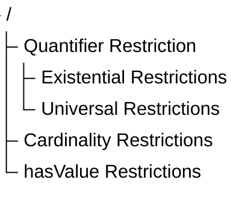

# Chapter 14 -- Existential Restrictions: From Semantic Relationships to Semantic Requirements

Table of Contents:
- [14.1 Chapter Introduction -- From Semantic Boundaries to Semancic Requirements](#141-chapter-introduction----from-semantic-boundaries-to-semancic-requirements)
- [14.2 Why RDF and RDFS Are Not Enough](#142-why-rdf-and-rdfs-are-not-enough)
- [14.3 Property Restrictions -- Introducing Semantic Logic in OWL](#143-property-restrictions----introducing-semantic-logic-in-owl)
- [14.4 Understanding Existential Restriction in Semantic Terms](#144-understanding-existential-restriction-in-semantic-terms)
- [14.5 Existential Restriction in `Pizza.owl` -- Understanding Tutorial 4.10.1 and 4.10.2](#145-existential-restriction-in-pizzaowl----understanding-tutorial-4101-and-4102)

## 14.1 Chapter Introduction -- From Semantic Boundaries to Semancic Requirements

By the end of Chapter (13), you had already begun understanding an important truth about ontology engineering:

> semantic relationships alone are not sufficient to fully describe meaning!

Through **Property Domain and Range**, ontology engineers learned how to establish:

> semantic boundaries.

For example, `hasTopping` may define:

| Domain | Range |
| --- | --- |
| `Pizza` | `PizzaTopping` |

This tells ontology something important:

> pizzas may have toppings.

Likewise:

> topping belong to pizzas.

However, a subtle but important limitation still remains.

Consider the following question:

> Does every pizza necessarily have toppings?

From the perspective of:

> Domain and Range alone,

the answer is:

> **not necessarily.**

Why?

Because Domain and Range describe:

> where relationships are logically valid,

but they do not express:

> what relationships are semantically required.

This distinction represents one of the most important maturity transitions in ontology engineering.

In earlier chapters, ontology primarily focused on:

> semantic structure.

You created:

- classes
- subclass hierarchies
- object properties
- inverse properties
- property characteristics
- semantic boundaries

Ontology therefore answered questions such as:

- What things exist?
- How are concepts related?
- What semantic relationships are valid?

Charter 14 now introduces a deeper semantic question:

> **What relationships must exist?**

This shift is profound.

Because ontology is no longer merely describing:

> allowable semantic connections.

Ontology now begins defining:

> **semantic obligations.**

For example:

Saying:

> Pizza `hasBase` PizzaBase

describes:

> a valid relationship.

But saying:

> every Pizza must have at least one PizzaBase

introduces something fundamentally different:

> a semantic requirement.

Ontology therefore begins evolving from:

> connected semantics

toward:

> **logical semantics.**

This chapter introduces one of OWL's most powerful modeling constructs:

> **Existential Restriction**

often expressed through:

> `someValuesFrom`

At first glance, existential restrictions may appear technically simple.

Yet conceptually, they represent a major milestone!

Because this is the point where ontology starts moving toward:

> **machine-understandable logic.**

Rather than merely storing knowledge, ontology begins expressing:

> how knowledge should behave.

Within the broader direction of:

> **Executable Knowledge Architecture (EKA)**

this chapter represents another maturity leap:

from:

> governed semantic relationships

toward:

> **governed semantic requirements.**

## 14.2 Why RDF and RDFS Are Not Enough

To fully appreciate why `existential restrictions` matter, it is helpful to revisit a theme introduced earlier in:

> **Chapter 08 -- RDF as a Language**

As discussed previouly, RDF provides a remarkably elegant machanism for representing knowledge.

Through simple triple "subject $\rightarrow$ predicate $\rightarrow$ object", RDF allows semantic relationships to be represented consistently.

For example:

> MargheritaPizza $\rightarrow$ `hasTopping` $\rightarrow$ MozzarellaTopping

In Portégé, we model `Pizza.owl` as below screen:

This structure gives ontology an important foundation:

> connected meaning.

Later, RDFS (RDF Schema) extends this capability by introducing:

- class hierarchies
- subclass relationships
- Domain definitions
- Range definitions

These additions improve semantic understanding considerably.

For example:

RDFS can express:

> Pizza is a subclass of Food

or:

> `hasTopping` connects "Pizza $\rightarrow$ PizzaTopping".

At this stage, ontology becomes:

> semantically structured.

However, an important limitation still exists!

RDFS can describe:

> semantic possibility.

But it cannot adequately express:

> semantic **necessity**!

This distinction becomes critically important.

Consider the following statement:

> Pizza `hasBase` PizzaBase

What does this actually mean?

It tells ontology:

> pizza **may** logically has pizza bases.

But does ontology know that:

> every pizza **must** have a base?

NO!

RDFS alone cannot fully express this requirement.

Likewise:

> MargheritaPizza `hasTopping` MozzarellaTopping

does not automatically mean:

> every MargheritaPizza requires mozzarella.

Ontology still lacks a way to formalize:

> semantic **obligation**.

This limitation becomes increasingly problematic in real enterprise modeling.

Imaging an enterprise architecture ontology.

Suppose an organization defines:

> Application `hostedOn` Infrastructure

This relationship may be semantically valid.

However, enterprise architects often need stronger semantic meaning, like:

> every production application must be `hosted on` infrastructure.

Notice the difference.

The first statement describes: **possibility**;

The second introduces: **requirement**.

This is precisely where:

> **OWL (Web Ontology Language)**

extends semantic capability beyond RDF and RDFS.

OWL introduces:

> logical expressiveness.

Ontology now becomes capable of describing:

- Rules,
- Requirements,
- Obligations, and
- **machine-interpretable semantic logic**.

This transition is important enough to view as a fundamental evolution:

- **RDF** - connected data - *"Something is connected to something."*
- **RDFS** - structured semantices - *"These kinds of things may be connected in these ways."*
- **OWL** - logical semantics - *"These kinds of things **must** be connected in these ways."*

## 14.3 Property Restrictions -- Introducing Semantic Logic in OWL

By the end of Chapter (13), ontology had already become significantly more expressive.

You could now model:

- classes and subclass hierarchies
- object properties and inverse properties
- property characteristics
- semantic boundaries through Domain and Range

However, ontology skill lacked an important capability:

> **the ability to formally describe semantic conditions.**

consider the following statement:

> `Pizza` `hasTopping` `PizzaTopping`

This tells ontology something useful already:

> pizza may have toppings.

Yet, ontology still cannot answer a deeper semantic question:

> what makes a pizza become a specific kind of pizza?

For example:

What semantically distinguishes:

> `MargheritaPizza`

from:

> `AmericanPizza`

or:

> `VegetarianPizza`?

Either pizza above may have some topping, but merely defining classes and relationships like this way is insufficient.

Ontology now requires a mechanism capable of expression:

> **semantic constraints**

and:

> **logical requirements.**

This need introduces one of the most important constructs within:

> **OWL (Web Ontology Language)**

knows as:

> **Property Restrictions.**

Property restrictions allow ontology engineers to formally describe:

- how properties should behave?
- what relationships are expected? and
- what semantic conditions must hold?

In other words, property restrictions move ontology from:

> sementic structure

toward:

> **semantic logic.**

This distinction is fundamental.

Because until now, ontology primarily described:

> what thinks exist

and

> how things connect.

With property restrictions, ontology begins expressing:

> **what things mean.**

This is one of the first moments where ontology becomes **logicall interpretable**.

And consequently **reasoner-friendly.**

Within OWL, property restrictions are represented as:

> logical class descriptions.

Meaning: A class can now be defined not merely through **a name**, but through **semantic conditions.**

For example:

Instead of manually declaring:

> `CheesyPizza`

ontology can describe it logically as:

> a `Pizza` that has **at least one** `CheeseTopping`.

This subtle shift changes ontology dramatically.

Meaning is no longer **manually assigned.**

Meaning becomes **logically inferable.**

To better understand property restrictions, it is useful to view them as a family of semantic mechanisms.

Broadly speaking as above tree-view, OWL property restrictions can be grouped into three major categories:

<h3>1. Quantifier Restrictions</h3>

Quantifier restrictions describes:

> **whether certain relationships exist**

or:

> whether relationships are restricted to certain types.

These restrictions focus on semantic existence and semantic scope.

Quantifier restrictions include:

<h4>Existential Restriction</h4>

(`someValueFrom`)

Meaning: there exists at least one relationship satisfying a condition.

Example:

> `Pizza` `hasTopping` some `CheeseTopping`

Meaning:

> every pizza must have at least one cheese topping.

<h4>Universal Restriction</h4>

(`allValueFrom`)

Meaning: all related values must belongs to a specified class.

Example:

> `Pizza` `hasTopping` only `PizzaTopping`

Meaning:

> every topping of a pizza must be a `PizzaTopping`.

Notice the important distinction.

- Existential restriction expresses: **minimum semantic existence.**
- Universal restriction expresses: **semantic limitation.**

These two concepts are frequently confused by beginners.

Yet they represent fundamentally different forms of semantic reasoning.

Chapter (14) begins with:

> **Existential Restriction**

because ontology must firest understand:

> required existence

before learning:

> restricted universality.

Do you see any similarity for this ontology (machine) learning approach with how human being learn? True, they are in the common approach.

<h3>2. Cartinality Restrictions</h3>

While quantifier restrictions focus on existence, cardinality restrictions focus on **quantity.**

Ontology may sometimes need to define:

> how many relationships are permitted or required.

OWL therefore supports several forms of:

> cardinality constraints.

Including:

<h4>(1) Minimum Cardinality</h4>

(`minCardinality`)

Meaning: at least N relationships must exist.

Example:

> `Pizza` `hasTopping` minimum 2

Meaning:

> a pizza must have at least two toppings

<h4>(2) Maximum Cardinality</h4>

(`maxCardinality`)

Meaning: no more than N relationships may exist.

Example:

> `Person` `hasBiologicalMother` maximum 1

Meaning:

> a person cannot have more than one biological mother.

<h4>(3) Exact Cardinality</h4>

(`exactCardinality`)

Meaning: exactly N relationships are required.

Example:

> `Standard_Bicycle` `hasWheel` exactly 2

Meaning:

> standard bicycles must have precisely two wheels.

Cardinality restrictions become particularly important in:

- enterprise governance,
- data quality validation, and
- business rule enforcement.

Within enterprise architecture, examples may include:

> an `business_application` must have exactly one `system_owner`

or:

> a `business_process` must involve at least one `responsible_role`.

Ontology therefore becomes increasingly capable of expressing:

> operational logic,

rather than merely:

> descriptive semantics.

<h3>3. Value Restrictions</h3>

The third major category involves **specific required values** represented through `hasValue`.

Unlike existential restriction, which asks for:

> as least one qualifying relationship,

value restriction specifies:

> a particular exact value.

For example:

Suppose an enterprise policy states:

> all `production_applications` must belong to environment "`Production`".

Ontology may express:

> `hasEnvironment` `value` `Production`

This means:

> the relationship must point to a specific predefined individual.

In `Pizza.owl` terms, imagine requiring:

> a `NamedPizza` must always have a particular base.

Rather than merely saying:

> some pizza base exists,

ontology would specify:

> one exact expected value.

Value restrictions therefore introduce:

> semantic precision

as well as:

> semantic determinism.

Together, these three categories establish the foundation of:

> OWL semantic logic.

They transform ontology from:

> semantic modeling

into:

> formal semantic definition.

Summrized view in below comparison table from also the evolution discussed in 14.2 from RDF/RDFS to OWL:

| Layer | Core Capability | Limitation |
| --- | --- | --- |
| RDF | Triples (connected meaning) | No structure |
| RDFS | Class hierarchies, Domain & Range (structured semantics) | Can only describe **possibility**, cannot express **necessity** |
| OWL | Logical expressiveness (rules, requirements, obligations) | -- |

Existential restrictions represent one of the earliest moments where you may begin seeing:

> ontology as **logic**.

Rather than merely:

> ontology as structure.

And this transition fundamentally changes how ontology can support:

- Reasoning ($R$),
- Governance ($\Gamma$), and eventually
- executable intelligence.

## 14.4 Understanding Existential Restriction in Semantic Terms

Existential restrictions are one of the CORE logical constructs of OWL.

In Protégé, you encounter existential restriction through the expression:

> **someValueFrom**

At first encounter, this terminology may feel unfamiliar.

However, the underlying idea is surprisingly intuitive.

Existential restriction expresses a simple but powerful statement:

> **there exists at least one relationship satisfying a condition.**

In **Description Logic (DL)**, this is often represented conceptually as:

> $\exists R.C$

Meaning: there exists at least one relationshiop $R$ to something belonging to class $C$.

=== Interesting Read: More mathematical notation ===

Expand above notation in DL, the concept of an existential restriction is formally defined using the following mathematical notation:

$\exists R.C = \{ x \in \Delta^\mathcal{l} \mid \exists y \in \Delta^\mathcal{l} : (x,y) \in R^\mathcal{l} \land y \in C^\mathcal{l} \}$

Breakdown of this formula --

- $\Delta^\mathcal{l}$: The **domain of interpretation**, which represents the set of all individuals in the world being modeled.
- $x, y$: Individual elements within that domain.
- $R^\mathcal{l}$: The interpretation of the **role** (relationship) $R$, represented as a set of pairs of individuals.
- $C^\mathcal{l}$: The interpretation of the **concept** (class) $C$, represented as the set of all individuals that belong to that class.
- $(x,y) \in R^\mathcal{l}$: A statement that a relationship $R$ exists between individual $x$ and individual $y$.
- $y \in C^\mathcal{l}$: A statement that the individual $y$ is a member of the class $C$.

Conceptual visualization --

To understand this mapping, let's imaging a `parentTo` relationship connected to a `Person` class:

In short, the expression $\exists R.C$ describes the set of all individual $x$ that have **at least one** successor $y$ through the relationship $R$, such that $y$ is an instance of class $C$.

=== END ===

Within our `Pizza.owl` ontology, consider:

> `hasTopping` `some` `MozzarellaTopping`

Semantically, this means:

> there exists at least one topping relationship to mozarella topping.

This statement introduces something very important:

> semantic necessity.

Ontology now expects:

> at least one qualifying relationship.

This differs significantly from earlier chapters.

- Previously: relationship were optional.
- Now: relationships become logically meaningful (necessity).

A useful way to understand existential restriction is through the phrase:

> **AT LEAST ONE.**

Not:

> exactly one.

Not:

> all toppings.

Simply: there exists at least one!

This distinction matters enormously.

Because ontology reasoning depends heavily on:

> precise semantics.

Let's see an example in `Pizza.owl`:

Suppose a class defines:

> `MargheritaPizza`

as:

> `hasTopping` `some` `MozzarellaTopping`

Ontology now understand:

> mozzarella topping is semantically necessary by Margherita pizza.

Without satisfying this requirement:

> the pizza cannot fully conform to the class meaning, semantically.

This introduces another important shift.

Ontology modeling now begins answering:

> **What makes something what it is?**

A `MargheritaPizza` is not merely:

> a pizza.

It becomes:

> a pizza satisfying semantic conditions.

This distinction transform ontology engineering from:

> classification

toward:

> **formal semantic definition**.

Ontology therefore becomes increasingly capable of expressing:

> adaptive domain knowledge.

In enterprise context, this becomes extremely valuable.

See another example:

A `Critical_Application` may require:

> at least one `Disaster_Recovery_Mechanism`.

Or:

`Sensitive_Data_Process` may require:

> at least one `Compliance_Concrol`.

Ontology can now formally describe:

> mandatory semantic conditions.

Rather than merely:

> possible relationships.

This marks another important maturity leap toward:

> executable knowledge systems.

## 14.5 Existential Restriction in `Pizza.owl` -- Understanding Tutorial 4.10.1 and 4.10.2

Within the `Pizza.owl` tutorial, Michael introduces existential restriction carefully and intentionally.

---

Last Updated at: 2026/06/07