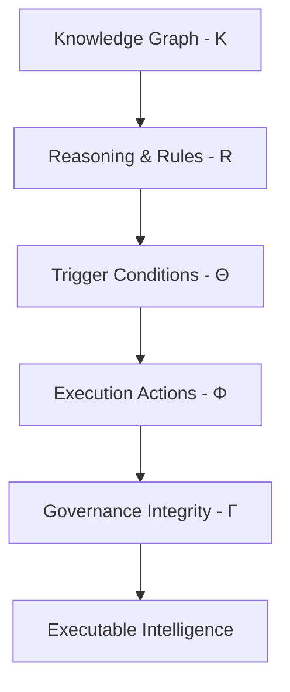

# Chapter 14 -- Semantic Requirements – From Existential Restrictions to Universal Rules (part 4)

Table of Contents:
- [14.10 Implementing `some` and `only` in Graph Database - A Neo4j Perspective](#1410-implementing-some-and-only-in-graph-database---a-neo4j-perspective)
  - [14.10.1 Implementing Existential Restriction (`some`) in Neo4j](#14101-implementing-existential-restriction-some-in-neo4j)
  - [14.10.2 Implementing Universal Restriction (`only`) in Neo4j](#14102-implementing-universal-restriction-only-in-neo4j)
  - [14.10.3 Combining `some` and `only` in Neo4j](#14103-combining-some-and-only-in-neo4j)
  - [14.10.4 Cypher Query vs. Pellet Reasoner vs. Open World Assumption](#14104-cypher-query-vs-pellet-reasoner-vs-open-world-assumption)
      - [Part 1: Existential Restriction (`some`) -- "At Least One Must Exist"](#part-1-existential-restriction-some----at-least-one-must-exist)
      - [Part 2: Universal Restriction (`only`) -- "Everything Must Conform"](#part-2-universal-restriction-only----everything-must-conform)
      - [Part 3: Combining `some` and `only` -- The Composite Pattern](#part-3-combining-some-and-only----the-composite-pattern)
      - [Part 4: Integrated Comparison - `some` vs `only` Across Both Worlds](#part-4-integrated-comparison---some-vs-only-across-both-worlds)
      - [Part 5: Why the Difference Matters - From Query to Reasoning](#part-5-why-the-difference-matters---from-query-to-reasoning)
      - [Part 6: Practical Guidance - When to Use Each Approach](#part-6-practical-guidance---when-to-use-each-approach)
      - [Summary: The Logical Bridge Between Sections 14.10.1~14.10.3 and True OWL Reasoning](#summary-the-logical-bridge-between-sections-1410114103-and-true-owl-reasoning)
- [14.11 EKA Perspective -- Restriction as Semantic Governance](#1411-eka-perspective----restriction-as-semantic-governance)
  - [14.11.1 Restriction and the Knowledge Graph Layer ($K$)](#14111-restriction-and-the-knowledge-graph-layer-k)
  - [14.11.2 Restriction and the Reasoning \& Rules Layer ($R$)](#14112-restriction-and-the-reasoning--rules-layer-r)
  - [14.11.3 Restriction and the Trigger Layer ($\\Theta$)](#14113-restriction-and-the-trigger-layer-theta)
  - [14.11.4 Restriction and the Execution Layer ($\\Phi$)](#14114-restriction-and-the-execution-layer-phi)
  - [14.11.5 Restriction and the Governance Layer ($\\Gamma$)](#14115-restriction-and-the-governance-layer-gamma)
  - [14.11.6 Restriction as the Foundation of Executable Intelligence](#14116-restriction-as-the-foundation-of-executable-intelligence)

## 14.10 Implementing `some` and `only` in Graph Database - A Neo4j Perspective

At this point, you may reasonably ask:

> If existential and universal restrictions are so powerful, can similar logic be implemented in a graph database such as Neo4j?

The answer is:

> **Yes -- but with important limitations.**

This distinction is particularly important because many enterprise practitioners initially assume:

> **Neo4j = Ontology**

or:

> **Knowledge Graph automatically means semantic intelligence.**

In reality, graph databases and ontologies solve fundamentally different problems.

Neo4j primarily manages **connected data.**

Ontology additionally governs **logical meaning**. (note the "additionally" wording)

A graph database excels at:

- relationship storage,
- graph traversal, and
- connected querying.

However, Neo4j does not natively understand $\exist R.C$ or $\forall R.C$, nor does it automatically infer:

- class membership,
- semantic consistency, or,
- logical identity.

Instead, engineers must explicitly implement semantic behavior through:

> **Cypher queries.**

This becomes easier to understand using `VegetarianPizza`.

Suppose Neo4j contains below relationship:

`(:Pizza)-[:HAS_TOPPING]->(:Topping)`

You can use below Cypher to create these 2 nodes and 1 relationship (note: this is just for demo purpose, using below query you'll create two actual instances as well):

`CREATE (:Pizza)-[:HAS_TOPPING]->(:Topping)`


A pizza may connect to `MushroomTopping`, `TomatoTopping`, or `PepperoniTopping`.

Following Cypher queries are used to create these new relationships:

```sql
MERGE (p1:Pizza {name:"MyPizza1"})
MERGE (p2:Pizza {name:"MyPizza2"})
MERGE (p3:Pizza {name:"MyPizza3"})
MERGE (t1:Topping {name:"MushroomTopping"})
MERGE (t2:Topping {name:"TomatoTopping"})
MERGE (t3:Topping {name:"PepperoniTopping"})
MERGE (p1)-[:HAS_TOPPING]->(t1)
MERGE (p2)-[:HAS_TOPPING]->(t2)
MERGE (p3)-[:HAS_TOPPING]->(t3)
```

Then you may extract them as below:


Neo4j itself does not automatically determine:

> whether the pizza qualifies as vegetarian.

Instead, semantic interpretation must be manually implemented.

> Tip: You may find the working Neo4j dump database in ebook's *neo4j* subfolder.

### 14.10.1 Implementing Existential Restriction (`some`) in Neo4j

Recall earlier `hasTopping some VegetableTopping` means:

> at least one vegetable topping **must** exist.

In mathematical notation:

$\exist \: \text{hasTopping}.\text{VegetableTopping}$

This expression asks:

> "Can qualifying evidence be found?"

Inside Neo4j, this behavior can be approximated using:

```sql
MATCH (p:Pizza)
WHERE EXISTS {
  MATCH (p)-[:HAS_TOPPING]->(:VegetableTopping)
}
RETURN p.name AS Pizza
```

To practice above query, we need to add `VegetableTopping` as another node in Neo4j, then double assign `MushroomTopping` and `TomatoTopping` to this new node:

```sql
MATCH (n:Topping {name:"MushroomTopping"}), (m:Topping {name:"TomatoTopping"})
SET n:VegetableTopping 
SET m:VegetableTopping
RETURN m, n LIMIT 25;
```

After above preparation, using `CALL db.schema.visualization`, you can see below schema:


Now, you may execute previous Cypher query, and get result `MyPizza`:


Notice the similarity.

The Cypher keyword `EXISTS` functions conceptually like:

> existential search.

Neo4j asks:

> "Does there exist at least one path to `VegetableTopping`?"

If answer is Yes, the pizza satisfies the condition.

However, an important difference remains.

Neo4j executes **an explicit query.**

While ontology instead performs **automatic reasoning.**

Once semantic restrictions are defined, the reasoner continuously evaluates:

> logical consequences.

Not require engineers repeatedly writing validation logic like in Neo4j.

### 14.10.2 Implementing Universal Restriction (`only`) in Neo4j

Now consider: `hasTopping only VegetableTopping`.

In mathematical notation: $\forall \: hasTopping.VegetableTopping$.

Unlike existential restriction, universal restriction asks:

> "Are all relationships semantically valid?"

This creates an interesting challenge.

Neo4j has no direct equivalent for $\forall$, instead, universal semantic are typically approximated through:

> **violation detection.**

Rather than proving **everything is valid.**

Neo4j attempts to prove **nothing invalid exists** (or say "nothing is not invalid")

For example below Cypher query:

```sql
MATCH (p:Pizza)
WHERE NOT EXISTS {
  MATCH (p)-[:HAS_TOPPING]->(t)
  WHERE NOT t:VegetableTopping
}
RETURN p.name AS VegetarianCandidate
```

You may see below result:


> [!Note] Why here still `MyPizza1` and `MyPizza2`?

This query asks:

> "Can any invalid topping be found?"

If no violating topping exists, the pizza passes validation.

This logic closely resembles $\forall \: hasTopping.VegetableTopping$ where semantic correctness is evaluated through:

> absence of contradiction.

Notice how this aligns perfectly with the reasoning distinction discussed earlier:

- `some` $\rightarrow$ for qualifying evidence
- `only` $\rightarrow$ for violating evidence

Ontology and Cypher therefore share:

> similar logical goals.

But they implement them differently.

### 14.10.3 Combining `some` and `only` in Neo4j

To simulate:

`VegetarianPizza EquivalentTo`<br>
`Pizza`<br>
`and (hasTopping some VegetableTopping)`<br>
`and (hasTopping only VegetableTopping)`

Neo4j must manually combine **both logical conditions.**

Below is the Cypher query:

```sql
MATCH (p:Pizza)
WHERE EXISTS {
  MATCH (p)-[:HAS_TOPPING]->(:VegetableTopping)
}
AND NOT EXISTS {
  MATCH (p)-[:HAS_TOPPING]->(t)
  WHERE NOT t:VegetableTopping
}
RETURN p.name AS VegetarianPizza
```

Result as below:


This query approximates ontology semantics by enforcing:

1. At least one vegetable topping exists, and
2. No invalid topping exists

The result may appear similar to OWL reasoning.

However, the implementation philosophy remains fundamentally different.

Neo4j performs **procedural semantic checking.**

Ontology performs **declarative semantic reasoning**.

In Neo4j, engineers must repeatedly write logic describing:

> how validation should happen.

In ontology, meaning becomes:

> part of the model itself.

The reasoner automatically performs **inference**, **validation** and **classification**.

This reveals an important architectural distinction:

- Neo4j $\rightarrow$ relationship intelligence
- OWL $\rightarrow$ semantic intelligence

Or more precisely:

- Graph Database $\rightarrow$ connected facts
- Ontology $\rightarrow$ governed meaning

This distinction becomes increasingly important as enterprise knowledge graphs scale.

Without ontology, semantic logic often becomes scattered across:

- Cypher queries,
- applications,
- APIs, and
- business rules.

Over time, semantic governance becomes fragmented.

Ontology instead centralizes:

> meaning itself.

Meaning no longer lives only inside:

> application code.

It becomes:

> an explicit enterprise asset.

### 14.10.4 Cypher Query vs. Pellet Reasoner vs. Open World Assumption

Sections 14.10.1 through 14.10.3 established a practical bridge between OWL restrictions and Cypher queries in Noe4j:

- Section 14.10.1 demonstrated how to implement existential restriction (`some`) using pattern matching with `MATCH` and `WHERE` clauses.
- Section 14.10.2 showed the implementation of universal restriction (`only`) using `NOT EXISTS` to detect invalid relationships.
- Section 14.10.3 then combined both restrictions, illustrating how complex semantic requirements -- such as "a pizza must have at least one cheese topping and no non-pizza toppings" -- can be expressed as graph patterns.

However, this pedagogical bridge -- while valuable for initial understanding and hands-on experimentation -- carries a significant risk:

> it may obscure two foundational semantic differences that distinguish OWL reasoning from graph database querying.

First, as discussed in 14.7.4, OWL reasoners operate under the **Open World Assumption (OWA)**, while Neo4j (like most property graph databases) operates under the **Closed World Assumption (CWA)**.

Second, and more critically, the Cypher implementations in 14.10.1~14.10.3 treat `some` and `only` as *query patterns* that return results, whereas an OWL reasoner treats them as *logical axioms* that derive new knowledge.

To build truly robust executable knowledge architectures, an ontology engineer must understand how *both* restriction types behave under *both* world assumptions, and how they contrast with the property graph querying paradigm demonstrated in the previous three sections.

This section provides a two-dimension comparative analysis using a unified scenario. We keep extending our `Pizza.owl` knowledge base to evaluate both:

- **Existential Restriction (`some`)**: `hasTopping some CheeseTopping` -- "At least one cheese topping must exist."
- **Universal Restriction (`only`)**: `hasTopping only CheeseTopping` -- "If toppings exist, they must all be PizzaToppings."

**Example Scenario Definition**

**Ontology Definition:**

```
Existential Rule (some):
  CheesePizza EquivalentTo: Pizza and (hasTopping some CheeseTopping)

Universal Rule (only):
  CleanPizza EquivalentTo: Pizza and (hasTopping only PizzaTopping)
```

**Knowledge Base (Asserted Facts):**

| Individual | Asserted Type | Asserted Relationships | Class Hierarchy |
| --- | --- | --- | --- |
| **PizzaA** | `Pizza` | `hasTopping MozzarellaTopping` | `MozzarellaTopping` $\sqsubseteq$ `CheeseTopping` $\sqsubseteq$ `PizzaTopping` |
| **PizzaB** | `Pizza` | *(no `hasTopping` assertions)* | --- |
| **PizzaC** | `Pizza` | `hasTopping ChocolateTopping` | `ChocolateTopping` $\sqsubseteq$ `CandyTopping` (`CandyTopping` $\sqcap$ `PizzaTopping` = `owl:Nothing`) |
| **PizzaD** | `Pizza` | <li>`hasTopping MozzarellaTopping`</li><li>`hasTopping ChocolateTopping`</li> | (As above) |

**Initialize ontology in Protégé:**

New working ontology file: `/ebook/rdf/pizza-ebook_14.10.4.rdf`.

Base on above asserted facts, you may find following initialized knowledge:


- Set `Disjoint With` between `PizzaTopping` and `CandyTopping`
- Set proper Domain and Range to relationship `hasTopping`
- Create necessary instances for building up the relationships.

**Initialize graph database in Neo4j:**

Using following Cypher query to create all asserted facts:

```sql
MERGE (a:Pizza {name:"PizzaA"})-[h1:HAS_TOPPING]-(t1:Topping {name:"MozzarellaTopping"})
MERGE (b:Pizza {name:"PizzaB"})
MERGE (c:Pizza {name:"PizzaC"})-[h2:HAS_TOPPING]-(t2:Topping {name:"ChocolateTopping"})
MERGE (d:Pizza {name:"PizzaD"})-[h3:HAS_TOPPING]-(t1)
MERGE (d)-[h4:HAS_TOPPING]-(t2)
MERGE (t3:Topping {name:"CheeseTopping"})
MERGE (t4:Topping {name:"PizzaTopping"})
MERGE (t5:Topping {name:"CandyTopping"})
MERGE (t1)-[c1:CHILD_OF]->(t3)-[p1:PARENT_OF]->(t1)
MERGE (t3)-[c2:CHILD_OF]->(t4)-[p2:PARENT_OF]->(t3)
MERGE (t2)-[c3:CHILD_OF]->(t5)-[p3:PARENT_OF]->(t2)
RETURN a,b,c,d,t1,t2,h1,h2,h3,h4,t3,t4,t5,c1,c2,c3,p1,p2,p3
```


- Use two direction `PARENT_OF` and `CHILD_OF` for inverse class hierarchical structure

Since we have maximum two levels class hierarchy structure, to simulate the Protégé's Parent/Child inferencing behavior into Neo4j, run below Cypher query twice:

```sql
MATCH (p:Pizza)-[r1:HAS_TOPPING]->(t1:Topping)-[r2:CHILD_OF]->(t2:Topping)
MERGE (p)-[r3:HAS_TOPPING]->(t2)
RETURN p,t1,t2,r1,r2,r3
```


Note: here we don't see `PizzaB` since it has no topping relationship.

##### Part 1: Existential Restriction (`some`) -- "At Least One Must Exist"

**Goal:** Determine whether each individual satisfies `hasTopping some CheeseTopping` (i.e., is a `CheesePizza`).

Recall from 14.10.1 that the Cypher implementation of `some` uses a single pattern match:

```sql
MATCH (p:Pizza)-[:HAS_TOPPING]->(t1:Topping)
WHERE toLower(t1.name) CONTAINS "cheese"
RETURN p
```

You get `PizzaA` and `PizzaD`

Note: we don't create `CheeseTopping` as another node in Neo4j, it's one instance of `Topping` node and we use `WHERE` clause to filter that.

Now compare this closed-world query against OWL open-world reasoning:

| Individual | Cypher (CWA) - per 14.10.1 | Pellet Reasoner (OWA) | OWA Formal Conclusion |
| --- | --- | --- | --- |
| **PizzaA** | ✅ **Returned** - Pattern matches | ✅ **Inferred as `CheesePizza`** - Evidence found | **True** - Sufficient evidence exists |
| **PizzaB** | ❌ **Not returned** - No matching relationship | ❌ **Not inferred** - Also not inferred as $\neg CheesePizza$ | **Unknown** - Missing information; future facts could change this |
| **PizzaC** | ❌ **Not returned** - Target is not `CheeseTopping` | ❌ **Not inferred as `CheesePizza`** - Condition false for known relationship | **False** - Evidence exists and definitively fails the condition |
| **PizzaD** | ✅ **Returned** - At least one relationship satisfies pattern | ✅ **Inferred as `CheesePizza`** - `MozzarellaTopping` satisfies condition | **True** - One valid relationship is sufficient; invalid relationships are irrelevant |

**Key Insight for `some`**:

- Under OWA, the existential restriction is *monotonic*. Once satisfied (`PizzaD`), it returns satisfied regardless of additional assertions. The reasoner searches for *at least one piece of validating evidence.*
- The Cypher query from 14.8.6.1 and customized here correctly identifies `PizzaA` and `PizzaD`, but it cannot distinguish `PizzaB` (unknown) from `PizzaC` (false) -- both simply "not returned". This conflation is the primary limitation of the closed-world emulation.

##### Part 2: Universal Restriction (`only`) -- "Everything Must Conform"

**Goal:** Determine whether each individual satisfies `hasTopping only PizzaTopping` (i.e., has no topping outside the `PizzaTopping` class).

Recall from 14.10.2 that the Cypher implementation of `only` uses `NOT EXISTS` to detect violations:

```sql
MATCH (p:Pizza)
WHERE NOT EXISTS {
  (p)-[:HAS_TOPPING]->(t:Topping)
  WHERE NOT toLower(t.name) CONTAINS "pizza"
}
RETURN p
```

Result is `PizzaB` in the Neo4j graph; however, our testing graph doesn't return `PizzaA` due to we don't complicated query to check Parent/Child context here, in reality, `PizzaA` si also fulfill the CWA.

Now compare this against OWL open-world reasoning:

| Individual | Cypher (CWA) - per 14.10.2 | Pellet Reasoner (OWA) | OWA Formal Conclusion |
| --- | --- | --- | --- |
| **PizzaA** | ✅ **Returned** - No invalid topping found | ✅ **Satisfies restriction** - All relationships valid | **True** - All asserted relationships are valid |
| **PizzaB** | ✅ **Returned (vacuously)** - See vacuous truth discussion in 14.8.3 | **True (vacuously)** - No counterexample exists |
| **PizzaC** | ❌ **Not returned** - Invalid topping detected | ❌ **Violates restriction** - Counterexample found | **False** - Definitive counterexample exists |
| **PizzaD** | ❌ **Not returned** - The `ChocolateTopping` is invalid, even though `MozzarellaTopping` is valid | ❌ **Violates restriction** - Universal quantifier requires *all* relationships to be valid | **False** - A single counterexample falsifies universal condition |

**Key Insight for `only`:**

- Under OWA, the universal restriction is *falsified by a single counterexample*. The reasoner searches for *any violating evidence*.
- The Cypher query from 14.10.2 correctly identifies valid pizzas (A and B) -- has explained result of A -- and excludes invalid ones (C and D). However, like the `some` case, it conflates `PizzaB` (vacuously true) with `PizzaA` (genuinely true), and cannot represent the logical distinction between "no toppings yet" and "has only valid toppings."

##### Part 3: Combining `some` and `only` -- The Composite Pattern

Section 14.10.3 demonstrated how to combine both restrictions in a single Cypher query, identifying pizzas that satisfy *both* conditions: at least one cheese topping AND no non-pizza toppings.

```sql
MATCH (p:Pizza)
WHERE (p)-[:HAS_TOPPING]->(:CheeseTopping)
AND NOT EXISTS {
  (p)-[:HAS_TOPPING]->(t:Topping)
  WHERE NOT toLower(t.name) CONTAINS "pizza"
}
RETURN p
```

Note: it should have `PizzaA` returned.

The following table shows the integrated results across all four individuals, comparing the Cypher composite query against OWL reasoning for the combined definition:

**Combined Definition:**

`GoodPizza EquivalentTo`<br>
`Pizza`<br>
`and (hasTopping some CheeseTopping)`<br>
`and (hasTopping only PizzaTopping)`

| Individual | Cypher (CWA) - per 14.10.3 | Pellet Reasoner (OWA) | OWA Formal Conclusion |
| --- | --- | --- | --- |
| **PizzaA** | ✅ **Returned** - Has cheese topping AND all toppings valid | ✅ **Inferred as GoodPizza** - Both conditions satisfied | **True** - Satisfies both existential and universal requirements |
| **PizzaB** | ❌ **Not returned** - Fails `some` condition (no cheese topping) | ❌ **Not inferred** - `some` unknown; `only` vacuous but insufficient | **Unknown** - Mising information for condition |
| **PizzaC** | ❌ **Not returned** - Fails `some` (no cheese topping) AND fails `only` (invalid topping) | ❌ **Not inferred** - `some` false, `only` false | **False** - Definitive failure on both dimensions |
| **PizzaD** | ❌ **Not returned** - Has cheese topping (passes `some`) BUT fails `only` (invalid topping exists) | ❌ **Not inferred as GoodPizza** - `only` condition violated | **False** - Universal restriction fails despite existential satisfaction |

**Critical Observation - `PizzaD`:**

- This individual reveals the non-complementary nature of `some` and `only`.
- A pizza can simultaneously satisfy an existential restriction (it has at least one cheese topping) *and* violate a universal restriction (it also has a non-pizza topping).
- In the composite query from 14.10.3, `PizzaD` is correctly excluded.
- However, an OWL reasoners provides additional insight: `PizzaD` *is* a `CheesePizza` (from Part 1) but is *NOT* a `GoodPizza` (from Part 3).
- This distinction -- that an individual can belong to one inferred class but not another -- is a form of logical nuance that Cypher's flat pattern matching CANNOT express without explicitly modeling both classifications.

##### Part 4: Integrated Comparison - `some` vs `only` Across Both Worlds

The following table integrates both restriction types, showing the classification outcomes for each individual under each condition, comparing Cypher (from 14.10.1~14.10.3) against OWL reasoning:

| Individual | `some CheeseTopping` (Cypher/CWA) | `some CheeseTopping` (Pellet/OWA) | `only PizzaTopping` (Cypher/CWA) | `only PizzaTopping` (Pellet/OWA) |
| --- | --- | --- | --- | --- |
| **PizzaA** | ✅ True | ✅ True | ✅ True | ✅ True |
| **PizzaB** | ❌ False | ❓ Unknown | ✅ True | ✅ True (vacuous) |
| **PizzaC** | ❌ False | ❌ False | ❌ False | ❌ False |
| **PizzaD** | ✅ True | ✅ True | ❌ False | ❌ False |

**Critical Observation -- the Unknown Column:**

- The most significant difference between the Cypher columns and the OWA columns appears in `PizzaB` for the `some` condition.
- Cypher returns `False` (the individual is excluded from results), while OWL returns `unknown` (the individual cannot be classified yet).
- The difference is not a bug or an implementation detail -- it is the direct consequence of the Open World Assumption.
- In enterprise scenarios where data arrives incrementally (e.g., a pizza order system where toppings are added over time), `Unknown` is often the correct and more useful answer than `False`.

##### Part 5: Why the Difference Matters - From Query to Reasoning

The Cypher implementations in 14.10.1~14.10.3 are *operational filters*. They answer the questions:

> "Given the data currently in the graph, which individuals match my explicit pattern?"

OWL reasoning, by contrast, answers a deeper question:

> "Given the logical axioms defined in the ontology and the data currently available, what class memberships can be *necessarily* inferred -- and which remain *possibly* true?"

| Dimension | Cypher in Neo4j (14.10.1~14.10.3) | OWL Reasoner (e.g. Pellet) |
| --- | --- | --- |
| **Work Assumption** | Closed World: Missing = False | Open World: Missing = Unknown |
| **Restriction Type** | Written as explicit `MATCH` or `NOT EXISTS` patterns | Declared as logical axioms in the ontology |
| **Output** | Query result set (individuals matching pattern) | Inferred class memberships (new `rdf:type` assertions) |
| **Handling of `PizzaB`** | Excluded from `some` query (False) | Not classified as `CheesePizza`, but not classified as $\neg$`CheesePizza` either (Unknown) |
| **Composability** | Manual composition via `AND` / `OR` in query | Automatic composition via logical conjunction in class expression |
| **Maintenance** | Query logic lives in application code | Logical axioms live in ontology; all queries benefit automatically |


##### Part 6: Practical Guidance - When to Use Each Approach

| Scenario | Recommended Approach | Rationale |
| --- | --- | --- |
| **Real-time filtering on stable complete data** | Use Cypher patterns (14.10.1~14.10.3) directly on Neo4j | <li>High performance</li><li>Closed world assumption is valid when data is known to be complete</li> |
| **Incremental data integration from multiple sources** | Use OWL reasoner + materialize inferred types to Neo4j | <li>Open world prevents premature false negatives</li><li>Reasoner handles missing data gracefully</li> |
| **Data quality validation (missing required fields)** | <li>Use `some` restriction with OWL reasoner</li><li>Query for individuals *not* satisfying the restriction</li> | Under OWA, missing data flags as "incomplete" (Unknown), not "invalid" (false) -- more actionable for data stewardship |
| **Compliance checking (forbidden relationships)** | <li>Use `only` restriction with OWL reasoner</li><li>Any violation yields definitive `False`</li> | <li>Universal restriction catch type violations directly</li><li>No ambiguity</li> |
| **Detecting "partially correct" data (like `PizzaD`)** | <li>Combine both restrictions</li><li>Query for individuals satisfying `some` but failing `only` | Identifies data that has required components but also contains invalid elements -- often signals need for human review |
| **Production dashboards on stable data** | Run Cypher queries on a materialized inference graph | First use reasoner to compute all inferred types, then export to Neo4j for high-performance operational queries |

##### Summary: The Logical Bridge Between Sections 14.10.1~14.10.3 and True OWL Reasoning

Let's take a breathe before moving to next section.

> The Cypher patterns in 14.10.1~14.10.3 answers:
> "What matches my explicit patter *right now* in this **closed** graph?"

> An OWL reasoner answers:
> "What *must be true* given my logical axioms and available data -- and what *remains possibly true* -- under open-world semantics?"

The implementations in 14.10.1 (`some` as `MATCH`), 14.10.2 (`only` as `NOT EXISTS`), and 14.10.3 (composite patters) are excellent pedagogical (and self-learning) tools.

They allow developers familiar with graph databases to experience the *filtering effect* of OWL restrictions without immediately learning description logic.

However, as this section has demonstrated, these Cypher patterns are *simulations*, not equivalents.

- They cannot represent the open-world distinction between `False` and `Unknown` (`PizzaB` for `some`),
- They cannot automatically derive new classifications without being explicitly written for each query, and
- They cannot capture the logical nuance that an individual like `PizzaD` can be a `CheesePizza` (satisfying `some`) while not being a `GoodPizza` (failing `only`).

Understanding these differences -- mastering the distinct behaviors of `some` and `only` under both closed-world and open-world assumptions -- is a fundamental maturity milestone in ontology engineering.

As you move from writing Cypher queries (sections 14.10.1~14.10.3) to deploying OWL reasoners in executable knowledge architectures (EKA), this distinction will determine whether your semantic system merely filters data or truly understands it.

Congratulations for you to read through this chapter until here, this is a big long journey for myself as well to make existential and universal restriction clearer. If you feel any parts uncertain, read again and hands-on practice with your Protégé and Neo4j.

## 14.11 EKA Perspective -- Restriction as Semantic Governance

Throughout this chapter, you explored one of the most important capabilities in OWL ontology engineering:

> **Property Restriction.**

At first glance, restrictions may appear to be merely:

> OWL syntax,

or:

> Protégé modeling techniques.

Expressions such as:

`hasTopping some CheeseTopping` or `hasTopping only VegetableTopping`

may initially feel like technical notation designed only to support:

> ontology classification.

However, from the perspective of:

> **Executable Knowledge Architecture (EKA)**,

property restrictions represent something far more significant.

They transform ontology from:

> a passive relationship model

into:

> **governed executable semantic logic.**

This distinction matters.

Because knowledge graphs alone rarely produce:

> meaningful and trustworthy intelligence.

A graph can successfully connect:

`Pizza` $\rightarrow$ `hasTopping` $\rightarrow$ `Mushroom`,

yet, this relationship alone cannot explain:

- whether the pizza should be classified as vegetarian,
- whether semantic expectations are satisfied,
- whether governance policies/rules are violated, or
- whether downstream actions should occur.

In other words, relationships create:

> connected knowledge.

Restrictions create:

> **meaningful semantic behavior.**

Seen through the EKA perspective, property restrictions become an essential bridge between:

> semantic knowledge

and:

> executable intelligence.

Recall the formal EKA tuple introduced in Chapter (00):

$\large{EKA = (K, R, \Theta, \Phi, \Gamma)}$,

where:

- $K$ = Knowledge Graph layer
- $R$ = Reasoning & Rules layer
- $\Theta$ = Trigger layer
- $\Phi$ = Execution layer
- $\Gamma$ = Governance layer

Property restrictions contributes directly across every one of these layers.

### 14.11.1 Restriction and the Knowledge Graph Layer ($K$)

The first contribution appears in:

> **$K$ - Knowledge Graph layer.**

Recall from Chapter (00):

> $K$ represents a set of entities (nodes) and semantic relationships (edges) conforming to an ontology.

Without restrictions, knowledge graphs primarily describe:

> connected facts.

For example:

` PizzaA hasTopping MozzarellaTopping`

simply tell us **a relationship exists.**

This is valuable, but semantically incomplete.

The graph itself cannot determine:

- whether this pizza qualifies as a `CheesePizza`,
- whether toppings violate semantic expectations, or
- whether business meaning should change.

Property restrictions enrich the knowledge graph by adding:

> semantic interpretation.

The graph stops being merely:

> connected information.

Instead, it becomes:

> semantically meaningful knowledge.

For example:

`CheesePizza EquivalentTo Pizza and (hasTopping some CheeseTopping)`

adds semantic significance to the graph.

Now, the presence of `MozzarellaTopping` may imply `CheesePizza`.

This marks an important shift.

Knowledge graph becomes **inferable.**

Rather than **manually asserted.**

Within EKA, restrictions therefore improve:

> semantic richness inside the Knowledge Graph layer.

### 14.11.2 Restriction and the Reasoning & Rules Layer ($R$)

The **strongest contribution** of Chapter (14) appears in:

> **$R$ - Reasoning & Rules layer.**

As defined in Chapter (00):

> **$R$ represents a set of inference rules (OWL, SWRL, or custom rules) that derive new facts from $K$.**

This chapter introduced one of the most important mechanisms for enabling reasoning:

> **property restriction logic.**

Existential restriction `hasTopping some CheeseTopping` behaves as:

> a reasoning rule.

It establishes a logical condition:

> if evidence exists, then semantic consequences may follow.

Similarly,

universal restriction `hasTopping only VegetableTopping` acts as:

> a semantic rule boundary.

It contains:

> what relationships remain logical acceptable.

Together these two restrictions become:

> executable semantic rules.

Unlike procedural code, restrictions express *what* must be true, not *how* to check it.

The reasoner no longer simply stores information.

Now it evaluates:

> logical meaning!

Let's see an example, suppose ontology contains:

`CheesePizza EquivalentTo`<br>
`Pizza`<br>
`and (hasTopping some CheeseTopping)`

and the graph contains `PizzaA hasTopping MozzarellaTopping`

with:

`MozzarellaTopping SubClassOf CheeseTopping`

The reasoner may automatically infer `PizzaA rdf:type CheesePizza` without manual classification.

This is an important maturity shift.

Ontology transitions from:

> descriptive modeling

toward:

> executable semantic logic.

This is precisely the purpose of:

> **$R$ - Reasoning & Rules**

Knowledge begins producing:

> **NEW** knowledge.

### 14.11.3 Restriction and the Trigger Layer ($\Theta$)

A less obvious, but highly important contribution appears in:

> **$\Theta$ - Trigger layer.**

Chapter (00) defines:

> **$\Theta$ as a set of conditions (semantic events, queries, or time-based triggers) that initiate execution.**

This perspective becomes particularly interesting when viewed through:

> ontology restrictions.

Restrictions can behave as **semantic trigger conditions.**

Restrictions enable the execution layer to distinguish between ‘data missing’ (treatable) vs. ‘semantic violation’ (escalatable).

Recall different Pizzas we have modeled with restrictions in previous sections, putting them in below execution decision matrix bases on reasoning outcomes:

| Scenario | Data State ($K$) | Reasoning Conclusion ($R$) | Execution Action ($\Theta$) |
| --- | --- | --- | --- |
| `PizzaA` | Has cheese topping | `CheesePizza` (True) | Normal processing |
| `PizzaB` | No topping information | Unknown | Trigger data quality workflow, request completion automatically |
| `PizzaC` | Has non-cheese topping | `Not CheesePizza` (False) | Reject / Alert / Route to manual review |

Note: The $\Theta$ (Trigger) layer is responsible for emitting signals based on reasoning outcomes, while the $\Phi$ (Execution) layer carries out the corresponding actions. (Or in short: $\Theta$ signals, $\Phi$ executes)

Furthermore, let's switch to enterprise environment, suppose an enterprise ontology defines:

`HighRiskServer EquivalentTo`<br>
`Server`<br>
`and (hasExposure some CriticalVulnerability)`

The moment semantic conditions becomes satisfied:

> the trigger activates.

In our `Pizza.owl` ontology terms, the reasoner may infer `PizzaA rdf:type VegetarianPizza` once semantic conditions are met.

In enterprise architecture, the same pattern becomes significantly more powerful.

A semantic trigger might initiate when:

- a customer becomes high-value,
- a server becomes high-risk,
- a process violates governance rules, or
- a compliance breach is detected.

The important idea here is:

> restrictions create semantic conditions.

These semantic conditions later become **executable triggers.**

Ontology therefore move beyond:

> classification,

toward:

> event-driven semantic behavior.

### 14.11.4 Restriction and the Execution Layer ($\Phi$)

Once triggers activate, knowledge may begin producing:

> actions.

This connects directly to:

> **$\Phi$ - Execution layer.**

Chapter (00) defines:

> $\Phi$ as a set of actions (API calls, process invocations, alerts, graph updates) that change the real world or the knowledge graph.

This is where ontology begins becoming:

> executable.

For example, suppose ontology infer `HighRiskServer` through property restrictions (see 14.11.2).

This classification may automatically trigger:

- a security alert,
- a ServiceNOW (or other ticketing system) incident registration,
- an API invocation, or
- an automated remediation workflow.

In Neo4j and enterprise knowledge graphs, ontology reasoning may therefore move beyond:

> semantic understanding

toward:

> operational execution.

Even in the `Pizza.owl` ontology example, we can imagine semantic outcomes.

A food recommendation engine might automatically suggest:

> vegetarian menu options

after ontology infer `VegetarianPizza`.

This may sound simple.

Yet the architectural implication is significant.

Restrictions are no longer merely:

> logic constraints.

They become:

> executable decision conditions.

Ontology therefore evolves from:

> passive knowledge

toward:

> actionable (proactive) intelligence.

### 14.11.5 Restriction and the Governance Layer ($\Gamma$)

Finally, property restriction contribute strongly to:

> **$\Gamma$ - Governance layer.**

Chapter (00) defines:

> **$\Gamma$ as constraints, validation rules (SHACL), and access policies that ensure semantic integrity.**

This is one of the most important contributions of:

> universal restriction (`only`).

In earlier sections of this chapter, we observed `hasTopping only VegetableTopping` acting as:

> a semantic boundary.

Rather than merely storing relationships, ontology begin governing:

> acceptable meaning!

This becomes increasingly important as enterprise knowledge systems scale.

Because semantic drift naturally emerges.

Relationship continue existing, yet meaning gradually becomes corrupted.

For example, an enterprise graph may accidentally contain:

`Employee belongsToDepartment Server01`

**Technically**, the relationship exists.

The database accept it and queries still function.

Yet, **semantically**, the meaning becomes invalid.

Restrictions help prevent **semantic pollution**, before inconsistent meaning propagation into:
- reporting,
- automation,
- analytics, or
- decision-making systems.

This emphasis on semantic governance is increasingly recognized beyond ontology engineering communities.

For example, the emerging idea of the:

> **Semantic Data Charter (SDC)**

highlights the importance of:

- trustworthy semantics,
- explainable knowledge,
- embedded semantic consistency, and
- responsible incremental governance of enterprise semantic ecosystems.

As discussed in the foreword by Timothy Cook, organizations must move beyond:

> merely connected data

toward:

> governed and trustworthy meaning.

This aligns closely with **$\Gamma$ - Governance** within EKA.

*Readers interested in broader semantic governance practices may explore [Semantic Data Charter](https://semanticdatacharter.com/) for additional perspectives.*

Ultimately, governance ensures semantic systems remain:

- trustworthy,
- explainable, and
- operationally reliable.

### 14.11.6 Restriction as the Foundation of Executable Intelligence

When viewed across the complete EKA perspective:

property restrictions (existential, universal as discussed) become much more than:

> OWL syntax.

They actually become:

> **semantic execution logic.**

The progression introduced throughout this chapter may be summarized as below end-to-end EKA implementation roadmap:



Chapter (14) represents an important maturity milestone in ontology engineering.

Earlier chapters focused on:
- concepts,
- classes,
- properties
- relationships, and
- semantic structure.

This chapter introduced something fundamentally different:

> **behavioral semantics.**

Ontology no longer merely describes:

> what exists,

it increasingly governs:

> what should happen.

This transition marks the beginning of:

> executable knowledge.

By this stage, you are no longer simply modeling ontology.

You are beginning to engineer:

> **governed executable semantics.**

---

Last Updated at: 2026-06-27