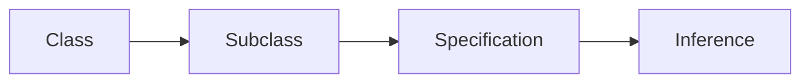

# Chapter 14 -- Semantic Requirements – From Existential Restrictions to Universal Rules (part 5)

Table of Contents:
- [14.12 EKA Learning Progression Across Chapters](#1412-eka-learning-progression-across-chapters)
  - [14.12.1 A Milestone Worth Recognition](#14121-a-milestone-worth-recognition)
  - [14.12.2 Before Your Move Forward: A Quick Self-Assessment](#14122-before-your-move-forward-a-quick-self-assessment)
  - [14.12.3 From Ontology Learning to Executable Knowledge Architecture](#14123-from-ontology-learning-to-executable-knowledge-architecture)
  - [14.12.4 EKA Tuple Mapping Across Chapters](#14124-eka-tuple-mapping-across-chapters)
- [14.13 Common Mistakes in Restriction Modeling](#1413-common-mistakes-in-restriction-modeling)
  - [14.13.1 Confusing `some` with \`only](#14131-confusing-some-with-only)
  - [14.13.2 Assuming Closed World Behavior](#14132-assuming-closed-world-behavior)
  - [14.13.3 Forgetting the Difference Between `EquivalentTo` and `SubClassOf`](#14133-forgetting-the-difference-between-equivalentto-and-subclassof)
  - [14.13.4 Misunderstanding Governance vs Validation -- OWL vs SHACL](#14134-misunderstanding-governance-vs-validation----owl-vs-shacl)
  - [=== Interesting Reading: A First Look at SHACL ===](#-interesting-reading-a-first-look-at-shacl-)
  - [14.13.5 Overusing Restrictions](#14135-overusing-restrictions)
  - [14.13.6 Enterprise Architecture Perspective -- Why These Mistakes Matter](#14136-enterprise-architecture-perspective----why-these-mistakes-matter)
- [14.14 Chapter Summary](#1414-chapter-summary)
  - [14.14.1 What We Learned](#14141-what-we-learned)
  - [14.14.2 Why Restrictions Matter](#14142-why-restrictions-matter)
  - [14.14.3 The Semantic Shift](#14143-the-semantic-shift)
- [14.15 Key Concepts](#1415-key-concepts)
- [14.16 Protégé Skills Checklist](#1416-protégé-skills-checklist)
- [14.17 Looking Ahead -- Creating Subclasses](#1417-looking-ahead----creating-subclasses)
  - [14.17.1 Why Subclasses Matter](#14171-why-subclasses-matter)
  - [14.17.2 Restriction and Hierarchy Together](#14172-restriction-and-hierarchy-together)
  - [14.17.3 Preview of Exercise 14](#14173-preview-of-exercise-14)
- [14.18 References](#1418-references)

## 14.12 EKA Learning Progression Across Chapters

### 14.12.1 A Milestone Worth Recognition

Before continuing to the final sections of this chapter, it is worth recognizing something important:

> **Chapter 14 is intentionally longer than previous chapters.**

By now, you have likely noticed that this chapter introduced:

- significantly more logical notation,
- more conceptual explanation,
- deeper semantic discussion, and
- more detailed reasoning examples.

This was deliberate.

Because Chapter (14) represents one of the most important conceptual transitions in ontology engineering.

Earlier chapters primarily focused on:

- concepts,
- classes,
- relationships,
- hierarchy,
- individuals, and
- semantic structure.

These ideas are foundational.

However, property restrictions introduce something fundamentally different:

> **formal semantic logic.**

For the first time, ontology modeling moves beyond:

> describing what exists.

Instead, you are beginning to model:

- what must exist,
- what is allowed to exist,
- what can be inferred, and
- what logical conditions govern semantic meaning.

This is also where ontology starts becoming:

> executable!

In many ways, Chapter (14) marks the transition from:

> "Learning Protégé"

toward:

> **thinking like an ontology engineer.**

Concepts such as:

- existential restriction (`some`),
- universal restriction (`only`),
- open world assumption,
- semantic constraints, and
- reasoning behavior

form part of the intellectual foundation for nearly all advanced ontology modeling.

Without a strong understanding of these concepts, later topics often become:

- difficult,
- confusing, or
- semantically disconnected.

When I learned `Pizza.owl` tutorial the first time, I still remember how hard to me to graph the real theory behind those property restrictions.

Because follow the tutorial to play around in Protégé is one thing, but understanding the inter-relationships among those restrictions are the another layer of knowledge.

This is one of the reasons why Chapter (14) now intentionally contains:

- more explanation,
- more examples, and
- deeper reflection (especially I found from mathematic aspects).

The additional depth is not accidental.

It is 

> **architecturally important.**

Equally important: if you have reached this point in the book, you have already completed a substantial semantic journey.

You have learned how to:

- model classes,
- design hierarchies,
- define relationships,
- create individuals,
- distinguish types of property,
- apply reasoning,
- govern semantic meaning, and now:
- **express formal logic through restrictions**.

This is already significantly beyond what many introductory ontology learners experience.

So before moving forward, this may actually be a good moment to:

- take a short break,
- revisit earlier chapters,
- experiment again inside Protégé,
- reflect on what has been learned, or even simply
- **celebrate how far you have already come!**

Ontology engineering is rarely mastered in a single reading.

It develops gradually through:

- experimentation,
- reflection,
- mistakes, and
- repeated semantic refinement.

By reaching Chapter (14), you are already beginning to think more like:

> **a professional semantic architect.**

With that milestone recognized, this is a good moment to step back and examine:

> how all previous chapters collectively contributed toward building on:

> **Executable Knowledge Architecture (EKA)**

### 14.12.2 Before Your Move Forward: A Quick Self-Assessment

Before continuing to the next section, take a moment to check your understanding of the core concepts introduced in this chapter.

If you can answer these four questions confidently, you have successfully internalized the most important ideas.

If not, no worry, I myself learned this chapter in tutorial for several times, so just consider revisiting the relevant sections before proceeding.

**Question 1: What is the Core Difference between `some` (Existential Restriction) and `only` (Universal Restriction)?**

Can you explain it in your own words, not just by reading the syntax?

Focus on what each restriction asks, what kind of evidence each searches for, and how each behaves when no relationship exists.

*Related section: 14.4, 14.8.3*

**Question 2: Why is `only` Automatically Satisfied (Vacuously True) When No Relationship Exists?**

This is one of the most counter-intuitive aspect of OWL reasoning for beginners.

Can you explain the logical principle of vacuous truth using a simple everyday example, and then connect it back to the `Pizza.owl` scenario?

*Related sections: 14.8.3, Interesting Reading: Vacuous Truth in Formal Logic*

**Question 3: Why does `PizzaB` Return `False` in Cypher (Closed World) but `Unknown` in OWL Reasoning (Open World)?**

`PizzaB` has no topping assertions.

- Under closed world assumption, missing information means false.
- Under open world assumption, missing information means unknown.

Can you explain why this distinction matters in enterprise environments where data arrives incrementally?

*Related sections: 14.7.4, 14.10.4 Part 1, Part 4*

**Question 4: What is the Difference between `EquivalentTo` and `SubClassOf` in terms of Reasoning Behavior?**

One defines a one-way inheritance rule.

The other defines a two-way logical equivalence.

Can you explain why using `SubClassOf` instead of `EquivalentTo` would prevent the reasoner from automatically classifying `PizzaA` as a `CheesePizza`?

*Related sections: 14.7.2, Interesting Read: Necessary vs. Sufficient Conditions*

=== How to use this checklist: ===

- If you can answer all four questions clearly and confidently, you are ready to continue to 14.12.3.
- If any question feels unclear, take a short break, revisit the indicated related sections, and experiment again in Protégé or Neo4j.
- If you find a mistake in your understanding while reviewing, this is not a failure. It is a learning opportunity! Ontology engineering is refined through iteration.

### 14.12.3 From Ontology Learning to Executable Knowledge Architecture

Let's move, at first glance, the previous chapters of this book may appear to teach:

> isolated Protégé features,

One chapter introduced:

> class hierarchies.

Another focused on:

> inverse properties,

> domain and range,

or:

> property characteristics.

Yet, from the perspective of:

> **Executable Knowledge Architecture (EKA)**,

an important pattern begins to emerge.

The book has never been merely teaching:

> ontology syntax.

Instead, each chapter has progressively contributed toward constructing:

> **an executable semantic system.**

Recall the formal EKA definition introduced in Chapter (00):

$\large{EKA = (K, R, \Theta, \Phi, \Gamma)}$

Where:

- $K$ = Knowledge Graph Layer
- $R$ = Reasoning & Rules Layer
- $\Theta$ = Trigger Layer
- $\Phi$ = Execution Layer
- $\Gamma$ = Governance Layer

Together, these components describe how semantic knowledge evolves from:

> connected information

toward:

> **executable intelligence.**

Seen through this perspective:

the `Pizza` ontology journey can be understood not simply as:

> learning ontology modeling,

but rather:

> progressively constructing the foundations of executable semantics.

### 14.12.4 EKA Tuple Mapping Across Chapters

The following table trying to summarize how each chapter contributed to the different layers of:

> **Executable Knowledge Architecture (EKA)**

The contribution levels are interpreted as:

- $\bullet\bullet\bullet$: Strong contribution
- $\bullet\bullet$: Moderate contribution
- $\bullet$: Light contribution
- $-$: Minimal or not yet introduced

| Chapter | Main Focus | $K$ Knowledge Graph | $R$ Reasoning & Rules | $\Theta$ Trigger | $\Phi$ Execution | $\Gamma$ Governance |
| --- | --- | --- | --- | --- | --- | --- |
| Ch00 | EKA Foundation | $\bullet\bullet$ | $\bullet\bullet$ | $\bullet\bullet$ | $\bullet\bullet$ | $\bullet\bullet$ |
| Ch01 | Entering Ontology Engineering | $\bullet$ | $-$ | $-$ | $-$ | $-$ |
| Ch02 | First Ontology in Protégé | $\bullet\bullet$ | $\bullet$ | $-$ | $-$ | $-$ |
| Ch03 | Protégé Workspace | $\bullet$ | $-$ | $-$ | $-$ | $-$ |
| Ch04 | Classes & Ontology Skeleton | $\bullet\bullet\bullet$ | $\bullet$ | $-$ | $-$ | $\bullet$ |
| Ch05 | Named Classes | $\bullet\bullet\bullet$ | $\bullet$ | $-$ | $-$ | $\bullet$ |
| Ch06 | Applying a Reasoner | $\bullet\bullet$ | $\bullet\bullet\bullet$ | $-$ | $-$ | $\bullet$ |
| Ch07 | Disjoint Classes | $\bullet\bullet$ | $\bullet\bullet$ | $-$ | $-$ | $\bullet\bullet\bullet$ |
| Ch08 | RDF File Structure | $\bullet\bullet\bullet$ | $\bullet$ | $-$ | $-$ | $\bullet$ |
| Ch09 | Class Hierarchy | $\bullet\bullet\bullet$ | $\bullet\bullet$ | $-$ | $-$ | $\bullet$ |
| Ch10 | Object Properties | $\bullet\bullet\bullet$ | $\bullet\bullet$ | $-$ | $-$ | $\bullet$ |
| Ch11 | Inverse Properties | $\bullet\bullet\bullet$ | $\bullet\bullet\bullet$ | $-$ | $-$ | $\bullet\bullet$ |
| Ch12 | Object Property Characteristics | $\bullet\bullet\bullet$ | $\bullet\bullet\bullet$ | $-$ | $-$ | $\bullet\bullet\bullet$ |
| Ch13 | Domain & Range | $\bullet\bullet\bullet$ | $\bullet\bullet\bullet$ | $-$ | $-$ | $\bullet\bullet\bullet$ |
| Ch14 | Property Restrictions | $\bullet\bullet\bullet$ | $\bullet\bullet\bullet$ | $\bullet$ | $\bullet$ | $\bullet\bullet\bullet$ |

At this stage of the learning journey, you may already begin noticing an important reality:

> ontology engineering is becoming increasingly different from simply modeling data.

Earlier chapters primarily focused on:

- concepts,
- classes,
- hierarchies,
- relationships, and
- semantic structures.

The intellectual challenge was largely centered on:

> *how knowledge is represented.*

Chapter (14) introduced something considerably deeper.

The challenge is no longer merely:

> representing knowledge.

Instead, you are increasingly required to think about:

- semantic requirements,
- logical boundaries,
- reasoning behavior,
- incomplete information, and
- machine-interpretable meaning.

In other words, ontology is beginning to shift from:

> **structural modeling**

toward:

> **semantic logic engineering.**

This transition is both **powerful** and at times **intellectually demanding.**

Because formal semantic logic does not always behave according to:

> everyday intuition.

What appears obvious to humans may not be logically inferable to a reasoner.

Likewise, what seems semantically restrictive may still remain logically valid under:

> the Open World Assumption (OWA).

This is especially true when working with:

- existential restrictions (`some`),
- universal restrictions (`only`),
- necessary and sufficient conditions, and
- automated reasoning behavior.

As ontology models become increasingly expressive:

small misunderstanding may produce disproportionately large consequences.

A seemingly minor modeling choice may result in:

- unexpected inferences,
- missing classifications,
- semantic inconsistency, or
- unintended meaning propagation throughout a knowledge graph.

For enterprise semantic systems, such misunderstandings may eventually influence:

- governance quality,
- reasoning reliability,
- automation behavior, and ultimately
- trust in semantic intelligence.

For this reason, before concluding Chapter (14), it is valuable to step briefly away from:

> what restrictions are,

and instead examine:

> where ontology engineers most commonly make mistakes.

Understanding these modeling pitfalls is not simply about avoiding errors.

It is about strengthening:

- semantic precision,
- reasoning confidence, and
- professional ontology engineering practice.

With this perspective established:

*we can now examine several of the most common misunderstandings encountered when working with:*

> **OWL Property Restrictions.**

## 14.13 Common Mistakes in Restriction Modeling

By this point in Chapter (14), you have explored one of the most powerful capabilities in OWL ontology engineering:

> **Property Restrictions.**

You have learned:

- existential restriction (`some`),
- universal restriction (`only`),
- reasoning behavior,
- open world assumption (OWA), and
- semantic governance.

At first glance, restrictions may appear relatively straightforward.

After all, the syntax seems simple.

Expressions such as:

`hasTopping some CheeseTopping` or `hasTopping only VegetableTopping`

are visually concise and relatively easy to enter inside Protégé.

However, semantic simplicity in notation does not necessarily mean:

> conceptual simplicity.

In practice, property restrictions represent one of the area where ontology learners most frequently encounter:

- misunderstanding,
- unexpected reasoning results, and
- semantic modeling mistakes.

Interestingly, many ontology problems do not originate from:

> syntax errors.

Instead, they arise from:

> misunderstanding semantic meaning.

The ontology technically works.

The reasoners runs successfully.

No visible errors appear

Yet, the resulting semantic behavior becomes:

- incomplete,
- misleading, or sometimes,
- logically unintended.

This is particularly important because ontology engineering increasingly influences:

- enterprise knowledge systems,
- graph intelligence,
- governance frameworks, and
- executable reasoning.

A small misunderstanding in restriction modeling may eventually affect:

- classification quality,
- semantic trust,
- automation behavior, or
- reasoning accuracy.

For this reason, before concluding Chapter (14), it is valuable to review several of the most common mistakes learners encounter when working with:

> OWL property restrictions.

Understanding these pitfalls early will significantly strengthen:

- ontology engineering practice,
- semantic precision, and
- professional reasoning confidence.

### 14.13.1 Confusing `some` with `only

Perhaps the single most common mistake in ontology learning is confusing:

> **existential restriction (`some`)**

with:

> **universal restriction (`only`)**.

At first glance: the two may appear similar.

- Both involve **object properties.**
- Both reference **classes**.
- Both influence **reasoning behavior**, and
- Both appear inside **restriction expressions**.

Yet semantically: they express fundamentally different logical ideas.

Recall the existential restriction: `hasTopping some CheeseTopping`

Semantically, this means:

> **at least one `CheeseTopping` must exist.**

This creates:

> a requirement (to the ontology).

It answers the logical question:

> *Must something exist?*

By contrast:

the universal restriction: `hasTopping only VegetableTopping`

means:

> **if topping exist, all of them must belong to `VegetableTopping`.**

This creates:

> a boundary.

It answers the question:

> *What is allowed to exist?*

This distinction is critically important.

Many beginners incorrectly interpret: `hasTopping only VegetableTopping` as meaning:

> the pizza must contain vegetables.

However, this interpretation is logically incorrect.

A pizza with **no toppings at all** still satisfies the restriction.

Why?

Because OWL evaluates the statement logically as:

> *if toppings exist, they must all be vegetables.*

While, if NO toppings exist, **there is no violation.**

This behavior often surprises learners because:

> human intuition

and:

> formal semantic logic

do not always behave identically.

Humans tend to think:

> "No vegetables means not vegetarian."

The reasoner thinks differently:

> "No evidence violates the restriction (boundary)."

A useful memory aid is:

- `some` = requirement
- `only` = limitation

Or more intuitively:

- `some` asks: "What must exist?"
- `only` asks: "What is allowed to exist?"

Understanding this distinction is one of the most important milestones in mastering:

> OWL restriction semantics.

### 14.13.2 Assuming Closed World Behavior

Another major misunderstanding occurs when learners unconsciously expect ontology to behave like:

> a traditional database.

This expectation is understandable.

Most software systems, relational databases, and business applications implicitly operate under what is called:

> **Closed World Assumption (CWA)**.

Under CWA, missing information is typically interpreted as:

> false.

For example, if a customer database contains no email address, the system may assume:

> the customer does not have one.

OWL ontology behave differently.

As discussed earlier in this chapter, OWL follows the:

> **Open World Assumption (OWA)**.

Under OWA, missing information means:

> **unknown.**

Not:

> false.

This difference becomes especially important when working with:

> restrictions.

Consider the following definition:

`CheesePizza EquivalentTo` 
`Pizza and` 
`(hasTopping some CheeseTopping)`

Now imaging `PizzaB` exists.

But no topping information has been added.

Then many learners instinctively conclude:

> `PizzaB` is not `CheesePizza`.

The reasoner does not make this conclusion.

Instead, the reasoner says:

> **I do not know yet.**

No evidence currently proves:

`hasTopping some CheeseTopping`

But equally, no evidence disproves it.

This distinction is subtle, yet extremely important!

OWL reasoners think:

> logically.

Not:

> intuitively.

A useful principle to remember is:

`No evidence` $\neq$ `Evidence of absence`

This idea becomes increasingly important in:

> enterprise semantic systems.

Because enterprise knowledge is often:

- incomplete,
- delayed, or
- continuously evolving.

Ontology engineering therefore learns to tolerate:

> uncertainty.

Rather than prematurely forcing conclusions.

### 14.13.3 Forgetting the Difference Between `EquivalentTo` and `SubClassOf`

Another very common mistake appears when learners misunderstand the difference between:

> `EquivalentTo`

and:

> `SubClassOf`.

This distinction becomes especially important when expecting:

> automatic reasoning.

Earlier examples in this chapter used definitions such as:

`CheesePizza EquivalentTo` 
`Pizza and` 
`(hasTopping some CheeseTopping)`

Why use `EquivalentTo` instead of `SubClassOf`?

Because `EquivalentTo` establishes:

> **necessary and sufficient conditions.**

Reasoning therefore works **in both directions.**

This means:

If something is `CheesePizza`, then `hasTopping some CheeseTopping` MUST hold true.

But equally important:

If a `Pizza` satisfies `hasTopping some CheeseTopping`, the reasoner may infer `CheesePizza`.

This enables:

> automatic classification.

By contrast:

`CheesePizza SubClassOf` 
`(hasTopping some CheeseTopping)`

only establishes **a one-way semantic rule.**

It means:

> every `CheesePizza` must satisfy the condition.

However, the reasoner will **not automatically infer** `CheesePizza` simply because cheese toppings exist.

This misunderstanding causes many learners to think:

> "The ontology is not working!"

In reality, the ontology behaves exactly as designed.

The issue lies in:

> semantic expectation.

A useful mental shortcut could be:

- `EquivalentTo` $=$ `necessary + sufficient`
- `SubClassOf` $=$ `necessary only`

Whenever automatic classification matters, carefully consider:

> whether bi-directional reasoning is required.

Because this modeling decision strongly influences:

> reasoning outcomes.

### 14.13.4 Misunderstanding Governance vs Validation -- OWL vs SHACL

One of the most important distinctions for enterprise architects is **understanding the difference between:**

> **semantic governance**

and:

> **data validation.**

Many learners mistakenly assume restrictions behave like:

> validation rules.

This is only partially true.

OWL restrictions do not behave exactly like:

> database constraints.

Nor are they identical to:

> validation frameworks such as SHACL.

For example: consider `hasTopping only VegetableTopping`, OWL interprets this semantically.

The reasoner evaluates **logical meaning**.

It may:
- infer knowledge,
- identify inconsistency, or
- preserve semantic coherence.

However, OWL does NOT necessarily reject incomplete information.

This reflects:

> Open World Assumption.

By contrast, validation frameworks such as **SHACL** operate differently.

SHACL explicitly asks:

> *Does the data violate defined constraints?*

This resembles:

> governance enforcement.

Rather than:

> semantic reasoning.

A simplified distinction is:

- `OWL` $=$ `meaning and inference`
- `SHACL` $=$ `validation and enforcement`

Within:

> **$\Gamma$ - Governance layer**

of EKA: both are valuable.

OWL restrictions help govern:

> semantic meaning.

SHACL helps validate:

> operational correctness.

Together, they strengthen:

- trustworthiness,
- semantic integrity, and
- governed enterprise knowledge.

This distinction becomes increasingly important when ontology evolves toward:

> production-grade semantic systems.

### === Interesting Reading: A First Look at SHACL ===

At this point, curious readers may wonder:

> If OWL focuses on semantic reasoning, is there a formal language specifically designed for validating graph data?

The answer is **Yes - SHACL**.

SHACL stands for:

> **SHApes Constraint Language**

and is a W3C recommendation designed for validating RDF graphs against explicitly defined structural constraints.

Conceptually: SHACL introduces the idea of a **shape**.

A shape describes:

> what a valid node in a graph should look like.

For example, a SHACL shape may specify rules such as:

- every `Pizza` must have at least one topping,
- every topping must belong to `PizzaTopping`, or
- a `VegetarianPizza` cannot contain `MeatTopping`.

Unlike OWL, which primarily asks:

> *What semantic meaning can be inferred?*

SHACL asks a different question:

> *Does this graph instance satisfy required constraints?*

This difference is subtle but important!

- OWL is fundamentally **inferential and descriptive.**
- SHACL is fundamentally **constraint-oriented and validation-driven.**

From a mathematical perspective, SHACL can be viewed as form of:

> predicate-based constraint evaluation over graph structures.

Given a graph: $G=(V,E)$, where
- $V=$ `vertices (nodes)`
- $E=$ `edges (relationships)`

a SHACL shape can be interpreted as a constraint function:

$S(v) \rightarrow \{true, false\}$

where a node: $v \in V$ either **satisfies the constraint** or **violates it**.

In simplified mathematical terms:

> SHACL behaves somewhat like a set of logical predicates evaluated over graph topology.

This makes SHACL especially useful in enterprise environments where semantic governance requires not only:

> reasoning,

but also:

> strict data quality validation.

Michael's original `Pizza` tutorial formally introduces SHACL later in his Chapter 11 of the PDF.

In this book, we will revisit SHACL in much greater practical detail, including additional examples beyond the original tutorial to show how SHACL can complement OWL inside modern semantic architectures.

For now, the key takeaway is simple:
- `OWL helps machines infer meaning.`
- `SHACL helps engineers validate quality.`

Both play important roles in building trustworthy semantic systems.

There is no need to master SHACL yet.

For now, simply remember:

> **semantic intelligence requires both reasoning and validation.**

=== END Interesting Reading ===

### 14.13.5 Overusing Restrictions

After learners discover the expressive power of restrictions, another common mistake often appears:

> **over-modeling.**

Restrictions are powerful.

They allow ontology engineers to express:

- requirements,
- boundaries,
- logical expectations, and
- inferential conditions.

Because of this, beginners sometimes attempt to model **everything.**

Every class becomes filled with **nested restrictions**, **multiple logical conditions** and **excessive semantic detail**.

This may initially appear:

> sophisticated.

However, in practice, it often produces:

> unnecessary complexity.

Large numbers of restrictions may eventually cause:

- reasoning slowdown,
- maintenance difficulty,
- conceptual confusion, or
- semantic rigidity.

A useful engineering principle is:

> **model only semantics that create VALUE**.

Before introducing a restriction, ask:

> Does this improve reasoning?

> Does it strengthen governance?

> Does it clarify business meaning?

> Does it improve semantic precision?

> Does it contribute to executable intelligence?

If the answer is unclear, then the restriction may NOT be necessary.

In enterprise architecture, this problem resembles:

> technical debt.

Poorly designed semantic logic creates:

> **semantic debt**.

Meaning, the ontology becomes:

- difficult to explain,
- difficult to maintain, or
- difficult to trust.

Professional ontology engineering values:

> semantic clarity

over:

> semantic complexity.

A good ontology is not necessarily:

> the most expressive.

It is often:

> the most understandable.

### 14.13.6 Enterprise Architecture Perspective -- Why These Mistakes Matter

At this point, a reasonable question may emerge:

> *Do these mistakes really matter?*

In small learning exercises: perhaps NOT.

In a `Pizza` ontology, the consequences remain limited.

However:

inside real enterprise semantic systems, these misunderstandings can become:

> expensive!

Consider a semantic knowledge graph used for:

- financial risk,
- cybersecurity,
- healthcare governance, or
- enterprise architecture.

A misunderstanding of `some` vs. `only` may produce:

> incorrect classification.

A misunderstanding of `EquivalentTo` may cause:

> missing inference.

Incorrect expectations about "**Open World Assumption**" may lead to:

> flawed analytics.

Weak governance design may create:

> semantic inconsistency.

Over time, trust in semantic systems may decline.

This is one of the reasons why **ontology engineering** requires careful thinking.

Ontology is merely:

> data modeling.

It increasingly becomes:

> **semantic engineering**.

Viewed through:

> **Executable Knowledge Architecture (EKA)**,

the restriction mistakes may impact multiple layers simultaneously:

- $K$ $\rightarrow$ `incorrect semantic relationships`
- $R$ $\rightarrow$ `incorrect reasoning outcomes`
- $\Theta$ $\rightarrow$ `incorrect trigger conditions`
- $\Phi$ $\rightarrow$ `unreliable execution behavior`
- $\Gamma$ $\rightarrow$ `weakened semantic governance`

This demonstrates why semantic precision matters.

Because semantic systems increasingly influence:

- automation,
- trust,
- decision, and
- executable intelligence.

By understanding these common mistakes early, learners become better prepared to design ontology that is not only **logically correct**, but also **explainable**, **governable** and **operationally trustworthy**.

## 14.14 Chapter Summary

### 14.14.1 What We Learned

Chapter (14) marked one of the most important conceptual milestones in this ebook.

In earlier chapters, ontology engineering primarily focused on:

> semantic representation.

You built knowledge structures through:

- classes,
- hierarchies,
- object properties,
- inverse properties, and
- semantic relationship constraints.

Those foundational components taught us how ontology represents:

> structured meaning.

In this chapter (14), however, ontology became significantly more expressive.

We moved beyond simple structural modeling and introduced:

> semantic requirements.

This shift occurred through the study of **Property Restrictions.**

Property restrictions allowed us to express **logical** conditions over relationships, enabling ontology to describe not only:

- *what entities are,*

but also:

- *what relationships must exist,* 
- *what relationships are allowed,* and
- *what semantic boundaries must be respected.*

This marks a major conceptual transition in OWL modeling.

Ontology is no longer merely descriptive.

It increasingly becomes:

> **logical!**

### 14.14.2 Why Restrictions Matter

Throughout this chapter (14), two major forms of restrictions were introduced.

First:

> **Existential Restriction (`some`)**

This restriction answers the question:

> *Must at least one relationship exist?*

For example: `hasTopping some CheeseTopping`

This expresses a semantic requirement that at least one cheese topping must exist.

Second:

> **Universal Restriction (`only`)**

This restriction answers:

> *If relationships exist, what are they allowed to connect to?*

For example: `hasTopping only VegetableTopping`

This creates a semantic boundary.

Together, these two restrictions form one of the most powerful modeling tool in OWL.

They enable ontology engineers to define concepts with far greater precision than traditional data models typically allow.

Restrictions therefore contribute to:

- stronger reasoning,
- improved governance,
- semantic consistency, and
- higher-quality knowledge graphs.

### 14.14.3 The Semantic Shift

Perhaps the most important lesson of Chapter (14) is philosophical rather than technical.

This chapter revealed a major distinction between:

> storing data

and:

> encoding meaning.

Traditional graph databases may store relationships such as:

`Pizza` $\rightarrow$ `hasTopping` $\rightarrow$ `CheeseTopping`

This records:

> a fact.

However, OWL restrictions express something deeper:

`Pizza and (hasTopping some CheeseTopping)`

This describes:

> semantic logic.

That distinction is fundamental.

A graph database primarily stores:

> relationships.

An ontology describes:

> logical meaning.

When reasoning is applied, ontology begins enabling:

> machine-interpretable intelligence.

This is why Chapter (14) represents an important turning point toward:

> Executable Knowledge Architecture (EKA).

Restrictions begin transforming semantic knowledge into:

> actionable semantic logic!

## 14.15 Key Concepts

Before moving forward, ensure you are comfortable with the following key concepts introduced in this chapter (14).

| Concepts | Description |
| --- | --- |
| Property Restriction | Logical constraint applied to property relationships |
| Existential Restriction (`some`) | Requires at least one qualifying relationship |
| Universal Restriction (`only`) | Restricts all related values to a specified class |
| Open World Assumption | Missing knowledge is treated as unknown, not false |
| `EquivalentTo` | Defines necessary and sufficient conditions |
| `SubClassOf` | Defines necessary conditions only |
| Semantic Governance | Constraints that preserve semantic integrity |
| SHACL | Constraint language for graph validation |

These concepts will continue to reappear throughout later chapters.

## 14.16 Protégé Skills Checklist

By completing Chapter (14), you should now be able to confidently perform the following tasks in **Protégé**:

- Create existential restrictions using `some`
- Create universal restrictions using `only`
- Understand restriction syntax in OWL
- Distinguish between `EquivalentTo` and `SubClassOf`
- Predict reasoning outcomes under `Open World Assumption`
- Interpret reasoner classifications involving restrictions
- Understand the conceptual distinction between OWL and SHACL
- Explain the governance role of semantic restrictions

If several items still feel unclear, revisiting the practical exercises before moving on is strongly recommended.

## 14.17 Looking Ahead -- Creating Subclasses

### 14.17.1 Why Subclasses Matter

In the next Chapter (15), we will return to a concept that may initially appear simpler than restrictions:

> subclasses.

However, subclass modeling is far more important than it may first appear.

Subclasses provide the hierarchical backbone of ontology.

They allow knowledge engineers to organize concepts into:

> semantic taxonomies.

Without hierarchy, ontology quickly becomes:

- flat,
- difficult to reason over, and
- semantically weak.

### 14.17.2 Restriction and Hierarchy Together

An important insight for you moving into Chapter (15) is this:

> restrictions and hierarchies are not separate modeling techniques.

They work together!

- Class hierarchy provides **structural organization**.
- Restrictions provide **logical refinement**.

Together, they enable ontology to express both:

> semantic structure

and:

> semantic intelligence.

This combination is central to advanced ontology engineering.

### 14.17.3 Preview of Exercise 14

In the next chapter (15), based on the continuation of the `Pizza` ontology tutorial, we will explore how subclass creation strengthens:

> semantic specification.

You will see how increasingly specific concepts can inherit meaning from broader parent classes while simultaneously supporting more precise reasoning.

This continues the natural progression of ontology engineering:

As the ontology grows richer, semantic knowledge becomes increasingly structured, governed, and inferable.

This prepares us for the next major step in the journey toward:

> executable semantic intelligence.

## 14.18 References

1. DeBellis, Michael. *Protégé 5 New OWL Pizza Tutorial (Version 3.2)*. Foundational tutorial reference and exercise source for the Pizza ontology walkthrough expanded throughout this ebook..
2. World Wide Web Consortium (W3C). *OWL 2 Web Ontology Language Document Overview*. Official specification of the OWL ontology language.
3. World Wide Web Consortium (W3C). *SHACL (Shapes Constraint Language)*. 
Official recommendation for RDF graph validation and constraint modeling.
4. Zhao, Xiaoqi. *Executable Knowledge Architecture (EKA)*. A semantic architecture framework for transforming ontology and knowledge graphs into executable intelligence.
5. Semantic Data Charter (SDC). *Principles for Semantic Governance and Trustworthy Data Ecosystems*.
6. Cook, Timothy. *Foreword to Semantic Data Charter*. Perspectives on semantic governance, semantic trust, and responsible data stewardship.

---

Last Updated at: 2026-06-27