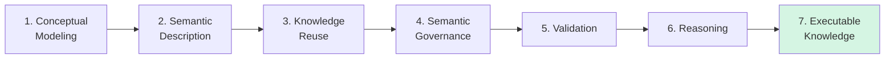

# Chapter 15 -- Semantic Knowledge Development Lifecycle (SKDL)

**From Semantic Modeling to Executable Knowledge**

- [15.1 Congratulations -- You Have learned the Language of OWL](#151-congratulations----you-have-learned-the-language-of-owl)
- [15.2 From Learning OWL to Practicing Ontology Engineering](#152-from-learning-owl-to-practicing-ontology-engineering)
- [15.3 What Is the Semantic Knowledge Development Lifecycle (SKDL)?](#153-what-is-the-semantic-knowledge-development-lifecycle-skdl)
- [15.4 The Semantic Knowledge Development Lifecycle (SKDL)](#154-the-semantic-knowledge-development-lifecycle-skdl)
- [15.5 Understanding Each Lifecycle Stage](#155-understanding-each-lifecycle-stage)

## 15.1 Congratulations -- You Have learned the Language of OWL

By completing Chapter (14) - I know it's a long chapter - you have reached an important milestone in your ontology engineering journey.

So far, this book has introduced the fundamental building blocks of **OWL**, including:

- ontology classes
- object properties
- inverse properties
- property characteristics
- domain and range
- existential restrictions (`some`)
- universal restrictions (`only`)
- logical reasoning
- semantic governance
- the Open World Assumption

These concepts form the logical language used to describe knowledge in an ontology.

At this point, you already understand **how OWL expresses semantic knowledge.**

The focus now changes.

Instead of learning individual OWL constructs one by one, the remaining chapters will show how these constructs work together to build complete semantic systems.

In other words, you are moving from

> learning a language

toward:

> learning an engineering discipline.

Congratulations on reaching this milestone!

Before continuing, consider taking a short break, grab a cup of coffee or tea.

Reflect on how far you have progressed -- from creating your first ontology in Protégé to understanding semantic restrictions and automated reasoning.

The chapters that follow will build upon everything you have learned so far.

## 15.2 From Learning OWL to Practicing Ontology Engineering

Learning OWL syntax is similar to learning the vocabulary and grammar of a spoken language.

Knowing individual words does not automatically enable someone to write a novel.

Likewise, understanding individual OWL constructs DOES NOT immediately translate into designing scalable enterprise ontologies.

Ontology engineering is a systematic process.

Each modeling decision influences future **reasoning**, **validation**, **governance**, and **knowledge reuse**.

Professional ontology engineers therefore think beyond individual classes or properties.

They consider questions such as:

- *How should domain concepts be organized?*
- *Which concepts should become reusable semantic patterns?*
- *How can semantic consistency be maintained as the ontology grows?*
- *Which axioms enable automatic reasoning?*
- *How can ontology models evolve without becoming difficult to maintain?*

These questions shift ontology engineering from software operation to architectural design.

The remaining chapters of this book introduce a structured engineering workflow that answers these questions.

## 15.3 What Is the Semantic Knowledge Development Lifecycle (SKDL)?

Throughout the remainder of this book, we introduce the **Semantic Knowledge Development Lifecycle (SKDL)**.

The SKDL describes the progressive stages through which semantic knowledge evolves -- from an **initial conceptual model** into **executable knowledge** capable of supporting intelligent systems.

Unlike a software development lifecycle (SDLC), which primarily transforms requirements into executable code, the SKDL transforms domain knowledge into executable semantics.

This lifecycle provides a practical roadmap for ontology engineers, enterprise architects, and knowledge graph practitioners.

## 15.4 The Semantic Knowledge Development Lifecycle (SKDL)

Each stage builds upon the previous one.

1. Conceptual models provide the structure.
2. Semantic descriptions enrich those structures with meaning.
3. Reusable patterns accelerate ontology development.
4. Governance ensures consistency.
5. Validation detects logical problems.
6. Reasoning derives new knowledge automatically.

Together, these stages transform static data models into intelligent semantic systems.

## 15.5 Understanding Each Lifecycle Stage

| Stage | Purpose | Typical Activities |
| --- | --- | --- |
| **1. Conceptual Modeling** | Identify and organize domain concepts into semantic hierarchies. | Create classes, subclasses, and taxonomy structures. |
| **2. Semantic Description** | Describe concepts using logical characteristics and restrictions. | Add properties, restrictions, and semantic definitions. |
| **3. Knowledge Reuse** | Reuse existing semantic patterns to improve modeling efficiency and consistency. | Duplicate, refine, and specialize ontology structures. |
| **4. Semantic Governance** | Maintain semantic quality and prevent contradictory knowledge. | 
| **5. Validation** | Verify ontology consistency before deployment. | Detect logical conflicts using reasoners and validation tools. |
| **6. Reasoning** | Discover implicit knowledge automatically. | Execute OWL inference and semantic classification. |
| **7. Executable Knowledge** | Connect semantic knowledge with enterprise systems and intelligent automation. | Integrate with EKA, knowledge graphs, APIs, workflows, and AI applications. |

