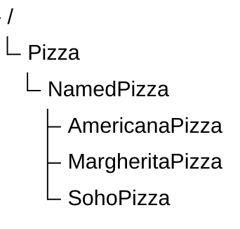

# Chapter 15 -- Creating Subclasses: Building Semantic Taxonomy in Ontology

- [15.1 Chapter Introduction -- Why Subclasses Matter](#151-chapter-introduction----why-subclasses-matter)
- [15.2 From Flat Classes to Semantic Taxonomy](#152-from-flat-classes-to-semantic-taxonomy)
- [15.3 Understanding Subclasses in OWL](#153-understanding-subclasses-in-owl)
- [15.4 Interesting Reading -- The Mathematical Meaning of Subclasses](#154-interesting-reading----the-mathematical-meaning-of-subclasses)

## 15.1 Chapter Introduction -- Why Subclasses Matter

After completing Chapter (14), you have entered a much deeper stage of ontology engineering.

The previous chapter introduced:

- semantic restrictions,
- logical requirements,
- reasoning boundaries, and
- formal inference behavior.

Ontology was no longer merely about representing knowledge structures.

It became increasingly concerned with:

> semantic logic.

In this chapter, we return to a concept that may initially appear much simpler:

> **subclasses**.

Inside Protégé, creating a subclass is mechanically straightforward.

You typically:

> 1. select a parent class,
> 2. click *Add subclass*, and
> 3. assign a class name.

However, the semantic significance of subclass modeling is far greater than its simple user interface.

Subclasses provide the foundation for:
- taxonomy,
- specialization,
- inheritance, and
- classification reasoning.

Without subclass hierarchies, ontology quickly becomes:
- flat structure,
- difficult to navigate, and
- semantically weak.

Subclass modeling therefore represents one of the most fundamental building blocks of ontology engineering.

## 15.2 From Flat Classes to Semantic Taxonomy

Consider a knowledge model where all concepts exist at the same level:

```text
Pizza
NamedPizza
VegetarianPizza
SpicyPizza
MargheritaPizza
```

Although these concepts are present, the model lacks semantic structure.

Nothing explicitly indicates:

- which concepts are more generalized
- which are more specialized
- how they relate conceptually

This is known as:

> flat classification.

Flat classification may be sufficient for small datasets, but it scales poorly when knowledge becomes complex.

Ontology addresses this problem using:

> taxonomy.

A taxonomy organizes concepts hierarchically.



This hierarchy immediately conveys semantic relationships message to the viewers.

Taxonomy therefore provides not only organization, but also:

> **semantic context.**

This context is essential for reasoning.

## 15.3 Understanding Subclasses in OWL

In ontology engineering, subclass relationships are commonly expressed using:

> **`is-a` relationships**.

For example: `MargheritaPizza is a NamedPizza`

This means:

> `MargheritaPizza` **is a type of** `NamedPizza`

Not:

> `MargheritaPizza` contains `NamedPizza`

Nor:

> `MargheritaPizza1` references `NamedPizza`

Instead, it expresses:

> semantic specialization.

In OWL, subclass relationships are represented through `SubClassOf`.

An example: `MargheritaPizza SubClassOf NamedPizza`


Semantically, this states:

> every `MargheritaPizza` is also a `NamedPizza`.

This is a strong logical assertion.

Subclass relationships therefore carry formal meaning, not merely visual hierarchy.

## 15.4 Interesting Reading -- The Mathematical Meaning of Subclasses

To fully understand subclasses, it helps to view them through mathematics.

Ontology class semantics closely align with:

> set theory.

A class can be interpreted as:

> a set of individuals sharing common characteristics.

Now suppose:

$P = \text{set of all pizzas}$

We can define:

$N = \text{set of all named pizzas}$

This means:

> every element of $N$ is also an element of $P$.

This is the formal meaning of subclass.

More generally:

$If:$

$A = \text{parent class}$<br>
$B = subclass$

$Then:$

$B \sqsubseteq A$

Equivalent logical notation is:

$\forall x \: (x \in B \rightarrow x \in A)$

This reads as:

> For every $x$, if $x$ belongs to subclass $B$, then $x$ must also belong to class $A$.

This mathematical definition explains why subclass reasoning works.

Suppose:

`myPizza` $\in$ `MargheritaPizza`

And ontology defines:

`MargheritaPizza` $\sqsubseteq$ `NamedPizza`<br>
`NamedPizza` $\sqsubseteq$ `Pizza`

Then by transitivity:

`myPizza` $\in$ `Pizza`

The reasoner performs exactly this type of logical inference automatically.

This is one of the earliest examples showing how ontology enables:

> machine reasoning through formal mathematics.

In other words, subclass hierarchy is not merely a tree.

It is formally defined semantic inclusion system.

---

Last updated at: 2026-06-28