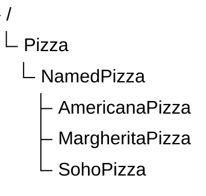

# Chapter 15 -- Creating Subclasses: Building Semantic Taxonomy in Ontology

- [15.1 Chapter Introduction -- Why Subclasses Matter](#151-chapter-introduction----why-subclasses-matter)
- [15.2 From Flat Classes to Semantic Taxonomy](#152-from-flat-classes-to-semantic-taxonomy)

## 15.1 Chapter Introduction -- Why Subclasses Matter

After completing Chapter (14), you have entered a much deeper stage of ontology engineering.

The previous chapter introduced:

- semantic restrictions,
- logical requirements,
- reasoning boundaries, and
- formal inference behavior.

Ontology was no longer merely about representing knowledge structures.

It became increasingly concerned with:

> semantic logic.

In this chapter, we return to a concept that may initially appear much simpler:

> **subclasses**.

Inside Protégé, creating a subclass is mechanically straightforward.

You typically:

> 1. select a parent class,
> 2. click *Add subclass*, and
> 3. assign a class name.

However, the semantic significance of subclass modeling is far greater than its simple user interface.

Subclasses provide the foundation for:
- taxonomy,
- specialization,
- inheritance, and
- classification reasoning.

Without subclass hierarchies, ontology quickly becomes:
- flat structure,
- difficult to navigate, and
- semantically weak.

Subclass modeling therefore represents one of the most fundamental building blocks of ontology engineering.

## 15.2 From Flat Classes to Semantic Taxonomy

Consider a knowledge model where all concepts exist at the same level:

```text
Pizza
NamedPizza
VegetarianPizza
SpicyPizza
MargheritaPizza
```

Although these concepts are present, the model lacks semantic structure.

Nothing explicitly indicates:

- which concepts are more generalized
- which are more specialized
- how they relate conceptually

This is known as:

> flat classification.

Flat classification may be sufficient for small datasets, but it scales poorly when knowledge becomes complex.

Ontology addresses this problem using:

> taxonomy.

A taxonomy organizes concepts hierarchically.



This hierarchy immediately conveys semantic relationships message to the viewers.

Taxonomy therefore provides not only organization, but also:

> **semantic context.**

This context is essential for reasoning.

---

Last updated at: 2026-06-28