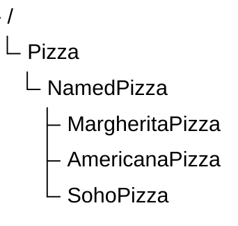

# Chapter 16 -- Expanding Named Pizza Hierarchy: Designing Scalable Taxonomies

- [16.1 Chapter Introduction -- Beyond the First Subclass](#161-chapter-introduction----beyond-the-first-subclass)
- [16.2 Why Taxonomy Growth Matters](#162-why-taxonomy-growth-matters)

## 16.1 Chapter Introduction -- Beyond the First Subclass

In Chapter (15), we introduced subclass creation as one of the foundational operations in ontology engineering.

You learned that subclass relationships enable:

- semantic specialization
- inheritance
- classification reasoning
- taxonomy construction

At this stage, the ontology contains only a small hierarchy:



This structure was intentionally simple.

Its primary purpose was to introduce the semantics for subclassing.

However, real ontologies rarely stop at a single subclass.

As knowledge grows, ontology engineers must continuous expand class hierarchies while preserving clarity and consistency.

This introduces a new challenge:

> How should taxonomy grow without becoming chaotic?

Chapter (16) focuses on this question.

Instead of studying individual subclasses in isolation, we now examine how multiple subclasses collectively shape a scalable semantic hierarchy.

## 16.2 Why Taxonomy Growth Matters

A small ontology may appear manageable even with minimal structure.

However, as domain complexity increases, flat or poorly organized taxonomies quickly become difficult to maintain.

Consider a `Pizza` ontology containing many pizza types without hierarchy, as below:

```
Pizza
AmericanaPizza
MargheritaPizza
SohoPizza
VegetarianPizza
SpicyPizza
SeafoodPizza
```

This model stores concepts, but semantic organization remains weak.

Questions quickly arise:

- Which pizzas are named menu items?
- Which are classification categories?
- Which belong to dietary categories?
- Which are flavor-based groupings?

Without hierarchy, such distinctions become unclear.

Taxonomy growth therefore serves an important purpose:

> semantic organization at scale.

A well-designed hierarchy enables 

---

Last updated as: 2026-07-01