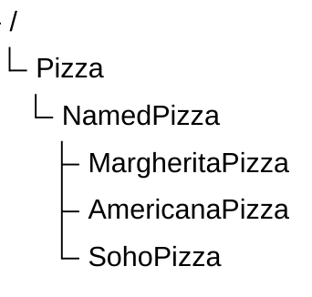
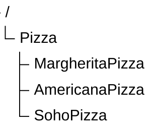

# Chapter 16 -- Expanding Named Pizza Hierarchy: Designing Scalable Taxonomies

- [16.1 Chapter Introduction -- Beyond the First Subclass](#161-chapter-introduction----beyond-the-first-subclass)
- [16.2 Why Taxonomy Growth Matters](#162-why-taxonomy-growth-matters)
- [16.3 Exercise 15 -- Expanding `NamedPizza` Hierarchy](#163-exercise-15----expanding-namedpizza-hierarchy)
- [16.4 Intermediate Abstraction Layers](#164-intermediate-abstraction-layers)
- [16.5 Interesting Reading -- Taxonomy Depth vs Breadth](#165-interesting-reading----taxonomy-depth-vs-breadth)

## 16.1 Chapter Introduction -- Beyond the First Subclass

In Chapter (15), we introduced subclass creation as one of the foundational operations in ontology engineering.

You learned that subclass relationships enable:

- semantic specialization
- inheritance
- classification reasoning
- taxonomy construction

At this stage, the ontology contains only a small hierarchy:



This structure was intentionally simple.

Its primary purpose was to introduce the semantics for subclassing.

However, real ontologies rarely stop at a single subclass.

As knowledge grows, ontology engineers must continuous expand class hierarchies while preserving clarity and consistency.

This introduces a new challenge:

> How should taxonomy grow without becoming chaotic?

Chapter (16) focuses on this question.

Instead of studying individual subclasses in isolation, we now examine how multiple subclasses collectively shape a scalable semantic hierarchy.

## 16.2 Why Taxonomy Growth Matters

A small ontology may appear manageable even with minimal structure.

However, as domain complexity increases, flat or poorly organized taxonomies quickly become difficult to maintain.

Consider a `Pizza` ontology containing many pizza types without hierarchy, as below:

```
Pizza
AmericanaPizza
MargheritaPizza
SohoPizza
VegetarianPizza
SpicyPizza
SeafoodPizza
```

This model stores concepts, but semantic organization remains weak.

Questions quickly arise:

- Which pizzas are named menu items?
- Which are classification categories?
- Which belong to dietary categories?
- Which are flavor-based groupings?

Without hierarchy, such distinctions become unclear.

Taxonomy growth therefore serves an important purpose:

> semantic organization at scale.

A well-designed hierarchy enables ontology engineers to group related concepts under meaningful abstraction layers.

This improves:

- readability
- maintainability
- governance
- reasoning efficiency

As ontologies grow, taxonomy design becomes increasingly architectural rather than merely editorial.

## 16.3 Exercise 15 -- Expanding `NamedPizza` Hierarchy

In Michael DeBellis's tutorial, the next exercise continues expanding the `NamedPizza` hierarchy by introducing additional pizza subclasses.

Instead of stopping with `MargheritaPizza`, the ontology now adds further named pizzas such as:

```
AmericanaPizza
SohoPizza
```


This may appear to be a straightforward extension.

Semantically, however, an important transition occurs.

The ontology now begins moving from:

> isolated examples

toward:

> reusable semantic structures.

`NamedPizza` becomes more than a single intermediate class.

It becomes a reusable abstraction boundary.

Every new pizza type added beneath `NamedPizza` automatically inherits:

- `Pizza` semantics
- `NamedPizza` categorization
- future logical constraints (when applying to `NamedPizza`)

This illustrates an important ontology engineering principle:

> abstraction becomes more valuable as hierarchy grows.

The more subclasses a parent class contains, the more important that parent becomes as a semantic grouping mechanism.

## 16.4 Intermediate Abstraction Layers

One hallmark of well-designed ontologies is the use of:

> intermediate abstraction layers.

Instead of placing every concept directly beneath a root class, ontology engineers introduce meaningful intermediate classes.

Consider two designs.

**Flat Design**



**Layered Design**


The layered design offers major advantages.

- First, it improves semantic clarity.
- Second, it creates reusable abstraction.
- Third, it reduces future modeling complexity.

Intermediate layers act as:

> semantic aggregation points.

They allow common semantics to be applied once and inherited many times.

This becomes essential in large enterprise ontologies containing hundreds or thousands of classes.

## 16.5 Interesting Reading -- Taxonomy Depth vs Breadth

A useful way to analyze ontology hierarchies is through two structural dimensions: `depth` and `breadth`.

- Depth measures how many hierarchical levels exist.
- Breadth measures how many sibling classes exist under the same parent.

Mathematically, a taxonomy may be 

---

Last updated as: 2026-07-04