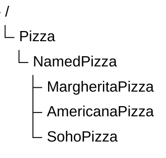

# Chapter 16 -- Expanding Named Pizza Hierarchy: Designing Scalable Taxonomies

- [16.1 Chapter Introduction -- Beyond the First Subclass](#161-chapter-introduction----beyond-the-first-subclass)

## 16.1 Chapter Introduction -- Beyond the First Subclass

In Chapter (15), we introduced subclass creation as one of the foundational operations in ontology engineering.

You learned that subclass relationships enable:

- semantic specialization
- inheritance
- classification reasoning
- taxonomy construction

At this stage, the ontology contains only a small hierarchy:

This structure was intentionally simple.

Its primary purpose was to introduce

---

Last updated as: 2026-06-29