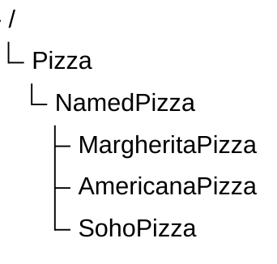
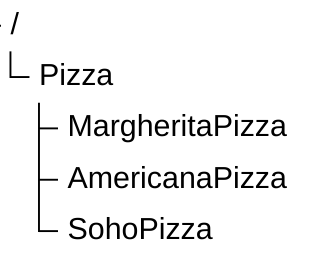
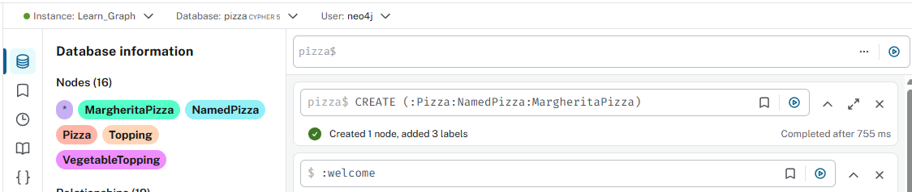
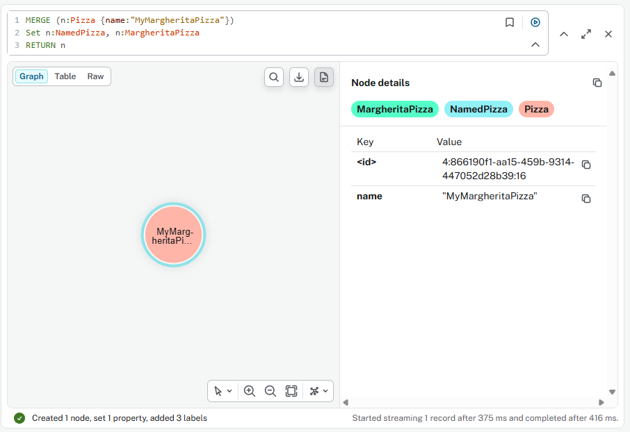

# Chapter 16 -- Expanding Named Pizza Hierarchy: Designing Scalable Taxonomies

- [16.1 Chapter Introduction -- Beyond the First Subclass](#161-chapter-introduction----beyond-the-first-subclass)
- [16.2 Why Taxonomy Growth Matters](#162-why-taxonomy-growth-matters)
- [16.3 From Exercise 14 to Exercise 18 -- The Evolution of Semantic Specialization](#163-from-exercise-14-to-exercise-18----the-evolution-of-semantic-specialization)
  - [The Three-Phase Evolution](#the-three-phase-evolution)
- [16.4 Exercise 15 in Focus -- The First Semantic Restriction](#164-exercise-15-in-focus----the-first-semantic-restriction)
  - [What Exercise 15 Actually Does](#what-exercise-15-actually-does)
  - [Why This Matters](#why-this-matters)
  - [The Broader Pattern](#the-broader-pattern)
- [16.5 Exercise 16-17 -- Scaling the Pattern Through Cloning](#165-exercise-16-17----scaling-the-pattern-through-cloning)
  - [Exercise 16: Cloning `MargheritaPizza` to Create `AmericanaPizza`](#exercise-16-cloning-margheritapizza-to-create-americanapizza)
  - [Exercise 17: Cloning Further](#exercise-17-cloning-further)
  - [The Architectural Insight](#the-architectural-insight)
- [16.6 Exercise 18 -- The Final Piece: Disjointness as Semantic Governance](#166-exercise-18----the-final-piece-disjointness-as-semantic-governance)
  - [What Exercise 18 Actually Does](#what-exercise-18-actually-does)
  - [Why This Matters](#why-this-matters-1)
  - [The Role of the Reasoner](#the-role-of-the-reasoner)
- [16.7 Summary: From Structure to Meaning to Integrity](#167-summary-from-structure-to-meaning-to-integrity)
- [16.8 Intermediate Abstraction Layers](#168-intermediate-abstraction-layers)
- [16.9 Interesting Reading -- Taxonomy Depth vs Breadth](#169-interesting-reading----taxonomy-depth-vs-breadth)
- [16.10 Controlled Vocabulary and Naming Strategy](#1610-controlled-vocabulary-and-naming-strategy)
- [16.11 Graph Database Perspective -- Labels vs Taxonomic Layers](#1611-graph-database-perspective----labels-vs-taxonomic-layers)
- [16.12 EKA Perspective -- Taxonomy as Knowledge Scaling](#1612-eka-perspective----taxonomy-as-knowledge-scaling)
- [16.13 Key Concepts](#1613-key-concepts)
- [16.14 Chapter Summary](#1614-chapter-summary)
- [16.51 Protégé Skills Checklist](#1651-protégé-skills-checklist)
- [16.16 Looking Ahead](#1616-looking-ahead)

## 16.1 Chapter Introduction -- Beyond the First Subclass

In Chapter (15), we introduced subclass creation as one of the foundational operations in ontology engineering.

You learned that subclass relationships enable:

- semantic specialization
- inheritance
- classification reasoning
- taxonomy construction

At this stage, the ontology contains only a small hierarchy:



This structure was intentionally simple.

Its primary purpose was to introduce the semantics for subclassing.

However, real ontologies rarely stop at a single subclass.

As knowledge grows, ontology engineers must continuous expand class hierarchies while preserving clarity and consistency.

This introduces a new challenge:

> How should taxonomy grow without becoming chaotic?

Chapter (16) focuses on this question.

Instead of studying individual subclasses in isolation, we now examine how multiple subclasses collectively shape a scalable semantic hierarchy.

## 16.2 Why Taxonomy Growth Matters

A small ontology may appear manageable even with minimal structure.

However, as domain complexity increases, flat or poorly organized taxonomies quickly become difficult to maintain.

Consider a `Pizza` ontology containing many pizza types without hierarchy, as below:

```
Pizza
AmericanaPizza
MargheritaPizza
SohoPizza
VegetarianPizza
SpicyPizza
SeafoodPizza
```

This model stores concepts, but semantic organization remains weak.

Questions quickly arise:

- Which pizzas are named menu items?
- Which are classification categories?
- Which belong to dietary categories?
- Which are flavor-based groupings?

Without hierarchy, such distinctions become unclear.

Taxonomy growth therefore serves an important purpose:

> semantic organization at scale.

A well-designed hierarchy enables ontology engineers to group related concepts under meaningful abstraction layers.

This improves:

- readability
- maintainability
- governance
- reasoning efficiency

As ontologies grow, taxonomy design becomes increasingly architectural rather than merely editorial.

## 16.3 From Exercise 14 to Exercise 18 -- The Evolution of Semantic Specialization

In Michael DeBellis' tutorial, Exercise 14 through 18 form a carefully designed progressive sequence that introduces you to the core of ontology engineering:

| Exercise | Action | Semantic Significance |
| --- | --- | --- |
| **Exercise 14** | Create `NamedPizza` and `MargheritaPizza` as subclasses of `Pizza` | **Establishes taxonomic structure** -- the "skeleton" of the hierarchy |
| **Exercise 15** | Add restrictions to `MargheritaPizza`: `hasTopping some MozzarellaTopping` and `hasTopping some TomatoTopping` | **Introduces semantic meaning** -- the first logical definition of what a pizza *must have* |
| **Exercise 16** | Clone `MargheritaPizza` to create `AmericanaPizza`; add `hasTopping some PepperoniTopping` | **Demonstrates reuse** -- cloning preserves existing axioms while allowing specialization |
| **Exercise 17** | Clone further to create `AmericanaHotPizza` and `MargheritaPizza` to create `SohoPizza` | **Shows scalability** -- the "clone and extend" pattern enables rapid taxonomy growth |
| **Exercise 18** | Declare all subclasses of `NamedPizza` as **disjoint** from each other | **Ensures semantic integrity** -- no pizza can belong to two different named categories simultaneously |

Rather than repeating the step-by-step instructions (which are already well documented in Michael's tutorial), this chapter focuses on the **architectural pattern** this sequence represents:

> **From taxonomy to semantics to integrity.**

### The Three-Phase Evolution

Exercises 14-18 can be grouped into three distinct phases:

**Phase 1 -- Taxonomy (Exercise 14)**

- **Question answered**: *What kinds of things exist?*
- **Outcome**: A hierarchical structure of classes
- **Limitation**: Names alone carry no logical meaning for the reasoner

**Phase 2 -- Semantics (Exercises 15-17)**

- **Question answered**: *"What must these things have?*
- **Outcome**: Classes with logical definitions (restrictions)
- **Limitation**: Classes may overlap -- a pizza could theoretically be both a `MargheritaPizza` and an `AmericanaPizza`

**Phase 3 -- Integrity (Exercise 18)**

- **Question answered**: *"What should never overlap?*
- **Outcome**: Disjointness axioms enforce semantic boundaries
- **Completion**: The Taxonomy becomes a **logically coherent classification system**

## 16.4 Exercise 15 in Focus -- The First Semantic Restriction

Exercise 15 marks a pivotal moment in the `Pizza` tutorial. It is the first time you move beyond **naming** and **organizing** classes, and begin **defining** them logically.

### What Exercise 15 Actually Does

In Michael's tutorial, Exercise 15 adds two existential restrictions to `MargheritaPizza`:

```text
MargheritaPizza SubClassOf hasTopping some MozzarellaTopping
MargheritaPizza SubClassOf hasTopping some TomatoTopping
```

In the Class expression editor, this is entered one by one as:

```text
hasTopping some MozzarellaTopping
```

and then repeated for `TomatoTopping`.


### Why This Matters

Before Exercise 15, `MargheritaPizza` is just a name -- a label for a category. The reasoner knows it is a subclass of `NamedPizza` and `Pizza`, but it has no idea what makes a `MargheritaPizza` *different* from any other pizza.

After Exercise 15, the ontology gains its first **semantic requirement:**

> A `MargheritaPizza` **must have** at least one `MozzarellaTopping` and at least one `TomatoTopping`.

This is not merely descriptive. It is **prescriptive** -- it tells the reasoner what conditions must hold for any individual to be recognized as a `MargheritaPizza`.

### The Broader Pattern

Exercise 15 introduces a pattern that will be repeated throughout the tutorial:

1. **Create a class** (taxonomy)
2. **Add restrictions** (semantics)
3. **Let the reasoner infer** (intelligence)

This pattern is the foundation of **executable knowledge architecture (EKA)**. Each restriction you add is not just metadata -- it is a **rule** that the reasoner can use to classify, validate, and infer new knowledge.

## 16.5 Exercise 16-17 -- Scaling the Pattern Through Cloning

After Exercise 15 establishes the pattern, Exercise 16 and 17 demonstrate how to **scale** it efficiently.

### Exercise 16: Cloning `MargheritaPizza` to Create `AmericanaPizza`

In Exercise 16, you clone `MargheritaPizza` to create `AmericanaPizza`. The clone inherits all existing axioms (including the restrictions from Exercise 15), and then a new restriction is added:

```text
hasTopping some PepperoniTopping
```

This demonstrates a powerful ontology engineering principle: **reuse through inheritance**. Instead of redefining the mozzarella and tomato requirements, the clone inherits tem automatically.

The ontology now adds further named pizzas such as:

```
AmericanaPizza
SohoPizza
```


### Exercise 17: Cloning Further

Exercise 17 extends the pattern further:

- `AmericanaHotPizza` clones `AmericanaPizza` and adds `hasTopping some JalapenoPepperTopping`
- `SohoPizza` clones `MargheritaPizza` and adds `hasTopping some OliveTopping` and `hasTopping some ParmesanTopping`

### The Architectural Insight

What appears to be a simple "clone and extend" workflow is actually a **scalable taxonomy design pattern**:

> **Create a base class $\rightarrow$ Add core restrictions $\rightarrow$ Clone and specialize $\rightarrow$ Add additional restrictions**

This pattern avoids duplication, ensures consistency, and allows the ontology to grow without becoming unmanageable.

We will discuss in later Section 16.8 (Intermediate Abstraction Layers), the use of `NamedPizza` as an intermediate layer, combined with the cloning pattern, creates a **reusable semantic structure** that can support hundreds of pizza types with minimal redundancy.

## 16.6 Exercise 18 -- The Final Piece: Disjointness as Semantic Governance

Exercise 18 completes the sequence by declaring all subclasses of `NamedPizza` as **disjoint** from each other.

### What Exercise 18 Actually Does

In Michael's tutorial, Exercise 18 makes the subclasses of `NamedPizza` disjoint:

- `MargheritaPizza` disjoint with `AmericanaPizza`, `AmericanaHotPizza`, and `SohoPizza`
- `AmericanaPizza` disjoint with all others
- `AmericanaHotPizza` disjoint with all others
- `SohoPizza` disjoint with all others

This means: **no individual can be an instance of more than one of these classes.**

### Why This Matters

Without Exercise 18, the reasoner would allow a pizza to be simultaneously:

- A `MargheritaPizza` (has mozzarella and tomato)
- An `AmericanaPizza` (has mozzarella, tomato, and pepperoni)
- A `SohoPizza` (has mozzarella, tomato, olives, and parmesan)

While this might seem like a modeling edge case, in a real ontology with thousands of classes, such overlaps would create **semantic chaos**.

Exercise 18 introduces the concept of **semantic governance**:

> Disjointness is not just a modeling preference -- it is a **logical constraint** that enforces the integrity of your classification system.

### The Role of the Reasoner

Once disjointness is declared, the reasoner becomes a **semantic enforcer:**

- If and individuals is accidentally classified under two disjoint classes, the reasoner will flag on **inconsistency**
- This immediate feedback helps ontology engineers catch modeling errors early

This is a key feature of **executable knowledge architecture (EKA)** -- the ontology does not just describe the world (meaning); it **validates** itself.

## 16.7 Summary: From Structure to Meaning to Integrity

The progression from Exercise 14 to Exercise 18 captures the **complete lifecycle** of ontology engineering:

| Stage | Exercises | Theme | EKA Layer |
| :---: | --- | --- | --- |
| 1 | Exercise 14 | **Taxonomy** -- organizing concepts | $K$ -- Knowledge Graph |
| 2 | Exercise 15-17 | **Semantics** -- defining requirements | $R$ -- Reasoning & Rules |
| 3 | Exercise 18 | **Integrity** -- enforcing boundaries | $Gamma$ -- Governance |

This is the same pattern that will appear throughout the remainder of the book:

- **SWRL rules** will add more complex logic
- **SPARQL queries** will retrieve and validate data
- **SHACL constraints** will enforce data quality at scale

But the foundation -- **Structure $\rightarrow$ Meaning $\rightarrow$ Integrity** -- begins here, with Exercises 14-18.

The remaining sections of this chapter (16.8 onward) will explore the **architectural principles** behind this sequence: intermediate abstraction layers, depth vs. breadth tradeoffs, naming strategies, and the relationship between ontology taxonomies and graph database labels.

## 16.8 Intermediate Abstraction Layers

One hallmark of well-designed ontologies is the use of:

> intermediate abstraction layers.

Instead of placing every concept directly beneath a root class, ontology engineers introduce meaningful intermediate classes.

Consider two designs.

**Flat Design**



**Layered Design**


The layered design offers major advantages.

- First, it improves semantic clarity.
- Second, it creates reusable abstraction.
- Third, it reduces future modeling complexity.

Intermediate layers act as:

> semantic aggregation points.

They allow common semantics to be applied once and inherited many times.

This becomes essential in large enterprise ontologies containing hundreds or thousands of classes.

## 16.9 Interesting Reading -- Taxonomy Depth vs Breadth

A useful way to analyze ontology hierarchies is through two structural dimensions: `depth` and `breadth`.

- Depth measures how many hierarchical levels exist.
- Breadth measures how many sibling classes exist under the same parent.

Mathematically, a taxonomy may be viewed as a directed acyclic graph (DAG)。

If:

$V=$ `set of classes`

$E=$ `subclass edges`

Then ontology taxonomy can be modeled as:

$G=(V,E)$

- Depth approximates the longest path from root to leaf.
- Breadth approximates branching factor.

Shallow but wid taxonomies often become difficult to govern.

Deep taxonomies may improve specialization but can reduce usability.

Ontology engineering therefore seeks balance.

A well-designed taxonomy minimizes ambiguity while preserving navigability.

This tradeoff resembles software architecture.

- Too little structure creates chaos.
- Too much structure creates unnecessary complexity.

Good ontology design optimizes semantic balance.

=== END ===

## 16.10 Controlled Vocabulary and Naming Strategy

As subclass hierarchies grow, naming conventions become increasingly important.

Ontology classes should represent controlled vocabulary.

A controlled vocabulary ensures semantic consistency across the knowledge model.

For example, mixing naming styles creates confusion:

| Poor Naming | Consistent Naming |
| --- | --- |
| `PizzaTypeA`<br>`pizza_b`<br>`SOHO` | `AmericanaPizza`<br>`MargheritaPizza`<br>`SohoPizza` |

Consistent vocabulary improves:

- readability
- interoperability
- governance
- machine interpretation

In enterprise environments, naming conventions become part of semantic governance policy.

Taxonomy quality is strongly influenced by naming discipline.

## 16.11 Graph Database Perspective -- Labels vs Taxonomic Layers

Graph databases such as Neo4j often represent categories using labels.

Example:

```cypher
CREATE (:Pizza:NamedPizza:MargheritaPizza)
```



This provides fast categorization.

However, labels alone do not inherently encode formal semantic hierarchy.

A graph database may know that a node has three labels.

```cypher
MERGE (n:Pizza {name:"MyMargheritaPizza"})
Set n:NamedPizza, n:MargheritaPizza
RETURN n
```



It does not automatically infer subclass semantics.

OWL ontologies differ.

When a reasoner sees:

```
MargheritaPizza SubClassOf NamedPizza
NamedPizza SubClassOf Pizza
```

it can infer transitive classification automatically.

This highlights a recurring theme in this ebook:

> graph storage is not equivalent to semantic reasoning.

Graph databases manage structure.

Ontologies manage meaning. (This is echo the saying from Michael in his foreword: *"The journey begins with pizza. But the real subject is meaning."*)

## 16.12 EKA Perspective -- Taxonomy as Knowledge Scaling

From the EKA perspective:

> $\large{EKA=(K,R,\Theta,\Phi,\Gamma)}$

Chapter (16) primarily strengthens three layers:

$K$ **-- Knowledge Graph Layer**

Expanded taxonomy improves semantic structure and conceptual richness.

$R$ **-- Reasoning & Rules Layer**

Hierarchical growth increases inference pathways.

$\Gamma$ **-- Governance Layer**

Controlled taxonomy prevents semantic drift as knowledge grows.

A key insight emerges here.

- Chapter (15) introduces taxonomy.
- Chapter (16) demonstrates scalability.

Taxonomy is not static, it evolves as semantic knowledge grows.

This scalability is essential for enterprise-grade executable knowledge systems.

## 16.13 Key Concepts

| Concept | Description |
| --- | --- |
| Taxonomy Growth | The progressive expansion of an ontology's class hierarchy as new domain concepts are introduced. Taxonomy growth is not merely about adding more classes: it involves preserving semantic clarity, maintaining logical consistency, and ensuring that the hierarchy remains understandable as complexity increases. |
| Intermediate Abstraction Layer | A semantic layer inserted between high-level and low-level classes to improve hierarchy organization. Intermediate classes such as `NamedPizza` act as reusable abstraction points that group related subclasses and reduce direct dependency on root classes. |
| Hierarchy Depth | The number of semantic levels from a root class to its most specialized descendant. Greater depth increases specialization and expressiveness, but excessive depth may reduce readability and increase modeling complexity. |
| Hierarchy Breadth | The number of sibling subclasses under the same parent class. Broad hierarchies improve visibility of parallel concepts but can become difficult to manage it too many subclasses accumulate under one parent without meaningful grouping. |
| Controlled Vocabulary | A standardized set of naming conventions and approved semantic terms used in ontology modeling. Controlled vocabulary reduces ambiguity, improves interoperability, and helps ensure consistent semantic governance across teams and systems. |
| Semantic Scaling | The ability of an ontology to grow in size and complexity without losing semantic consistency or reasoning efficiency. Good taxonomy design enables scalable knowledge expansion while preserving maintainability and governance. |
| Abstraction Boundary | A semantic boundary created by intermediate classes that separates broader concepts from more specialized ones. This boundary helps ontology engineers manage inheritance, organize reasoning rules, and apply constraints at the appropriate abstraction level. |
| Semantic Grouping | the practice of organizing related classes under shared parent concepts based on common meaning or behavior. Semantic grouping improves ontology readability and enables reusable logical definitions across multiple subclasses. |

## 16.14 Chapter Summary

In this chapter, we expanded the `Pizza` ontology by adding additional named subclasses.

More importantly, we explored why growing a taxonomy requires careful architectural thinking.

You learned that scalable ontology design depends heavily on:

- abstraction layers
- naming consistency
- controlled hierarchy growth

Taxonomy design is therefore both a modeling exercise and an architectural discipline.

## 16.51 Protégé Skills Checklist

- ✅ Add additional subclasses in Protégé
- ✅ Expand hierarchical structures
- ✅ Explain taxonomy depth and breadth
- ✅ Understand intermediate abstraction layers
- ✅ Apply naming conventions

## 16.16 Looking Ahead

In the next chapter (17), subclass design becomes more sophisticated.

Rather than simply creating new subclasses, we will begin modifying and extending existing classes to introduce richer semantic meaning.

This marks an important transition from:

> taxonomy expansion

to:

> semantic specialization through logical refinement.

---

Last updated as: 2026-07-06