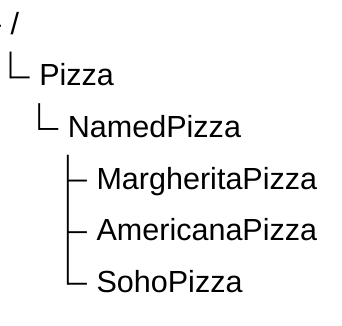

# Chapter 17 -- Refining Subclasses Through Semantic Differentiation

- 

## 17.1 Introduction -- From Taxonomy to Semantics

In Chapter (15) and (16), we focused on building subclass hierarchies inside the `Pizza` ontology.

You learned how subclasses enable:

- semantic specialization
- taxonomy construction
- semantic inheritance
- scalable ontology architecture

At this stage, the ontology already contains an increasingly rich hierarchy.

For example:

This structure provides clear organization already.

However, an important question now emerges:

> What actually makes these subclasses semantically different?

At the moment, these subclasses are distinguished mainly by their names.

For humans, names already carry meaning.

We intuitively understand that:

- `MargheritaPizza` typically contains cheese and tomato
- `AmericanaPizza` often includes meat toppings
- vegetarian pizzas exclude meta

**But ontology reasoners do not rely on human intuition.**

They only understand:

> explicit logical statements.

This introduces one of the most important principles in ontology engineering:

> If semantic meaning is not explicitly modeled, it does not exist for the reasoner.

This chapter marks a major transition!

We move from:

> taxonomy construction

toward:

> semantic differentiation.

## 17.2 Exercise 16 -- Preparing Subclasses for Richer Semantics