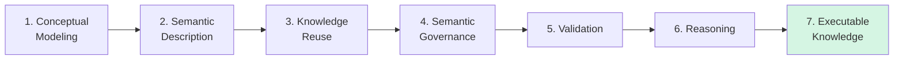
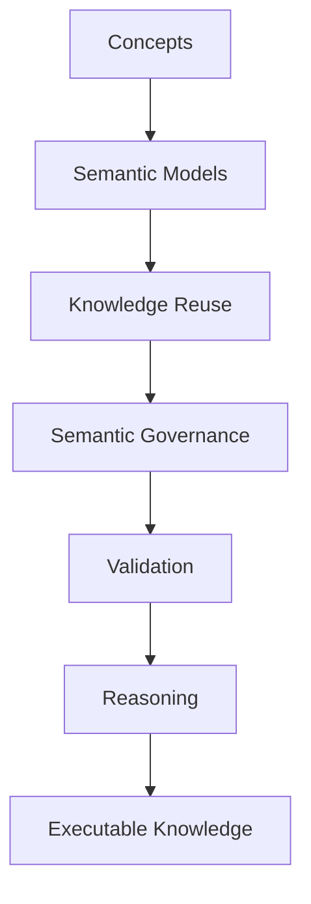

# Chapter 15 -- Semantic Knowledge Development Lifecycle (SKDL)

**From Semantic Modeling to Executable Knowledge**

- [Chapter 15 -- Semantic Knowledge Development Lifecycle (SKDL)](#chapter-15----semantic-knowledge-development-lifecycle-skdl)
  - [15.1 Congratulations -- You Have learned the Language of OWL](#151-congratulations----you-have-learned-the-language-of-owl)
  - [15.2 From Learning OWL to Practicing Ontology Engineering](#152-from-learning-owl-to-practicing-ontology-engineering)
  - [15.3 What Is the Semantic Knowledge Development Lifecycle (SKDL)?](#153-what-is-the-semantic-knowledge-development-lifecycle-skdl)
  - [15.4 The Semantic Knowledge Development Lifecycle (SKDL)](#154-the-semantic-knowledge-development-lifecycle-skdl)
  - [15.5 Understanding Each Lifecycle Stage](#155-understanding-each-lifecycle-stage)
  - [15.6 Relationship Between SKDL and EKA Framework](#156-relationship-between-skdl-and-eka-framework)
  - [15.7 Mapping Michael DeBellis' Tutorial to the Lifecycle](#157-mapping-michael-debellis-tutorial-to-the-lifecycle)
  - [15.8 Interesting Reading -- The Lifecycle of Knowledge Development](#158-interesting-reading----the-lifecycle-of-knowledge-development)
  - [15.9 Preview of the Next Chapters](#159-preview-of-the-next-chapters)
  - [15.10 Chapter Summary](#1510-chapter-summary)

## 15.1 Congratulations -- You Have learned the Language of OWL

By completing Chapter (14) - I know it's a long chapter - you have reached an important milestone in your ontology engineering journey.

So far, this book has introduced the fundamental building blocks of **OWL**, including:

- ontology classes
- object properties
- inverse properties
- property characteristics
- domain and range
- existential restrictions (`some`)
- universal restrictions (`only`)
- logical reasoning
- semantic governance
- the Open World Assumption

These concepts form the logical language used to describe knowledge in an ontology.

At this point, you already understand **how OWL expresses semantic knowledge.**

The focus now changes.

Instead of learning individual OWL constructs one by one, the remaining chapters will show how these constructs work together to build complete semantic systems.

In other words, you are moving from

> learning a language

toward:

> learning an engineering discipline.

Congratulations on reaching this milestone!

Before continuing, consider taking a short break, grab a cup of coffee or tea.

Reflect on how far you have progressed -- from creating your first ontology in Protégé to understanding semantic restrictions and automated reasoning.

The chapters that follow will build upon everything you have learned so far.

## 15.2 From Learning OWL to Practicing Ontology Engineering

Learning OWL syntax is similar to learning the vocabulary and grammar of a spoken language.

Knowing individual words does not automatically enable someone to write a novel.

Likewise, understanding individual OWL constructs DOES NOT immediately translate into designing scalable enterprise ontologies.

Ontology engineering is a systematic process.

Each modeling decision influences future **reasoning**, **validation**, **governance**, and **knowledge reuse**.

Professional ontology engineers therefore think beyond individual classes or properties.

They consider questions such as:

- *How should domain concepts be organized?*
- *Which concepts should become reusable semantic patterns?*
- *How can semantic consistency be maintained as the ontology grows?*
- *Which axioms enable automatic reasoning?*
- *How can ontology models evolve without becoming difficult to maintain?*

These questions shift ontology engineering from software operation to architectural design.

The remaining chapters of this book introduce a structured engineering workflow that answers these questions.

## 15.3 What Is the Semantic Knowledge Development Lifecycle (SKDL)?

Throughout the remainder of this book, we introduce the **Semantic Knowledge Development Lifecycle (SKDL)**.

The SKDL describes the progressive stages through which semantic knowledge evolves -- from an **initial conceptual model** into **executable knowledge** capable of supporting intelligent systems.

Unlike a software development lifecycle (SDLC), which primarily transforms requirements into executable code, the SKDL transforms domain knowledge into executable semantics.

This lifecycle provides a practical roadmap for ontology engineers, enterprise architects, and knowledge graph practitioners.

## 15.4 The Semantic Knowledge Development Lifecycle (SKDL)

Each stage builds upon the previous one.

1. Conceptual models provide the structure.
2. Semantic descriptions enrich those structures with meaning.
3. Reusable patterns accelerate ontology development.
4. Governance ensures consistency.
5. Validation detects logical problems.
6. Reasoning derives new knowledge automatically.

Together, these stages transform static data models into intelligent semantic systems.

## 15.5 Understanding Each Lifecycle Stage

The **Semantic Knowledge Development Lifecycle (SKDL)** divides ontology engineering into seven (7) progressive stages. Each stage addresses a distinct engineering objective while building upon the semantic artifacts produced by the previous stage.

Rather than viewing ontology development as a collection of isolated modeling techniques, SKDL organizes the process into a structured lifecycle in which semantic knowledge gradually evolves -- from conceptual abstraction to executable intelligence.

Each stage contributes a specific capability that ultimately supports the vision of **Executable Knowledge Architecture (EKA)** introduced in Chapter (00).

The seven stages are summarized below:

| Stage | Purpose | Typical Activities |
| --- | --- | --- |
| **1. Conceptual Modeling** | Identify and organize domain concepts into coherent semantic taxonomies. | Create classes, subclasses, abstraction hierarchies, and taxonomy structures. |
| **2. Semantic Description** | Enrich concepts with formal semantic definitions, properties, and logical restrictions. | Define object properties, existential and universal restrictions, equivalent classes, and semantic axioms. |
| **3. Knowledge Reuse** | Extend existing ontology components through semantic reuse and incremental refinement. | Duplicate, specialize, refactor, and extend existing ontology structures while minimizing redundancy. |
| **4. Semantic Governance** | Maintain semantic integrity through modeling standards, constraints, and governance policies. | Apply ontology design principles, naming conventions, modularization, documentation, and semantic governance practices. |
| **5. Semantic Validation** | Verify ontology correctness before deployment by ensuring logical consistency and semantic quality. | Execute reasoners, detect inconsistencies, validate constraints, review inferred hierarchies, and perform ontology quality assurance. |
| **6. Semantic Reasoning** | Discover implicit knowledge through logical inference and automated semantic classification. | Execute OWL reasoning, infer new knowledge, classify concepts, and enrich the knowledge graph automatically. |
| **7. Executable Knowledge** | Connect semantic knowledge with enterprise systems, automation, AI and intelligent decision-making. | Integrate ontologies with EKA workflows, knowledge graphs, APIs, enterprise applications, intelligent agents,and semantic automation. |

Although these stages are presented sequentially, ontology engineering is rarely a strictly linear process. As new requirements emerge or domain knowledge evolves, ontology engineers frequently revisit earlier stages to refine conceptual models, improve semantic definitions, strengthen governance, or validate newly introduced knowledge.

For this reason, SKDL should be viewed as an iterative engineering lifecycle rather than a one-time development methodology. Each iteration progressively improves the semantic model while preserving consistency with the knowledge already established.

Most importantly, each stage contributes directly to the realization of the EKA framework. As the lifecycle progresses, the ontology evolves from a static conceptual model into an executable semantic asset capable of supporting reasoning, governance, automation, and intelligent decision-making.

## 15.6 Relationship Between SKDL and EKA Framework

One of the distinguishing characteristics of the Semantic Knowledge Development Lifecycle is that it does not exist independently of EKA. Instead, SKDL provides the practical engineering methodology for progressively constructing the five components of the **Executable Knowledge Architecture (EKA)**.

$\large{EKA = (K, R, \Theta, \Phi, \Gamma)}$

- $K$: Knowledge Graph Layer
- $R$: Reasoning & Rules Layer
- $\Theta$: Trigger Layer
- $\Phi$: Execution Layer
- $\Gamma$: Governance Layer

Rather than attempting to build all EKA components simultaneously, ontology engineers develop them incrementally as the semantic model matures.

The relationship between SKDL and EKA is illustrated below:

| SKDL Stage | Primary EKA Components | Contribution |
| --- | --- | --- |
| 1. Conceptual Modeling | $K$ -- Knowledge Graph| Establishes the conceptual vocabulary and semantic taxonomy of the domain. |
| 2. Semantic Description | $K$ -- Knowledge Graph | Enriches concepts with formal semantic definitions and logical meaning. |
| 3. Knowledge Reuse | $K$ -- Knowledge Graph | Expands and refines the knowledge graph through reusable semantic patterns. |
| 4. Semantic Governance | $\Gamma$ -- Governance | Introduces semantic quality controls, modeling standards, and governance policies. |
| 5. Semantic Validation | $\Gamma + K$ | Verifies semantic correctness, logical consistency, and ontology quality before deployment. |
| 6. Semantic Reasoning | $R$ -- Reasoning & Rules | Enables automated inference and semantic classification using formal logic. |
| 7. Executable Knowledge | $\Theta + \Phi$ | Connects semantic knowledge to triggers, enterprise workflows, APIs, AI agents, and executable actions. |

This mapping also illustrates an important engineering observation.

The $K$ - **Knowledge Graph** is not constructed in a single activity. Instead, it evolves progressively across the first three stages SKDL. Conceptual Modeling establishes the structural foundation, Semantic Description enriches that structure with formal meaning, and Knowledge Reuse expands the semantic model through incremental refinement.

Only after a sufficiently rich and stable knowledge graph has been established do governance, validation, and automated reasoning become truly effective.

Finally, the semantic knowledge produced by these stages can be operationalized through triggers and executable actions, completing the vision of **Executable Knowledge Architecture.**

## 15.7 Mapping Michael DeBellis' Tutorial to the Lifecycle

One unique aspect of this ebook is that is interprets Michael DeBellis' `Pizza` tutorial through the perspective of ontology engineering rather than simply following the software exercises.

Exercise 14 through 20 collectively illustrate the complete **Semantic Knowledge Development Lifecycle.**

| Tutorial Exercise | Semantic Knowledge Development Lifecycle | Primary Learning Objective |
| :---: | --- | --- |
| Exercise 14 | Conceptual Modeling | Create the first semantic taxonomy. |
| Exercise 15 | Semantic Description | Add logical characteristics to classes. |
| Exercise 16-17 | Knowledge Reuse | Reuse and specialize semantic design patterns. |
| Exercise 18 | Semantic Governance | Protect semantic integrity through disjointness. |
| Exercise 19 | Validation | Detect logical inconsistencies using reasoning. |
| Exercise 20 | Reasoning | Enable automatic semantic classification. |

Viewed individually, these exercises appear to be simple Protégé operations.

Viewed collectively, they demonstrate the lifecycle followed by professional ontology engineers.

This perspective transforms a sequence of software tutorials into a coherent methodology for semantic knowledge development.

## 15.8 Interesting Reading -- The Lifecycle of Knowledge Development

The idea that knowledge develops through progressive stages is not new. Throughout history, philosophers, scientists, and management scholars have proposed different ways of understanding how knowledge is created, refined, and applied.

One of the earliest discussions can be found in **Plato's *Theaetetus***, where Socrates explores the question:

> *What is knowledge?*

Among the ideas discussed is the famous concept that knowledge can be understood as **justified true belief** -- a belief that is true and supported by sufficient justification. Although modern epistemology has refined and challenged this definition, it established an enduring principle:

> Knowledge is more than information; it requires structure, meaning, and justification.

More than two thousand years later, knowledge management researchers continued exploring how knowledge evolves within organization. A particularly influential example is the **SECI Model**, proposed by Ikujiro Nonaka and Hirotaka Takeuchi. The model describes organizational knowledge creation as a continuous cycle of:

- **Socialization** -- sharing tacit knowledge through experience.
- **Externalization** -- expressing tacit knowledge in explicit forms.
- **Combination** -- integrating explicit knowledge into more complex structures.
- **Internalization** -- absorbing explicit knowledge back into individual understanding.

The Semantic Knowledge Development Lifecycle (SKDL) introduced in this book is inspired by the same fundamental observation:

> Knowledge is not created in a single step -- it evolves through successive stages.

However, SKDL addresses a different problem.

Rather than describing how people create organizational knowledge, SKDL describes how **semantic knowledge** is engineered into machine-interpretable models capable of supporting automated reasoning and intelligent systems.

The progression can be summarized as:

Each stage enriches the semantic model with additional structure, precision, and computational capability.

From a mathematical perspective, this evolution can be viewed as the gradual enrichment of a formal knowledge system.

Initially, we define a set of concepts:

$C = {c_1, c_2, \ldots, c_n}$

Semantic relationships organize these concepts into a graph:

$G=(V,E)$

Logical axioms further constrain and enrich the graph:

$A = {a_1, a_2, \ldots, a_m}$

Finally, reasoning derives new knowledge:

$K_{\text{new}} = K \cup Infra(A)$

Each stage increases the expressive power of the knowledge base without changing its underlying domain.

Seen from this perspective, ontology engineering is not merely about creating classes and properties. It is a disciplines process of progressively transforming domain knowledge into **executable semantic intelligence**.

The Semantic Knowledge Development Lifecycle provides a practical engineering roadmap for managing that transformation, bridging classical theories of knowledge with modern ontology engineering and the vision of **Executable Knowledge Architecture (EKA)**

## 15.9 Preview of the Next Chapters

The next several chapters correspond directly to the stages of the Semantic Knowledge Development Lifecycle.

| Chapter | Lifecycle Stage | Focus |
| --- | --- | --- |
| Chapter 16 | Conceptual Modeling | Building the first semantic taxonomy |
| Chapter 17 | Semantic Description | Adding meaning through logical characteristics |
| Chapter 18 | Knowledge Reuse | Reusing and refining ontology design patterns |
| Chapter 19 | Semantic Governance | Protecting semantic consistency |
| Chapter 20 | Validation | Detecting logical inconsistencies |
| Chapter 21 | Reasoning | Enabling automatic semantic inference |

Rather than viewing these chapters as isolated tutorials, think of them as successive stages in a single engineering process.

Each chapter contributes another capability required to build robust, scalable, and executable semantic knowledge systems.

## 15.10 Chapter Summary

This chapter introduced the **Semantic Knowledge Development Lifecycle (SKDL)**, a practical engineering roadmap that will guide the remainder of this book.

Rather than treating ontology development as a collection of unrelated modeling techniques, the lifecycle presents ontology engineering as a progressive process in which semantic knowledge evolves from conceptual structures into executable intelligence.

As you continue through the following chapters, keep this lifecycle in mind.

Every new modeling techniques you lean represents another step toward building semantic systems that are not only logically consistent, but also capable of supporting automated reasoning, enterprise governance, and ultimately the vision of **Executable Knowledge Architecture (EKA)**

---

Last updated at 2026-07-08