# Chapter 15 -- Semantic Requirements: Universal Restriction, Composition, and the Neo4j Mirror

> **Editor's note:** This chapter is Part 2 of a three-chapter unit on OWL property restrictions (originally drafted as a single Chapter 14; see Chapter 14 for the foundations and existential restriction, and Chapter 16 for the EKA synthesis and common-mistakes review).

## Chapter Introduction

Chapter 14 gave you the first half of the semantic requirements toolkit: the **existential restriction** (`some`), which requires that at least one qualifying relationship exists. As Chapter 14 closed, we flagged the gap that `some` leaves open -- it permits, but never forbids.

This chapter closes that gap. You will learn the **universal restriction** (`only`), see why `some` and `only` must be combined to produce a correct, reasoner-verifiable definition of `VegetarianPizza`, and then step outside Protégé entirely to see how both restriction types would be implemented as constraints in a property graph database (Neo4j) -- a comparison that sharpens your understanding of the Open World Assumption by contrasting it against the Closed World Assumption most graph databases use.

Table of Contents:
- [15.1 Universal Restriction -- Understanding `only`](#151-universal-restriction----understanding-only)
  - [15.1.1 From Existence to Constraint -- Why `only` is Needed](#1511-from-existence-to-constraint----why-only-is-needed)
  - [15.1.2 The Semantics of `only` -- "All Must Be" vs. "Only Allowed"](#1512-the-semantics-of-only----all-must-be-vs-only-allowed)
  - [15.1.3 The Critical Difference -- `some` vs. `only`](#1513-the-critical-difference----some-vs-only)
  - [15.1.4 Universal Restriction in Protégé -- `only` as a Semantic Guardian](#1514-universal-restriction-in-protégé----only-as-a-semantic-guardian)
- [15.2 Combining `some` and `only` -- The Classic `VegetarianPizza` Pattern](#152-combining-some-and-only----the-classic-vegetarianpizza-pattern)
  - [15.2.1 Why `some` Alone Is Not Enough?](#1521-why-some-alone-is-not-enough)
  - [15.2.2 Why `only` Alone Is Not Enough](#1522-why-only-alone-is-not-enough)
  - [15.2.3 Why Logical Composition Matters](#1523-why-logical-composition-matters)
- [15.3 Implementing `some` and `only` in Graph Database - A Neo4j Perspective](#153-implementing-some-and-only-in-graph-database---a-neo4j-perspective)
  - [15.3.1 Implementing Existential Restriction (`some`) in Neo4j](#1531-implementing-existential-restriction-some-in-neo4j)
  - [15.3.2 Implementing Universal Restriction (`only`) in Neo4j](#1532-implementing-universal-restriction-only-in-neo4j)
  - [15.3.3 Combining `some` and `only` in Neo4j](#1533-combining-some-and-only-in-neo4j)
  - [15.3.4 Cypher Query vs. Pellet Reasoner vs. Open World Assumption](#1534-cypher-query-vs-pellet-reasoner-vs-open-world-assumption)
- [Chapter 15 -> 16 Bridge](#chapter-15---16-bridge)
- [Key Concepts (Chapter 15)](#key-concepts-chapter-15)

## 15.1 Universal Restriction -- Understanding `only`

In the previous sections, you explored:

> **existential restriction (`some`)**

and discovered one of the most important ideas in ontology engineering:

> ontology can define not only what exists,

but also:

> what **must** exist.

For example, the expression `hasTopping some CheeseTopping` allows ontology to express a meaningful semantic requirement:

> every pizza **must** contain at least one cheese topping.

This is already a major conceptual shift.

Because ontology is no longer behaving merely as a relationship repository or a connected graph structure. Instead, ontology begins acting as:

> a semantic rule system.

Meaning:

relationships are no longer interpreted only as:

> stored facts,

but also as:

> logical conditions.

At this point, you may reasonably feel:

> "I understand how ontology can require something to exist."

However, a second and equally important modeling problem soon appears.

Ontology engineers must also ask:

> **How can we control what kind of things are allowed to exist?**

This distinction may initially appear subtle.

Yet it fundamentally changes how semantic system behave.

In real-world enterprise environments, data quality problems rarely emerge only because:

> required information is missing.

More often, problems emerge because:

> incorrect relationships are introduced.

For example:

An employee may accidentally be linked to:

> a business application

instead of

> a department.

A customer may mistakenly belong to:

> a linux server infrastructure.

A business capability may incorrectly be realized by:

> a physical office location.

In all these cases:

> relationships exist,

but:

> semantic (meaning) correctness is violated.

Ontology therefore requires more than **participation rules**, it also requires **semantic boundaries.**

Existential restriction helps ontology answer：

> **What kinds of things are semantically allowed?**

To solve this challenge, OWL introduces another important semantic constructor **Universal Restriction** represented in Protégé using `only` and formally implemented through `allValuesFrom`.

First, have a look that it's just under the existential (some) type in Protégé:

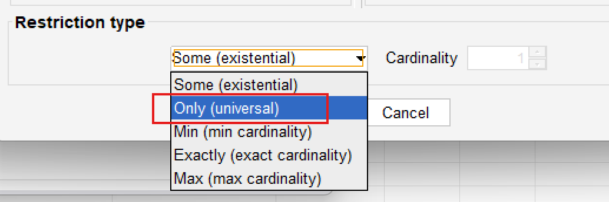

Unlike existential restriction, which focuses on:

> **existence** (by its naming),

universal restriction focuses on:

> **constraint.**

More specifically:

ontology moves from:

> semantic participation

toward:

> **semantic governance.**

This makes an important evolution in ontology engineering.

Because semantic systems gradually stop asking only:

> "What relationships should exist?"

and being asking:

> "Are existing relationships semantically valid?"

As ontology models scale toward:

- enterprise knowledge graphs,
- semantic integration platforms, and
- executable intelligence systems,

this distinction becomes increasingly important.

Ontology therefore evolves from:

> connected knowledge

into:

> **governed semantic knowledge.**

### 15.1.1 From Existence to Constraint -- Why `only` is Needed

To understand why universal restriction exists, let us first examine an important limitation of existential restriction.

Suppose we define the following semantic requirement:

`hasTopping some VegetableTopping`

Ontology now understands:

> a pizza must contain **at least one** vegetable topping.

At first glance: this may appear sufficient for describing a:

> vegetarian pizza.

After all: ontology can already validate:

> whether vegetable participation exists.

However, consider the following scenario.

Suppose ontology contains:

```
PizzaA hasTopping MushroomTopping
PizzaA hasTopping ChocolateTopping
```

Since `MushroomTopping` belongs to `VegetableTopping`, the existential condition succeeds.

Ontology correctly observes:

> at least one vegetable topping exists.

Yet something still feels wrong.

Because the same pizza also contains `ChocolateTopping` which clearly violates:

> common semantic expectations of vegetarian pizza.

This example reveals an important limitation.

Existential restriction successfully validates:

> **minimum participation**

But it does **NOT regulate semantic boundaries.**

Ontology can confirm:

> something acceptable exists.

But ontology still cannot answer:

> are all relationships semantically appropriate?

This distinction becomes increasingly important in enterprise modeling.

Consider an ontology according to employee.

Suppose the architect define:

`Employee SubClassOf (belongsToDepartment some Department)`

Ontology now ensures:

> every employee belongs to at least one department.

This is useful.

However, ontology still allows situations such as:

`Employee_A belongsToDepartment Product_X`

or:

`Employee_A belongsToDepartment DataCenter_01`

which are semantically incorrect.

The relationship exist, but the meaning becomes **polluted.**

Ontology therefore requires another mechanism.

Not merely to say:

> something valid exists.

But to say:

> **everything involved must remain semantically valid.**

This is where **universal restriction (`only`)** becomes necessary.

A useful way to think about the distinction is:

- `some` $\rightarrow$ minimum semantic participation
- `only` $\rightarrow$ semantic boundary enforcement

Or more simply:

- `some` $\rightarrow$ something valid must exist
- `only` $\rightarrow$ everything must conform

This transition represents an important maturity step in ontology thinking.

Ontology is no longer merely asking:

> "What should be present?" *-- by existential restriction*

It now also asks:

> **"What should be permitted?** *-- by universal restriction*

In enterprise terms:

- `some` ensures a **business rule**: e.g. "Every application must have an owner."
- `only` ensures **data quality**: e.g. "Every owner must belong to the class `Employee` (not `Department`, not `Supplier`)."

Both are needed.

One without the other leaves the ontology incomplete.

### 15.1.2 The Semantics of `only` -- "All Must Be" vs. "Only Allowed"

Universal restriction introduces a very different form of semantic logic.

Consider the OWL expression: `hasTopping only PizzaTopping`

At first glance, many learners interpret this expression incorrectly.

A common misunderstanding is:

> "This pizza must contain pizza toppings."

However, this interpretation is **semantically** inaccurate.

The keyword `only` does **NOT require existence.**

Instead, it constraints:

> the semantic type of relationship **if they exist.**

More precisely, ontology interprets the expression as:

> **IF** toppings exist, every topping must belong to the class `PizzaTopping`.

Notice the subtle difference?

Ontology is **not saying**:

> toppings MUST EXIST.

Ontology is only saying:

> whenever toppings exist, they must satisfy semantic expectations.

*The hidden meaning is:*

> *if toppings are not existed, I do not care since that's not triggering inference.*

This distinction is extremely important.

Because ontology engineers often **unconsciously** interpret `only` using:

> natural language intuition.

In ordinary English:

> "only pizza toppings" often sounds like **mandatory presence.**

But OWL semantics behave differently!

Ontology reasoners interpret:

> `hasTopping only PizzaTopping`

as:

> a semantic limitation,

not:

> an existence requirement.

A useful mental model is to image `only` as:

> a semantic type checker.

In programming languages, type systems help ensure:

> data conforms to expected formats.

For example:

> an integer field should NOT suddenly contain **a text string**.

Similarly:

universal restriction ensures ontology relationships remain:

> semantically consistent.

Ontology therefore uses `only` to establish:

> **relationship type safety.**

This idea connects naturally back to Chapter (13) -- Domain and Range.

At first glance, Domain/Range and universal restriction may appear similar.

Because both attempt to improve:

> semantic correctness. (kind of governance)

However, they operate at different levels.

| | Domain and Range | Universal Restriction |
| --- | --- | --- |
| Definition | Define "structural expectations". | Rather than describing "relationship design", it evaluates "actual semantic behavior". |
| Example | `hasTopping`<br>`Domain: Pizza`<br>`Range: PizzaTopping` | `hasTopping only PizzaTopping` |
| Question Asked | "What relationship types are structurally expected?" | "Do all existing relationships remain semantically valid?" |
| Action | Act like "a schema-level semantic rule" | Evaluate "actual semantic behavior" |
| Meaning | Ontology expects "pizzas should connect to pizza toppings" | Ontology expects "whenever pizza toppings exist, the semantic expectations must be satisfied" |

This distinction is especially important for:

> enterprise knowledge governance.

Because semantic quality is rarely protected by **structure alone**.

Instead, ontology must continuously evaluate **relationship meaning.**

Universal restriction therefore behaves like:

> **semantic runtime governance.**

rather than merely structural design.

### 15.1.3 The Critical Difference -- `some` vs. `only`

At this stage, you should clearly recognize that:

> existential restriction (`some`)

and:

> universal restriction (`only`)

are not interchangeable.

Although their syntax may initially appear similar, they represent fundamentally different forms of semantic logic.

Understanding this distinction is one of the most important milestones in ontology engineering.

Because many ontology beginners mistakenly assume `some $\approx$ only` and simply treat them as:

> different OWL keywords.

In reality, they answer **completely different** semantic questions.

Existential restriction asks:

> **"Does at least one qualifying relationship exist?"**

While universal restriction instead asks:

> **"if relationships exist, do they all satisfy semantic expectations?"**

This distinction may appear subtle.

Yet it fundamentally changes:

- reasoning behavior,
- inference outcomes, and
- semantic interpretation.

The following comparison provides a useful summary:

| Characteristic | `some` (Existential Restriction) | `only` (Universal Restriction) |
| --- | --- | --- |
| Core Question | "Must at least one relationship exist?" | "If relationships exist, must they all belong to a certain class?" |
| Semantic Meaning | Minimum existence requirement | Semantic limitation / boundary |
| Creates | Requirement | Constraint |
| Logical Role | Participation condition | Semantic governance |
| Reasoner Behavior | Searches for valid evidence | Searches for invalid evidence |
| Behavior with No Relationship | Not satisfied | Satisfied (don't care) |
| Example | `hasTopping some VegetableTopping` | `hasTopping only PizzaTopping` |

One of the most powerful way to understand the distinction is through:

> **reasoner behavior.**

When ontology evaluates `hasTopping some CheeseTopping`, the reasoner behaves almost like:

> a semantic search engine.

Its task becomes **finding evidence.**

More specifically, the reasoner here asks:

> "Can at least one topping be found that belongs to `CheeseTopping`?"

If ontology identifies `MozzarellaTopping` or `ParmesanTopping`, then the condition succeeds.

Means ontology has found:

> qualifying semantic evidence.

Universal restriction behaves very differently.

Consider `hasTopping only PizzaTopping`, here the reasoner is not searching for **evidence of success.**

Instead, it searches for **evidence of violation!**

The reasoner effectively asks:

> "Do any topping violate semantic expectations?"

If ontology discovers `ChocolateBar` connected through `hasTopping`, while `ChocolateBar` does not belong to `PizzaTopping`, then semantic inconsistency may emerge.

A memorable mental model is:

- `some` $\rightarrow$ `search for qualifying evidence`
- `only` $\rightarrow$ `search for violating evidence`

This distinction becomes extremely useful when ontology models grow larger, into the enterprise scale.

Because enterprise semantic systems increasingly depend upon:

> automated validation

rather than:

> manual review.

Another important difference appears when:

> no relationship exists.

Suppose ontology contains `Pizza_B` with no toppings currently defined.

Would the following condition succeed?

`hasTopping some CheeseTopping`

The answer is:

> **NO.**

Because ontology cannot find evidence showing:

> at least one cheese topping exists.

Existential restriction therefore fails.

Now consider:

`hasTopping only PizzaTopping`

Surprisingly:

> ontology still considers the restriction satisfied.

Why?

Because ontology now finds:

> no invalid toppings.

Universal restriction asks:

> "If toppings exist, are they semantically valid?"

When no toppings exist:

> no violation can be observed.

In formal logic, this behavior is called **vacuous truth**.

Meaning:

> a universal condition remains true unless a counterexample exists.

You do not need to memorize this mathematical term immediately. (see Interesting reading for reference)

However, understanding the behavior is extremely important.

Because it reveals something fundamental:

> OWL reasoners think logically -- not intuitively.

Human may instinctively say:

> "A pizza without toppings should fail pizza rules."

But ontology behaves differently.

Ontology instead says:

> "No invalid topping exists, therefore no contradiction has been observed."

This distinction becomes increasingly important as learners transition from:

> data modeling

toward:

> logical knowledge modeling.

A useful summary is:

- `some` $=$ `at least one valid relationship must exist`
- `only` $=$ `all relationships must remain semantically valid`

Together, these relationships provide ontology with both:

> participation logic

and:

> semantic discipline.

#### ==== Interesting Reading: Vacuous Truth in Formal Logic ===

The behavior of `only` when no relationship exists -- i.e., it is automatically satisfied -- is not an arbitrary design choice. It follows a fundamental principle in formal logic called **vacuous truth**.

<h3>What is Vacuous Truth?</h3>

In classical logic, a statement of the form:

> *"If $P$, then $Q$"* (written as $P \rightarrow Q$)

is considered **true** whenever the condition $P$ is **false** -- regardless of whether $Q$ is true or false.

This is not a convention.

It is a logical necessity to avoid contradictions and to preserve the integrity of implication.

**Example in everyday reasoning**:

> *"If it rains, then the ground will be wet.*

If it does **not** rain, the statement is still considered **true** (vacuously true). It makes no claim about the ground's wetness when it doesn't rain. It only promises that *whenever* it rains, wetness follows.

<h3>How Vacuous Truth Applies to "only"</h3>

Recall the semantic meaning of `only`:

> *"If a pizza has a topping, then that topping must be `PizzaTopping`.*

This is a logical implication:

> `hasTopping(pizza, topping)` $\rightarrow$ `PizzaTopping(topping)`

| Scenario | Pizza has topping? | Topping is PizzaTopping? | Implication (Vacuous Truth) |
| --- | --- | --- | --- |
| `Pizza` has `MushroomTopping` | ✅ True | ✅ True | **True** (satisfied) |
| `Pizza` has `ChocolateTopping` | ✅ True | ❌ False | **False** (violated) |
| `Pizza` has **no** toppings | ❌ False | (not evaluated) | **True** (vacuously satisfied) |

The third row is **vacuous truth**. Because the condition "pizza has a topping" is false, the overall `only` rule is automatically satisfied. The ontology does **not** complain about missing toppings.

<h3>Why Does Logic Include Vacuous Truth?</h3>

Without vacuous truth, logical implication would break down.

Consider the statement:

> *"All humans who can fly are astronauts.*

If there are no humans who can fly, the statement is considered **true** still.

It does not falsely claim that some flying humans exist. It simply states a conditional relationship that happens to be trivially satisfied because the condition never occurs.

This same principle allows `only` to act as a **pure constraint**, not an existence requirement. It governs the *type* of relationships *if they exist*, without forcing them to exist.

<h3>Mathematical Form</h3>

In first-order logic, the universal restriction $\forall x \; (R(x) \rightarrow C(x))$ is **vacuously true** when there is no $x$ that satisfies $R(x)$.

This is written as:

> $\forall x \in \phi, \; C(x)$ is always true.

Or equivalently:

> $\neg \exist x \; (R(x) \land \neg C(x))$

No counterexample exists $\rightarrow$ the statement is true still.

<h3>Why This Matters for Ontology Engineering?</h3>

- `only` **does not require existence** -- it only constrains what can exist.
- `some` **requires existence** -- it actively searches for at least one example.

Understanding vacuous truth prevents the common mistake of expecting `only` to behave like `some`.

> *"Vacuous truth is not a loophole! It is a logical feature that allow `only` to be a pure constraint, not a disguised requirement.*

==== END ====

### 15.1.4 Universal Restriction in Protégé -- `only` as a Semantic Guardian

Have understood the semantic meaning of `only` from both "**logical**" and "**mathematical**" perspective, you are now ready to observe how universal restriction behaves inside Protégé.

At first glance, universal restriction may appear very similar to concepts introduced earlier in Chapter (13) -- Domain and Range.

Because both mechanisms seems to control:

> semantic correctness.

However, both their behavior and purpose are fundamentally different.

- Domain and Range primarily define **structural expectations.**
- Universal restriction instead evaluates **logical consistency.**

This distinction becomes easier to understand through experimentation, in our Protégé.

Suppose we define the following restriction for `Pizza` inside **`SubClass Of`** using:

> `hasTopping only PizzaTopping`

*Note: Since our [common RDF workbook (pizza-ebook.rdf)](./rdf/pizza-ebook.rdf) had been already configured `some` when we practice existential constraint, to support this section without misleading, I'm clean unnecessary setting and create in one separate workbook called [pizza-ebook_15.1.4](./rdf/pizza-ebook_15.1.4.rdf).*

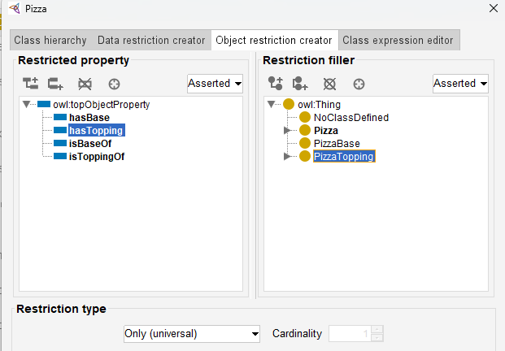

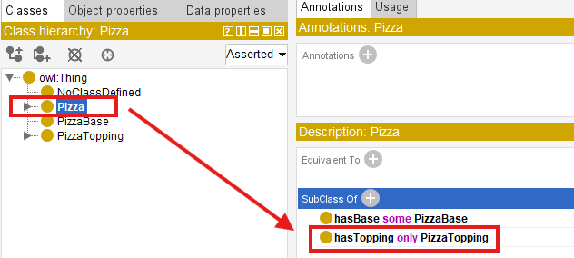

This expression tells ontology:

> whenever a pizza contains toppings, all toppings must belong to `PizzaTopping`.

Notice again: ontology is **NOT requiring toppings to exist!**

Instead, ontology governs:

> the semantic validity of toppings if they exist.

To better understand this behavior, let us intentionally construct:

> semantically problematic data.

Create an individual such as `StrangePizza` under `NamedPizza`:

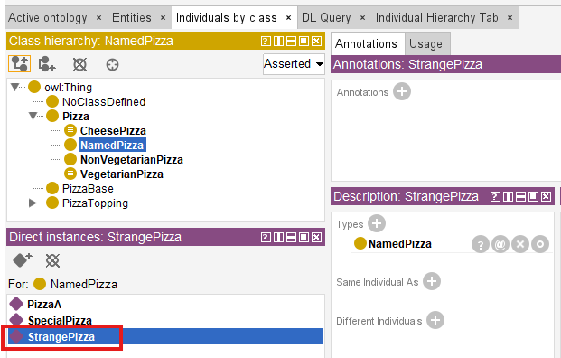

Then create another individual `ChocolateBar` that does **NOT** belong to `PizzaTopping`, let's create under our previous class `NoClassDefined` for simplicity:

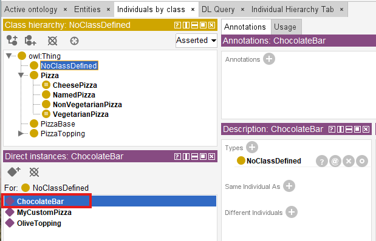

Now connect them through `StrangePizza hasTopping ChocolateBar` relationship:

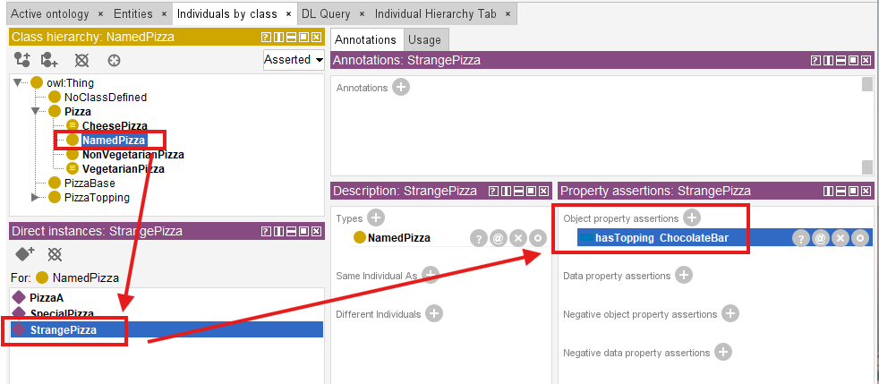

At first, Protégé may not immediately indicate a problem.

This sometimes indeed surprises beginners.

Because ontology editors often separate:

> assertion

from:

> reasoning.

Protégé first records:

> stated knowledge.

Only after synchronization does the **reasoner** begin:

> evaluating semantic consequences.

Once the reasoner executes:

> ontology starts logically evaluating the restriction.

Importantly, the reasoner does **NOT** ask:

> "Does this pizza have toppings?"

Instead, it asks:

> "Do all toppings satisfy the expected semantic type?"

This distinction matters!

Because ontology validation focuses on **meaning**, not merely **existence**.

Depending on how the ontology is modeled, several outcomes may occur.

The reasoner may identify **inconsistency**, **unsatisfied class membership**, or **classification failure**.

The exact behavior depends upon whether **disjointness**, **equivalent classes**, or **additional constraints** exist elsewhere in the ontology.

This experiment reveals an important ontology engineering principle:

> universal restriction behaves like a semantic quality monitor.

Rather than merely storing connected relationships, ontology continuously evaluates:

> whether relationships remain semantically trustworthy.

For enterprise architects, this idea is particularly important.

Because many enterprise systems fail not because:

> their relationships are absent,

but because:

> relationships become semantically **polluted**.

Let us look at one example:

an enterprise graph may technically allow following relationship:

`Employee belongsToDepartment Server01`

The relationship exists.

The database accepts it. (Base on the schema design.)

Yet semantically, the meaning is incorrect.

Universal restriction provides a mechanism for ontology to detect such kind of:

> **semantic drift**

before invalid meaning propagates throughout enterprise knowledge models.

A useful way to summarize the distinction is:

- `Range` $\rightarrow$ relationship expectation
- `only` $\rightarrow$ semantic validation

This is why `only` often behaves like:

> a semantic guardian.

Protecting ontology not from **missing data**, but from **"incorrect meaning**.

#### === Interesting Reading: Semantic Drift in Enterprise Knowledge Models ===

Universal restriction (`only`) provides a mechanism for ontology to detect **semantic drift** before any invalid meaning propagates throughout enterprise knowledge models.

Semantic drift occurs when a relationship gradually deviates from its intended meaning over time, often through incremental, seemingly harmless assertions.

For example, an ontology initially enforces:

`Application hostedOn only Infrastructure`

Over months of maintenance, a modeler adds:

`Application hostedOn VendorContract`

Because no `only` constraint was defined for `hostedOn`, the ontology silently accepts this new relationship. Over time, the semantic boundary erodes ("poisoned"). Queries that rely on `hostedOn` to locate `infrastructure` now return `VendorContract`s, breaking impact analysis, security compliance, and also dependency tracing.

**Formally**, semantic drift can be defined as:

> *A gradual violation of the universal restriction $\forall R.C$ where the set of observed relationships $R(x,y)$ expands to include individual $y$ that are not in the intended target class $C$, without the ontology detecting the violation.*

Universal restriction acts as a **semantic invariant**.

The reasoner continuously evaluates:

$\forall x,y: (x,y) \in R \rightarrow y \in C$

If a counter-example appears, the ontology flags an inconsistency or prevents the invalid relation ship from being trusted. This transforms ontology from a passive schema into an active **semantic guardian**, capable of detecting and preventing meaning erosion at scale.

In an enterprise environment, where thousands or millions of relationships may be added/updated by different teams over years, universal restriction becomes an essential tool for maintaining **semantic integrity** across the entire knowledge graph.

=== END ===

## 15.2 Combining `some` and `only` -- The Classic `VegetarianPizza` Pattern

At this stage, you may naturally being asking an important question:

> If existential restriction (`some`) and universal restriction (`only`) solve different semantic problems, can ontology combine them?

The answer is:

> **Yes -- and this is where ontology becomes significantly more powerful!**

In practical ontology engineering, meaningful concepts are rarely defined through **a single restriction.**

Instead, ontology begins expressing:

> **semantic identity through combinations of logical constraints.**

One of the most well-known examples appears in `VegetarianPizza`.

Consider the following OWL definition:

`VegetarianPizza EquivalentTo`<br>
`Pizza`<br>
`and (hasTopping some VegetableTopping)`<br>
`and (hasTopping only VegetableTopping)`

Reflect into Protégé, as below setting:

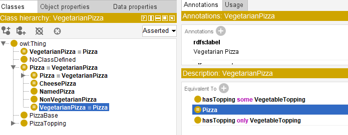

At first glance, this expression may appear repetitive.

After all, both restrictions reference `VegetableTopping`.

However, each restriction performs a completely different semantic role.

- `hasTopping some VegetableTopping` ensures that **at least one** vegetable topping exists.
- `hasTopping only VegetableTopping` ensures that **every** topping must be a vegetable.

Neither alone is sufficient. Only the combination of `some` and `only` creates a complete semantic definition.

To understand why both are necessary, it would be helpful to first examine:

> why isolated restrictions are incomplete.

### 15.2.1 Why `some` Alone Is Not Enough?

Suppose ontology only defines `hasTopping some VegetableTopping`, this means:

> at least one vegetable topping must exist.

At first glance, this may seem sufficient to describing:

> a vegetarian pizza.

However, consider the following situation:

`PizzaA hasTopping MushroomTopping`<br>
`PizzaA hasTopping PepperoniTopping`

Ontology evaluates `hasTopping some VegetableTopping` and immediately **succeeds.**

Why?

Because ontology finds:

> qualifying evidence.

The pizza contains `MushroomTopping`.

Then the existential condition therefore succeeds.

However, the pizza still contains `PepperoniTopping`, which clearly violates **vegetarian meaning.**

This illustrates an important ontology engineering lesson:

> existential restriction validates **participation** -- NOT semantic purity.

Or more simply, `some` ensures:

> something acceptable exists.

But it does **NOT** ensure:

> everything remains acceptable.

The reasoner asks:

> "Can qualifying evidence be found?"

It does **NOT** ask:

> "Are there any violations?"

Semantic meaning therefore remains incomplete.

### 15.2.2 Why `only` Alone Is Not Enough

Now consider the opposite situation.

Suppose ontology defines `hasTopping only VegetableTopping`.

This restriction states:

> if toppings exists, they must all belong to `VegetableTopping`.

At first glance, this appears semantically stronger.

However, a subtle logical problem emerges.

Image `PizzaB` with no toppings at all.

Surprisingly, ontology still consider `hasTopping only VegetableTopping` to be **satisfied.**

Why?

Because ontology searches for:

> violating evidence.

and in this case:

> no violating topping exists.

This follows the mathematical principle introduced earlier:

> **vacuous truth.**

In formal logic, a universal statement remains **true** unless:

> a counterexample exists.

Ontology therefore concludes:

> nothing violates the rule.

However, from a human perspective, an empty pizza may not intuitively feel like:

> a valid vegetarian pizza.

This highlights an important distinction:

> reasoners think **logically** -- **NOT** intuitively.

Universal restriction provides:

> semantic discipline.

But it does **NOT require participation.**

### 15.2.3 Why Logical Composition Matters

Ontology becomes significantly more expressive when both restrictions are combined.

Consider again:

`VegetarianPizaa EquivalentTo`<br>
`Pizza`<br>
`and (hasTopping some VegetableTopping)`<br>
`and (hasTopping only VegetableTopping)`

Together, the restrictions now express two independent requirements:

1. **At least one vegetable topping must exist**, and
2. **All toppings must remain vegetable toppings**.

The first restriction guarantees:

> semantic participation.

The second restriction guarantees:

> semantic consistency.

Only together do they express:

> authentic vegetarian meaning.

This reveals one of ontology engineering's most important principles:

> **meaning rarely emerges from a single rule.**

Instead:

> **meaning emerges from the interaction of multiple logical restrictions.**

A useful mental model can be thought as:

- `some` $\rightarrow$ participation
- `only` $\rightarrow$ discipline

Together, they produce:

> **semantic identity.**

Ontology therefore moves beyond:

> relationship storage

toward:

> governed conceptual meaning.

This is one of the reasons ontology differs fundamentally from traditional databases.

Databases typically store **facts**.

Ontology additionally governs **what facts mean**.

## 15.3 Implementing `some` and `only` in Graph Database - A Neo4j Perspective

At this point, you may reasonably ask:

> If existential and universal restrictions are so powerful, can similar logic be implemented in a graph database such as Neo4j?

The answer is:

> **Yes -- but with important limitations.**

This distinction is particularly important because many enterprise practitioners initially assume:

> **Neo4j = Ontology**

or:

> **Knowledge Graph automatically means semantic intelligence.**

In reality, graph databases and ontologies solve fundamentally different problems.

Neo4j primarily manages **connected data.**

Ontology additionally governs **logical meaning**. (note the "additionally" wording)

A graph database excels at:

- relationship storage,
- graph traversal, and
- connected querying.

However, Neo4j does not natively understand $\exist R.C$ or $\forall R.C$, nor does it automatically infer:

- class membership,
- semantic consistency, or,
- logical identity.

Instead, engineers must explicitly implement semantic behavior through:

> **Cypher queries.**

This becomes easier to understand using `VegetarianPizza`.

Suppose Neo4j contains below relationship:

`(:Pizza)-[:HAS_TOPPING]->(:Topping)`

You can use below Cypher to create these 2 nodes and 1 relationship (note: this is just for demo purpose, using below query you'll create two actual instances as well):

`CREATE (:Pizza)-[:HAS_TOPPING]->(:Topping)`

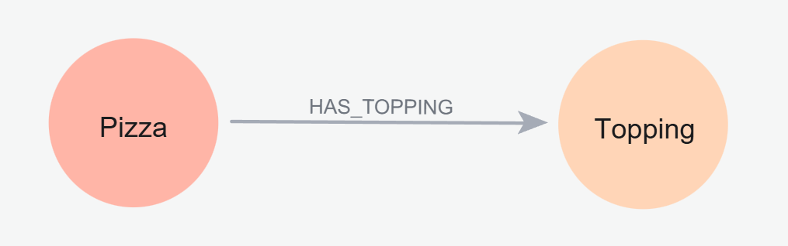

A pizza may connect to `MushroomTopping`, `TomatoTopping`, or `PepperoniTopping`.

Following Cypher queries are used to create these new relationships:

```sql
MERGE (p1:Pizza {name:"MyPizza1"})
MERGE (p2:Pizza {name:"MyPizza2"})
MERGE (p3:Pizza {name:"MyPizza3"})
MERGE (t1:Topping {name:"MushroomTopping"})
MERGE (t2:Topping {name:"TomatoTopping"})
MERGE (t3:Topping {name:"PepperoniTopping"})
MERGE (p1)-[:HAS_TOPPING]->(t1)
MERGE (p2)-[:HAS_TOPPING]->(t2)
MERGE (p3)-[:HAS_TOPPING]->(t3)
```

Then you may extract them as below:

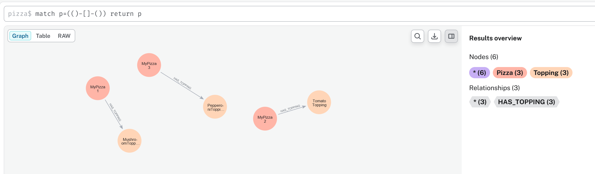

Neo4j itself does not automatically determine:

> whether the pizza qualifies as vegetarian.

Instead, semantic interpretation must be manually implemented.

> Tip: You may find the working Neo4j dump database in ebook's *neo4j* subfolder.

### 15.3.1 Implementing Existential Restriction (`some`) in Neo4j

Recall earlier `hasTopping some VegetableTopping` means:

> at least one vegetable topping **must** exist.

In mathematical notation:

$\exist \: \text{hasTopping}.\text{VegetableTopping}$

This expression asks:

> "Can qualifying evidence be found?"

Inside Neo4j, this behavior can be approximated using:

```sql
MATCH (p:Pizza)
WHERE EXISTS {
  MATCH (p)-[:HAS_TOPPING]->(:VegetableTopping)
}
RETURN p.name AS Pizza
```

To practice above query, we need to add `VegetableTopping` as another node in Neo4j, then double assign `MushroomTopping` and `TomatoTopping` to this new node:

```sql
MATCH (n:Topping {name:"MushroomTopping"}), (m:Topping {name:"TomatoTopping"})
SET n:VegetableTopping 
SET m:VegetableTopping
RETURN m, n LIMIT 25;
```

After above preparation, using `CALL db.schema.visualization`, you can see below schema:

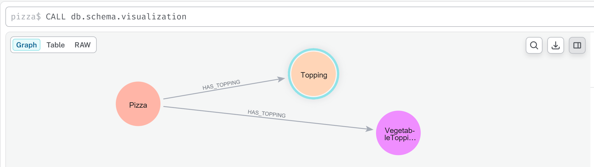

Now, you may execute previous Cypher query, and get result `MyPizza`:

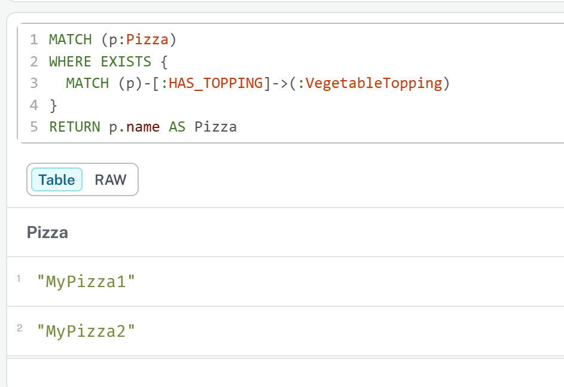

Notice the similarity.

The Cypher keyword `EXISTS` functions conceptually like:

> existential search.

Neo4j asks:

> "Does there exist at least one path to `VegetableTopping`?"

If answer is Yes, the pizza satisfies the condition.

However, an important difference remains.

Neo4j executes **an explicit query.**

While ontology instead performs **automatic reasoning.**

Once semantic restrictions are defined, the reasoner continuously evaluates:

> logical consequences.

Not require engineers repeatedly writing validation logic like in Neo4j.

### 15.3.2 Implementing Universal Restriction (`only`) in Neo4j

Now consider: `hasTopping only VegetableTopping`.

In mathematical notation: $\forall \: hasTopping.VegetableTopping$.

Unlike existential restriction, universal restriction asks:

> "Are all relationships semantically valid?"

This creates an interesting challenge.

Neo4j has no direct equivalent for $\forall$, instead, universal semantic are typically approximated through:

> **violation detection.**

Rather than proving **everything is valid.**

Neo4j attempts to prove **nothing invalid exists** (or say "nothing is not invalid")

For example below Cypher query:

```sql
MATCH (p:Pizza)
WHERE NOT EXISTS {
  MATCH (p)-[:HAS_TOPPING]->(t)
  WHERE NOT t:VegetableTopping
}
RETURN p.name AS VegetarianCandidate
```

You may see below result:

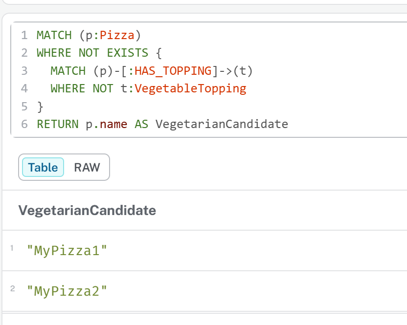

> [!Note] Why here still `MyPizza1` and `MyPizza2`?

This query asks:

> "Can any invalid topping be found?"

If no violating topping exists, the pizza passes validation.

This logic closely resembles $\forall \: hasTopping.VegetableTopping$ where semantic correctness is evaluated through:

> absence of contradiction.

Notice how this aligns perfectly with the reasoning distinction discussed earlier:

- `some` $\rightarrow$ for qualifying evidence
- `only` $\rightarrow$ for violating evidence

Ontology and Cypher therefore share:

> similar logical goals.

But they implement them differently.

### 15.3.3 Combining `some` and `only` in Neo4j

To simulate:

`VegetarianPizza EquivalentTo`<br>
`Pizza`<br>
`and (hasTopping some VegetableTopping)`<br>
`and (hasTopping only VegetableTopping)`

Neo4j must manually combine **both logical conditions.**

Below is the Cypher query:

```sql
MATCH (p:Pizza)
WHERE EXISTS {
  MATCH (p)-[:HAS_TOPPING]->(:VegetableTopping)
}
AND NOT EXISTS {
  MATCH (p)-[:HAS_TOPPING]->(t)
  WHERE NOT t:VegetableTopping
}
RETURN p.name AS VegetarianPizza
```

Result as below:

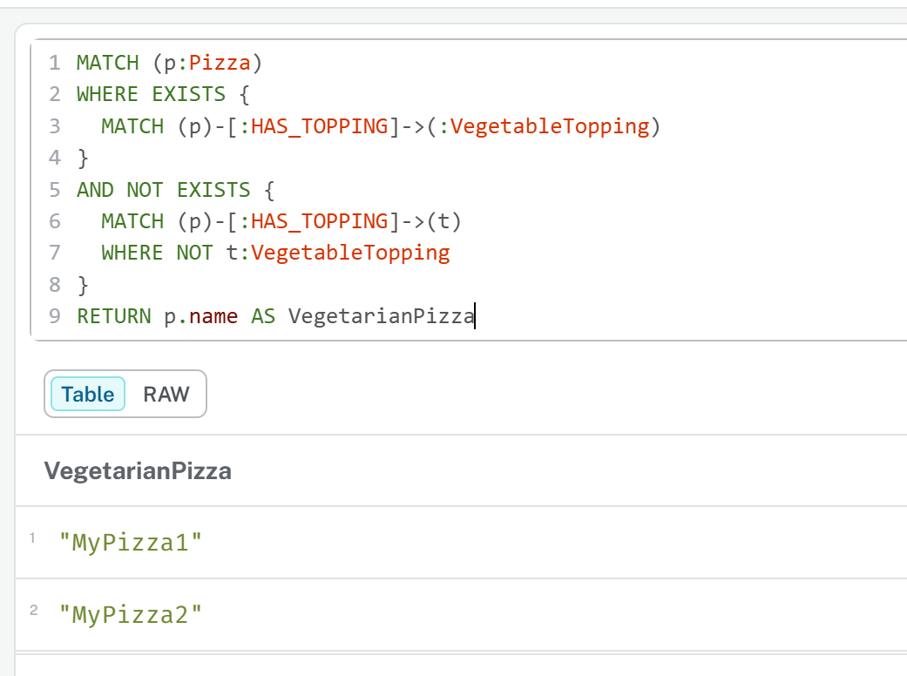

This query approximates ontology semantics by enforcing:

1. At least one vegetable topping exists, and
2. No invalid topping exists

The result may appear similar to OWL reasoning.

However, the implementation philosophy remains fundamentally different.

Neo4j performs **procedural semantic checking.**

Ontology performs **declarative semantic reasoning**.

In Neo4j, engineers must repeatedly write logic describing:

> how validation should happen.

In ontology, meaning becomes:

> part of the model itself.

The reasoner automatically performs **inference**, **validation** and **classification**.

This reveals an important architectural distinction:

- Neo4j $\rightarrow$ relationship intelligence
- OWL $\rightarrow$ semantic intelligence

Or more precisely:

- Graph Database $\rightarrow$ connected facts
- Ontology $\rightarrow$ governed meaning

This distinction becomes increasingly important as enterprise knowledge graphs scale.

Without ontology, semantic logic often becomes scattered across:

- Cypher queries,
- applications,
- APIs, and
- business rules.

Over time, semantic governance becomes fragmented.

Ontology instead centralizes:

> meaning itself.

Meaning no longer lives only inside:

> application code.

It becomes:

> an explicit enterprise asset.

### 15.3.4 Cypher Query vs. Pellet Reasoner vs. Open World Assumption

Sections 15.3.1 through 15.3.3 established a practical bridge between OWL restrictions and Cypher queries in Noe4j:

- Section 15.3.1 demonstrated how to implement existential restriction (`some`) using pattern matching with `MATCH` and `WHERE` clauses.
- Section 15.3.2 showed the implementation of universal restriction (`only`) using `NOT EXISTS` to detect invalid relationships.
- Section 15.3.3 then combined both restrictions, illustrating how complex semantic requirements -- such as "a pizza must have at least one cheese topping and no non-pizza toppings" -- can be expressed as graph patterns.

However, this pedagogical bridge -- while valuable for initial understanding and hands-on experimentation -- carries a significant risk:

> it may obscure two foundational semantic differences that distinguish OWL reasoning from graph database querying.

First, as discussed in Chapter 14 (section 14.7.4), OWL reasoners operate under the **Open World Assumption (OWA)**, while Neo4j (like most property graph databases) operates under the **Closed World Assumption (CWA)**.

Second, and more critically, the Cypher implementations in 15.3.1~15.3.3 treat `some` and `only` as *query patterns* that return results, whereas an OWL reasoner treats them as *logical axioms* that derive new knowledge.

To build truly robust executable knowledge architectures, an ontology engineer must understand how *both* restriction types behave under *both* world assumptions, and how they contrast with the property graph querying paradigm demonstrated in the previous three sections.

This section provides a two-dimension comparative analysis using a unified scenario. We keep extending our `Pizza.owl` knowledge base to evaluate both:

- **Existential Restriction (`some`)**: `hasTopping some CheeseTopping` -- "At least one cheese topping must exist."
- **Universal Restriction (`only`)**: `hasTopping only CheeseTopping` -- "If toppings exist, they must all be PizzaToppings."

**Example Scenario Definition**

**Ontology Definition:**

```
Existential Rule (some):
  CheesePizza EquivalentTo: Pizza and (hasTopping some CheeseTopping)

Universal Rule (only):
  CleanPizza EquivalentTo: Pizza and (hasTopping only PizzaTopping)
```

**Knowledge Base (Asserted Facts):**

| Individual | Asserted Type | Asserted Relationships | Class Hierarchy |
| --- | --- | --- | --- |
| **PizzaA** | `Pizza` | `hasTopping MozzarellaTopping` | `MozzarellaTopping` $\sqsubseteq$ `CheeseTopping` $\sqsubseteq$ `PizzaTopping` |
| **PizzaB** | `Pizza` | *(no `hasTopping` assertions)* | --- |
| **PizzaC** | `Pizza` | `hasTopping ChocolateTopping` | `ChocolateTopping` $\sqsubseteq$ `CandyTopping` (`CandyTopping` $\sqcap$ `PizzaTopping` = `owl:Nothing`) |
| **PizzaD** | `Pizza` | <li>`hasTopping MozzarellaTopping`</li><li>`hasTopping ChocolateTopping`</li> | (As above) |

**Initialize ontology in Protégé:**

New working ontology file: `/ebook/rdf/pizza-ebook_15.3.4.rdf`.

Base on above asserted facts, you may find following initialized knowledge:


- Set `Disjoint With` between `PizzaTopping` and `CandyTopping`
- Set proper Domain and Range to relationship `hasTopping`
- Create necessary instances for building up the relationships.

**Initialize graph database in Neo4j:**

Using following Cypher query to create all asserted facts:

```sql
MERGE (a:Pizza {name:"PizzaA"})-[h1:HAS_TOPPING]-(t1:Topping {name:"MozzarellaTopping"})
MERGE (b:Pizza {name:"PizzaB"})
MERGE (c:Pizza {name:"PizzaC"})-[h2:HAS_TOPPING]-(t2:Topping {name:"ChocolateTopping"})
MERGE (d:Pizza {name:"PizzaD"})-[h3:HAS_TOPPING]-(t1)
MERGE (d)-[h4:HAS_TOPPING]-(t2)
MERGE (t3:Topping {name:"CheeseTopping"})
MERGE (t4:Topping {name:"PizzaTopping"})
MERGE (t5:Topping {name:"CandyTopping"})
MERGE (t1)-[c1:CHILD_OF]->(t3)-[p1:PARENT_OF]->(t1)
MERGE (t3)-[c2:CHILD_OF]->(t4)-[p2:PARENT_OF]->(t3)
MERGE (t2)-[c3:CHILD_OF]->(t5)-[p3:PARENT_OF]->(t2)
RETURN a,b,c,d,t1,t2,h1,h2,h3,h4,t3,t4,t5,c1,c2,c3,p1,p2,p3
```


- Use two direction `PARENT_OF` and `CHILD_OF` for inverse class hierarchical structure

Since we have maximum two levels class hierarchy structure, to simulate the Protégé's Parent/Child inferencing behavior into Neo4j, run below Cypher query twice:

```sql
MATCH (p:Pizza)-[r1:HAS_TOPPING]->(t1:Topping)-[r2:CHILD_OF]->(t2:Topping)
MERGE (p)-[r3:HAS_TOPPING]->(t2)
RETURN p,t1,t2,r1,r2,r3
```


Note: here we don't see `PizzaB` since it has no topping relationship.

##### Part 1: Existential Restriction (`some`) -- "At Least One Must Exist"

**Goal:** Determine whether each individual satisfies `hasTopping some CheeseTopping` (i.e., is a `CheesePizza`).

Recall from 15.3.1 that the Cypher implementation of `some` uses a single pattern match:

```sql
MATCH (p:Pizza)-[:HAS_TOPPING]->(t1:Topping)
WHERE toLower(t1.name) CONTAINS "cheese"
RETURN p
```

You get `PizzaA` and `PizzaD`

Note: we don't create `CheeseTopping` as another node in Neo4j, it's one instance of `Topping` node and we use `WHERE` clause to filter that.

Now compare this closed-world query against OWL open-world reasoning:

| Individual | Cypher (CWA) - per 15.3.1 | Pellet Reasoner (OWA) | OWA Formal Conclusion |
| --- | --- | --- | --- |
| **PizzaA** | ✅ **Returned** - Pattern matches | ✅ **Inferred as `CheesePizza`** - Evidence found | **True** - Sufficient evidence exists |
| **PizzaB** | ❌ **Not returned** - No matching relationship | ❌ **Not inferred** - Also not inferred as $\neg CheesePizza$ | **Unknown** - Missing information; future facts could change this |
| **PizzaC** | ❌ **Not returned** - Target is not `CheeseTopping` | ❌ **Not inferred as `CheesePizza`** - Condition false for known relationship | **False** - Evidence exists and definitively fails the condition |
| **PizzaD** | ✅ **Returned** - At least one relationship satisfies pattern | ✅ **Inferred as `CheesePizza`** - `MozzarellaTopping` satisfies condition | **True** - One valid relationship is sufficient; invalid relationships are irrelevant |

**Key Insight for `some`**:

- Under OWA, the existential restriction is *monotonic*. Once satisfied (`PizzaD`), it returns satisfied regardless of additional assertions. The reasoner searches for *at least one piece of validating evidence.*
- The Cypher query from 15.1.6.1 and customized here correctly identifies `PizzaA` and `PizzaD`, but it cannot distinguish `PizzaB` (unknown) from `PizzaC` (false) -- both simply "not returned". This conflation is the primary limitation of the closed-world emulation.

##### Part 2: Universal Restriction (`only`) -- "Everything Must Conform"

**Goal:** Determine whether each individual satisfies `hasTopping only PizzaTopping` (i.e., has no topping outside the `PizzaTopping` class).

Recall from 15.3.2 that the Cypher implementation of `only` uses `NOT EXISTS` to detect violations:

```sql
MATCH (p:Pizza)
WHERE NOT EXISTS {
  (p)-[:HAS_TOPPING]->(t:Topping)
  WHERE NOT toLower(t.name) CONTAINS "pizza"
}
RETURN p
```

Result is `PizzaB` in the Neo4j graph; however, our testing graph doesn't return `PizzaA` due to we don't complicated query to check Parent/Child context here, in reality, `PizzaA` si also fulfill the CWA.

Now compare this against OWL open-world reasoning:

| Individual | Cypher (CWA) - per 15.3.2 | Pellet Reasoner (OWA) | OWA Formal Conclusion |
| --- | --- | --- | --- |
| **PizzaA** | ✅ **Returned** - No invalid topping found | ✅ **Satisfies restriction** - All relationships valid | **True** - All asserted relationships are valid |
| **PizzaB** | ✅ **Returned (vacuously)** - See vacuous truth discussion in 15.1.3 | **True (vacuously)** - No counterexample exists |
| **PizzaC** | ❌ **Not returned** - Invalid topping detected | ❌ **Violates restriction** - Counterexample found | **False** - Definitive counterexample exists |
| **PizzaD** | ❌ **Not returned** - The `ChocolateTopping` is invalid, even though `MozzarellaTopping` is valid | ❌ **Violates restriction** - Universal quantifier requires *all* relationships to be valid | **False** - A single counterexample falsifies universal condition |

**Key Insight for `only`:**

- Under OWA, the universal restriction is *falsified by a single counterexample*. The reasoner searches for *any violating evidence*.
- The Cypher query from 15.3.2 correctly identifies valid pizzas (A and B) -- has explained result of A -- and excludes invalid ones (C and D). However, like the `some` case, it conflates `PizzaB` (vacuously true) with `PizzaA` (genuinely true), and cannot represent the logical distinction between "no toppings yet" and "has only valid toppings."

##### Part 3: Combining `some` and `only` -- The Composite Pattern

Section 15.3.3 demonstrated how to combine both restrictions in a single Cypher query, identifying pizzas that satisfy *both* conditions: at least one cheese topping AND no non-pizza toppings.

```sql
MATCH (p:Pizza)
WHERE (p)-[:HAS_TOPPING]->(:CheeseTopping)
AND NOT EXISTS {
  (p)-[:HAS_TOPPING]->(t:Topping)
  WHERE NOT toLower(t.name) CONTAINS "pizza"
}
RETURN p
```

Note: it should have `PizzaA` returned.

The following table shows the integrated results across all four individuals, comparing the Cypher composite query against OWL reasoning for the combined definition:

**Combined Definition:**

`GoodPizza EquivalentTo`<br>
`Pizza`<br>
`and (hasTopping some CheeseTopping)`<br>
`and (hasTopping only PizzaTopping)`

| Individual | Cypher (CWA) - per 15.3.3 | Pellet Reasoner (OWA) | OWA Formal Conclusion |
| --- | --- | --- | --- |
| **PizzaA** | ✅ **Returned** - Has cheese topping AND all toppings valid | ✅ **Inferred as GoodPizza** - Both conditions satisfied | **True** - Satisfies both existential and universal requirements |
| **PizzaB** | ❌ **Not returned** - Fails `some` condition (no cheese topping) | ❌ **Not inferred** - `some` unknown; `only` vacuous but insufficient | **Unknown** - Mising information for condition |
| **PizzaC** | ❌ **Not returned** - Fails `some` (no cheese topping) AND fails `only` (invalid topping) | ❌ **Not inferred** - `some` false, `only` false | **False** - Definitive failure on both dimensions |
| **PizzaD** | ❌ **Not returned** - Has cheese topping (passes `some`) BUT fails `only` (invalid topping exists) | ❌ **Not inferred as GoodPizza** - `only` condition violated | **False** - Universal restriction fails despite existential satisfaction |

**Critical Observation - `PizzaD`:**

- This individual reveals the non-complementary nature of `some` and `only`.
- A pizza can simultaneously satisfy an existential restriction (it has at least one cheese topping) *and* violate a universal restriction (it also has a non-pizza topping).
- In the composite query from 15.3.3, `PizzaD` is correctly excluded.
- However, an OWL reasoners provides additional insight: `PizzaD` *is* a `CheesePizza` (from Part 1) but is *NOT* a `GoodPizza` (from Part 3).
- This distinction -- that an individual can belong to one inferred class but not another -- is a form of logical nuance that Cypher's flat pattern matching CANNOT express without explicitly modeling both classifications.

##### Part 4: Integrated Comparison - `some` vs `only` Across Both Worlds

The following table integrates both restriction types, showing the classification outcomes for each individual under each condition, comparing Cypher (from 15.3.1~15.3.3) against OWL reasoning:

| Individual | `some CheeseTopping` (Cypher/CWA) | `some CheeseTopping` (Pellet/OWA) | `only PizzaTopping` (Cypher/CWA) | `only PizzaTopping` (Pellet/OWA) |
| --- | --- | --- | --- | --- |
| **PizzaA** | ✅ True | ✅ True | ✅ True | ✅ True |
| **PizzaB** | ❌ False | ❓ Unknown | ✅ True | ✅ True (vacuous) |
| **PizzaC** | ❌ False | ❌ False | ❌ False | ❌ False |
| **PizzaD** | ✅ True | ✅ True | ❌ False | ❌ False |

**Critical Observation -- the Unknown Column:**

- The most significant difference between the Cypher columns and the OWA columns appears in `PizzaB` for the `some` condition.
- Cypher returns `False` (the individual is excluded from results), while OWL returns `unknown` (the individual cannot be classified yet).
- The difference is not a bug or an implementation detail -- it is the direct consequence of the Open World Assumption.
- In enterprise scenarios where data arrives incrementally (e.g., a pizza order system where toppings are added over time), `Unknown` is often the correct and more useful answer than `False`.

##### Part 5: Why the Difference Matters - From Query to Reasoning

The Cypher implementations in 15.3.1~15.3.3 are *operational filters*. They answer the questions:

> "Given the data currently in the graph, which individuals match my explicit pattern?"

OWL reasoning, by contrast, answers a deeper question:

> "Given the logical axioms defined in the ontology and the data currently available, what class memberships can be *necessarily* inferred -- and which remain *possibly* true?"

| Dimension | Cypher in Neo4j (15.3.1~15.3.3) | OWL Reasoner (e.g. Pellet) |
| --- | --- | --- |
| **Work Assumption** | Closed World: Missing = False | Open World: Missing = Unknown |
| **Restriction Type** | Written as explicit `MATCH` or `NOT EXISTS` patterns | Declared as logical axioms in the ontology |
| **Output** | Query result set (individuals matching pattern) | Inferred class memberships (new `rdf:type` assertions) |
| **Handling of `PizzaB`** | Excluded from `some` query (False) | Not classified as `CheesePizza`, but not classified as $\neg$`CheesePizza` either (Unknown) |
| **Composability** | Manual composition via `AND` / `OR` in query | Automatic composition via logical conjunction in class expression |
| **Maintenance** | Query logic lives in application code | Logical axioms live in ontology; all queries benefit automatically |


##### Part 6: Practical Guidance - When to Use Each Approach

| Scenario | Recommended Approach | Rationale |
| --- | --- | --- |
| **Real-time filtering on stable complete data** | Use Cypher patterns (15.3.1~15.3.3) directly on Neo4j | <li>High performance</li><li>Closed world assumption is valid when data is known to be complete</li> |
| **Incremental data integration from multiple sources** | Use OWL reasoner + materialize inferred types to Neo4j | <li>Open world prevents premature false negatives</li><li>Reasoner handles missing data gracefully</li> |
| **Data quality validation (missing required fields)** | <li>Use `some` restriction with OWL reasoner</li><li>Query for individuals *not* satisfying the restriction</li> | Under OWA, missing data flags as "incomplete" (Unknown), not "invalid" (false) -- more actionable for data stewardship |
| **Compliance checking (forbidden relationships)** | <li>Use `only` restriction with OWL reasoner</li><li>Any violation yields definitive `False`</li> | <li>Universal restriction catch type violations directly</li><li>No ambiguity</li> |
| **Detecting "partially correct" data (like `PizzaD`)** | <li>Combine both restrictions</li><li>Query for individuals satisfying `some` but failing `only` | Identifies data that has required components but also contains invalid elements -- often signals need for human review |
| **Production dashboards on stable data** | Run Cypher queries on a materialized inference graph | First use reasoner to compute all inferred types, then export to Neo4j for high-performance operational queries |

##### Summary: The Logical Bridge Between Sections 15.3.1~15.3.3 and True OWL Reasoning

Let's take a breathe before moving to next section.

> The Cypher patterns in 15.3.1~15.3.3 answers:
> "What matches my explicit patter *right now* in this **closed** graph?"

> An OWL reasoner answers:
> "What *must be true* given my logical axioms and available data -- and what *remains possibly true* -- under open-world semantics?"

The implementations in 15.3.1 (`some` as `MATCH`), 15.3.2 (`only` as `NOT EXISTS`), and 15.3.3 (composite patters) are excellent pedagogical (and self-learning) tools.

They allow developers familiar with graph databases to experience the *filtering effect* of OWL restrictions without immediately learning description logic.

However, as this section has demonstrated, these Cypher patterns are *simulations*, not equivalents.

- They cannot represent the open-world distinction between `False` and `Unknown` (`PizzaB` for `some`),
- They cannot automatically derive new classifications without being explicitly written for each query, and
- They cannot capture the logical nuance that an individual like `PizzaD` can be a `CheesePizza` (satisfying `some`) while not being a `GoodPizza` (failing `only`).

Understanding these differences -- mastering the distinct behaviors of `some` and `only` under both closed-world and open-world assumptions -- is a fundamental maturity milestone in ontology engineering.

As you move from writing Cypher queries (sections 15.3.1~15.3.3) to deploying OWL reasoners in executable knowledge architectures (EKA), this distinction will determine whether your semantic system merely filters data or truly understands it.

Congratulations for you to read through this chapter until here, this is a big long journey for myself as well to make existential and universal restriction clearer. If you feel any parts uncertain, read again and hands-on practice with your Protégé and Neo4j.


## Chapter 15 -> 16 Bridge

You can now build both halves of a semantic requirement, combine them into the classic `some` + `only` pattern that correctly and reasoner-verifiably defines `VegetarianPizza`, and you have seen the same requirement implemented twice -- once as OWL restrictions under the Open World Assumption, once as Cypher constraints under Neo4j's Closed World Assumption.

What remains is to step back and ask what all of this means for the larger architecture. Chapter 16 places property restrictions inside the full EKA five-layer model, walks through a milestone self-assessment, catalogs the most common mistakes learners make with restrictions, and closes out this three-chapter unit before the book moves on to subclass creation.

## Key Concepts (Chapter 15)

| Concept | Description |
| --- | --- |
| Universal Restriction (`only`) | Constrains a class so that *all* values of a given property must belong to a specified class. |
| Vacuous Truth | The logical principle by which `only` restrictions are automatically satisfied when no relationship exists at all. |
| Composite Restriction (`some` + `only`) | The combination pattern required to both require and bound a relationship -- the correct way to define `VegetarianPizza`. |
| Closed World Assumption (CWA) | The reasoning stance (used by Neo4j/Cypher) in which absence of a statement means "false." |
| OWA vs. CWA | The core philosophical divide between OWL reasoning and typical property-graph querying. |

## Protégé Skills Learned (Chapter 15)

- Creating a universal restriction (`only`) on a class in Protégé
- Combining `some` and `only` restrictions into a single composite class definition
- Recognizing vacuous truth in reasoner output
- Translating OWL restriction semantics into equivalent Cypher query logic for Neo4j

## Next Chapter (16) Preview

Chapter 16 maps everything learned across Chapters 14 and 15 onto the EKA five-layer model ($K$, $R$, $\Theta$, $\Phi$, $\Gamma$), offers a self-assessment checklist, reviews the most common restriction-modeling mistakes (including the closed-world trap and `EquivalentTo` vs. `SubClassOf` confusion), and closes this unit before moving on to subclass creation.

---

Last updated at: 2026-08-08 (split from original Chapter 14)
