# Chapter 16 -- Conceptual Modeling: Stage 1 of the Semantic Knowledge Development Lifecycle

**Building Semantic Taxonomies Through Subclass Hierarchies**

- [Chapter 16 -- Conceptual Modeling: Stage 1 of the Semantic Knowledge Development Lifecycle](#chapter-16----conceptual-modeling-stage-1-of-the-semantic-knowledge-development-lifecycle)
  - [16.1 Introduction -- Conceptual Modeling: The Foundation of Semantic Knowledge](#161-introduction----conceptual-modeling-the-foundation-of-semantic-knowledge)
  - [16.2 Learning Objectives](#162-learning-objectives)
  - [16.3 Position Within the Semantic Knowledge Development Lifecycle](#163-position-within-the-semantic-knowledge-development-lifecycle)
  - [16.4 Exercise 14 -- Creating the First Conceptual Hierarchy](#164-exercise-14----creating-the-first-conceptual-hierarchy)
    - [16.4.1 `Pizza` -- The General Concept](#1641-pizza----the-general-concept)
    - [16.4.2 `NamedPizza` -- Introducing an Intermediate Abstraction](#1642-namedpizza----introducing-an-intermediate-abstraction)
    - [16.4.3 `MargheritaPizza` -- The First Concrete Domain Concept](#1643-margheritapizza----the-first-concrete-domain-concept)
    - [16.4.4 An Engineering Perspective](#1644-an-engineering-perspective)
  - [16.5 Why Conceptual Modeling Comes Before Semantic Modeling](#165-why-conceptual-modeling-comes-before-semantic-modeling)
    - [16.5.1 Concept Identification Before Semantic Definition](#1651-concept-identification-before-semantic-definition)
    - [16.5.2 The Engineering Pattern Across Disciplines](#1652-the-engineering-pattern-across-disciplines)
    - [16.5.3 Why Modeling Semantics Too Early Creates Problems](#1653-why-modeling-semantics-too-early-creates-problems)
    - [16.5.4 Conceptual Modeling as the Foundation of EKA Knowledge](#1654-conceptual-modeling-as-the-foundation-of-eka-knowledge)
    - [16.5.5 From Structure to Meaning](#1655-from-structure-to-meaning)
  - [16.6 Building a Semantic Taxonomy](#166-building-a-semantic-taxonomy)
    - [16.6.1 Generalization and Specialization](#1661-generalization-and-specialization)
    - [16.6.2 Designing for Semantic Growth](#1662-designing-for-semantic-growth)
    - [16.6.3 More Than Classification](#1663-more-than-classification)
    - [16.6.4 The Conceptual Backbone of Semantic Knowledge](#1664-the-conceptual-backbone-of-semantic-knowledge)
  - [16.7 From Taxonomy to Semantic Inheritance](#167-from-taxonomy-to-semantic-inheritance)
    - [16.7.1 From Organization to Meaning](#1671-from-organization-to-meaning)
    - [16.7.2 The Meaning of `SubClassOf`](#1672-the-meaning-of-subclassof)
    - [16.7.3 Semantic Inheritance in Practice](#1673-semantic-inheritance-in-practice)
    - [16.7.4 Semantic Inheritance Is Not Software Inheritance](#1674-semantic-inheritance-is-not-software-inheritance)
    - [16.7.5 Why Semantic Inheritance Matters](#1675-why-semantic-inheritance-matters)
    - [16.7.6 From Conceptual Hierarchies to Logical Reasoning](#1676-from-conceptual-hierarchies-to-logical-reasoning)
  - [16.8 Interesting Reading -- Mathematical Foundations of Semantic Taxonomy](#168-interesting-reading----mathematical-foundations-of-semantic-taxonomy)
    - [16.8.1 Classes as Sets](#1681-classes-as-sets)
    - [16.8.2 Why Inheritance Happens Automatically](#1682-why-inheritance-happens-automatically)
    - [16.8.3 A Taxonomy as a *Partially Ordered Set*](#1683-a-taxonomy-as-a-partially-ordered-set)
    - [16.8.4 Why Ontology Engineers Should Care](#1684-why-ontology-engineers-should-care)
    - [16.8.5 Transition](#1685-transition)
  - [16.9 Engineering Perspective -- Modeling Before Meaning](#169-engineering-perspective----modeling-before-meaning)
    - [16.9.1 Separating Conceptual Structure from Semantic Meaning](#1691-separating-conceptual-structure-from-semantic-meaning)
    - [16.9.2 Exercise 14 as an Engineering Case Study](#1692-exercise-14-as-an-engineering-case-study)
    - [16.9.3 Engineering Before Implementation](#1693-engineering-before-implementation)
    - [16.9.4 The Role of the Semantic Knowledge Development Lifecycle](#1694-the-role-of-the-semantic-knowledge-development-lifecycle)
    - [16.9.5 Why Incremental Modeling Matters](#1695-why-incremental-modeling-matters)
    - [16.9.6 Engineering Perspective](#1696-engineering-perspective)
    - [16.9.7 Transition to the Next Perspective](#1697-transition-to-the-next-perspective)
  - [16.10 Interesting Reading -- Two Great Classification Traditions](#1610-interesting-reading----two-great-classification-traditions)
    - [16.10.1 Biological Taxonomy: Nature's Original Ontology](#16101-biological-taxonomy-natures-original-ontology)
      - [16.10.1.1 Linnaean Classification System](#161011-linnaean-classification-system)
      - [16.10.1.2 Biological Taxonomy and the `Pizza` Ontology](#161012-biological-taxonomy-and-the-pizza-ontology)
      - [16.10.1.3 From Classification to Ontology Engineering](#161013-from-classification-to-ontology-engineering)
    - [16.10.2 Library Classification: Organizing Human Knowledge](#16102-library-classification-organizing-human-knowledge)
      - [16.10.2.1 Dewey Decimal Classification](#161021-dewey-decimal-classification)
      - [16.10.2.2 Library of Congress Classification](#161022-library-of-congress-classification)
      - [16.10.2.3 Library Classification and Ontology Engineering](#161023-library-classification-and-ontology-engineering)
    - [16.10.3 What Both Traditions Teach Ontology Engineers](#16103-what-both-traditions-teach-ontology-engineers)
  - [16.11 EKA Perspective -- Conceptual Modeling Establishes the Knowledge Layer ($K$)](#1611-eka-perspective----conceptual-modeling-establishes-the-knowledge-layer-k)
  - [16.12 Best Practice for Conceptual Modeling](#1612-best-practice-for-conceptual-modeling)
  - [16.13 Key Concepts](#1613-key-concepts)
  - [16.14 Chapter Summary](#1614-chapter-summary)
  - [16.15 Looking Ahead -- From Concepts to Meaning](#1615-looking-ahead----from-concepts-to-meaning)

## 16.1 Introduction -- Conceptual Modeling: The Foundation of Semantic Knowledge

Every engineering and architectural discipline begins with **abstraction**.

- Before software engineers design classes and implement algorithms, they first identify the fundamental concepts that define the problem domain.
- Before database designers normalize tables and establish integrity constraints, they first determine the entities, attributes, and relationships that represent the information being managed.
- Before enterprise architects analyze business capabilities, information flows, and technology landscapes, they first construct conceptual models that describe how an enterprise is organized and how its components interact.

Although these disciplines employ different methodologies, modeling languages, and engineering practices, they all share a common principle:

> **A sound conceptual model must precede implementation!**

Ontology engineering follows exactly the same principle.

Before semantic relationships can be established, before logical restrictions can be defined, before automated reasoning can derive new knowledge, and before intelligent systems can interpret semantic information, an ontology must first establish a coherent conceptual representation of the domain it intends to describe.

As introduced in Chapter (15), the **Semantic Knowledge Development Lifecycle (SKDL)** provides a structured engineering methodology for developing semantic knowledge systems. Rather than viewing ontology development as a collection of isolated Protégé operations, SKDL organizes the entire engineering process into seven progressive stages that gradually transform conceptual knowledge into executable intelligence.

This chapter (16) begins **Stage 1 -- Conceptual Modeling**, the foundation upon which every subsequent stage of the lifecycle depends.

**Conceptual Modeling** addresses the first and arguably the most fundamental question in ontology engineering:

> **What concepts exist within the domain?**

Although deceptively simple, this question determines the quality of every subsequent stage of semantic knowledge development.

A poorly designed conceptual model inevitably leads to ambiguous semantics, inconsistent reasoning, difficult maintenance, and limited opportunities for semantic reuse. Conversely, a well-designed conceptual hierarchy provides a stable semantic foundation upon which semantic definitions, reusable knowledge patterns, governance policies, validation mechanisms, reasoning capabilities, and ultimately executable knowledge can be progressively constructed.

This engineering philosophy is clearly reflected in the structure of **Michael DeBellis' `Pizza` tutorial**.

Throughout the previous chapters, the tutorial introduced the fundamental building block of OWL, including classes, object properties, property characteristics, inverse properties, domains, ranges, and semantic restrictions. Having established this semantic vocabulary, the tutorial now shifts its focus from learning individual OWL constructs to a coherent semantic model.

Rather than immediately introducing increasingly sophisticated logical expressions, **Exercise 14** begins by extending the `Pizza` ontology through the creation of its first meaningful subclasses hierarchy. While the modeling activity itself appears straightforward, its engineering significance is far greater than simply creating additional classes.

The exercise demonstrates a principle that applies to every ontology, regardless of its domain:

> **Semantic meaning should be built upon conceptual organization -- not the other way around!**

Concepts must first be identified before they can be described. They must be organized before they can be governed. They must be formally defined before they can be validated. Only after these foundations have been established can automated reasoning discover new knowledge and intelligent systems transform semantic knowledge into executable behavior.

Throughout this chapter, we will examine Conceptual Modeling from multiple complementary perspectives. Beginning with the practical implementation of subclass hierarchies in Protégé, we will progressively explore the underlying principles of ontology engineering, the mathematical foundations of semantic taxonomies, parallels with biological classification, and the role of conceptual modeling within the **Executable Knowledge Architecture (EKA)** framework.

By the end of this chapter, you will recognize that subclass hierarchies are far more than graphical structures displayed within Protégé. They constitute the conceptual backbone of every ontology and establish the semantic vocabulary upon which scalable, governable, and executable knowledge systems are built.

## 16.2 Learning Objectives

After completing this chapter, you should be able to achieve the following learning outcomes:

**Knowledge**

- Explain why **Conceptual Modeling** is the first stage of the Semantic Knowledge Development Lifecycle (SKDL).
- Describe the purpose of semantic taxonomies in ontology engineering.
- Understand the relationship between abstraction, generalization, and specialization.
- Explain the semantic meaning of subclass (`SubClassOf`) relationships in OWL

**Practical Skills**

- Create semantic class hierarchies in Protégé.
- Model subclass relationships correctly using OWL.
- Organize domain concepts into reusable conceptual taxonomies.
- Distinguish conceptual organization from semantic definition.

**Engineering Perspective**

- Explain why conceptual modeling precedes semantic description.
- Understand how conceptual taxonomies contribute to the **$K$ - Knowledge Graph** layer within the Executable Knowledge Architecture (EKA) framework.
- Recognize Conceptual Modeling as the engineering foundation for semantic reuse, governance, validation, reasoning, and executable knowledge.

## 16.3 Position Within the Semantic Knowledge Development Lifecycle

As introduced in Chapter (15), ontology engineering progresses through seven stages of the **Semantic Knowledge Development Lifecycle (SKDL)**.

This chapter focuses on **Stage 1 -- Conceptual Modeling**, highlighted below:

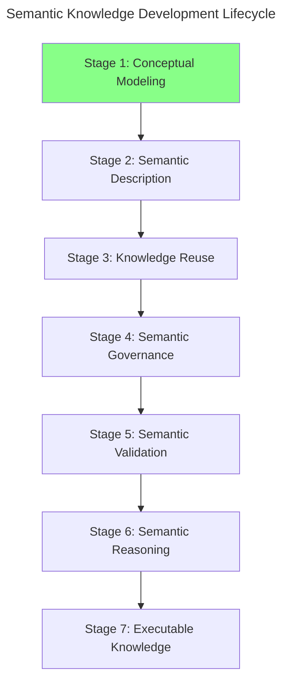

The objective of this stage is straightforward yet fundamental.

Rather than describing the semantic characteristics of concepts or performing automated reasoning, **Conceptual Modeling** establishes the conceptual vocabulary of the domain by identifying its principal concepts and organizing them into meaningful abstraction hierarchies.

The deliverable produced during this stage is therefore not logical inference or executable intelligence, but a **semantic taxonomy** that provides the structural backbone of the ontology.

Within the EKA framework, this stage primarily establishes the conceptual foundation of the **$K$ - Knowledge Graph** by defining the concepts that later stages will progressively enrich with semantic meaning.

## 16.4 Exercise 14 -- Creating the First Conceptual Hierarchy

Having established the engineering motivation for Conceptual Modeling, we now turn to its practical implementation through **Exercise 14** in Michael DeBellis' *Protégé 5 New OWL `Pizza` Tutorial*.

This exercise represents the first hands-on activity of **Stage 1 - Conceptual Modeling** within the Semantic Knowledge Development Lifecycle (SKDL).

Unlike the previous exercises, which introduced individual OWL language constructs and semantic modeling principles, Exercise 14 focuses on building the first meaningful conceptual hierarchy of the `Pizza` ontology.

The practical modeling task is intentionally modest. Rather than constructing an extensive taxonomy containing numerous pizza varieties, the exercise introduces only two new classes:

- **NamedPizza**
- **MargheritaPizza**

At first glance, this may appear surprisingly simple. However, this simplicity is intentional and reflects a sound ontology engineering methodology.

Instead of overwhelming you with a large number of concepts, the tutorial introduces only the minimum semantic structure required to demonstrate the principles of abstraction and specialization. Once these principles have been mastered, the ontology will gradually expand throughout the subsequent exercises.

The resulting hierarchy is shown conceptually below:

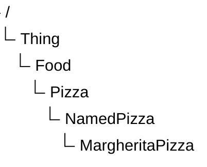

Although only a single concrete pizza has been introduced, this hierarchy already illustrates one of the most fundamental principles of ontology engineering.

Rather than treating every pizza as a direct specialization of `Pizza`, the ontology now introduces multiple levels of semantic abstraction.

**`NamedPizza`** represents an abstract semantic category rather than an individual pizza variety. It establishes a reusable conceptual container intended to accommodate many named pizzas that will be introduced later in the tutorial. In contrast, **`MargheritaPizza`** represents the first concrete domain concept belonging to that category.

This design provides a clear separation between general concepts and increasingly specialized domain concepts.

### 16.4.1 `Pizza` -- The General Concept

The class `Pizza` represents the most generic semantic concepts of a pizza within the ontology.

At this level, the ontology intentionally captures only those semantic characteristics that are common to every pizza, leaving specialized characteristics to be introduced by subclass.

By maintaining this high level of abstraction, future subclasses can inherit these common semantics without unnecessary duplication.

This approach follows one of the central principles of ontology engineering:

> **Common knowledge should be modeled once and inherited wherever possible.**

This principle is widely recognized across many engineering disciplines.

Software engineers avoid duplicating code through inheritance and abstraction.

Database designers normalize schemas to eliminate redundant information.

Ontology engineers apply exactly the same philosophy by organizing concepts into semantic hierarchies, allowing common knowledge to be defined once and inherited consistently by more specialized concepts.

### 16.4.2 `NamedPizza` -- Introducing an Intermediate Abstraction

Many beginners initially question why the tutorial introduces `NamedPizza` rather than placing `MargheritaPizza` directly beneath `Pizza`.

The answer lies in the importance of **abstraction**.

Rather than representing a single pizza variety, `NamedPizza` represents an **abstraction** that groups pizzas identified by their recognized names. At this stage of the tutorial, only `MargheritaPizza` belongs to this category. However, the abstraction has been intentionally introduced in anticipation of future semantic expansion.

Introducing this intermediate concept provides several engineering advantages.

1. It groups all commercially recognized ("Named") pizzas into a coherent semantic category.
2. It prevents the `Pizza` hierarchy from becoming unnecessarily crowded as additional pizza varieties are introduced.
3. It creates a reusable abstraction upon which future semantic definitions can be consistently applied.

As ontologies continue to evolve, intermediate abstractions such as `NamedPizza` become increasingly valuable because they **reduce redundancy** while **improving maintainability**.

### 16.4.3 `MargheritaPizza` -- The First Concrete Domain Concept

The class `MargheritaPizza` represents the first concrete pizza type introduced within the ontology.

Unlike `NamedPizza`, which functions primarily as an organizational abstraction, `MargheritaPizza` corresponds to a specific pizza variety that people recognize in everyday life.

Every instance of `MargheritaPizza` is, by definition, also an instance of `NamedPizza`, while every instance of `NamedPizza` is also a `Pizza`. Knowledge therefore flows naturally through the hierarchy via inheritance of semantic meaning.

Importantly, at this stage `MargheritaPizza` possesses only its conceptual identity.

It does not yet specify:

- which toppings it contains;
- which ingredients distinguish it from other pizzas; or
- which logical restrictions formally define it.

For this reason, `MargheritaPizza` serves as the first **instantiable semantic concept** within the `Pizza` ontology, providing a concrete example that can progressively acquire richer semantic descriptions throughout the remaining stages of the Semantic Knowledge Development Lifecycle.

For now, the objective is considerably simpler:

> **Identify the concept before describing its meaning.**

### 16.4.4 An Engineering Perspective

Separating **conceptual identification** and **semantic definition** is a hallmark of professional ontology engineering. Rather than attempting to model every aspect of a concept simultaneously, ontology engineers first establish *what* the concept is before specifying *how* it should be interpreted by machines.

Exercise 14 therefore illustrates an important distinction between learning an ontology editor and learning ontology engineering.

From the perspective of Protégé, you simply create two new classes and establish a subclass relationship.

From the perspective of ontology engineering, however, you have established the first conceptual taxonomy that will organize every semantic definition introduced throughout the remainder of the ontology.

The modeling activity may be small, but its architectural significance is substantial.

Rather than expanding through isolated concepts, the ontology now begins evolving as an organized conceptual system.

Each newly introduced concept becomes part of a coherent semantic hierarchy that can subsequently support semantic description, knowledge reuse, governance, validation, automated reasoning, and ultimately executable knowledge.

- It allows the conceptual model to stabilize before additional semantic complexity is introduced.
- It reduces modeling errors by separating structural design from logical specification.
- It encourages reuse of conceptual abstractions as the ontology grows.
- It produces an ontology that is easier to maintain, validate, and evolve over time.

Consequently, Exercise 14 should not be viewed merely as an exercise in creating subclasses within Protégé. Instead, it represents the first engineering milestone in transforming an OWL vocabulary into a structured semantic knowledge model.

From the perspective of the Semantic Knowledge Development Lifecycle, the deliverables produced by this exercise can be summarized as follows.

| Engineering Perspective | Contribution of Exercise 14 |
| --- | --- |
| **SKDL Stage** | Stage 1 -- Conceptual Modeling |
| **Primary Objective** | Establish the initial conceptual hierarchy of the `Pizza` domain. |
| **Modeling Activity** | Create `NamedPizza` and its first concrete subclass, `MargheritaPizza`. |
| **Engineering Outcome** | Define the first semantic taxonomy that will support future semantic enrichment. |
| **Preparation for Later Chapters** | Provides the conceptual foundation upon which semantic descriptions, reusable modeling patterns, governance, validation, reasoning, and executable knowledge will progressively be developed. |

Although Exercise 14 contains only a single concrete concept, it establishes the conceptual framework upon which the remainder of the `Pizza` ontology will evolve. Every subsequent named pizza introduced throughout the tutorial will become a specialization of the abstraction established in this chapter, demonstrating how carefully designed conceptual hierarchies enable semantic knowledge systems to evolve incrementally while remaining **coherent, maintainable, and reusable**.

## 16.5 Why Conceptual Modeling Comes Before Semantic Modeling

A common misconception among newcomers to ontology engineering is that the primary purpose of an ontology is to define logical rules, restrictions, and inference mechanisms.

Although these capabilities are important, they represent later stages of semantic knowledge development.

Before an ontology can express formal meaning, it must first establish a stable conceptual foundation.

In other words:

> **An ontology cannot formally describe concepts that have not yet been conceptually identified.**

This principle is the reason why the Semantic Knowledge Development Lifecycle begins with **Stage 1 -- Conceptual Modeling**.

Conceptual Modeling establishes the vocabulary of the knowledge domain by answering:

> **What concepts exist?**

Semantic Modeling, introduced in the next stage of SKDL, builds upon this foundation by answering:

> **What do these concepts mean?**

These two activities are closely related, but they serve different engineering purposes.

### 16.5.1 Concept Identification Before Semantic Definition

Consider the `Pizza` ontology developed throughout this tutorial.

After Exercise 14, the ontology contains the following conceptual structure:

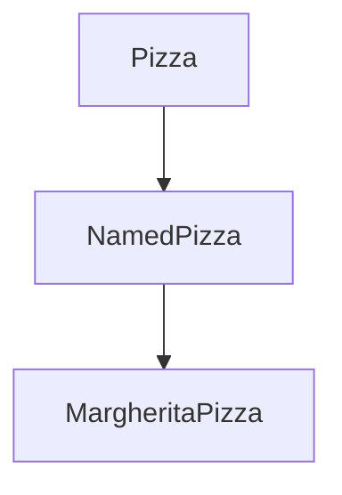

At this stage, the ontology understands that:
- `MargheritaPizza` is a type of `NamedPizza`.
- `NamedPizza` is a type of `Pizza`.

However, the ontology does not yet understand **why** a `MargheritaPizza` is different from other pizzas.

It does not yet know:
- which toppings characterize a Margherita pizza;
- which ingredients are required;
- which ingredients are prohibited;
- how it differs logically from other pizza concepts.

These questions belong to **Semantic Description**, not Conceptual Modeling.

The conceptual identity must exist before its semantic definition can be expressed.

This separation creates a disciplined progression:

| SKDL Stage | Fundamental Question | Example |
| --- | --- | --- |
| **Stage 1 -- Conceptual Modeling** | What concepts exist? | `MargheritaPizza` is a type of pizza. |
| **Stage 2 -- Semantic Description** | What defines these concepts? | A Margherita pizza has tomato, mozzarella, and basil. |
| **Stage 3 -- Knowledge Reuse** | How can existing knowledge be reused? | Reuse existing pizza toppings and ingredient concepts. |
| **Stage 4 -- Semantic Governance** | How do we maintain semantic quality? | Ensure naming, consistency, and modeling standards. |
| **Stage 5 -- Semantic Validation** | Is the ontology logically correct? | Detect inconsistent concepts. |
| **Stage 6 -- Semantic Reasoning** | What new knowledge can be inferred? | Derive classifications automatically. |
| **Stage 7 -- Executable Knowledge** | How can knowledge drive actions? | Trigger intelligent decisions or automation. |

The lifecycle therefore moves progressively from **concept existence** toward **machine-understandable meaning and execution**.

### 16.5.2 The Engineering Pattern Across Disciplines

The separation between Conceptual Modeling and Semantic Modeling is not unique to ontology engineering.

It reflects a fundamental engineering pattern shared by many disciplines.

Although the terminology differs, the underlying engineering principle remains remarkably consistent.

Every discipline begins by identifying **what exists** before attempting to describe **how it behaves.**

Ontology engineering follows exactly the same progression.

| Discipline | Conceptual Question | Semantic / Implementation Question | Initial Modeling Activity |
| --- | --- | --- | --- |
| Software Engineering | What objects exist? | How do objects behave? | Class Modeling |
| Database Design | What entities exist? | What constraints govern the data? | Entity-Relationship Modeling |
| Business Architecture | What business capabilities exist? | How do capabilities describe the business? | Capability Mapping |
| Enterprise Architecture | What architectural elements exist? | How do they interact and operate? | Architecture Modeling |
| Ontology Engineering | What concepts exist? | What logical meaning defines them? | Conceptual Modeling |

In each case, engineers first establish the **structure of the domain** before defining the detailed behavior, constraints, or semantics.

For example:

A software architect does not begin by writing complex algorithms before identifying the classes and responsibilities within the system.

A database architect does not begin by creating constraints before determining the entities that the database must represent.

A business architect does not begin by modeling detailed capability relationships before first identifying the business capabilities themselves.

An enterprise architect does not begin by analyzing operational processes before understanding the capabilities and architectural elements of the enterprise.

Ontology engineering follows the same principle.

### 16.5.3 Why Modeling Semantics Too Early Creates Problems

Attempting to introduce semantic definitions before establishing a conceptual hierarchy often leads to several common problems.

**1. Ambiguous Concepts**

Without clear conceptual boundaries, the same term may represent different meanings.

For example, if an ontology immediately defines "`Pizza`" through detailed restrictions without first identifying subclasses, it becomes difficult to determine which characteristics belong to all pizzas and which belong only to specific pizza types.

**2. Duplicate Knowledge**

Without abstraction, common semantic definitions are repeatedly recreated.

For example, if every pizza variety independently defines its base, toppings, and ingredients, the ontology becomes difficult to maintain.

A conceptual hierarchy allows common knowledge to be defined once and inherited by specialized concepts.

**3. Difficult Evolution**

Domains continuously evolve.

New concepts will inevitably appear as knowledge grows.

A well-designed conceptual taxonomy provides stable extension points where new concepts can naturally be introduced without restructuring existing semantic definitions.

**4. Reduced Reasoning Quality**

Automated reasoning depends on well-structured concepts.

Reasoners can infer new knowledge only when concepts, relationships, and constraints are represented consistently.

A weak conceptual foundation limits the effectiveness of later reasoning capabilities.

### 16.5.4 Conceptual Modeling as the Foundation of EKA Knowledge

From the perspective of **Executable Knowledge Architecture (EKA)** framework, Conceptual Modeling establishes the initial foundation of the **$K$ - Knowledge Graph** layer.

Conceptual Modeling answers only one fundamental questions:

> **What concepts exist within the knowledge domain?**

At this stage, the ontology provides:

- a shared vocabulary of domain concepts;
- a structured hierarchy of knowledge categories;
- a foundation for future semantic enrichment.

However, the knowledge graph is not yet fully executable.

Later stages of the Semantic Knowledge Development Lifecycle answer progressively model sophisticated questions.

For example:

- How are concepts semantically related?
- Which logical constraints govern them?
- Which facts can be inferred automatically?
- How should semantic quality be validated?
- How can semantic knowledge drive enterprise execution?

The remaining EKA components depend on future stages of semantic development:

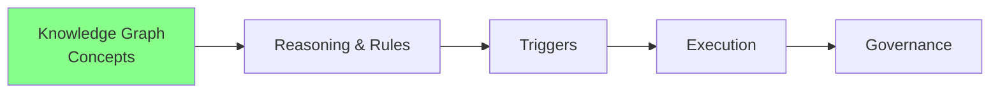

Without the conceptual foundation established by Stage 1, later components cannot reliably operate.

- Reasoning requires concepts to reason about.
- Triggers require meaningful semantic events.
- Execution requires knowledge that can be interpreted correctly.
- Governance requires stable semantic structures that can be maintained over time.

Therefore:

> **Conceptual Modeling is the starting point where knowledge becomes structured, but not yet executable.**

### 16.5.5 From Structure to Meaning

Exercise 14 represents a small but important milestone.

The `Pizza` ontology has moved beyond a collection of isolated OWL classes and has become an organized conceptual system.

The ontology now has a semantic vocabulary upon which future knowledge can be progressively constructed.

The engineering progression is therefore:

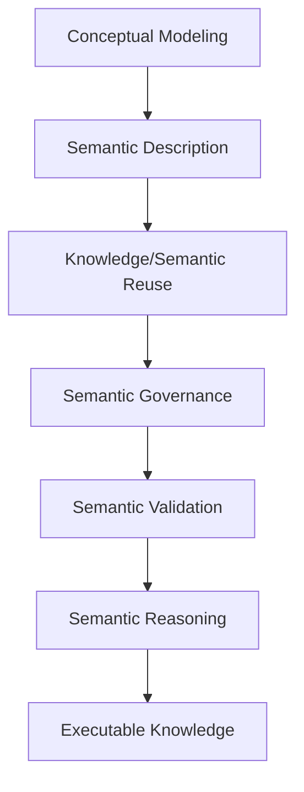

This progression reflects a fundamental principle of professional ontology engineering:

> **First establish what exists. Then define what it means. Finally determine what can be done with that knowledge.**

Chapter (16) focuses on the first step of this journey.

The next chapter begins the transition from **conceptual to meaning** by introducing formal semantic descriptions using OWL axioms and logical expressions.

## 16.6 Building a Semantic Taxonomy

Once the primary concepts within a domain have been identified, the next task is to organize them into a coherent conceptual hierarchy.

This structure is known as a **semantic taxonomy**.

A semantic taxonomy is more than a simple list of concepts. It organizes domain knowledge according to levels of **abstraction**, allowing broad concepts to be progressively refined into increasingly specialized concepts while preserving their conceptual relationships.

Within the `Pizza` ontology, Exercise 14 established the first **meaningful** taxonomy:


Although this hierarchy currently contains only a few concepts, it already illustrates the fundamental organization strategy used by virtually every ontology, regardless of its domain.

Each child concept represents a more specialized interpretation of its parent while inheriting all of the semantic meaning already established at higher levels.

Each successive level introduces additional semantic specificity.

Moving downward through the hierarchy does not create unrelated concepts.

Instead, every specialization preserves the semantic identity of its ancestors.

Consequently:

- Every `MargheritaPizza` is a `NamedPizza`.
- Every `NamedPizza` is a `Pizza`.
- Every `Pizza` is `Food`. (although we don't create this layer in our working model)
- Every `Food` is ultimately a `Thing`.

This hierarchical organization provides numerous engineering benefits.

Rather than viewing concepts as isolated definitions, ontology engineers organize them into semantic hierarchies that support inheritance, reuse, extensibility, and ultimately automated reasoning.

The taxonomy therefore becomes the conceptual backbone of the ontology.

### 16.6.1 Generalization and Specialization

A semantic taxonomy is constructed through two complementary modeling activities:

- **Generalization**, which identifies the common characteristics shared by multiple concepts and represents them through a more abstract parent concept.
- **Specialization**, which refines a general concept into increasingly specific concepts that inherit the characteristics of their ancestors while introducing additional distinctions.

These two perspectives describe the same hierarchy from opposite directions.

Moving upward through the hierarchy emphasizes **generalization**, where individual concepts are abstracted into broader categories.

Moving downward emphasizes **specialization**, where broad concepts are progressively refined into more specific semantic concepts.

For the `Pizza` ontology, this progression can be viewed as follows:


Viewed from the top downward, the hierarchy represents increasing specialization.

Viewed from the bottom upward, it represents increasing abstraction (generalization).

A semantic taxonomy captures the **generalization-specialization relationships** between concepts.

Professional ontology engineers constantly alternate between these two viewpoints while designing an ontology.

They ask questions such as:

- Which concepts share common characteristics?
- Should these characteristics be represented once at a higher level?
- Does a new concept represent a genuinely different type, or merely another instance of an existing concept?

The answer determine whether a new subclass should be introduced or an existing abstraction should be reused.

### 16.6.2 Designing for Semantic Growth

Once of the primary objectives of conceptual modeling is not simply to represent today's knowledge, but to accommodate tomorrow's knowledge.

Real-world domains continuously evolve.

- New products are introduced
- Business processes change.
- Scientific discoveries redefine existing concepts.
- Enterprise architectures expand as organizations grow.

Consequently, a well-designed taxonomy should remain stable even as new concepts are added.

The introduction of `NamedPizza` in Exercise 14 illustrates this principle.

Although only `MargheritaPizza` currently belongs to this category, the intermediate abstraction has been intentionally created to support future expansion.

As additional pizza varieties are introduced, the hierarchy can naturally evolve:

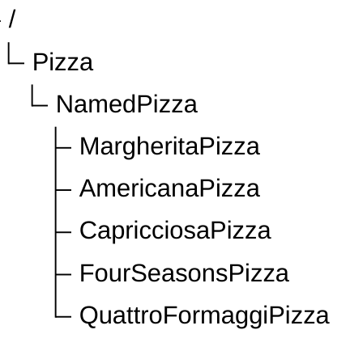

No restructuring of the ontology is required.

The conceptual model already provides a stable extension point.

This illustrates an important engineering principle:

> **Good conceptual models anticipate future knowledge rather than merely describing current knowledge.**

### 16.6.3 More Than Classification

It is tempting to think of a taxonomy as nothing more than a classification tree.

While organization is certainly one of its purposes, a semantic taxonomy serves a much broader role within ontology engineering.

A well-designed taxonomy provides several important engineering benefits:

1. First, it improves **readability** by organizing concepts into a logical and intuitive structure that is easier for both humans and machines to understand.
2. Second, it promotes **reuse** by encouraging common knowledge to be modeled once at higher levels of abstraction rather than repeatedly duplicated across multiple concepts.
3. Third, it enhances **maintainability** because changes to general concepts automatically benefits more specialized concepts throughout the hierarchy.
4. Finally, it improves **extensibility** by enabling new concepts to be incorporated without disrupting the overall conceptual organization.

These characteristics make semantic taxonomies one of the most important design artifacts produced during Conceptual Modeling.

### 16.6.4 The Conceptual Backbone of Semantic Knowledge

The taxonomy established during Stage 1 of the **Semantic Knowledge Development Lifecycle** does not yet contain detailed semantic definitions.

At this stage, the ontology simply answers the question:

> **What concepts exist within the domain, and how are they conceptually related?**

The answers to more sophisticated questions -- such as which properties characterized those concepts, which logical restrictions distinguish them, and what new knowledge can be inferred -- will be introduced during later stages of the lifecycle.

Nevertheless, every one of those future semantic capabilities depends upon the conceptual structure established here.

Without a robust and coherent conceptual hierarchy (taxonomy):

- semantic definitions become inconsistent;
- common knowledge cannot be effectively reused;
- logical restrictions become difficult to manage;
- automated reasoning becomes less reliable;
- governance becomes harder to enforce; and
- ontology evolution becomes increasingly expensive.

For this reason, ontology engineers regard a semantic taxonomy not as a preliminary modeling exercise, but as the **conceptual backbone** upon which semantic knowledge systems are progressively constructed.

By the completion of Stage 1, the ontology possesses a stable conceptual vocabulary organized into a reusable hierarchy.

The next step is to understand why this hierarchy carries formal semantic meaning rather than serving merely as a visual organization of concepts.

This transition leads naturally to the next section:

> **From Taxonomy to Semantic Inheritance**.

## 16.7 From Taxonomy to Semantic Inheritance

By the completion of **Stage 1 -- Conceptual Modeling**, the `Pizza` ontology now contains a coherent semantic taxonomy.

At first glance, this taxonomy appears to be little more than a graphical hierarchy displayed within Protégé.

Many beginners therefore assume that subclass relationships exist primarily to organize concepts visually, much like folders in a file system.

This interpretation is understandable -- but fundamentally **incorrect**.

A folder hierarchy is primarily an organizational mechanism. It helps humans navigate information but carries little semantic meaning. Moving a document from one folder to another changes its location, but not its intrinsic meaning.

A semantic taxonomy is **not** an organizational convenience.

It is **fundamentally different** since it's a **formal semantic model**.

Every subclass in an ontology represents a **logical specification** of its parent class, and the subclass relationship contributes logical meaning to the ontology and establishes how semantic knowledge is inherited throughout the conceptual hierarchy.

Understanding this distinction marks an important milestone in learning ontology engineering.

Rather than seeing the class hierarchy as a navigation tree, we begin to recognize it as one of the ontology's primary mechanisms for representing knowledge.

### 16.7.1 From Organization to Meaning

Consider the conceptual hierarchy introduced in Exercise 14:

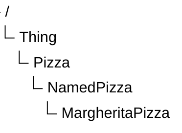

At first glance, this hierarchy resembles the directory structure of an operating system.

Many newcomers naturally interpret it as:

> "*`MargheritaPizza` is stored under `NamedPizza`.*"

However, this interpretation confuses **organization** with **semantics**.

A folder hierarchy merely groups objects together for convenience.

Moving a document from one folder to another folder changes its location, but it does not change the meaning of the document itself.

Ontology hierarchies works very differently.

Every subclass relationship changes the semantic interpretation of the concepts involved.

Instead of expressing containment, the hierarchy expresses **specialization**.

It therefore should be interpreted as:

> **Every `MargheritaPizza` is a `NamedPizza`, and every `NamedPizza` is a `Pizza`.**

This seemingly small distinction transforms the hierarchy from a visual diagram into a logical specification of the domain.

### 16.7.2 The Meaning of `SubClassOf`

OWL represents specialization through the `SubClassOf` axiom.

Unlike a folder hierarchy, the `SubClassOf` relationship expresses an **`IS-A`** relationship.

In other words:

- `MargheritaPizza` **IS A** `NamedPizza`
- `NamedPizza` **IS A** `Pizza`

rather than

- `MargheritaPizza` is stored inside `NamedPizza`.

The distinction is illustrated directly in Protégé.


The significance of this relationship extends far beyond visual organization.

Once a class is declared as a subclass of another class, it automatically inherits the semantic commitments established by its parent unless those commitments are explicitly refined or constrained in later axioms.

This mechanism is known as **semantic inheritance**.

### 16.7.3 Semantic Inheritance in Practice

The practical consequences of semantic inheritance become immediately apparent once semantic restrictions are introduced.

Suppose the ontology defines the following restriction for the class `Pizza`:

```text
Pizza
    SubClassOf
        hasBase some PizzaBase
```

This states that every pizza must have at least one pizza base:


No additional semantic restrictions have yet been defined for either `NamedPizza` or `MargheritaPizza`.

Nevertheless, Protégé already understands that both subclasses satisfy this restriction through inheritance.

The ontology therefore recognizes that:

- every `NamedPizza` has a pizza base; and
- every `MargheritaPizza` has a pizza base.

This behavior requires no additional modeling effort.

If follows automatically from the subclass hierarchy established during **Conceptual Modeling**.


These three screenshots together illustrate one of the most important principles in ontology engineering:

> **Semantic knowledge defined once can be inherited many times.**

This dramatically reduces duplication while ensuring that semantic knowledge remains consistent throughout the ontology.

### 16.7.4 Semantic Inheritance Is Not Software Inheritance

Readers familiar with object-oriented programming often compare ontology subclasses with software class inheritance.

Although the terminology is similar, their purposes are fundamentally different.

In object-oriented programming, subclasses primarily inherit implementation details, executable methods, and software behavior.

The goal is **code reuse**.

Ontology engineering has a different objective.

Ontology subclasses inherit **logical meaning**.

The goal is **semantic consistency** rather than software implementation.

An ontology class does not contain executable code.

Instead, it represents:

> a formal description of a concept within the domain.

Consequently, semantic inheritance propagates knowledge rather than program behavior.

This distinction explains why ontology reasoners can derive new knowledge from subclass hierarchies even though the ontology contains no executable algorithms.

### 16.7.5 Why Semantic Inheritance Matters

Semantic inheritance is one of the key reasons why ontologies scale effectively.

Without inheritance, every specialized concept would need to redefine the characteristics already shared with its parent concepts.

As an ontology grows, this quickly leads to
- duplicated knowledge,
- inconsistent semantics, and
- increasingly difficult maintenance.

By contrast, a well-designed semantic taxonomy allows common knowledge to be modeled once and automatically reused throughout the hierarchy.

As additional pizza varieties are introduced in later chapters, they will inherit existing semantic knowledge while contributing only the characteristics that distinguish them from other pizzas.

This approach keeps the ontology both concise and extensible.

More importantly, it establishes the foundation upon which automated reasoning will operate in later stages of the **Semantic Knowledge Development Lifecycle**.

### 16.7.6 From Conceptual Hierarchies to Logical Reasoning

Semantic inheritance represents the bridge between **Conceptual Modeling** and **Semantic Reasoning**.

At the current stage of the lifecycle, the taxonomy has organized the conceptual vocabulary of the domain.

As future chapters introduce logical restrictions, equivalence axioms, and reasoning rules, those semantic will naturally propagate throughout the hierarchy via inheritance.

In this sense, the taxonomy established during Stage 1 is already an active component of the ontology's semantic architecture.

It is not simply a diagram used for navigation.

> It is the mechanism through which semantic knowledge becomes **reusable, maintainable, and machine-processable**.

This naturally raises a deeper question:

> *Why can ontology reasoners rely on subclass hierarchies with such confidence?*

The answer lies not merely in OWL itself, but in the mathematical foundations upon which OWL is built.

The next section explores those foundations by examining semantic taxonomies through the lens of **set theory** and **partially ordered sets**.

## 16.8 Interesting Reading -- Mathematical Foundations of Semantic Taxonomy

One of the distinguishing characteristics of ontology engineering is that its conceptual structure are not based solely on intuition or visual organization.

Behind every subclass relationship lies a rigorous mathematical foundation that enables ontology reasoners to derive knowledge **consistently** and **predictably**.

Unlike many modeling techniques, OWL is grounded in formal logic and set theory. Consequently, the semantic taxonomy constructed during **Conceptual Modeling** is more than an engineering artifact -- it is also a mathematical structure.

Understanding these mathematical foundations is not required to build simple ontologies, but it provides valuable insight into **why automated reasoning works** and **why semantic inheritance can be trusted**.

### 16.8.1 Classes as Sets

From the perspective of *set theory*, every OWL class may be interpreted as a **set** whose members are the individuals belonging to that class.

Suppose we define the following sets for the `Pizza` ontology:

$P = \{\text{all pizzas}\}$

$N = \{\text{all named pizzas}\}$

$M = \{\text{all Margherita pizzas}\}$

Exercise 14 establishes the following conceptual hierarchy:

```text
Pizza
    NamedPizza
        MargheritaPizza
```

Mathematically, this hierarchy corresponds directly to the subset relationships:

$M \subseteq N \subseteq P$

This expression states that every member of the set $M$ also belongs to (a member of) $N$, and every member of $N$ also belongs to $P$.

> Note: $M$, $N$ and $P$ may denote exactly the same set of individuals. In OWL, this situation is modeled using `EquivalentClasses` rather than `SubClassOf`, although mathematically the corresponding sets are equal.

In ontology terminology (OWL), these same relationships are expressed using the `SubClassOf` axiom:

```text
MargheritaPizza SubClassOf NamedPizza
NamedPizza SubClassOf Pizza
```

Although one notation is mathematical and the other is ontological, they express exactly the same conceptual relationship.

### 16.8.2 Why Inheritance Happens Automatically

The mathematical interpretation immediately explains the semantic inheritance discussed in the previous section.

If: $M \subseteq N$

and: $N \subseteq P$

then it follows logically that: $M \subseteq P$

without introducing any additional axioms.

Using `Pizza` ontology's Exercise 14 case:

> If every Margherita pizza belongs to the set of Named pizzas, and every Named pizza belongs to the set of pizzas, then it follows logically that Margherita pizza belongs to the set of pizzas without requiring an additional axiom.

This conclusion follows directly from the **transitivity of subset inclusion**, one of the fundamental properties of set theory.

Consequently, semantic inheritance is not a special feature invented by Protégé.

Rather, Protégé and OWL reasoners apply well-established mathematical principles to semantic knowledge.

The ontology therefore inherits semantic restrictions because the underlying mathematics guarantees that the subclass relationships remain logical consistent.

### 16.8.3 A Taxonomy as a *Partially Ordered Set*

The mathematical structure of a semantic taxonomy extends beyond simple subset relationships.

The collection of OWL classes connected through `SubClassOf` relationships form what mathematicians call a **partially ordered set**, or **poset**.

A partial order satisfies three important properties:

| Property | Mathematical Expression |
| --- | --- |
| Reflexivity | Every class is a subclass of itself: $A \subseteq A$ |
| Anti-symmetry | If $A \subseteq B$ and $B \subseteq A$, then $A=B$* |
| Transitivity | If $A \subseteq B$ and $B \subseteq C$, then $A \subseteq C$ |

*: the two classes represents the same set of individuals.

These mathematical properties guarantee that semantic hierarchies remain logically consistent as they expand.

From this perspective, OWL does not invent a new hierarchy mechanism. Instead, it formalizes centuries of mathematical reasoning about sets, inclusion, and logical specification into a machine-understandable and machine-processable representation (meaning).

For ontology engineers, the most important of these is **transitivity**, because it enables semantic knowledge to propagate automatically through the hierarchy.

### 16.8.4 Why Ontology Engineers Should Care

Fortunately, ontology engineers do not need to perform mathematical proofs while building ontologies.

**Reasoners** perform this work automatically.

Nevertheless, understanding the mathematical foundations of semantic taxonomies provides several important insights.

1. First, it explains why subclass relationships are more than graphical connections.
2. Second, it demonstrates why semantic inheritance is logically sound rather than an implementation convenience.
3. Third, it reveals why ontology reasoners can infer new knowledge with mathematical rigor instead of relying on heuristic algorithms.

This mathematical foundation is one of the reasons why ontologies have become an important technology for knowledge representation, scientific data integration, enterprise architecture, and artificial intelligence.

### 16.8.5 Transition

The mathematical perspective explains **why semantic inheritance is logically valid.**

Interestingly, long before formal logic and computer science existed, humans had already developed remarkably sophisticated hierarchical classification systems.

The next section explores perhaps the most influential example -- **biological taxonomy**, whose principles continue to inspire modern ontology engineering.


## 16.9 Engineering Perspective -- Modeling Before Meaning

Exercise 14 deliberately postpones one question that many beginners naturally ask:

> **Why doesn't the tutorial define the toppings of a `MargheritaPizza` immediately?**

After all, once the class has been created, wouldn't it be more efficient to immediately specify its ingredients, logical restrictions, equivalent classes, and reasoning rules?

Surprisingly, the answer is **no**, and this answer lies in the engineering discipline of *incremental semantic modeling*.

Professional ontology engineering deliberately resists this temptation.

Instead of attempting to describe every aspect of a concept simultaneously, ontology engineers follow a disciplined engineering methodology that separate **conceptual organization** from **semantic specification**.

This approach may initially appear slower, but it consistently produces ontologies that are more understandable, maintainable, extensible, and reusable.

The underlying principle can be summarized as follows:

> **Model the concepts first. Describe their meaning afterwards.**

This philosophy is one of the defining characteristics of the **Semantic Knowledge Development Lifecycle (SKDL)** and distinguishes professional ontology engineering from ad hoc ontology construction.

### 16.9.1 Separating Conceptual Structure from Semantic Meaning

One of the fundamental principles of engineering is the **separation of concerns**.

Complex systems become easier to understand and maintain when different responsibilities are addressed independently rather than simultaneously.

Ontology engineering follows exactly this principle.

During **Conceptual Modeling**, the objective is intentionally limited.

Ontology engineers identify the concepts that exist within the domain and organize them into a coherent semantic taxonomy.

At this stage, they deliberately avoid introducing unnecessary semantic complexity.

Questions such as:

- Which toppings define a Margherita pizza?
- Which pizzas are vegetarian?
- Which logical restrictions distinguish one pizza from another?
- Which classes should be inferred automatically?

are intentionally postponed.

Instead, **Stage 1** ask only one question:

> **What concepts exist within the domain, and how are they related through abstraction and specialization?**

Only after this conceptual foundation has stabilized do later stages progressively enrich the ontology with formal semantic definitions.

This separation allows the conceptual structure to evolve independently of the semantic rules that will later operate upon it.

### 16.9.2 Exercise 14 as an Engineering Case Study

Exercise 14 provides an excellent example of this methodology.

The entire exercise introduces only two new classes:

- `NamedPizza`
- `MargheritaPizza`

No toppings are specified.

No equivalent classes are created.

No necessary and sufficient conditions are defined.

No reasoning rules are introduced.

From the perspective of someone learning Protégé, this may seem like a surprisingly small amount of work.

From the perspective of ontology engineering, however, something much more significant has been accomplished.

The ontology now possesses its first **meaningful conceptual taxonomy**.

Rather than expanding through isolated classes, the ontology has begun evolving as a structured conceptual system.

Every future named pizza introduced throughout the tutorial will naturally become part of this hierarchy.

As the ontology grows, semantic descriptions, logical restrictions, and reasoning rules can all be attached to concepts that already occupy a well-defined place within the conceptual model.

This incremental approach greatly simplifies both **ontology development** and **long-term maintenance**.

### 16.9.3 Engineering Before Implementation

This staged methodology -- SKDL -- is by no means unique to ontology engineering.

It reflects a broader engineering practice adopted across many disciplines.

When architects design a building, they first create the structural blueprint before specifying electrical wiring, plumbing, or interior decoration.

Software application architects design class structures before implementing algorithms.

Database designers identify entities before defining integrity constraints, indexes, and optimization strategies.

Enterprise architects establish capability maps before modeling application interactions or technology deployments.

Although these disciplines employ different modeling languages and engineering practices, they all follow the same underlying methodology:

> **Stabilize the structure before increasing the complexity.**

Ontology engineering applies exactly the same discipline.

Rather than:

> constructing semantic knowledge in a single step,

professional ontology engineers:

> progressively refine the ontology through successive stages of increasing semantic sophistication.

### 16.9.4 The Role of the Semantic Knowledge Development Lifecycle

The **Semantic Knowledge Development Lifecycle (SKDL)** formalizes this incremental engineering process.

Instead of viewing ontology development as a collection of unrelated modeling activities, SKDL organizes development into seven complementary stages.

1. **Conceptual Modeling** identifies the concepts and establishes conceptual.
2. **Semantic Description** defines the meaning of those concepts.
3. **Knowledge Reuse** promotes semantic consistency and extensibility.
4. **Semantic Governance** establishes quality standards and modeling policies.
5. **Semantic Validation** verifies semantic correctness.
6. **Semantic Reasoning** derives new knowledge through logical inference.
7. **Executable Knowledge** enables semantic knowledge to drive intelligent systems and enterprise execution.

Each stage builds directly upon the work completed during the previous stage.

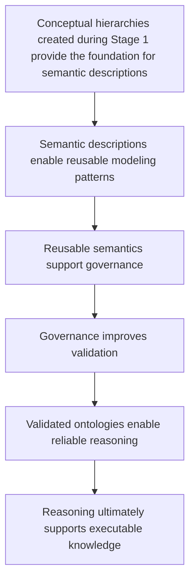

Rather than representing isolated modeling activities, these stages collectively describe the gradual maturation of semantic knowledge.

### 16.9.5 Why Incremental Modeling Matters

Attempting to model every semantic detail at the beginning of an ontology project often creates unnecessary complexity.

Concepts that have not yet stabilized may require repeated redesign.

Semantic definitions become tightly coupled to evolving conceptual structure.

Common knowledge is frequently duplicated because appropriate abstractions have not yet been identified.

As the ontology grows, these problems become increasingly difficult to correct.

**Incremental semantic modeling** avoids these issues, and prevents ontologies from becoming overly complex during the early phases of development.

By establishing a stable conceptual hierarchy first, ontology engineers create a framework that supports continuous refinement without disrupting the overall architecture.

New concepts can be introduced naturally.

Shared semantic can be inherited rather than duplicated.

Reasoning rules can operate over a consistent conceptual vocabulary.

Maintenance becomes significantly simpler because structural changes and semantic changes remain largely independent.

This disciplined progression enables ontologies to evolve over time while preserving semantic consistency.

### 16.9.6 Engineering Perspective

Viewed from an engineering perspective, Exercise 14 represents far more than the creation of two subclasses in Protégé.

It demonstrates a professional methodology for developing **semantic knowledge systems**.

Rather than attempting to model every aspect of the domain immediately, ontology engineers first establish a stable conceptual vocabulary.

That vocabulary is then progressively enriched with
- semantic definitions,
- reusable modeling patterns,
- governance mechanisms,
- validation strategies,
- reasoning capabilities, and
- ultimately executable knowledge.

This incremental refinement transforms ontology development from a collection of isolated editing activities into a disciplined engineering process.

It also explains why mature ontologies remain understandable, extensible, and maintainable even as they grow to contain thousands -- or even millions -- of concepts and relationships.

The conceptual taxonomy established during **Stage 1 -- Conceptual Modeling** therefore represents much more than the beginning of the ontology.

It provides the architectural foundation upon which every subsequent semantic capability depends.

### 16.9.7 Transition to the Next Perspective

The engineering methodology described in this section demonstrates how ontology engineers organize the development of semantic knowledge.

Interestingly, the underlying idea of organizing concepts into progressively more specialized hierarchies is far older than computer science itself.

Centuries before the invention of ontologies, scientists were already developing hierarchical classification systems to organize the natural world.

The next section explores **biological taxonomy**, one fo history's most successful knowledge organization systems, and examines how its principles continue to influence modern ontology engineering.

## 16.10 Interesting Reading -- Two Great Classification Traditions

Throughout this chapter, we have explored **Conceptual Modeling** from multiple perspectives.

From ontology engineering, we learned how concepts are identified and organized into semantic taxonomies.

From mathematics, we examined why subclass relationships support logical inheritance.

From engineering practice, we explored why professional knowledge systems are developed incrementally.

However, the fundamental idea behind **conceptual modeling** is far older than computers and semantic technologies.

Long before ontology engineering existed, humanity had already developed sophisticated methods for organizing knowledge.

Two particularly influential classification traditions demonstrate this principle:

1. **Biological Taxonomy** -- organizing the natural world.
2. **Library Classification** -- organizing human knowledge.

Although these two traditions classify very different things, they share a common objective:

> **Transforming complexity into a structured conceptual system that humans can understand and navigate.**

These historical examples provide valuable insight into why conceptual modeling remains one of the most fundamental activities in knowledge engineering.

### 16.10.1 Biological Taxonomy: Nature's Original Ontology

Long before the emergence of computer science, artificial intelligence, and semantic technologies, **biologists** faced a challenge remarkably similar to that encountered by **ontology engineers** today:

> **How can an enormous collection of entities be organized into a coherent, reusable, and universally understandable knowledge system?**

The answer became one of the most influential classification systems in scientific history:

> **biological taxonomy.**

Biological taxonomy represents one of humanity's earliest examples of systematic conceptual modeling.

Rather than treating every living organism as an isolated entity, scientists organized life into hierarchical categories based on shared characteristics and increasing levels of specialization.

This approach created a structured representation of biological knowledge that continues to support scientific discovery today.

#### 16.10.1.1 Linnaean Classification System

In the eighteenth century, the Swedish naturalist **Carl Linnaeus** introduced a hierarchical classification framework that became the foundation of modern biological taxonomy.

Living organisms are classified into progressively more specialized categories:

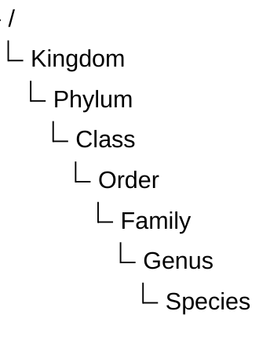

Each level represents a different degree of abstraction.

- Higher levels describe broad conceptual categories containing many organisms
- Lower levels describe increasingly specific concepts.

For example, the `domestic cat` is classified as:

| Classification Level (Rank) | Classification |
| --- | --- |
| Kingdom | $Animalia$ |
| Phylum | $Chordata$ |
| Class | $Mammalia$ |
| Order | $Carnivora$ |
| Family | $Felidae$ |
| Genus | $Felis$ |
| Species | $\textit{Felis catus}$ |

Each successive level introduces greater specialization while preserving characteristics inherited from broader categories.

A domestic cat is not simply placed below the category "Mammalia".

The relationship has semantic meaning:

> Every *Felis catus*  is a *Mammalia*, and every *Mammalia* is an *Animalia*.

This is conceptually identical to the meaning of an ontology subclass relationship:

```text
Felis catus SubClassOf Felis
Felis SubClassOf Felidae
Felidae SubClassOf Mammalia
```

The hierarchy therefore represents more than classification.

It represents **inherited knowledge**.

#### 16.10.1.2 Biological Taxonomy and the `Pizza` Ontology

The relationship between biological classification and ontology engineering becomes especially clear when comparing their structure.

Biological taxonomy:

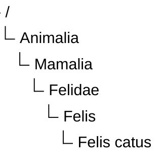

`Pizza` ontology:


Both structures follow the same conceptual principle:

| Conceptual Principle | Biological Taxonomy | `Pizza` Ontology |
| --- | --- | --- |
| General concept | Animalia | `Pizza` |
| Intermediate abstraction | Mammalia | `NamedPizza` |
| Specific concept | Felis catus | `MargheritaPizza` |
| Relationship | Type of organism | Type of concept |
| Inherited meaning | Biological characteristics | Semantic axioms |

The similarity is not accidental.

Both systems solve the same fundamental knowledge organization problem:

> **How can general knowledge be defined once and inherited by more specific concepts?**

This is exactly the purpose of semantic inheritance in ontology engineering.

#### 16.10.1.3 From Classification to Ontology Engineering

Although biological taxonomy strongly resembles ontology engineering, modern ontologies extend beyond traditional classification.

Biological taxonomy primarily answers:

> **How should living organisms be categorized?**

Ontology engineering addresses a broader question:

> **What concepts exist, how are they related, and what knowledge can be logically derived from those relationships?**

Modern ontologies add capabilities that traditional taxonomy does not provide, including:

- formal semantic relationships;
- logical restrictions;
- equivalence definitions;
- domain and range constraints; and
- automated reasoning.

Therefore, ontology engineering can be viewed as an evolution of classical taxonomy.

It preserves the hierarchical organization developed by centuries of scientific classification while adding formal semantics that enable **machines** to interpret, validate, and reason over knowledge.

Within the **Executable Knowledge Architecture (EKA)** framework, biological taxonomy provides an intuitive analogy for the first stage of knowledge construction.

Before knowledge can be executed, it must first be organized.

Before reasoning can occur, concepts must first exist.

Before intelligent automation can operate, semantic structures must first be established.

This is why **Conceptual Modeling** establishes the foundation of the **$K$ - Knowledge Graph** layer.

### 16.10.2 Library Classification: Organizing Human Knowledge

Biological taxonomy demonstrates how humans organize the natural world.

However, humanity has also faced another equally challenging classification problem:

> **How can the enormous amount of human knowledge itself be organized, stored, and retrieved?**

Libraries represent one of the oldest and most successful examples of knowledge organization systems.

Unlike biological taxonomy, which attempts to discover relationships that exist in nature, library classification systems are intentionally designed by humans to organize intellectual concepts.

Their purpose is not to describe physical entities, but to create a navigable structure for human knowledge.

#### 16.10.2.1 Dewey Decimal Classification

One of the most widely recognized library classification systems is the **Dewey Decimal Classification (DDC)** system.

Developed by Melvil Dewey in 1876, DDC organizes human knowledge into ten major categories:

| Range | Knowledge Domain |
| --- | --- |
| 000 | Computer Science, Information & General Works |
| 100 | Philosophy & Psychology |
| 200 | Religion |
| 300 | Social Sciences |
| 400 | Language |
| 500 | Science |
| 600 | Technology |
| 700 | Arts & Recreation |
| 800 | Literature |
| 900 | History & Geography |

Each broad category is progressively refined into more specific concepts.

For example:

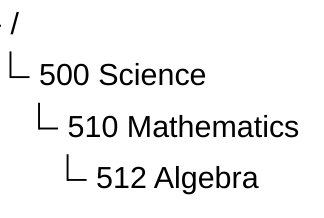

The structure allows people to navigate from broad conceptual domains toward increasingly specialized knowledge areas.

#### 16.10.2.2 Library of Congress Classification

Another major classification system is the **Library of Congress Classification (LCC)** system.

Unlike DDC's numerical structure, LCC uses alphabetic categories.

It organizes knowledge into 21 major classes, represented primarily by letters:

| Class | Domain |
| --- | --- |
| A | General Works |
| B | Philosophy, Psychology, Religion |
| C | Auxiliary Sciences of History |
| D | World History |
| Q | Science |
| QA | Mathematics and Computer Science |
| T | Technology |

For example:

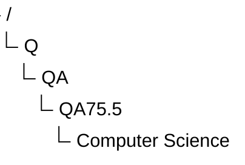

Similar to biological taxonomy and ontology hierarchies, LCC moves from broader conceptual categories toward increasingly specific concepts.

#### 16.10.2.3 Library Classification and Ontology Engineering

Library classification provides another important perspective on conceptual modeling.

Although a library classification systems is not an ontology in the formal OWL sense, it demonstrates many principles shared with ontology engineering:

- identifying concepts;
- organizing concepts hierarchically;
- creating meaningful abstraction levels;
- enabling navigation and discovery.

The key difference is the basis of classification.

| Dimension | Biological Taxonomy | Library Classification |
| --- | --- | --- |
| Classification Object | Living organisms | Human Knowledge |
| Classification Basis | natural characteristics and evolutionary relationships | Intellectual domains and human design |
| Primary Purpose | Scientific understanding | Knowledge organization and retrieval |
| Hierarchy Example | Species $\rightarrow$ Genus $\rightarrow$ Family | Topic $\rightarrow$ Subject Area $\rightarrow$ Domain |
| Ontology Connection | Inspires inheritance and specialization | Inspires conceptual organization |

Biological taxonomy discovers patterns in the natural world.

Library classification creates structures to help humans navigate the conceptual world.

Both, however, demonstrate the same fundamental idea:

> **Complex knowledge becomes manageable when organized through meaningful concepts and relationships.**

### 16.10.3 What Both Traditions Teach Ontology Engineers

Biological taxonomy and library classification represent two great traditions of human knowledge organization.

One emerged from the natural sciences, and organizes **entities that exist in nature**.

The other emerged from librarianship and information science, and organizes **knowledge created by humanity**.

Despite their differences, both demonstrate a universal principle:

> **Conceptual modeling is a fundamental strategy for managing complexity.**

Ontology engineering builds upon this long history by combining the strengths of both traditions.

Like biological taxonomy, ontologies use hierarchical specialization to represent concepts and inheritance.

Like library classification, ontologies organize knowledge into structures that support discovery, navigation, and reuse.

However, ontology engineering extends these traditions further by adding formal semantics and automated reasoning.

This progressive can be summarized as:

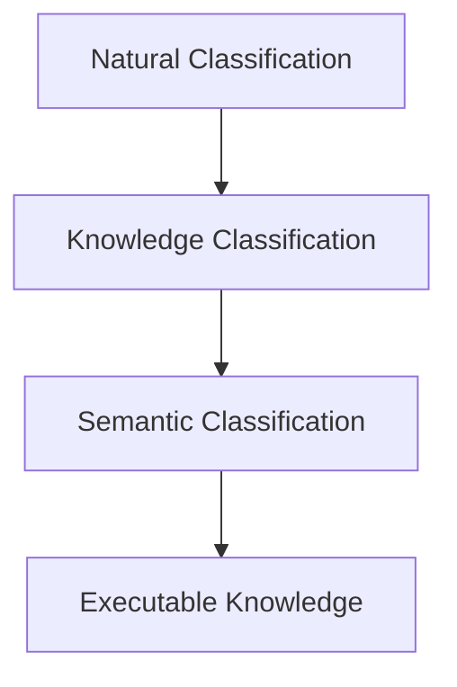

Within the **Semantic Knowledge Development Lifecycle (SKDL)**, this progression begins with **Conceptual Modeling**.

Before semantic descriptions can be written, before reasoning can derive new knowledge, and before executable intelligence can emerge, concepts must first be identified, organized, and connected through a coherent conceptual hierarchy.

The simple taxonomy created in Exercise 14 therefore represents much more than a Protégé class hierarchy.

It reflects a knowledge organization strategy that has guided scientific discovery, library science, and information management for centuries, while laying the conceptual foundation for modern ontology engineering and the Executable Knowledge Architecture (EKA).

## 16.11 EKA Perspective -- Conceptual Modeling Establishes the Knowledge Layer ($K$)

Throughout this chapter, we have focused on identifying and organizing concepts ito a coherent semantic taxonomy. Although the ontology remains relatively simple, it has already completed the first and perhaps most fundamental stage of the **Executable Knowledge Architecture (EKA)**.

As introduced in Chapter (00), EKA formalizes executable knowledge using five complementary components:

- $K$ - **Knowledge Graph layer**
- $R$ - **Reasoning & Rules layer**
- $\Theta$ - **Trigger layer**
- $\Phi$ - **Execution layer**
- $\Gamma$ - **Governance layer**

The work completed in Exercise (14) contributes primarily to the $K$ - **Knowledge Graph** layer.

At this stage, the ontology has established a shared conceptual vocabulary describing the domain. Concepts such as `Pizza`, `NamedPizza`, and `MargheritaPizza` now exist as formally defined semantic classes capable of supporting future semantic enrichment.

The relationship between this chapter and the EKA tuple can therefore be summarized as follows:

| EKA Component | Contribution of Chapter (16) |
| --- | --- |
| $K$ - **Knowledge Graph** | Establishes the conceptual vocabulary and semantic taxonomy of the `Pizza` domain through class hierarchies and subclass relationships. |
| $R$ - **Reasoning & Rules** | Not yet introduced. The taxonomy provides the structure upon which future logical axioms and inference rules will operate. |
| $\Theta$ - **Trigger** | Not involved at this stage. Semantic events require machine-understandable semantics, which will be introduced in later chapters. |
| $\Phi$ - **Execution** | No executable actions are defined. The ontology currently models knowledge rather than behavior. |
| $\Gamma$ - **Governance** | Concept naming, hierarchy organization, and abstraction represent the first steps toward semantic governance and long-term maintainability. |

This illustrates an important principle of EKA:

> **Executable intelligence cannot emerge without a well-structured knowledge foundation.**

Reasoning engines, validation rules, semantic queries, and intelligent automation all depend on the quality of the conceptual model established at the beginning of the ontology development process.

**Conceptual Modeling** therefore represents much more than simply creating class in Protégé -- it establishes the semantic vocabulary upon which the remaining EKA components will progressively be constructed.

## 16.12 Best Practice for Conceptual Modeling

Although creating subclasses is technically straightforward, designing a maintainable semantic taxonomy requires careful engineering judgment. Experienced ontology engineers devote considerable attention to conceptual modeling because errors introduced at this stage often propagate throughout the remainder of the ontology.

The following practices are widely recommended when developing semantic taxonomies.

**Think Semantically Rather Than Visually**

Protégé displays a class hierarchy as a tree, but ontology engineers should think beyond the graphical interface.

Each node represents a formal semantic concept (with IRI), not merely a visual element.

The objective is not to construct an attractive diagram but to capture the ***conceptual structure*** of domain knowledge accurately.

**Model Concepts Before Properties**

Resist the temptation to immediately define object properties or logical restrictions.

A stable conceptual hierarchy should exist before semantic relationships are introduced.

This separation of concerns simplifies both ontology development and future maintenance.

**Prefer Generalization Before Duplication**

Whenever multiple concepts share common characteristics, introduce a higher-level abstraction rather than keep duplicating semantic definitions in the same level.

For example, introducing `NamedPizza` avoids placing every pizza variety direction beneath `Pizza`, creating a more scalable conceptual organization, especially we already have some categories like `PizzaBase` and `PizzaTopping` under `Pizza`.

**Design for Future Growth**

A taxonomy should not merely represent the current domain; it should accommodate future expansion.

When new pizza varieties such as `CapricciosaPizza` or `QuattroFormaggiPizza` are introduced, they should naturally fit within the existing conceptual modeling hierarchy without requiring structural redesign.

Scalable taxonomies reduce future maintenance effort and promote semantic consistency.

**Maintain Consistent Level of Abstraction**

Sibling classes should represent concepts at comparable levels of ***generality***.

Mixing broad conceptual categories with highly specific concepts within the same hierarchy often leads to semantic ambiguity and inconsistent reasoning.

Maintaining consistent abstraction levels improves readability for both humans and automated reasoners.

**Remember That Classes Describe Types, Not Individuals**

Ontology classes describe categories of things rather than specific objects.

For example:

  - `MargheritaPizza` is a class
  - "The pizza served on Table 5" is an individual

Keeping this distinction clear prevents confusion between ontology modeling and data modeling.

## 16.13 Key Concepts

The following concepts introduced in this chapter provide the conceptual foundation for all subsequent stages of ontology engineering.

| Concept | Description |
| --- | --- |
| **Conceptual Modeling** | The process of identifying , abstracting, and organizing domain concepts into a coherent semantic structure before introducing logical semantics. |
| **Semantic Taxonomy** | A hierarchical organization of concepts based on semantic specialization, enabling inheritance and conceptual reuse. |
| **Abstraction** | The process of identifying common characteristics and representing them at higher conceptual levels within the ontology. |
| **Specialization** | The refinement of a general concept into more specific semantic categories while preserving inherited meaning. |
| **Subclass (`SubClassOf`)** | An OWL construct expressing that every instance of one class is also an instance of another class, representing as `IS-A` relationship. |
| **Semantic Inheritance** | The logical inheritance of semantic meaning from parent classes to their subclasses through the ontology hierarchy. |
| **Conceptual Vocabulary** | The complete collection of semantic concepts that define the scope of an ontology. |
| **Taxonomy** | A structured classification system organizing concepts according to generalization and specialization relationships. |

## 16.14 Chapter Summary

This chapter introduced the first stage of the **Semantic Knowledge Development Lifecycle (SKDL)** -- **Conceptual Modeling**.

Using Exercise 14 from Michael DeBellis' `Pizza` tutorial as a practical case study, we explored how ontology engineers establish the conceptual vocabulary of a domain before introducing logical semantics.

We learned that conceptual modeling is not merely the creation of class hierarchies in Protégé. Rather, it is the **engineering discipline** of identifying, organizing, and structuring domain knowledge into a reusable semantic taxonomy.

Along the way, we examined subclass hierarchies from multiple perspectives.

From ontology engineering, we saw how semantic inheritance enables specialized concepts to reuse the meaning of their ancestors.

From mathematics, we interpreted subclass relationships as subset relations and partially ordered sets, providing the formal basis for semantic reasoning.

From biology, we observed how the hierarchical classification of living organisms inspired one of humanity's earliest **large-scale knowledge organization systems.**

Finally, we connected conceptual modeling to the $K$ - **Knowledge Graph** layer of the EKA framework, recognizing that every future semantic capability -- including reasoning, governance, validation, and executable intelligence -- depends upon a well-designed conceptual foundations.

Although the ontology currently describes only *what concepts exist*, this foundation is now sufficiently mature to support the next stage of semantic development.

## 16.15 Looking Ahead -- From Concepts to Meaning

At the conclusion of this chapter, the `Pizza` ontology contains a well-organized conceptual taxonomy.

However, the ontology still cannot answer an important question:

> **What actually distinguishes one pizza from another?**

At present the ontology knows that a `MargheritaPizza` is a specialized type of `NamedPizza`, but it has no understanding of *why* is is a Margherita pizza.

The concept has been identified, but its semantic meaning has not yet been formally described.

This distinction marks the transition to the next stage of the **Semantic Knowledge Development Lifecycle (SKDL)**.

In Chapter (17), we begin the process of **Semantic Description**, enriching our conceptual taxonomy with formal semantic definitions. Rather than simply organizing concepts into hierarchies, we will start expressing the characteristics that define them using OWL axioms and logical constructs.

In other words, Chapter (16) answered the question:

> **What concepts exist within the domain?**

Chapter (17) will anwer a more challenging question:

> **What do those concepts actually mean?**

This progression -- from **Conceptual Modeling** to **Semantic Description** -- represents one of the defining characteristics of professional ontology engineering and the first major step toward building **Executable Knowledge Architecture (EKA)**.

---

Last updated at: 2026-07-14