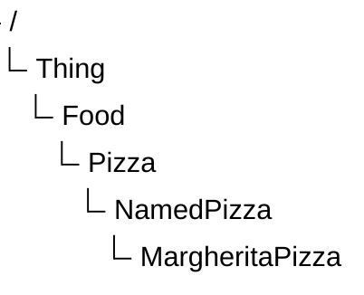

# Chapter 16 -- Conceptual Modeling: Building the First Semantic Taxonomy

**Semantic Knowledge Development Lifecycle (SKDL) - Stage 1: Conceptual Modeling**

*Every semantic system begins with a well-structured conceptual model.*

- [16.1 Introduction -- Conceptual Modeling: The Foundation of Semantic Knowledge](#161-introduction----conceptual-modeling-the-foundation-of-semantic-knowledge)
- [16.2 Learning Objectives](#162-learning-objectives)
- [16.3 Exercise 14 -- Establishing the First Semantic Taxonomy](#163-exercise-14----establishing-the-first-semantic-taxonomy)
  - [`Pizza` -- The General Concept](#pizza----the-general-concept)
  - [`NamedPizza` -- Introducing an Intermediate Abstraction](#namedpizza----introducing-an-intermediate-abstraction)
  - [`MargheritaPizza` -- The First Concrete Domain Concept](#margheritapizza----the-first-concrete-domain-concept)
  - [An Engineering Perspective](#an-engineering-perspective)

## 16.1 Introduction -- Conceptual Modeling: The Foundation of Semantic Knowledge

Every engineering and architectural discipline begins with **abstraction**.

- Before software engineers implement classes and algorithms, they first identify the fundamental concepts that make up the problem domain.
- Before database designers normalize tables and define constraints, they establish entities and relationships.
- Before enterprise architects analyze systems and processes, they develop conceptual models describing business capabilities, information assets, and organizational structures.

Ontology engineering follows exactly the same engineering philosophy.

Before semantic relationships can be established, before logical restrictions can be defined, before automated reasoning can infer new knowledge, and before intelligent systems can consume semantic information, an ontology must first establish a coherent conceptual representation of the domain it intends to describe.

This activity is known as **Conceptual Modeling**, the first stage of **Semantic Knowledge Development Lifecycle (SKDL)** introduced in Chapter (15).

Conceptual Modeling addresses one of the most fundamental questions in knowledge engineering:

> **What concepts exist within the domain, and how should they be organied into a meaningful semantic hierarchy?**

Although this question appears deceptively simple, its answer determines the quality of every subsequent stage of ontology development.

A poorly designed conceptual model inevitably produces ambiguous semantics, inconsistent reasoning, and difficult-to-maintain ontologies. Conversely, a well-designed conceptual hierarchy provides a stable semantic foundation upon which logical definitions, reasoning rules, governance policies, and executable knowledge can progressively be constructed.

This engineering philosophy explains the structure of Michael DeBellis' `Pizza` tutorial.

Having introduced the core language of OWL throughout the previous exercises, the tutorial now transitions from learning individual ontology constructs to building a complete semantic model.

Rather than immediately introducing more sophisticated logical expressions, **Exercise 14** begins by expanding the conceptual hierarchy of the `Pizza` ontology through the creation of its first meaningful subclasses.

This design reflects an important engineering principle that extends far beyond the `Pizza` example:

> **Semantic meaning should be constructed upon conceptual organization -- not the other way around!**

Throughout this chapter, we will examine how conceptual modeling establishes the semantic vocabulary of an ontology, why taxonomies are essential for organizing domain knowledge, and how this first stage of the Semantic Knowledge Development Lifecycle lays the foundation for every subsequent modeling activity.

## 16.2 Learning Objectives

After completing this chapter, you should be able to:

- Explain the purpose of **Conceptual Modeling** within the Semantic Knowledge Development Lifecycle.
- Understand why ontology engineering begins by identifying concepts before defining semantic behavior.
- Create and organize semantic concepts using subclass hierarchies in Protégé.
- Distinguish between abstraction and specialization within an ontology.
- Explain the role of semantic taxonomies in supporting scalable ontology design.
- Recognize how conceptual modeling contributes to the **$K$ - Knowledge Graph** layer of the EKA framework.
- Appreciate why conceptual modeling influences reasoning, governance, validation, and future ontology evolution.

## 16.3 Exercise 14 -- Establishing the First Semantic Taxonomy

From the perspective of a Protégé user, Exercise 14 appears relatively straightforward. Two new classes -- `NamedPizza` and `MargheritaPizza` -- are created beneath the existing `Pizza` class.

From the perspective of ontology engineering, however, this exercise represents the first deliberate act of **semantic abstraction.**

Until this point, the `Pizza` ontology primarily consists of general concepts describing pizzas, toppings, ingredients, and bases. While these concepts establish the vocabulary of the domain, they have not yet been organized into a reusable conceptual hierarchy capable of supporting *semantic inheritance and future reasoning*.

Exercise 14 begins transforming this collection of concepts into a structured taxonomy.

The resulting hierarchy is illustrated below:

Although only two additional classes are introduced, they fundamentally change how knowledge is organized within the ontology.

Rather than treating every pizza as a direct specialization of `Pizza`, the ontology now introduces multiple levels of semantic abstraction.

This design provides a clear separation between general concepts and increasingly specialized domain concepts.

### `Pizza` -- The General Concept

The class `Pizza` represents the generic semantic concepts of a pizza.

At this level, the ontology deliberately avoids describing specific recipes, commercial products, or individual menu items.

Instead, the class captures only those characteristics that are common to every pizza.

By maintaining this high level of abstraction, future subclasses can inherit these common semantics without unnecessary duplication.

This approach follows one of the central principles of ontology engineering:

> **Common knowledge should be modeled once and inherited wherever possible.**

### `NamedPizza` -- Introducing an Intermediate Abstraction

Many beginners initially question why the tutorial introduces `NamedPizza` rather than placing `MargheritaPizza` directly beneath `Pizza`.

The answer lies in the importance of **abstraction**.

`NamedPizza` does not represent a particular pizza.

Instead, it represents an entire category of pizzas that posses recognized names within the domain.

Examples include:
- `MargheritaPizza`
- `AmericanaPizza`
- `SohoPizza`
- `FiorentinaPizza`
- `VenezianaPizza`

Introducing this intermediate concept provides several engineering advantages.

1. It groups all commercially recognized ("Named") pizzas into a coherent semantic category.
2. It prevents the `Pizza` hierarchy from becoming unnecessarily crowded as additional pizza varieties are introduced.
3. It creates a reusable abstraction upon which future semantic definitions can be consistently applied.

As ontologies continue to evolve, intermediate abstractions such as `NamedPizza` become increasingly valuable because they **reduce redundancy** while **improving maintainability**.

### `MargheritaPizza` -- The First Concrete Domain Concept

The class `MargheritaPizza` represents the first concrete pizza type introduced within the ontology.

Unlike `NamedPizza`, which functions primarily as an organizational abstraction, `MargheritaPizza` corresponds to a specific pizza variety that people recognize in everyday life.

At this stage of the tutorial, however, the ontology intentionally refrains from describing what makes a Margherita pizza unique.

It does not yet specify:

- which toppings it contains;
- which ingredients distinguish it from other pizzas; or
- which logical restrictions formally define it.

These semantic descriptions belong to the next stage of the Semantic Knowledge Development Lifecycle.

For now, the objective is considerably simpler:

> **Identify the concept before describing its meaning.**

This separation between conceptual identification and semantic definition represents one of the defining characteristics of professional ontology engineering.

### An Engineering Perspective

Viewed purely as a Protégé exercise, Exercise 14 consists of creating two subclasses.

Viewed through the lens of ontology engineering, however, it marks the beginning of systematic semantic knowledge development.

The ontology is no longer expanding by adding isolated concepts.

Instead, it is establishing a structured conceptual vocabulary capable of supporting:

- semantic inheritance;
- logical specialization;
- reusable ontology patterns;
- automated reasoning;
- semantic governance; and
- future knowledge graph development.

Although the modeling effort appears modest, the architectural significance is substantial.

Exercise 14 therefore represents the true starting point of conceptual modeling within the `Pizza` ontology.