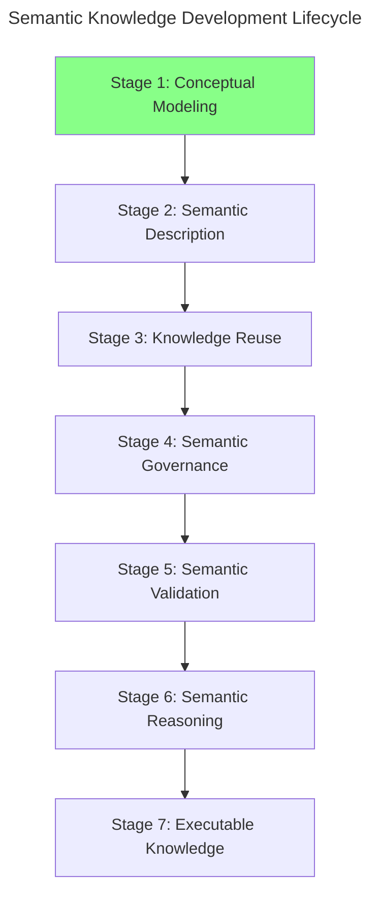
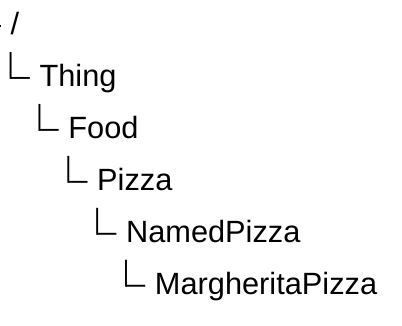
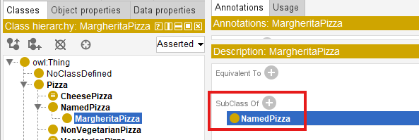
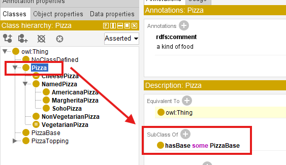
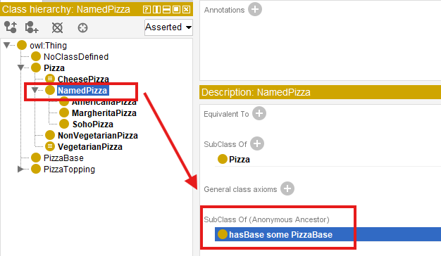
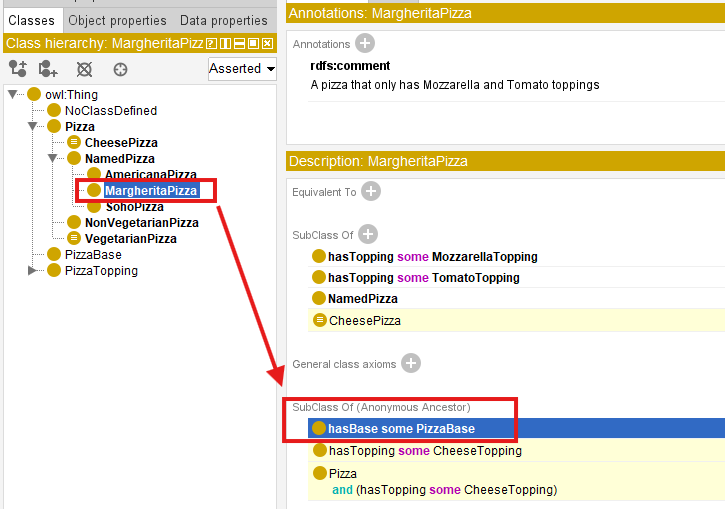

# Chapter 16 -- Conceptual Modeling: Stage 1 of the Semantic Knowledge Development Lifecycle

**Building Semantic Taxonomies Through Subclass Hierarchies**

- [16.1 Introduction -- Conceptual Modeling: The Foundation of Semantic Knowledge](#161-introduction----conceptual-modeling-the-foundation-of-semantic-knowledge)
- [16.2 Learning Objectives](#162-learning-objectives)
- [16.3 Position Within the Semantic Knowledge Development Lifecycle](#163-position-within-the-semantic-knowledge-development-lifecycle)
- [16.4 Exercise 14 -- Establishing the First Semantic Taxonomy](#164-exercise-14----establishing-the-first-semantic-taxonomy)
  - [`Pizza` -- The General Concept](#pizza----the-general-concept)
  - [`NamedPizza` -- Introducing an Intermediate Abstraction](#namedpizza----introducing-an-intermediate-abstraction)
  - [`MargheritaPizza` -- The First Concrete Domain Concept](#margheritapizza----the-first-concrete-domain-concept)
  - [An Engineering Perspective](#an-engineering-perspective)
- [16.5 Why Conceptual Modeling Comes Before Semantic Modeling](#165-why-conceptual-modeling-comes-before-semantic-modeling)
- [16.6 Building a Semantic Taxonomy](#166-building-a-semantic-taxonomy)
- [16.7 Taxonomy Is More Than a Tree](#167-taxonomy-is-more-than-a-tree)
- [16.8 Interesting Reading -- Mathematical Foundations of Semantic Taxonomy](#168-interesting-reading----mathematical-foundations-of-semantic-taxonomy)
- [16.9 Engineering Perspective -- Modeling Before Meaning](#169-engineering-perspective----modeling-before-meaning)
- [16.10 Interesting Reading -- Biological Taxonomy: Nature's Original Ontology](#1610-interesting-reading----biological-taxonomy-natures-original-ontology)
- [16.11 EKA Perspective -- Conceptual Modeling Establishes the Knowledge Layer ($K$)](#1611-eka-perspective----conceptual-modeling-establishes-the-knowledge-layer-k)
- [16.12 Best Practice for Conceptual Modeling](#1612-best-practice-for-conceptual-modeling)
- [16.13 Key Concepts](#1613-key-concepts)
- [16.14 Chapter Summary](#1614-chapter-summary)
- [16.15 Looking Ahead -- From Concepts to Meaning](#1615-looking-ahead----from-concepts-to-meaning)

## 16.1 Introduction -- Conceptual Modeling: The Foundation of Semantic Knowledge

Every engineering and architectural discipline begins with **abstraction**.

- Before software engineers design classes and implement algorithms, they first identify the fundamental concepts that define the problem domain.
- Before database designers normalize tables and establish integrity constraints, they first determine the entities, attributes, and relationships that represent the information being managed.
- Before enterprise architects analyze business capabilities, information flows, and technology landscapes, they first construct conceptual models that describe how an enterprise is organized and how its components interact.

Although these disciplines employ different methodologies, modeling languages, and engineering practices, they all a common principle:

> **A sound conceptual model must precede implementation!**

Ontology engineering follows exactly the same exception.

Before semantic relationships can be established, before logical restrictions can be defined, before automated reasoning can derive (infer) new knowledge, and before intelligent systems can consume (interpret) semantic information, an ontology must first establish a coherent conceptual representation of the domain it intends to describe.

As introduced in Chapter (15), the **Semantic Knowledge Development Lifecycle (SKDL)** provides a structured engineering methodology for developing semantic knowledge systems. Rather than viewing ontology development as a collection of isolated Protégé operations, SKDL organizes the entire engineering process into seven progressive stages that gradually transform conceptual knowledge into executable intelligence.

This chapter (16) begins **Stage 1 -- Conceptual Modeling**, the foundation upon which every subsequent stage of the lifecycle depends.

**Conceptual Modeling** addresses the first and arguably the most fundamental question in ontology engineering:

> **What concepts exist within the domain?**

Although deceptively simple, this question determines the quality of every subsequent stage of semantic knowledge development.

A poorly designed conceptual model inevitably leads to ambiguous semantics, inconsistent reasoning, difficult maintenance, and limited opportunities for semantic reuse. Conversely, a well-designed conceptual hierarchy provides a stable semantic foundation upon which semantic definitions, reusable knowledge patterns, governance policies, validation mechanisms, reasoning capabilities, and ultimately executable knowledge can be progressively constructed.

This engineering philosophy is clearly reflected in the structure of **Michael DeBellis' `Pizza` tutorial**.

Throughout the previous chapters, the tutorial introduced the fundamental building block of OWL, including classes, object properties, property characteristics, inverse properties, domains, ranges, and semantic restrictions. Having established this semantic vocabulary, the tutorial now shifts its focus from learning individual OWL constructs to a coherent semantic model.

Rather than immediately introducing increasingly sophisticated logical expressions, **Exercise 14** begins by extending the `Pizza` ontology through the creation of its first meaningful subclasses hierarchy. While the modeling activity itself appears straightforward, its engineering significance is far greater than simply creating additional classes.

The exercise demonstrates a principle that applies to every ontology, regardless of its domain:

> **Semantic meaning should be built upon conceptual organization -- not the other way around!**

Concepts must first be identified before they can be described. They must be organized before they can be governed. They must be formally defined before they can be validated. Only after these foundations have been established can automated reasoning discover new knowledge and intelligent systems transform semantic knowledge into executable behavior.

Throughout this chapter, we will examine Conceptual Modeling from multiple complementary perspectives. Beginning with the practical implementation of subclass hierarchies in Protégé, we will progressively explore the underlying principles of ontology engineering, the mathematical foundations of semantic taxonomies, parallels with biological classification, and the role of conceptual modeling within the **Executable Knowledge Architecture (EKA)** framework.

By the end of this chapter, you will recognize that subclass hierarchies are far more than graphical structures displayed within Protégé. They constitute the conceptual backbone of every ontology and establish the semantic vocabulary upon which scalable, governable, and executable knowledge systems are built.

## 16.2 Learning Objectives

After completing this chapter, you should be able to achieve the following learning outcomes:

**Knowledge**

- Explain why **Conceptual Modeling** is the first stage of the Semantic Knowledge Development Lifecycle (SKDL).
- Describe the purpose of semantic taxonomies in ontology engineering.
- Understand the relationship between abstraction, generalization, and specialization.
- Explain the semantic meaning of subclass (`SubClassOf`) relationships in OWL

**Practical Skills**

- Create semantic class hierarchies in Protégé.
- Model subclass relationships correctly using OWL.
- Organize domain concepts into reusable conceptual taxonomies.
- Distinguish conceptual organization from semantic definition.

**Engineering Perspective**

- Explain why conceptual modeling precedes semantic description.
- Understand how conceptual taxonomies contributes to the **$K$ - Knowledge Graph** layer within the Executable Knowledge Architecture (EKA) framework.
- Recognize Conceptual Modeling as the engineering foundation for semantic reuse, governance, validation, reasoning, and executable knowledge.

## 16.3 Position Within the Semantic Knowledge Development Lifecycle

As introduced in Chapter (15), ontology engineering progresses through seven stages of the **Semantic Knowledge Development Lifecycle (SKDL)**.

This chapter focuses on **Stage 1 -- Conceptual Modeling**, highlighted below:



The objective of this stage is straightforward yet fundamental.

Rather than describing the semantic characteristics of concepts or performing automated reasoning, **Conceptual Modeling** establishes the conceptual vocabulary of the domain by identifying its principle concepts and organizing them into meaningful abstraction hierarchies.

The deliverable produced during this stage is therefore not logical inference or executable intelligence, but a **semantic taxonomy** that provides the structural backbone of the ontology.

Within the EKA framework, this stage primarily contributes to the development of the **$K$ - Knowledge Graph** by defining the concepts that later stages will progressively enrich with semantic meaning.

## 16.4 Exercise 14 -- Establishing the First Semantic Taxonomy

From the perspective of a Protégé user, Exercise 14 appears relatively straightforward. Two new classes -- `NamedPizza` and `MargheritaPizza` -- are created beneath the existing `Pizza` class.

From the perspective of ontology engineering, however, this exercise represents the first deliberate act of **semantic abstraction.**

Until this point, the `Pizza` ontology primarily consists of general concepts describing pizzas, toppings, ingredients, and bases. While these concepts establish the vocabulary of the domain, they have not yet been organized into a reusable conceptual hierarchy capable of supporting *semantic inheritance and future reasoning*.

Exercise 14 begins transforming this collection of concepts into a structured taxonomy.

The resulting hierarchy is illustrated below:



Although only two additional classes are introduced, they fundamentally change how knowledge is organized within the ontology.

Rather than treating every pizza as a direct specialization of `Pizza`, the ontology now introduces multiple levels of semantic abstraction.

This design provides a clear separation between general concepts and increasingly specialized domain concepts.

### `Pizza` -- The General Concept

The class `Pizza` represents the generic semantic concepts of a pizza.

At this level, the ontology deliberately avoids describing specific recipes, commercial products, or individual menu items.

Instead, the class captures only those characteristics that are common to every pizza.

By maintaining this high level of abstraction, future subclasses can inherit these common semantics without unnecessary duplication.

This approach follows one of the central principles of ontology engineering:

> **Common knowledge should be modeled once and inherited wherever possible.**

### `NamedPizza` -- Introducing an Intermediate Abstraction

Many beginners initially question why the tutorial introduces `NamedPizza` rather than placing `MargheritaPizza` directly beneath `Pizza`.

The answer lies in the importance of **abstraction**.

`NamedPizza` does not represent a particular pizza.

Instead, it represents an entire category of pizzas that posses recognized names within the domain.

Examples include:
- `MargheritaPizza`
- `AmericanaPizza`
- `SohoPizza`
- `FiorentinaPizza`
- `VenezianaPizza`

Introducing this intermediate concept provides several engineering advantages.

1. It groups all commercially recognized ("Named") pizzas into a coherent semantic category.
2. It prevents the `Pizza` hierarchy from becoming unnecessarily crowded as additional pizza varieties are introduced.
3. It creates a reusable abstraction upon which future semantic definitions can be consistently applied.

As ontologies continue to evolve, intermediate abstractions such as `NamedPizza` become increasingly valuable because they **reduce redundancy** while **improving maintainability**.

### `MargheritaPizza` -- The First Concrete Domain Concept

The class `MargheritaPizza` represents the first concrete pizza type introduced within the ontology.

Unlike `NamedPizza`, which functions primarily as an organizational abstraction, `MargheritaPizza` corresponds to a specific pizza variety that people recognize in everyday life.

At this stage of the tutorial, however, the ontology intentionally refrains from describing what makes a Margherita pizza unique.

It does not yet specify:

- which toppings it contains;
- which ingredients distinguish it from other pizzas; or
- which logical restrictions formally define it.

These semantic descriptions belong to the next stage of the Semantic Knowledge Development Lifecycle.

For now, the objective is considerably simpler:

> **Identify the concept before describing its meaning.**

This separation between conceptual identification and semantic definition represents one of the defining characteristics of professional ontology engineering.

### An Engineering Perspective

Viewed purely as a Protégé exercise, Exercise 14 consists of creating two subclasses.

Viewed through the lens of ontology engineering, however, it marks the beginning of systematic semantic knowledge development.

The ontology is no longer expanding by adding isolated concepts.

Instead, it is establishing a structured conceptual vocabulary capable of supporting:

- semantic inheritance;
- logical specialization;
- reusable ontology patterns;
- automated reasoning;
- semantic governance; and
- future knowledge graph development.

Although the modeling effort appears modest, the architectural significance is substantial.

Exercise 14 therefore represents the true starting point of conceptual modeling within the `Pizza` ontology.

## 16.5 Why Conceptual Modeling Comes Before Semantic Modeling

A common misconception among newcomers to ontology engineering is that the primary objective of an ontology is to define logical rules.

In reality, logical semantics represent only one stage of ontology development.

Before logical rules can be introduced, the ontology must first establish a stable conceptual structure capable of supporting those rules.

This design philosophy is shared across virtually every engineering discipline.

| Discipline | Primary Question | Initial Modeling Activity |
| --- | --- | --- |
| Software Engineering | What objects exist? | Class Modeling |
| Database Design | What information should be stored? | Entity-Relationship Modeling |
| Business Architecture | What business capabilities exist? | Capability Mapping |
| Enterprise Architecture | What architectural elements exist? | Architecture Modeling |
| Ontology Engineering | What concepts exist? | Conceptual Modeling |

Although the terminology differs, the underlying engineering principle remains remarkably consistent.

Every discipline begins by identifying **what exists** before attempting to describe **how it behaves.**

Ontology engineering follows exactly the same progression.

Conceptual Modeling therefore answers only one fundamental questions:

> **What concepts exist within the knowledge domain?**

Later stages of the Semantic Knowledge Development Lifecycle answer progressively model sophisticated questions.

For example:

- How are concepts semantically related?
- Which logical constraints govern them?
- Which facts can be inferred automatically?
- How should semantic quality be validated?
- How can semantic knowledge drive enterprise execution?

Attempting to answer these questions before a stable conceptual model exists often leads to ontologies that are inconsistent, difficult to understand, and challenging to maintain.

For this reason, professional ontology engineers invest considerable effort in conceptual modeling before introducing more sophisticated semantic constructs.

## 16.6 Building a Semantic Taxonomy

Once the primary concepts of a domain have been identified, they must be organized into a coherent semantic hierarchy.

This hierarchy is known as a **taxonomy**.

Although taxonomies are often visualized as tree structures, their purpose extends far beyond simple organization.

A semantic taxonomy captures the **generalization-specialization relationships** between concepts.

Each child concept represents a more specialized interpretation of its parent while inheriting all of the semantic meaning already established at higher levels.

The `Pizza` ontology now contains the following conceptual hierarchy.

$Thing \rightarrow Food \rightarrow Pizza \rightarrow NamedPizza \rightarrow MargheritaPizza$

Each successive level introduces additional semantic specificity.

Moving downward through the hierarchy does not create unrelated concepts.

Instead, every specialization preserves the semantic identity of its ancestors.

Consequently:

- Every `MargheritaPizza` is a `NamedPizza`.
- Every `NamedPizza` is a `Pizza`.
- Every `Pizza` is `Food`. (although we don't create this layer in our working model)
- Every `Food` is ultimately a `Thing`.

This hierarchical organization provides numerous engineering benefits.

A well-designed taxonomy improves readability by presenting domain concepts in a logical and intuitive structure.

It improves maintainability by allowing common characteristics to be inherited rather than repeatedly modeled.

It enhances extensibility by enabling new concepts to be incorporated without disrupting the overall organization of the ontology.

Most importantly, the taxonomy establishes the conceptual backbone upon which subsequent stages of the Semantic Knowledge Development Lifecycle will build increasingly sophisticated semantic capabilities.

Without a robust conceptual hierarchy:

- logical restrictions become difficult to define,
- reasoning becomes less effective,
- governance becomes harder to enforce, and
- semantic reuse becomes increasingly limited.

For this reason, conceptual modeling should never be regarded as a preliminary modeling exercise.

It is the architectural foundation upon which every successful ontology -- and ultimately every executable knowledge system -- is built.

## 16.7 Taxonomy Is More Than a Tree

When first learning Protégé, many beginners perceive the class hierarchy as little more than a graphical tree used to organize concepts.

From this perspective, subclasses resemble folders within a file system, where each child node is simply grouped beneath a parent node for convenience.

This interpretation, however, fundamentally misunderstands the purpose of an ontology.

A folder hierarchy is primarily an organizational mechanism. It helps humans navigate information but carries little semantic meaning. Moving a document from one folder to another changes its location, but not its intrinsic meaning.

A semantic taxonomy is **fundamentally different.**

Every subclass in an ontology represents a **logical specification** of its parent class. Rather than simply belonging to a parent category, the child concept inherits the semantic meaning established by its ancestors while introducing additional specificity.

For example, the taxonomy introduced in Exercise 14 can be interpreted as follows:


This hierarchy should not be read as:

> *`MargheritaPizza` is stored under `NamedPizza`.*

Instead, it should be interpreted as:

> **Every `MargheritaPizza` is a `NamedPizza`, and every `NamedPizza` is a `Pizza`.**

This distinction is subtle but extremely important.

The subclass relationship (`SubClassOf`) expresses an **`IS-A`** relationship rather than a containment relationship, like below in Protégé:



Consequently, semantic properties defined for `Pizza` automatically apply to `NamedPizza` and `MargheritaPizza`, unless explicitly refined or constrained by additional axioms introduced later in the ontology.

Let's see the example, we set: `Pizza hasBase some PizzaBase`:



You don't need separately set this property/constraint, with above taxonomy hierarchy, the `NamedPizza` and `MargheritaPizza` inherit it semantically:





This mechanism is known as **semantic inheritance.**

Unlike object-oriented programming, where subclasses inherit executable methods and implementation details, ontology subclasses inherit **logical meaning**. The purpose is not software reuse, but semantic consistency.

This semantic inheritance enables ontology reasoners to propagate knowledge automatically throughout the class hierarchy, making the taxonomy an active component of semantic reasoning rather than a passive organizational diagram.

For this reason, ontology engineers should never think of the Protégé class hierarchy as a tree of folders. **It is a formal semantic structure that captures conceptual specification within the domain.**

## 16.8 Interesting Reading -- Mathematical Foundations of Semantic Taxonomy

One reason ontology engineering provides reliable automated reasoning is that its class hierarchy is not merely an intuitive diagram -- it is grounded in **well-established mathematical theory**.

From the perspective of **set theory**, every OWL class may be interpreted as a set whose members are individuals belonging to that class.

Suppose we define the following sets:

$P = \{\text{all pizzas}\}$

$N = \{\text{all named pizzas}\}$

$M = \{\text{all Margherita pizzas}\}$

Exercise 14 establishes the following subset relationships:

$M \subseteq N \subseteq P$

This expression states that every member of the set $M$ is also a member of $N$, and every member of $N$ belongs to $P$.

> Note: $M$, $N$ and $P$ can also even be equally each other.

In ontology terminology, this corresponds directly to the OWL axiom:

```text
MargheritaPizza SubClassOf NamedPizza
NamedPizza SubClassOf Pizza
```

The mathematical interpretation immediately explains why inheritance works automatically.

If every Margherita pizza belongs to the set of Named pizzas, and every Named pizza belongs to the set of pizzas, then it follows logically that:

$M \subseteq P$

without requiring an additional axiom.

This inferences is based on the **transitivity of subset inclusion**, one of the fundamental properties of set theory.

More generally, subclass relationships form a **partially ordered set (poset)** under the subset relation.

A partial order satisfies three important properties:

| Property | Mathematical Expression |
| --- | --- |
| Reflexivity | Every class is a subclass of itself: $A \subseteq A$ |
| Anti-symmetry | If $A \subseteq B$ and $B \subseteq A$, then $A=B$ |
| Transitivity | If $A \subseteq B$ and $B \subseteq C$, then $A \subseteq C$ |

These mathematical properties provide the theoretical foundation for semantic inheritance and explain why ontology reasoners can propagate knowledge consistently throughout a taxonomy.

From this perspective, OWL does not invent a new hierarchy mechanism. Instead, it formalizes centuries of mathematical reasoning about sets, inclusion, and logical specification into a machine-understandable and machine-processable representation (meaning).

## 16.9 Engineering Perspective -- Modeling Before Meaning

Exercise 14 deliberately postpones one question that many beginners naturally ask:

> **Why doesn't the tutorial define the toppings of a Margherita Pizza immediately?**

The answer lies in the engineering discipline of *incremental semantic modeling*.

A conceptual model should first establish **what exists** before attempting to describe **what each concept means.**

This separation of concerns is common across many engineering disciplines.

When architects design a building, they first create the structural blueprint before specifying electrical wiring, plumbing, or interior decoration.

Similarly, software application architects define classes before implementing algorithms, and database designers identify entities before defining integrity constraints.

Ontology engineering follows the same progression.

The Semantic Knowledge Development Lifecycle (SKDL) separates these activities into distinct stages:

1. **Conceptual Modeling** identifies the concepts.
2. **Semantic Description** defines their meaning.
3. **Semantic Reuse** promotes consistency and extensibility.
4. **Semantic Governance** ensures correctness and quality.
5. **Reasoning** derives new knowledge from explicit semantics.

This staged approach prevents ontologies from becoming overly complex during the early phases of development.

Instead of attempting to model every semantic detail at once, ontology engineers progressively enrich the conceptual model with increasingly sophisticated knowledge.

Exercise 14 in `Pizza` tutorial therefore demonstrates an important lesson:

> **A good ontology evolves through disciplined refinement rather than immediate complexity!**

The conceptual taxonomy created in this chapter provides the stable foundation upon which future **semantic descriptions, logical restrictions, and reasoning rules** will be constructed.

## 16.10 Interesting Reading -- Biological Taxonomy: Nature's Original Ontology

Long before the emergence of computer science, **biologists** faced a challenge remarkably similar to that encountered by **ontology engineers** today:

> **How can an enormous collection of entities by organized into a coherent, reusable, and universally understandable knowledge system?**

The answer became one of the most influential classification systems in scientific history -- **biological taxonomy.**

In the eighteenth century, the Swedish naturalist **Carl Linnaeus** introduced a hierarchical classification framework that continues to underpin modern biology.

Living organisms are classified into progressively more specialized categories:


For example, the `domestic cat` is classified as:

| Rank | Classification |
| --- | --- |
| Kingdom | $Animalia$ |
| Phylum | $Chordata$ |
| Class | $Mammalia$ |
| Order | $Carnivora$ |
| Family | $Felidae$ |
| Genus | $Felis$ |
| Species | $\textit{Felis catus}$ |

Each level introduces additional specialization while preserving the characteristics inherited from broader categories.

This should immediately remind us of the `Pizza` ontology:


Just as every $\textit{Felis catus}$ is also a $\textit{mammal}$ and therefore an $\textit{animal}$, every `MargheritaPizza` is also a `NamedPizza` and therefore a `Pizza`.

Both systems organize knowledge through hierarchical specialization.

There is, however, an important distinction.

- Traditional biological taxonomy primarily supports **classification** by human experts.
- Modern ontologies extend this idea by incorporating formal semantics, logical axioms, automated reasoning, and machine-processable knowledge.

> In other words, ontology engineering can be viewed as an evolution of **classical taxonomy.**

It preserves the hierarchical organization development by centuries of scientific inquiry while adding computational semantics that enables intelligent systems to interpret, validate, and reason over knowledge automatically.

Within the **Executable Knowledge Architecture (EKA)** framework, this taxonomy contributes directly to the **$K$ - Knowledge Graph** layer by establishing the conceptual vocabulary upon which reasoning, governance, and executable intelligence are subsequently built.

As you continue through this book, you will discover that every semantic capability introduced in later chapters ultimately depends upon the quality of this **conceptual foundation.**

## 16.11 EKA Perspective -- Conceptual Modeling Establishes the Knowledge Layer ($K$)

Throughout this chapter, we have focused on identifying and organizing concepts ito a coherent semantic taxonomy. Although the ontology remains relatively simple, it has already completed the first and perhaps most fundamental stage of the **Executable Knowledge Architecture (EKA)**.

As introduced in Chapter (00), EKA formalizes executable knowledge using five complementary components:

- $K$ - **Knowledge Graph layer**
- $R$ - **Reasoning & Rules layer**
- $\Theta$ - **Trigger layer**
- $\Phi$ - **Execution layer**
- $\Gamma$ - **Governance layer**

The work completed in Exercise (14) contributes primarily to the $K$ - **Knowledge Graph** layer.

At this stage, the ontology has established a shared conceptual vocabulary describing the domain. Concepts such as `Pizza`, `NamedPizza`, and `MargheritaPizza` now exist as formally defined semantic classes capable of supporting future semantic enrichment.

The relationship between this chapter and the EKA tuple can therefore be summarized as follows:

| EKA Component | Contribution of Chapter (16) |
| --- | --- |
| $K$ - **Knowledge Graph** | Establishes the conceptual vocabulary and semantic taxonomy of the `Pizza` domain through class hierarchies and subclass relationships. |
| $R$ - **Reasoning & Rules** | Not yet introduced. The taxonomy provides the structure upon which future logical axioms and inference rules will operate. |
| $\Theta$ - **Trigger** | Not involved at this stage. Semantic events require machine-understandable semantics, which will be introduced in later chapters. |
| $\Phi$ - **Execution** | No executable actions are defined. The ontology currently models knowledge rather than behavior. |
| $\Gamma$ - **Governance** | Concept naming, hierarchy organization, and abstraction represent the first steps toward semantic governance and long-term maintainability. |

This illustrates an important principle of EKA:

> **Executable intelligence cannot emerge without a well-structured knowledge foundation.**

Reasoning engines, validation rules, semantic queries, and intelligent automation all depend on the quality of the conceptual model established at the beginning of the ontology development process.

**Conceptual Modeling** therefore represents much more than simply creating class in Protégé -- it establishes the semantic vocabulary upon which the remaining EKA components will progressively be constructed.

## 16.12 Best Practice for Conceptual Modeling

Although creating subclasses is technically straightforward, designing a maintainable semantic taxonomy requires careful engineering judgment. Experienced ontology engineers devote considerable attention to conceptual modeling because errors introduced at this stage often propagate throughout the remainder of the ontology.

The following practices are widely recommended when developing semantic taxonomies.

**Think Semantically Rather Than Visually**

Protégé displays a class hierarchy as a tree, but ontology engineers should think beyond the graphical interface.

Each node represents a formal semantic concept (with IRI), not merely a visual element.

The objective is not to construct an attractive diagram but to capture the ***conceptual structure*** of domain knowledge accurately.

**Model Concepts Before Properties**

Resist the temptation to immediately define object properties or logical restrictions.

A stable conceptual hierarchy should exist before semantic relationships are introduced.

This separation of concerns simplifies both ontology development and future maintenance.

**Prefer Generalization Before Duplication**

Whenever multiple concepts share common characteristics, introduce a higher-level abstraction rather than keep duplicating semantic definitions in the same level.

For example, introducing `NamedPizza` avoids placing every pizza variety direction beneath `Pizza`, creating a more scalable conceptual organization, especially we already have some categories like `PizzaBase` and `PizzaTopping` under `Pizza`.

**Design for Future Growth**

A taxonomy should not merely represent the current domain; it should accommodate future expansion.

When new pizza varieties such as `CapricciosaPizza` or `QuattroFormaggiPizza` are introduced, they should naturally fit within the existing conceptual modeling hierarchy without requiring structural redesign.

Scalable taxonomies reduce future maintenance effort and promote semantic consistency.

**Maintain Consistent Level of Abstraction**

Sibling classes should represent concepts at comparable levels of ***generality***.

Mixing broad conceptual categories with highly specific concepts within the same hierarchy often leads to semantic ambiguity and inconsistent reasoning.

Maintaining consistent abstraction levels improves readability for both humans and automated reasoners.

**Remember That Classes Describe Types, Not Individuals**

Ontology classes describe categories of things rather than specific objects.

For example:

  - `MargheritaPizza` is a class
  - "The pizza served on Table 5" is an individual

Keeping this distinction clear prevents confusion between ontology modeling and data modeling.

## 16.13 Key Concepts

The following concepts introduced in this chapter provide the conceptual foundation for all subsequent stages of ontology engineering.

| Concept | Description |
| --- | --- |
| **Conceptual Modeling** | The process of identifying , abstracting, and organizing domain concepts into a coherent semantic structure before introducing logical semantics. |
| **Semantic Taxonomy** | A hierarchical organization of concepts based on semantic specialization, enabling inheritance and conceptual reuse. |
| **Abstraction** | The process of identifying common characteristics and representing them at higher conceptual levels within the ontology. |
| **Specialization** | The refinement of a general concept into more specific semantic categories while preserving inherited meaning. |
| **Subclass (`SubClassOf`)** | An OWL construct expressing that every instance of one class is also an instance of another class, representing as `IS-A` relationship. |
| **Semantic Inheritance** | The logical inheritance of semantic meaning from parent classes to their subclasses through the ontology hierarchy. |
| **Conceptual Vocabulary** | The complete collection of semantic concepts that define the scope of an ontology. |
| **Taxonomy** | A structured classification system organizing concepts according to generalization and specialization relationships. |

## 16.14 Chapter Summary

This chapter introduced the first stage of the **Semantic Knowledge Development Lifecycle (SKDL)** -- **Conceptual Modeling**.

Using Exercise 14 from Michael DeBellis' `Pizza` tutorial as a practical case study, we explored how ontology engineers establish the conceptual vocabulary of a domain before introducing logical semantics.

We learned that conceptual modeling is not merely the creation of class hierarchies in Protégé. Rather, it is the **engineering discipline** of identifying, organizing, and structuring domain knowledge into a reusable semantic taxonomy.

Along the way, we examined subclass hierarchies from multiple perspectives.

From ontology engineering, we saw how semantic inheritance enables specialized concepts to reuse the meaning of their ancestors.

From mathematics, we interpreted subclass relationships as subset relations and partially ordered sets, providing the formal basis for semantic reasoning.

From biology, we observed how the hierarchical classification of living organisms inspired one of humanity's earliest **large-scale knowledge organization systems.**

Finally, we connected conceptual modeling to the $K$ - **Knowledge Graph** layer of the EKA framework, recognizing that every future semantic capability -- including reasoning, governance, validation, and executable intelligence -- depends upon a well-designed conceptual foundations.

Although the ontology currently describes only *what concepts exist*, this foundation is now sufficiently mature to support the next stage of semantic development.

## 16.15 Looking Ahead -- From Concepts to Meaning

At the conclusion of this chapter, the `Pizza` ontology contains a well-organized conceptual taxonomy.

However, the ontology still cannot answer an important question:

> **What actually distinguishes one pizza from another?**

At present the ontology knows that a `MargheritaPizza` is a specialized type of `NamedPizza`, but it has no understanding of *why* is is a Margherita pizza.

The concept has been identified, but its semantic meaning has not yet been formally described.

This distinction marks the transition to the next stage of the **Semantic Knowledge Development Lifecycle (SKDL)**.

In Chapter (17), we begin the process of **Semantic Description**, enriching our conceptual taxonomy with formal semantic definitions. Rather than simply organizing concepts into hierarchies, we will start expressing the characteristics that define them using OWL axioms and logical constructs.

In other words, Chapter (16) answered the question:

> **What concepts exist within the domain?**

Chapter (17) will anwer a more challenging question:

> **What do those concepts actually mean?**

This progression -- from **Conceptual Modeling** to **Semantic Description** -- represents one of the defining characteristics of professional ontology engineering and the first major step toward building **Executable Knowledge Architecture (EKA)**.

---

Last updated at: 2026-07-11