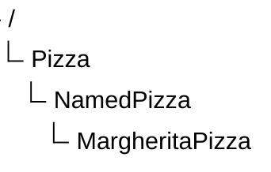
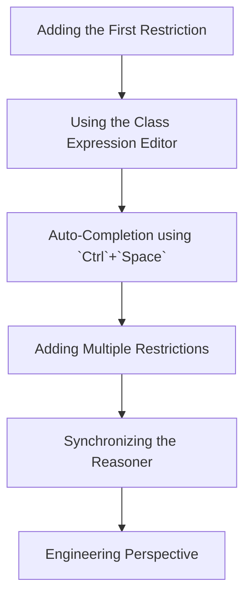

# Chapter 17 — Semantic Description: Stage 2 of the Semantic Knowledge Development Lifecycle

**Defining Concepts Through OWL Restrictions**

- [17.1 Introduction -- From Concepts to Meaning](#171-introduction----from-concepts-to-meaning)
- [17.2 Learning Objectives](#172-learning-objectives)
- [17.1 Introduction -- From Concepts to Meaning](#171-introduction----from-concepts-to-meaning-1)
- [17.2 Learning Objectives](#172-learning-objectives-1)
- [17.3 Position Within SKDL -- Stage 2 Highlighted](#173-position-within-skdl----stage-2-highlighted)
- [17.4 Exercise 15 -- Creating the First Semantic Description](#174-exercise-15----creating-the-first-semantic-description)
- [17.5 Why Semantic Description Follows Conceptual Modeling](#175-why-semantic-description-follows-conceptual-modeling)
- [17.6 Existential Restrictions (`some`)](#176-existential-restrictions-some)
- [17.7 Class Expression: Describing Meaning Rather Than Structure](#177-class-expression-describing-meaning-rather-than-structure)
- [17.8 Interesting Reading -- From Aristotle to Description Logic](#178-interesting-reading----from-aristotle-to-description-logic)
- [17.9 Engineering Perspective -- Meaning Before Reasoning](#179-engineering-perspective----meaning-before-reasoning)
- [17.10 EKA Perspective -- Stage 2 Enriches $K$ and Prepares $R$](#1710-eka-perspective----stage-2-enriches-k-and-prepares-r)
- [17.11 Engineering Guidelines](#1711-engineering-guidelines)
- [17.12 Key Concepts](#1712-key-concepts)
- [17.13 Chapter Summary](#1713-chapter-summary)
- [17.14 Looking Ahead -- Toward Knowledge Reuse](#1714-looking-ahead----toward-knowledge-reuse)
- [17.3 Position Within SKDL -- Stage 2 Highlighted](#173-position-within-skdl----stage-2-highlighted-1)
- [17.4 Exercise 15 -- Creating the First Semantic Description](#174-exercise-15----creating-the-first-semantic-description-1)
- [17.5 Why Semantic Description Follows Conceptual Modeling](#175-why-semantic-description-follows-conceptual-modeling-1)
- [17.6 Existential Restrictions (`some`)](#176-existential-restrictions-some-1)
- [17.7 Class Expression: Describing Meaning Rather Than Structure](#177-class-expression-describing-meaning-rather-than-structure-1)
- [17.8 Interesting Reading -- From Aristotle to Description Logic](#178-interesting-reading----from-aristotle-to-description-logic-1)
- [17.9 Engineering Perspective -- Meaning Before Reasoning](#179-engineering-perspective----meaning-before-reasoning-1)
- [17.10 EKA Perspective -- Stage 2 Enriches $K$ and Prepares $R$](#1710-eka-perspective----stage-2-enriches-k-and-prepares-r-1)
- [17.11 Engineering Guidelines](#1711-engineering-guidelines-1)
- [17.12 Key Concepts](#1712-key-concepts-1)
- [17.13 Chapter Summary](#1713-chapter-summary-1)
- [17.14 Looking Ahead -- Toward Knowledge Reuse](#1714-looking-ahead----toward-knowledge-reuse-1)

## 17.1 Introduction -- From Concepts to Meaning

Every successful knowledge system begins by answering two fundamental questions:

> **What concepts exist?**

and

> **What do those concepts actually mean?**

Although these questions appear closely related, they represent two distinct stages of ontology engineering.

In **Chapter (16)**, we completed **Stage 1 -- Conceptual Modeling** of the **Semantic Knowledge Development Lifecycle (SKDL)**. Rather than describing concepts in detail, we focused on identifying the conceptual vocabulary of the domain and organizing it into a coherent semantic taxonomy. Through Exercise 14, the `Pizza` ontology established the first meaningful class hierarchy:

This hierarchy answered the first question:

> **What concepts exist within the `Pizza` domain?**

At this point, however, the ontology possessed only **conceptual structure**.

Although the ontology knew that `MargheritaPizza` was a specialized type of `NamedPizza`, it still had no understanding of **why** a pizza should be considered a Margherita pizza.

> The class existed, but its semantic meaning had not yet been defined.

This chapter begins **Stage 2 -- Semantic Description**, where concepts evolve from simple names into formally defined semantic entities.

Rather than merely organizing concepts into a hierarchy, we begin describing the characteristics that distinguish one concept from another. In OWL, these semantic descriptions are expressed through **class expressions** and **logical restrictions**, enabling machines to interpret concepts according to their formal meaning rather than their names alone.

Exercise 15 introduces this important transition by defining the first semantic characteristics of `MargheritaPizza`.

Instead of:

> simply stating that a Margherita pizza exists,

we begin:

> specifying the conditions that describe it, such as the toppings that characterize this familiar pizza variety.

Although the practical exercise requires adding only two OWL restrictions, its engineering significance extends far beyond the Protégé user interface.

For the first time, the ontology begins expressing **machine-understandable semantics**.

This distinction marks an important milestone in ontology engineering.

A conceptual hierarchy alone provides organization, but it cannot explain the meaning of the concepts it contains.

Semantic descriptions transform that hierarchy into a formal knowledge model capable of supporting **validation**, **inference**, **reuse**, and ultimately **intelligent behavior**.

This progression reflects a principle found throughout engineering.

- Software architects first identify classes before implementing their behavior.
- Database designers first identify entities before defining integrity constraints.
- Enterprise architects first establish architectural elements before specifying their relationships and responsibilities.
- Ontology engineering follows exactly the same philosophy: concepts should first be identified, only then should their semantics be defined.

The transition from **Conceptual Modeling** to **Semantic Description** therefore represents far more than the addition of OWL syntax. It marks the point at which an ontology begins transforming from a conceptual classification system (taxonomy) into a formal semantic knowledge model.

Throughout this chapter, we will examine semantic description from multiple complementary perspectives. Beginning with the practical creation of OWL restrictions in Protégé, we will progressively explore existential restrictions, class expressions, the philosophical foundations of semantic definition, and the mathematical principles that ultimately evolved into modern **Description Logic**, the formal language upon which OWL is built.

By the end of this chapter, you will recognize that a semantic restrictions is far more than a line of OWL syntax. It represents the first formal statement of meaning within an ontology and establishes the semantic foundation upon which automated reasoning, knowledge reuse, governance, and executable intelligence will be progressively constructed throughout the remaining stages of the **Semantic Knowledge Development Lifecycle (SKDL)**.

## 17.2 Learning Objectives

After completing this chapter, you should be able to achieve the following learning outcomes.

**Knowledge**
- Explain why **Semantic Description** is the second stage of the **Semantic Knowledge Development Lifecycle (SKDL)**.
- Describe the purpose of **OWL restrictions** in defining the meaning of ontology concepts.
- Understand the difference between **conceptual organization** and **semantic description**.
- Explain the semantic meaning of **existential restrictions (`some`)** in OWL.
- Understand how **class expressions** describe concepts through logical conditions rather than hierarchical structure.

**Practical Skills**
- Create **existential restrictions** using the # Chapter 17 — Semantic Description: Stage 2 of the Semantic Knowledge Development Lifecycle

**Defining Concepts Through OWL Restrictions**

- [17.1 Introduction -- From Concepts to Meaning](#171-introduction----from-concepts-to-meaning)
- [17.2 Learning Objectives](#172-learning-objectives)
- [17.1 Introduction -- From Concepts to Meaning](#171-introduction----from-concepts-to-meaning-1)
- [17.2 Learning Objectives](#172-learning-objectives-1)
- [17.3 Position Within SKDL -- Stage 2 Highlighted](#173-position-within-skdl----stage-2-highlighted)
- [17.4 Exercise 15 -- Creating the First Semantic Description](#174-exercise-15----creating-the-first-semantic-description)
- [17.5 Why Semantic Description Follows Conceptual Modeling](#175-why-semantic-description-follows-conceptual-modeling)
- [17.6 Existential Restrictions (`some`)](#176-existential-restrictions-some)
- [17.7 Class Expression: Describing Meaning Rather Than Structure](#177-class-expression-describing-meaning-rather-than-structure)
- [17.8 Interesting Reading -- From Aristotle to Description Logic](#178-interesting-reading----from-aristotle-to-description-logic)
- [17.9 Engineering Perspective -- Meaning Before Reasoning](#179-engineering-perspective----meaning-before-reasoning)
- [17.10 EKA Perspective -- Stage 2 Enriches $K$ and Prepares $R$](#1710-eka-perspective----stage-2-enriches-k-and-prepares-r)
- [17.11 Engineering Guidelines](#1711-engineering-guidelines)
- [17.12 Key Concepts](#1712-key-concepts)
- [17.13 Chapter Summary](#1713-chapter-summary)
- [17.14 Looking Ahead -- Toward Knowledge Reuse](#1714-looking-ahead----toward-knowledge-reuse)
- [17.3 Position Within SKDL -- Stage 2 Highlighted](#173-position-within-skdl----stage-2-highlighted-1)
- [17.4 Exercise 15 -- Creating the First Semantic Description](#174-exercise-15----creating-the-first-semantic-description-1)
- [17.5 Why Semantic Description Follows Conceptual Modeling](#175-why-semantic-description-follows-conceptual-modeling-1)
- [17.6 Existential Restrictions (`some`)](#176-existential-restrictions-some-1)
- [17.7 Class Expression: Describing Meaning Rather Than Structure](#177-class-expression-describing-meaning-rather-than-structure-1)
- [17.8 Interesting Reading -- From Aristotle to Description Logic](#178-interesting-reading----from-aristotle-to-description-logic-1)
- [17.9 Engineering Perspective -- Meaning Before Reasoning](#179-engineering-perspective----meaning-before-reasoning-1)
- [17.10 EKA Perspective -- Stage 2 Enriches $K$ and Prepares $R$](#1710-eka-perspective----stage-2-enriches-k-and-prepares-r-1)
- [17.11 Engineering Guidelines](#1711-engineering-guidelines-1)
- [17.12 Key Concepts](#1712-key-concepts-1)
- [17.13 Chapter Summary](#1713-chapter-summary-1)
- [17.14 Looking Ahead -- Toward Knowledge Reuse](#1714-looking-ahead----toward-knowledge-reuse-1)

## 17.1 Introduction -- From Concepts to Meaning

Every successful knowledge system begins by answering two fundamental questions:

> **What concepts exist?**

and

> **What do those concepts actually mean?**

Although these questions appear closely related, they represent two distinct stages of ontology engineering.

In **Chapter (16)**, we completed **Stage 1 -- Conceptual Modeling** of the **Semantic Knowledge Development Lifecycle (SKDL)**. Rather than describing concepts in detail, we focused on identifying the conceptual vocabulary of the domain and organizing it into a coherent semantic taxonomy. Through Exercise 14, the `Pizza` ontology established the first meaningful class hierarchy:

This hierarchy answered the first question:

> **What concepts exist within the `Pizza` domain?**

At this point, however, the ontology possessed only **conceptual structure**.

Although the ontology knew that `MargheritaPizza` was a specialized type of `NamedPizza`, it still had no understanding of **why** a pizza should be considered a Margherita pizza.

> The class existed, but its semantic meaning had not yet been defined.

This chapter begins **Stage 2 -- Semantic Description**, where concepts evolve from simple names into formally defined semantic entities.

Rather than merely organizing concepts into a hierarchy, we begin describing the characteristics that distinguish one concept from another. In OWL, these semantic descriptions are expressed through **class expressions** and **logical restrictions**, enabling machines to interpret concepts according to their formal meaning rather than their names alone.

Exercise 15 introduces this important transition by defining the first semantic characteristics of `MargheritaPizza`.

Instead of:

> simply stating that a Margherita pizza exists,

we begin:

> specifying the conditions that describe it, such as the toppings that characterize this familiar pizza variety.

Although the practical exercise requires adding only two OWL restrictions, its engineering significance extends far beyond the Protégé user interface.

For the first time, the ontology begins expressing **machine-understandable semantics**.

This distinction marks an important milestone in ontology engineering.

A conceptual hierarchy alone provides organization, but it cannot explain the meaning of the concepts it contains.

Semantic description transforms that hierarchy into a formal knowledge model capable of supporting **validation**, **inference**, **reuse**, and ultimately **intelligent behavior**.

This progression reflects a principle found throughout engineering.

- Software architects first identify classes before implementing their behavior.
- Database designers first identify entities before defining integrity constraints.
- Enterprise architects first establish architectural elements before specifying their relationships and responsibilities.
- Ontology engineering follows exactly the same philosophy: concepts should first be identified, only then should their semantics be defined.

The transition from **Conceptual Modeling** to **Semantic Description** therefore represents far more than the addition of OWL syntax. It marks the point at which an ontology begins transforming from a conceptual classification system (taxonomy) into a formal semantic knowledge model.

Throughout this chapter, we will examine semantic description from multiple complementary perspectives. Beginning with the practical creation of OWL restrictions in Protégé, we will progressively explore existential restrictions, class expressions, the philosophical foundations of semantic definition, and the mathematical principles that ultimately evolved into modern **Description Logic**, the formal language upon which OWL is built.

By the end of this chapter, you will recognize that a semantic restrictions is far more than a line of OWL syntax. It represents the first formal statement of meaning within an ontology and establishes the semantic foundation upon which automated reasoning, knowledge reuse, governance, and executable intelligence will be progressively constructed throughout the remaining stages of the **Semantic Knowledge Development Lifecycle (SKDL)**.

## 17.2 Learning Objectives

After completing this chapter, you should be able to achieve the following learning outcomes.

**Knowledge**
- Explain why **Semantic Description** is the second stage of the **Semantic Knowledge Development Lifecycle (SKDL)**.
- Describe the purpose of **OWL restrictions** in defining the meaning of ontology concepts.
- Understand the difference between **conceptual organization** and **semantic description**.
- Explain the semantic meaning of **existential restrictions (`some`) in OWL**.
- Understand how **class expressions** describe concepts through logical conditions rather than hierarchical structure.

**Practical Skills**
- Create **existential restrictions** using the Protégé Class Expression Editor.
- Define concepts using **OWL class expressions**.
- Apply multiple semantic restrictions to describe a domain concept.
- Use **auto-completion (`Ctrl` + `Space`)** to efficiently construct OWL expressions.
- Synchronize the reasoner to verify the consistency of newly added semantic descriptions.

**Engineering Perspective**
- Explain why semantic description follows conceptual modeling within the SKDL.
- Recognize semantic restrictions as **formal descriptions of meaning** rather than merely Protégé syntax.
- Understand how semantic descriptions prepare an ontology for **knowledge reuse**, **validation**, **reasoning**, and **machine interpretation**.
- Explain how Stage 2 enriches the **$K$ — Knowledge Graph** layer and establishes the foundation for the **$R$ — Reasoning & Rules** layer within the **Executable Knowledge Architecture (EKA)**.
- Appreciate that semantic description represents the transition from a **conceptual taxonomy** to a **machine-understandable semantic knowledge model**.

## 17.3 Position Within SKDL -- Stage 2 Highlighted

## 17.4 Exercise 15 -- Creating the First Semantic Description

The Exercise 15 could be viewed as following steps:

## 17.5 Why Semantic Description Follows Conceptual Modeling

## 17.6 Existential Restrictions (`some`)

## 17.7 Class Expression: Describing Meaning Rather Than Structure

## 17.8 Interesting Reading -- From Aristotle to Description Logic

## 17.9 Engineering Perspective -- Meaning Before Reasoning

## 17.10 EKA Perspective -- Stage 2 Enriches $K$ and Prepares $R$

## 17.11 Engineering Guidelines

Examples:

- Don't over-constrain too early
- Add semantics incrementally
- Reuse restrictions
- Prefer readable class expressions
- Validate after every change
- Use the reasoner continuously

## 17.12 Key Concepts

## 17.13 Chapter Summary

## 17.14 Looking Ahead -- Toward Knowledge Reuse

---

Last Updated at 2026-07-16

**Engineering Perspective**

## 17.3 Position Within SKDL -- Stage 2 Highlighted

## 17.4 Exercise 15 -- Creating the First Semantic Description

The Exercise 15 could be viewed as following steps:

## 17.5 Why Semantic Description Follows Conceptual Modeling

## 17.6 Existential Restrictions (`some`)

## 17.7 Class Expression: Describing Meaning Rather Than Structure

## 17.8 Interesting Reading -- From Aristotle to Description Logic

## 17.9 Engineering Perspective -- Meaning Before Reasoning

## 17.10 EKA Perspective -- Stage 2 Enriches $K$ and Prepares $R$

## 17.11 Engineering Guidelines

Examples:

- Don't over-constrain too early
- Add semantics incrementally
- Reuse restrictions
- Prefer readable class expressions
- Validate after every change
- Use the reasoner continuously

## 17.12 Key Concepts

## 17.13 Chapter Summary

## 17.14 Looking Ahead -- Toward Knowledge Reuse

---

Last Updated at 2026-07-16