# Chapter 17 — Semantic Description: Stage 2 of the Semantic Knowledge Development Lifecycle

**Defining Concepts Through OWL Restrictions**

- [17.1 Introduction -- From Concepts to Meaning](#171-introduction----from-concepts-to-meaning)
- [17.2 Learning Objectives](#172-learning-objectives)
- [17.3 Position Within SKDL -- Stage 2 Highlighted](#173-position-within-skdl----stage-2-highlighted)
- [17.4 Exercise 15 -- Creating the First Semantic Description](#174-exercise-15----creating-the-first-semantic-description)
  - [17.4.1 Engineering Objective](#1741-engineering-objective)
  - [17.4.2 Opening the Class Expression Editor](#1742-opening-the-class-expression-editor)
  - [17.4.3 Creating the First Semantic Restriction](#1743-creating-the-first-semantic-restriction)
  - [17.4.4 Adding the Second Restriction](#1744-adding-the-second-restriction)
  - [17.4.5 Synchronizing the Reasoner](#1745-synchronizing-the-reasoner)
  - [17.4.6 Understanding What Was Actually Added](#1746-understanding-what-was-actually-added)
  - [17.4.7 From Concept to Definition](#1747-from-concept-to-definition)
  - [17.4.8 Engineering Perspective](#1748-engineering-perspective)
- [17.5 Why Semantic Description Follows Conceptual Modeling](#175-why-semantic-description-follows-conceptual-modeling)
  - [17.5.1 The Universal Engineering Principle: Structure Before Detail](#1751-the-universal-engineering-principle-structure-before-detail)
    - [17.5.1.1 Software Engineering](#17511-software-engineering)
    - [17.5.1.2 Database Design](#17512-database-design)
    - [17.5.1.3 Enterprise Architecture](#17513-enterprise-architecture)
    - [17.5.1.4 Ontology Engineering](#17514-ontology-engineering)
  - [17.5.2 Why Introducing Semantics Too Early Creates Problems](#1752-why-introducing-semantics-too-early-creates-problems)
  - [17.5.3 Exercise 14 and Exercise 15 Demonstrate This Principle](#1753-exercise-14-and-exercise-15-demonstrate-this-principle)
  - [17.5.4 Concept Maturity Before Semantic Commitment](#1754-concept-maturity-before-semantic-commitment)
  - [17.5.5 The Connection with "Delay Decisions Until Understanding Improves"](#1755-the-connection-with-delay-decisions-until-understanding-improves)
  - [17.5.6 Engineering Takeaway](#1756-engineering-takeaway)
- [17.6 Introduction to Description Logic (DL) -- The Formal Language Behind OWL](#176-introduction-to-description-logic-dl----the-formal-language-behind-owl)
- [17.7 Existential Restrictions (`some`) -- The First DL Constructor](#177-existential-restrictions-some----the-first-dl-constructor)
- [17.8 Class Expressions -- Combining Meaning Through Logic](#178-class-expressions----combining-meaning-through-logic)
- [17.9 Mathematical View -- Semantic Description as Formal Knowledge Representation](#179-mathematical-view----semantic-description-as-formal-knowledge-representation)
- [17.10 Interesting Reading -- From Aristotle to Description Logic](#1710-interesting-reading----from-aristotle-to-description-logic)
- [17.11 Engineering Perspective -- Meaning Before Reasoning](#1711-engineering-perspective----meaning-before-reasoning)
- [17.12 EKA Perspective -- Stage 2 Enriches $K$ and Prepares $R$](#1712-eka-perspective----stage-2-enriches-k-and-prepares-r)
- [17.13 Engineering Guidelines](#1713-engineering-guidelines)
- [17.14 Key Concepts](#1714-key-concepts)
- [17.15 Chapter Summary](#1715-chapter-summary)
- [17.16 Looking Ahead -- Toward Knowledge Reuse](#1716-looking-ahead----toward-knowledge-reuse)

## 17.1 Introduction -- From Concepts to Meaning

Every successful knowledge system begins by answering two fundamental questions:

> **What concepts exist?**

and

> **What do those concepts actually mean?**

Although these questions appear closely related, they represent two distinct stages of ontology engineering.

In **Chapter (16)**, we completed **Stage 1 -- Conceptual Modeling** of the **Semantic Knowledge Development Lifecycle (SKDL)**. Rather than describing concepts in detail, we focused on identifying the conceptual vocabulary of the domain and organizing it into a coherent semantic taxonomy. Through Exercise 14, the `Pizza` ontology established the first meaningful class hierarchy:

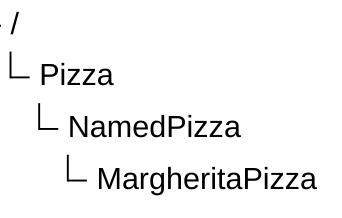

This hierarchy answered the first question:

> **What concepts exist within the `Pizza` domain?**

At this point, however, the ontology possessed only **conceptual structure**.

Although the ontology knew that `MargheritaPizza` was a specialized type of `NamedPizza`, it still had no understanding of **why** a pizza should be considered a Margherita pizza.

> The class existed, but its semantic meaning had not yet been defined.

This chapter begins **Stage 2 -- Semantic Description**, where concepts evolve from simple names into formally defined semantic entities.

Rather than merely organizing concepts into a hierarchy, we begin describing the characteristics that distinguish one concept from another. In OWL, these semantic descriptions are expressed through **class expressions** and **logical restrictions**, enabling machines to interpret concepts according to their formal meaning rather than their names alone.

Exercise 15 introduces this important transition by defining the first semantic characteristics of `MargheritaPizza`.

Instead of:

> simply stating that a Margherita pizza exists,

we begin:

> specifying the conditions that describe it, such as the toppings that characterize this familiar pizza variety.

Although the practical exercise requires adding only two OWL restrictions, its engineering significance extends far beyond the Protégé user interface.

For the first time, the ontology begins expressing **machine-understandable semantics**.

This distinction marks an important milestone in ontology engineering.

A conceptual hierarchy alone provides organization, but it cannot explain the meaning of the concepts it contains.

Semantic description transforms that hierarchy into a formal knowledge model capable of supporting **validation**, **inference**, **reuse**, and ultimately **intelligent behavior**.

This progression reflects a principle found throughout engineering.

- Software architects first identify classes before implementing their behavior.
- Database designers first identify entities before defining integrity constraints.
- Enterprise architects first establish architectural elements before specifying their relationships and responsibilities.
- Ontology engineering follows exactly the same philosophy: concepts should first be identified, only then should their semantics be defined.

The transition from **Conceptual Modeling** to **Semantic Description** therefore represents far more than the addition of OWL syntax. It marks the point at which an ontology begins transforming from a conceptual classification system (taxonomy) into a formal semantic knowledge model.

Throughout this chapter, we will examine semantic description from multiple complementary perspectives. Beginning with the practical creation of OWL restrictions in Protégé, we will progressively explore existential restrictions, class expressions, the philosophical foundations of semantic definition, and the mathematical principles that ultimately evolved into modern **Description Logic**, the formal language upon which OWL is built.

By the end of this chapter, you will recognize that a semantic restriction is far more than a line of OWL syntax. It represents the first formal statement of meaning within an ontology and establishes the semantic foundation upon which automated reasoning, knowledge reuse, governance, and executable intelligence will be progressively constructed throughout the remaining stages of the **Semantic Knowledge Development Lifecycle (SKDL)**.

## 17.2 Learning Objectives

After completing this chapter, you should be able to achieve the following learning outcomes.

**Knowledge**
- Explain why **Semantic Description** is the second stage of the **Semantic Knowledge Development Lifecycle (SKDL)**.
- Describe the purpose of **OWL restrictions** in defining the meaning of ontology concepts.
- Understand the difference between **conceptual organization** and **semantic description**.
- Explain the semantic meaning of **existential restrictions (`some`) in OWL**.
- Understand how **class expressions** describe concepts through logical conditions rather than hierarchical structure.

**Practical Skills**
- Create **existential restrictions** using the Protégé Class Expression Editor.
- Define concepts using **OWL class expressions**.
- Apply multiple semantic restrictions to describe a domain concept.
- Use **auto-completion (`Ctrl` + `Space`)** to efficiently construct OWL expressions.
- Synchronize the reasoner to verify the consistency of newly added semantic descriptions.

**Engineering Perspective**
- Explain why semantic description follows conceptual modeling within the SKDL.
- Recognize semantic restrictions as **formal descriptions of meaning** rather than merely Protégé syntax.
- Understand how semantic descriptions prepare an ontology for **knowledge reuse**, **validation**, **reasoning**, and **machine interpretation**.
- Explain how Stage 2 enriches the **$K$ — Knowledge Graph** layer and establishes the foundation for the **$R$ — Reasoning & Rules** layer within the **Executable Knowledge Architecture (EKA)**.
- Appreciate that semantic description represents the transition from a **conceptual taxonomy** to a **machine-understandable semantic knowledge model**.

## 17.3 Position Within SKDL -- Stage 2 Highlighted

As introduced in **Chapter (15)**, ontology engineering progresses through the seven stages of the **Semantic Knowledge Development Lifecycle (SKDL)**, each stage contributing a distinct engineering objective toward the construction of executable semantic knowledge systems.

Having completed **Stage 1 -- Conceptual Modeling** in the previous chapter, this chapter advances to **Stage 2 -- Semantic Description**, highlighted below:

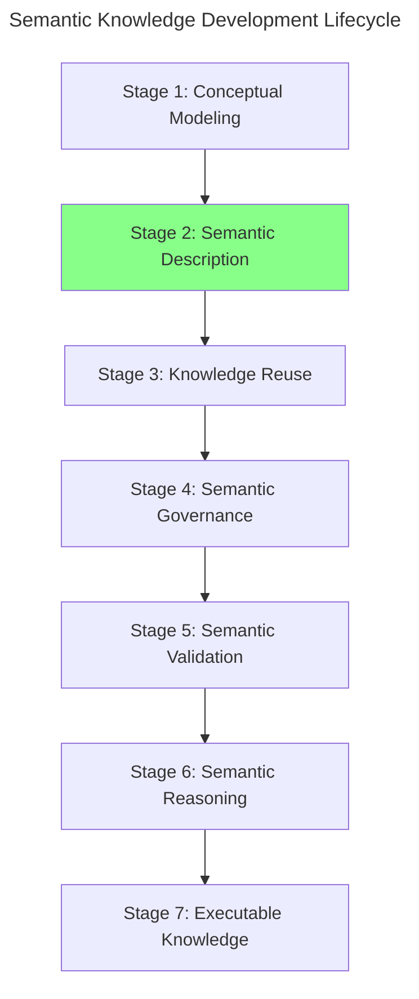

Although the ontology already contains a conceptual hierarchy, concepts alone are insufficient for machine understanding.

At the completion of **Stage 1**, the ontology could answer questions such as:

- Which concepts exist?
- How are they organized?
- Which concepts specialize others?

However, it still could not answer a much more important question:

> **What does each concept actually mean?**

Providing formal answers to that questions is the primary objective of **Stage 2 -- Semantic Description**.

Rather than introducing new concepts, this stage enriches the existing conceptual vocabulary by attaching formal semantic definitions to classes through **OWL class expressions, property restrictions**, and other logical constructs.

For example, in the previous chapter the ontology introduced the concept:

`MargheritaPizza`

At that stage, the class served only as a conceptual placeholder within the taxonomy.

During this chapter, the ontology begins to describe its semantic meaning by stating that a `MargheritaPizza` has toppings such as `MozzarellaTopping` and `TomatoTopping`.

These statements are not merely annotations for human readers.

They are formal logical expressions that become part of the ontology's machine-interpretable semantics, allowing automated reasoners to understand, validate, and eventually infer new knowledge.

Consequently, the primary deliverable of **Stage 2** is not longer a conceptual hierarchy, but a **semantic model** in which concepts are enriched with logical meaning.

This distinction is fundamental:
- Stage 1 establishes **what** exists.
- Stage 2 begins defining **what those concepts mean**.

Within the **Executable Knowledge Architecture (EKA)** framework, this stage continues enriching the **$K$ -- Knowledge Graph** layer by transforming conceptual nodes into semantically described knowledge objects.

Although reasoning has not yet become the primary focus of development, the semantic descriptions introduced during this stage establish the logical foundation upon which the **$R$ -- Reasoning & Rules** layer will later operate.

The relationship between the first two stages of SKDL can therefore be summarized as follows:

| Stage | Primary Engineering Objective | Primary Deliverable |
| --- | --- | --- |
| **Stage 1 -- Conceptual Modeling** | Identify and organize domain concepts into a coherent taxonomy. | Conceptual hierarchy (semantic taxonomy). |
| **Stage 2 -- Semantic Description** | Define the formal meaning of concepts using OWL class expressions and logical restrictions. | Semantically enriched ontology capable of supporting logical interpretation. |

Together, these two stages establish the semantic foundation of the ontology.

First, the ontology determines **what concepts exist**.

Then, it specifies **what those concepts mean**.

Only after both the conceptual structure and semantic descriptions have been established can subsequent stages introduce knowledge reuse, governance, validation, automated reasoning, and ultimately executable knowledge.

## 17.4 Exercise 15 -- Creating the First Semantic Description

Having established the engineering motivation for **Semantic Description**, we not turn to its practical implementation through **Exercise 15** in Michael DeBellis' *Protégé 5 New OWL `Pizza` Tutorial*.

This exercise represents the first hands-on activity of **Stage 2 -- Semantic Description** within the **Semantic Knowledge Development Lifecycle (SKDL)**.

Unlike the previous exercise, which focused on organizing concepts into a conceptual hierarchy, Exercise 15 introduces the first formal semantic descriptions of those concepts.

The practical modeling task remains intentionally simple.

Rather than constructing a complete semantic definition for `MargheritaPizza`, the exercise introduces only two existential restrictions:

- `hasTopping some MozzarellaTopping`
- `hasTopping some TomatoTopping`

Although these additions appear modest, they represent a significant milestone in ontology engineering.

For the first time, the ontology begins expressing `machine-understandable meaning` rather than merely identifying concepts.

The overall workflow of Exercise 15 can be summarized as follows:

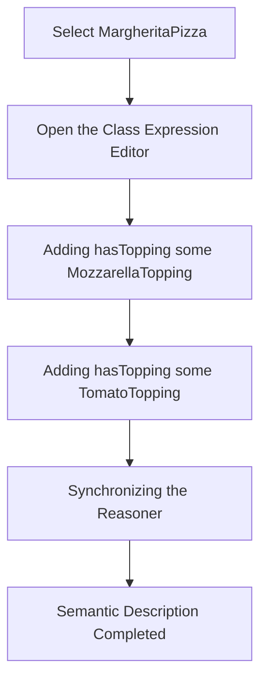

Unlike Chapter (16), where the primary objective was to determine **what concepts exist**, the objective of this exercise is fundamentally different.

Rather than introducing new classes, we enrich an existing concepts by describing the semantic characteristics that distinguish it from other pizzas.

This distinction marks the transition from **conceptual organization** toward **semantic definition**.

### 17.4.1 Engineering Objective

At the completion of **Exercise 14**, the ontology already contained the following conceptual hierarchy:


Those 3 concepts are highlighted in below screen in Protégé:

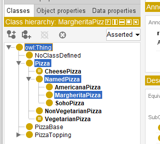

This hierarchy successfully established that a `MargheritaPizza` is a specialized type of `NamedPizza`, which in turn is a specialized type of `Pizza`.

However, the ontology still lacked an answer to an obvious semantic question:

> **Why should a pizza be considered a Margherita pizza?**

The class existed only as a conceptual category.

Nothing within the ontology explained the characteristics that distinguished a Margherita pizza from every other named pizza.

Exercise 15 begins answering that question by introducing formal semantic descriptions using **OWL class expressions**.

Rather than relying on the class name itself, the ontology starts defining the concept through logical conditions that software systems can interpret and reason about.

Consequently, the engineering objective of this exercise is not simply to add OWL syntax.

Its objective is to transform a conceptual class into a semantically described concept.

### 17.4.2 Opening the Class Expression Editor

To begin the exercise, selce `MargheritaPizza` from the class hierarchy within the **Classes** tab.

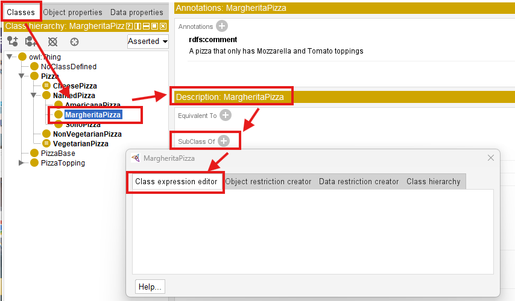

In the **Description** view, locate the **SubClassOf** section and click the **Add (+)** button.

Instead of using the Object Restriction Creator introduced in earlier exercises, Exercise 15 now employs the **Class Expression Editor**.

This editor allows ontology engineers to construct complete OWL class expressions directly using Description Logic syntax.

It therefore represents one of the most important editing interfaces within Protégé, as many advanced semantic definitions are created through this editor.

### 17.4.3 Creating the First Semantic Restriction

After opening the dialog, switch to the `Class Expression Editor` tab.

Enter the following expression:

`hasTopping some MozzarellaTopping`

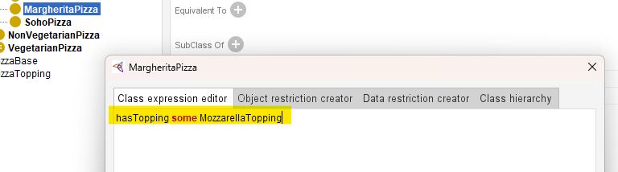

Rather than typing the complete topping name manually, Protégé provides a highly useful productivity feature.

After typing `hasTopping some Mo`, press `Ctrl + Space`, Protégé automatically searches the ontology for matching entities.

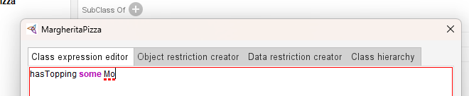

> [!Note] You need ensure you're in the English input mode for these shortcut working.

If only one candidate exists, the editor completes the remaining text automatically.

If multiple candidates match the partial name, Protégé presents a list of possible completions from which you may select the desired concept.

Although this shortcut appears minor, experienced ontology engineers use it continuously when constructing large ontologies containing hundreds of even thousands of classes and properties.

Using auto-completion:
- reduces typing errors,
- improves modeling efficiency, and
- encourages the consistent reuse of existing ontology entities.

### 17.4.4 Adding the Second Restriction

After confirming the first restriction, repeat the same procedure to add a second semantic description:

`hasTopping some TomatoTopping`

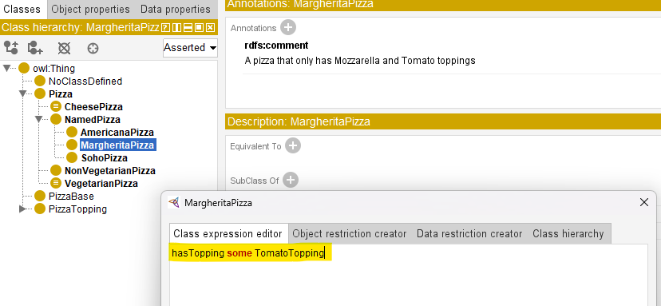

At this point, `MargheritaPizza` now contains two independent existential restrictions.

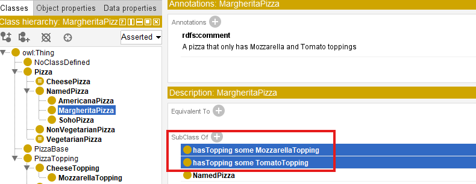

Unlike programming languages, where multiple statements are executed sequentially, OWL treats these restrictions as logical conditions that collectively contribute to the semantic description of the class.

Each restriction captures one aspect of the concept's meaning.

Together, they begin forming a richer semantic definition of `MargheritaPizza`.

Although the ontology still does not provide a complete definition of a Margherita pizza, it has now taken its first beyond conceptual classification.

### 17.4.5 Synchronizing the Reasoner

After both restrictions have been added, synchronize the reasoner.

Running the reasoners ensures that the newly introduced semantic description remain logically consistent with the existing ontology.

Although no new inferred classification appear at this stage, regularly synchronizing the reasoner is considered good engineering practice.

Frequent validation allows modeling errors to be detected early, when they are still relatively easy to correct.

Professional ontology development follows an incremental cycle:

> **Model $\rightarrow$ Validate $\rightarrow$ Refine**

rather than postponing validation until the ontology has become substantially larger.

### 17.4.6 Understanding What Was Actually Added

From the perspective of Protégé, Exercise 15 appears to involve only two additional entries beneath the **SubClass Of** section.

From the perspective of ontology engineering, however, something much more significant has occurred.

Before this exercise, the ontology contains only the conceptual statement:

```text
MargheritaPizza
    SubClassOf NamedPizza
```

After completing the exercise, the semantic description has evolved into:

```text
MargheritaPizza
    SubClassOf NamedPizza

    hasTopping some MozzarellaTopping

    hasTopping some TomatoTopping
```

The ontology no longer identifies only **where** `MargheritaPizza` belongs within the taxonomy.

It also begins expressing **what characteristics distinguish it**.

This represents the ontology's first formal semantic description.

The concept has progressed from

> being merely a named category

toward

> becoming a **logically described** class.

### 17.4.7 From Concept to Definition

Exercise 15 illustrates one of the central principles of ontology engineering.

Stage 1 established **conceptual identity**.

Stage 2 begins establishing **semantic meaning**.

This distinction is fundamental.

Conceptual Modeling determines that a concept exists.

Semantic Description specifies the logical conditions that characterize that concept.

The ontology therefore progresses from asking:

> **What concepts exist?**

to asking:

> **What formally defines those concepts?**

This progression transforms a conceptual taxonomy into a semantic knowledge model capable of supporting automated interpretation.

### 17.4.8 Engineering Perspective

Exercise 15 demonstrates an important distinction between **learning Protégé** and **learning ontology engineering**.

From the perspective of Protégé, you simply just enter two class expressions and then synchronize the reasoner.

From the perspective of ontology engineering, however, you have introduced the ontology's **first formal semantic definitions**.

Although only two restrictions have been added, they fundamentally change the role of the ontology.

Previously, the ontology organized concepts.

Now, it begins describing their **meaning**.

This marks the transition from a **semantic taxonomy** to a **machine-interpretable semantic model**.

Every subsequent semantic definition introduced throughout the remainder of the tutorial will build upon this same modeling approach.

The engineering contribution of **Exercise 15** can be summarized as below table:

| Engineering Perspective | Contribution from Exercise 15 |
| --- | --- |
| SKDL Stage | Stage 2 -- Semantic Description |
| Primary Objective | Define the semantic meaning of ontology concepts using OWL class expressions and logical restrictions. |
| Modeling Activity | Add existential restrictions describing the toppings associated with `MargheritaPizza`. |
| Engineering Outcome | Transform a conceptual class into a semantically described ontology concept. |
| Preparation for Later Chapters | Establish the semantic foundation required for knowledge reuse, validation, reasoning, and ultimately executable intelligence. |

Although **Exercise 15** introduces only two semantic restrictions, it represents one of the most important transitions within the **Semantic Knowledge Development Lifecycle (SKDL)**.

From this point onward, the ontology is no longer concerned solely with identifying concepts. It begins constructing a formal semantic model in which concepts are defined through **logical meaning**, enabling machines to **interpret**, **validate**, and eventually **reason** over the knowledge they represent.

## 17.5 Why Semantic Description Follows Conceptual Modeling

The transition from **Conceptual Modeling** to **Semantic Description** represents one of the most important engineering principles in ontology development:

> **A concept must be identified before its meaning can be formally defined.**

Although conceptual models and semantic descriptions are closely connected, they solve fundamentally different problems.

Conceptual Modeling answers:

> **What concepts exist in the domain?**

While, Semantic Description answers:

> **What conditions define the meaning of those concepts?**

Confusing these two stages often leads:
- unstable ontologies,
- unnecessary redesign, and
- semantic inconsistencies.

Professional ontology engineering therefore follows a disciplined progression:

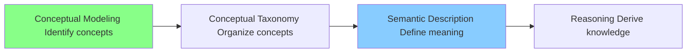

The purpose of this section is to understand why semantic descriptions should be introduced only after the conceptual foundation has become sufficiently stable.

### 17.5.1 The Universal Engineering Principle: Structure Before Detail

The relationship between conceptual modeling and semantic description reflect a broader principle found across many engineering disciplines:

> **Establish the structure first, then define the detailed behavior and constraints.**

This principle is not unique to ontology engineering.

It appears repeatedly in software architecture, database design, enterprise architecture, and many other engineering practices.

#### 17.5.1.1 Software Engineering

Software engineers normally do not begin by implementing complex business logic before identifying the fundamental software entities.

A typical progression is:

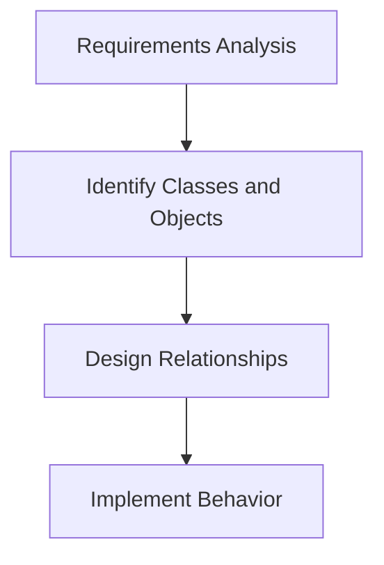

For example, before implementing methods for a `CustomerOrder` class, developers first need to determine:
- What is a customer?
- What is an order?
- How are customers and orders related?

Without a stable conceptual model, implementation details are likely to change repeatedly.

Ontology engineering follows the same philosophy.

Before defining:

```text
MargheritaPizza
    hasTopping some MozzarellaTopping
```

ths ontology must first establish that:

```text
Pizza
    NamedPizza
        MargheritaPizza
```

represents a meaningful conceptual structure.

#### 17.5.1.2 Database Design

Database engineers follow a similar discipline.

Before defining:
- foreign keys;
- constraints;
- indexes; and
- transaction rules,

database designers first identify:
- entities;
- attributes; and
- relationships.

For example:

```text
Customer
    |
    places
    |
Order
```

must be understood before introducing database constraints.

A database schema with incorrect entities cannot be repaired simply by adding more constraints.

The same applies to ontologies:

> A semantically incorrect concept hierarchy cannot be fixed by adding more OWL restrictions.

#### 17.5.1.3 Enterprise Architecture

Enterprise architecture also separate conceptual understanding from detailed specification.

Before analyzing:
- application dependencies;
- integration patters; and
- technology platforms,

architects first establish:
- business capabilities;
- organizational concepts; and
- information domains.

For example:

```text
Business Capability
    |
    supports
    |
Business Process
```

must be conceptually understood before detailed architecture decisions can be made.

#### 17.5.1.4 Ontology Engineering

Ontology engineering applies the same engineering discipline:

| Engineering Discipline | First Establish | Then Define |
| --- | --- | --- |
| Software Engineering | Classes and objects | Behavior and implementation |
| Database Design | Entities and relationships | Constraints and optimization |
| Enterprise Architecture | Capabilities and domains | Architecture decisions |
| Ontology Engineering | Concepts and taxonomy | Semantic restrictions and logical axioms |

The pattern is consistent:

> **Conceptual structure provides the foundation upon which detailed meaning is built.**

### 17.5.2 Why Introducing Semantics Too Early Creates Problems

A common beginner mistake in ontology engineering is attempting to define detailed semantic restrictions immediately after creating a class.

For example, imaging starting with:

```
MargheritaPizza`
```

and immediately adding:

```
MargheritaPizza
    hasTopping some MozzarellaTopping
```

At first glance, this appears reasonable.

However, several important questions remain unanswered:
- Is `MargheritaPizza` correctly positioned in the hierarchy?
- Should it be a subclass of `NamedPizza`?
- Should there be another abstraction such as `ItalianPizza`?
- Are toppings the correct defining characteristics?
- Should ingredients, cooking methods, or regional origins also contribute to the definition?

If the conceptual model later changes, every semantic restriction attached to those concepts may require modification.

This creates unnecessary complexity.

The engineering consequence is:

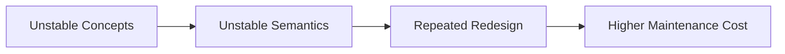

Therefore, professional ontology development separates:

> Conceptual Stability

before:

> Semantic Complexity.

### 17.5.3 Exercise 14 and Exercise 15 Demonstrate This Principle

The design of Michael DeBellis' *Protégé 5 New OWL Pizza Tutorial* intentionally follows this engineering sequence.

**Exercise 14**

First, the ontology establishes conceptual organization:

```text
Pizza
    NamedPizza
        MargheritaPizza
```

At this stage, the ontology knows:
- what concepts exist;
- how concepts are related; and
- where each concept belongs in the taxonomy.

However, it does not yet define the detailed meaning fo these concepts.

**Exercise 15**

Only after the hierarchy exists does the ontology introduce semantic meaning:

```text
MargheritaPizza
    SubClassOf
        hasTopping some MozzarellaTopping

MargheritaPizza
    SubClassOf
        hasTopping some TomatoTopping
```

Now the ontology can express:

> A `MargheritaPizza` is not only a named pizza, it is a pizza concept characterized by specific semantic conditions.

The sequence is therefore like below:

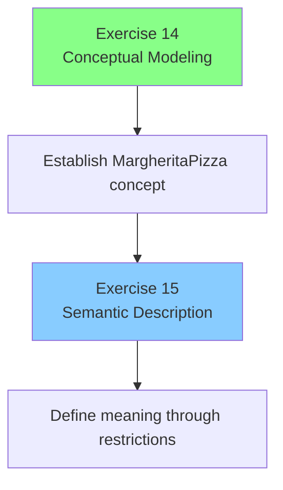

This separation is deliberate.

The tutorial is not simply teaching Protégé operations. It is teaching a professional ontology engineering methodology.

### 17.5.4 Concept Maturity Before Semantic Commitment

A useful way to understand this engineering principle is through the concept of **concept maturity**.

Not every newly discovered concept is immediately ready for detailed semantic definition.

A concept typically evolves through several levels:

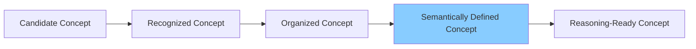

**Candidate Concept**

A possible domain idea has been identified.

Example:

```
SpecialPizza
```

At this stage, its meaning may still be unclear.

**Recognized Concept**

The concept is accepted as meaningful within the domain.

Example:

```
NamedPizza
```

The ontology community agrees that named pizzas represent a useful category.

**Organized Concept**

The concept has a defined position in the taxonomy.

```text
Pizza
    NamedPizza
        MargheritaPizza
```

**Semantically Defined Concept**

Formal restrictions are introduced.

Example:

```text
MargheritaPizza
    hasTopping some MozzarellaTopping
```

**Reasoning-Ready Concept**

The ontology contains sufficient formal semantics to support inference (through reasoning).

This maturity model explains why ontology engineering is an incremental process.

### 17.5.5 The Connection with "Delay Decisions Until Understanding Improves"

This engineering approach also reflects a broader principle used in modern software and system engineering:

> **Delay irreversible decisions until sufficient understanding exists.**

In agile development, architects avoid excessive upfront assumptions because requirements evolve.

Ontology engineering follows the same principle.

A premature semantic definition can become a constraint that limits future modeling choices.

By first establishing conceptual structures (through conceptual modeling), ontology engineers preserve flexibility while gradually increasing semantic precision.

The result is a more adaptable knowledge model:

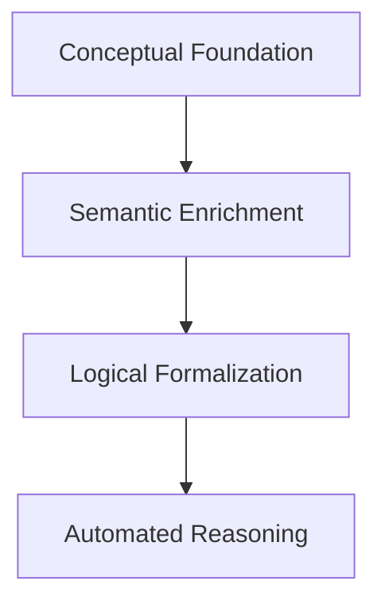

### 17.5.6 Engineering Takeaway

Conceptual Modeling and Semantic Description are not competing activities.

They are complementary stages of knowledge engineering.

- Conceptual Modeling creates the **semantic vocabulary**.
- Semantic Description defines the **formal meaning** of that vocabulary.

The relationship can be summarized as:

> **Conceptual Modeling tells us what exists. Semantic **

Within the Semantic Knowledge Development Lifecycle:

- Stage 1 - Conceptual Modeling: establishes concepts and taxonomy
- Stage 2 - Semantic Description: enriches concepts with formal meaning

Only after both stages have been completed does an ontology become sufficiently expressive for advanced capabilities such as **reasoning**, **validation**, **knowledge reuse**, and **executable intelligence**.

Therefore, the engineering discipline established in this chapter can be summarized by one fundamental rule:

> **Do not define complex semantics for concepts that have not yet achieved conceptual stability.**

This principle is the foundation for building ontologies that remain understandable maintainable, and scalable as semantic knowledge systems evolve.

## 17.6 Introduction to Description Logic (DL) -- The Formal Language Behind OWL

Having established **why Semantic Description follows Conceptual Modeling** in the previous sections, we are now ready to examine the formal language that makes semantic description precise, machine interpretable, and logically verifiable.

Although Protégé allows use to create *classes, properties, and restrictions* through an intuitive graphical interface, the ontology is not stored merely as a collection of diagrams or forms. Behind every OWL construct lies a rigorous logical language known as **Description Logic (DL)**.

Understanding this language is not required to operate Protégé effectively.

## 17.7 Existential Restrictions (`some`) -- The First DL Constructor

## 17.8 Class Expressions -- Combining Meaning Through Logic

## 17.9 Mathematical View -- Semantic Description as Formal Knowledge Representation

## 17.10 Interesting Reading -- From Aristotle to Description Logic

## 17.11 Engineering Perspective -- Meaning Before Reasoning

## 17.12 EKA Perspective -- Stage 2 Enriches $K$ and Prepares $R$

## 17.13 Engineering Guidelines

Examples:

- Don't over-constrain too early
- Add semantics incrementally
- Reuse restrictions
- Prefer readable class expressions
- Validate after every change
- Use the reasoner continuously

## 17.14 Key Concepts

## 17.15 Chapter Summary

## 17.16 Looking Ahead -- Toward Knowledge Reuse

---

Last Updated at 2026-07-18