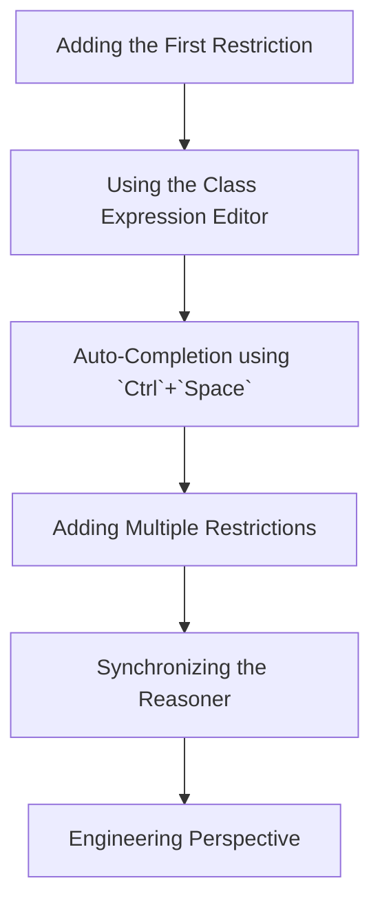

# Chapter 17 — Semantic Description: Stage 2 of the Semantic Knowledge Development Lifecycle

**Defining Concepts Through OWL Restrictions**

- [17.1 Introduction -- From Concepts to Meaning](#171-introduction----from-concepts-to-meaning)
- [17.2 Learning Objectives](#172-learning-objectives)
- [17.3 Position Within SKDL -- Stage 2 Highlighted](#173-position-within-skdl----stage-2-highlighted)
- [17.4 Exercise 15 -- Creating the First Semantic Description](#174-exercise-15----creating-the-first-semantic-description)
- [17.5 Why Semantic Description Follows Conceptual Modeling](#175-why-semantic-description-follows-conceptual-modeling)
- [17.6 Existential Restrictions (`some`)](#176-existential-restrictions-some)
- [17.7 Class Expression: Describing Meaning Rather Than Structure](#177-class-expression-describing-meaning-rather-than-structure)
- [17.8 Interesting Reading -- From Aristotle to Description Logic](#178-interesting-reading----from-aristotle-to-description-logic)
- [17.9 Engineering Perspective -- Meaning Before Reasoning](#179-engineering-perspective----meaning-before-reasoning)
- [17.10 EKA Perspective -- Stage 2 Enriches $K$ and Prepares $R$](#1710-eka-perspective----stage-2-enriches-k-and-prepares-r)
- [17.11 Engineering Guidelines](#1711-engineering-guidelines)
- [17.12 Key Concepts](#1712-key-concepts)
- [17.13 Chapter Summary](#1713-chapter-summary)
- [17.14 Looking Ahead -- Toward Knowledge Reuse](#1714-looking-ahead----toward-knowledge-reuse)

## 17.1 Introduction -- From Concepts to Meaning

## 17.2 Learning Objectives

## 17.3 Position Within SKDL -- Stage 2 Highlighted

## 17.4 Exercise 15 -- Creating the First Semantic Description

The Exercise 15 could be viewed as following steps:

## 17.5 Why Semantic Description Follows Conceptual Modeling

## 17.6 Existential Restrictions (`some`)

## 17.7 Class Expression: Describing Meaning Rather Than Structure

## 17.8 Interesting Reading -- From Aristotle to Description Logic

## 17.9 Engineering Perspective -- Meaning Before Reasoning

## 17.10 EKA Perspective -- Stage 2 Enriches $K$ and Prepares $R$

## 17.11 Engineering Guidelines

Examples:

- Don't over-constrain too early
- Add semantics incrementally
- Reuse restrictions
- Prefer readable class expressions
- Validate after every change
- Use the reasoner continuously

## 17.12 Key Concepts

## 17.13 Chapter Summary

## 17.14 Looking Ahead -- Toward Knowledge Reuse

---

Last Updated at 2026-07-16