# Chapter 17 — Semantic Description: Stage 2 of the Semantic Knowledge Development Lifecycle

**Defining Concepts Through OWL Restrictions**

- [17.1 Introduction -- From Concepts to Meaning](#171-introduction----from-concepts-to-meaning)
- [17.2 Learning Objectives](#172-learning-objectives)
- [17.3 Position Within SKDL -- Stage 2 Highlighted](#173-position-within-skdl----stage-2-highlighted)
- [17.4 Exercise 15 -- Creating the First Semantic Description](#174-exercise-15----creating-the-first-semantic-description)
  - [17.4.1 Engineering Objective](#1741-engineering-objective)
  - [17.4.2 Opening the Class Expression Editor](#1742-opening-the-class-expression-editor)
  - [17.4.3 Creating the First Semantic Restriction](#1743-creating-the-first-semantic-restriction)
  - [17.4.4 Adding the Second Restriction](#1744-adding-the-second-restriction)
  - [17.4.5 Synchronizing the Reasoner](#1745-synchronizing-the-reasoner)
  - [17.4.6 Understanding What Was Actually Added](#1746-understanding-what-was-actually-added)
  - [17.4.7 From Concept to Definition](#1747-from-concept-to-definition)
  - [17.4.8 Engineering Perspective](#1748-engineering-perspective)
- [17.5 Why Semantic Description Follows Conceptual Modeling](#175-why-semantic-description-follows-conceptual-modeling)
  - [17.5.1 The Universal Engineering Principle: Structure Before Detail](#1751-the-universal-engineering-principle-structure-before-detail)
    - [17.5.1.1 Software Engineering](#17511-software-engineering)
    - [17.5.1.2 Database Design](#17512-database-design)
    - [17.5.1.3 Enterprise Architecture](#17513-enterprise-architecture)
    - [17.5.1.4 Ontology Engineering](#17514-ontology-engineering)
  - [17.5.2 Why Introducing Semantics Too Early Creates Problems](#1752-why-introducing-semantics-too-early-creates-problems)
  - [17.5.3 Exercise 14 and Exercise 15 Demonstrate This Principle](#1753-exercise-14-and-exercise-15-demonstrate-this-principle)
  - [17.5.4 Concept Maturity Before Semantic Commitment](#1754-concept-maturity-before-semantic-commitment)
  - [17.5.5 The Connection with "Delay Decisions Until Understanding Improves"](#1755-the-connection-with-delay-decisions-until-understanding-improves)
  - [17.5.6 Engineering Takeaway](#1756-engineering-takeaway)
- [17.6 Introduction to Description Logic (DL) -- The Formal Language Behind OWL](#176-introduction-to-description-logic-dl----the-formal-language-behind-owl)
  - [17.6.1 What Is Description Logic?](#1761-what-is-description-logic)
  - [17.6.2 Why Does OWL Need Description Logic?](#1762-why-does-owl-need-description-logic)
  - [17.6.3 The Relationship Between OWL and Description Logic](#1763-the-relationship-between-owl-and-description-logic)
  - [17.6.4 The Three Fundamental Building Blocks of Description Logic](#1764-the-three-fundamental-building-blocks-of-description-logic)
  - [17.6.5 Decidability -- Why Description Logic Matters](#1765-decidability----why-description-logic-matters)
  - [17.6.6 Description Logic in Exercise 15](#1766-description-logic-in-exercise-15)
  - [17.6.7 Preparing for the First Description Logic Constructor](#1767-preparing-for-the-first-description-logic-constructor)
- [17.7 Existential Restrictions (`some`) -- The First Description Logic Constructor](#177-existential-restrictions-some----the-first-description-logic-constructor)
  - [17.7.1 From  Naming Concepts to Description Concepts](#1771-from--naming-concepts-to-description-concepts)
  - [17.7.2 Understanding "At Least One"](#1772-understanding-at-least-one)
  - [17.7.3 How Existential Restrictions Supports Automated Classification](#1773-how-existential-restrictions-supports-automated-classification)
  - [17.7.4 Semantic Descriptions Grow Incrementally](#1774-semantic-descriptions-grow-incrementally)
  - [17.7.5 Common Misunderstandings About Existential Restrictions](#1775-common-misunderstandings-about-existential-restrictions)
  - [17.7.6 Engineering Takeaway](#1776-engineering-takeaway)
- [17.8 Class Expressions -- Building Semantic Meaning with Description Logic](#178-class-expressions----building-semantic-meaning-with-description-logic)
  - [17.8.1 From Individual Restrictions to Complete Semantic Descriptions](#1781-from-individual-restrictions-to-complete-semantic-descriptions)
  - [17.8.2 What Is a Class Expression?](#1782-what-is-a-class-expression)
  - [17.8.3 Named Classes and Anonymous Classes](#1783-named-classes-and-anonymous-classes)
  - [17.8.4 Description Logic as a Language of Composition](#1784-description-logic-as-a-language-of-composition)
  - [17.8.5 Semantic Composition in the `Pizza` Ontology](#1785-semantic-composition-in-the-pizza-ontology)
  - [17.8.6 Necessary Conditions Versus Complete Definitions](#1786-necessary-conditions-versus-complete-definitions)
  - [17.8.7 Open World Assumption Enables Incremental Semantic Modeling](#1787-open-world-assumption-enables-incremental-semantic-modeling)
  - [17.8.8 Engineering Perspective -- Building Meaning Incrementally](#1788-engineering-perspective----building-meaning-incrementally)
  - [17.8.9 Preparing for Future Chapters](#1789-preparing-for-future-chapters)
- [17.9 Mathematical Perspective -- Semantic Description as Formal Knowledge Representation](#179-mathematical-perspective----semantic-description-as-formal-knowledge-representation)
  - [17.9.1 From Conceptual Sets to Semantic Sets](#1791-from-conceptual-sets-to-semantic-sets)
  - [17.9.2 Object Properties as Binary Relations](#1792-object-properties-as-binary-relations)
  - [17.9.3 Existential Restrictions as Set constructors](#1793-existential-restrictions-as-set-constructors)
  - [17.9.4 Building Meaning Through Set Operations](#1794-building-meaning-through-set-operations)
- [17.9.5 Interpretation Functions Give Meaning to Syntax](#1795-interpretation-functions-give-meaning-to-syntax)
  - [17.9.6 Consistency, Satisfiability, and Logical Soundness](#1796-consistency-satisfiability-and-logical-soundness)
  - [17.9.7 Decidability Makes Automated Reasoning Possible](#1797-decidability-makes-automated-reasoning-possible)
  - [17.9.8 From Mathematics to Engineering](#1798-from-mathematics-to-engineering)
- [17.10 Interesting Reading -- From Aristotle to Description Logic](#1710-interesting-reading----from-aristotle-to-description-logic)
  - [17.10.1 Aristotle -- the Birth of Conceptual Definition](#17101-aristotle----the-birth-of-conceptual-definition)
  - [17.10.2 Porphyry's Tree -- Visualizing Hierarchical Knowledge](#17102-porphyrys-tree----visualizing-hierarchical-knowledge)
  - [17.10.3 Leibniz -- The Dream of a Universal Knowledge Language](#17103-leibniz----the-dream-of-a-universal-knowledge-language)
  - [17.10.4 Frege -- Modern Predicate Logic](#17104-frege----modern-predicate-logic)
  - [17.10.5 Description Logic -- Making Logic Computable](#17105-description-logic----making-logic-computable)
  - [17.10.6 OWL -- The Modern Realization of a Two-Thousand-Year Journey](#17106-owl----the-modern-realization-of-a-two-thousand-year-journey)
  - [17.10.7 Reflection -- Why Ontology Engineering Is Different](#17107-reflection----why-ontology-engineering-is-different)
- [17.11 Engineering Perspective -- Meaning Before Reasoning](#1711-engineering-perspective----meaning-before-reasoning)
  - [17.11.1 Semantics Description Provides the Raw Material for Reasoning](#17111-semantics-description-provides-the-raw-material-for-reasoning)
  - [17.11.2 Every Restriction Should Capture One Independent Semantic Fact](#17112-every-restriction-should-capture-one-independent-semantic-fact)
  - [17.11.3 Engineering Analogy -- Blueprint Before Construction](#17113-engineering-analogy----blueprint-before-construction)
  - [17.11.4 Incremental Semantic Maturity](#17114-incremental-semantic-maturity)
  - [17.11.5 Design Semantic Models for Humans First](#17115-design-semantic-models-for-humans-first)
  - [17.11.6 Let the Reasoner Become Your Design Assistent](#17116-let-the-reasoner-become-your-design-assistent)
  - [17.11.7 Engineering Discipline Throughout the Semantic Knowledge Development Lifecycle](#17117-engineering-discipline-throughout-the-semantic-knowledge-development-lifecycle)
  - [17.11.8 Engineering Takeaway](#17118-engineering-takeaway)
- [17.12 EKA Perspective -- Stage 2 Enriches $K$ and Prepares $R$](#1712-eka-perspective----stage-2-enriches-k-and-prepares-r)
- [17.13 Engineering Guidelines](#1713-engineering-guidelines)
- [17.14 Key Concepts](#1714-key-concepts)
- [17.15 Chapter Summary](#1715-chapter-summary)
- [17.16 Looking Ahead -- Toward Knowledge Reuse](#1716-looking-ahead----toward-knowledge-reuse)

## 17.1 Introduction -- From Concepts to Meaning

Every successful knowledge system begins by answering two fundamental questions:

> **What concepts exist?**

and

> **What do those concepts actually mean?**

Although these questions appear closely related, they represent two distinct stages of ontology engineering.

In **Chapter (16)**, we completed **Stage 1 -- Conceptual Modeling** of the **Semantic Knowledge Development Lifecycle (SKDL)**. Rather than describing concepts in detail, we focused on identifying the conceptual vocabulary of the domain and organizing it into a coherent semantic taxonomy. Through Exercise 14, the `Pizza` ontology established the first meaningful class hierarchy:

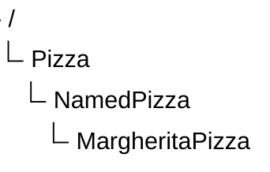
```mermaid
treeView-beta
"Pizza"
    "NamedPizza"
        "MargheritaPizza"
```

This hierarchy answered the first question:

> **What concepts exist within the `Pizza` domain?**

At this point, however, the ontology possessed only **conceptual structure**.

Although the ontology knew that `MargheritaPizza` was a specialized type of `NamedPizza`, it still had no understanding of **why** a pizza should be considered a Margherita pizza.

> The class existed, but its **semantic meaning** had not yet been defined.

This chapter begins **Stage 2 -- Semantic Description**, where concepts evolve from simple names into formally defined semantic entities.

Rather than merely organizing concepts into a hierarchy, we begin describing the characteristics that distinguish one concept from another. In OWL, these semantic descriptions are expressed through **class expressions** and **logical restrictions**, enabling machines to interpret concepts according to their formal meaning rather than their names alone.

Exercise 15 introduces this important transition by defining the first semantic characteristics of `MargheritaPizza`.

Instead of:

> simply stating that a Margherita pizza exists,

we begin:

> specifying the conditions that describe it, such as the toppings that characterize this familiar pizza variety.

Although the practical exercise requires adding only two OWL restrictions, its engineering significance extends far beyond the Protégé user interface.

For the first time, the ontology begins expressing **machine-understandable semantics**.

This distinction marks an important milestone in ontology engineering.

A conceptual hierarchy alone provides organization, but it cannot explain the meaning of the concepts it contains.

Semantic description transforms that hierarchy into a formal knowledge model capable of supporting **validation**, **inference**, **reuse**, and ultimately **intelligent behavior**.

This progression reflects a principle found throughout engineering.

- Software architects first identify classes before implementing their behavior.
- Database designers first identify entities before defining integrity constraints.
- Enterprise architects first establish architectural elements before specifying their relationships and responsibilities.
- Ontology engineering follows exactly the same philosophy: concepts should first be identified, only then should their semantics be defined.

The transition from **Conceptual Modeling** to **Semantic Description** therefore represents far more than the addition of OWL syntax. It marks the point at which an ontology begins transforming from a conceptual classification system (taxonomy) into a formal semantic knowledge model.

Throughout this chapter, we will examine semantic description from multiple complementary perspectives. Beginning with the practical creation of OWL restrictions in Protégé, we will progressively explore existential restrictions, class expressions, the philosophical foundations of semantic definition, and the mathematical principles that ultimately evolved into modern **Description Logic**, the formal language upon which OWL is built.

By the end of this chapter, you will recognize that a semantic restriction is far more than a line of OWL syntax. It represents the first formal statement of meaning within an ontology and establishes the semantic foundation upon which automated reasoning, knowledge reuse, governance, and executable intelligence will be progressively constructed throughout the remaining stages of the **Semantic Knowledge Development Lifecycle (SKDL)**.

## 17.2 Learning Objectives

After completing this chapter, you should be able to achieve the following learning outcomes.

**Knowledge**
- Explain why **Semantic Description** is the second stage of the **Semantic Knowledge Development Lifecycle (SKDL)**.
- Describe the purpose of **OWL restrictions** in defining the meaning of ontology concepts.
- Understand the difference between **conceptual organization** and **semantic description**.
- Explain the semantic meaning of **existential restrictions (`some`) in OWL**.
- Understand how **class expressions** describe concepts through logical conditions rather than hierarchical structure.

**Practical Skills**
- Create **existential restrictions** using the Protégé Class Expression Editor.
- Define concepts using **OWL class expressions**.
- Apply multiple semantic restrictions to describe a domain concept.
- Use **auto-completion (`Ctrl` + `Space`)** to efficiently construct OWL expressions.
- Synchronize the reasoner to verify the consistency of newly added semantic descriptions.

**Engineering Perspective**
- Explain why semantic description follows conceptual modeling within the SKDL.
- Recognize semantic restrictions as **formal descriptions of meaning** rather than merely Protégé syntax.
- Understand how semantic descriptions prepare an ontology for **knowledge reuse**, **validation**, **reasoning**, and **machine interpretation**.
- Explain how Stage 2 enriches the **$K$ — Knowledge Graph** layer and establishes the foundation for the **$R$ — Reasoning & Rules** layer within the **Executable Knowledge Architecture (EKA)**.
- Appreciate that semantic description represents the transition from a **conceptual taxonomy** to a **machine-understandable semantic knowledge model**.

## 17.3 Position Within SKDL -- Stage 2 Highlighted

As introduced in **Chapter (15)**, ontology engineering progresses through the seven stages of the **Semantic Knowledge Development Lifecycle (SKDL)**, each stage contributing a distinct engineering objective toward the construction of executable semantic knowledge systems.

Having completed **Stage 1 -- Conceptual Modeling** in the previous chapter, this chapter advances to **Stage 2 -- Semantic Description**, highlighted below:

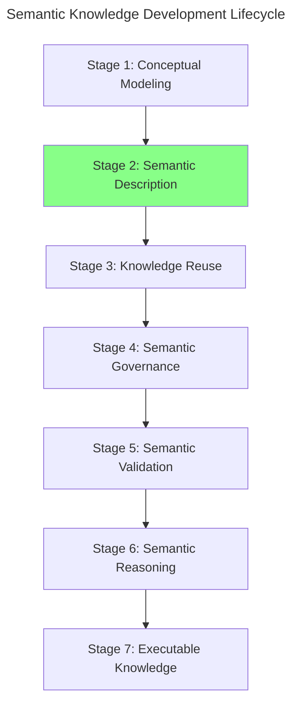
```mermaid
---
title: Semantic Knowledge Development Lifecycle
---
flowchart TD
A[Stage 1: Conceptual Modeling]
-->B[Stage 2: Semantic Description]
-->C[Stage 3: Knowledge Reuse]
-->D[Stage 4: Semantic Governance]
-->E[Stage 5: Semantic Validation]
-->F[Stage 6: Semantic Reasoning]
-->G[Stage 7: Executable Knowledge]
style B fill:#88FF88
```

Although the ontology already contains a conceptual hierarchy, concepts alone are insufficient for machine understanding.

At the completion of **Stage 1**, the ontology could answer questions such as:

- Which concepts exist?
- How are they organized?
- Which concepts specialize others?

However, it still could not answer a much more important question:

> **What does each concept actually mean?**

Providing formal answers to that questions is the primary objective of **Stage 2 -- Semantic Description**.

Rather than introducing new concepts, this stage enriches the existing conceptual vocabulary by attaching formal semantic definitions to classes through **OWL class expressions, property restrictions**, and other logical constructs.

For example, in the previous chapter the ontology introduced the concept:

`MargheritaPizza`

At that stage, the class served only as a conceptual placeholder within the taxonomy.

During this chapter, the ontology begins to describe its semantic meaning by stating that a `MargheritaPizza` has toppings such as `MozzarellaTopping` and `TomatoTopping`.

These statements are not merely annotations for human readers.

They are formal logical expressions that become part of the ontology's machine-interpretable semantics, allowing automated reasoners to understand, validate, and eventually infer new knowledge.

Consequently, the primary deliverable of **Stage 2** is not longer a conceptual hierarchy, but a **semantic model** in which concepts are enriched with logical meaning.

This distinction is fundamental:
- Stage 1 establishes **what** exists.
- Stage 2 begins defining **what those concepts mean**.

Within the **Executable Knowledge Architecture (EKA)** framework, this stage continues enriching the **$K$ -- Knowledge Graph** layer by transforming conceptual nodes into semantically described knowledge objects.

Although reasoning has not yet become the primary focus of development, the semantic descriptions introduced during this stage establish the logical foundation upon which the **$R$ -- Reasoning & Rules** layer will later operate.

The relationship between the first two stages of SKDL can therefore be summarized as follows:

| Stage | Primary Engineering Objective | Primary Deliverable |
| --- | --- | --- |
| **Stage 1 -- Conceptual Modeling** | Identify and organize domain concepts into a coherent taxonomy. | Conceptual hierarchy (semantic taxonomy). |
| **Stage 2 -- Semantic Description** | Define the formal meaning of concepts using OWL class expressions and logical restrictions. | Semantically enriched ontology capable of supporting logical interpretation. |

Together, these two stages establish the semantic foundation of the ontology.

First, the ontology determines **what concepts exist**.

Then, it specifies **what those concepts mean**.

Only after both the conceptual structure and semantic descriptions have been established can subsequent stages introduce knowledge reuse, governance, validation, automated reasoning, and ultimately executable knowledge.

## 17.4 Exercise 15 -- Creating the First Semantic Description

Having established the engineering motivation for **Semantic Description**, we not turn to its practical implementation through **Exercise 15** in Michael DeBellis' *Protégé 5 New OWL `Pizza` Tutorial*.

This exercise represents the first hands-on activity of **Stage 2 -- Semantic Description** within the **Semantic Knowledge Development Lifecycle (SKDL)**.

Unlike the previous exercise, which focused on organizing concepts into a conceptual hierarchy, Exercise 15 introduces the first formal semantic descriptions of those concepts.

The practical modeling task remains intentionally simple.

Rather than constructing a complete semantic definition for `MargheritaPizza`, the exercise introduces only two existential restrictions:

- `hasTopping some MozzarellaTopping`
- `hasTopping some TomatoTopping`

Although these additions appear modest, they represent a significant milestone in ontology engineering.

For the first time, the ontology begins expressing `machine-understandable meaning` rather than merely identifying concepts.

The overall workflow of Exercise 15 can be summarized as follows:

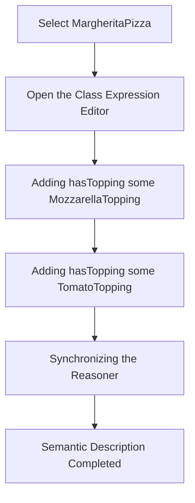
```mermaid
flowchart TD
A[Select MargheritaPizza]
-->B[Open the Class Expression Editor]
-->C[Adding hasTopping some MozzarellaTopping]
-->D[Adding hasTopping some TomatoTopping]
-->E[Synchronizing the Reasoner]
-->F[Semantic Description Completed]
```

Unlike Chapter (16), where the primary objective was to determine **what concepts exist**, the objective of this exercise is fundamentally different.

Rather than introducing new classes, we enrich an existing concepts by describing the semantic characteristics that distinguish it from other pizzas.

This distinction marks the transition from **conceptual organization** toward **semantic definition**.

### 17.4.1 Engineering Objective

At the completion of **Exercise 14**, the ontology already contained the following conceptual hierarchy:


```mermaid
treeView-beta
"Pizza"
    "NamedPizza"
        "MargheritaPizza"
```

Those 3 concepts are highlighted in below screen in Protégé:

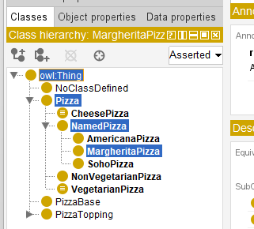

This hierarchy successfully established that a `MargheritaPizza` is a specialized type of `NamedPizza`, which in turn is a specialized type of `Pizza`.

However, the ontology still lacked an answer to an obvious semantic question:

> **Why should a pizza be considered a Margherita pizza?**

The class existed only as a conceptual category.

Nothing within the ontology explained the characteristics that distinguished a Margherita pizza from every other named pizza.

Exercise 15 begins answering that question by introducing formal semantic descriptions using **OWL class expressions**.

Rather than relying on the class name itself, the ontology starts defining the concept through logical conditions that software systems can interpret and reason about.

Consequently, the engineering objective of this exercise is not simply to add OWL syntax.

Its objective is to transform a conceptual class into a semantically described concept.

### 17.4.2 Opening the Class Expression Editor

To begin the exercise, select `MargheritaPizza` from the class hierarchy within the **Classes** tab.

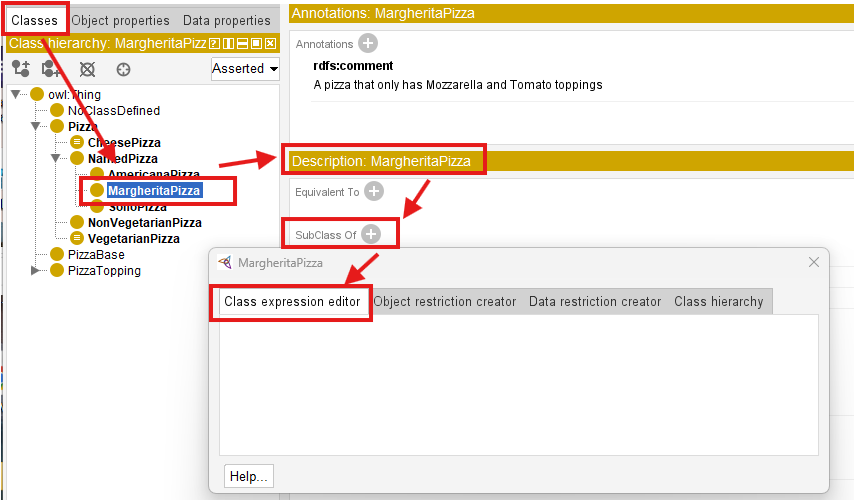

In the **Description** view, locate the **SubClassOf** section and click the **Add (+)** button.

Instead of using the Object Restriction Creator introduced in earlier exercises, Exercise 15 now employs the **Class Expression Editor**.

This editor allows ontology engineers to construct complete OWL class expressions directly using Description Logic syntax.

It therefore represents one of the most important editing interfaces within Protégé, as many advanced semantic definitions are created through this editor.

### 17.4.3 Creating the First Semantic Restriction

After opening the dialog, switch to the `Class Expression Editor` tab.

Enter the following expression:

`hasTopping some MozzarellaTopping`

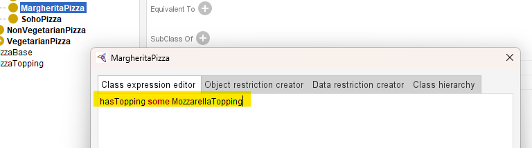

Rather than typing the complete topping name manually, Protégé provides a highly useful productivity feature.

After typing `hasTopping some Mo`, press `Ctrl + Space`, Protégé automatically searches the ontology for matching entities.

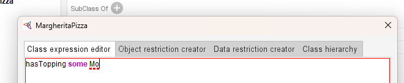

> [!Note] You need ensure you're in the English input mode for these shortcut working.

If only one candidate exists, the editor completes the remaining text automatically.

If multiple candidates match the partial name, Protégé presents a list of possible completions from which you may select the desired concept.

Although this shortcut appears minor, experienced ontology engineers use it continuously when constructing large ontologies containing hundreds of even thousands of classes and properties.

Using auto-completion:
- reduces typing errors,
- improves modeling efficiency, and
- encourages the consistent reuse of existing ontology entities.

### 17.4.4 Adding the Second Restriction

After confirming the first restriction, repeat the same procedure to add a second semantic description:

`hasTopping some TomatoTopping`

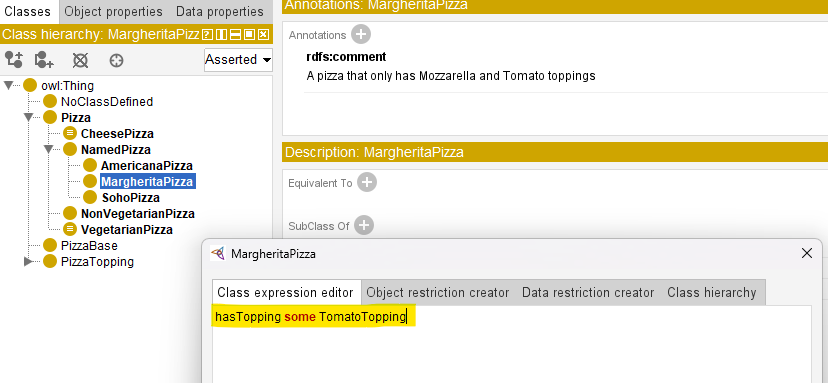

At this point, `MargheritaPizza` now contains two independent existential restrictions.

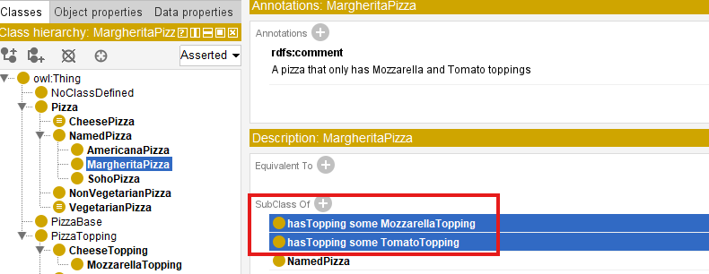

Unlike programming languages, where multiple statements are executed sequentially, OWL treats these restrictions as logical conditions that collectively contribute to the semantic description of the class.

Each restriction captures one aspect of the concept's meaning.

Together, they begin forming a richer semantic definition of `MargheritaPizza`.

Although the ontology still does not provide a complete definition of a Margherita pizza, it has now taken its first beyond conceptual classification.

### 17.4.5 Synchronizing the Reasoner

After both restrictions have been added, synchronize the reasoner.

Running the reasoners ensures that the newly introduced semantic description remain logically consistent with the existing ontology.

Although no new inferred classification appear at this stage, regularly synchronizing the reasoner is considered good engineering practice.

Frequent validation allows modeling errors to be detected early, when they are still relatively easy to correct.

Professional ontology development follows an incremental cycle:

> **Model $\rightarrow$ Validate $\rightarrow$ Refine**

rather than postponing validation until the ontology has become substantially larger.

### 17.4.6 Understanding What Was Actually Added

From the perspective of Protégé, Exercise 15 appears to involve only two additional entries beneath the **SubClass Of** section.

From the perspective of ontology engineering, however, something much more significant has occurred.

Before this exercise, the ontology contains only the conceptual statement:

```text
MargheritaPizza
    SubClassOf NamedPizza
```

After completing the exercise, the semantic description has evolved into:

```text
MargheritaPizza
    SubClassOf NamedPizza

    hasTopping some MozzarellaTopping

    hasTopping some TomatoTopping
```

The ontology no longer identifies only **where** `MargheritaPizza` belongs within the taxonomy.

It also begins expressing **what characteristics distinguish it**.

This represents the ontology's first formal semantic description.

The concept has progressed from

> being merely a named category

toward

> becoming a **logically described** class.

### 17.4.7 From Concept to Definition

Exercise 15 illustrates one of the central principles of ontology engineering.

Stage 1 established **conceptual identity**.

Stage 2 begins establishing **semantic meaning**.

This distinction is fundamental.

Conceptual Modeling determines that a concept exists.

Semantic Description specifies the logical conditions that characterize that concept.

The ontology therefore progresses from asking:

> **What concepts exist?**

to asking:

> **What formally defines those concepts?**

This progression transforms a conceptual taxonomy into a semantic knowledge model capable of supporting automated interpretation.

### 17.4.8 Engineering Perspective

Exercise 15 demonstrates an important distinction between **learning Protégé** and **learning ontology engineering**.

From the perspective of Protégé, you simply just enter two class expressions and then synchronize the reasoner.

From the perspective of ontology engineering, however, you have introduced the ontology's **first formal semantic definitions**.

Although only two restrictions have been added, they fundamentally change the role of the ontology.

Previously, the ontology organized concepts.

Now, it begins describing their **meaning**.

This marks the transition from a **semantic taxonomy** to a **machine-interpretable semantic model**.

Every subsequent semantic definition introduced throughout the remainder of the tutorial will build upon this same modeling approach.

The engineering contribution of **Exercise 15** can be summarized as below table:

| Engineering Perspective | Contribution from Exercise 15 |
| --- | --- |
| SKDL Stage | Stage 2 -- Semantic Description |
| Primary Objective | Define the semantic meaning of ontology concepts using OWL class expressions and logical restrictions. |
| Modeling Activity | Add existential restrictions describing the toppings associated with `MargheritaPizza`. |
| Engineering Outcome | Transform a conceptual class into a semantically described ontology concept. |
| Preparation for Later Chapters | Establish the semantic foundation required for knowledge reuse, validation, reasoning, and ultimately executable intelligence. |

Although **Exercise 15** introduces only two semantic restrictions, it represents one of the most important transitions within the **Semantic Knowledge Development Lifecycle (SKDL)**.

From this point onward, the ontology is no longer concerned solely with identifying concepts. It begins constructing a formal semantic model in which concepts are defined through **logical meaning**, enabling machines to **interpret**, **validate**, and eventually **reason** over the knowledge they represent.

## 17.5 Why Semantic Description Follows Conceptual Modeling

The transition from **Conceptual Modeling** to **Semantic Description** represents one of the most important engineering principles in ontology development:

> **A concept must be identified before its meaning can be formally defined.**

Although conceptual models and semantic descriptions are closely connected, they solve fundamentally different problems.

Conceptual Modeling answers:

> **What concepts exist in the domain?**

While, Semantic Description answers:

> **What conditions define the meaning of those concepts?**

Confusing these two stages often leads:
- unstable ontologies,
- unnecessary redesign, and
- semantic inconsistencies.

Professional ontology engineering therefore follows a disciplined progression:

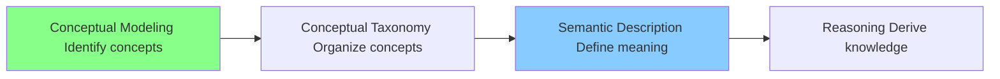
```mermaid
flowchart LR
A[Conceptual Modeling Identify concepts]
-->B[Conceptual Taxonomy Organize concepts]
-->C[Semantic Description Define meaning]
-->D[Reasoning Derive knowledge]
style A fill:#88FF88
style C fill:#88CCFF
```

The purpose of this section is to understand why semantic descriptions should be introduced only after the conceptual foundation has become sufficiently stable.

### 17.5.1 The Universal Engineering Principle: Structure Before Detail

The relationship between conceptual modeling and semantic description reflect a broader principle found across many engineering disciplines:

> **Establish the structure first, then define the detailed behavior and constraints.**

This principle is not unique to ontology engineering.

It appears repeatedly in software architecture, database design, enterprise architecture, and many other engineering practices.

#### 17.5.1.1 Software Engineering

Software engineers normally do not begin by implementing complex business logic before identifying the fundamental software entities.

A typical progression is:

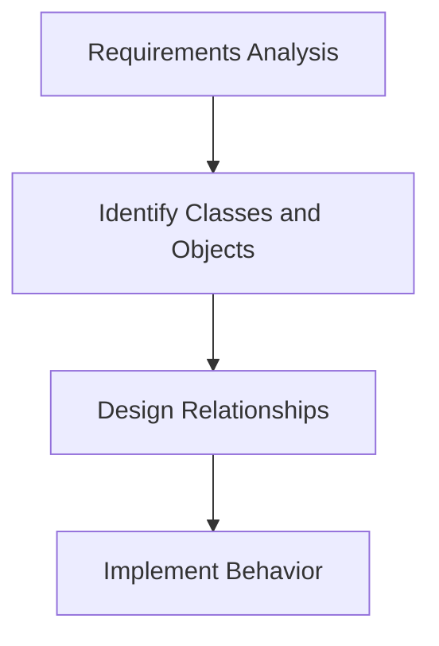
```mermaid
flowchart TD
A[Requirements Analysis]
-->B[Identify Classes and Objects]
-->C[Design Relationships]
-->D[Implement Behavior]
```

For example, before implementing methods for a `CustomerOrder` class, developers first need to determine:
- What is a customer?
- What is an order?
- How are customers and orders related?

Without a stable conceptual model, implementation details are likely to change repeatedly.

Ontology engineering follows the same philosophy.

Before defining:

```text
MargheritaPizza
    hasTopping some MozzarellaTopping
```

ths ontology must first establish that:

```text
Pizza
    NamedPizza
        MargheritaPizza
```

represents a meaningful conceptual structure.

#### 17.5.1.2 Database Design

Database engineers follow a similar discipline.

Before defining:
- foreign keys;
- constraints;
- indexes; and
- transaction rules,

database designers first identify:
- entities;
- attributes; and
- relationships.

For example:

```text
Customer
    |
    places
    |
Order
```

must be understood before introducing database constraints.

A database schema with incorrect entities cannot be repaired simply by adding more constraints.

The same applies to ontologies:

> A semantically incorrect concept hierarchy cannot be fixed by adding more OWL restrictions.

#### 17.5.1.3 Enterprise Architecture

Enterprise architecture also separate conceptual understanding from detailed specification.

Before analyzing:
- application dependencies;
- integration patters; and
- technology platforms,

architects first establish:
- business capabilities;
- organizational concepts; and
- information domains.

For example:

```text
Business Capability
    |
    supports
    |
Business Process
```

must be conceptually understood before detailed architecture decisions can be made.

#### 17.5.1.4 Ontology Engineering

Ontology engineering applies the same engineering discipline:

| Engineering Discipline | First Establish | Then Define |
| --- | --- | --- |
| Software Engineering | Classes and objects | Behavior and implementation |
| Database Design | Entities and relationships | Constraints and optimization |
| Enterprise Architecture | Capabilities and domains | Architecture decisions |
| Ontology Engineering | Concepts and taxonomy | Semantic restrictions and logical axioms |

The pattern is consistent:

> **Conceptual structure provides the foundation upon which detailed meaning is built.**

### 17.5.2 Why Introducing Semantics Too Early Creates Problems

A common beginner mistake in ontology engineering is attempting to define detailed semantic restrictions immediately after creating a class.

For example, imaging starting with:

```
MargheritaPizza`
```

and immediately adding:

```
MargheritaPizza
    hasTopping some MozzarellaTopping
```

At first glance, this appears reasonable.

However, several important questions remain unanswered:
- Is `MargheritaPizza` correctly positioned in the hierarchy?
- Should it be a subclass of `NamedPizza`?
- Should there be another abstraction such as `ItalianPizza`?
- Are toppings the correct defining characteristics?
- Should ingredients, cooking methods, or regional origins also contribute to the definition?

If the conceptual model later changes, every semantic restriction attached to those concepts may require modification.

This creates unnecessary complexity.

The engineering consequence is:

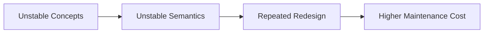
```mermaid
flowchart LR
A[Unstable Concepts]
-->B[Unstable Semantics]
-->C[Repeated Redesign]
-->D[Higher Maintenance Cost]
```

Therefore, professional ontology development separates:

> Conceptual Stability

before:

> Semantic Complexity.

### 17.5.3 Exercise 14 and Exercise 15 Demonstrate This Principle

The design of Michael DeBellis' *Protégé 5 New OWL Pizza Tutorial* intentionally follows this engineering sequence.

**Exercise 14**

First, the ontology establishes conceptual organization:

```text
Pizza
    NamedPizza
        MargheritaPizza
```

At this stage, the ontology knows:
- what concepts exist;
- how concepts are related; and
- where each concept belongs in the taxonomy.

However, it does not yet define the detailed meaning of these concepts.

**Exercise 15**

Only after the hierarchy exists does the ontology introduce semantic meaning:

```text
MargheritaPizza
    SubClassOf
        hasTopping some MozzarellaTopping

MargheritaPizza
    SubClassOf
        hasTopping some TomatoTopping
```

Now the ontology can express:

> A `MargheritaPizza` is not only a named pizza, it is a pizza concept characterized by specific semantic conditions.

The sequence is therefore like below:

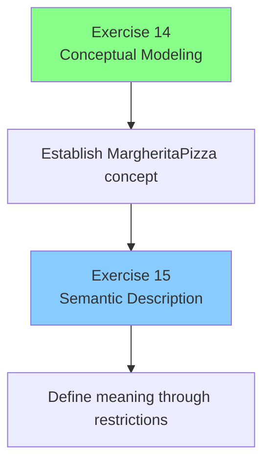
```mermaid
flowchart TD
A[Exercise 14<br>Conceptual Modeling]
-->B[Establish MargheritaPizza concept]
-->C[Exercise 15<br>Semantic Description]
-->D[Define meaning through restrictions]
style A fill:#88FF88
style C fill:#88CCFF
```

This separation is deliberate.

The tutorial is not simply teaching Protégé operations. It is teaching a professional ontology engineering methodology.

### 17.5.4 Concept Maturity Before Semantic Commitment

A useful way to understand this engineering principle is through the concept of **concept maturity**.

Not every newly discovered concept is immediately ready for detailed semantic definition.

A concept typically evolves through several levels:

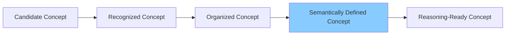
```mermaid
flowchart LR
A[Candidate Concept]
-->B[Recognized Concept]
-->C[Organized Concept]
-->D[Semantically Defined Concept]
-->E[Reasoning-Ready Concept]
style D fill:#88CCFF
```

**Candidate Concept**

A possible domain idea has been identified.

Example:

```
SpecialPizza
```

At this stage, its meaning may still be unclear.

**Recognized Concept**

The concept is accepted as meaningful within the domain.

Example:

```
NamedPizza
```

The ontology community agrees that named pizzas represent a useful category.

**Organized Concept**

The concept has a defined position in the taxonomy.

```text
Pizza
    NamedPizza
        MargheritaPizza
```

**Semantically Defined Concept**

Formal restrictions are introduced.

Example:

```text
MargheritaPizza
    hasTopping some MozzarellaTopping
```

**Reasoning-Ready Concept**

The ontology contains sufficient formal semantics to support inference (through reasoning).

This maturity model explains why ontology engineering is an incremental process.

### 17.5.5 The Connection with "Delay Decisions Until Understanding Improves"

This engineering approach also reflects a broader principle used in modern software and system engineering:

> **Delay irreversible decisions until sufficient understanding exists.**

In agile development, architects avoid excessive upfront assumptions because requirements evolve.

Ontology engineering follows the same principle.

A premature semantic definition can become a constraint that limits future modeling choices.

By first establishing conceptual structures (through conceptual modeling), ontology engineers preserve flexibility while gradually increasing semantic precision.

The result is a more adaptable knowledge model:

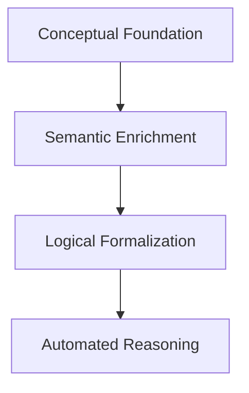
```mermaid
flowchart TD
A[Conceptual Foundation]
-->B[Semantic Enrichment]
-->C[Logical Formalization]
-->D[Automated Reasoning]
```

### 17.5.6 Engineering Takeaway

Conceptual Modeling and Semantic Description are not competing activities.

They are complementary stages of knowledge engineering.

- Conceptual Modeling creates the **semantic vocabulary**.
- Semantic Description defines the **formal meaning** of that vocabulary.

The relationship can be summarized as:

> **- Conceptual Modeling tells us what exists.**
> **- Semantic Description tells us what those concepts mean.**

Within the Semantic Knowledge Development Lifecycle:

- Stage 1 - Conceptual Modeling: establishes concepts and taxonomy
- Stage 2 - Semantic Description: enriches concepts with formal meaning

Only after both stages have been completed does an ontology become sufficiently expressive for advanced capabilities such as **reasoning**, **validation**, **knowledge reuse**, and **executable intelligence**.

Therefore, the engineering discipline established in this chapter can be summarized by one fundamental rule:

> **Do not define complex semantics for concepts that have not yet achieved conceptual stability.**

This principle is the foundation for building ontologies that remain understandable maintainable, and scalable as semantic knowledge systems evolve.

## 17.6 Introduction to Description Logic (DL) -- The Formal Language Behind OWL

Having established **why Semantic Description follows Conceptual Modeling** in the previous sections, we are now ready to examine the formal language that makes semantic description precise, machine interpretable, and logically verifiable.

Although Protégé allows use to create *classes, properties, and restrictions* through an intuitive graphical interface, the ontology is not stored merely as a collection of diagrams or forms. Behind every OWL construct lies a rigorous logical language known as **Description Logic (DL)**.

Understanding this language is not required to operate Protégé effectively, but it greatly improves one's understanding of
- **why OWL behaves as it does**,
- **how reasoners derive new knowledge**, and
- **what semantic restrictions actually mean**.

For ontology engineers, Description Logic provides the conceptual bridge between graphical modeling and formal knowledge representation.

### 17.6.1 What Is Description Logic?

**Description Logic (DL)** is a family of **decidable knowledge representation languages** designed for representing structured knowledge using formally defined concepts, relationships, and individuals.

Unlike general-purpose mathematical logic, Description Logic focuses specifically on describing domains of knowledge in a way that is both expressive and computationally manageable.

Its primary objective is to enable computers to answer questions such as:
- Is this ontology logically consistent?
- Which classes does an individual belong to?
- Does one concept imply another?
- Are two concepts logically equivalent?
- Can new knowledge be inferred (derived) automatically?

These capabilities form the foundation of modern ontology engineering and semantic reasoning.

Consequently, every OWL ontology is not merely a collection of XML or RDF statements. It is also a **formal Description Logic knowledge base** that **can be interpreted by automated reasoners**.

### 17.6.2 Why Does OWL Need Description Logic?

Earlier chapters introduced OWL as a language for modeling semantic knowledge.

However, a modeling language alone is insufficient.

Computer ('Machine') cannot reliably interpret concepts such as `Pizza`, `MargheritaPizza`, or `MozzarellaTopping` unless their meanings are expressed using **precise logical rules**.

Description Logic provides exactly this formal semantics.

Instead of:

> relying on natural-language interpretation,

DL:

> defines every construct mathematically, ensuring that semantic meaning is unambiguous and independent of human interpretation.

This logical foundation enables different OWL tools and reasoners to interpret the same ontology consistently.

More importantly, it allows automated reasoning to become predictable, reproducible, and mathematically sound.

> [!note]
> When we use "DL" as abbreviation for "Description Logic", do not mix that with "Deep Learning", ;-)

### 17.6.3 The Relationship Between OWL and Description Logic

A common misconception is that OWL and Description Logic are separate technologies.

In reality, they are closely related.

Description Logic provides the formal semantics, while OWL provides a standardized engineering language for expressing those semantics.

From an engineering perspective:
- **Description Logic** defines *what the statements mean*.
- **OWL** provides *how those statements are written and exchanged*.
- **Protégé** provide *how ontology engineers create and manage those statements*.
- **Reasoners** use Description Logic to interpret the ontology and derive logical consequences.

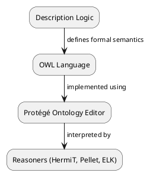
```plantuml
@startuml
:Description Logic;
-> defines formal semantics; 
:OWL Language;
-> implemented using;
:Protégé Ontology Editor;
-> interpreted by;
:Reasoners (HermiT, Pellet, ELK);
@enduml
```
Seen from this perspective, Protégé is not "performing magic". It is constructing Description Logic expressions through a graphical interface, while reasoners apply formal logic to those expressions.

### 17.6.4 The Three Fundamental Building Blocks of Description Logic

Despite its mathematical foundations, Description Logic is built upon only three fundamental kinds of elements, as below table shows:

| Description Logic | OWL | Meaning |
| --- | --- | --- |
| **Concept** | Class | A category of things |
| **Role** | Object Property | A relationship between concepts |
| **Individual** | Instance | A concrete object belonging to a concept |

These correspond directly to the principal modeling elements introduced throughout the previous chapters.

For example, within the `Pizza` ontology:

| Description Logic | `Pizza` Ontology Example |
| --- | --- |
| Concept | `Pizza`, `NamedPizza`, `MargheritaPizza` |
| Role | `hasTopping`, `hasBase` |
| Individual | A particular pizza served in a restaurant |

This correspondence demonstrates that OWL terminology is largely an engineering vocabulary built upon Description Logic concepts.

### 17.6.5 Decidability -- Why Description Logic Matters

One of the defining characteristics of Description Logic is **decidability**.

A logical language is **decidable** if every valid reasoning task is guaranteed to terminate with a definite answer.

In practical terms, this means that a reasoner will always determine whether:

- an ontology is consistent;
- a class is satisfiable;
- one class is a subclass of another; or
- an individual belongs to a particular class.

The reasoning process may require substantial computation for very large ontologies, but it is guaranteed for finish.

This property is critically important in engineering environments.

Without decidability, an ontology reasoner could enter an infinite reasoning process or produce unpredictable behavior, making large semantic systems unsuitable for practical applications.

OWL deliberately balances expressive power with computational tractability so that automated reasoning remains reliable even for complex knowledge bases.

### 17.6.6 Description Logic in Exercise 15

Although Exercise 15 appears to involve only two simple Protégé operations, it actually introduces the first Description Logic constructor used in this tutorial.

When we add the restriction:

```
hasTopping some MozzarellaTopping
```

we are not merely editing a class description.

We are constructing a formal Description Logic expression.

In standard Description Logic notation, this restriction is written as:

> $\exist$ `hasTopping` . `MozzarellaTopping`

where:
- **$\exist$** denotes existential quantification ("there exists");
- **`hasTopping`** is a role (object property); and
- **`MozzarellaTopping** is a concept (class).

This expression states that every instance satisfying the restriction must be related through the `hasTopping` role to **at least one** instance of `MozzarellaTopping`.

Although Protégé hides much of this mathematical notation behind a user-friendly interface, every restriction created in the editor ultimately corresponds to a Description Logic expression interpreted by the reasoner.

### 17.6.7 Preparing for the First Description Logic Constructor

Description Logic contains numerous logic constructors for describing concepts.

Among the most frequently used are:
- existential restrictions;
- universal restrictions;
- intersections;
- unions;
- complements;
- cardinality restrictions; and
- equivalence definitions.

Exercise 15 introduces the simplest and perhaps the most frequently used of these: the **existential restriction**.

In the next section, we will examine this constructor in detail, explaining not only its OWL syntax (`some`), but also its underlying Description Logic semantics ($\exist R.C$) and its role in enabling machine-understandable semantic descriptions.

## 17.7 Existential Restrictions (`some`) -- The First Description Logic Constructor

Having introduced **Description Logic** as the formal language underlying OWL in the previous section, we can now examine the first semantic constructor encountered in the `Pizza` tutorial.

Exercise 15 introduces the **existential restriction**, represented in OWL by the keyword `some`.

Although the syntax appears simple, its engineering significance is substantial. This is the first time the ontology begins expressing **conditions that define the meaning of a concept**, rather than merely identifying the concept within a hierarchy.

Unlike the subclass relationships introduced in Chapter (16), which organized concepts into a conceptual taxonomy, existential restrictions begin describing the characteristics that distinguish one concept from another.

The ontology therefore takes an important step forward:

> **Concepts are no longer defined solely by where they appear in the hierarchy, but also by the semantic conditions they satisfy.**

### 17.7.1 From  Naming Concepts to Description Concepts

Before Exercise 15, the class `MargheritaPizza` possessed only a conceptual identity.

The ontology knew that it represented a specialized type of `NamedPizza`, but it did not yet know what characteristics distinguished a Margherita pizza from any other pizza.

Exercise 15 changes this situation fundamentally.

Instead of merely assigning a label to the class, we begin describing the semantic conditions that characterize its members.

This represents an important conceptual transition in ontology engineering.

Rather than asking:

> **What is this class called?**

we now ask:

> **What must be true for something to belong to this class?**

Ontology engineering therefore shifts its emphasis from:

> **classification by name**

to:

> **classification by meaning**.

The class name remains useful for human communication, but it is the semantic description that enables machines to interpret the concept consistently.

### 17.7.2 Understanding "At Least One"

One of the most common misunderstanding among beginners concerns the meaning of the keyword `some`.

In everyday natural English, the world "some" often implies an unspecified quantity, perhaps several objects or "a few".

Within OWL, however, the meaning is much more precise.

An existential restriction specifies that **at least one** relationship satisfying the stated condition must exist.

It DOES **NOT** specify exactly how many such relationships exist.

For example, if a pizza is required to have a mozzarella topping, the ontology does not distinguish between **one** mozzarella topping, **two** mozzarella toppings, or **several** mozzarella toppings. Any of these situations satisfies the existential condition.

The restriction therefore establishes a **minimum semantic requirement**, rather than a precise quantity.

The distinction between several commonly used cardinality restrictions is summarized as below:

| Restriction | Semantic Meaning |
| --- | --- |
| `some` | At least one related individual satisfies the condition. |
| `exactly 1` | Exactly one related individual satisfies the condition.
| `min 2` | At least two related individuals satisfy the condition. |
| `only` | Every related individual must satisfy the specified condition. |

Later chapters will gradually introduce these additional restriction types.

Exercise 15 intentionally begins with the simplest and most widely used semantic constructor.

### 17.7.3 How Existential Restrictions Supports Automated Classification

The primary purpose of an existential restriction is not to make the ontology more descriptive for human readers.

Its real value lies in enabling automated semantic classification.

Rather than relying on class names, an OWL reasoner evaluates *whether the semantic conditions associated with a class* is satisfied.

When those conditions hold, the reasoner may infer that an individual belongs to the corresponding class.

Consequently, semantic description become the foundation upon which logical inference is later performed.

This illustrated an important engineering principle:

> **Reasoner classify concepts according to semantic conditions rather textual labels.**

The ontology therefore evolves from a static hierarchy into a semantic model capable of supporting intelligent interpretation.

Although Exercise 15 introduces only two simple restrictions, it establishes the modeling pattern that will be used repeatedly throughout the remainder of the `Pizza` ontology.

### 17.7.4 Semantic Descriptions Grow Incrementally

Professional ontologies rarely define every characteristic of a concept at once.

Instead, semantic descriptions typically evolve through a sequence of incremental refinements.

Exercise 15 demonstrates this engineering philosophy clearly.

At this stage, `MargheritaPizza` is characterized by only a small number of semantic conditions. Numerous additional characteristics could potentially be added later, including
- the type of pizza base,
- vegetarian status,
- country of origin,
- preparation style,
- nutritional properties, or
- commercial classifications.

Rather than attempting to model every possible aspect immediately, the `Pizza` tutorial introduces only the semantic knowledge required to support the current learning objective.

This incremental approach offers several important advantages:

1. It keeps semantic models understandable while they are still evolving.
2. It minimizes unnecessary restructuring as domain knowledge matures.
3. It allows reasoning results to be validated continuously throughout development.
4. It supports gradual enrichment without sacrificing conceptual stability.

This development strategy aligns closely with the philosophy of the **Semantic Knowledge Development Lifecycle (SKDL)**, where semantic knowledge is refined progressively rather than constructed in one single step.

### 17.7.5 Common Misunderstandings About Existential Restrictions

Because existential restrictions are often introduced early in OWL tutorials, several misconceptions frequently arise.

The table below summarized some of the most common misunderstandings.

| Misunderstanding | Correct Interpretation |
| --- | --- |
| "`some` means several." | It means **at least one**. |
| "`some` specifies an exact quantity." | It specifies only a minimum existence requirement. |
| "Restrictions create new individuals." | Restrictions describe classes, not individual objects. |
| "Class names determine semantic meaning." | Semantic meaning is determined by logical description rather than labels. |
| "Existential restrictions perform reasoning." | They provide the semantic condition upon which reasoning operates. |

Understanding these distinctions early prevents many modeling mistakes that become increasingly difficult to correct as an ontology grows.

### 17.7.6 Engineering Takeaway

Existential restrictions represent the first point at which an ontology begins expressing **formal semantic knowledge** rather than simple conceptual organization.

Although adding a restriction in Protégé requires only a few mouse clicks, the underlying engineering significance is much greater.

For the first time, the ontology begins defining concepts according to **their semantic characteristics** instead of relying solely on their position within a hierarchy.

This transition -- from organizing concepts to describing their meaning -- marks one of the most important milestones in ontology engineering.

It establishes the semantic foundation upon which

- richer class expressions,
- logical reasoning,
- semantic validation,
- knowledge reuse, and
- ultimately executable knowledge

will be progressively developed throughout the remaining stages of the **Semantic Knowledge Development Lifecycle (SKDL)**.

## 17.8 Class Expressions -- Building Semantic Meaning with Description Logic

In the previous sections, we examined the first Description Logic constructor introduced in Exercise 15: the **existential restriction (`some`)**.

Although existential restrictions allow us to describe individual semantic characteristics of a concept, real-world concepts are rarely defined by a single condition.

A pizza is not characterized solely by possessing mozzarella.

Likewise, an enterprise application is not defined only by the data it manages, and a biological organism is not identified by a single characteristic.

Most concepts are distinguished by a **combination of semantic properties** that together define their meaning.

Ontology engineering therefore requires a language capable of combining multiple semantic statements into coherent logical definitions.

In OWL, this mechanism is provided through **class expressions**.

Rather than describing concepts using isolated restrictions, class expressions allow ontology engineers to compose multiple logical conditions into increasingly expressive semantic descriptions that machines can interpret consistently.

This represents another important milestone in the Semantic Knowledge Development Lifecycle (SKDL). During **Stage 1 -- Conceptual Modeling**, we organized concepts into taxonomies. During **Stage 2 -- Semantic Description**, we begin expressing what those concepts actually mean by constructing logical descriptions that build upon the semantic vocabulary established in Stage 1.

### 17.8.1 From Individual Restrictions to Complete Semantic Descriptions

Exercise 15 introduced two independent semantic restrictions from `MargheritaPizza`:

```text
hasTopping some MozzarellaTopping
```

and

```text
hasTopping some TomatoTopping
```

Each restriction contributes one semantic characteristic.

Viewed independently, each statement answers only one single question:

- Does the pizza contain mozzarella?
- Does the pizza contain tomato?

Neither restriction alone adequately characterized a Margherita pizza.

Only when both restrictions are considered **together** does a more meaningful semantic description begin to emerge.

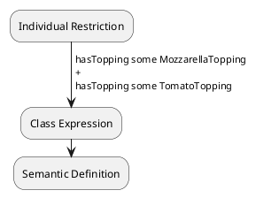
```plantuml
@startuml
:Individual Restriction;
-> hasTopping some MozzarellaTopping\n+\nhasTopping some TomatoTopping; 
:Class Expression;
:Semantic Definition;
@enduml
```

This illustrates an important principle of ontology engineering:

> **Meaning is rarely expressed through isolated logical statements. It emerges from the combination of multiple semantic constraints.**

Description Logic therefore allows multiple restrictions to be composed into larger logical expressions.

### 17.8.2 What Is a Class Expression?

A **class expression** is a logical description that specifies the conditions required for membership within a class.

Unlike a named class such as `MargheritaPizza`, which simply provides a reusable identifier, a class expression explicitly describes the semantic characteristics that define a concept.

For example, in Exercise 15:

```text
hasTopping some MozzarellaTopping
```

is itself a simple class expression.

It does not introduce a new named concept. Instead, it describes the collection of all pizzas that possess at least one mozzarella topping.

As additional logical conditions are combined, increasingly sophisticated semantic descriptions can be constructed without introducing additional class names.

Consequently, class expressions should be viewed as **descriptions of meaning**, rather than merely labels within a hierarchy.

### 17.8.3 Named Classes and Anonymous Classes

One of the most important concepts in Description Logic is the distinction between **named classes** and **anonymous classes**.

A **named class** possesses a unique identifier (IRI) within the ontology.

Examples include:
- `Pizza`
- `NamedPizza`
- `MargheritaPizza`
- `PizzaTopping`

These classes become part of the ontology's conceptual vocabulary and appear explicitly within Protégé's class hierarchy.

By contrast, a **class expression** usually represents an **anonymous class**.

For example:

```text
hasTopping some MozzarellaTopping
```

does not create a new class named `MozzarellaPizza`.

Instead, it describes an unnamed collection of pizzas satisfying that restriction.

Similarly,

```text
NamedPizza
and
(hasTopping some MozzarellaTopping)
```

also represents an anonymous class.

Although unnamed, anonymous classes possess complete semantic meaning and may participate in logical reasoning exactly like named classes.

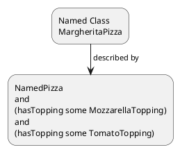
```plantuml
@startuml
:Named Class\nMargheritaPizza;
->described by;
:NamedPizza\nand\n(hasTopping some MozzarellaTopping)\nand\n(hasTopping some TomatoTopping);
@enduml
```

The distinction is summarized in below table:

| Named Classes | Anonymous Class |
| --- | --- |
| Possesses an IRI | Has no explicit name |
| Appears within the class hierarchy | Exists only as a logical expression |
| Represents reusable domain concepts | Represents semantic descriptions |
| Typically created by ontology engineers | Often generated or composed dynamically during modeling |

Understanding this distinction helps explain why Protégé frequently displays complex logical expressions that do not correspond to explicit class names.

### 17.8.4 Description Logic as a Language of Composition

Unlike traditional taxonomies, Description Logic is not limited to simple subclass relationships.

Instead, it provides a small collection of logical constructors that can be combined recursively to describe increasingly complex concepts.

Some of the most frequently used constructors include:

| Description Logic Constructor | Manchester OWL Syntax | Purpose |
| --- | --- | --- |
| Conjunction | `and` | All conditions must be satisfied simultaneously.  |
| Disjunction | `or` | At least one condition must be satisfied. |
| Negation | `not` | Excludes concepts satisfying a particular condition. |
| Existential Restriction | `some` | Requires at least one relationship satisfying a condition. |
| Universal Restriction | `only` | Restricts all related individuals to satisfy a condition. |

These logical constructors behave much like grammatical rules in a natural language.

Just as words combine into phrases and sentences, logical constructors combine into class expressions that describe increasingly rich semantic meaning.

The expressive power of OWL therefore arises not from the number of available keywords, but from the ability to compose simple semantic statements into sophisticated knowledge models.

### 17.8.5 Semantic Composition in the `Pizza` Ontology

Let's return to Exercise 15, the semantic description of `MargheritaPizza` can now be viewed as the composition of several independent semantic statements.

Conceptually, we begin with the existing abstraction:

```
NamedPizza
```

We then enrich that concept through additional semantic restrictions:

```text
hasTopping some MozzarellaTopping
and
hasTopping some TomatoTopping
```

Rather than:

> representing unrelated statements,

these restrictions:

> collectively describe one coherent concept.

As additional semantic characteristics are introduced throughout later chapters, increasingly expressive class expressions will emerge by extending this same compositional principle.

Complex semantic definitions therefore evolve incrementally from smaller, understandable building blocks.

### 17.8.6 Necessary Conditions Versus Complete Definitions

At this stage of the `Pizza` tutorial, the restrictions introduced for `MargheritaPizza` are attached through `SubClassOf` relationships.

This distinction is extremely important.

A subclass restriction specifies a **necessary condition**.

It states that every instance of `MargheritaPizza` must satisfy the specified restriction.

However, it does **not** imply that satisfying the restriction alone is sufficient to conclude that an arbitrary pizza is a Margherita pizza.

Later chapters will introduce `EquivalentTo`, which represents a much stronger semantic commitment, and also can be configured in the same screen as `SubClassOf` in Protégé:

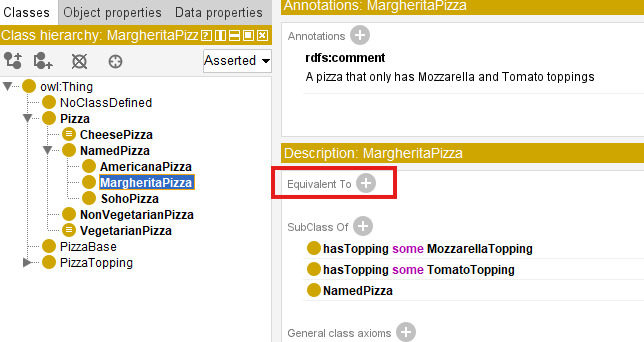

The engineering distinction can be summarized as follows:

| `SubClassOf` | `EquivalentTo` |
| --- | --- |
| Specifies necessary conditions | Specifies necessary **and sufficient** conditions |
| Supports **incremental** semantic enrichment | Provides a **complete** logical definition |
| Appropriate **during** early ontology development | Appropriate **after** concepts have stabilized |

This design philosophy directly reflects the principles introduced earlier in this chapter.

Professional ontology engineers typically begin by **accumulating necessary semantic descriptions** before attempting to define **complete semantic equivalence**.

Doing so allows the ontology to evolve naturally while reducing the cost of future redesign.

### 17.8.7 Open World Assumption Enables Incremental Semantic Modeling

Throughout the earlier chapters of this book, we have encountered the **Open World Assumption (OWA)** on several occasions. Rather than repeating its formal definition, it is now useful to examine its engineering significance from the perspective of **semantic description**.

Exercise 15 introduced the first semantic restrictions describing `MargheritaPizza`:

```text
hasTopping some MozzarellaTopping
hasTopping some TomatoTopping
```

These restrictions define semantic characteristics that a Margherita pizza must possess.

Importantly, however, they **do not attempt to describe everything about the pizza**.

The ontology does not claim that mozzarella and tomato are the *only* toppings, nor does it assert that no additional ingredients may exist.

Instead, each restriction contributes one additional piece of semantic knowledge.

*This is proved by the **real world knowledge**! Thanks for my wife who is professional in cooking and making pizza, with far beyond my skills, she looks at my ontology and immediately points out the missing knowledge - Basil leaf, as below image, those are the at least three key toppings / ingredients for a pizza named as Margherita pizza, while our ontology only describes two:*


This illustrates an important engineering consequence of the Open World Assumption:

> **Semantic descriptions are intended to accumulate rather than terminate knowledge.**

Unlike traditional database schemas, where developers often attempt to specify complete records from the beginning, ontology engineering encourages semantic models to evolve incrementally.

Concepts gradually become richer as additional knowledge is discovered, validated, and incorporated into the ontology.

This incremental philosophy aligns naturally with the Semantic Knowledge Development Lifecycle (SKDL):

- **Stage 1** establishes the conceptual vocabulary.
- **Stage 2** begins enriching concepts with semantic descriptions.
- Later stages introduce reusable patterns, governance rules, validation constraints, reasoning axioms, and executable behaviors.

Each stage adds semantic knowledge without requiring earlier descriptions to be discarded.

Consequently, ontology engineers should regard OWL restrictions as **incremental semantic contributions**, not as exhaustive specifications.

This perspective also explains why the previous section emphasized the use of `SubClassOf` rather than `EquivalentTo`.

A subclass restriction simply contributes another necessary semantic characteristic.

As understanding of the domain matures, additional restrictions can be introduced naturally without redefining the concept from scratch, for example, adding `Basil` into restrictions to `MargheritaPizza`.

Only when the ontology reaches a sufficient level of semantic completeness does it become appropriate to define concepts using `EquivalentTo`, thereby providing both necessary and sufficient conditions for automated classification.

From this perspective, the Open World Assumption is more than a logical principle.

It is an **engineering strategy for long-lived knowledge systems**.

Enterprise ontologies, biomedical terminologies, digital libraries, and large-scale knowledge graphs continually evolve as new information (knowledge) becomes available.

Because OWL assumes that knowledge is always potentially incomplete, these systems can expand organically while preserving semantic consistency.

This is one of the reasons why ontology engineering scales successfully to domains whose knowledge can never be considered permanently complete.

### 17.8.8 Engineering Perspective -- Building Meaning Incrementally

Throughout this chapter, we have introduced class expressions not merely as OWL syntax, but as a systematic way of enriching the semantic meaning of concepts.

An important engineering principle emerges from this process:

> **Semantic knowledge should be developed incrementally rather than all at once**.

Beginners often assume that every class should immediately receive a complete logical definition. In practice, however, professional ontology engineering follows a much more disciplined approach.

Concepts are first identified and organized into a stable **conceptual taxonomy** (Stage 1 of the Semantic Knowledge Development Lifecycle). Only after that conceptual foundation has matured do ontology engineers begin introducing **semantic descriptions** through carefully designed class expressions

The evolution of the `Pizza` ontology provides an excellent illustration of this engineering methodology.

In **Exercise 14**, the class `MargheritaPizza` was introduced solely as part of the conceptual hierarchy. At that stage, the ontology answered only one question:

> **Where does this concept belong within the domain?**

No semantic characteristics were yet associated with the class.

**Exercise 15** answered a different question:

> **What semantic characteristics begin to distinguish this concept from other pizzas?**

Rather than attempting to produce a complete logical definition immediately, the ontology introduces only two existential restrictions:

```text
hasTopping some MozzarellaTopping
hasTopping some TomatoTopping
```

These restrictions enrich the semantic meaning of `MargheritaPizza` without claiming that the description is complete. Additional semantic constraints (e.g. Basil) may be introduced later as the ontology evolves and the domain becomes better understood.

This gradual refinement offers several important engineering advantages:
- It separates conceptual organization form semantic specification.
- It minimizes unnecessary restructuring as domain knowledge evolves.
- It allows semantic definitions to mature alongside the ontology.
- It reduces the likelihood of introducing inconsistent or overly restrictive axioms during the early stages of development.
- It encourages ontology engineers to validate semantic assumptions incrementally rather than attempting to model everything at once.

This philosophy closely resembles engineering practices found in many other disciplines.

Software architects establish class structures before implementing complex behaviors (methods).

Database designers identify entities before defining integrity constraints.

Enterprise architects develop capability maps before modeling operational interactions.

Ontology engineers follows exactly the same progression.

> **Conceptual organization** provides the structural framework, while **semantic description** progressively enriches that framework with machine-understandable meaning.

Consequently, class expressions should not be viewed as isolated pieces of OWL syntax. They are modular semantic building blocks that allow an ontology to evolve steadily from conceptual organization into a rich and formally defined knowledge model.

As the ontology grows, these individual semantic building blocks combine to form increasingly expressive descriptions that enable automated reasoning, semantic validation, knowledge reuse, semantic governance, and ultimately executable intelligence.

### 17.8.9 Preparing for Future Chapters

**Exercise 15** introduces only the first examples of semantic class expressions, yet the modeling principles established here will underpin every subsequent stage of ontology development.

In the chapters that follow, the `Pizza` ontology will gradually acquire richer semantic descriptions through additional Description Logic constructors and increasingly expressive class expressions.

Future modeling activities will introduce concepts such as universal restrictions (`only`), cardinality constraints (`min`, `max`, and `exactly`), equivalent class definitions (`EquivalentTo`), and reusable semantic modeling patterns. Each new construct will build upon the semantic foundation established in this chapter.

As these semantic descriptions become progressively richer, the ontology will evolve from a simple conceptual hierarchy into a formal knowledge model capable of supporting automated inference.

Eventually, the reasoner will no longer rely solely on manually asserted subclass relationships. Instead, it will begin deriving new knowledge automatically by evaluating the logical meaning expressed through class definitions.

This progression mirrors the overall structure of the **Semantic Knowledge Development Lifecycle (SKDL)**.

- **Stage 1 -- Conceptual Modeling** established the conceptual vocabulary and semantic taxonomy of the domain.
- **Stage 2 -- Semantic Description** enriches those concepts with formal meaning through Description Logic and OWL class expressions.
- **Stage 3 -- Knowledge Reuse** will demonstrate how well-designed semantic patterns can be reused consistently across multiple concepts and ontologies.
- Later stages will progressively introduce semantic governance, validation, automated reasoning, and ultimately executable knowledge within the Executable Knowledge Architecture (EKA).

This incremental progression is intentional.

Rather than introducing every OWL construct simultaneously, the tutorial follows a disciplined engineering methodology in which each stage builds upon the stable foundations established by the previous one.

In doing so, the ontology grows

> not merely in size,

but

> in semantic richness, logical precision, and engineering maturity.

By mastering class expressions in this chapter, you are learning far more than another feature of Protégé.

You are learning the **formal language** through which ontologies communicate meaning to machines -- a language whose theoretical foundations span more than two thousand years of logical thought and whose practical applications now power modern knowledge graphs, semantic web technologies, digital twins, enterprise ontologies, and intelligent AI systems.

The next chapter continues this journey by demonstrating how semantic definitions, once established, can be reused systematically to reduce duplication, improve consistency, and accelerate ontology development -- bringing us to **Stage 3 -- Knowledge Reuse** of the Semantic Knowledge Development Lifecycle (SKDL).

## 17.9 Mathematical Perspective -- Semantic Description as Formal Knowledge Representation

One of the defining characteristics of ontology engineering is that semantic descriptions are **not merely textual documentation**.

Unlike comments written for human readers, OWL class expressions posses **precise mathematical meaning**.

Every restriction, every logical constructor, and every class expression introduced throughout this chapter can be interpreted formally using the language of **set theory** and **first-order logic (FOL)**.

This mathematical foundation is precisely what enables ontology reasoners to
- verify consistency,
- infer new knowledge,
- classify concepts automatically, and
- guarantee logically sound conditions.

For ontology engineers, understanding this mathematical perspective is not required to use Protégé effectively, but it greatly deepens one's appreciation of **why Description Logic works**.

### 17.9.1 From Conceptual Sets to Semantic Sets

In **Chapter (16)**, we viewed ontology classes primarily as conceptual categories organized into taxonomies.

Mathematically, each class may also be interpreted as a **set of individuals**.

For example, `Pizza` represents the **set** containing every pizza.

Similarly, `NamedPizza` represents the **subset** containing all pizzas possessing recognized names.

This interpretation naturally extends the mathematical view introduced during **Conceptual Modeling**.

The subclass relationship:

```text
NamedPizza SubClassOf Pizza
```

corresponds directly to the subset relation:

$$NamedPizza \subseteq Pizza$$

meaning:

> every `NamedPizza` is also a `Pizza`.

Stage 2 - Semantic Description - extends this idea considerably.

Instead of defining sets only through hierarchy, ontology engineers now define sets through **logical conditions**.

Membership within a class is determined not merely by its position in the taxonomy, but by whether an individual satisfies the logical expression associated with that class.

Concepts therefore evolve from:

> **Named Sets**

into:

> **Logically Defined Sets**.

### 17.9.2 Object Properties as Binary Relations

Classes alone cannot describe semantic meaning.

Meaning emerges through relationships.

Mathematically, every OWL object property represents a **binary relation** between two sets.

For example,

```text
hasTopping
```

is interpreted as:

$$hasTopping \subseteq Pizza \times PizzaTopping$$

where

$$Pizza \times PizzaTopping$$

denotes the Cartesian product of the two sets.

Every pair $(p,t)$ contained within this relation states that pizza **$p$** possesses topping **$t$**.

Unlike ordinary database foreign keys, object properties are treated as **logical relations** rather than **implementation artifacts**.

This distinction allows Description Logic to reason about relationships independently of any physical storage mechanism.

Consequently, semantic descriptions become mathematical statements about relationships between sets rather than records inside database tables.

### 17.9.3 Existential Restrictions as Set constructors

**Exercise 15** introduced the existential restriction:

```text
hasTopping some MozzarellaTopping
```

From a mathematical perspective, this expression defines a completely new set.

Using Description Logic notation:

$$\exist hasTopping.MozzarellaTopping$$

is interpreted as

$$\{x \: | \: \exist y \: ((x,y) \in hasTopping \: \land \: y \in MozzarellaTopping )\}$$

This notation can be read as:

> the set of all pizzas **x**
> for which there exists at least one topping **y**
> such that
> **x** has topping **y**
> and **y** belongs to the class **MozzarellaTopping**.

Notice something remarkable!

No new class name was required.

Instead, the class expression itself **constructs a mathematically defined set**.

Description Logic therefore acts as a language for building new semantic concepts directly from existing ones.

### 17.9.4 Building Meaning Through Set Operations

Once every class expression represents a set, logical constructors become familiar mathematical operations.

For example,

**Intersection**: $C \sqcap D$

corresponds directly to: $C \cap D$

meaning:

> individuals belonging to both sets.

**Union**: $C \sqcup D$

corresponds to: $C \cup D$

meaning:

> individuals belonging to either set.

**Negation**: $\neg C$

corresponds to the complement: $\overline{C}$

meaning:

> every individual not belonging to the set.

Consequently,

```text
NamedPizza
and
(hasTopping some MozzarellaTopping)
and
(hasTopping some TomatoTopping)
```

is simply the intersection of three mathematically defined sets.

Each additional restriction progressively narrows the collection of individuals satisfying the class expression.

Semantic enrichment therefore corresponds mathematically to **successively refining a set through logical intersection**.

## 17.9.5 Interpretation Functions Give Meaning to Syntax

Description Logic carefully distinguishes between **syntax** and **semantics**.

- The OWL expressions entered into Protégé constitute the **syntax**.
- Their mathematical meaning is supplied through an **interpretation function**.

Formally, an interpretation:

$$I = (\Delta^{\mathcal{I}}, \cdot^{\mathcal{I}})$$

consists of

- a domain of individuals: $\Delta^{\mathcal{I}}$, and
- an interpretation function: $\cdot^{\mathcal{I}}$

that maps every class, property, and individual to its mathematical meaning.

For example, `Pizza` is mapped to:

$$Pizza^{\mathcal{I}} \subseteq \Delta^{\mathcal{I}}$$

while, `hasTopping` is mapped to:

$$hasTopping^{\mathcal{I}} \subseteq \Delta^{\mathcal{I}} \times \Delta^{\mathcal{I}}$$

This semantic interpretation ensures that every OWL ontology possesses a precise formal meaning independent of software implementation.

- Protégé stores the syntax.
- Description Logic defines its semantics.

Reasoners operate over that mathematical semantics rather than the textual representation.

### 17.9.6 Consistency, Satisfiability, and Logical Soundness

The mathematical semantics of Description Logic enable reasoners to answer questions that would otherwise be impossible.

Among the most important formal relationships is **subsumption**, which corresponds directly to the subclass relationship in OWL.

> **Subsumption**: ($\sqsubseteq$) is formally defined as:
>
> $$C \sqsubseteq D \quad \text{if and only if} \quad C^{\mathcal{I}} \subseteq D ^{\mathcal{I}} \text{ for every interpretation } \mathcal{I}$$

In other words, class $C$ is subsumed by class $D$ precisely when the set of individuals belonging to $C$ is a subset of the set of individuals belonging to $D$ under every possible valid interpretation of the ontology.

This mathematical definition explains why an OWL reasoner can determine subclass relationships automatically: it verifies that the semantic conditions defining $C$ logically imply the semantic conditions defining $D$ across all interpretations.

From this foundation, reasoners answer four fundamental questions that would otherwise be impossible to resolve through inspection alone:

- **Consistency** -- Does the ontology contain any logical contradiction?
- **Satisfiability** -- Could a class possibly contain at least one instance?
- **Subsumption** -- Is one class logically more general than another?
- **Classification** -- Where should a class appear within the hierarchy?

These questions are answered not through heuristic algorithms but through **formal logical reasoning** based on the mathematical semantics defined for every class expression.

This explains whey ontology engineering differs fundamentally from ordinary data modeling.

The ontology is not simply storing information.

It is encoding **logical knowledge** whose properties can be analyzed mathematically.

### 17.9.7 Decidability Makes Automated Reasoning Possible

Earlier in this chapter, we introduced **Description Logic** as a carefully designed subset of first-order logic.

One of the principal reasons for this design is **decidability**.

A logical language is said to be decidable if every valid reasoning task is guaranteed to terminate after a finite number of computational steps.

This property has profound engineering significance.

Without decidability:

- ontology consistency might never be determined,
- automated classification could continue indefinitely,
- reasoning services could become computationally impractical for real-world applications.

Description Logic deliberately balances **expressive power** against **computational tractability**.

It is expressive enough to model complex domains while remaining sufficiently restricted to guarantee reliable reasoning.

This balance explains why OWL adopts Description Logic rather than unrestricted first-order logic as its formal foundation.

### 17.9.8 From Mathematics to Engineering

Although ontology engineers rarely write mathematical formulas during everyday modeling, every OWL expression entered into Protégé implicitly carries the formal semantics described throughout this section.

The two restrictions added during **Exercise 15** may appear deceptively simple:

```text
hasTopping some MozzarellaTopping
hasTopping some TomatoTopping
```

Behind these concise expressions lies a rigorous mathematical framework based upon:

- set theory,
- binary relations,
- logical quantifiers,
- interpretation theory, and
- decidable Description Logic.

This mathematical foundation explains why semantic descriptions can be interpreted consistently by machines, shared across organizations, validated automatically, and processed reliably by reasoning engines.

Ultimately, the purpose of ontology engineering is not simply to organize information.

It is to construct **formal knowledge models whose semantics are mathematically precise, computationally interpretable, and logically verifiable**.

This is the foundation upon which semantic reasoning, knowledge reuse, executable knowledge and the remaining stages of the **Semantic Knowledge Development Lifecycle (SKDL)** are progressively built.

## 17.10 Interesting Reading -- From Aristotle to Description Logic

Throughout this chapter, we have examined **semantic description** from practical, engineering, and mathematical perspectives. We introduced **Description Logic (DL)** as the formal language underlying OWL, explored existential restrictions (`some`), and showed how class expressions describe the meaning of concepts through logical composition.

At first glance, these constructs may appear to be **modern inventions** created specifically for ontology engineering.

In reality, they represent the culmination of a remarkable **long intellectual tradition**.

The logical expressions used in OWL today did not emerge suddenly with the Semantic Web. They evolved through ore than two millennia of **philosophical inquiry**, **mathematical logic**, and **knowledge representation** research.

Understanding this historical progression provides us an important perspective:

> **Ontology engineering is not merely learning Protégé syntax -- it is participating in one of humanity's oldest efforts to organize and reason about knowledge.**

### 17.10.1 Aristotle -- the Birth of Conceptual Definition

More than two thousand years before computers existed, **Aristotle (384-322 BCE)**  established many of the fundamental intellectual principles that continue to influence ontology engineering today.

Although Aristotle never imagined knowledge graphs, Description Logic, or the Semantic Web, his approach to **classification** and **definition** introduced ideas that remain recognizable in modern ontology languages.

**Two ideas proved especially influential.**

The **first** was the distinction between **genus** and **differentia**.

A concept should first be placed within a broader category (its *genus*) and then distinguished from related concepts through characteristics that make it unique (its *differentia*).

For example, Aristotle would not define a human being simply by assigning it a name. Instead, he would describe it as:

> *A human is a rational animal.*

Here:
- **Animal** represents the **genus**, placing human within a broader conceptual category.
- **Rational** provides the **differentia**, distinguishing humans from other animals.

This approach closely resembles modern ontology engineering.

When we modeled:

```text
MargheritaPizza
    SubClassOf NamedPizza
```

in Chapter (16), we established the **genus** of the concept.

When Exercise 15 added:

```text
hasTopping some MozzarellaTopping
hasTopping some TomatoTopping
```

we began introducing its **differentia** -- the semantic characteristics that distinguish a Margherita pizza from other named pizzas.

The **second** influential idea was that **knowledge should be expressed through explicit definitions rather than isolated labels.**

For Aristotle, assigning a name to a concept did not explain its meaning. Genuine understanding required identifying the essential characteristics that made the concept what it was.

This philosophical principle is precisely what distinguishes **Conceptual Modeling** from **Semantic Description** in the Semantic Knowledge Development Lifecycle (SKDL).

A class name such as `MargheritaPizza` provides only an identifier. It is the accompanying **semantic restrictions** and **class expressions** that communicate its **meaning** to both humans and machines.

In this sense, Description Logic can be viewed as a modern mathematical language for expressing Aristotle's centuries-old idea that *concepts should be defined by their essential characteristics rather than merely named*.

### 17.10.2 Porphyry's Tree -- Visualizing Hierarchical Knowledge

Several centuries after Aristotle, the philosopher **Porphyry (c. 234-305 CE)** produced one of the earliest graphical representations of conceptual organization, now known as the **Porphyrian Tree**.

Rather than introducing a new logical theory, Porphyry provided a systematic method for visualizing Aristotle's principle of **genus** and **differentia** through successive specialization.

A simplified representation is shown below:

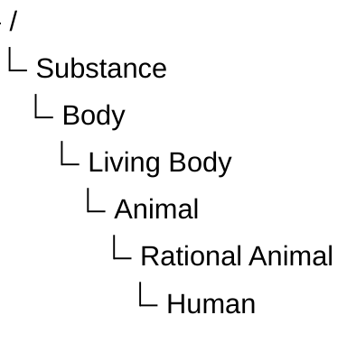
```mermaid
treeView-beta
"Substance"
    "Body"
        "Living Body"
            "Animal"
                "Rational Animal"
                    "Human"
```

Each level introduces an additional distinguishing characteristic while preserving the properties inherited from its parent.

This idea closely resembles the conceptual hierarchies developed in Chapter (16).

For example:


```mermaid
treeView-beta
"Pizza"
    "NamedPizza"
        "MargheritaPizza"
```

Each subclass inherits the semantic meaning of its parent while introducing additional distinguishing characteristics.

Although Protégé displays the ontology as a tree, the tree is not merely a visualization.

It represents a semantic hierarchy in which inheritance preserves knowledge across successive levels of abstraction.

Porphyry therefore transformed Aristotle's philosophical principles into one of history's earliest systematic knowledge organization models.

The influence of the Porphyrian Tree can still be recognized in modern taxonomies, biological classification, library classification systems, enterprise architecture meta-models, and ontology engineering.

For ontology engineers, the lesson remains timeless:

> **A hierarchy is not simply a drawing. It is a semantic organization of knowledge.**

### 17.10.3 Leibniz -- The Dream of a Universal Knowledge Language

During the seventeenth century, **Gottfried Wilhelm Leibniz (1646-1716)** envisioned a remarkable idea that anticipated many goals of modern knowledge representation.

Leibniz imagined a symbolic language capable of expressing all human knowledge with mathematical precision.

He called this vision the **Characteristica Universalis** -- a universal language in which concepts could be represented unambiguously and combined according to logical rules.

He also proposed the **Calculus Ratiocinator** -- a symbolic reasoning system through which disagreements could be resolved by calculation rather than debate.

Leibniz famously imagined two scholars ending an argument by saying:

> *"Let us calculate."*

Although the mathematics and computing technology necessary to realize this vision did not yet exist, the philosophical objective was remarkably similar to that of modern ontology engineering.

Today, OWL ontologies assign every concept a global unique **IRI**, express semantic meaning through formal logic, and allow reasoners to derive conclusions automatically.

The vision is no longer philosophical speculation.

It has become practical engineering.

Modern ontology languages therefore realize, at least in part, Leibniz's centuries-old ambition to **transform knowledge into a form that machines can process objectively and consistently**.

### 17.10.4 Frege -- Modern Predicate Logic

The next major milestone occurred during the nineteenth century through the work of **Gottlob Frege (1848-1925)**.

Where Aristotle's logic primarily analyzed categorical statements, Frege introduced **predicate logic**, providing a far more expressive mathematical language for representing knowledge.

Most importantly, predicate logic introduced **quantifiers**, allowing logical statements to describe entire collections of objects rather than individual examples.

Two quantifiers became fundamental:

| Quantifier | Meaning | Manchester OWL Equivalent |
| :---: | --- | --- |
| **$\forall$** | For all | `only` |
| **$\exists$** | There exists | `some` |

The existential restriction introduced in Exercise 15 therefore has deep historical roots.

When we write:

```text
hasTopping some MozzarellaTopping
```

we are expressing the Description Logic statement:

$\exists \: \text{hasTopping.MozzarellaTopping}$

whose logical origin can be traced directly to Frege's formal treatment of existential quantification.

Similarly, later chapters will introduce universal restrictions such as:

```text
hasTopping only CheeseTopping
```

which correspond to universal quantification.

Frege therefore supplied the mathematical language that eventually enabled logic to become computational rather than merely philosophical.

### 17.10.5 Description Logic -- Making Logic Computable

Although predicate logic is extremely expressive, unrestricted first-order is computationally difficult.

Many reasoning tasks become undecidable, meaning that no algorithm can guarantee termination for every possible knowledge base.

During the late twentieth century, researchers in **knowledge representation** sought a practical compromise.

The result was **Description Logic (DL)**.

Rather than attempting to represent every possible logical statement, Description Logic deliberately limits the available language to carefully designed constructors that preserve **decidability**.

This engineering decision allows automated reasoners to perform important tasks such as:

- satisfiability testing;
- consistency checking;
- subsumption computation;
- equivalence detection; and
- automatic classification.

In other words, Description Logic sacrifices unrestricted expressive power in exchange for reliable computation.

This balance explains why OWL is based upon Description Logic rather than unrestricted predicate logic.

Ontology engineering therefore emphasizes not only logical correctness, but also computational feasibility.

A semantic language is valuable only if machines can reason with it effectively.

### 17.10.6 OWL -- The Modern Realization of a Two-Thousand-Year Journey

The publication of **OWL (Web Ontology Language)** by the World Wide Web Consortium (W3C) represents the modern culmination of this intellectual journey.

OWL did not invent conceptual classification, logical definition, or formal reasoning.

Instead, it integrated ideas developed over more than two thousand years into a practical engineering language for **machine-understandable language**.

The progression can be summarized as follows:

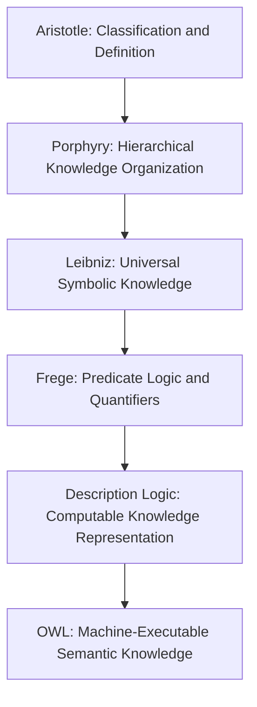
```mermaid
flowchart TD
A[Aristotle: Classification and Definition]
-->B[Porphyry: Hierarchical Knowledge Organization]
-->C[Leibniz: Universal Symbolic Knowledge]
-->D[Frege: Predicate Logic and Quantifiers]
-->E[Description Logic: Computable Knowledge Representation]
-->F[OWL: Machine-Executable Semantic Knowledge]
```

From this perspective, the OWL restriction introduced in Exercise 15 is much more than a piece of Protégé syntax.

The expression:

```text
hasTopping some MozzarellaTopping
```

embodies ideas that began with Aristotle's distinction between **genus** and **differentia**, evolved through centuries of philosophical and mathematical development, and finally became a formally computable representation language capable of supporting automated reasoning.

The ontology engineer working in Protégé therefore participates in a tradition that spans philosophy, mathematics, computer science, and knowledge engineering.

The tools have changed dramatically over the centuries.

The fundamental question, however, has remained remarkably constant:

> **How can knowledge be represented so that its meaning is both precise enough for machines to compute and understandable enough for humans to share?**

### 17.10.7 Reflection -- Why Ontology Engineering Is Different

The historical journey presented in this section reveals an important truth about ontology engineering.

Unlike many areas of software development, ontology engineering is not built solely upon recent advances in computer science.

It draws simultaneously upon **philosophy**, **mathematical**, **logic**, **knowledge organization**, and **software engineering**.

Each discipline contributes a different perspective:

| Discipline | asks |
| --- | --- |
| **Philosophy** | *What does a concept mean?* |
| **Logic** | *How can that meaning be expressed precisely?* |
| **Mathematics** | *Can the representation be defined formally and unambiguously?* |
| **Computer Science** | *Can machines compute with that representation efficiently?* |
| **Knowledge Engineering** | *Can this knowledge remain understandable, reusable, and maintainable as it evolves?* |

Ontology engineering brings these perspectives together into a **single engineering discipline**.

This multi-disciplinary nature explains why developing an ontology differs fundamentally from designing a database schema or implementing an object-oriented software model.

- A database primarily stores **facts**.
- An object-oriented model primarily organizes **software structures and behavior**.
- An ontology, however, attempts to capture the **meaning** of a domain in a form that both humans and machines can understand.

For this reason, ontology engineers must think at multiple levels simultaneously.

They must identify appropriate concepts, organize them into coherent taxonomies, define their semantic characteristics using formal logic, and ensure that these definitions remain computationally tractable for automated reasoning.

The work performed in **Exercise 15** illustrates this broader perspective.

Adding the restriction:

```text
hasTopping some MozzarellaTopping
```

may appear to be a simple editing operation within Protégé.

In reality, this single statement embodies several complementary ideas developed throughout the history of knowledge representation.

From the perspective of **Aristotle**, it contributes part of the *differentia* that distinguishes one concept from another.

From the perspective of **Description Logic**, it represents an existential restriction of the form $\exists \text{R.C}$, expressed using a mathematically defined constructor.

From the perspective of **OWL**, it becomes a machine-interpretable semantic axiom that automated reasoners can evaluate consistently.

From the perspective of the **Semantic Knowledge Development Lifecycle (SKDL)**, it marks the transition from identifying concepts to formally describing their meaning.

Finally, from the perspective of the **Executable Knowledge Architecture (EKA)**, it enriches the **$K$ - Knowledge Graph layer** with semantics that will enables reasoning ($R$ - Reasoning and Rules layer), governance ($\Gamma$ - Governance layer), validation, and ultimately executable intelligence.

These perspectives are not separate interpretations of the same statement.

They are complementary layers of understanding that coexist within every well-designed ontology.

Professional ontology engineers therefore develop more than technical proficiency with Protégé or OWL syntax.

They cultivate the ability to think simultaneously as philosophers, mathematicians, software engineers, and knowledge architects.

This broader perspective explains why ontology engineering occupies a unique position within modern information systems.

It is the discipline that transforms isolated data into structures knowledge, structured knowledge into formal semantics, and formal semantics into machine-executable intelligence.

The remaining chapters of this book continue that transformation.

Having established the conceptual vocabulary in **Stage 1** and introduced formal semantic descriptions in **Stage 2**, we are now ready to explore how semantic knowledge can be organized, reused, governed, validated, and eventually reasoned over in a systematic and scalable manner.

Viewed from this perspective, the OWL constructs introduced in this chapter are not isolated language features.

They are the first practical steps in a much larger journey -- one that began over two thousand years ago with philosophical questions about the nature of concepts and continues today through the engineering of executable knowledge systems.

## 17.11 Engineering Perspective -- Meaning Before Reasoning

Throughout this chapter, we have progressively enriched the `Pizza` ontology with its first formal semantic descriptions. Using Description Logic (DL) class expressions, we transformed `MargheritaPizza` from a simple concept within a taxonomy into a concept possessing machine-understandable semantic characteristics.

Although these semantic descriptions may appear modest, they establish one of the most important engineering principles in ontology development:

> **Reasoning cannot begin until meaning has first been formally described.**

This principle extends far beyond the `Pizza` tutorial.

Whether constructing enterprise knowledge graphs, biomedical ontologies, digital twins, or intelligent AI systems, automated reasoning always depends upon a previously established semantic model.

> A reasoner does not invent knowledge!

Instead, it derives new conclusions by applying formal logic to knowledge that has already been explicitly described.

Consequently, semantic description should be viewed not as reasoning itself, but as the engineering activity that prepares an ontology for future reasoning.

### 17.11.1 Semantics Description Provides the Raw Material for Reasoning

Many beginners imagine that ontology reasoners behave similarly to modern Large Language Models (LLMs), capable of generating knowledge from incomplete information.

This is not how Description Logic reasoners operate.

A DL reasoner performs logical inference over **explicitly defined semantics**.

If no semantic meaning has been modeled, the reasoner has nothing upon which to operate.

For example, immediately after **Exercise 14**, the ontology contained the following conceptual hierarchy:

```text
Pizza
    NamedPizza
        MargheritaPizza
```

Although this hierarchy organized the conceptual vocabulary, it contained almost no semantic information.

A reasoner could verify that the taxonomy remained logically consistent, but it could not infer anything interesting about pizzas because the ontology had not yet described what distinguished one pizza from another.

**Exercise 15** introduced the first semantic restrictions:

```text
hasTopping some MozzarellaTopping
hasTopping some TomatoTopping
```

These restrictions do not perform reasoning.

Instead, they establish the semantic conditions upon which future reasoning will operate.

This distinction is fundamental.

> **Semantic description defines knowledge. Reasoning derives knowledge.**

### 17.11.2 Every Restriction Should Capture One Independent Semantic Fact

One of the most effective engineering practices in ontology development is to treat each restriction as expressing **one independent semantic statement**.

Rather than attempting to describe an entire concept through a single large logical expression, ontology engineers typically build semantic definitions from multiple small, understandable restrictions.

For example, **Exercise 15** introduces two separate restrictions:

```text
hasTopping some MozzarellaTopping
hasTopping some TomatoTopping
```

Although these restrictions eventually contribute to the semantic description of `MargheritaPizza`, each communicate exactly one piece of domain knowledge.

The first states that every Margherita pizza possesses at least one mozzarella topping.

The second states that every Margherita pizza possesses at least one tomato topping.

Keeping these semantic statements separate provides several important engineering advantages:

- Individual restrictions remain easy to read and review.
- Semantic changes affect only one logical statement.
- Domain experts can validate each assertion independently.
- Additional restrictions can be introduced without rewriting existing ones.
- Reasoning results become easier to explain and debug.

Only after several independent semantic facts have been validated should they be viewed collectively as the **semantic description** of the concept.

This modular approach closely resembles good software engineering.

Rather than writing one enormous function, developers divide behavior into smaller methods.

Likewise, ontology engineers divide semantic meaning into reusable logical components:

> **One restriction should normally express one semantic fact.**
> **Complex meaning should emerge through composition rather than monolithic expressions.**

Future chapters will continue enriching the ontology through additional Description Logic constructors, progressively increasing its semantic expressiveness while preserving the stable conceptual foundation established in Stage 1.

### 17.11.3 Engineering Analogy -- Blueprint Before Construction

Every mature engineering discipline distinguishes between **design** and **execution**.

Construction engineers do not begin by pouring concrete before architectural drawings have been completed.

Mechanical engineers do not manufacture components before the product has been designed.

Likewise, ontology engineers should not expect automated reasoning to compensate for concepts whose semantic meaning has never been explicitly modeled.

**Semantic Description** serves the same role as an engineering blueprint.

A blueprint does not construct the building.

Instead, it specifies enough structural information for construction to proceed safely and consistently.

Similarly, OWL restrictions do not perform reasoning themselves.

Rather, they provide the formal semantic specification upon which the reasoner operates.

This distinction mirrors the progression established throughout the **Semantic Knowledge Development Lifecycle (SKDL)**:

- **Stage 1** establishes the conceptual structure.
- **Stage 2** enriches that structure with semantic meaning.
- Only after sufficient semantic knowledge exists can later stages perform validation, reasoning, governance, and ultimately executable intelligence.

Attempting to reason without semantic description is therefore comparable to attempting construction without architectural plans.

There is simply nothing sufficiently precise for the execution process to interpret.

> **Semantic descriptions are the blueprints from which reasoning constructs new knowledge.**

### 17.11.4 Incremental Semantic Maturity

One of the most important engineering principles illustrated by **Exercise 15** is that:

> semantic models mature gradually.

Beginners often believe an ontology should contain complete logical definitions as soon as classes are created.

Professional ontology development follows different philosophy.

- Semantic meaning accumulates incrementally.
- Each restriction contributes another piece of knowledge.
- Each chapter introduces additional logical precision.
- Each validation cycle improves semantic quality.

**Exercise 15** deliberately introduces only two existential restrictions:

```text
hasTopping some MozzarellaTopping
hasTopping some TomatoTopping
```

These restrictions do not completely define a Margherita pizza.

Instead, they establish an **initial** semantic description that can be extended later.

Future chapters will introduce:

- universal restrictions (`only`);
- cardinality restrictions (`min`, `max`, `exactly`);
- equivalent class definitions;
- reusable semantic patterns; and
- automated classification through Description Logic.

This gradual refinement reflects an important engineering principle:

> **Semantic quality improves through iteration rather than completeness on the first attempt.**

The Open World Assumption discussed earlier in this chapter & book naturally supports this development strategy.

Knowledge is expected to grow.

Semantic descriptions therefore remain open to future refinement as domain understanding evolves.

### 17.11.5 Design Semantic Models for Humans First

Although OWL restrictions are ultimately interpreted by machines, they are first created, reviewed, maintained, and governed by people.

Consequently, semantic models should be designed with human understanding in mind.

**Clear class names**, **consistent modeling patterns**, and **readable class expressions**  reduce the effort required to maintain an ontology over time.

For example, `hasTopping some MozzarellaTopping` communicates its meaning - to human - almost immediately.

By contrast, deeply nested class expressions containing numerous logical operators may be mathematically correct while remaining difficult for ontology engineers to understand and maintain.

Professional ontology engineering therefore **balances** two complementary objectives:

- logical precision for automated reasoning; and
- conceptual clarity for human comprehension.

As ontologies expand to thousands or even millions of concepts, **readability** becomes an essential aspect of engineering quality rather than merely a stylistic preference.

A semantic model that cannot be understood by its maintainers is unlikely to remain correct over the long term.

### 17.11.6 Let the Reasoner Become Your Design Assistent

Many beginners regard the reasoner as a validation tool that is executed only after modeling has finished.

Experienced ontology engineers use it very differently.

The reasoners become **an active design assistant** throughout ontology development.

After introducing each new semantic restriction, the ontology should be synchronized and classified.

This continuous feedback allows engineers to detect:

- inconsistent class definitions;
- unsatisfiable concepts;
- unintended subclass relationships;
- missing semantic constraints; and
- unexpected logical consequences.

Rather than:

> waiting until the ontology is complete,

semantic validation:

> becomes part of the normal modeling workflow.

**Exercise 15** already demonstrates this engineering practice.

Immediately after introducing the new restrictions, the tutorial instructs the reader to synchronize the reasoner and verify that the ontology remains logically consistent.

This iterative workflow greatly reduces debugging effort while improving confidence in the semantic model as it evolves.

### 17.11.7 Engineering Discipline Throughout the Semantic Knowledge Development Lifecycle

The principles introduced in this chapter extend well beyond **Exercise 15**.

They establish an engineering discipline that will guide every remaining stage of the Semantic Knowledge Development Lifecycle (SKDL).

Throughout SKDL, ontology engineers should consistently apply the following practices:

- establish conceptual structure before semantic definition (meaning);
- introduce semantic descriptions incrementally;
- validate changes continuously using the reasoner;
- prefer readable and reusable class expressions;
- avoid premature logical commitments; and
- allow semantic knowledge to mature alongside the ontology.

These practices enable semantic models to evolve naturally while preserving **logical consistency**, **maintainability**, and **extensibility**.

They also prepare the ontology for the more advanced stages of SKDL, including semantic reuse, governance, automated reasoning, and executable intelligence.

### 17.11.8 Engineering Takeaway

**Exercise 15** introduces only two OWL restrictions, yet it represents a significant transition in ontology engineering.

For the first time, concepts acquire formal semantic meaning that can be interpreted mathematically and processed automatically by Description Logic reasoners.

The engineering lesson extends far beyond Protégé.

Semantic description should not be viewed as writing logical syntax for its own sake.

Instead, it is the disciplined process of transforming conceptual structures into precise, machine-understandable knowledge.

When semantic models are **developed incrementally**, **validated continuously**, and **expressed clearly**, they become a durable foundation upon which increasingly sophisticated knowledge systems can be constructed.

This philosophy will continue to guide every subsequent stage of the Semantic Knowledge Development Lifecycle.

From this point onward, the ontology will evolve not simply by adding new concepts, but by enriching those concepts with progressively
- deeper semantic meaning,
- stronger logical precision, and
- greater capacity

for automated knowledge processing.

## 17.12 EKA Perspective -- Stage 2 Enriches $K$ and Prepares $R$

## 17.13 Engineering Guidelines

Examples:

- Don't over-constrain too early
- Add semantics incrementally
- Reuse restrictions
- Prefer readable class expressions
- Validate after every change
- Use the reasoner continuously

## 17.14 Key Concepts

## 17.15 Chapter Summary

## 17.16 Looking Ahead -- Toward Knowledge Reuse

---

Last Updated at 2026-07-31