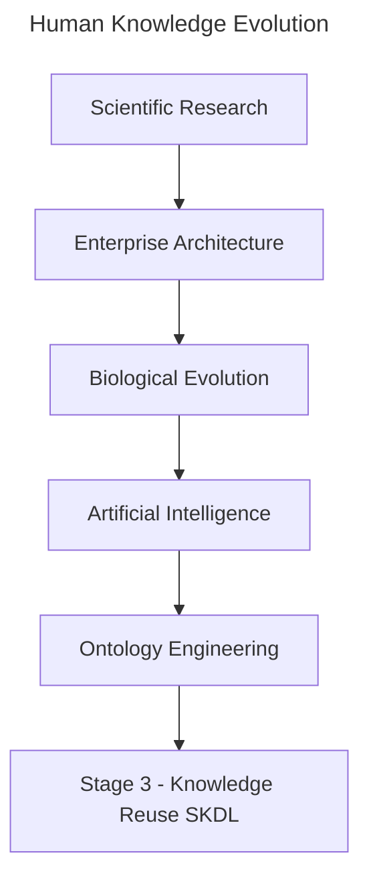

# Chapter 18 -- Knowledge Reuse: Stage 3 of the Semantic Knowledge Development Lifecycle

**Reusing Semantic Knowledge Through OWL Design Patterns**

> *"Knowledge becomes truly valuable not when it is created once, but when it can be reused many times.*

The first two stages of the **Semantic Knowledge Development Lifecycle (SKDL)** established the foundations of ontology engineering.

In **Stage 1 -- Conceptual Modeling**, we identified the concepts that define a knowledge domain and organized them into a coherent semantic taxonomy.

In **Stage 2 -- Semantic Description**, we enriched those concepts with formal meaning using Description Logic (DL), OWL restrictions, and class expressions

At this point, our ontology is capable of representing knowledge with precision and consistency.

However, another important engineering question naturally arises:

> **Should every new ontology repeatedly define the same knowledge from scratch?**

Professional ontology engineering answers this question with a clear **NO**.

Instead of repeatedly recreating existing semantic knowledge, mature ontology engineers seek to **reuse**, **extend**, and **specialized** proven knowledge assets whenever possible.

This philosophy is not unique to ontology engineering.

Throughout science, engineering, enterprise architecture, biology, and modern artificial intelligence, progress depends far more on **knowledge reuse** than on continual reinvention.

- Scientific discoveries build upon earlier research.
- Organizations reuse proven architectural assets before investing in new solutions.
- Biological evolution preserves successful genetic structures while adapting them to new environments.
- Large Language Models reuse previously learned representations through transfer learning, fine-tuning, retrieval-augmented generation (RAG), and knowledge distillation.

Across every mature discipline, complexity grows because knowledge accumulates rather than being recreated.

Ontology engineering following exactly the same principle.

Once semantic knowledge has been carefully designed, validated, and understood, it should become a **reusable asset** that can be shared across concepts, ontologies, projects, organizations, and even industries.

Knowledge reuse therefore represents much more than a modeling convenience.

It improves semantic consistency, reduces duplication, lowers maintenance costs, simplifies governance, and enables knowledge to evolve systematically over time.

Within the **Executable Knowledge Architecture (EKA)** framework, reusable semantic knowledge also represents an important step toward building executable knowledge systems whose intelligence can be shared across multiple applications rather than remaining isolated within individual models.

This chapter introduces **Stage 3 -- Knowledge Reuse** of the Semantic Knowledge Development Lifecycle.

Beginning with **Exercise 16** from the *Protégé 5 New OWL Pizza Tutorial*, we will explore how OWL supports semantic reuse through reusable modeling patterns, inheritance, and logical abstraction.

From there, we will examine knowledge reuse from multiple complementary perspectives, including
- software engineering,
- Enterprise Architecture,
- scientific research,
- biological evolution,
- mathematical abstraction, and
- modern Artificial Intelligence.

By the end of this chapter, you will recognize that **knowledge reuse is not simply another OWL modeling technique**.

It is one of the fundamental engineering principles underlying the growth of human knowledge itself.

Whether knowledge is transmitted through scientific publications, enterprise architecture repositories, biological genomes, AI foundation models, or semantic ontologies, the underlying principle remains the same:

> **Progress is achieved not by repeatedly creating knowledge, but by continuously reusing, refining, and extending the knowledge that already exists.**

In summary view:



## 18.1 Introduction -- From Individual Knowledge to Reusable Knowledge

One of the defining characteristics of human intelligence is that **knowledge accumulates through reuse rather than constant reinvention**.

Very few ideas emerge completely from nothing.

- Scientists build upon previous discoveries.
- Engineers refine proven designs.
- Software developers reuse established libraries and frameworks.
- Enterprise architects leverage reference architectures and reusable capability models.
- Even biological evolution progresses by preserving successful genetic structures while gradually introducing variation over successive generations.

The same principle applies equally to ontology engineering.

After completing **Stage 2 -- Semantic Description** in the previous chapter, the `Pizza` ontology now contains its first meaningful semantic definitions.

For example, `MargheritaPizza` is no longer merely a named concept within a taxonomy.

It has begun acquiring formal **semantic meaning** through restrictions such as:

```text
hasTopping some MozzarellaTopping
hasTopping some TomatoTopping
```

These semantic descriptions successfully define one particular pizza.

However, an important engineering question immediately arises.

> **What happens when the ontology grows from one pizza to one hundred pizzas?**

Should ontology engineers repeatedly recreate similar restrictions for every new pizza?

Should identical semantic structures be copied manually throughout the ontology?

Or should common semantic knowledge itself become a reusable engineering asset?

These questions motivate the next stage of the **Semantic Knowledge Development Lifecycle (SKDL)**:

> **Stage 3 -- Knowledge Reuse.**

Knowledge reuse extends a principle that has already appeared throughout this book.

During **Stage 1**, we reused conceptual abstractions through inheritance.

During **Stage 2**, we reused logical constructors provided by Description Logic.

Now we begin reusing **semantic knowledge itself**.

Instead of treating every class definition as an **isolated** piece of work, ontology engineers identify common semantic patterns that can be shared consistently across multiple concepts.

As ontologies continue to expand, this shift becomes increasingly important.

Without systematic reuse, semantic models gradually accumulate duplicated restrictions, inconsistent definitions, and unnecessary maintenance effort.

Small ontologies may tolerate these problems.

But large enterprise knowledge graphs containing tens of thousands of concepts cannot.

Consequently, knowledge reuse should not be viewed merely as a convenient.

It is a **fundamental engineering discipline** for controlling semantic complexity while maintaining consistency across as evolving ontology.

**Exercise 16** introduces this ideas through a seemingly simple modeling activity.

Rather than creating an entirely new semantic definition from scratch, we begin constructing additional pizza concepts by **reusing semantic structures that already exist.**

Although the practical exercise requires only a few operations within Protégé, its engineering significance extends far beyond the user interface.

The chapter introduces a principle that appears repeatedly across computer science and engineering:

> **Well-designed knowledge should be created once, reused many times, and refined only when necessary.**

This philosophy can be observed across numerous disciplines.

Software engineering encourages developers to reuse libraries before writing new code.

Enterprise Architecture promotes the principle of **Reuse before Buy before Build**, emphasizing that organizations should first leverage existing assets, then evaluate commercial solutions (COTS - Commercial Off-The-Shelf), and only build new capabilities when reuse is insufficient.

Scientific research advances through citation, where each new publication extends previously established knowledge rather restarting from first principles.

Modern Artificial Intelligence likewise depends heavily upon knowledge reuse.

Foundation models learn from vast collections of existing human knowledge, while techniques such as **knowledge distillation** transfer capabilities from larger models into smaller onces by reusing learned representations rather than rediscovering them independently.

Even nature follows the same strategy.

Biological evolution preserves successful genetic information across generations, allowing complex organisms to emerge through continuous reuse, adaptation, and refinement rather than repeated creation from scratch.

Ontology engineering belongs to this same engineering tradition.

Reusable semantic patterns
- reduce duplication,
- improve consistency,
- simplify maintenance, and
- enable knowledge to evolve in a controlled and scalable manner.

Throughout this chapter, we will examine **knowledge reuse** from multiple complementary perspectives.

Beginning with **Exercise 16** in the `Pizza` ontology tutorial, we will progressively explore semantic reuse patterns, ontology modularity, engineering design principles, Enterprise Architecture, biological evolution, modern AI, and the role of reusable knowledge within the **Executable Knowledge Architecture (EKA)**.

By the end of this chapter, you will recognize that **knowledge reuse is far more than copying existing ontology elements.**

It represents one of the most important characteristics of **mature knowledge systems** -- a principle that enables ontologies, enterprise architectures, scientific knowledge, artificial intelligence, and even biological life to grow in complexity while remaining coherent, maintainable, and sustainable over time.


---

Last updated at: 2026-08-05