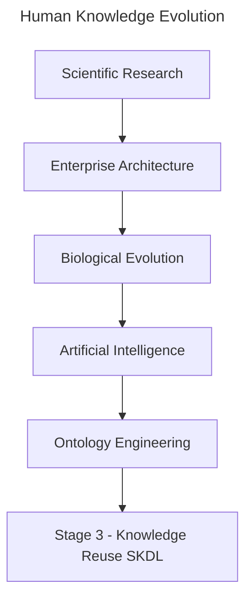
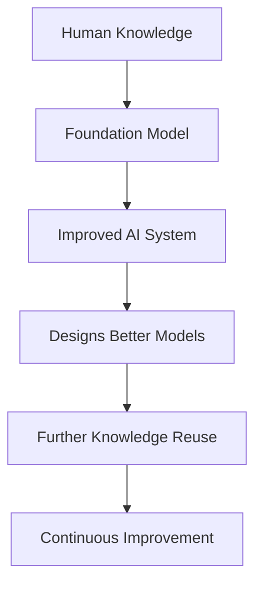

# Chapter 18 -- Knowledge Reuse: Stage 3 of the Semantic Knowledge Development Lifecycle

**Reusing Semantic Knowledge Through OWL Design Patterns**

> *"Knowledge becomes truly valuable not when it is created once, but when it can be reused many times.*

The first two stages of the **Semantic Knowledge Development Lifecycle (SKDL)** established the semantic foundations of ontology engineering.

During **Stage 1 -- Conceptual Modeling**, we identified the concepts that define a knowledge domain and organized them into a coherent semantic taxonomy.

During **Stage 2 -- Semantic Description**, we enriched those concepts with formal meaning using **Description Logic (DL)**, OWL restrictions, and class expressions

By the end of **Chapter (17)**, our ontology was no longer simply a collection of class names.

It had become a **formal semantic knowledge model** whose concepts possess machine-understandable meaning.

At this point, however, another important engineering question naturally arises:

> **Once semantic knowledge has been created, how should it be managed as the ontology continues to grow?**

Should every new concept independently redefine knowledge that already exists?

Should ontology engineers repeatedly recreate similar semantic descriptions?

Or should previously established semantic knowledge itself become a reusable engineering asset?

Professional ontology engineering adopts the **third approach**.

Rather than viewing semantic definitions as isolated pieces of modeling work, mature ontologies treat them as **reusable knowledge assets** that can be shared, extended, specialized, and maintained systematically across the entire knowledge base.

This philosophy introduces **Stage 3 -- Knowledge Reuse** of the Semantic Knowledge Development Lifecycle (SKDL).

The objective of this stage is not to create additional semantic knowledge simply for its own sake.

Instead, it is to organize semantic knowledge so that it can be **reused consistently**, reducing duplication while improving maintainability, scalability, and long-term semantic quality.

Within the **Executable Knowledge Architecture (EKA)**, this transition represents another important increase in engineering maturity.

Knowledge is no longer viewed merely as information stored within an ontology.

Instead, semantic knowledge begins evolving into a reusable engineering asset capable of supporting
- multiple concepts,
- multiple ontologies,
- multiple applications, and
- eventually multiple intelligent systems.

Beginning with **Exercise 16** from the *Protégé 5 New OWL Pizza Tutorial*, this chapter explores how OWL enables semantic reuse through inheritance, logical abstraction, reusable modeling patterns, and carefully designed class definitions.

Along the way, we will examine knowledge reuse from multiple complementary perspectives, including software engineering, Enterprise Architecture, scientific research, biological evolution, mathematical abstraction, and modern Artificial Intelligent.

By the end of this chapter, you will recognize that **knowledge reuse is far more than another OWL modeling technique**.

It represents one of the universal engineering principles through which human knowledge continuously grows, evolves, and accumulates over time.



Whether knowledge is transmitted through scientific publications, enterprise architecture repositories, biological genomes, AI foundation models, or semantic ontologies, the underlying principle remains the same:

> **Progress is achieved not by repeatedly creating knowledge, but by continuously reusing, refining, and extending the knowledge that already exists.**

---

Table of Contents

- [18.1 Introduction -- From Individual Knowledge to Reusable Knowledge](#181-introduction----from-individual-knowledge-to-reusable-knowledge)
- [18.2 Why Knowledge Reuse Is a Universal Engineering Principle](#182-why-knowledge-reuse-is-a-universal-engineering-principle)
  - [18.2.1 Reuse in Software Engineering](#1821-reuse-in-software-engineering)
  - [18.2.2 Reuse in Enterprise Architecture](#1822-reuse-in-enterprise-architecture)
  - [18.2.3 Reuse in Scientific Research](#1823-reuse-in-scientific-research)
  - [18.2.4 Reuse in Biological Evolution](#1824-reuse-in-biological-evolution)
  - [18.2.5 Reuse in Artificial Intelligence](#1825-reuse-in-artificial-intelligence)
    - [18.2.5.1 From Knowledge Reuse to Recursive Improvement](#18251-from-knowledge-reuse-to-recursive-improvement)
  - [18.2.6 From Universal Principle to Ontology Engineering](#1826-from-universal-principle-to-ontology-engineering)
- [18.3 Position Within SKDL -- Stage 3 Highlighted](#183-position-within-skdl----stage-3-highlighted)
- [18.4 Exercise 16 -- Reusing Existing Semantic Knowledge](#184-exercise-16----reusing-existing-semantic-knowledge)
- [18.5 Why Knowledge Reuse Matters](#185-why-knowledge-reuse-matters)
- [18.6 Reuse as an Engineering Principle](#186-reuse-as-an-engineering-principle)
- [18.7 Reuse Across Enterprise Architecture](#187-reuse-across-enterprise-architecture)
- [18.8 Mathematical Perspective -- Abstraction, Generalization and Reuse](#188-mathematical-perspective----abstraction-generalization-and-reuse)
- [18.9 Interesting Reading -- Knowledge Reuse from Biology to Artificial Intelligence](#189-interesting-reading----knowledge-reuse-from-biology-to-artificial-intelligence)
- [18.10 Engineering Perspective -- Reuse Before Buy Before Build](#1810-engineering-perspective----reuse-before-buy-before-build)
- [18.11 EKA Perspective -- Stage 3 Strengthens $K$ and Prepares $\\Gamma$](#1811-eka-perspective----stage-3-strengthens-k-and-prepares-gamma)
- [18.12 Engineering Guidelines](#1812-engineering-guidelines)
- [18.13 Key Concepts](#1813-key-concepts)
- [18.14 Chapter Summary](#1814-chapter-summary)
- [18.15 Looking Ahead -- Toward Semantic Governance](#1815-looking-ahead----toward-semantic-governance)


## 18.1 Introduction -- From Individual Knowledge to Reusable Knowledge

One of the defining characteristics of human civilization is that **knowledge accumulates through reuse rather than continual reinvention**.

Very few ideas are created in complete isolation.

Instead, almost every advance builds upon knowledge that already exists.

Scientists extend previous discoveries through research and citation.

Engineers improve proven designs rather than redesigning every component from first principles.

Software developers reuse libraries, frameworks, and design patterns instead of repeatedly implementing identical functionality.

Enterprise architects organize reusable business capabilities, reference architectures, and architectural building blocks that can support numerous initiatives across an organization.

Even biological evolution follows the same principle.

Rather than redesigning living organisms from the beginning, evolution preserves successful genetic information across generations while gradually introducing variation through mutation and natural selection.

Modern Artificial Intelligence demonstrates a remarkably similar pattern.

Foundation models learn from enormous collections of accumulated human knowledge, while techniques such as **transfer learning, Retrieval-Augmented Generation (RAF)**, and **knowledge distillation** continually reuse previous acquired knowledge to solve new problems more effectively.

Although these disciplines appear unrelated, they all reflect the same underlying engineering principle:

> **Progress is achieved not by repeatedly creating knowledge, but by continuously reusing, refining, and extending existing knowledge.**

Ontology engineering is no exception.

After completing **Stage 2 -- Semantic Description**, the `Pizza` ontology now contains its first meaningful semantic definitions.

For example, `MargheritaPizza` is no longer merely a concept within a taxonomy.

It possesses formal semantic descriptions through restrictions such as:

```text
hasTopping some MozzarellaTopping
hasTopping some TomatoTopping
```

These restrictions successfully describe one particular pizza.

However, an important engineering challenge immediately appears.

As the ontology expands from a handful of concepts to hundreds -- or even millions -- of concepts, should ontology engineers repeatedly recreate similar semantic definitions?

Or should those semantic descriptions themselves become reusable knowledge assets?

This question motivates **Stage 3 -- Knowledge Reuse** of the Semantic Knowledge Development Lifecycle (SKDL).

**Knowledge reuse** extends the engineering principles established in the previous chapters.

- **Stage 1** introduced reusable conceptual abstractions through semantic taxonomies.
- **Stage 2** introduced reusable logical constructors through Description Logic (DL).
- Now **Stage 3** goes one step further by creating **semantic knowledge itself as reusable**.

Rather than viewing each class definition as an isolated modeling exercise, ontology engineers identify semantic patterns that can be shared consistently across many concepts.

As ontologies continue to grow, this shift becomes increasingly important.

Without systematic, reuse, semantic models gradually accumulate duplicated restrictions, inconsistent definitions, unnecessary maintenance effort, and increasingly governance complexity.

Small educational ontologies may tolerate such duplication

Large enterprise knowledge graphs containing tens of thousands of concepts **CANNOT**.

Knowledge reuse therefore should not be viewed simply as a convenient modeling technique.

It represents a fundamental engineering discipline for controlling semantic complexity while enabling ontologies to evolve sustainably over long periods of time.

This engineering philosophy is familiar across many mature disciplines.

Enterprise Architecture promotes the principle of **Reuse before Buy before Build**, encouraging organizations to maximize the value of existing architectural assets before acquiring or constructing new solutions.

Scientific research measures impact not only by creating new knowledge, but also by how frequently that knowledge is reused and extended through subsequent publications.

Likewise, successful ontologies are characterized not by the number of concepts they contain, but by the extent to which their semantic knowledge can be reused consistently throughout the knowledge base.

**Exercise 16** introduces this principle through a seemingly simple modeling activity.

Rather than creating entirely new semantic definitions from scratch, we begin constructing new ontology concepts by reusing semantic structures that already exist.

Although the practical exercise requires only a small number of operations within Protégé, its engineering significance extends far beyond the user interface.

It introduces one of the defining characteristics of every mature engineering discipline:

> **Well-designed knowledge should be created once, reused many times, and refined only when necessary.**

Throughout this chapter, we will examine knowledge reuse from practical, engineering, mathematical, architectural, biological, and artificial intelligence perspectives.

By the end of the chapter, you will recognize that reusable semantic knowledge is more than a modeling convenience.

It is a **reusable knowledge asset** -- one that enables ontologies, enterprise architectures, scientific knowledge, AI systems, and even biological life to grow in complexity while remaining coherent, maintainable, and sustainable.

## 18.2 Why Knowledge Reuse Is a Universal Engineering Principle

One of the most remarkable characteristics shared by mature engineering disciplines is that:

> **progress depends far more on reuse than on continual reinvention**.

Although innovation often receives the greatest attention, sustained progress is rarely achieved by repeatedly creating everything from the beginning.

Instead, successful systems grow by preserving proven knowledge while extending it to address new challenges.

This principle appears so consistently across science and engineering that it can reasonably be regarded as a universal engineering law.

Ontology engineering is no exception.

Once semantic knowledge has been carefully **designed**, **validated**, and **understood**, it becomes an engineering asset that should be reused rather than recreated. **Exercise 16** introduces this principle within the `Pizza` ontology, but its significance extends far beyond OWL or Protégé. It reflects a pattern that underlies software engineering, enterprise architecture, scientific research, biology, mathematics, and modern artificial intelligence.

The remainder of this chapter explores these perspectives to demonstrate that **knowledge reuse is not merely an ontology technique -- it is a fundamental mechanism through which complex knowledge systems evolve.**

### 18.2.1 Reuse in Software Engineering

Software engineering has long recognized that **maintainability depends upon systematic reuse**.

Modern applications are rarely developed entirely from scratch.

Instead, developers build upon existing programming languages, operating systems, libraries, frameworks, APIs, design patterns, and open-source ecosystems.

When creating a new application, an experienced engineer does not begin by writing a new compiler, networking stack, or database engine. Instead, existing components are reused whenever they have already demonstrated correctness, reliability, and maintainability.

This philosophy is reflected in principle such as:
- Design Patterns
- Don't Repeat Yourself (DRY)
- Convention over Configuration
- Framework-based Development
- Package Management Ecosystems

**Knowledge reuse** therefore reduces both development effort and engineering risk.

Ontology engineering follows exactly the same philosophy.

Instead of repeatedly redefining identical semantic structures, reusable ontology patterns become the semantic equivalent of software libraries.

### 18.2.2 Reuse in Enterprise Architecture

Enterprise Architecture extends this philosophy from software components to organizational knowledge.

Rather than designing every capability independently, mature EA practices encourage organizations to reuse proven architectural assets whenever possible.

A widely recognized principle is:

> **Reuse before Buy before Build**

The sequence reflects increasing cost and decreasing reuse --

1. Reuse existing enterprise assets.
2. Purchase proven commercial capability (Commercial Off-The-Shelf, or COTS) when suitable assets are unavailable.
3. Build new solutions only when neither reuse nor acquisition satisfies the business need.

This principle minimizes duplication, reduces operational risk, improves governance, and accelerates delivery.

Semantic knowledge should be treated in exactly the same way.

Well-designed ontology modules, reusable class expressions, common vocabularies, and shared semantic patterns become enterprise assets that can be leveraged across projects rather than recreated independently.

Within the EKA framework, reusable semantic knowledge represents reusable organizational intelligence.

### 18.2.3 Reuse in Scientific Research

Scientific knowledge advances through cumulative refinement rather than isolated discovery.

Every research paper beings with a literature review because no scientific contribution exists in isolation.

Researchers study previous work, identify existing theories, reproduce experiments, extend established results, and contribute only the incremental knowledge that advances the field.

Consequently, one indicator of a publications' long-term impact is the number of times it is cited by subsequent research.

A highly cited paper demonstrates that its knowledge has been successfully reused by the scientific community.

Knowledge therefore achieves influence not simply by being published, but by becoming reusable.

Ontology engineering follows the same principle.

A reusable ontology contributes value far beyond its original project because its semantic structures can support future ontologies, knowledge graphs, and intelligent applications.

### 18.2.4 Reuse in Biological Evolution

Nature itself demonstrates perhaps the most successful example of knowledge reuse.

The genomes of modern organisms are not created independently fro every generation.

Instead, genetic information is inherited, reused, recombined, and gradually refined through evolutionary processes.

Successful biological structures persist because they continue to prove useful under changing environmental conditions.

Evolution therefore preserves accumulated biological knowledge while permitting incremental adaptation.

Complex life emerges through billions of years of reuse rather than continual recreation.

Ontology evolution follows a remarkably similar pattern.

Successful semantic structures should likewise be inherited, extended, specialized, and adapted instead of repeatedly reconstructed.

### 18.2.5 Reuse in Artificial Intelligence

Recent advances in Artificial Intelligence further illustrate the importance of reusable knowledge.

Large Language Models are trained on vast collections of accumulated human knowledge rather than beginning with an empty understanding of the world.

Subsequent techniques continue this philosophy:

- Transfer Learning
- Fine-Tuning
- Retrieval-Augmented Generation (RAG)
- Knowledge Distillation
- Model Adaptation

Each technique seeks to reuse previously learned knowledge instead of rediscovering it independently.

Knowledge distillation provides an especially compelling example.

Rather than retraining a smaller model from the beginning, knowledge learned by a larger model is transferred into a more efficient representation.

The objective is not to recreate intelligence but to reuse it.

Ontology engineering pursues the same objective.

Semantic definitions, once established, should become reusable knowledge assets capable of supporting future applications.

#### 18.2.5.1 From Knowledge Reuse to Recursive Improvement

Recent discussions surrounding **Artificial General Intelligence (AGI)** have introduced another perspective on knowledge reuse.

One frequently discussed hypothesis proposes that once an AI system becomes capable of contributing to AI research itself, it may begin improving the very models from which it originated.

Conceptually, the process can be viewed as:



Whether such recursive improvement ultimately reaches the levels sometimes predicted remains an open scientific question.

Nevertheless, one observation is already clear:

> **Each generation of AI systems is built primarily by reusing the accumulated knowledge of previous generations rather than beginning from an empty state.**

Modern foundation models do not rediscover mathematics, language, software engineering, medicine, or ontology engineering independently.

They inherit enormous amounts of previously created human knowledge through trained corpora, reusable model architectures, transfer learning, fine-tuning, retrieval mechanisms, and knowledge distillation.

Even when new capabilities emerge, they typically represent **extensions of existing knowledge rather than complete reinvention**.

Consequently, **knowledge reuse** is becoming not merely an optimization technique, but one of the central mechanisms through which modern AI systems continue to evolve.

Ontology engineering follows the same engineering philosophy.

Every reusable ontology, semantic pattern, and knowledge graph contributes to a growing body of machine-interpretable knowledge that future intelligent systems may build upon rather than recreate.

### 18.2.6 From Universal Principle to Ontology Engineering

Across all these disciplines, a common pattern emerges as below:

| Discipline | Reusable Asset |
| --- | --- |
| Software Engineering | Libraries, frameworks, APIs |
| Enterprise Architecture | Capability maps, reference architectures, reusable building blocks |
| Scientific Research | Publications, theories, experimental evidence |
| Biology | Genetic information |
| Artificial Intelligence | Learned representations, foundation models, distilled knowledge |
| Ontology Engineering | Ontologies, semantic patterns, reusable class expressions |

Although the artifacts differ, the engineering philosophy remains remarkably consistent.

> **Knowledge becomes increasingly valuable as its ability to be reused increases.**

**Exercise 16** now introduces this same principle within OWL ontology engineering.

The objective is no longer merely to define semantic knowledge correctly, but to organize that knowledge so it can be
- reused consistently,
- governed effectively, and
- extended systematically

throughout the remainder of the **Semantic Knowledge Development Lifecycle (SKDL)**.

## 18.3 Position Within SKDL -- Stage 3 Highlighted

## 18.4 Exercise 16 -- Reusing Existing Semantic Knowledge

## 18.5 Why Knowledge Reuse Matters

## 18.6 Reuse as an Engineering Principle

## 18.7 Reuse Across Enterprise Architecture

## 18.8 Mathematical Perspective -- Abstraction, Generalization and Reuse

## 18.9 Interesting Reading -- Knowledge Reuse from Biology to Artificial Intelligence

## 18.10 Engineering Perspective -- Reuse Before Buy Before Build

## 18.11 EKA Perspective -- Stage 3 Strengthens $K$ and Prepares $\Gamma$

## 18.12 Engineering Guidelines

## 18.13 Key Concepts

## 18.14 Chapter Summary

## 18.15 Looking Ahead -- Toward Semantic Governance

---

Last updated at: 2026-08-05