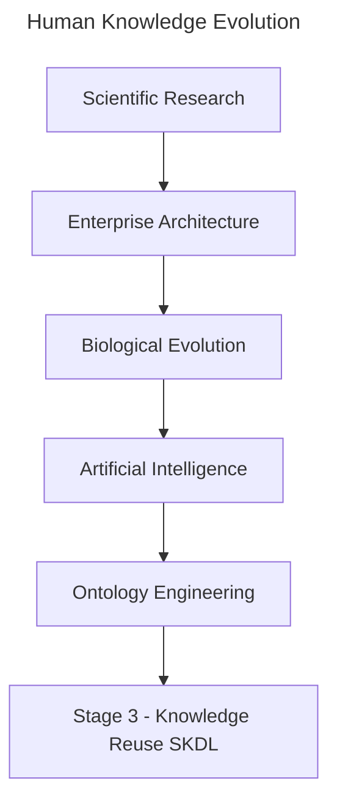

# Chapter 18 -- Knowledge Reuse: Stage 3 of the Semantic Knowledge Development Lifecycle

**Reusing Semantic Knowledge Through OWL Design Patterns**

> *"Knowledge becomes truly valuable not when it is created once, but when it can be reused many times.*

The first two stages of the **Semantic Knowledge Development Lifecycle (SKDL)** established the semantic foundations of ontology engineering.

During **Stage 1 -- Conceptual Modeling**, we identified the concepts that define a knowledge domain and organized them into a coherent semantic taxonomy.

During **Stage 2 -- Semantic Description**, we enriched those concepts with formal meaning using **Description Logic (DL)**, OWL restrictions, and class expressions

By the end of **Chapter (17)**, our ontology was no longer simply a collection of class names.

It had become a **formal semantic knowledge model** whose concepts possess machine-understandable meaning.

At this point, however, another important engineering question naturally arises:

> **Once semantic knowledge has been created, how should it be managed as the ontology continues to grow?**

Should every new concept independently redefine knowledge that already exists?

Should ontology engineers repeatedly recreate similar semantic descriptions?

Or should previously established semantic knowledge itself become a reusable engineering asset?

Professional ontology engineering adopts the **third approach**.

Rather than viewing semantic definitions as isolated pieces of modeling work, mature ontologies treat them as **reusable knowledge assets** that can be shared, extended, specialized, and maintained systematically across the entire knowledge base.

This philosophy introduces **Stage 3 -- Knowledge Reuse** of the Semantic Knowledge Development Lifecycle (SKDL).

The objective of this stage is not to create additional semantic knowledge simply for its own sake.

Instead, it is to organize semantic knowledge so that it can be **reused consistently**, reducing duplication while improving maintainability, scalability, and long-term semantic quality.

Within the **Executable Knowledge Architecture (EKA)**, this transition represents another important increase in engineering maturity.

Knowledge is no longer viewed merely as information stored within an ontology.

Instead, semantic knowledge begins evolving into a reusable engineering asset capable of supporting
- multiple concepts,
- multiple ontologies,
- multiple applications, and
- eventually multiple intelligent systems.

Beginning with **Exercise 16** from the *Protégé 5 New OWL Pizza Tutorial*, this chapter explores how OWL enables semantic reuse through inheritance, logical abstraction, reusable modeling patterns, and carefully designed class definitions.

Along the way, we will examine knowledge reuse from multiple complementary perspectives, including software engineering, Enterprise Architecture, scientific research, biological evolution, mathematical abstraction, and modern Artificial Intelligent.

By the end of this chapter, you will recognize that **knowledge reuse is far more than another OWL modeling technique**.

It represents one of the universal engineering principles through which human knowledge continuously grows, evolves, and accumulates over time.



Whether knowledge is transmitted through scientific publications, enterprise architecture repositories, biological genomes, AI foundation models, or semantic ontologies, the underlying principle remains the same:

> **Progress is achieved not by repeatedly creating knowledge, but by continuously reusing, refining, and extending the knowledge that already exists.**

---

Table of Contents

- [18.1 Introduction -- From Individual Knowledge to Reusable Knowledge](#181-introduction----from-individual-knowledge-to-reusable-knowledge)
- [18.2 Learning Objectives](#182-learning-objectives)
- [18.3 Position Within SKDL -- Stage 3 Highlighted](#183-position-within-skdl----stage-3-highlighted)
- [18.4 Exercise 16 -- Reusing Semantic Knowledge](#184-exercise-16----reusing-semantic-knowledge)
- [18.5 Why Knowledge Reuse Matters](#185-why-knowledge-reuse-matters)
- [18.6 Interesting Reading -- Knowledge Reuse Across Science, Engineering, Nature, and AI](#186-interesting-reading----knowledge-reuse-across-science-engineering-nature-and-ai)
- [18.7 Reusing Semantic Design Patterns in OWL](#187-reusing-semantic-design-patterns-in-owl)
- [18.8 Mathematical Perspective -- Reuse Through Abstraction](#188-mathematical-perspective----reuse-through-abstraction)
- [18.9 Engineering Perspective -- Reuse Before Reinvention](#189-engineering-perspective----reuse-before-reinvention)
- [18.10 Enterprise Architecture Perspective -- Reuse Before Buy Before Build](#1810-enterprise-architecture-perspective----reuse-before-buy-before-build)
- [18.11 EKA Perspective -- From Individual Knowledge to Shared Knowledge Assets](#1811-eka-perspective----from-individual-knowledge-to-shared-knowledge-assets)
- [18.12 Engineering Guidelines for Knowledge Reuse](#1812-engineering-guidelines-for-knowledge-reuse)
- [18.13 Key Concepts](#1813-key-concepts)
- [18.14 Chapter Summary](#1814-chapter-summary)
- [18.15 Looking Ahead -- Toward Semantic Governance](#1815-looking-ahead----toward-semantic-governance)


## 18.1 Introduction -- From Individual Knowledge to Reusable Knowledge

One of the defining characteristics of human civilization is that **knowledge accumulates through reuse rather than continual reinvention**.

Very few ideas are created in complete isolation.

Instead, almost every advance builds upon knowledge that already exists.

Scientists extend previous discoveries through research and citation.

Engineers improve proven designs rather than redesigning every component from first principles.

Software developers reuse libraries, frameworks, and design patterns instead of repeatedly implementing identical functionality.

Enterprise architects organize reusable business capabilities, reference architectures, and architectural building blocks that can support numerous initiatives across an organization.

Even biological evolution follows the same principle.

Rather than redesigning living organisms from the beginning, evolution preserves successful genetic information across generations while gradually introducing variation through mutation and natural selection.

Modern Artificial Intelligence demonstrates a remarkably similar pattern.

Foundation models learn from enormous collections of accumulated human knowledge, while techniques such as **transfer learning, Retrieval-Augmented Generation (RAF)**, and **knowledge distillation** continually reuse previous acquired knowledge to solve new problems more effectively.

Although these disciplines appear unrelated, they all reflect the same underlying engineering principle:

> **Progress is achieved not by repeatedly creating knowledge, but by continuously reusing, refining, and extending existing knowledge.**

Ontology engineering is no exception.

After completing **Stage 2 -- Semantic Description**, the `Pizza` ontology now contains its first meaningful semantic definitions.

For example, `MargheritaPizza` is no longer merely a concept within a taxonomy.

It possesses formal semantic descriptions through restrictions such as:

```text
hasTopping some MozzarellaTopping
hasTopping some TomatoTopping
```

These restrictions successfully describe one particular pizza.

However, an important engineering challenge immediately appears.

As the ontology expands from a handful of concepts to hundreds -- or even millions -- of concepts, should ontology engineers repeatedly recreate similar semantic definitions?

Or should those semantic descriptions themselves become reusable knowledge assets?

This question motivates **Stage 3 -- Knowledge Reuse** of the Semantic Knowledge Development Lifecycle (SKDL).

**Knowledge reuse** extends the engineering principles established in the previous chapters.

- **Stage 1** introduced reusable conceptual abstractions through semantic taxonomies.
- **Stage 2** introduced reusable logical constructors through Description Logic (DL).
- Now **Stage 3** goes one step further by creating **semantic knowledge itself as reusable**.

Rather than viewing each class definition as an isolated modeling exercise, ontology engineers identify semantic patterns that can be shared consistently across many concepts.

As ontologies continue to grow, this shift becomes increasingly important.

Without systematic, reuse, semantic models gradually accumulate duplicated restrictions, inconsistent definitions, unnecessary maintenance effort, and increasingly governance complexity.

Small educational ontologies may tolerate such duplication

Large enterprise knowledge graphs containing tens of thousands of concepts **CANNOT**.

Knowledge reuse therefore should not be viewed simply as a convenient modeling technique.

It represents a fundamental engineering discipline for controlling semantic complexity while enabling ontologies to evolve sustainably over long periods of time.

This engineering philosophy is familiar across many mature disciplines.

Enterprise Architecture promotes the principle of **Reuse before Buy before Build**, encouraging organizations to maximize the value of existing architectural assets before acquiring or constructing new solutions.

Scientific research measures impact not only by creating new knowledge, but also by how frequently that knowledge is reused and extended through subsequent publications.

Likewise, successful ontologies are characterized not by the number of concepts they contain, but by the extent to which their semantic knowledge can be reused consistently throughout the knowledge base.

**Exercise 16** introduces this principle through a seemingly simple modeling activity.

Rather than creating entirely new semantic definitions from scratch, we begin constructing new ontology concepts by reusing semantic structures that already exist.

Although the practical exercise requires only a small number of operations within Protégé, its engineering significance extends far beyond the user interface.

It introduces one of the defining characteristics of every mature engineering discipline:

> **Well-designed knowledge should be created once, reused many times, and refined only when necessary.**

Throughout this chapter, we will examine knowledge reuse from practical, engineering, mathematical, architectural, biological, and artificial intelligence perspectives.

By the end of the chapter, you will recognize that reusable semantic knowledge is more than a modeling convenience.

It is a **reusable knowledge asset** -- one that enables ontologies, enterprise architectures, scientific knowledge, AI systems, and even biological life to grow in complexity while remaining coherent, maintainable, and sustainable.

## 18.2 Learning Objectives

## 18.3 Position Within SKDL -- Stage 3 Highlighted

## 18.4 Exercise 16 -- Reusing Semantic Knowledge

## 18.5 Why Knowledge Reuse Matters

## 18.6 Interesting Reading -- Knowledge Reuse Across Science, Engineering, Nature, and AI

## 18.7 Reusing Semantic Design Patterns in OWL

## 18.8 Mathematical Perspective -- Reuse Through Abstraction

## 18.9 Engineering Perspective -- Reuse Before Reinvention

## 18.10 Enterprise Architecture Perspective -- Reuse Before Buy Before Build

## 18.11 EKA Perspective -- From Individual Knowledge to Shared Knowledge Assets

## 18.12 Engineering Guidelines for Knowledge Reuse

## 18.13 Key Concepts

## 18.14 Chapter Summary

## 18.15 Looking Ahead -- Toward Semantic Governance

---

Last updated at: 2026-08-05