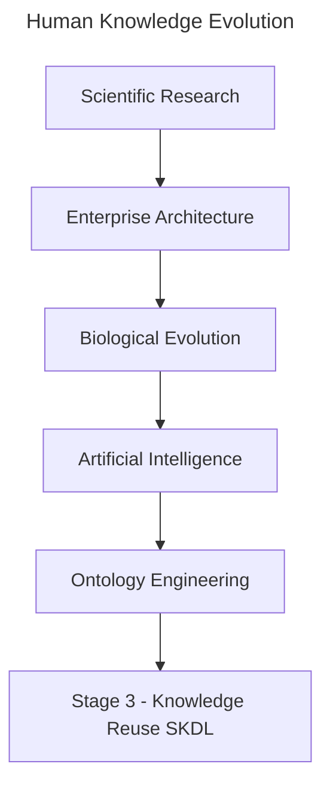

# Chapter 18 -- Knowledge Reuse: Stage 3 of the Semantic Knowledge Development Lifecycle

**Reusing Semantic Knowledge Through OWL Design Patterns**

> *"Knowledge becomes truly valuable not when it is created once, but when it can be reused many times.*

The first two stages of the **Semantic Knowledge Development Lifecycle (SKDL)** established the foundations of ontology engineering.

In **Stage 1 -- Conceptual Modeling**, we identified the concepts that define a knowledge domain and organized them into a coherent semantic taxonomy.

In **Stage 2 -- Semantic Description**, we enriched those concepts with formal meaning using Description Logic (DL), OWL restrictions, and class expressions

At this point, our ontology is capable of representing knowledge with precision and consistency.

However, another important engineering question naturally arises:

> **Should every new ontology repeatedly define the same knowledge from scratch?**

Professional ontology engineering answers this question with a clear **NO**.

Instead of repeatedly recreating existing semantic knowledge, mature ontology engineers seek to **reuse**, **extend**, and **specialized** proven knowledge assets whenever possible.

This philosophy is not unique to ontology engineering.

Throughout science, engineering, enterprise architecture, biology, and modern artificial intelligence, progress depends far more on **knowledge reuse** than on continual reinvention.

- Scientific discoveries build upon earlier research.
- Organizations reuse proven architectural assets before investing in new solutions.
- Biological evolution preserves successful genetic structures while adapting them to new environments.
- Large Language Models reuse previously learned representations through transfer learning, fine-tuning, retrieval-augmented generation (RAG), and knowledge distillation.

Across every mature discipline, complexity grows because knowledge accumulates rather than being recreated.

Ontology engineering following exactly the same principle.

Once semantic knowledge has been carefully designed, validated, and understood, it should become a **reusable asset** that can be shared across concepts, ontologies, projects, organizations, and even industries.

Knowledge reuse therefore represents much more than a modeling convenience.

It improves semantic consistency, reduces duplication, lowers maintenance costs, simplifies governance, and enables knowledge to evolve systematically over time.

Within the **Executable Knowledge Architecture (EKA)** framework, reusable semantic knowledge also represents an important step toward building executable knowledge systems whose intelligence can be shared across multiple applications rather than remaining isolated within individual models.

This chapter introduces **Stage 3 -- Knowledge Reuse** of the Semantic Knowledge Development Lifecycle.

Beginning with **Exercise 16** from the *Protégé 5 New OWL Pizza Tutorial*, we will explore how OWL supports semantic reuse through reusable modeling patterns, inheritance, and logical abstraction.

From there, we will examine knowledge reuse from multiple complementary perspectives, including
- software engineering,
- Enterprise Architecture,
- scientific research,
- biological evolution,
- mathematical abstraction, and
- modern Artificial Intelligence.

By the end of this chapter, you will recognize that **knowledge reuse is not simply another OWL modeling technique**.

It is one of the fundamental engineering principles underlying the growth of human knowledge itself.

Whether knowledge is transmitted through scientific publications, enterprise architecture repositories, biological genomes, AI foundation models, or semantic ontologies, the underlying principle remains the same:

> **Progress is achieved not by repeatedly creating knowledge, but by continuously reusing, refining, and extending the knowledge that already exists.**

In summary view:

---

Last updated at: 2026-08-05